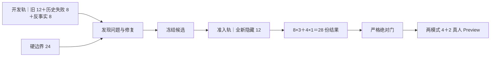

# GI-088 评测资产｜先回应后整理与长等待根因当前入口

- 文档职责：证据索引
- 文档状态：现役
- 最后核验：`2026-08-19`
- 权威入口：[生成式访谈重构总 Map](../../../docs/generative-interview-refactor-map.md)

版本：`v2.9 真实纠正后继续 No-Go＋v2.8.1 No-Go 父证据`

状态：`v2.9 真实 CONTINUE Low＋High 2/2 完成；纯时间 5852ms 通过，High 合同失败使整体技术门为 false；Low Codex minor，Codex 与产品均裁决完整回合 fail，本轮 No-Go；后续 4 not_run。页面、Preview 与发布 not_run；Production baseline`

现行职责、单一回答焦点规则和旧身份边界统一读取[板块 7 当前运行合同](../../../docs/technical/interview-event-centered/07-board7-model-led-semantic-implementation.md)。本目录中的原始回执继续保存当时请求、失败码和调用事实。

适用总规范：[Daily Light AI 评测总规范 v1.0](../../../docs/ai-evaluation-standard.md)

当前专项：[生成式访谈质量评测 v1](../../../docs/technical/interview-event-centered/04j-generative-quality-evaluation-v1.md)

## 0. 当前任务

当前结果入口为[回应优先 v2.9 真实纠正后继续结果交接](./response-first-v2-9-causal-continuation-gate-v1-handoff.md)。冻结计划继续保存运行前输入字节；执行结果确认 High 没有形成覆盖判断或开放目标。公开区只保存身份、指纹、状态和数量，私有正文继续隔离。

### 回应优先 v2.9 当前任务

- 候选：`2026-08-19.gi088-response-first-v2-9-separated-open-gap-high`
- 运行族：`2026-08-19.gi088-response-first-v2-9-two-turn-causal-quality-v1`
- 已完成父运行：`2026-08-19.gi088-response-first-v2-9-correction-gate-v1`
- 当前运行：`2026-08-19.gi088-response-first-v2-9-causal-continuation-gate-v1`
- 预算：总上限 `7`；纠正题 High 已完成 `1/1`，真实 CONTINUE Low＋High 已完成 `2/2`，后续 `4 not_run`；并发 1，重试、恢复、回退 `0`
- 首题结果：HTTP 200／stop、合同有效；High `3325ms`、观察两段 `6666ms`；completion `151/4000`；开放任务为空、保存一条 `U3` 纠正认识，High 可见理解为空、问题 `0`
- 首题停止门：Codex 初评与产品负责人裁决均为 `pass`
- 冻结项：v2.2 Low、`deepseek-v4-pro`、High Thinking 关闭、`maxTokens=4000`、数据与时间门
- 当前结果：Low 有效、`3967ms`、Codex `minor`；High HTTP 200／stop／完整 JSON、`1885ms`，三项状态合同失败；纯时间 `5852ms` 通过，整体技术门 `false`；Codex 与产品均裁决完整回合 `fail`
- 当前状态：`No-Go / stop`；`RPR-LC-21` 等后续四题继续 `not_run`
- 发布边界：页面、Preview、提交、推送和部署均为 `not_run`；Production 保持 `event_centered + baseline`
- [v2.9 公开启动卡](./response-first-v2-9-correction-gate-v1-start-card.json)
- [v2.9 当前回执](./response-first-v2-9-correction-gate-v1-receipt.json)
- [v2.9 首题结果交接](./response-first-v2-9-correction-gate-v1-handoff.md)
- [v2.9 阶段账](./response-first-v2-9-stage-ledger-v1.json)
- [v2.9 真实 CONTINUE 启动卡](./response-first-v2-9-causal-continuation-gate-v1-start-card.json)
- [v2.9 真实 CONTINUE 回执](./response-first-v2-9-causal-continuation-gate-v1-receipt.json)
- [v2.9 真实 CONTINUE 结果交接](./response-first-v2-9-causal-continuation-gate-v1-handoff.md)
- [v2.9 真实 CONTINUE 阶段账](./response-first-v2-9-causal-continuation-stage-ledger-v1.json)

### 回应优先 v2.8.1 父结果

产品负责人已将 v2.8 首题裁决为 `minor`；v2.8.1 随后使用实际 A3、重放 post-state 与 U4 完成真实 Low → High，调用 `2/2`。Low 有效且 Codex 可见质量初评通过；High 合同失败且重复询问已有答案，Codex 与产品负责人均裁决 fail，整体 `No-Go / stop`。

### 回应优先 v2.8.1 当前任务

- 候选／运行身份：`2026-08-19.gi088-response-first-v2-8-correction-persistence-high`／`2026-08-19.gi088-response-first-v2-8-1-causal-continuation-probe-v1`
- 计划指纹：`26604324a6ec4e52e83d89f048bfd196d5f33a079b07beefea79978ad0791600`
- 验证范围：仅 `RPR-REAL-19-CONTINUE`；先生成实际 Low，再把实际 Low、首题实际气泡和重放 post-state 交给 High
- 父门：产品负责人将 v2.8 首题判为 `minor`
- 新账：Low `1`＋High `1`，已消费 `2/2`；重试、恢复、回退 `0`
- Prepare 结果：父 start card 计划指纹重算通过；父 raw High 重解析和校验通过；post-state 重新投影且哈希一致；公开启动卡、回执和 `0600` 私有账本已生成
- Low 结果：有效、`5798ms`，Codex 可见质量初评 pass
- High 结果：HTTP 200／stop、`5864ms`、completion `358` Token；状态动作合同失败，无 post-state；可见问题重复索取 U1 已回答案例，Codex fail
- 时间与 Token：客观两段 `11662ms`；`4000` Token 上限未触发
- 当前结论：产品负责人裁决 `fail`，整体 `No-Go / stop`
- 血缘保护：绑定首题 response／post-state 哈希；High 输入将在放行后绑定本次 Low
- 第二停止门：两次调用后立即交付完整原文，不连跑其他案例
- [v2.8.1 公开启动卡](./response-first-v2-8-1-causal-continuation-probe-v1-start-card.json)
- [v2.8.1 当前回执](./response-first-v2-8-1-causal-continuation-probe-v1-receipt.json)
- [v2.8.1 结果交接](./response-first-v2-8-1-causal-continuation-probe-v1-handoff.md)
- [v2.8.1 阶段账](./response-first-v2-8-1-stage-ledger-v1.json)
- [v2.8.1 当前专项](../../../docs/plans/2026-08-19-gi088-response-first-v2-8-1-causal-continuation-probe.md)

### 回应优先 v2.8 High 首题父证据

- 候选／运行身份：`2026-08-19.gi088-response-first-v2-8-correction-persistence-high`／`2026-08-19.gi088-response-first-v2-8-correction-persistence-high-quality-v1`
- 首题结果：HTTP 200、`finishReason=stop`、合同有效；High `4.445s`、两段 `7.786s`，45／60 秒门均通过
- 状态结果：审计 `persist`，引用 `U3`、标记 `A2` 被替代；主线 `set_new`、认识 `add`，真实 post-state 已生成
- 可见与初评：冻结 Low 保持，High 可见理解 `null`、问题 `0`；可见体验和纠正持久化 pass，状态职责 minor，产品负责人最终裁决 `minor`
- 原账：最多 `6` 次，当前 `1/6`，其余 `5 retired_not_run`
- 当前停止点：产品负责人已裁决 `fail`，停止后续模型调用
- 发布边界：页面接入、Preview 与 Production 变更等待离线质量门
- [v2.8 公开启动卡](./response-first-v2-8-correction-persistence-high-quality-v1-start-card.json)
- [v2.8 公开结果回执](./response-first-v2-8-correction-persistence-high-quality-v1-receipt.json)
- [v2.8 首题结果交接](./response-first-v2-8-correction-persistence-high-quality-v1-handoff.md)
- [v2.8 阶段账](./response-first-v2-8-stage-ledger-v1.json)
- [v2.8 历史专项](../../../docs/plans/2026-08-19-gi088-response-first-v2-8-correction-persistence-high.md)

### 回应优先 v2.7 High 父证据

- 候选／运行身份：`2026-08-19.gi088-response-first-v2-7-thinking-disabled-audited-high`／`2026-08-19.gi088-response-first-v2-7-thinking-disabled-audited-high-quality-v1`
- 唯一主要因素：High `thinking enabled→disabled`；Thinking 关闭时省略 `reasoningEffort`
- 固定因素：v2.2 冻结 Low、六题输入、`deepseek-v4-pro`、`maxTokens=4000`、v2.6 Prompt／Interview Skill、候选问题自答审计、JSON、状态合同、可见投影、两段式和 60 秒硬门
- 首题结果：HTTP 200、`finishReason=stop`、合同有效；High `1.847s`、两段 `5.188s`，45／60 秒门均通过；reasoning 正文缺失、Token 为 `null`
- 分层初评：理解 `null`、问题 `0`、审计候选 `0`；可见 Low-only 体验 Codex pass，完整 High 因纠正未保存而 Codex fail，产品负责人裁决 pending
- 新账：最多 `6` 次，当前 `1/6`，其余 `5 not_run`
- 当前停止点：完整 High 的 Codex 质量门失败，其余五题停止；等待产品负责人完成 `RPR-REAL-19-CORRECTION` 原文裁决
- 失败依据：本题 `taskChange=unchanged`、`understandingChange=none`，纠正未保存；CONTINUE 夹具预置主线与认识，存在因果断点
- 发布边界：页面接入、Preview 与 Production 变更等待离线质量门
- [v2.7 公开启动卡](./response-first-v2-7-thinking-disabled-audited-high-quality-v1-start-card.json)
- [v2.7 公开结果回执](./response-first-v2-7-thinking-disabled-audited-high-quality-v1-receipt.json)
- [v2.7 首题结果交接](./response-first-v2-7-thinking-disabled-audited-high-quality-v1-handoff.md)
- [v2.7 阶段账](./response-first-v2-7-stage-ledger-v1.json)
- [v2.7 历史执行专项](../../../docs/plans/2026-08-19-gi088-response-first-v2-7-thinking-disabled-audited-high.md)

### 回应优先 v2.6 High 结果证据

- 候选／运行身份：`2026-08-19.gi088-response-first-v2-6-low-effort-audited-high`／`2026-08-19.gi088-response-first-v2-6-low-effort-audited-high-quality-v1`
- 唯一主要因素：High `reasoningEffort high→low`
- 固定因素：v2.2 冻结 Low、六题输入、模型、Thinking 开启、`maxTokens=4000`、v2.5 候选问题自答审计、状态合同、可见投影、两段式和 60 秒硬门
- 新账：最多 `6` 次，当前 `1/6`；其余 `5 not_run`
- 当前停止点：首题速度 No-Go，按完整原文、Low、High、技术事实和 Codex 初评交付产品负责人，等待语义裁决
- 发布边界：页面接入、Preview 与 Production 变更等待离线质量门
- [v2.6 公开启动卡](./response-first-v2-6-low-effort-audited-high-quality-v1-start-card.json)
- [v2.6 公开结果回执](./response-first-v2-6-low-effort-audited-high-quality-v1-receipt.json)
- [v2.6 首题结果交接](./response-first-v2-6-low-effort-audited-high-quality-v1-handoff.md)
- [v2.6 阶段账](./response-first-v2-6-stage-ledger-v1.json)
- [v2.5 公开启动卡](./response-first-v2-5-question-self-answer-high-quality-v1-start-card.json)
- [v2.5 技术结果回执](./response-first-v2-5-question-self-answer-high-quality-v1-receipt.json)
- [v2.5 结果交接](./response-first-v2-5-question-self-answer-high-quality-v1-handoff.md)
- [v2.5 阶段账](./response-first-v2-5-stage-ledger-v1.json)
- [v2.6 历史执行专项](../../../docs/plans/2026-08-19-gi088-response-first-v2-6-low-effort-audited-high.md)

### 回应优先 v2.2 复核通过后继续执行

- Low 候选保持 `2026-08-17.gi088-response-first-v2-2-factual-low`
- 新数据集：`2026-08-17.gi088-response-first-six-real-checkpoints-v1-3-product-owner-rubric`
- Low 六题运行：`2026-08-17.gi088-response-first-v2-2-low-full-quality-v2`，调用 `6/6`，产品负责人裁决 `6/6 pass`
- High：`2026-08-17.gi088-response-first-v2-3-high-quality-v1`，消费 `1/9`，第 1 题合同失败后停止，其余 `8 not_run`
- High Token 探针：`2026-08-17.gi088-response-first-v2-3-high-token-4000-probe-v1`，消费 `1/1`；完整 JSON、状态合同失败；产品负责人裁决内部认识 pass、可见空追加 minor、完整链路 No-Go
- v2.4 High：`2026-08-17.gi088-response-first-v2-4-null-task-aligned-high-quality-v1`，首题 `1/6`；状态合同通过，Codex 与产品负责人内容裁决均为 fail，No-Go
- [产品负责人三题覆盖裁决](./response-first-v2-2-product-owner-checkpoint-review-v2.json)
- [继续执行阶段账](./response-first-v2-2-v2-3-stage-ledger-v3.json)
- [Low 六题公开启动卡](./response-first-v2-2-low-full-quality-v2-start-card.json)
- [Low 六题公开结果回执](./response-first-v2-2-low-full-quality-v2-receipt.json)
- [Low 六题结果交接](./response-first-v2-2-low-full-quality-v2-handoff.md)
- [High 启动卡](./response-first-v2-3-high-quality-v1-start-card.json)
- [High 结果回执](./response-first-v2-3-high-quality-v1-receipt.json)
- [High 状态修正回执](./response-first-v2-3-high-quality-v1-runner-fix.json)
- [High 结果交接](./response-first-v2-3-high-quality-v1-handoff.md)
- [High 4000 Token 探针启动卡](./response-first-v2-3-high-token-4000-probe-v1-start-card.json)
- [High 4000 Token 探针结果回执](./response-first-v2-3-high-token-4000-probe-v1-receipt.json)
- [High 4000 Token 探针结果交接](./response-first-v2-3-high-token-4000-probe-v1-handoff.md)
- [v2.4 启动卡](./response-first-v2-4-null-task-aligned-high-quality-v1-start-card.json)
- [v2.4 结果回执](./response-first-v2-4-null-task-aligned-high-quality-v1-receipt.json)
- [v2.4 阶段账](./response-first-v2-4-stage-ledger-v1.json)
- [v2.4 首题交接](./response-first-v2-4-null-task-aligned-high-quality-v1-handoff.md)
- [当前执行专项](../../../docs/plans/2026-08-17-gi088-response-first-v2-2-review-go-continuation.md)

### 回应优先 v2.3 High `4000` Token 探针当前结果

- 候选／运行身份：`2026-08-17.gi088-response-first-v2-3-grounded-high-max4000`／`2026-08-17.gi088-response-first-v2-3-high-token-4000-probe-v1`
- 计划指纹：`bf1876287e5973268db7465ba63a8a536c68eaf33b4bb3994054e3498cee3e89`
- 唯一变化：High `maxTokens 2000→4000`；调用 `1/1`，重试／恢复／回退 `0`
- 完整性：HTTP 200、模型正确、`finishReason=stop`；completion `2072`、reasoning `1898`，完整 JSON `596` 字符
- 耗时：High `37.066s`，两段合计 `40.407s`；45 秒目标与 60 秒硬门均达到
- Token 结论：本题截断解决；`4000` 不承担其余案例必然完整的结论
- 合同结果：`NULL_WORKING_TASK_UNDERSTANDING_DELTA_MUST_BE_NULL`，合同有效 `0/1`
- 用户可见追加：理解为空、问题 `0`；当前按 Low-only 完成
- 内容：产品负责人裁决内部认识 pass、可见空追加 minor；完整链路因状态合同失败 No-Go
- 费用：估算 `¥0.0127198`，实际供应商账单待回执

### 回应优先 v2.3 High 当前结果

- 候选／运行身份：`2026-08-17.gi088-response-first-v2-3-grounded-high`／`2026-08-17.gi088-response-first-v2-3-high-quality-v1`
- 计划指纹：`a2076f0a27c5a10f5a3a2827027d23a7db4ff83d35282cad59cf62e473cf96bc`
- 固定 Low：`2026-08-17.gi088-response-first-v2-2-low-full-quality-v2`，计划指纹 `0417cc3bbe704e8043b2065d2cf3fe902da51ad5a93a773ffc52b0a47780b8cf`
- 调用：检查点 `1/3`、完整六题 `0/6`；累计 `1/9`，其余 `8 not_run`；重试／恢复／回退 `0`
- 第 1 题：HTTP 200、模型正确；High `38.384s`，两段合计 `41.725s`
- 完整性：completion `2000`、reasoning `1985`、`finishReason=length`、可见 JSON `42` 字符；解析失败，合同有效 `0/1`
- 内容：High 语义质量 `not_evaluated`
- 费用：本次 High 估算 `¥0.017619`；继续执行 Low＋High 累计估算 `¥0.029784`，实际供应商账单待回执
- 停止：检查点 No-Go；其余 High、页面接入、提交、推送、部署和 Preview 均为 `not_run`

### 回应优先 v2.2 Low 完整六题当前结果

- 运行身份：`2026-08-17.gi088-response-first-v2-2-low-full-quality-v2`
- 计划／候选／数据集指纹：`0417cc3bbe704e8043b2065d2cf3fe902da51ad5a93a773ffc52b0a47780b8cf`／`c0e99522ac8b0b2e252d3f7c8abf32e0fd364301609c5d79cc874712f27cb01f`／`25ab2ec7665d185f7dacf4eceb184e1a6be9ff2909ad93252f7ec97b035c3c32`
- 技术结果：调用 `6/6`，HTTP 200、合同有效、完整返回和 15 秒目标均为 `6/6`；重试／恢复／降级 `0`
- 耗时：`2.882 / 3.341 / 6.178 / 3.580 / 4.014 / 4.188s`，中位数 `3.797s`
- Token 与费用：prompt `6391`、completion `736`、总计 `7127`；按冻结价估算 `¥0.012165`，Provider 实际账单金额待回执
- 内容：Codex 原文后初评 `5 pass / 1 minor / 0 fail`；产品负责人裁决 `6 pass / 0 minor / 0 fail`，Low 质量门 Go
- 零调用验证：相关回归 `37/37`、类型检查、定向 Lint、JSON、公开正文隔离、私有文件权限、文档检查与差异格式通过
- 阶段结果：六条 Low 输出保持冻结；后续 High 的合同失败不改写 Low `6/6 pass` 结论

### 回应优先 v2.2 Low 三题历史过程结果

- 候选／运行身份：`2026-08-17.gi088-response-first-v2-2-factual-low`／`2026-08-17.gi088-response-first-v2-2-low-quality-v1`
- 计划／候选／数据集指纹：`da8fbf667f42f49053c18bc822bc9a777cc9f9671e07c1824342fd0a7ecd811f`／`c0e99522ac8b0b2e252d3f7c8abf32e0fd364301609c5d79cc874712f27cb01f`／`59d524f8e932712d7f0c761847c94ce7abe7e552ad44f144f8a25d96230248cc`
- 实际调用：三题检查点 `3/3`；v2.2 完整六题 `0/6 not_run`；v2.3 `0/9 not_run`；重试／恢复／降级 `0`
- 技术与速度：`3/3` 有效；耗时 `4.016 / 2.812 / 3.854s`，中位数 `3.854s`
- Token 与费用：prompt `3261`、completion `326`、总计 `3587`；按项目 `2026-08-10` 冻结价估算 `¥0.011739`，Provider 回执未返回实际账单金额
- 内容：Codex 私有初评 `1 pass / 0 minor / 2 fail`；产品负责人查看用户输入与 AI 输出后裁决 `2 pass / 0 minor / 1 fail`。新纠正与关系题通过，唯一失败为纠正后继续重复复述
- 停止：新离线账 `3/18`，其余 `15 not_run`；产品六卡、产品接入、提交、推送、部署和 Preview `not_run`
- [公开启动卡](./response-first-v2-2-low-quality-v1-start-card.json)
- [公开结果回执](./response-first-v2-2-low-quality-v1-receipt.json)
- [运行器修正回执](./response-first-v2-2-low-quality-v1-runner-fix.json)
- [产品负责人三题裁决](./response-first-v2-2-product-owner-checkpoint-review-v1.json)
- [阶段总账](./response-first-v2-2-v2-3-stage-ledger.json)
- [结果交接](./response-first-v2-2-low-quality-v1-handoff.md)

### 回应优先 v2.1 Low 结果

- 运行身份：`2026-08-17.gi088-response-first-v2-1-low-quality-v1`
- 计划指纹：`82f837837f600127dd18b1ce55d145b69dc4928f6b039967e1b778c893d5fe68`
- 候选指纹：`a4f295005dd130b3d3eb4b213a0756e790064971c4056b5bb5592234e59fe94d`
- 数据集指纹：`59d524f8e932712d7f0c761847c94ce7abe7e552ad44f144f8a25d96230248cc`
- 运行设置：`deepseek-v4-pro`、Thinking Low、plain text、`maxTokens=1280`、并发 1、重试／恢复／降级 0
- 实际调用：三题检查点 `3/3`；完整六题 `0/6 not_run`；重试／恢复／降级 `0`
- 技术与速度：`3/3` 有效，耗时 `4.848 / 4.664 / 4.960s`，中位数 `4.848s`；均为 `finishReason=stop`
- 内容：Codex 私有初评 `0 pass / 0 minor / 3 fail`；重复承接和无依据推测仍未通过
- 停止：全计划 `3/35`，其余 `32 not_run`；产品接入、提交、推送和 Preview `not_run`
- [公开启动卡](./response-first-v2-1-low-quality-v1-start-card.json)
- [公开结果回执](./response-first-v2-1-low-quality-v1-receipt.json)
- [运行器修正回执](./response-first-v2-1-low-quality-v1-runner-fix.json)
- [阶段总账](./response-first-v2-1-stage-ledger.json)
- [结果交接](./response-first-v2-1-low-quality-v1-handoff.md)

### 回应优先 v2 Low 六题结果

- 运行身份：`2026-08-16.gi088-response-first-v2-low-quality-v1`
- 计划指纹：`ddd49630bd7f3a447f0f8331fa4a0122b26edf865503dc6f611facb664539623`
- 调用：`6/6`；总耗时 `2.829 / 5.523 / 4.174 / 2.693 / 3.572 / 3.483s`
- 合同：`5/6`；纠正刚出现案例因 Token 上限截断
- 内容：Codex 私有初评 `3 pass / 0 minor / 3 fail`
- 停止：追问 A/B、职责 A/B、完整质量门、条件性思考强度、产品接入和 Preview 均为 `not_run`
- 工程：全量测试 `3385` 通过、`10` 跳过；类型检查、Prisma、文档检查与生产构建通过；Lint `0` 错误、`45` 警告
- [公开启动卡](./response-first-v2-low-quality-v1-start-card.json)
- [公开结果回执](./response-first-v2-low-quality-v1-receipt.json)
- [运行器修正回执](./response-first-v2-low-quality-v1-runner-fix.json)
- [阶段总账](./response-first-v2-stage-ledger.json)
- [结果交接](./response-first-v2-low-quality-v1-handoff.md)

以下内容继续承担 v2 的上游候选和历史运行依据。

产品负责人确认用户先得到回应与模型完整处理变快同时推进。本地候选已经把顺序改为第一段 Pro Low 生成自然回应，第二段 Pro High 完成结构化语义；程序合成两段并负责关系编号、历史来源、状态、幂等、保存和恢复。

- 候选身份：`2026-08-16.gi088-response-first-two-stage-v1`
- 候选指纹：`e806843dbcf0514d133f77818255f46f8e1a7f5a2bb6b0e8a962809f755bac96`
- 系统提示与字段：当前单段 `9128 / 14`；第一段 `478 / 2`；第二段 `7262 / 12`
- RPR-CF-02 请求投影：当前单段 `9728` 字符；第一段 `996` 字符，减少约 `89.8%`；两段合计 `9278` 字符，减少约 `4.6%`
- 验证：两段式专项 `9/9`、现有 SSE 客户端 `12/12`、类型检查与定向 ESLint 通过
- 第一门结果：身份 `2026-08-16.gi088-response-first-visible-quality-v1`；Provider 调用与技术有效 `6/6`，45 秒门和 60 秒门 `6/6`；产品裁决 `5 pass / 1 fail`，纠正硬门因同义重复追问失败
- 资产边界：`RFT-CX-01` 的模型回应通过；产品负责人判定该合成上下文表达生硬、信息过少，真实长上下文能力继续待验证
- 停止结果：后台职责 A/B `0/4 not_run`、后台质量 `0/6 not_run`、页面接入 `not_run`
- 执行边界：Judge、隐藏集、数据库、Preview、Production、推送和部署均为 `0`；候选与公开证据已进入本地阶段检查点 `30cfc03`
- [两段式公开启动卡](./response-first-two-stage-v1-start-card.json)
- [Prompt／Skill／模型／程序职责审计](./response-first-two-stage-v1-responsibility-audit.json)
- [两段式零调用交接](./response-first-two-stage-v1-handoff.md)
- [首段六题公开启动卡](./response-first-visible-quality-v1-start-card.json)
- [首段六题技术回执](./response-first-visible-quality-v1-technical-receipt.json)
- [首段六题最终回执](./response-first-visible-quality-v1-receipt.json)
- [首段六题结果交接](./response-first-visible-quality-v1-handoff.md)
- [信息增益 A/B 最终回执](./visible-information-gain-ab-v1-receipt.json)
- [信息增益 A/B 结果交接](./visible-information-gain-ab-v1-handoff.md)

可见合同负担 A/B 已固定 RPR-CF-02、Pro Low 和同一完整用户输入，按 `A-B-B-A` 比较当前完整合同 A 与第一段可见合同 B。授权与消耗 `4/4`，裁决 `visible_contract_directional_support`。

## 0.1 可见合同负担 A/B 当前结果

- 运行身份：`2026-08-16.gi088-visible-contract-burden-ab-v1`
- 计划指纹：`95c920d837984314ed92be810f1618b4c1b12f545c0265ae836024d4475d03be`
- 总耗时：A1／B1／B2／A2 为 `21.830 / 3.834 / 7.174 / 31.385` 秒
- 配对改善：`A1-B1=17.996s`；`A2-B2=24.211s`
- 技术结果：HTTP 200、合同有效、45 秒门和 60 秒门均为 `4/4`
- 负担证据：A 每次 Prompt `4,448` Token、隐藏思考 `1,565～2,282` Token；B 每次 Prompt `487` Token、隐藏思考 `74～247` Token
- 裁决：`visible_contract_directional_support`；完整合同 A 与首段可见合同 B 的中位总耗时为 `26.608 / 5.504` 秒
- 验证：新运行器 `4/4`、两段式候选 `9/9`、现有 SSE 客户端 `12/12`；类型、规则、JSON、公开边界、私有权限、文档链接与差异格式通过
- 边界：语义质量为 `not_evaluated`；本轮不拆分 Prompt、Skill、字段和输出长度各自贡献
- [可见合同负担启动卡](./visible-contract-burden-ab-v1-start-card.json)
- [可见合同负担授权卡](./visible-contract-burden-ab-v1-authorization.json)
- [可见合同负担公开结果](./visible-contract-burden-ab-v1-receipt.json)
- [可见合同负担结果交接](./visible-contract-burden-ab-v1-handoff.md)

## 0.2 响应等待合同 A/B 父证据

产品负责人已确认日常速度门和首轮单因素。当前固定 RPR-CF-02，上一事件关系解释候选为 A，`relationship_claim_status_v1` 为 B，按 `A-B-B-A` 串行；模型、Thinking high、`json_object`、输入、Provider、超时与运行时段保持一致。

- 诊断身份：`2026-08-16.gi088-response-latency-contract-ab-v1`
- 计划指纹：`d09a2f0d87395d085c2facd117c5d238b0d76d5575b3ad715d0538f312ac752d`
- 产品速度门：首个有效正文 `45s`；完整可见回答 `60s`
- 运行上限：响应头 `15s`；正文与总观察 `60s`
- 预算：授权与实际调用 `4/4`；重试／恢复／降级均为 `0`
- 结果：A1／B1／B2／A2 为 `22.687 / 26.423 / 49.455 / 33.370` 秒；45 秒门 `3/4`，60 秒门 `4/4`
- 裁决：两次 B 均较慢，配对差值为 `3.736 / 16.085` 秒；只有一组达到 10 秒方向门，合同单独归因保持开放
- 静态验证：专项测试 `15/15`，类型检查、定向 ESLint、JSON、公开内容边界和只读授权门回读通过
- [响应等待合同 A/B 公开启动卡](./response-latency-contract-ab-v1-start-card.json)
- [响应等待合同 A/B 授权卡](./response-latency-contract-ab-v1-authorization.json)
- [响应等待合同 A/B 零调用交接](./response-latency-contract-ab-v1-handoff.md)
- [响应等待合同 A/B 技术回执](./response-latency-contract-ab-v1-technical-receipt.json)
- [响应等待合同 A/B 公开结果](./response-latency-contract-ab-v1-receipt.json)
- [响应等待合同 A/B 结果交接](./response-latency-contract-ab-v1-result-handoff.md)

产品负责人已按上方计划指纹独立授权 4 次 Provider 调用，授权 SHA 为 `d32f8ed3…89589`。A-B-B-A 已执行并在额度耗尽后停止；语义质量保持 `not_evaluated`。页面端到端速度、两段式体验、Judge、独立准入、真人 Preview 与发布继续使用各自证据和授权门。

## 0.3 关系解释状态候选与两题探针父证据

`relationship_claim_status_v1` 的零调用候选和程序校验已经完成。模型需要逐条声明关系解释属于 `user_stated` 或 `hypothesis_to_confirm`，并列出使用位置；程序阻止待确认假设进入工作任务、认识变化和陈述式理解。

- 候选版本：`2026-08-16.gi088-relationship-claim-status-v1`
- 父候选指纹：`14eeb577533a4f90127887695f78f71f660e78e5d6588da65a0cea66ccdd1dc9`
- 候选指纹：`1f60ca82a6f12fb554efc780a3dc215b57fc1bf77599279ccf4ad570dee569cc`
- 策略指纹：`7b72e3180633fb114ea266bf5bcf437126690176a7df851fe1d6a81e0d45067c`
- 静态结果：候选与探针专项测试 `10/10`；相关历史链路合计 `32/32`，类型检查、定向 ESLint、JSON、文档链接、公开内容隐私和差异格式检查通过
- 探针身份：`2026-08-16.gi088-relationship-claim-status-probe-v1`
- 探针题目：`RPR-REAL-13`、`RPR-CF-02`
- 授权预算：`2/2`；并发 `1`；重试 `0`
- 运行结果：鉴权与目标模型检查通过；HTTP 200 `2/2`，正文等待超时 `2/2`，技术有效 `0/2`，内容可评价 `0/2`
- 裁决：`technical_blocked`；当前证据不判断语义通过或失败
- [两题探针启动卡](./relationship-claim-status-probe-v1-start-card.json)
- [两题探针授权卡](./relationship-claim-status-probe-v1-authorization.json)
- [两题探针技术回执](./relationship-claim-status-probe-v1-technical-receipt.json)
- [两题探针公开回执](./relationship-claim-status-probe-v1-receipt.json)
- [两题探针结果交接](./relationship-claim-status-probe-v1-result-handoff.md)

两题尚未形成可评价结果，完整 10 题开发回归继续关闭。产品负责人已否定“只提高正文等待上限”的方向；用户速度门和首轮单因素已经确认，当前状态以上方响应等待合同 A/B 启动卡为准。

以下事件关系解释 10 题复测继续承担父失败证据。

当前任务修正 RPR-REAL-13 的评价边界：用户已经表达的“外面与回家存在感受差异”可以继承；“更轻松、没负担、被支使”等具体原因和心理解释需要用户原话支持或先向用户确认。独立候选已复测原 9 道哨兵和 RPR-CF-02，预算 10/10、重试 0。HTTP 200 与技术有效均为 10/10，内容通过 9/10。

RPR-CF-02 通过，原通过题无退化；RPR-REAL-13 仍把“被支使、外面更自在、外面更轻松”等待确认解释写入已成立认识，裁决为 `factor_no_go`。该结果随后推动 `relationship_claim_status_v1`，其当前状态以上方两题探针结果为准。

- 回归集 v1.2 数据指纹：`cf04a7584d74bb7cabb235fc0cc001ac6953fb01a90364d5690284c927c85eb1`
- 新候选指纹：`14eeb577533a4f90127887695f78f71f660e78e5d6588da65a0cea66ccdd1dc9`
- 复测集合指纹：`4025192536c22cad7004a0471cfcf274069fdfb369cdb3c968a8d2dbfb7e9d1e`
- [回归集 v1.2 公开回执](./real-problem-regression-v1.2-receipt.json)
- [回归集 v1.2 交接](./real-problem-regression-v1.2-handoff.md)
- [10 题复测公开回执](./event-relationship-explanation-retest-v1-receipt.json)
- [10 题复测交接](./event-relationship-explanation-retest-v1-handoff.md)
- 私有复测报告：`.private/event-relationship-explanation-retest-v1/final-report.json`

以下 v1.1 与 9 题基线内容继续承担本轮父证据。

当前任务已修正 6 条题目并继承 24 条通过结论，回归集达到 30/30。模型基线使用 v8r2 候选 `0d5f91c0…efd6`、`deepseek-v4-pro`、Thinking high，实际调用 9 次、重试 0；Codex 已按每题主要质量标准完成内容评审。本轮停在基线报告和一个单因素建议。

- 回归集 v1.1 数据指纹：`f036425de2d60f9af81424bc2528ac80a3dd25be654888d6a3ed0865ab73dded`
- 回归集 v1.1 评审包指纹：`54b0c91aa9be3da5084113390e4799cf775d4f39a4b041732fce6f48b1846522`
- 30 条评审：`30/30` 通过；24 条继承产品负责人批量结论，6 条由 Codex 按委托复核
- 9 题基线：HTTP 200 `9/9`；技术有效 `7/9`；可评价内容 `6/7`；端到端 `6/9`
- 内容失败：`RPR-REAL-13`，模型把两个事件之间的关系和原因说得过于确定
- 技术失败：2 次 HTTP 200 后无可用正文，其中 1 次空内容、1 次正文读取超时
- 下一单因素：`relationship_claim_status_v1`
- [回归集 v1.1 公开回执](./real-problem-regression-v1.1-receipt.json)
- [回归集 v1.1 交接](./real-problem-regression-v1.1-handoff.md)
- [9 题基线公开回执](./real-problem-sentinel-baseline-v1-receipt.json)
- [9 题基线交接](./real-problem-sentinel-baseline-v1-handoff.md)
- 私有评审入口：`.private/real-problem-regression-v1.1/index.html`
- 私有基线报告：`.private/real-problem-sentinel-baseline-v1/final-report.json`

本轮已把历史真实金标库 v1.1 转成开发回归题库并完成 30/30 封存：每个历史运行分支提取 1 条固定检查点，共 22 条；再从真实母题建立 8 条用户侧单变量相邻案例，共 30 条。相邻案例不编写 Daily Light 标准回答。

- 运行身份：`2026-08-16.gi088-real-problem-regression-v1.1`
- 来源指纹：`d84dc1bcc3c75b6d5d4f7f4b9634be0139c07cd6f7804f7079ef8faf17110dba`
- 总规范 SHA：`08dc7aa28813a079c375b7e1341a9a7c8cf74b0957eddd750916dafa3e5c6c60`
- 私有评审资产：`.private/real-problem-regression-v1.1/`
- 数据集指纹：`f036425de2d60f9af81424bc2528ac80a3dd25be654888d6a3ed0865ab73dded`
- 评审包指纹：`54b0c91aa9be3da5084113390e4799cf775d4f39a4b041732fce6f48b1846522`
- 当前结果：`30/30 已确认并封存；9 题基线已完成`

- [真实问题回归集 v1.1 公开回执](./real-problem-regression-v1.1-receipt.json)
- [真实问题回归集 v1.1 交接说明](./real-problem-regression-v1.1-handoff.md)
- 私有本机评审入口：`.private/real-problem-regression-v1.1/index.html`

- [历史真实金标库无内容回执](./historical-real-gold-v1-receipt.json)
- [历史真实金标库交接说明](./historical-real-gold-v1-handoff.md)
- 私有本机入口：`.private/historical-real-gold-v1/index.html`
- v2 历史入口：`.private/real-conversation-review-v2/index.html`（已停止逐份重新裁决）
- v1 历史入口：`.private/evaluation-asset-review-v1/index.html`（只作错误交付历史快照）

隐藏 v2 当前按产品审题与开发回归材料管理；未来正式独立准入需要建设语义不同的隐藏 v3。旧 C3 的 14 张盲评包和历史回执保持原身份，不进入本轮裁决。

执行边界：历史基线真实模型调用 `9`，事件关系复测 `10`，关系状态探针 `2`，响应等待父合同 A/B `4`，可见合同负担 A/B `4`，本地两段式候选 `0`；Judge、数据库、独立准入、真人 Preview 与 Production 变更均为 `0`。可见合同负担额度已耗尽；下一步语义忠实度验证继续等待独立范围和授权。

本轮验证结果：专项与历史金标回归 `35/35`、类型检查、定向 ESLint、JSON、`docs:check`、隐私、权限和 `git diff --check` 通过；完整 ESLint 为 `0` 个错误、`44` 个既有警告。全量测试 `3313` 条通过、`10` 条跳过；一条并行运行时超时的日志扩展评审测试单独复跑后 `6/6` 通过；另有 `1` 条本轮开始前已存在的 README 运维词条冒烟失败，单独复跑仍失败。

v1 历史交付：

- 私有本机入口：`.private/evaluation-asset-review-v1/index.html`（仅作资产目录历史快照，产品评审暂停）
- [公开无内容回执](./evaluation-asset-review-v1-receipt.json)
- [评审包交接说明](./evaluation-asset-review-v1-handoff.md)
- 评审包指纹：`d70740f0…591f1bd`

当前数据原则：只认产品负责人亲自提交的历史评价；统计覆盖按 14 个话题计算，候选历史表现按 22 个运行分支计算。Judge 卡、固定语境、预设案例、隐藏题、反事实、合成案例和 Codex 评价不进入正式历史金标。

## 1. 为什么要重建

现有 GI-088 12 项已经被开发团队看过，也曾用于调整候选。它们适合持续发现问题和防止旧问题复发，无法继续承担“冻结候选此前没见过”的独立证明。

阶段 B 因此建立两条证据轨道：



开发轨可以反复使用。准入轨在候选冻结前只公开能力蓝图，人物、故事、完整对话和评分锚点留在私有评测区。

## 2. 阶段 B 已形成什么

| 资产 | 数量 | 当前用途 | 状态 |
|---|---:|---|---|
| [开发挑战集](./development-challenge-28.json) | 28 | 发现问题、单变量修复、长期回归 | 可用 |
| [硬边界回归](./hard-boundary-regression-24.json) | 24 | 控制、安全、纠正、来源、事件隔离和恢复 | 可用 |
| [Judge 开发集](./judge-calibration-20.json) | 20＋退出卡 2 | C3 判尺重构与 Judge v2 开发 | 原 Judge 20 已转为开发身份；14 张人工金标体检等待产品负责人裁决 |
| [独立准入蓝图](./independent-admission-blueprint-12.json) | 12 | 8 个标准化案例、4 条完整轨迹 | blueprint-v2 与私有正文均已冻结；正文 12/12、授权 2/2、泄漏 0，尚未授权运行 |
| [案例身份证合同](./case-identity.schema.json) | 1 | 统一案例来源、风险、隐私和身份 | 可用 |
| [数据集身份证合同](./dataset-identity.schema.json) | 1 | 统一用途、覆盖、限制和修订史 | 可用 |
| [运行身份证合同](./run-identity.schema.json) | 1 | 绑定候选、数据、判尺、Judge 和裁决 | 可用 |

完整版本和指纹见[数据集清单](./dataset-manifest.json)。阶段 B 历史结构证据见[原校验回执](./asset-validation-receipt.json)和[阶段 B 验收记录](./stage-b-acceptance.md)；阶段 B2 建设前状态保留在[历史待完成回执](./stage-b2-validation-receipt.json)，当前结果以[独立建设验收回执](./independent-admission-validation-receipt.json)为准。阶段 C 使用[授权卡](./stage-c-authorization.json)与[Judge Prompt v1](./judge-prompt-v1.md)。

## 3. 阶段 B2 收口了什么

产品负责人确认四张旧口径卡的处理后，Judge 内容校准集升级为 `2026-08-13.v2`：

- `JC-QF-04／05`继续承担多任务内容质量失败，程序拦截退出金标理由；
- `JC-SB-02／04`退出内容阻断金标，分别回到技术／端到端回归和普通多任务质量回归；
- 新增无来源长期模式推断与明确停止后继续追问两个阻断锚点；
- 20 张活跃卡继续保持四档各 5 张；停止、纠正、编造、事件串线和误停均有明确锚点；
- 7 张私有来源卡已形成最小决策窗口脱敏载荷；Judge 盲测包与金标映射分别保存，盲包原编号和金标泄漏均为 `0`。

隐藏准入蓝图同步升级为 `blueprint-v2`：8 个标准化短题按【帮我记】2、【陪我聊】6 分配，4 条完整轨迹按两模式各 2 条分配；28 份计划结果最终为【帮我记】8、【陪我聊】20。

本机私有区已经完成两条真实话题授权、撤回合同和私有数据集身份证。当前授权为 `2/2`，隐藏正文为 `12/12`，精确重复和未解决近义泄漏均为 `0`；规范化正文 SHA-256 为 `b7ce8941…12ca11`，正文与评分锚点仍只存在于 Git 排除区。

## 4. 目标 run 怎样处理

计划原本准备把 run `b816d468-e3c3-4459-a822-04f95b1e78cd` 从 `running / 0/12` 行政封存。阶段 B 的实时数据库审计发现，这条记录早在 `2026-08-11` 已经封存：

- 状态：`early_stopped`
- 轨迹：`0/12`
- 模型调用：`0`
- 人工评价修订：`0`
- revision：`1`
- 原因：运行时数据库分区修复触发新的执行指纹

阶段 B 采用历史不可改写原则，保留原原因、原指纹和原封存时间。本轮对该 run 的数据库写入为 `0`，删除为 `0`。详见[目标 run 回读](./run-disposition-readback.json)。

同一评测版本实际已有 `5` 个 run，后续 ordinal `3～5` 包含技术验收和 v8r3 No-Go 历史。它们继续保留各自证据身份，详见[运行血缘审计](./run-history-audit.json)。

## 5. 当前结论能说明什么

阶段 B 与 B2 当前已证明：

1. 两条集合轨道的身份、数量、来源和用途已经分开；
2. 开发 28 与硬边界 24 已具备完整目录身份；当前只有 8 项找到可绑定的真实对话证据，其余自包含运行输入和稳定判定方式继续待补；
3. Judge 20 v2 达到四档各 5 张，技术与内容判断轴已经分开，私有脱敏和盲测隔离已经通过；
4. 隐藏 12 的覆盖、模式、运行次数、授权、撤回和独立建设规则已经明确；
5. 公开蓝图未包含隐藏故事、人物、对话、输入或评分答案；
6. 当前实施保持模型调用、人工提交、Preview 和 Production 变更为 `0`。

当前结论继续保持在这个范围内：历史真实金标库已经恢复 14 个真实话题、22 个运行分支及产品负责人原评价；旧 70 项资产目录、12 项返工包和 C3 14 张方案保留历史身份，不再要求重复评分。阶段 B2 资产血缘保留，阶段 C2 保持技术阻断。Judge 是否合格、当前候选质量、独立准入、真人 Preview 和发布资格继续关闭并等待对应证据。

## 6. 阶段 C 执行结果

产品负责人授权的上限为 64 次调用、4 次技术补跑和 10 元。实际累计 19 次调用、4 次技术补跑、费用 0.092062 元：Plus 普通模式形成 0/20 有效结果，Plus 思考模式形成 14/20 有效结果；证据不完整，因此质量评分、两模式优选与 Max 路线均未启动。

阶段 C 结论为 `technical_blocked`。这表示当前无法判断 Judge 是否合格，不能把 14 份有效结果外推为模式质量。无内容指标、指纹和技术原因见[阶段 C 校准回执](./stage-c-calibration-receipt.json)，后续交接见[阶段 C Handoff](./stage-c-handoff.md)。

## 7. 复核方式

阶段 B2 公开资产校验：

```bash
npx tsx scripts/validate-gi088-stage-b2-assets.ts --public-only
```

当前私有工作区完整校验：

```bash
npx tsx scripts/validate-gi088-stage-b2-assets.ts
```

校验返回 `GI088_STAGE_B2_READY_FOR_STAGE_C_AUTHORIZATION_REQUEST`。自动校验只证明合同、数量、隔离与指纹；Judge 能否上岗继续由阶段 C 真实校准结果决定。

## 8. 当前停止点

阶段 B2 已封存，阶段 C 已按 `technical_blocked` 停止。正式隐藏准入、人工评测、两模式 `4＋2` Preview 和 Production 切换继续保持关闭。

## 9. 阶段 C2 结果

C2 修复了响应丢失、跨模式补跑串账、单卡失败后整组停止和弱结构约束问题，并用全新运行重新校准：

- Plus 普通：`20/20` 有效，四档一致 `10/20`、阻断召回 `80%`、阻断准确率 `85%`、关键锚点 `2/5`，No-Go；
- Plus 思考：`20/20` 有效，四档一致 `10/20`、阻断召回 `100%`、阻断准确率 `95%`、关键锚点 `3/5`，No-Go；
- Max 思考：`15/20` 有效，后五张遭遇 socket、连接超时和 DNS 故障，质量结论保留；
- 全程 `64` 次调用、`4` 次技术补跑、已知费用 `0.584052` 元。

阶段 C2 整体终态为 `technical_blocked`，当前无 Judge 配置获得上岗资格。公开证据见[阶段 C2 回执](./stage-c2-calibration-receipt.json)和[阶段 C2 Handoff](./stage-c2-handoff.md)。阶段 C 历史回执和旧 14 份结果保持原身份，C2 重用数量为 `0`。

## 10. 阶段 C3 第一停止点

C2 的 11 张关键分歧、2 张稳定可直接使用对照和 1 张稳定单例阻断对照已经形成全新随机编号盲评包。评审页面逐张隐藏旧编号、旧标签、模型配置、历史理由和技术结果，只要求产品负责人回答用户目标、阻断、核心目标、信息增益和修复范围。

- [C3 当前授权与关闭边界](./stage-c3-authorization.json)
- [C3 产品判尺 v1](./stage-c3-product-ruler-v1.md)
- [C3 无内容盲评回执](./stage-c3-gold-review-receipt.json)
- [C3 第一停止点 Handoff](./stage-c3-handoff.md)

私有评审入口位于 `.private/judge-calibration-v3/product-owner-blind-review.html`。当前包 `14/14`、来源标识泄漏 `0`、私有正文进入 Git 或公开文件 `0`、业务模型与 Judge 调用 `0`。第一停止点已经达到，等待产品负责人完成 14 张裁决后再冻结金标。

## 11. 当前真实对话证据审题包 v2

本节保留错误纠正过程的历史身份。v2 的逐份重新裁决流程已经停止，现役入口为本 README 顶部的历史真实金标库 v1。

本机离线页面分为三个区：12 份“可以直接评”的真实对话、54 项“材料待补”的原资产、8 项“当前范围外”的【帮我记】或跨模式资产。可评区中的用户与 AI 使用不同气泡，目标回答单独突出；历史人工标签、理由、后来形成的金标依据和来源身份从页面打开时直接可见。

验证结果：12/12 均含用户原话和真实 AI 输出，候选／运行身份与内容指纹完整率 100%；摘要、蓝图、人工参考回答和范围外材料进入可评区均为 0；专项测试 `5/5`，类型检查、项目构建和差异检查通过；外部请求、模型调用、Judge 调用、数据库、Preview 与 Production 变更均为 0。

Codex 已尝试将当前应用内浏览器从 v1 切换到新的本机 `file://` 页面，浏览器安全策略阻止了该自动跳转。页面文件和离线功能已经生成；产品负责人需要点击本 README 的私有本机入口打开。此项记录为交付入口限制，不改写上述数据完整性结论。

本包只支持逐份决定真实对话与历史金标的去向。候选质量、Judge 资格、独立准入、真人 Preview 和发布资格继续待验证。隐藏 v2 当前作为产品审题与开发回归材料，未来正式准入另建隐藏 v3。

## 12. 当前历史真实金标库 v1

5 份产品负责人确认的历史运行已经恢复为一套私有只读事实库：14 个真实话题、22 个运行分支、183 条消息、88 个轮次、24 个逐轮判断和 8 个模式比较理由。标签分布为可直接使用 7、轻微问题 4、质量失败 8、单例阻断 3。

运行事实分账为：全程正常 6、含拦截／恢复／失败 14、未产生有效主题回答 2；具体轮次包含正常 71、程序拦截 13、技术失败 2、自动恢复后完成 2。历史评价保持原样，内容表现和技术体验分别展示。

离线页面支持完整对话浏览、来源追溯、标签与运行状态筛选、同一话题的普通／思考并排对照，以及 9 条已经确认的质量判尺。QR-04 明确允许两个彼此相关的问题，并把当时程序拦截与当前内容判尺分开呈现。页面只读，重新评分入口为 0。

公开证据见[历史真实金标库回执](./historical-real-gold-v1-receipt.json)，交接与停止点见[历史真实金标库 Handoff](./historical-real-gold-v1-handoff.md)。
