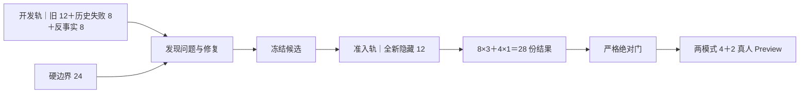

# GI-088 双轨评测资产｜阶段 B 与 B2 交付

版本：`2026-08-13.gi088-dual-track-stage-b2-v1`

状态：`阶段 C2 technical_blocked；Plus 普通与思考 No-Go，Max 质量结论保留，当前无可推荐 Judge 配置`

适用总规范：[Daily Light AI 评测总规范 v1.0](../../../docs/ai-evaluation-standard.md)

当前专项：[生成式访谈质量评测 v1](../../../docs/technical/interview-event-centered/04j-generative-quality-evaluation-v1.md)

## 1. 为什么要重建

现有 GI-088 12 项已经被开发团队看过，也曾用于调整候选。它们适合持续发现问题和防止旧问题复发，无法继续承担“冻结候选此前没见过”的独立证明。

阶段 B 因此建立两条证据轨道：



开发轨可以反复使用。准入轨在候选冻结前只公开能力蓝图，人物、故事、完整对话和评分锚点留在私有评测区。

## 2. 阶段 B 已形成什么

| 资产 | 数量 | 当前用途 | 状态 |
|---|---:|---|---|
| [开发挑战集](./development-challenge-28.json) | 28 | 发现问题、单变量修复、长期回归 | 可用 |
| [硬边界回归](./hard-boundary-regression-24.json) | 24 | 控制、安全、纠正、来源、事件隔离和恢复 | 可用 |
| [Judge 校准集](./judge-calibration-20.json) | 20＋退出卡 2 | 四档各 5 张，校准 Judge | v2 已分离技术与内容轴；7 张最小脱敏载荷、盲测包和金标映射已在私有区完成 |
| [独立准入蓝图](./independent-admission-blueprint-12.json) | 12 | 8 个标准化案例、4 条完整轨迹 | blueprint-v2 与私有正文均已冻结；正文 12/12、授权 2/2、泄漏 0，尚未授权运行 |
| [案例身份证合同](./case-identity.schema.json) | 1 | 统一案例来源、风险、隐私和身份 | 可用 |
| [数据集身份证合同](./dataset-identity.schema.json) | 1 | 统一用途、覆盖、限制和修订史 | 可用 |
| [运行身份证合同](./run-identity.schema.json) | 1 | 绑定候选、数据、判尺、Judge 和裁决 | 可用 |

完整版本和指纹见[数据集清单](./dataset-manifest.json)。阶段 B 历史结构证据见[原校验回执](./asset-validation-receipt.json)和[阶段 B 验收记录](./stage-b-acceptance.md)；阶段 B2 建设前状态保留在[历史待完成回执](./stage-b2-validation-receipt.json)，当前结果以[独立建设验收回执](./independent-admission-validation-receipt.json)为准。阶段 C 使用[授权卡](./stage-c-authorization.json)与[Judge Prompt v1](./judge-prompt-v1.md)。

## 3. 阶段 B2 收口了什么

产品负责人确认四张旧口径卡的处理后，Judge 内容校准集升级为 `2026-08-13.v2`：

- `JC-QF-04／05`继续承担多任务内容质量失败，程序拦截退出金标理由；
- `JC-SB-02／04`退出内容阻断金标，分别回到技术／端到端回归和普通多任务质量回归；
- 新增无来源长期模式推断与明确停止后继续追问两个阻断锚点；
- 20 张活跃卡继续保持四档各 5 张；停止、纠正、编造、事件串线和误停均有明确锚点；
- 7 张私有来源卡已形成最小决策窗口脱敏载荷；Judge 盲测包与金标映射分别保存，盲包原编号和金标泄漏均为 `0`。

隐藏准入蓝图同步升级为 `blueprint-v2`：8 个标准化短题按【帮我记】2、【陪我聊】6 分配，4 条完整轨迹按两模式各 2 条分配；28 份计划结果最终为【帮我记】8、【陪我聊】20。

本机私有区已经完成两条真实话题授权、撤回合同和私有数据集身份证。当前授权为 `2/2`，隐藏正文为 `12/12`，精确重复和未解决近义泄漏均为 `0`；规范化正文 SHA-256 为 `b7ce8941…12ca11`，正文与评分锚点仍只存在于 Git 排除区。

## 4. 目标 run 怎样处理

计划原本准备把 run `b816d468-e3c3-4459-a822-04f95b1e78cd` 从 `running / 0/12` 行政封存。阶段 B 的实时数据库审计发现，这条记录早在 `2026-08-11` 已经封存：

- 状态：`early_stopped`
- 轨迹：`0/12`
- 模型调用：`0`
- 人工评价修订：`0`
- revision：`1`
- 原因：运行时数据库分区修复触发新的执行指纹

阶段 B 采用历史不可改写原则，保留原原因、原指纹和原封存时间。本轮对该 run 的数据库写入为 `0`，删除为 `0`。详见[目标 run 回读](./run-disposition-readback.json)。

同一评测版本实际已有 `5` 个 run，后续 ordinal `3～5` 包含技术验收和 v8r3 No-Go 历史。它们继续保留各自证据身份，详见[运行血缘审计](./run-history-audit.json)。

## 5. 当前结论能说明什么

阶段 B 与 B2 当前已证明：

1. 两条集合轨道的身份、数量、来源和用途已经分开；
2. 开发 28 与硬边界 24 可以进入候选开发和零调用回归；
3. Judge 20 v2 达到四档各 5 张，技术与内容判断轴已经分开，私有脱敏和盲测隔离已经通过；
4. 隐藏 12 的覆盖、模式、运行次数、授权、撤回和独立建设规则已经明确；
5. 公开蓝图未包含隐藏故事、人物、对话、输入或评分答案；
6. 当前实施保持模型调用、人工提交、Preview 和 Production 变更为 `0`。

当前结论继续保持在这个范围内：阶段 B2 资产已就绪；阶段 C 只形成技术阻断，Judge 是否合格仍待完整证据；当前候选质量、独立准入、真人 Preview 和发布资格继续开放。

## 6. 阶段 C 执行结果

产品负责人授权的上限为 64 次调用、4 次技术补跑和 10 元。实际累计 19 次调用、4 次技术补跑、费用 0.092062 元：Plus 普通模式形成 0/20 有效结果，Plus 思考模式形成 14/20 有效结果；证据不完整，因此质量评分、两模式优选与 Max 路线均未启动。

阶段 C 结论为 `technical_blocked`。这表示当前无法判断 Judge 是否合格，不能把 14 份有效结果外推为模式质量。无内容指标、指纹和技术原因见[阶段 C 校准回执](./stage-c-calibration-receipt.json)，后续交接见[阶段 C Handoff](./stage-c-handoff.md)。

## 7. 复核方式

阶段 B2 公开资产校验：

```bash
npx tsx scripts/validate-gi088-stage-b2-assets.ts --public-only
```

当前私有工作区完整校验：

```bash
npx tsx scripts/validate-gi088-stage-b2-assets.ts
```

校验返回 `GI088_STAGE_B2_READY_FOR_STAGE_C_AUTHORIZATION_REQUEST`。自动校验只证明合同、数量、隔离与指纹；Judge 能否上岗继续由阶段 C 真实校准结果决定。

## 8. 当前停止点

阶段 B2 已封存，阶段 C 已按 `technical_blocked` 停止。正式隐藏准入、人工评测、两模式 `4＋2` Preview 和 Production 切换继续保持关闭。

## 9. 阶段 C2 结果

C2 修复了响应丢失、跨模式补跑串账、单卡失败后整组停止和弱结构约束问题，并用全新运行重新校准：

- Plus 普通：`20/20` 有效，四档一致 `10/20`、阻断召回 `80%`、阻断准确率 `85%`、关键锚点 `2/5`，No-Go；
- Plus 思考：`20/20` 有效，四档一致 `10/20`、阻断召回 `100%`、阻断准确率 `95%`、关键锚点 `3/5`，No-Go；
- Max 思考：`15/20` 有效，后五张遭遇 socket、连接超时和 DNS 故障，质量结论保留；
- 全程 `64` 次调用、`4` 次技术补跑、已知费用 `0.584052` 元。

阶段 C2 整体终态为 `technical_blocked`，当前无 Judge 配置获得上岗资格。公开证据见[阶段 C2 回执](./stage-c2-calibration-receipt.json)和[阶段 C2 Handoff](./stage-c2-handoff.md)。阶段 C 历史回执和旧 14 份结果保持原身份，C2 重用数量为 `0`。
