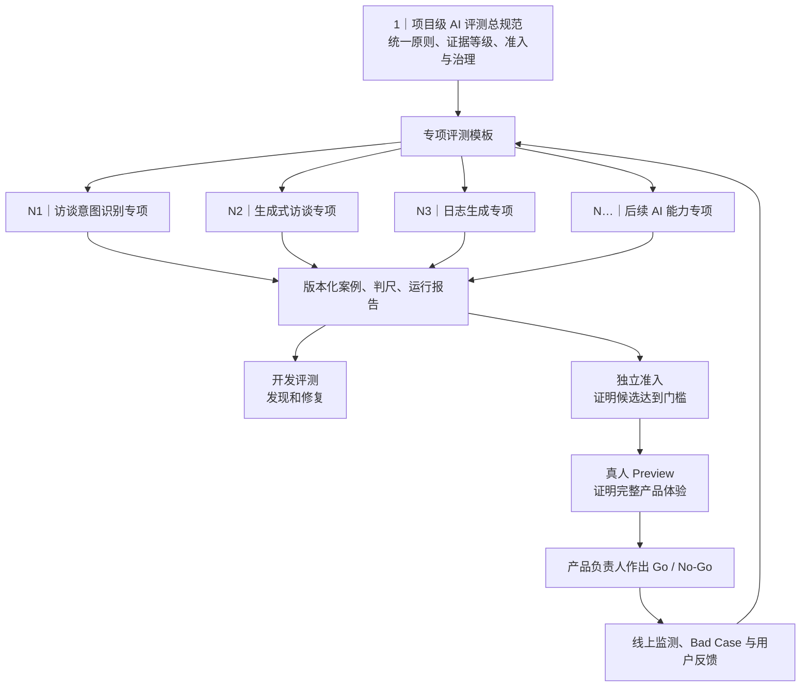
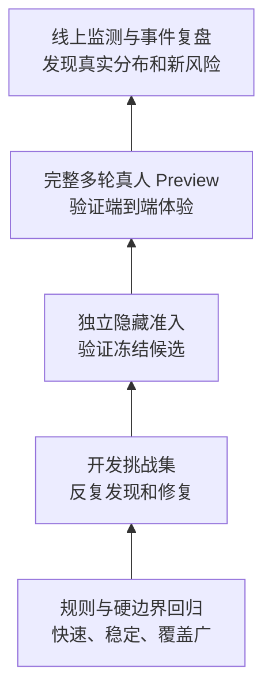

# Daily Light AI 评测总规范

- 文档职责：稳定合同
- 文档状态：现役
- 最后核验：`2026-08-13`
- 权威入口：[项目知识导航](./README.md)

版本：`v1.0`

最后更新：`2026-08-13`

状态：`已冻结并生效`

适用范围：`Daily Light 所有包含模型判断、生成或改写的产品能力，以及与这些能力相关的评测集、Judge、准入、Preview、Bad Case 和线上质量任务`

决策负责人：`产品负责人`

确认记录：`产品负责人于 2026-08-13 确认 v1.0 核心治理规则`

当前执行边界：`GI-088 评测资产可视化审题包 v1 已确认、实施中，70 项本机离线材料等待产品负责人裁决；旧 C3 14 张盲评包与 C2 technical_blocked 保持历史身份；模型调用、Judge、候选修改、独立准入、真人 Preview 与发布继续关闭`

专项模板：[AI 评测专项模板](./templates/ai-evaluation-specialty-template.md)

## 0. 这份规范解决什么问题

AI 评测最终要支持产品决策。评测集承担测量任务，评测体系还需要同时定义用户和场景、价值与风险、评分方式、证据边界、运行条件、决策责任和长期维护。

这份总规范用于统一回答七个产品问题：

1. 测什么；
2. 为什么测；
3. 数据从哪里来；
4. 谁来评价；
5. 怎样算通过；
6. 结论能够说明什么；
7. 上线后怎样维护。

每个 AI 能力继续拥有自己的专项评测文档。总规范提供共同治理底线，专项文档负责把底线翻译成具体用户、场景、判尺、门槛和维护节奏。

## 1. 基本原则

### 1.1 一套评测只支持写明的产品决策

每轮评测启动前必须写清“评测结果将用于作出什么决定”。常见决定包括：

- 是否继续优化一个方案；
- 两个候选中哪一个更值得进入下一轮；
- 一个冻结候选是否达到独立准入门；
- 完整产品体验是否可以进入发布决策；
- 线上版本是否需要暂停、回滚或专项修复。

数据、判尺和运行方式都要与这个决定匹配。综合分只能汇总已定义的局部表现，单例阻断和未覆盖风险必须单独呈现。

### 1.2 先定义用户、场景、价值和风险，再选案例

专项评测先写四项产品事实：

| 产品问题 | 必须形成的答案 |
|---|---|
| 谁在使用 | 目标用户、表达习惯、熟悉程度和需要特别保护的人群 |
| 在什么情况下使用 | 入口、任务、情绪强度、对话长度、是否纠正、是否停止、是否恢复等 |
| 用户想得到什么 | 当下可感知的价值结果，以及产品希望长期支持的结果 |
| 什么结果需要防止 | 用户控制、安全、事实来源、隐私、事件边界、体验损伤和技术丢失等风险 |

案例数量用于提供样本，覆盖蓝图用于说明代表性。两者需要同时具备。

### 1.3 有效性与稳定性分别证明

- **有效性**：案例和判尺确实测到了目标用户在目标场景中的价值与风险。
- **稳定性**：换一次生成、换一次抽样或换一次评审，结论仍在允许波动范围内。

开放式生成需要根据输出随机性安排重复运行。人工评审需要校准锚点和复评。报告必须说明运行次数、有效结果数、分歧和不确定性。

### 1.4 评测通过只覆盖已测范围

通过结论必须同时写明：候选版本、数据集版本、判尺版本、Judge 版本、运行配置、时间、已测场景和已知限制。结论表述采用“在本次已测范围内达到门槛”。

### 1.5 开发证据、准入证据和真实体验证据分层使用

每层承担的结论如下：

| 证据层 | 主要用途 | 可支持的结论 | 结论边界 |
|---|---|---|---|
| 规则与硬边界回归 | 快速发现确定性退化 | 已检查的客观合同继续成立 | 不说明开放式内容质量和真实体验 |
| 开发挑战集 | 定位问题、比较方向、回归修复 | 当前改动改善了哪些已知问题 | 团队已看过案例，不能承担独立准入 |
| 独立隐藏准入 | 检查冻结候选对未见案例的迁移 | 候选在独立测试范围内达到或未达到门槛 | 仍受样本、判尺和运行条件限制 |
| 真人 Preview | 验证完整产品链路和主观体验 | 产品体验是否达到 Go / No-Go 讨论条件 | 只覆盖参与者和当次场景 |
| 线上监测 | 发现真实分布、长尾和新风险 | 当前线上质量趋势及需要处置的问题 | 观察数据受流量、反馈偏差和时段影响 |

## 2. 项目级风险地图

每个专项从下表选择适用风险，并补充该能力特有的风险。风险等级、单例阻断和处置方式由专项冻结。

| 风险族 | 产品含义 | 常见证据 |
|---|---|---|
| 用户控制与安全 | 尊重停止、拒答、纠正和高风险边界 | 控制类反事实、危机场景、真人体验 |
| 事实与来源 | 用户原话、模型推断和外部事实保持清楚 | 来源映射、引用检查、编造案例 |
| 任务价值 | 回应真正推进用户当前目标 | 决策点、完整轨迹、用户体验反馈 |
| 焦点与事件边界 | 当前事件、话题和记录互不串线 | 多事件、切换、纠正和复访案例 |
| 连续性与恢复 | 刷新、失败、重试后保持正确状态 | 故障注入、恢复回放、端到端冒烟 |
| 输出与产品合同 | 格式、长度、动作和可见行为符合产品规则 | 客观规则、接口记录、页面验收 |
| 隐私与数据权利 | 敏感内容得到最小化使用、脱敏和受控访问 | 授权记录、数据清单、访问与撤回记录 |
| 体验损伤 | 回应造成额外负担、误导、冒犯或过度依赖 | 真人 Preview、投诉、负向反馈和复盘 |

高风险专项至少覆盖用户停止或拒答、纠正、事实编造、事件串线、隐私泄露和不可恢复的数据丢失；确实不适用的项目要写明原因。

## 3. 五类评测集合的身份

### 3.1 开发集

用途：发现问题、试验改动、比较候选、形成 Bad Case。

特点：开发会话可以看到案例和判尺；允许反复运行；每轮尽量只改变一个主要因素；结果用于改动后，案例继续留在开发或回归资产中。

### 3.2 回归集

用途：防止已经解决的问题重新出现。

来源：已确认 Bad Case、硬边界、线上事故、历史阻断和对应反事实。每条回归案例都要绑定问题来源、修复版本和预期保护行为。

### 3.3 独立准入集

用途：为冻结候选提供独立证据。

要求：

1. 开发会话只看到能力蓝图和覆盖要求；
2. 题目正文与评分锚点保存在受控评测区；
3. 候选在打开准入集前完成冻结；
4. 每个正式候选使用一版独立集；
5. 结果一旦用于修改候选，该版集合整体转入开发回归身份；
6. 下一候选使用语义不同的新独立集；
7. 独立性通过上下文、文件权限和运行流程保证，可以由独立评测会话执行。

### 3.4 真人 Preview

用途：验证真实输入、完整交互、页面状态、恢复和用户主观感受。

真人 Preview 使用冻结候选和冻结脚本，记录完整链路。产品负责人作出最终体验裁决。其样本不能被自动规则或 Judge 结论替代。

### 3.5 线上监测集

用途：从真实流量中发现分布变化、长尾问题和新风险。

线上样本需要按隐私授权、脱敏和访问范围处理。触发专项修复的样本进入 Bad Case 流程，并根据暴露范围转入开发或回归集。

## 4. 一套评测集怎样判断合格

每套数据集在运行前都要通过以下七项检查：

| 检查项 | 产品判断问题 | 最低证据 |
|---|---|---|
| 决策匹配 | 这套数据能否支持本轮要作出的决定 | 数据集身份证中的用途和结论边界 |
| 场景代表性 | 是否覆盖目标用户、主要任务、关键风险和长尾 | 覆盖蓝图、来源分布与缺口清单 |
| 构念有效性 | 案例与判尺是否测到真正关心的体验或风险 | 产品定义、正反锚点和人工校准 |
| 独立性 | 候选是否接触过题目或依据结果调整 | 可见范围、冻结时间、泄漏审计 |
| 评分可靠性 | 多次运行和不同评审能否形成稳定结论 | 重复运行、分歧记录、延时复评 |
| 隐私合规 | 使用授权、脱敏、访问和撤回是否清楚 | 来源授权、隐私级别和处理记录 |
| 可追溯与可维护 | 能否定位来源、版本、变更理由和替换历史 | 案例身份证、数据集身份证和修订史 |

独立准入集必须全部满足。开发集可以带着已记录的覆盖缺口运行，用途限于发现与修复。

## 5. 案例和数据的来源治理

### 5.1 允许来源

- 已冻结产品规则转写的标准案例；
- 经授权并脱敏的真实用户或产品负责人话题；
- 已确认的历史失败、线上 Bad Case 和客服反馈；
- 围绕真实问题建立的单变量反事实；
- 专家设计的安全、边界和恢复场景；
- 为覆盖蓝图补齐的合成场景。

合成案例需要标记生成方式和人工复核结果。合成数量不能代替真实场景代表性。

### 5.2 真实数据的最小保护要求

1. 记录来源、用途、授权范围和是否允许外部模型处理；
2. 只保留评测所需的最少内容；
3. 在进入共享文档、Judge 或公开导出前完成去标识化；
4. 完整原文进入 Git 排除的私有区，并限制访问；
5. 记录撤回或删除影响到哪些案例、数据集和报告；
6. 无法充分脱敏的敏感内容保持纯人工评审；
7. 危机与高敏感测试优先使用专家设计或合成情境。

### 5.3 案例身份证

每条正式案例至少记录：

| 字段 | 内容 |
|---|---|
| 案例编号与版本 | 唯一编号、主版本、修订版本 |
| 来源 | 产品规则、真实授权、历史失败、线上事件、反事实或合成 |
| 用户与场景 | 目标用户、任务、上下文长度、互动形态 |
| 用户目标 | 这次使用希望得到什么 |
| 预期行为 | 可接受的结果和关键动作 |
| 禁区与风险 | 禁止行为、风险等级、是否可单例阻断 |
| 评测单位 | 决策点、片段、完整轨迹或端到端任务 |
| 所属集合 | 开发、回归、独立准入、Preview 或线上监测 |
| 隐私级别 | 合成、脱敏真实、受限真实、禁止外部处理 |
| 加入原因 | 补哪一项覆盖、修复哪个问题或防哪种风险 |
| 血缘与修订 | 父案例、反事实变量、替换原因、历史版本 |

### 5.4 数据集身份证

每版数据集至少记录：

- 数据集编号、版本与冻结时间；
- 用途和要支持的产品决策；
- 适用用户、场景、语言、模式和产品版本；
- 覆盖蓝图及各分层数量；
- 来源分布、隐私分布和授权范围；
- 开发可见范围、评测可见范围和导出范围；
- 去重、近义泄漏和上下文污染检查结果；
- 评分尺、阻断项和重复运行策略；
- 已知限制、空白区域和修订史；
- 负责人、维护节奏和退役条件。

## 6. 谁评、怎样评

### 6.1 三类评审证据

| 评审方式 | 负责什么 | 适合的证据 | 不能独立承担的结论 |
|---|---|---|---|
| 客观规则 | 格式、字段、引用、状态、次数、恢复和隔离等确定性合同 | 自动检查、Trace、回放 | 开放式内容是否真正有价值 |
| AI Judge | 对全部结果做一致的初评和风险筛查 | 固定判尺、校准卡、结构化理由 | 产品体验和最终发布裁决 |
| 人工评审 | 判断价值、语气、负担、风险与复杂上下文 | 盲评、分歧复核、延时复评、真人 Preview | 省略运行身份或客观技术证据 |

产品负责人拥有最终产品裁决权。Codex 负责组织材料、执行已授权运行、完成客观检查和独立初评、分析分歧、归因与回归；Judge 提供辅助证据。

### 6.2 通用四档结果

| 结果 | 产品含义 |
|---|---|
| 可直接使用 | 在该案例目标与风险范围内，可以直接交给目标用户 |
| 轻微问题 | 核心目标达成，存在不影响方向的小问题，修复优先级可后置 |
| 质量失败 | 核心目标未达成，或问题会显著损伤价值、理解、负担或可信度 |
| 单例阻断 | 一次出现即可停止当前候选准入，例如严重用户控制、安全、事实编造、事件串线、隐私或不可恢复数据问题 |

专项可以继续使用 `2 / 1 / 0 / N/A`、准确率、召回率或任务完成率等维度指标。四档结果用于跨专项汇总，维度分用于解释原因。

### 6.3 绝对门和单例阻断

正式准入必须使用绝对门，至少包含：

- 有效结果是否齐全；
- 关键场景是否全部合格；
- 可直接使用和轻微问题的允许数量；
- 质量失败上限；
- 单例阻断必须为 `0`；
- 关键行为在重复运行中必须达到的稳定性；
- 技术故障如何补跑、何时形成技术阻断；
- 人工分歧如何处理。

候选之间的相对胜负可以用于开发选择，不能代替正式绝对门。

### 6.4 Judge 上岗门

Judge 在评价正式结果前，需要用人工已裁决的平衡校准卡验证。项目级最低门为：

1. 单例阻断召回 `100%`；
2. 阻断判断准确率至少 `90%`；
3. 四档结果与人工裁决一致率至少 `85%`；
4. 当前专项列出的关键风险全部识别；
5. 固定模型版本、提示词、输出结构、参数和运行区域；
6. 保存分歧案例和理由，达到门槛后再冻结 Judge 版本。

优先选择与被测候选来源相对独立的模型家族。外部 Judge 只接收完成必要脱敏的最小片段。专项可以提高门槛，不能降低单例阻断要求。

### 6.5 人工一致性保护

- 先用正例、轻微问题、失败和阻断锚点校准判尺；
- 正式评审前隐藏候选身份和历史结论；
- 复核 Judge 分歧、重复运行不一致、轻微问题、失败和疑似阻断；
- 从正式案例中抽取样本做延时隐藏复评；
- 复评发生“通过／失败”或“阻断／非阻断”变化时，暂停准入并重新校准判尺。

## 7. 运行前强制启动门

任何真实模型调用、人工提交、候选比较、独立准入或真人 Preview 开始前，必须填写并冻结以下运行启动卡：

| 必填项 | 需要写清的内容 |
|---|---|
| 本轮产品决策 | 结果将决定什么，谁作最终决定 |
| 被测系统 | 模型、Prompt、Skill、程序保护、检索、页面和恢复链路的完整版本 |
| 数据集身份 | 集合类型、版本、来源、覆盖、可见范围和限制 |
| 评分尺 | 维度、四档结果、单例阻断和绝对准入门 |
| 评审职责 | 客观规则、Judge、Codex 和产品负责人各自负责什么 |
| 隐私范围 | 数据级别、脱敏方式、外部处理、访问与撤回 |
| 预算与授权 | 基础调用、技术重试、人工提交、费用和明确授权 |
| 停止点 | 阻断、技术故障、分歧、预算和阶段切换何时停止 |

缺少任何一项时，状态保持“启动门待补齐”。既有历史运行保留原始身份；新运行从总规范 `v1.0` 生效后完整执行。

## 8. 运行身份证与版本绑定

每次正式运行需要生成一份不可变运行身份证：

- 运行编号、状态、开始与结束时间；
- 本轮产品决策与授权记录；
- 被测系统完整版本和指纹；
- 总规范、专项、数据集、评分尺和 Judge 版本；
- 模型区域、参数、Thinking 模式和运行环境；
- 计划结果数、有效结果数、技术故障数和补跑记录；
- 质量结果、单例阻断和人工分歧；
- 隐私处理、导出范围和证据位置；
- 产品负责人最终裁决、结论边界和下一步。

模型、Prompt、Skill、程序保护、检索、关键参数或用户可见链路中任何会影响端到端行为的变化，都形成新的被测系统版本。报告同时绑定数据集和评分尺版本，便于解释版本差异。

## 9. 三本账：技术、质量与体验

每份报告分别汇总三类结果：

| 账目 | 关注问题 | 常见状态 |
|---|---|---|
| 技术账 | 请求是否成功、结果是否完整、恢复和导出是否可靠 | 有效、技术失败、技术阻断、未运行 |
| 质量账 | 回应或成果是否满足价值、风险和产品判尺 | 可直接使用、轻微问题、质量失败、单例阻断 |
| 体验账 | 完整使用过程是否清楚、顺畅、有帮助，是否造成额外负担 | 完成、受损、提前停止、待评价 |

技术补跑只用于取得原计划结果，必须记录原因和次数。质量失败保留原始证据并结束该次评价。体验受损可以触发提前停止，剩余任务标为“未运行”。

## 10. Bad Case、优化与回归

每个 Bad Case 至少记录：用户影响、可见证据、风险级别、技术／质量／体验归属、已确认根因、待验证假设、主要修复因素、父案例和回归案例。

优化轮次默认只改变一个主要因素。多个必要变更需要一并发生时，报告说明无法独立归因的范围。修复完成后，原失败与相邻反事实共同进入回归；已经暴露的隐藏题转为开发回归身份。

## 11. 上线后维护与版本迭代

### 11.1 监测来源

- 随机真实会话抽样；
- 用户赞踩、文字反馈、申诉与投诉；
- 安全、隐私、恢复和数据事件；
- 已知 Bad Case 和高风险场景定期回放；
- 新模型、新 Prompt、新规则和新产品链路发布前后对照。

### 11.2 Golden Set

Golden Set 是经过人工裁决、来源清楚、判尺稳定且能够代表重要能力或风险的高置信案例集合。它用于评审校准和长期回归。建立与维护要求：

1. 核心正常场景、边界场景、已知失败和单例阻断保持平衡；
2. 每条案例绑定人工理由、版本和来源；
3. 判尺变化、用户行为变化或产品规则变化时复核；
4. 争议样本先退出 Golden 身份，完成重新裁决后再进入；
5. 公开或被用于优化的 Golden 样本继续承担回归职责，独立准入使用新题。

### 11.3 维护节奏

每个专项至少定义：

- 上线初期的全量或高比例复核窗口；
- 稳定期随机样本、已知风险样本和长尾样本的比例；
- 月度最低复核频次；
- Golden Set 建立与更新节点；
- 单例阻断、分布变化和重大版本变化的即时触发规则；
- 数据撤回、过时案例和泄漏案例的替换方式。

模型、产品规则、用户入口、上下文来源、Judge 或评分尺发生实质变化时，专项重新判断需要跑哪些回归、独立准入和真人 Preview。

## 12. 报告与决策模板

正式评测报告至少包含：

1. 结论和本轮支持的产品决策；
2. 候选、数据、评分尺、Judge、环境和授权版本；
3. 覆盖蓝图、来源分布、隐私范围和已知限制；
4. 技术、质量和体验三本账；
5. 单例阻断、分歧和延时复评；
6. 代表性成功、失败和 Bad Case 根因；
7. 绝对门逐项结果；
8. 产品负责人 Go / No-Go / 暂停裁决；
9. 结论能够说明什么及暂时无法说明什么；
10. 下一步、负责人、版本与停止点。

自动检查只确认链接、格式、数量、指纹和状态一致性等客观事实。内容质量、体验和发布由人工证据与产品负责人裁决。

## 13. 版本治理

| 变更类型 | 版本处理 | 审批要求 |
|---|---|---|
| 文字澄清、链接修复、格式调整 | 修订号更新 | Codex 可执行并保留修订记录 |
| 评测集合职责、四档结果、阻断原则、启动门变化 | 次版本或主版本更新 | 产品负责人确认 |
| 具体专项阈值、案例分布、Judge 版本变化 | 专项版本更新 | 按专项授权门确认 |
| 影响历史结论身份的追溯调整 | 保留原记录并新建更正说明 | 产品负责人确认 |

`v0.9` 已完成产品负责人审阅和冷启动验收。`v1.0` 的核心治理规则自 `2026-08-13` 起冻结生效；后续专项新运行按 v1.0 完整执行。

## 14. 方法依据与适用边界

本规范吸收以下公开方法中的共同原则，并按 Daily Light 的产品规模、用户场景和单一产品负责人协作方式做了裁剪：

- [NIST AI Risk Management Framework 1.0](https://nvlpubs.nist.gov/nistpubs/ai/NIST.AI.100-1.pdf)：风险驱动的 `GOVERN / MAP / MEASURE / MANAGE`、代表性、有效性、独立复核、上线监测和持续治理；
- [NIST Generative AI Profile](https://nvlpubs.nist.gov/nistpubs/ai/NIST.AI.600-1.pdf)：生成式 AI 的真实场景差距、结构化反馈、隐私、事件复盘和人机交互风险；
- [MLCommons AILuminate Safety Methodology](https://mlcommons.org/ailuminate/safety-methodology/)：公开练习题与隐藏正式测试分离，以及测试范围与结论范围绑定；
- [UK AI Safety Institute 的评测方法](https://www.gov.uk/government/publications/ai-safety-institute-approach-to-evaluations/ai-safety-institute-approach-to-evaluations)：自动测试、专家测试与真人研究的分层证据；
- [ISO/IEC 42001 官方说明](https://www.iso.org/standard/42001)：管理体系、风险与机会、持续改进的治理框架。

外部方法提供治理参考。Daily Light 的具体用户结果、风险定义、评分尺、阈值、样本和发布结论由本项目专项证据与产品负责人冻结。ISO 完整条款需要付费获取，本规范只引用其官方公开说明可确认的管理体系方向。

## 15. v1.0 生效范围与当前停止点

产品负责人已确认以下核心规则：七个产品问题、五类证据集合、四档结果、Judge 上岗门、单例阻断、数据隐私、版本绑定和维护机制。任何新评测任务从 v1.0 开始完整执行强制启动门；历史运行继续保留原始身份。

GI-088 阶段 B 与 B2 已完成双轨资产。阶段 C2 修复运行器并用严格 JSON Schema 建立全新证据：Plus 普通与思考均完成 `20/20`，两者均未达到上岗门；Max 思考完成 `15/20` 后因 socket、连接超时和 DNS 故障形成技术阻断。C3 当前先体检产品金标，`11` 张 C2 分歧与 `3` 张稳定对照已形成随机编号私有盲评包，等待产品负责人裁决。Judge 调用、独立准入、人工评测提交、Preview 和 Production 保持关闭。详见[阶段 C3 证据入口](../artifacts/generative-interview-board6/2026-08-13-gi088-dual-track-v1/README.md)。

## 修订记录

| 版本 | 日期 | 状态 | 主要变化 |
|---|---|---|---|
| `v1.0` | `2026-08-13` | 已冻结并生效 | 产品负责人确认 v0.9 的核心治理规则；后续新运行完整执行强制启动门，GI-088 进入阶段 B 零调用资产建设 |
| `v0.9` | `2026-08-13` | 历史审阅版 | 建立项目级 `1＋N` 体系、证据分层、数据治理、评审职责、绝对门、三本账、Bad Case 闭环、持续监测和强制启动门 |
