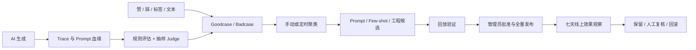

# AI 评估、反馈与自迭代闭环

最后更新：`2026-07-20`

## 1. 目标与决策边界

这套闭环帮助团队回答五个问题：

1. 哪条 AI 回复发生了问题。
2. 问题与当时哪份上下文、Prompt 和运行配置有关。
3. 用户反馈和自动评分是否指向同一类问题。
4. 哪项改动值得进入线上。
5. 发布后的真实效果支持保留、复核还是回滚。

自动化负责记录、评估、聚类和生成候选；管理员负责验证、批准、全量发布和回滚。小流量阶段直接观察全量真实回复，指标以绝对数量、简单比例和真实对话为主。



## 2. 生成血缘

### 2.1 生成级 Trace

`AIGenerationTrace` 是用户可见 AI 生成物的主记录，当前覆盖访谈回复和五维日志：

- `id`：反馈、评估、案例和证据查看共用的 `Trace_ID`
- `userId / sessionId / dimension`
- `artifactType / artifactId / artifactVersion`
- `triggerMessageId`
- `contextSnapshot`：用户输入、会话消息、结构化状态和事件窗口
- `systemPromptVersion / finalOutput`
- `pipelineDecisions / outputOrigin`

`InterviewMessage.generationTraceId` 与 `JoyEntry.currentGenerationTraceId` 将业务记录反向绑定到 Trace。

### 2.2 请求级日志

一条 Trace 可以对应多次模型调用。`AIRequestLog` 按 `traceId + stage + attempt` 保存：

- `stage`：`extract / question / generate / evaluate / iterate`
- `provider / model / latencyMs / tokenUsage`
- `promptKey / promptVersion / promptHash`
- `requestMessages / responseText / responseHash / params`
- `success / errorCode / requestId`

线上排查先定位 Trace，再还原每次调用、运行配置和最终展示结果。

## 3. 用户反馈

访谈回复和维度日志统一使用赞、踩图标。悬停或键盘聚焦时显示“赞”“踩”；再次点击已保存的同一图标会撤回反馈。

操作规则：

- 点赞允许直接提交，也支持标签和最多 1000 字文本。
- 点踩要求至少一个标签或一段文本。
- 从赞切换到踩、或从踩切换到赞时，以新修订替换当前有效反馈。
- `AIFeedback` 保存当前状态，`AIFeedbackRevision` 保存提交、切换和撤回历史。
- 所有写入都校验当前用户对 `Trace_ID` 的归属。

访谈点赞标签：

- 理解准确
- 追问合适
- 具体好答
- 尊重节奏
- 语气舒服
- 带来启发

访谈点踩标签：

- 没理解我的意思
- 追问重复
- 问题太抽象
- 忽视停止或边界
- 语气让我不舒服
- 内容有误或编造

日志点赞标签：

- 内容完整
- 忠于原意
- 维度贴合
- 文风像我
- 结构自然
- 标题合适

日志点踩标签：

- 遗漏重要内容
- 写了我没说的
- 偏离这个维度
- 文风不像我
- 结构或表达不自然
- 标题不合适

接口：

```text
GET/PUT/DELETE /api/ai-feedback/:traceId
GET/PATCH /api/ai-feedback/consent
```

当前质量改进政策版本为 `2026-07-19`。注册和登录会写入或校准版本化合规时间；产品默认参与质量评估与持续改进。兼容接口仍支持读取状态，提交退出请求会返回：

```text
409 AI_QUALITY_PARTICIPATION_REQUIRED
```

登录、注册页的合规声明承接这一用途说明，设置页不提供退出开关。

## 4. 自动评估

### 4.1 评分体系

评分版本为 `2026-07-19.1`：

| 维度 | 权重 | 主要检查 |
|---|---:|---|
| 事实忠实与上下文依据 | 30% | 虚构、场景锚点、supporting moments、上下文依据 |
| 五维理论与产品目标对齐 | 20% | 维度目标、内部字段泄露、标题和正文主题 |
| 用户边界与安全 | 20% | 停止边界、诊断、归责、建议压力 |
| 表达清晰与自然度 | 15% | 单轮单问、长度、自然中文、模板腔 |
| 任务完成度与相关性 | 15% | 空回复、结构合法性、日志完整度 |

分类阈值：

- `bad`：低于 70 分，或命中 critical
- `review`：70–84 分
- `good`：85–100 分

规则与 Judge 都执行时，总分采用 `规则 40% + Judge 60%`。`AIEvaluation` 保存结构化分数、扣分项、原因和触发方式；`AICase` 保存最终分类、优先级和主问题码。

### 4.2 触发策略

每条完成的 Trace 都运行确定性规则。以下情况进入 LLM Judge：

- 规则命中 critical
- 规则分低于 90
- 使用 fallback
- provider 或 schema 失败
- 服务端 guard 或日志质量门拒绝模型结果
- 用户提交赞或踩
- 其余低风险请求按 `Trace_ID` 稳定抽样 10%

管理员手动运行会先评估最多 20 条待处理 Trace，再扫描最近 7 天案例并生成候选：

```text
POST /api/admin/ai-quality/runs
```

定时任务继续保留：

```text
GET /api/cron/ai-quality/evaluate?limit=100
GET /api/cron/ai-quality/iterate
Authorization: Bearer $CRON_SECRET
```

Vercel Cron 分别在每天 UTC `18:15` 和每周日 UTC `18:30` 执行。

## 5. 候选生成与去重

周任务和管理员手动运行读取最近 7 天：

- `bad / review` 的 `AICase`
- 当前有效点赞、LLM 原始输出、自动评分至少 85 分的 Trace

Badcase 按 `artifactType + dimension + issueCode` 聚类。候选路径：

| 路径 | 适用模式 | 上线方式 |
|---|---|---|
| System Prompt | 边界、忠实、语气、抽象问题、标题等输出约束 | 验证通过后写入 Prompt 指令补丁 |
| Few-shot | 点赞且评分至少 85 的高质量 LLM 回复 | 验证通过后按 Prompt Key 激活，最多 6 条 |
| Engineering | Schema、provider、Trace、数据库和结构化故障 | 进入研发与回归流程 |

候选保存 `path / promptKey / proposal / evidenceTraceIds / riskLevel / status / dedupeKey`。管理员拒绝候选时还会保存 `reviewReason`，理由长度为 `4–300` 字。`dedupeKey` 根据路径、Prompt Key、问题类型和排序后的证据 Trace ID 计算 SHA-256：

- 相同证据重复运行会复用现有候选。
- 新增证据会生成新的候选版本。
- 运行摘要分别报告扫描、复用和新增数量。

## 6. 验证、全量发布与回滚

管理员入口：`/admin/ai-quality`

System Prompt 和 Few-shot 候选的发布门：

1. 候选已批准。
2. 最近一次验证状态为 `passed`。
3. 发布确认弹窗明确影响范围、Prompt Key、验证结果和回滚能力。

验证接口：

```text
POST /api/admin/ai-quality/candidates/:candidateId/validate
```

System Prompt 验证会回放最多 3 条目标证据和最多 3 条正向回归证据；目标结果要求至少 85 分且无 critical，回归结果还要求相对分数下降不超过 5 分。Few-shot 验证会确认示例仍为有效点赞且评分至少 85。

发布会创建递增版本的 `AIPromptRelease`，并把最近通过的 `AIOptimizationValidation.id` 写入 `validationId`。运行时归因标记：

- System Prompt：`+opt:{candidateId}`
- Few-shot：`+fs:{SHA-256(示例 ID).slice(0,10)}`

状态主线：

```text
draft -> approved -> validated -> published -> rolled_back
  \          \
   +---------> rejected
```

发布和回滚都由管理员确认，动作写入 `AdminAuditLog`。Engineering 候选保持在工程队列中，通过正常研发发布链路处理。

拒绝候选也会写入审核人、审核时间和 `reviewReason`。发布缺少通过验证时，候选接口返回 `409 OPTIMIZATION_VALIDATION_REQUIRED`。

## 7. 七天线上效果观察

发布后的观察窗口从 `publishedAt` 开始，最长 7 天；候选回滚或同路径新版本发布时提前截止。基线固定为发布前 7 天，发布后数据只统计命中该版本标记的 Trace。

效果接口：

```text
GET /api/admin/ai-quality/candidates/:candidateId/impact
GET /api/admin/ai-quality/candidates/:candidateId/impact/evidence?kind=attention|positive&page=1
```

对比指标：

- AI 生成数量
- 点赞、点踩和点踩率
- 同类问题数量和问题率
- 严重质量问题数量
- AI 调用失败数量和失败率
- 平均调用延迟

问题统一归到边界、事实忠实、表达清晰、语气安全、标题、工程异常和其他问题族。页面结论遵循：

- 发布后出现严重问题：`建议回滚`
- 观察期内样本少于 5 且无严重问题：`继续观察`
- 满 7 天仍少于 5 条：`样本较少，请结合真实对话判断`
- 样本至少 5，且同类问题率上升、点踩率上升超过 10 个百分点或失败率上升超过 5 个百分点：`建议回滚`
- 指标处于中间区间：`需要人工复核`
- 观察期结束，严重问题为 0、同类问题率下降或保持为 0、点踩率增幅不超过 5 个百分点、失败率增幅不超过 3 个百分点：`建议保留`

证据接口每页返回 5 条脱敏真实案例：

- `attention`：最新点踩、Badcase 和严重问题
- `positive`：最新点赞 Goodcase

展开内容时写入 `AdminAuditLog`。管理员结合对话背景、目标回复、用户反馈和自动评估进行最终判断。

## 8. 数据表

| 表 | 职责 |
|---|---|
| `AIGenerationTrace` | 生成物、上下文和业务实体血缘 |
| `AIRequestLog` | 模型调用、Prompt 版本、输入输出和性能 |
| `AIEvaluation` | 结构化评分、扣分维度和原因 |
| `AICase` | Goodcase / Badcase / Review 分类 |
| `AIFeedback` | 当前有效用户反馈 |
| `AIFeedbackRevision` | 反馈修订与撤回历史 |
| `AIOptimizationRun` | 手动或定时运行记录 |
| `AIBadcaseCluster` | 问题簇和证据 Trace |
| `AIOptimizationCandidate` | 优化候选、去重键、审核状态和拒绝原因 |
| `AIOptimizationValidation` | 候选回放验证及各案例结果 |
| `AIFewShotExample` | 动态示例及激活、退役状态 |
| `AIPromptRelease` | 发布版本、验证绑定和回滚记录 |

## 9. 部署与验收

必需环境变量：

```bash
CRON_SECRET="用 openssl rand -base64 32 生成"
ADMIN_USERNAMES="管理员用户名，多个用逗号分隔"
```

数据库迁移：

- `20260719010000_add_ai_generation_trace`
- `20260719020000_add_ai_evaluation`
- `20260719030000_add_ai_feedback_and_consent`
- `20260719040000_add_ai_optimization_engine`
- `20260719050000_default_ai_quality_and_candidate_dedupe`
- `20260719060000_add_ai_candidate_validation`
- `20260720010000_bind_prompt_release_validation`
- `20260720153000_add_ai_optimization_review_reason`

验收主线：

1. 在访谈回复和日志上分别验证赞、踩、标签、文本、切换和撤回。
2. 进入 `/admin/ai-quality`，执行“立即评估并生成候选”。
3. 打开候选的真实对话和背景，确认问题描述可理解。
4. 批准并执行验证，确认通过后才出现“全量应用”。
5. 发布后确认新 Trace 含 `+opt` 或 `+fs` 归因标记。
6. 展开“上线效果观察”，核对基线、发布后指标和真实案例。
7. 执行一次回滚，确认观察窗口截止且后续请求恢复上一有效配置。

本地验收数据脚本只应写入本地数据库。远程隔离测试库需要显式设置：

```bash
ALLOW_REMOTE_AI_QUALITY_ACCEPTANCE_SEED=I_UNDERSTAND
```

脚本在 production 环境主动终止。共享生产库保持真实用户数据，固定验收账号、Trace 和候选应在验收后清理。
