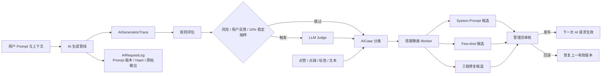

# AI 评估与反馈闭环系统

最后更新：`2026-07-19`

## 1. 为什么这样设计

AI 质量优化需要同时回答四个问题：发生了什么、问题有多严重、谁授权这些数据参与改进、哪项改动可以安全上线。系统因此采用“完整血缘 + 分层评估 + 明确授权 + 人工发布”的闭环。

这套设计遵循三个原则：

1. 每个结论都能回到原始上下文、Prompt 和最终回复。
2. 确定性规则承担高频检查，LLM Judge 承担语义判断，控制成本并保持覆盖率。
3. 自动化负责发现、聚类和生成候选；管理员负责批准、发布和回滚线上行为变化。



## 2. 数据血缘

### 2.1 生成级 Trace

`AIGenerationTrace` 是一条用户可见 AI 生成物的主记录，当前覆盖访谈回复与五维日志：

- `id`：反馈、评估、案例与 Few-shot 的统一 `Trace_ID`
- `userId / sessionId / dimension`
- `artifactType / artifactId / artifactVersion`
- `triggerMessageId`
- `contextSnapshot`：生成时的用户输入、会话消息、结构化 snapshot、事件窗口等上下文
- `finalOutput`：最终展示给用户的回复或日志
- `pipelineDecisions`：服务端 guard、质量门和 fallback 等决策
- `outputOrigin`：`llm / deterministic / fallback`

`InterviewMessage.generationTraceId` 和 `JoyEntry.currentGenerationTraceId` 将实际业务记录反向绑定到生成 Trace。

### 2.2 请求级调用记录

一条 Trace 可以对应多次模型调用或重试。`AIRequestLog` 记录：

- `stage`：`extract / question / generate / evaluate / iterate`
- `provider / model / attempt / latencyMs / tokenUsage`
- `promptKey / promptVersion / promptHash`
- `requestMessages / responseText / responseHash / params`
- `success / errorCode / requestId`

线上排查时先查 Trace，再按 `traceId + stage + attempt` 还原完整调用链。

## 3. 自动评估

### 3.1 评分体系

评分版本为 `2026-07-19.1`，与现有五维访谈规则、理解门、日志质量门和用户边界规则对齐。

| 维度 | 权重 | 主要检查 |
|---|---:|---|
| 事实忠实与上下文依据 | 30% | 虚构、场景锚点、supporting moments、上下文依据 |
| 五维理论与产品目标对齐 | 20% | 维度目标、内部字段泄露、标题与正文主题 |
| 用户边界与安全 | 20% | 停止边界、诊断、归责、建议压力 |
| 表达清晰与自然度 | 15% | 单轮单问、长度、自然中文、模板腔 |
| 任务完成度与相关性 | 15% | 空回复、结构合法性、日志完整度 |

分类阈值：

- `bad`：总分低于 70，或命中 critical
- `review`：70–84
- `good`：85–100

规则和 Judge 同时完成时，总分采用 `规则 40% + Judge 60%`。所有报告都写入 `AIEvaluation`，包含总分、分维度评分、扣分项、原因、触发方式与裁判原始结构化结果；`AICase` 保存最终分类、优先级、主问题码和来源信号。

### 3.2 成本与准确率策略

每条完成的 Trace 都经过确定性规则。以下情况进入 LLM Judge：

- 规则命中 critical
- 规则分低于 90
- 使用 fallback
- provider 或 schema 失败
- 服务端 guard 或日志质量门拒绝过模型结果
- 用户提交点赞或点踩
- 其余低风险请求按 `Trace_ID` 稳定抽样 10%

用户需要接受当前版本的 AI 质量改进授权，系统才会把其上下文发送给 Judge。其余请求只运行本地确定性规则。

每日评估任务：

```text
GET /api/cron/ai-quality/evaluate?limit=100
Authorization: Bearer $CRON_SECRET
```

Vercel Cron 当前在每天 UTC `18:15` 触发，单批上限 100。

## 4. 用户反馈与隐私

每个 AI 访谈回复和五维日志都提供点赞、点踩入口。点踩支持一个或多个预设标签，并允许最多 1000 字自由文本。空点踩会被拒绝，确保负向信号具有可分析信息。

访谈回复标签：

- 没理解我的意思
- 追问重复
- 问题太抽象
- 忽视停止或边界
- 语气让我不舒服
- 内容有误或编造

维度日志标签：

- 遗漏重要内容
- 写了我没说的
- 偏离这个维度
- 文风不像我
- 结构或表达不自然
- 标题不合适

反馈通过 `Trace_ID` 校验登录用户归属。`AIFeedback` 保存当前状态，`AIFeedbackRevision` 保存每次编辑与撤回，形成不可变修订历史。

质量改进授权采用版本化同意：

- 当前隐私版本：`2026-07-19`
- 版本变化后，旧用户需要重新选择
- 用户可随时退出并撤回反馈
- 退出、撤回反馈或把点赞改成点踩时，关联的候选/线上 Few-shot 会在同一事务中立即退役
- 周期任务还会复查授权、点赞状态和自动评分，清理漏网的失效示例

接口：

```text
GET/PATCH /api/ai-feedback/consent
GET/PUT/DELETE /api/ai-feedback/:traceId
```

## 5. 自迭代引擎

### 5.1 输入与聚类

周任务读取最近 7 天：

- `bad / review` 的 `AICase`
- 当前授权有效、主动点赞、LLM 原始输出、自动评分至少 85 分的 Trace

Badcase 按 `artifactType + dimension + issueCode` 聚类。当前数据量下采用可解释的精确问题码聚类，便于直接回放证据和审核；未来数据量增长后可在保持问题码主键的基础上增加语义子簇。

### 5.2 三条优化路径

| 路径 | 适用模式 | 产物 | 生效方式 |
|---|---|---|---|
| System Prompt | 边界、事实忠实、语气、抽象问题、标题等输出约束 | 指令补丁、证据 Trace、验收标准 | 管理员批准并发布后，从下一次请求生效 |
| Few-shot | 点赞且评分至少 85 分的高质量 LLM 回复 | 精简上下文 + 输出示例 | 管理员批准并发布，按 Prompt Key 最多激活 6 条 |
| Engineering | Schema、provider、Trace、数据库、结构化输出故障 | 工程工单与回归验收条件 | 进入正常研发、测试和发布流程 |

每个候选保存 `path / promptKey / proposal / evidenceTraceIds / riskLevel / status`。自动任务只创建 `draft` 候选。

### 5.3 审核、发布与回滚

管理员入口：`/admin/ai-quality`

状态流：

```text
draft -> approved -> published -> rolled_back
  \          \
   +---------> rejected
```

- `approve / reject / publish / rollback` 都写入 `AdminAuditLog`
- System Prompt 和 Few-shot 候选需要 `approved` 后才能发布
- Engineering 候选停留在 `approved` 工程队列，由研发验收上线
- 发布会创建递增版本的 `AIPromptRelease`
- Prompt 运行时读取最新 `published` System Prompt 候选和当前 `active` Few-shot
- 回滚会将对应 release 标为 `rolled_back`，Few-shot 回滚还会立即退役该候选的示例
- Prompt 加载失败时保留基础 Prompt，避免质量后台影响核心访谈可用性

管理员接口：

```text
GET /api/admin/ai-quality/candidates?status=draft
PATCH /api/admin/ai-quality/candidates/:candidateId
{"action":"approve|reject|publish|rollback"}
```

每周迭代任务：

```text
GET /api/cron/ai-quality/iterate
Authorization: Bearer $CRON_SECRET
```

Vercel Cron 当前在每周日 UTC `18:30` 触发。

## 6. 数据表速查

| 表 | 职责 |
|---|---|
| `AIGenerationTrace` | 生成物、上下文和业务实体血缘 |
| `AIRequestLog` | 每次模型调用、Prompt 版本、原始输入输出和性能 |
| `AIEvaluation` | 结构化评分、扣分维度和原因 |
| `AICase` | Goodcase/Badcase/Review 分类与优先级 |
| `AIFeedback` | 当前用户反馈 |
| `AIFeedbackRevision` | 反馈不可变修订历史 |
| `AIOptimizationRun` | 周期任务运行记录 |
| `AIBadcaseCluster` | 问题簇与证据 Trace |
| `AIOptimizationCandidate` | 三类优化候选与审核状态 |
| `AIFewShotExample` | 候选、激活、退役的动态示例 |
| `AIPromptRelease` | Prompt 发布版本与回滚记录 |

## 7. 上线与验收

必需环境变量：

```bash
CRON_SECRET="用 openssl rand -base64 32 生成"
ADMIN_USERNAMES="管理员用户名，多个用逗号分隔"
```

部署前执行：

```bash
npm ci
./node_modules/.bin/prisma validate
./node_modules/.bin/prisma migrate deploy
npm run typecheck
npm run lint
npm test -- --run
npm run build
```

功能冒烟：

1. 新用户注册后选择是否参加 AI 质量改进。
2. 完成一轮访谈，确认 AI 回复下方出现点赞/点踩。
3. 点踩并提交标签与文本，确认刷新后仍能编辑或撤回。
4. 携带 `CRON_SECRET` 运行 evaluate，确认生成 `AIEvaluation + AICase`。
5. 携带 `CRON_SECRET` 运行 iterate，确认 `/admin/ai-quality` 出现候选。
6. 批准并发布一个测试候选，确认新 Trace 的 `promptVersion` 含 `+opt` 或 `+fs` 指纹。
7. 执行回滚，确认后续请求恢复上一有效配置。

共享环境发布前先完成数据库备份。四条迁移按顺序为：

- `20260719010000_add_ai_generation_trace`
- `20260719020000_add_ai_evaluation`
- `20260719030000_add_ai_feedback_and_consent`
- `20260719040000_add_ai_optimization_engine`
