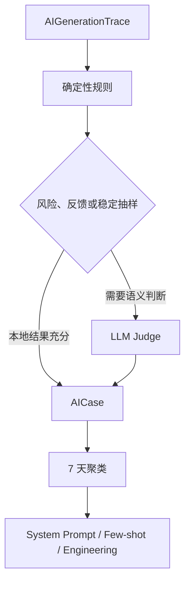

# Architecture

最后更新：`2026-07-20`

## 1. 系统概览

这是一个单仓库的 Next.js 应用，用 AI 访谈来帮助用户完成“幸福日志”记录。

产品层的功能架构图、主链时序图和逐节点图解统一收录在 [访谈功能图谱](./diagrams/README.md)。

当前架构形态包含：
- 一个受状态控制的访谈系统
- 一个先保存用户原话、再完成 AI 处理，并支持同轮恢复的提交系统
- 一个以 `snapshotData` 和 `payload` 为内部真相的结构化采集系统
- 一个把结构化信息再压缩成日志正文草稿的生成系统
- 一个以 Trace 为血缘、由管理员验证和发布的 AI 质量闭环

截至 `2026-05-04`，`joy / fulfillment / reflection / improvement / gratitude` 是已经完成理论对齐深化的五个标品维度。

技术栈：
- 前端：Next.js 15、React 19、TypeScript、Tailwind、Zustand
- 后端：Next.js Route Handlers + service layer
- 数据库：PostgreSQL + Prisma + pgvector（记忆系统向量嵌入）
- AI：provider adapter + structured output 校验

## 2. 当前分层

### 页面与 API

- `src/app`
  - 首页：品牌广告页，内容从 `src/content/homepage.ts` 读取，按“认识自己 -> 日志如何起作用 -> 五维入口 -> 长期沉淀”组织叙事；图片位按 section 配置，当前已接入 `public/homepage/*` 本地图片，图片区统一为“单行标题 + 图片本体”的去卡片化布局
- `src/app/interview`
  - 访谈页与日志工作区
- `src/app/calendar`
  - 记录日历 month/week/day 页面
- `src/app/analysis`
  - 记录分析月度页面
- `src/app/admin/analytics`
  - 管理员数据分析工作台页面
- `src/app/admin/ai-quality`
  - AI 质量治理页面：候选、真实证据、回放验证、全量发布、七天效果观察与回滚
- `src/app/api/interview/session/*`
  - 会话 start / respond / stream / pause / complete / reopen / draft
- `src/app/api/admin/analytics/*`
  - 管理员分析总览、漏斗、留存、质量、候选用户与内容级下钻接口
- `src/app/api/ai-feedback/*`
  - 赞、踩、标签、文本、撤回与版本化合规状态接口
- `src/app/api/admin/ai-quality/*`
  - 手动评估运行、候选审核、证据、验证、发布、效果统计和效果证据接口
- `src/app/api/cron/ai-quality/*`
  - 每日自动评估与每周候选聚类任务
- `src/app/api/calendar/*`
  - 记录日历的 `day / week / month` 查询接口
- `src/app/api/analysis/month`
  - 月度记录分析查询接口
- `src/app/api/daily-journal/*`
  - 当天整合日志的查询、生成、草稿更新与正式保存接口
- `src/app/api/journal-entry/[id]`
  - 当前日志正文编辑主路由
- `src/app/api/joy-entry/[id]`
  - 兼容旧 joy 命名的别名路由
- `src/app/api/transcribe`
  - 当前仍是 stub
- `src/app/profile`
  - 用户画像页面，按维度分组展示 MemoryFact，支持查看、编辑、添加、删除
- `src/app/api/profile`
  - 画像 API：`GET`（分维度分组）、`POST`（手动添加）、`PATCH`（编辑）、`DELETE`（软删除）

### 功能层

- `src/features/interview`
  - 多维度共用：schema、维度定义、进度算法、前端元信息
  - `user-turn.ts` 统一用户回复文本规范化与 Unicode 字符计数；`user-turn-storage.ts` 管理输入草稿和待发 outbox
  - `server/semantic-interpretation.ts` 与 `server/draft-policies.ts` 承担服务端语义解释和正文策略投影；这层解释只服务 summary、`DraftBrief`、短标题和质量门，不能作为正文句子直接进入用户可见日志
- `src/features/calendar`
  - 纯展示层记录读模型：`CalendarDayRecord / CalendarWeekRecord / CalendarMonthRecord`
  - 以及 `day / week / month` 聚合器、month/week/day URL/helper、月/周统计、header toolbar 投影、状态/维度视觉 helper 与 deep link helper，不直接访问数据库
- `src/features/analysis`
  - `section=trends|dimensions|correlation|review` 与 `preset=week|month|custom`、`start/end` URL 归一化；`date-range.ts`、`aggregate-trends-range.ts`；`GET /api/analysis/range` 服务量化趋势；`GET /api/analysis/month` 服务五维全景
- `src/features/admin-analytics`
  - 管理员分析页 URL 状态、类型和接口约定；负责把 `view / range / user drilldown` 投影成同页工作台状态
- `src/features/ai-feedback`
  - 访谈与日志的正负反馈标签、提交约束和当前质量政策版本
- `src/features/ai-quality`
  - 自动评分量表、Judge schema、候选策略、Prompt 清单、管理员证据读模型和七天影响结论规则
- `src/features/happiness-score`
  - 幸福 8 要素日评分的数据类型、`1-10` 输入 schema、保存请求 schema 和评分 key 定义
  - `presentation.ts` 统一维护评分展示顺序与标签（健康→经济→人际→擅长→意志→热爱→美德→意义）
  - 评分录入入口在访谈页独立 `happiness_score` 工作区，不再在分析页内联编辑
- `src/components/calendar`
  - 月网格、月检查面板、周视图 7 天对比板、日视图 overview、五维紧凑卡片、header toolbar、view switcher 与 month/week/day 工作区容器
- `src/components/admin`
  - 管理员数据分析工作台壳层；当前采用“总览 -> 候选用户 -> 单人证据”的调查式结构
- `src/components/analysis`
  - 单页四段 scroll 壳（`analysis-shell.tsx` + section 组件 + scroll spy）；`analysis-toolbar.tsx` 在 header 渲染周期 preset、锚点 tab 与 chip；量化趋势为只读读数台，五维仍按月阅读，关联/复盘占位
- `src/features/joy-interview`
  - joy-first 的 prompt、引擎、AI schema、服务端逻辑
  - 当前也承载 fulfillment、reflection、improvement 与 gratitude 的理论对齐分支、专属抽取 schema，以及多维度提问 / fallback 逻辑
  - `joy` 的 `delight_track` 闭合规则已收紧：`delightSignature` 必须是自然中文、可写入日志的具体线索，不能用长度兜底接受抽象短语或单纯状态词

### 服务层

- `src/server/services/interview/interview.service.ts`
  - 当前对外暴露的统一访谈 service
  - 现实上主要是 re-export joy service 的壳子
- `src/server/services/interview/joy-interview.service.ts`
  - 会话编排、分叉决策、draft 生成与保存的主逻辑
- `src/server/services/interview/joy-interview-ai.service.ts`
  - joy、fulfillment、reflection、improvement 与 gratitude 的结构化抽取 schema 分发；同时承载问题生成、日志草稿生成与 fallback
  - 生成链路会拦截内部理论腔进入用户正文：fallback draft 不直接消费 `theorySummary`，joy 质量门会拒绝“更像轻快乐 / 关键不是深意义 / 象征意义 / 确定性”这类抽象解释句和坏标题
- `src/server/services/calendar/calendar.service.ts`
  - 记录日历的 `day / week / month` 服务端查询入口
  - 只负责参数校验、日期范围计算与调用 calendar 聚合器
- `src/server/services/analysis/analysis.service.ts`
  - 月度记录分析的服务端查询入口
  - 负责月份校验、月范围计算和日志分析聚合
  - 调用 `src/features/analysis/narrative-service.ts` 生成 `narrative`（当前为确定性占位，预留 AI 接入口，降级到模板文本）
  - `narrative-service.ts` 是 `analysis.service.ts` 的真实依赖；提交分析页叙事改动时必须和 service 一起纳入变更集
- `src/server/services/auth/admin-access.ts`
  - 管理员白名单鉴权；页面侧使用 `requireAdminPage()`，接口侧使用 `requireAdminRequest()`
- `src/server/services/admin-analytics/admin-analytics.service.ts`
  - 管理员分析的服务端查询入口；负责总览、漏斗、留存、质量、候选用户、单人详情与内容级下钻
- `src/server/services/ai-quality/*`
  - `ai-evaluator.service.ts` 执行规则评分和抽样 Judge
  - `ai-feedback.service.ts` 维护当前反馈与修订历史
  - `ai-iteration.service.ts` 聚类 Badcase、提拔 Goodcase 并生成去重候选
  - `ai-candidate-validation.service.ts` 回放目标证据和正向回归证据
  - `prompt-optimization.service.ts` 加载已发布 Prompt/Few-shot，并执行发布与回滚
  - `ai-quality-impact.service.ts` 计算发布前基线、发布后指标和七天结论
  - `ai-quality-evidence.service.ts` 提供脱敏对话证据并记录管理员审计
- `src/server/services/daily-journal/daily-journal.service.ts`
  - 当天整合日志的 source 收集、AI 轻整理、fallback 章节合集、草稿更新与保存
- `src/server/services/memory/memory-extraction.service.ts`
  - 访谈结束后从会话数据中 AI 提取用户模式，去重后存入 `MemoryFact`，生成 pgvector 向量嵌入；fire-and-forget，失败静默记录日志
- `src/server/services/memory/memory-retrieval.service.ts`
  - 访谈问题生成时，从用户历史记忆中语义检索相关条目（pgvector 余弦相似度 Top-K），注入 AI prompt；embedding 不可用时降级为按维度 + confidence 排序
- `src/server/services/memory/profile.service.ts`
  - 画像 CRUD：`getAllProfiles`、`addProfileFact`（sourceType: user_added, confidence: 1.0）、`updateProfileFact`、`deleteProfileFact`（软删除）
- `src/server/services/portrait/portrait-data.service.ts`
  - 画像数据聚合：并行查询 MemoryFact、日历、分析、幸福分四个数据源，返回 `PortraitData` 结构
- `src/server/services/portrait/portrait-synthesis.service.ts`
  - 画像 AI 合成：调用 AI 生成跨维度总述 + 五维度洞察，结果缓存到 `PortraitSnapshot`；最低需 3 条 facts

### 持久化层

- `src/server/repositories/joy-interview.repository.ts`
  - 会话、事件、用户提交记录、消息、日志、payload、legacy 字段投影映射
- `src/server/repositories/calendar.repository.ts`
  - 从 `InterviewSession / JoyEntry / DailyJournalEntry` 查询标准化 calendar source
  - 如果 session 拿到了 `messageCount`，聚合层会把“只有 opening assistant、没有任何用户回复”的空开场 session 视为 opening-only，不再算作 `in_progress`
  - 不直接计算 calendar 状态
- `src/server/repositories/analysis.repository.ts`
  - 从 `JoyEntry / DailyJournalEntry` 查询 `saved` 分析 source；`DailyJournalEntry` 现在额外返回 `title` 和 `content`，供聚合层生成 `journalTitle` / `contentPreview`
- `src/server/repositories/admin-analytics.repository.ts`
  - 维护分析埋点、管理员审计日志，以及管理员工作台所需的用户列表 / 单人详情 / 内容级下钻读模型
- `src/server/repositories/ai-quality.repository.ts`
  - 创建生成 Trace、记录模型请求，并将 Trace 绑定到访谈回复或日志
- `src/server/repositories/ai-evaluation.repository.ts`
  - 维护结构化评估和 Goodcase / Badcase / Review 分类
- `src/server/repositories/ai-feedback.repository.ts`
  - 维护当前反馈、不可变修订历史与合规版本时间
- `src/server/repositories/ai-optimization.repository.ts`
  - 维护运行记录、问题簇、候选、验证、Few-shot 和 Prompt Release
- `src/server/repositories/ai-quality-impact.repository.ts`
  - 按发布版本标记读取基线、观察期指标和真实证据
- `src/server/repositories/daily-happiness-score.repository.ts`
  - 维护 `DailyHappinessScore` 的日期查询、upsert 与 record 映射
- `src/server/repositories/daily-journal.repository.ts`
  - 查询当天已保存维度日志，维护独立日级日志草稿和保存状态
- `src/server/repositories/memory.repository.ts`
  - 维护 `MemoryFact` 的 CRUD、文本去重（关键词重叠率 > 0.6）和向量操作
  - 维护 `PortraitSnapshot` 的查询和创建（事务内先删旧再插入，只保留最新一条）
- `src/lib/vector.ts`
  - `formatVectorForPg()`、`findSimilarMemoryFacts()`（pgvector 余弦相似度查询）、`setMemoryFactEmbedding()`

## 3. 领域模型

### 3.1 维度

当前维度枚举：
- `joy`
- `fulfillment`
- `reflection`
- `improvement`
- `gratitude`

这五个维度都已经进入通用类型系统、导航和 `snapshotData / payload` 结构。

### 3.2 会话与事件

核心实体：
- `InterviewSession`
  - 维度级会话，包含当前状态、当前事件、日志引用
  - 从 `2026-05-02` 起新增 `entryDate` 作为日志归属日期真相；`startedAt` 只表示会话实际创建时间
  - plain `/interview` 在没有显式 `sessionId` / `entryDate` 时，只允许静默复用 `entryDate === 今天` 的会话；跨天挂载的 live session 也不能继续被默认入口复用
- `InterviewEvent`
  - 单个事件级访谈单元，记录 `snapshotData`、`progressData` 和事件级状态
- `InterviewMessage`
  - 全部可恢复消息
- `InterviewUserTurn`
  - 用户回复与选择动作的提交事实，保存 `clientTurnId / action / rawText / baseMessageSequence / status / attemptCount / errorCode`
  - 同一会话内 `clientTurnId` 唯一；同一时刻只允许一条 `processing / failed / canceled` 未解决提交
  - 文本回复在 AI 处理前创建对应用户消息；AI 结果完成时，助手消息、事件、会话和本轮 `completed` 状态在同一事务中写入

当前用户提交状态：
- `processing`
- `completed`
- `failed`
- `canceled`

当前事件状态：
- `active`
- `ready_for_choice`
- `completed`

当前会话状态：
- `active`
- `paused`
- `completed`
- `abandoned`

### 3.3 阶段字段的历史痕迹

虽然系统已经多维度化，但 `InterviewSession.stage` / `InterviewEvent.stage` 仍使用 `JoyInterviewStage`：
- `collect_event`
- `probe_reason`
- `probe_pattern`
- `wrap_up`
- `finalize`

这说明当前架构仍然是 joy-first 演进而来，只是外层已经做了多维度包裹。

### 3.4 日志实体

`JoyEntry` 是当前维度日志表，已经承担多维度日志容器角色：
- `title`
- `content`
- legacy 字段：`event / feeling / whyItMattered / happinessType / selfPattern`
- 新结构：`payload`
- 事件列表：`eventBlocks`
- 状态：`draft / saved`

现实上：
- legacy 字段是兼容投影
- 多维度真相在 `payload`
- joy 的更细结构也落在 `payload` 与 `snapshotData`
- `JoyEntry.date` 现在与 `InterviewSession.entryDate` 对齐，用来承接“补写过去日期”的日志归属
- repository 层读取 `JoyEntry.date` / `InterviewSession.entryDate` 时，统一按 `Asia/Shanghai` 的整天时间窗口查询（`gte dayStartUtc`、`lt nextDayStartUtc`），而不是按某个归一化时间点精确匹配

`DailyJournalEntry` 是独立日级整合日志表：
- `userId + date` 唯一
- `title / content`
- 状态：`draft / saved`
- `sourceEntryIds / sourceSessionIds / sourceSignature / sourceUpdatedAt`

现实上：
- 当天整合日志只使用同一天 `status = saved` 的维度日志
- 正文是按已有维度组织的章节合集，不补空维度
- `sourceSignature` 用于判断维度日志保存后，日级日志是否进入 `stale` 状态
- 如果来源维度日志后来不再是 `saved`、保存后的更新时间变化，或同一天新增了新的 `saved` 维度日志，当前签名都会不一致，日级日志会进入 `stale`

`DailyHappinessScore` 是独立幸福 8 要素日评分表：
- `userId + date` 唯一
- `meaning / health / virtue / autonomy / interest / skill / relationship / livingCondition` 8 个显式整数分数字段
- 只承载评分事实，不复用五维日志或当天整合日志的表结构

现实上：
- 当前已落数据模型、zod schema、repository、Prisma migration、`PUT /api/happiness-score`、访谈页独立评分工作区；分析页趋势段为只读读数台
- 保存允许 Asia/Shanghai 口径下的所有非未来日期；8 项必填且必须是 `1..10` 整数
- `/analysis` 已接入轻量 SVG 趋势图：总分平均走势和 8 要素单项切换走势，未评分日期断线，不补 0

`AnalyticsEvent` 是管理员分析埋点表：
- 记录注册、登录、进入私有页、访谈开始、首次有效回复、边界不足展示、跳维提示、暂停、重开、日志生成/保存、完整日志生成/保存、评分保存等事件
- `dedupeKey` 唯一，用于对幂等事件去重
- 当前管理员总览、漏斗、质量与候选用户筛查主要依赖这张表

`AdminAuditLog` 是管理员内容查看审计表：
- 记录管理员查看会话正文、维度日志正文和完整日志正文的行为
- 字段包括 `adminUsername / targetUserId / resourceType / resourceId / action / createdAt`
- 当前只在管理员 drilldown 读取正文时写入，不参与普通用户业务链路

### 3.5 画像与记忆

`MemoryFact` 是长期记忆条目：
- `dimension`（五维度之一）、`kind`（preference / pattern / trait / user_note）、`topicTags`、`summary`
- `sourceType`：`ai_extracted`（访谈后 AI 自动提取）或 `user_added`（用户手动添加，confidence = 1.0）
- `confidence`：AI 提取时由模型输出，用户添加时为 1.0
- `embedding`：pgvector `vector(2048)`，fire-and-forget 生成
- `evidenceEntryIds / evidenceSessionIds`：来源日志和会话引用
- `deletedAt`：软删除

`PortraitSnapshot` 是画像 AI 合成缓存：
- `summary`：跨维度总述（AI 生成，100-200 字）
- `dimensionInsights`：JSON，五维度各一段洞察
- `factCount`：合成时的 fact 数量
- `dataRangeMonths`：数据聚合查询窗口（默认 3 个月）
- 每次重新生成清除旧记录，只保留最新一条

### 3.6 calendar 读模型

当前已经落地并通过 HTTP 路由公开的记录日历读模型有：
- `CalendarDayRecord`
- `CalendarWeekRecord`
- `CalendarMonthRecord`

前端当前会同时用这些读模型做两类投影：
- 正文视图本身的 month / week / day 渲染
- `SiteHeader` 中区的 calendar toolbar 标题、前后翻段和 summary chips

聚合来源固定为：
- `InterviewSession`
  - 提供 `active / paused / completed`
  - 提供 `entryDate`、`draftSummary`
  - legacy 兼容上，如果历史 session 缺少 `entryDate`，calendar source 会回退到 `startedAt` 做日期归档
- `JoyEntry`
  - 提供 `draft / saved`
  - 提供标题、正文摘要与更新时间
- `DailyJournalEntry`
  - 提供当天整合日志 `none / draft / saved / stale` 轻量状态
  - 月/周只消费轻 marker，日视图提供入口条；不在 calendar 内编辑正文

聚合规则固定为：
- 同一天同维度优先取最新有效记录
- `continue_interview / continue_editing / view_journal` 会分别指向活动会话、草稿会话和已保存日志对应会话，不再复用同一个模糊目标
- 同一天多个维度允许并存
- `InterviewSession.entryDate`、`JoyEntry.date` 与 `DailyJournalEntry.date` 的范围查询统一按 `Asia/Shanghai` 整天窗口执行，避免同日非零点时间戳被漏算到前一天或下一天
- 无日志时只允许使用安全摘要，不暴露内部结构字段名
- 未来日期允许查询，但服务端会裁掉 `start_interview / continue_interview`，避免前端误开记录入口

### 3.6 calendar 前端工作区现实

截至 `2026-05-04`，calendar 前端已经不是“每个视图都各自放一套顶部按钮和统计卡”的自然文档流页面，而是：
- `SiteHeader` 中区承接全局 calendar 导航：
  - `month / week / day` 切换
  - 前后翻段
  - 回到今天
  - 3 个实时摘要 chip
  - calendar toolbar 与访谈维度条现在共用 header 中区高度预算，业务控制组用 `｜` 分隔，但不再套独立中区方框
  - `SiteHeader` 会在客户端测量真实 header 高度，并把结果同步到 `--site-header-viewport-offset`，让 calendar / analysis / settings 这类首屏工作区按剩余视口真实高度布局，而不是依赖固定 `4rem`
- 当页面处于 `entryDate` 访谈上下文时，当前选中维度胶囊优先显示 live session 的实时轮次 / 进度圈；其余维度，以及切到 `daily_journal` 工作区后的胶囊状态，继续使用 `CalendarDayRecord.dimensions`
- 如果当前 active choice 是 `boundary_insufficient` 或 `dimension_redirect`，live progress 会先被压在 `88%` 以下；这个边界态优先级高于历史 `draftGenerationUnlocked`
- 全站 `SiteHeader` 已改为全宽暖色工具栏，不再使用居中 `page-shell` 大卡片外壳；主导航也不再包内层方框，当前页改用贴近文字的暖棕实线下划线表达，选中项字号略大；主导航不再包含【首页】项，点击左侧【Daily Light】品牌标识可返回首页
- `src/app/calendar/page.tsx` 与三个 shell 共同形成首屏工作区
- 页面本身优先不长滚动，超量内容进入 pane 内局部滚动
- 根布局不再给页面额外外边距；首页、访谈、设置和 calendar 主体都以平铺 surface 承载内容，减少大圆角外框和卡片嵌套

当前三个视图的工作区状态：
- `month`
  - 桌面已进入双栏骨架：月历主体 + 当天检查面板；小屏改为月历主体在上、当天检查面板在下，不再依赖横向滚动访问右侧面板
  - 右栏固定提供 `查看当天` 日期级入口
  - 月格当前固定渲染 6 行 42 格，loading skeleton 也渲染同样的 42 格，保证每个月份和加载前后的网格高度一致
  - 小格当前不再优先解释“还有什么没做完”，而是优先表达“这一天已经沉淀出的已保存维度结果”
  - 月格可见文字层固定为：
    - `1-4` 个已保存维度：显示单字 `悦 / 实 / 思 / 改 / 谢`
    - `5` 个维度都至少保存过一次：显示 `已完成`
    - 纯草稿且还没有任何已保存维度：显示 `草稿`
  - `进行中 / 混合状态` 不再作为月格可见文字出现；未完成感主要由状态符号和颜色层承担
  - 当天检查面板当前显示 `待继续 / 已完成 / 完整日志` 三个 summary chip；`待继续` 按 `activeCount + draftCount` 投影，`完整日志` 显示 `未生成 / 可汇总 / 草稿 / 已保存 / 需更新`
  - 过去空白日只显示轻空态，不再渲染 5 个空维度；月查询失败时仍保留月历主体 + 当天检查的 split-pane 方框骨架，主区与右栏都在各自 pane 内显示错误说明和重试，不再退回旧的浮卡或假空白日
  - today 圆点已回到日期锚点附近，右上角只保留状态词或状态点位
- `week`
  - 已升级为 7 天同屏对比板
  - 主摘要压缩成轻量周摘要块，不再保留厚重侧栏
  - 每天卡片只保留日期、状态、完成/草稿/进行中摘要、短判断文案和唯一主动作
- `day`
  - 已升级为“一条总览 + 五维紧凑操作台”
  - 总览区下方有当天整合日志入口条，进入访谈页 `mode=daily-journal`
  - 每条只保留维度身份、状态、标题或摘要、唯一主按钮和少量次级轻链接
  - `mixed` 主动作由前端稳定按 `继续访谈 -> 继续编辑 -> 查看日志 -> 开始记录` 解析
- month / week / day 三个视图当前共用暖色 calendar 工作台：
  - 五态状态色固定区分 `empty / in_progress / draft / completed / mixed`
  - 五个维度当前在可见 badge 上固定使用单字标识 `悦 / 实 / 思 / 改 / 谢`，辅助技术继续暴露完整维度名 `开心 / 充实 / 思考 / 改进 / 感谢`
  - badge、surface、marker 和主次按钮层级由 `src/features/calendar/presentation.ts` 统一投影，不再由各组件各自拼样式
  - 色温已经回收到全局暖纸张/墨色系统，不再维持蓝灰后台式分叉
  - 文案改为工作台短句，不再保留 `DAY / WEEK` 这类模板化英文眉题
  - shell / toolbar 会补 `aria-busy`，loading 用 `status`，error 用 inline `alert`，主要 CTA 有完整可访问名称

### 3.7 记录分析页现实

截至 `2026-06-12`，`/analysis` 为单页四段纵向 scroll + 顶部锚点 tab：

- URL：`section=trends|dimensions|correlation|review`；旧 `overview|score|rhythm|insights` 自动映射到新 keys；缺省 `section=trends`
- 周期：`preset=week|month|custom` + 可选 `start/end`；量化趋势段走 `GET /api/analysis/range`
- `SiteHeader` 中区 `AnalysisToolbar`：周期 preset、日期范围、四段 tab、contextual chip；tab 点击锚点跳转，scroll spy 更新 URL
- **量化趋势**：只读读数台（周期摘要、总分柱线、日志天数色块、8 要素雷达/棒棒糖）；无评分录入、无热力点选、无补漏 CTA
- **五维全景**：`GET /api/analysis/month`；**关联 / 复盘**：占位，手动 AI 后续接入
- 幸福 8 要素评分录入在 `/interview`「当天评分」工作区，不在分析页
- 设计规范见根目录 `DESIGN.md` 与 `docs/design/ui-conventions.md`

### 3.8 AI 质量数据模型

AI 质量闭环使用四组实体：

| 分组 | 模型 | 关系 |
|---|---|---|
| 血缘 | `AIGenerationTrace / AIRequestLog` | 一条生成 Trace 对应多次模型调用，并反向绑定业务回复或日志 |
| 信号 | `AIFeedback / AIFeedbackRevision / AIEvaluation / AICase` | 当前反馈与修订历史、结构化评分和案例分类都绑定 Trace |
| 优化 | `AIOptimizationRun / AIBadcaseCluster / AIOptimizationCandidate / AIFewShotExample` | 一次运行形成问题簇与去重候选，点赞 Goodcase 可成为动态示例 |
| 发布 | `AIOptimizationValidation / AIPromptRelease` | 候选拥有多次验证；Release 通过 nullable `validationId` 绑定发布采用的通过记录 |

删除 Trace 会级联清理其质量信号；删除候选会级联验证和 Release，并将关联 Few-shot 的候选引用置空。`AIPromptRelease` 通过 `promptKey + version` 唯一约束保持版本单调。

`AIOptimizationCandidate.reviewReason` 保存管理员拒绝候选时填写的理由，长度为 `4–300` 字；批准、发布和回滚动作会清空该字段。发布缺少通过验证时，候选路由返回 `409 OPTIMIZATION_VALIDATION_REQUIRED`。

## 4. 结构化数据面

### 4.1 snapshot vs snapshotData

当前系统同时维护两层结构：

- `snapshot`
  - 历史 joy 结构的兼容快照
- `snapshotData`
  - 多维度 discriminated union
  - 是当前进度判断、摘要生成和收尾逻辑的主要结构来源

### 4.2 payload

日志生成后，结构化结果进入 `journalEntry.payload`：
- `joy`：`joyMoment / joySource / stateShift / meaningNeed / manualClue / ...`
- 其他维度：各自的维度专属字段

用户当前不直接看到这些字段，但它们会影响：
- 是否可以进入“生成日志”
- 是否建议跳维度
- 日志正文生成时取哪些上下文

`fulfillment` 的当前 payload 语义：
- `experience`：具体充实片段
- `progressEvidence`：今天没有白过的证据
- `fulfillmentType`：`推进完成型 / 投入积累型 / 协作贡献型`
- `valueSignal`：值得感标准

`reflection` 的当前 payload 语义：
- `trigger`：触发思考的具体片段
- `insight`：新发现 / 新理解
- `reflectionType`：`规律发现型 / 方向优势型 / 判断校准型`
- `viewpointShift`：视角变化或判断线索
- `continue_current_event` 的 reflection 续聊现在带有防回卷约束：如果上一轮已经问过“具体经历 / 对话”且用户明确回答没有，系统必须改问更低压的具体锚点，不能重复追同一字段
- `question_repair` 现在与正常 `advance` 链路分离：当用户表达“看不懂 / 太抽象 / 换一个 / 说简单点”时，服务端会直接按 `questionSpec` 做确定性 repair，不请求模型、不重算 `getNextStage`、不刷新 `coveredLenses`、不推进 `turnCount / roundMeaningfulReplyCount / progressData`
- `reflection` repair 当前固定支持 `event_anchor / prior_assumption / reaction_evidence / insight_evidence / judgment_clue` 五类 target；如果已命中过“没有具体经历 / 对话” guard，repair 不允许再回到 scene question，而会自动落到“具体顾虑 / 画面 / 念头”类低压锚点
- repair 第 1 次默认简化重问，第 2 次收紧到 concrete anchor，第 3 次直接进入低压 choice，不再继续换问法

`improvement` 的当前结构语义已经进入 `snapshotData` 和 `payload`：
- `situation`：改进情境
- `improvementTrack`：`repeat_good / avoid_bad`
- `stateAssessment`：这次好在哪里或不理想在哪里
- `frictionPoint`：`avoid_bad` 的具体卡点
- `repeatCondition`：`repeat_good` 的可重复条件
- `controllableFactor`：用户自己能调整的一小块
- `nextAttempt`：下一次具体尝试
- `successSignal`：可选的轻量成功信号
- `improvementType / feeling / tags`：辅助组织字段

当前 `improvement` 的 AI 抽取已经独立于 joy 泛化 schema，抽取 prompt 会禁止把“我很差 / 我不行”这类全局自责写成 `frictionPoint`，并要求 `nextAttempt` 是具体动作。用户只说清 `repeat_good / avoid_bad` 轨道、但还没有说清条件或卡点时，AI 抽取会先保留 `improvementTrack`，让 `repeatCondition / frictionPoint` 维持为空并交给下一轮追问；这类中间态不能触发完整或 partial 完成。fallback 抽取也按轨道补齐 `repeatCondition / frictionPoint / controllableFactor / nextAttempt` 的轻量线索。提问策略已经按“具体情境 -> 重复好状态或避免坏状态 -> 关键条件/具体卡点 -> 可控小调整 -> 下次最小动作/成功信号”推进，并禁止建议式、计划式和归责式口吻。由于后端仍是 joy-first 架构，新字段会先进入 `JoySnapshot` 的可选属性，再投影到 `snapshotData/payload`；legacy 列仍只承担兼容投影。

## 5. 访谈与日志流

### 5.1 启动会话

`POST /api/interview/session/start`

做的事：
- 建 session
- 建第一个 active event
- 写入显式 `entryDate`
- 生成开场问题
- 返回完整 `session hydrate` 数据

### 5.2 访谈回复

前端主链路走：
- `POST /api/interview/session/respond/stream`

SSE 事件：
- `turn`
- `phase`
- `delta`
- `summary`
- `question`
- `session`
- repair 模式下不再走模型流式输出；服务端会直接发完整 `turn -> summary -> question -> session`，不会出现 provider `thinking` phase
- `error`

非流式路由 `respond` 仍存在，但当前主 UI 使用的是 stream 版本。

一轮回复采用两阶段持久化：

1. 页面保存输入草稿；点击发送后生成 `clientTurnId`，记录 `baseMessageSequence` 并写入本地 outbox。
2. 服务端先校验重复提交、未解决提交和对话位置，再创建 `InterviewUserTurn(processing)`；文本回复同时保存用户原话。
3. 流式接口发送 `turn`，确认原话已经成为服务端持久事实。
4. 服务端执行意图识别、槽位提取、动作决策、问题生成和输出检查。
5. 最终事务写入助手消息、快照、事件、会话和生成 Trace，并把本轮标记为 `completed`。
6. 流式接口发送最终 `session`；页面清理 outbox。

AI 处理失败时本轮进入 `failed`；请求取消时进入 `canceled`。会话读取把这两类状态和仍在处理的状态投影为 `pendingUserTurn`。用户点击“继续生成”后，前端用同一 `clientTurnId` 发送 `resume_turn`，服务端增加尝试次数并从原始消息位置继续。

provider 流式返回的候选文本会先在服务端累计。服务端完成问题协议、重复保护、维度专项检查和 fallback 后，再把最终 `summary / question` 分块发送给前端；分块过程保持最终文本的空格和换行。

截至 `2026-05-01`，访谈回复错误不再只用一句“提交失败”兜底。`respond/stream` 的 `error` 事件和非流式 `respond` 的错误 JSON 都会携带结构化 `issue`：
- `code`
- `title`
- `message`
- `resolution`
- `retryable`
- `action`
- `requestId`

这层结构由 `src/features/interview/interview-issue.ts` 定义，并由 `src/server/services/interview/respond-error.ts` 统一把 schema 校验、session 状态、分叉过期、数据库写入和未知异常映射成用户可执行的错误说明。前端 `InterviewShell` 只展示用户有行动价值的信息：原因、解决方案、错误码和 requestId。

用户提交恢复新增四类冲突语义：

- `INTERVIEW_TURN_IN_PROGRESS`：同一会话已有提交正在处理。
- `INTERVIEW_TURN_OUT_OF_DATE`：页面基于较早的消息位置提交。
- `INTERVIEW_TURN_RETRY_REQUIRED`：同一提交已失败或取消，需要走恢复动作。
- `INTERVIEW_TURN_NOT_FOUND`：指定的待恢复提交不存在或不属于当前用户。

### 5.3 分叉决策

`pendingDecision` 当前有三个分支：
- `event_complete`
  - `continue_current_event`
  - `next_event`
  - `generate_draft`
- `dimension_redirect`
  - `continue_current_event`
  - `switch_dimension`
- `boundary_insufficient`
  - `continue_current_event`
  - `next_event`
  - `pause_session`

joy 场景下，如果连续没有形成可信开心片段，会建议跳到 `improvement`。

用户表达“不想继续、不要再追问、直接生成、总结日志、整理成日志、帮我总结、追问没有意义”等边界或日志整理意图时，系统会在抽取和追问前优先处理：
- 当前维度材料足够时，直接进入 `event_complete + user_override_partial`
- 材料不足时，进入 `boundary_insufficient`，前端展示“只补一句 / 换一个片段 / 先退出”
- `pause_session` 复用现有 pause 接口，不新增数据库字段或外部 URL

### 5.4 生成日志

`POST /api/interview/session/draft/generate`

流程：
1. 收集当前 session 的 source events
2. 先基于 `snapshot + sourceEvents` 生成一层维度语义解释：判断当前片段属于哪个主题、为什么在该维度成立、哪些浅写法需要避免
3. 再组装维度无关的 `DraftBrief`
4. 再组装内部写作控制层 `DraftWritingProfile`
5. 尝试让 AI 基于 `semantic interpretation + DraftBrief + DraftWritingProfile` 生成结构化 draft
6. 对生成结果做规则质检，并统一进行语义短标题治理；如果 AI 不可用、schema 不合法或质检失败，则用 fallback draft
7. upsert `JoyEntry`
8. 用最新 session hydrate 前端

补充：
- 五个维度在 `stitched_moments` 下都可以对 supporting scene 做额外校验；如果 AI draft 漏掉本次 prompt 里实际提供的副事件，质量门会拒收
- fallback draft 会自然并入主事件外最多 `2` 个 supporting moments，而不只回退到 `primarySnapshot`
- `generateJoyDraftWithAI()` 会先从全量 `sourceEvents` 里选出 `promptEvents`，再基于 `promptEvents` 生成 `promptScopedBrief`；AI prompt 和 `runDraftQualityGate()` 共用这份 brief，避免 `refresh_minor` 因窗口外副事件触发 `missing_supporting_scene_anchor`

当前只支持单个 `sessionId` 生成，虽然请求体是数组。

补充说明：
- 同一个 `draft/generate` 路由同时承担首次“生成日志”和用户手动触发的后续重整。
- 当前不会再因为新增访谈消息而自动触发日志刷新；是否重整由用户自己决定。
- 这些控制都属于内部实现层：
  - 不新增公开 API
  - 不改数据库 schema
  - 生成接口不直接决定前端书页的打开、关闭和遮罩交互
- 如果用户在前端日志面板里直接关闭工作区，而这次生成仍在进行，前端会主动 abort 当前请求。
- 这不会删除已有 draft，也不会修改服务端会话状态；只是终止这次前端发起的整理。
- 五个维度标题都保持 `16` 字上限，但不会再把长事件句直接 `slice` 成不完整标题；`gratitude` 会优先收束为 `被稳稳接住 / 被认真理解 / 那句及时提醒 / 有人帮我理清 / 被信任的机会` 这类语义短标题，`improvement` 会优先收束为 `表达慢下来 / 先听完再回应 / 把节奏放稳 / 提前留出缓冲 / 把边界说清楚 / 让准备更充分` 这类语义短标题。

### 5.5 保存正式日志

`POST /api/interview/session/draft/save`

做的事：
- 将当前 draft 标记为 `saved`
- 更新 session 状态
- 返回最新 `session` 与 `draftEntry`

前端语义：
- 单维度日志保存成功后，覆盖式书页会自动收回，用户回看或继续编辑时通过侧边书签重新打开。
- 保存成功不再在对话框上方额外弹出“日志已保存”模块，避免和书页状态重复。
- session 完成后输入框仍保持可用；用户继续输入时，前端会先调用 `reopen`，成功后再发送这一轮回复。

编辑正文时走：
- `PUT /api/journal-entry/[id]`
- `PUT /api/joy-entry/[id]`（兼容）

### 5.6 当天整合日志

当天整合日志是独立于维度日志的日级成果物：
- `GET /api/daily-journal?date=YYYY-MM-DD`
- `GET /api/daily-journal/board?date=YYYY-MM-DD`（今日日志面板只读聚合：五维状态/标题/正文 + 完整日志状态）
- `POST /api/daily-journal/generate`
- `PUT /api/daily-journal/[id]`
- `POST /api/daily-journal/[id]/save`

生成流程：
1. 按 `date` 查询当天 `status = saved` 的 `JoyEntry`
2. 只保留同一天每个维度最新一篇 `saved` 日志作为日级来源
3. 按 `joy / fulfillment / reflection / improvement / gratitude` 顺序整理 source
4. AI 轻整理为已有维度章节合集；AI 不可用时用确定性 fallback 章节
5. upsert `DailyJournalEntry` 为 `draft`
6. 后续编辑自动保存草稿，用户确认后标记为 `saved`

约束：
- 没有已保存维度日志时返回 `DAILY_JOURNAL_SOURCE_EMPTY`
- 不读取未保存草稿，不直接读取访谈消息
- 不生成空章节，不提示缺失维度
- 访谈页顶部【完整日志】按钮把主工作区切到当天日志模式，不弹层、不跳转；打开或生成当天完整日志时显示共享阶段进度、细进度轨和书页生长动效
- `mode=daily-journal` 深链只打开当天日志主区；如果页面尚未 hydrate 访谈 session，也不会调用 `/api/interview/session/start` 创建新的 joy session
- 从 `mode=daily-journal` 点击“回到访谈”时，前端会先通过 `DailyJournalWorkspace.flushPendingEdits()` 保存未触发 autosave 的草稿编辑，再移除 URL 里的 `mode`，回到同一 `dimension + entryDate` 的普通访谈 hydrate 流程
- 从单维度日志书页切到当天日志主区前，前端会先复用书页关闭路径：保存未暂存编辑，或取消正在生成的 draft
- 从当天日志主区返回访谈，或在当天日志主区切换访谈维度时，前端会先通过 `DailyJournalWorkspace.flushPendingEdits()` 保存未触发 autosave 的草稿编辑；保存失败或内容非法时不卸载当天日志主区，避免静默丢稿
- 当访谈维度变化且 URL 没有 `mode=daily-journal` 时，`InterviewShell` 会把 `workspaceMode` 重置为 `interview`，避免新维度会话被完整日志工作区遮住
- calendar 只展示轻量状态，不内联编辑

## 6. joy 维度为什么是当前标品

joy 已经实现的核心不是“有一个 prompt”，而是以下整套机制：

### 6.1 joy 专属槽位

强必需：
- `joyMoment`
- `joySource`
- `stateShift`
- `meaningNeed`
- `manualClue`
- `delightSignature`

可选：
- `directionSignal`
- `valueImpact`
- `durability`
- `tags`

### 6.2 完成规则

当前 joy 的关键完成标准不是“聊完一件事”，而是：
- 找到可信 `joyMoment`
- 说清 `joySource`
- `meaning_track` 至少确认 `stateShift` 或 `meaningNeed`，最终沉淀出 `manualClue`
- `delight_track` 必须确认 `stateShift`，最终沉淀出 `delightSignature`
- `delightSignature` 必须是可直接写进日志的自然中文线索，不能用长度兜底接受抽象短语或单纯状态词

这意味着 joy 不再只有一条“越深越好”的收尾路径。

但当前产品还支持一个明确的例外路径：
- 如果 `joyMoment / joySource / stateShift|meaningNeed` 已经成立
- 且用户明确表示不想继续提炼规律
- 系统可以开放“生成当前版本日志”，但正文不能伪装成已经形成稳定规律

### 6.3 用户可见产物

用户现在看到的是：
- 对话中的浅色 `thinkingSummary` 思路层：呈现 AI 对用户回复的理解和处理焦点，五个维度都会通过 `summary` SSE delta 流式展示；它不能写成第二个正式追问
- `thinkingSummary`、日志正文、日志标题和 `joy` 质量门现在共用同一层服务端语义解释；如果模型给出的 summary 只是浅复述、语气不对或写成第二个追问，服务端会先按维度语义重写，再发给前端
- 日志正文初稿

用户不再看到：
- 结构化线索卡
- 槽位化的 joy 结构摘要

这意味着 joy 已经完成了“结构内隐、正文外显”的第一阶段产品化。

## 7. fulfillment 维度为什么也是当前标品

fulfillment 已经从“普通完成感复盘”收束为“今天为什么不算白过”的专属访谈维度。

### 7.1 fulfillment 专属槽位

核心槽位：
- `experience`
- `progressEvidence`
- `valueSignal`

辅助槽位：
- `feeling`
- `fulfillmentType`
- `tags`

`valueSignal` 在产品中文里固定称为“值得感标准”。它不是抽象价值观口号，而是从具体推进、积累或贡献证据里长出来的判断。

### 7.2 完成规则

完整模式成立需要：
- 找到可信 `experience`
- 说清可信 `progressEvidence`
- 形成可信 `valueSignal`

部分模式成立需要：
- 找到可信 `experience`
- 说清可信 `progressEvidence`
- 用户明确表示不想继续提炼值得感标准

部分模式下，日志只能停在“这件事为什么让今天不算白过”，不能伪装成已经形成稳定值得感标准。

### 7.3 成稿与质量门

fulfillment 已接入统一成稿链路：
- `DraftBrief`
- `DraftWritingProfile`
- AI draft prompt
- draft quality gate
- fallback draft

质量门会拒收：
- 周报、汇报、绩效总结口吻
- 只有忙碌没有进展证据
- 空泛成长口号
- 部分模式硬写值得感标准
- 从一次局部推进硬拔到人生方向或职业使命

## 8. reflection 维度为什么也是当前标品

reflection 已经从“普通想法记录”收束为“从今天片段里看见新的判断依据”的专属访谈维度。

### 8.1 reflection 专属槽位

核心槽位：
- `trigger`
- `insight`
- `viewpointShift`

辅助槽位：
- `feeling`
- `reflectionType`
- `tags`

`reflectionType` 当前固定为：
- `规律发现型`
- `方向优势型`
- `判断校准型`

### 8.2 完成规则

完整模式成立需要：
- 找到可信 `trigger`
- 说清可信 `insight`
- 形成可信 `viewpointShift`

部分模式成立需要：
- 找到可信 `trigger`
- 说清可信 `insight`
- 用户明确表示不想继续提炼判断线索

partial 模式下，日志只能停在“这次片段带来的当前理解”，不能伪装成已经形成稳定判断标准。

### 8.3 成稿与质量门

reflection 已接入统一成稿链路：
- `DraftBrief`
- `DraftWritingProfile`
- AI draft prompt
- draft quality gate
- fallback draft

质量门会拒收：
- 没有触发片段
- 没有新理解
- 行动计划腔
- 心理诊断腔
- 人生结论腔
- partial 模式硬写稳定判断线索

## 9. gratitude 维度为什么也是当前标品

gratitude 已经从“通用感谢复盘”收束为“看见谁回应了我的需要”的专属访谈维度。

### 9.1 gratitude 专属槽位

核心槽位：
- `gratitudeMoment`
- `gratitudeTarget`
- `kindAction`
- `seenNeed`
- `gratitudeReason`
- `relationshipSignal`

辅助槽位：
- `innerEffect`
- `gratitudeType`
- `reciprocityHint`
- `tags`

`gratitudeType` 当前固定为：
- `支持回应型`
- `理解体谅型`
- `陪伴接住型`
- `照顾减负型`
- `信任机会型`

### 9.2 完成规则

完整模式成立需要：
- 找到可信 `gratitudeMoment`
- 说清可信 `kindAction`
- 说清可信 `seenNeed`
- 说清可信 `gratitudeReason`
- 形成可信 `relationshipSignal`

部分模式成立需要：
- 找到可信 `gratitudeMoment`
- 说清可信 `kindAction`
- 说清 `seenNeed` 或 `gratitudeReason`
- 用户明确表示不想继续提炼关系线索

partial 模式下，日志只能停在“这份感谢为什么重要”，不能伪装成稳定关系判断，也不能硬写回馈任务。

### 9.3 成稿与质量门

gratitude 已接入统一成稿链路：
- `DraftBrief`
- `DraftWritingProfile`
- AI draft prompt
- draft quality gate
- fallback draft

质量门会拒收：
- 没有具体感谢片段
- 没有具体善意行为
- 没有被回应的需要
- 感谢信模板或表扬稿
- 道德负债感、还人情、强行回馈任务
- partial 模式硬写稳定关系线索

## 10. AI 质量闭环

### 10.1 血缘与反馈

每个用户可见 AI 回复先创建 `AIGenerationTrace`，再用 `AIRequestLog` 记录该 Trace 下的抽取、提问、生成、评估或迭代调用。`contextSnapshot`、`systemPromptVersion`、`finalOutput` 和业务实体反向引用共同构成可回放血缘。

用户反馈写入两层模型：

- `AIFeedback`：一条 Trace 当前有效的赞或踩。
- `AIFeedbackRevision`：提交、切换和撤回的不可变历史。

注册和登录会写入当前质量政策版本与合规时间。产品默认参与质量评估；兼容退出接口返回 `409 AI_QUALITY_PARTICIPATION_REQUIRED`。

### 10.2 自动评估与候选

每条 Trace 运行确定性规则；高风险、低分、fallback、质量门拒绝、用户反馈和 10% 稳定抽样进入 Judge。`AIEvaluation` 保存分数和扣分原因，`AICase` 保存分类与主问题码。

手动运行 `POST /api/admin/ai-quality/runs` 会先处理最多 20 条待评估 Trace，再扫描最近 7 天案例。定时任务保持每日评估和每周聚类。候选 `dedupeKey` 由路径、Prompt Key、问题类型和排序证据计算，相同证据会复用现有候选。

### 10.3 验证、发布与归因

System Prompt 和 Few-shot 候选需要同时满足“管理员批准”和“最近一次回放验证通过”。`AIOptimizationValidation` 保存目标案例、回归案例和各项分数；`AIPromptRelease.validationId` 将线上版本绑定到发布时采用的验证记录。

候选拒绝属于可审计的人工决策：管理员提交 `4–300` 字理由后，系统将其写入 `AIOptimizationCandidate.reviewReason` 并记录审核人和审核时间。

运行时版本标记：

- System Prompt 候选：`+opt:{candidateId}`
- Few-shot 候选：`+fs:{SHA-256(示例 ID).slice(0,10)}`

发布创建递增的 `AIPromptRelease`。Prompt 加载失败时保留基础 Prompt；管理员可以通过确认弹窗回滚到上一有效配置。发布、证据查看和回滚均写入 `AdminAuditLog`。

### 10.4 七天影响窗口

`GET /api/admin/ai-quality/candidates/[candidateId]/impact` 读取发布前 7 天基线，并只统计发布后命中当前版本标记的 Trace。观察期最长 7 天；回滚或同路径新版本发布会提前截止。

影响指标包括生成数、赞踩、同类问题、严重问题、调用失败和平均延迟。结论由 `src/features/ai-quality/impact-policy.ts` 以低样本、严重问题和变化百分点规则投影为：

- `继续观察`
- `样本较少，请结合真实对话判断`
- `需要人工复核`
- `建议保留`
- `建议回滚`

证据接口按 `attention / positive` 分页返回脱敏对话、目标回复、用户反馈和自动评估。内容展开时记录管理员审计。

完整产品与运维合同见 `docs/ai-quality-loop.md`。

## 11. 前端工作区现状

访谈页当前是双栏工作区 + 覆盖式书页（`2026-06-14`）：
- 左栏：全屏对话区和底部输入框
- 右栏（`lg+` 常驻）：`TodayJournalPanel` 今日日志面板，五维折叠块全程在场
- 覆盖层：单维度日志书页，从面板卡片或 header 生成按钮触发，覆盖对话区编辑/保存
- 遮罩层：日志书页打开时覆盖对话区，关闭或保存后回到完整对话

今日日志面板（`today-journal-panel.tsx`）：
- 五维折叠块三态：`今天还没聊这个`（未聊）/ `正在聊`（在聊·有未整理内容）/ 已整理（显示标题，展开看正文）
- 在聊态或“已整理但又有新增”的卡片展开后显示提示 + `生成{维}维度日志`；有正文的卡片显示 `查看 / 编辑这篇`，打开单维度书页
- 当前维度卡片以 live session 覆盖快照，其他维度走 `GET /api/daily-journal/board?date=` 的快照
- 底部日级按钮三态：`生成日志`（未生成）/ `更新日志`（来源有更新）/ `查看日志`（已就绪），无已保存维度时禁用；点击 `生成 / 更新` 会汇编并保存完整日志再整页跳转，`查看` 直接整页跳转
- 完整日志的生成、汇编、查看入口都收口到这里；header 不再有【完整日志】【回到访谈】按钮，回访谈靠点维度胶囊

单维度日志书页行为：
- 生成或已有 `journalEntry` 时可打开；第一次生成时显示阶段式 loading 状态
- 当前草稿已覆盖到最新访谈状态时，再次生成会直接复用，不重复发起
- 标题、正文和保存动作收拢在同一个编辑 pane；标题固定单行、限制 `16` 字
- 面板头部不显示“日志”标题，只保留关闭按钮；支持纵向滚动
- 已有草稿后新访谈内容不会自动刷新，由用户手动触发；生成中关闭会取消本次整理
- 单维生成按钮文案为 `生成{维}维度日志`
- 保存正式日志成功后书页自动收回，维度日志进入今日日志面板
- 访谈完成后不显示结束卡；输入框常驻，继续输入会先重开 session 再发送
- 切换维度时 header 先静默持久化当前 session，不弹原生离开确认
- 访谈页通过 header 主导航切换到日历、分析、画像、设置或首页时直接完成路由切换；刷新或关闭页面时，`InterviewShell` 继续通过 `beforeunload` 保存会话恢复标记并提供浏览器离开保护

完整日志整页（`daily-journal-workspace.tsx`）：
- 只读 + 编辑；不再有底部「整理完整日志 / 保存正式日志 / 收成并保存完整日志」三按钮
- 生成与汇编由今日日志面板日级按钮触发；进入本页时完整日志已就绪
- 用户改了标题/正文才出现 `保存修改`（700ms autosave 回退 draft，`保存修改` 重新定稿）

访谈页顶部当前还带一个开发辅助动作：
- `清除对话记录`
- 只清当前维度的本地恢复入口，并强制前端新开一轮会话
- 不对应新的后端删除接口，也不会清历史数据库记录

对用户来说，右侧的唯一主对象是“日志正文”，不是结构化摘要。

## 12. 已知架构债务

这些是当前最重要的架构现实：

1. `interview.service.ts` 仍是 joy-first 的导出层  
   多维度看起来已经通用，但后端编排内核还没有真正拆开。

2. `improvement` 与 `gratitude` 已完成正文产品闭环，但仍需要端到端产品验收  
   二者都已经有专属结构、AI 抽取 guardrails、fallback 抽取、阶段推进、完成标准、正文生成、质量门、fallback draft、标题治理和自动化验收样例。

3. `JoyEntry` 表名已不再准确  
   它已经承担多维度日志容器角色，但数据库命名仍带有 joy 历史痕迹。

4. 语音转写仍是 stub  
   `/api/transcribe` 只保留了接口与回退位置，没有接真实模型。

5. joy、fulfillment、reflection、improvement 与 gratitude 正文文风仍需继续打磨  
   当前已经从结构卡转向正文优先，但“产品完成度”还没有完全到位。
