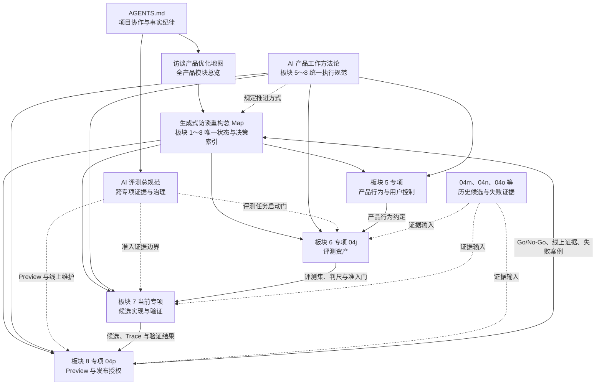
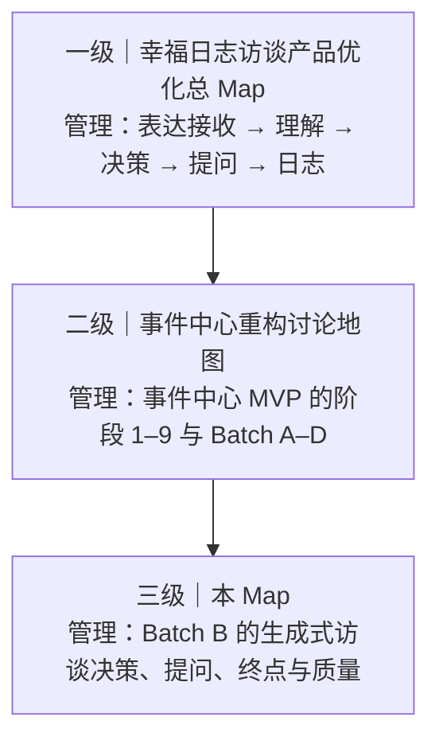
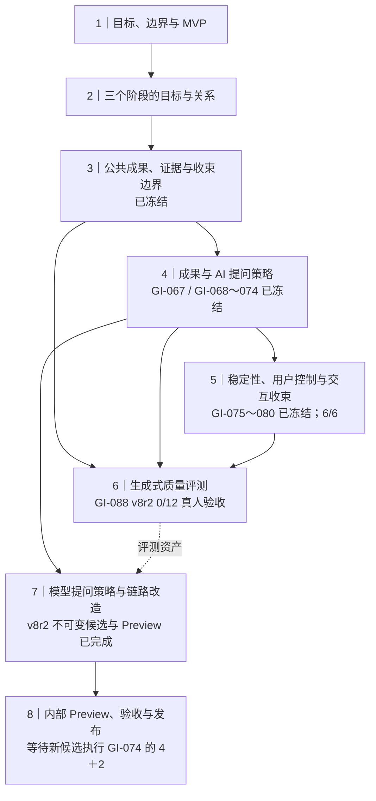

# 生成式访谈重构总 Map（Batch B 专项）

- 文档职责：总 Map
- 文档状态：现役
- 最后核验：`2026-08-16`
- 权威入口：[访谈产品优化总 Map](./interview-product-optimization-map.md)

当前板块：`板块 6｜生成式访谈正式评测资产建设`

当前讨论位置：`GI-088 第一门 6 题首段调用已完成；技术与速度 6/6 通过，等待产品负责人六卡内容裁决`

下一建议板块：`产品负责人完成首段六卡裁决；通过后才执行 4 次后台职责 A/B 与选定合同 6 题质量门`

Production 状态：`项目主链使用 event_centered + baseline；GI-088 与 optional + generative 继续关闭`

本次同步范围：`第一本 6 次账已消耗 6/6，HTTP 200、合同有效、45 秒与 60 秒门均为 6/6；内容裁决待产品负责人完成。第二、三本账均为 0，Judge／隐藏集／Preview／Production 继续为 0`

网页端实现同步：第二轮验收基线已于 `2026-08-13` 发布 Production，项目主链使用 `event_centered + baseline`；GI-088 真人评测、模型质量裁决和生成式能力发布继续沿本 Map 的既有流程推进。

日志成果关联：日志生成专项复用了 GI-088 的 9 条真人轨迹作为评测素材。今日日记 Prompt v3 的真人证据覆盖 9 条，其中 6 条完成“记录卡 v3 → 今日日记 v3”完整回归；这项结果只更新上层产品总 Map 的“日志成果与确认”模块，不改变 GI-088 访谈候选以及板块 6/7/8 的当前状态。阶段总结见[九条真人轨迹阶段性总结](../artifacts/journal-generation-evaluation/nine-human-trajectory-summary.md)。

工作方法状态：[`生成式访谈 AI 产品工作方法 v1.0`](./technical/interview-event-centered/00-generative-interview-ai-product-working-method.md)为`已冻结`；产品负责人已于 `2026-08-06` 独立确认

## 2026-08-16｜GI-088 两段式质量、后台提速与本地接入实施卡

| 项目 | 本轮确认值 |
|---|---|
| 产品目标 | 首段继续满足 45 秒有用回应与 60 秒完整正文；后台期间输入保持锁定，发送到输入框重新可用新增 60 秒目标 |
| 第一门 | 5 条已确认真实问题＋1 条 12 消息公开合成长上下文；Pro Low；预算 6；产品负责人六卡裁决 |
| 第二门 | 固定 RPR-REAL-13 与冻结首段；Pro High；A-B-B-A；当前 12 类结构合同对比精简语义合同＋程序投影；预算 4 |
| 第三门 | 复用六题与冻结首段，选定后台合同每题一次；预算 6；产品负责人查看简化状态卡 |
| 总预算 | 最大 `16` 次，三本账分别为 `6 / 4 / 6`；并发 1，重试／恢复／降级 0；失败后剩余任务记 `not_run` |
| 页面方向 | 发送后立即显示动态思考气泡；首段正文原位替换；后台显示整理状态；完成后输入框解锁 |
| 持久化方向 | 复用 `InterviewUserTurn.eventOperationData` 保存冻结回应检查点；首版不新增 Prisma 表或字段 |
| 当前状态 | `已确认·实施中`；第一门身份 `2026-08-16.gi088-response-first-visible-quality-v1` 已执行，6 次均技术有效并通过 45／60 秒门，等待产品负责人六卡内容裁决 |
| 第一门速度 | 六题总耗时依次为 `7.080 / 24.517 / 21.739 / 16.446 / 13.255 / 15.355` 秒；调用 `6/6`，重试／恢复／降级 `0` |
| 停止点 | 第一门 6 次调用完成后等待产品负责人六卡裁决；第二门、第三门和页面接入保持关闭 |
| 执行边界 | Judge、隐藏集、真人提交、Preview、Production、数据库迁移、推送和部署继续为 0；当前候选与公开证据已进入本地阶段检查点 `30cfc03` |
| 当前专项 | [两段式质量、后台提速与本地接入](./plans/2026-08-16-gi088-two-stage-quality-optimization-and-local-integration.md) |

## 2026-08-16｜GI-088 先回应后整理与职责重划实施卡

| 项目 | 本轮确认值 |
|---|---|
| 产品决定 | 同时优化用户可感知等待和模型完整处理耗时；两段式可以实施，模型变快的根因查询继续推进 |
| 历史速度证据 | Pro Low 完整开发中 P50／P90／最长为 `19.886 / 30.955 / 38.554` 秒，速度门通过；该历史候选因空正文、来源遗漏和动作违规形成技术 No-Go，因此 Low 只继承为速度方向 |
| 历史职责证据 | 完整合同与精简合同＋程序投影已做 `126` 次对照；P50 为 `35.042 / 32.085` 秒，两组速度门均未通过。精简组主要问题为来源责任重复，随后由程序继承来源并通过零模型回放 |
| 第一段 | 官方 Pro、Thinking 开启、`reasoningEffort=low`；只生成针对用户内容的自然理解与回应，通过现有 SSE 尽快显示 |
| 第二段 | 读取同一轮输入和已冻结的第一段文字，初始兼容候选使用 Pro High 完成结构化语义与记录准备；程序直接合成第一段文字 |
| 职责边界 | 模型负责用户含义、事实与假设、当前焦点和自然回应；程序负责编号、历史来源继承、动作范围、状态迁移、字段补齐、幂等、预算、保存与恢复 |
| 本轮实施 | 独立候选 `2026-08-16.gi088-response-first-two-stage-v1`、Prompt／Skill／程序职责审计、合成数据自动验证和公开零调用回执；产品运行入口与数据库保持原状 |
| 当前状态 | `本地候选已完成；首段速度形成方向性支持，语义质量与页面体验待验证`；候选指纹 `e806843d…bac96` |
| 零调用结果 | 当前单段／第一段／第二段系统提示为 `9128 / 478 / 7262` 字符，字段为 `14 / 2 / 12`；RPR-CF-02 当前请求／第一段／两段合计为 `9728 / 996 / 9278` 字符 |
| 自动验证 | 专项 `9/9`、现有 SSE 客户端 `12/12`、类型检查与定向 ESLint 通过；公开启动卡、职责审计和交接已封存 |
| 下一单因素 | `2026-08-16.gi088-visible-contract-burden-ab-v1` 已完成；计划指纹 `95c920d8…d03be`，裁决 `visible_contract_directional_support` |
| 授权与停止点 | Provider 调用授权与消耗 `4/4`，并发 1、重试／恢复／降级 0；额度用完即停止。Judge、隐藏集、Preview、Production、提交、推送和部署继续为 `0` |
| 当前专项 | [先回应后整理与职责重划实施计划](./plans/2026-08-16-gi088-response-first-two-stage-and-responsibility-split.md) |

## 2026-08-16｜GI-088 可见合同负担 A/B 结果卡

| 项目 | 本轮确认值 |
|---|---|
| 要回答的问题 | 在 Pro Low、同一完整用户载荷和同一时段下，把完整 Prompt／Skill／输出合同收窄为第一段可见合同，是否形成稳定的速度改善方向 |
| 身份与计划 | `2026-08-16.gi088-visible-contract-burden-ab-v1`；计划指纹 `95c920d8…d03be`；RPR-CF-02；顺序 `A-B-B-A` |
| 固定条件 | `deepseek-v4-pro`、Thinking Low、`json_object`、同一完整用户载荷、同一输出上限、并发 1、重试／恢复／降级 0 |
| 结果 | A1／B1／B2／A2 总耗时为 `21.830 / 3.834 / 7.174 / 31.385` 秒；HTTP 200、合同有效、45 秒与 60 秒门均为 `4/4` |
| 配对改善 | `A1-B1=17.996s`；`A2-B2=24.211s`，两组均超过 10 秒方向门 |
| 负担证据 | A 每次 Prompt `4,448` Token、隐藏思考 `1,565～2,282` Token；B 每次 Prompt `487` Token、隐藏思考 `74～247` Token。A／B 中位总耗时为 `26.608 / 5.504` 秒 |
| 裁决 | `visible_contract_directional_support`：可见 Prompt、Skill 与输出合同这一组收窄，对首段模型速度形成稳定方向性改善 |
| 验证 | 新运行器 `4/4`、两段式候选 `9/9`、现有 SSE 客户端 `12/12`；类型、规则、JSON、公开边界、私有权限、文档链接与差异格式通过 |
| 结论边界 | 本轮不拆分 Prompt 长度、Skill 步骤、字段数和输出长度的各自贡献；语义质量、程序职责迁移、第二段耗时、页面端到端体验、Preview 和发布继续待验证 |
| 停止点 | 授权与消耗 `4/4`，未自动追加调用；下一步先验证第一段语义忠实度和近期上下文窗口 |
| 证据 | [公开结果](../artifacts/generative-interview-board6/2026-08-13-gi088-dual-track-v1/visible-contract-burden-ab-v1-receipt.json)与[结果交接](../artifacts/generative-interview-board6/2026-08-13-gi088-dual-track-v1/visible-contract-burden-ab-v1-handoff.md) |

## 2026-08-16｜GI-088 响应等待合同 A/B 实施卡

| 项目 | 本轮确认值 |
|---|---|
| 本轮产品决策 | 日常合格线为 `45` 秒内出现针对用户内容的有用回应、`60` 秒内完成可见回答；接受“先回应、后完成结构化理解与记录”的两段式方向 |
| 本轮要回答的问题 | `relationship_claim_status_v1` 的新增合同负担是否是当前等待从约 30 秒恶化到超过 45 秒的主要方向性原因 |
| 验证单位 | 固定 RPR-CF-02；A 为上一事件关系解释候选，B 为当前关系解释状态候选；顺序 `A-B-B-A` |
| 固定条件 | `deepseek-v4-pro`、Thinking high、`json_object`、同一输入、并发 1、重试 0、恢复 0、降级 0 |
| 速度门 | 响应头 `15s`；首个有效正文 `45s`；正文与总观察上限 `60s`。隔离运行器只提供产品速度近似证据，不承担页面端到端验收 |
| 预算与授权 | Provider 调用授权与消耗 `4/4`，并发 1、重试／恢复／降级 0。Judge、隐藏集、数据库、Preview、Production、提交、推送和部署继续关闭 |
| 当前状态 | `已完成；inconclusive_mixed_direction`；身份 `2026-08-16.gi088-response-latency-contract-ab-v1`，计划指纹 `d09a2f0d…ac752d` |
| 实际结果 | A1／B1／B2／A2 为 `22.687 / 26.423 / 49.455 / 33.370` 秒；45 秒门 `3/4`，60 秒门 `4/4`；`B1-A1=3.736` 秒、`B2-A2=16.085` 秒 |
| 裁决与停止 | 两次 B 均更慢，只有一组成对差值达到 10 秒，新增合同负担无法单独确认为根因；4 次额度耗尽，停止自动追加调用 |
| 裁决边界 | 两次 A 均在 45 秒内且两次 B 均超过 45 秒为强方向证据；两组成对 B 均至少慢 10 秒为方向证据；四次同慢、四次同快、方向冲突和环境故障分别记账，不自动追加调用 |
| 证据与停止点 | [公开启动卡](../artifacts/generative-interview-board6/2026-08-13-gi088-dual-track-v1/response-latency-contract-ab-v1-start-card.json)、[授权卡](../artifacts/generative-interview-board6/2026-08-13-gi088-dual-track-v1/response-latency-contract-ab-v1-authorization.json)与[执行交接](../artifacts/generative-interview-board6/2026-08-13-gi088-dual-track-v1/response-latency-contract-ab-v1-handoff.md)已绑定；四次完成并在额度耗尽后停止。语义候选继续保持未知，两段式由上方新实施卡接续 |

## 2026-08-16｜GI-088 关系解释状态候选实施卡

| 项目 | 本轮确认值 |
|---|---|
| 产品决策 | 每条关系、比较、原因或心理解释先标记为“用户已明确”或“待确认假设”；待确认假设确认前只允许进入提问 |
| 候选身份 | `2026-08-16.gi088-relationship-claim-status-v1`；叠加在上一事件关系解释候选上，产品运行入口保持原状 |
| 程序责任 | 校验解释身份、来源、引用位置和使用范围；阻止待确认假设进入工作任务、认识变化和陈述式理解 |
| 模型责任 | 完整列出本轮使用的关系解释，按用户证据区分已明确内容与待确认假设 |
| 当前范围 | 独立候选、候选专用结构解析、确定性校验、自动测试和真实复测启动卡 |
| 当前状态 | `已完成；technical_blocked，语义修复状态未知` |
| 静态结果 | 候选与探针测试 `10/10`、类型检查和定向 ESLint 通过；候选指纹 `1f60ca82…569cc` |
| 探针身份 | `2026-08-16.gi088-relationship-claim-status-probe-v1`；RPR-REAL-13＋RPR-CF-02；预算申请 2、重试 0 |
| 真实结果 | `/models` 鉴权与目标模型检查通过；两题 HTTP 200 `2/2`，正文等待超时 `2/2`，技术有效 `0/2`，内容可评价 `0/2`；耗时 45.387 秒与 46.627 秒 |
| 调用边界 | 业务模型调用 `2/2`、重试 `0`；Judge、隐藏集、数据库、真人 Preview、Production、提交、推送和部署均为 `0` |
| 证据 | [启动卡](../artifacts/generative-interview-board6/2026-08-13-gi088-dual-track-v1/relationship-claim-status-probe-v1-start-card.json)、[授权卡](../artifacts/generative-interview-board6/2026-08-13-gi088-dual-track-v1/relationship-claim-status-probe-v1-authorization.json)、[公开回执](../artifacts/generative-interview-board6/2026-08-13-gi088-dual-track-v1/relationship-claim-status-probe-v1-receipt.json)与[结果交接](../artifacts/generative-interview-board6/2026-08-13-gi088-dual-track-v1/relationship-claim-status-probe-v1-result-handoff.md) |
| 停止点 | `已达到`；当前额度耗尽。完整 10 题回归保持关闭；下一会话先按[等待根因讨论交接](./plans/2026-08-16-gi088-response-latency-root-cause-discussion-handoff.md)确认速度门与验证方案 |

## 2026-08-16｜GI-088 事件关系解释修复与 10 题复测实施卡

| 项目 | 本轮确认值 |
|---|---|
| 产品决策 | 允许继承用户已表达的宽泛对比；限制模型把未经确认的具体原因、因果、心理状态和关系解释写成确定事实 |
| 数据身份 | 建立 `2026-08-16.gi088-real-problem-regression-v1.2`；RPR-REAL-13 输入保持不变，只修订判尺，其余 29 题保持 v1.1 指纹 |
| 候选身份 | `2026-08-16.gi088-unconfirmed-event-relationship-explanation-binding-v1`；以 v8r2 `0d5f91c0…efd6` 为父候选，独立叠加单因素规则 |
| 运行身份 | `2026-08-16.gi088-event-relationship-explanation-retest-v1`；原 9 道哨兵加 RPR-CF-02，共 10 题 |
| 运行设置 | `deepseek-v4-pro`、Thinking high、`json_object`、顺序 1、重试 0、预算最多 10、单次总超时 120 秒 |
| 验证门 | 总规范、v1.2、父候选、新候选和 10 道题指纹绑定；漂移时在调用前停止；技术与内容结果分账 |
| 当前状态 | `已完成；factor_no_go` |
| 复测结果 | HTTP 200 `10/10`、技术有效 `10/10`、内容通过 `9/10`；RPR-CF-02 通过，RPR-REAL-13 失败，原通过题未退化 |
| 失败依据 | 模型继承了用户已表达的宽泛对比，同时仍把“被支使、外面更自在、外面更轻松”等待确认解释写入已成立认识 |
| 下一单因素建议 | `relationship_claim_status_v1`：每条关系解释先区分“用户已明确”与“待确认假设”；待确认假设只进入问题，确认前不进入工作任务和已成立认识 |
| 执行边界 | Judge、隐藏集、数据库、真人 Preview、Production、提交、推送和部署保持关闭 |
| 证据 | [10 题公开回执](../artifacts/generative-interview-board6/2026-08-13-gi088-dual-track-v1/event-relationship-explanation-retest-v1-receipt.json)与[复测交接](../artifacts/generative-interview-board6/2026-08-13-gi088-dual-track-v1/event-relationship-explanation-retest-v1-handoff.md) |
| 停止点 | `已达到`；下一候选等待新的产品确认与运行身份 |

## 2026-08-16｜GI-088 回归集 v1.1 修订与 9 题基线实施卡

| 项目 | 本轮确认值 |
|---|---|
| 产品决策 | 修正 6 条题目后封存 30/30，并用 9 条快速哨兵建立当前 v8r2 候选的开发基线 |
| 数据身份 | `2026-08-16.gi088-real-problem-regression-v1.1`；继承 24 条通过结论，6 条按已确认判尺委托 Codex 复核 |
| 运行身份 | `2026-08-16.gi088-real-problem-sentinel-baseline-v1`；候选指纹 `0d5f91c0…efd6`，不可变提交 `5281bc53…8a8` |
| 运行设置 | `deepseek-v4-pro`、Thinking high、`json_object`、顺序 1、重试 0、预算最多 9、单次超时 120 秒 |
| 验证门 | 24 条未修案例指纹不变、6 条修订案例指纹变化、30/30 通过；规范／数据／候选指纹匹配后才能运行 9 条哨兵 |
| 评审职责 | 程序检查 HTTP、空内容、结构、来源和状态；Codex 按每题主要质量标准评审内容；产品负责人授权 Codex 完成剩余题目与 9 条结果判断 |
| 当前状态 | `已完成；回归集 30/30 封存，9 题基线已形成` |
| 基线结果 | HTTP 200 `9/9`；技术有效 `7/9`，2 条为 HTTP 200 后无可用正文；可评价内容 `6/7` 通过，端到端 `6/9` |
| 关键归因 | 唯一内容失败为模型把两个事件的关系和原因说得过于确定；2 条旧“双问号”技术误判已按 QR-04 纠正为语义评价，不改写原始输出 |
| 下一单因素 | `unconfirmed_event_relationship_binding_v1`：关系或原因未被用户说清时，选一个事件推进，或把关系作为可纠正假设确认 |
| 执行边界 | Judge、候选修改、数据库、隐藏集、真人 Preview、Production、提交、推送和部署继续关闭 |
| 停止点 | `已达到`；候选保持 v8r2 原指纹，等待新身份实施下一单因素 |

## 2026-08-16｜GI-088 真实问题回归集 v1 历史实施卡

| 项目 | 本轮确认值 |
|---|---|
| 产品决策 | 将已确认完整的 14 个真实话题、22 个历史运行分支转成可重复使用的开发回归题库，并用 8 条单变量相邻案例检查过度修复 |
| 运行身份 | `2026-08-16.gi088-real-problem-regression-v1`；范围固定为建集、覆盖审计和产品负责人逐条确认 |
| 绑定来源 | AI 评测总规范 SHA `08dc7aa2…c6c60`；历史真实金标库 v1.1 数据指纹 `d84dc1bc…10dba` |
| 案例结构 | 22 条真实固定检查点＋8 条人工编写的用户侧单变量相邻案例，共 30 条；Daily Light 待测回答保持空白 |
| 质量标准 | 9 条已确认判尺；每题一个主要标准，可附次要标准；动作白名单不进入内容质量门 |
| 评审方式 | Git 排除区内的本机离线页面逐题确认来源忠实度、检查点代表性、判尺映射、预期方向和最终处置 |
| 验证门 | 14 个话题与 22 个分支全覆盖；8 条相邻案例；9 条判尺各至少 2 条且至少 1 条来自真实历史；30/30 才允许导出正式裁决 |
| 当前状态 | `历史阶段已结束；当时 0/30 已确认，后续由 v1.1 修订、复核并封存 30/30` |
| 资产身份 | 数据集指纹 `45fe0e3c…461b3`；评审包指纹 `c8874fb5…f16c2`；公开回执与私有评审页已生成 |
| 验证结果 | 专项 `5/5`、历史金标回归 `6/6`、类型检查、ESLint、JSON、`docs:check`、差异格式检查通过；页面完成 `1440×900` 渲染检查。全量测试 `3290` 条通过、`10` 条跳过，另有 `1` 条现有 README 运维词条冒烟失败，与本轮文件无关 |
| 执行边界 | 外部请求、模型、Judge、候选修改、数据库、独立准入、真人 Preview 与 Production 变更均为 0 |
| 停止点 | 历史停止点为等待产品负责人逐条确认；现由顶部 v1.1 实施卡接续 |

## 2026-08-16｜GI-088 历史真实金标库 v1 实施卡

| 项目 | 本轮冻结值 |
|---|---|
| 产品决策 | 恢复 Daily Light【陪我聊】历史真实表现、产品负责人原评价及其可承担的质量标准与回归职责 |
| 唯一数据来源 | 产品负责人确认的 5 份历史运行；14 个真实话题、22 个运行分支、183 条消息、88 个轮次 |
| 评价继承 | 只认产品负责人亲自提交的原标签和原理由；不要求重新评分，不引入 Codex、Judge、合成或预设案例评价 |
| 交付 | Git 排除区内的真实对话库、历史判断账、运行状态账、质量判尺草案和离线只读页面；公开区只保存无内容回执 |
| 统计边界 | 场景覆盖按 14 个真实话题计算；候选历史表现按 22 个运行分支计算；v8r1 重复快照只保留一个内容身份 |
| 验证门 | 分支 22/22、话题 14/14、消息 183、轮次 88、逐轮判断 24、比较理由 8、标签分布 7/4/8/3；公开原话与模型调用均为 0 |
| 当前状态 | `v1.1 已交付；数据完整性与 9 条质量判尺均已确认，当前作为真实问题回归集 v1 的冻结来源` |
| 验证结果 | 来源 5、话题 14、分支 22、消息 183、轮次 88、逐轮判断 24、比较理由 8；标签 7/4/8/3；全程正常 6、混合故障 14、无有效主题回答 2；专项测试 6/6、类型检查与定向 ESLint 通过 |
| 判尺纠正 | QR-04 允许一次提出两个彼此相关、共同服务同一反思路径的问题；要求用户分别处理两个相互独立任务时进入多任务质量问题。当时“没有可见提问”的直接原因是程序按双问题规则拦截，历史技术事实与当前内容判尺分账 |
| 冻结身份 | v1.1 数据集使用新的内容指纹；公开原话、AI 回答和历史评价理由均为 0；正式金标污染 0 |
| 交付限制 | 应用内浏览器安全策略拦截 Codex 自动打开本机 `file://` 页面；数据与离线交互已验证，最终视觉确认需产品负责人点击私有入口 |
| 停止点 | 历史金标建库任务已完成；后续通过派生回归集承担开发问题发现，不启动 Judge、独立准入或真人 Preview |

旧的 70 项审题包 v1 和 12 项返工包 v2 保留历史身份。v2 的逐份重新裁决流程已停止，当前入口已切换到[历史真实金标库](../artifacts/generative-interview-board6/2026-08-13-gi088-dual-track-v1/README.md)。

## 2026-08-16｜GI-088 评测资产可视化审题包 v1 实施卡

产品负责人确认先审查“评测题目本身是否合格”，再决定正式数据集怎样重建。原 C3 的 14 张卡继续保留历史身份，其任务型单轮判尺暂停沿用。

| 项目 | 当前冻结值 |
|---|---|
| 产品决策 | 现有 70 项评测资产是否真实、清楚、可复现、可稳定判断，并适合承担当前证据职责 |
| 评审范围 | 硬边界 24、开发问题 28、隐藏 v2 12、`4＋2` Preview 蓝图 6 |
| 当前产品范围 | 只按【陪我聊】检查；范围外与混合模式案例保留可见并由产品负责人裁决去向 |
| 交付形态 | Git 排除区内的本机离线工作台；目录、题目材料、测量链、右侧裁决、对比、自动保存与双格式导出 |
| 评审职责 | 产品负责人逐项裁决；页面只展示资产事实，Codex 主观初评为 0 |
| 隐藏 v2 | 按产品审题与开发回归材料管理；未来正式独立准入建设语义不同的隐藏 v3 |
| 验证门 | `24／28／12／6＝70`；离线外部请求 0；公开与 Git 隐藏正文 0；导入导出、指纹、筛选、对比和无障碍通过 |
| 当前状态 | `已撤回“70/70 可裁决”结论；仅保留为资产目录历史快照` |
| 验证结果 | `24／28／12／6＝70`；专项测试 `4/4`；离线外部请求、公开隐藏正文、Codex 初评、模型与 Judge 调用均为 `0`；评审包指纹 `d70740f0…c659f1bd` |
| 停止点 | `产品评审已暂停`；v2 真实对话证据包通过验证前不再要求产品负责人裁决 |

## 2026-08-16｜GI-088 真实对话证据审题包 v2 返工卡

| 项目 | 本轮冻结值 |
|---|---|
| 根因 | v1 将场景摘要、规则目录和 Preview 蓝图包装为可裁决题目，缺少用户原话与 AI 回答却标为 70/70 可评 |
| 产品决策 | 真实历史对话及其旧人工金标是否适合进入当前【陪我聊】评测集 |
| 可评最低门 | 必要上下文、至少一条用户原话、AI 当时真实回答、来源候选／运行、历史人工结论与理由、内容指纹全部齐备 |
| 三类状态 | 可以直接评、材料待补、当前范围外；只有第一类可以提交正式处置结论 |
| 回答来源 | 只使用真实历史输出；不补写参考回答，不调用模型 |
| 标签展示 | 历史人工标签、理由与来源从页面打开时直接可见 |
| 当前状态 | `已被历史真实金标库 v1 替代；不再要求产品负责人逐份重新裁决` |
| 追溯结果 | 真实历史对话 `12` 份，覆盖原 70 项中的 `8` 项；原资产材料待补 `54`，当前范围外 `8` |
| 验证结果 | 12/12 均含用户原话、真实 AI 输出、候选／运行身份、历史人工标签与理由、内容指纹；摘要／蓝图与人工参考回答进入可评区 `0`；专项测试 `5/5`；类型检查与项目构建通过 |
| 当前限制 | 浏览器自动跳转到本机 `file://` 新页面被应用安全策略拦截；页面文件已生成，需由产品负责人点击本机入口打开。该限制不影响页面内容与离线交互验证 |
| 停止点 | `历史流程已停止`；原文件与回执保留错误纠正过程，当前入口切换到历史真实金标库 |

## 2026-08-13｜GI-088 阶段 C3 Judge 判尺重构实施卡

C2 的 11 张关键分歧集中在轻微问题、质量失败及一张阻断；Max 即使补齐剩余结果，四档一致上限也只有 `13/20`。产品负责人已确认进入 C3，先体检人工金标与产品判尺，再讨论 Judge 的能力。

| 项目 | C3 当前冻结值 |
|---|---|
| 产品决策 | 重构后的 Plus 思考模式 Judge 是否具备 GI-088 正式结果初评资格 |
| 第一停止点 | 14 张随机编号盲复核：C2 分歧 11、稳定可直接使用 2、稳定单例阻断 1 |
| 产品判尺 | 先判断语境、阻断、核心目标、信息增益与修复范围，再由固定规则映射四档 |
| 三条原则 | 纠正后推进取决于本轮目标；追问以是否获得新材料判断；一轮允许两个彼此相关、共同服务同一反思路径的问题，多个相互独立的回答任务进入质量失败 |
| 历史处理 | C2 继续保持 `technical_blocked`；旧结果进入 C3 新评分数量为 `0` |
| 当前执行边界 | 只生成私有盲评包、产品负责人本地评审入口和无内容回执；模型调用 `0`、正式 Judge 评分 `0` |
| 后续授权 | 人工金标冻结后建设 Judge v2 开发资产；零调用验收完成后再申请 Plus 思考模式调用授权 |
| 当前状态 | `第一停止点已就绪；14 张随机编号私有盲评包等待产品负责人裁决` |
| 停止点 | `已达到`；业务模型与 Judge 调用均为 `0`，等待产品负责人导出 14 张裁决 |

## 2026-08-13｜GI-088 阶段 C2 Judge 运行器修复与完整重跑实施卡

阶段 C 的 19 次调用与 `technical_blocked` 保持历史身份。产品负责人已授权 C2 使用全新运行重新校准；旧 14 份思考模式有效结果不进入新评分。

| 项目 | C2 冻结值 |
|---|---|
| 产品决策 | 修复运行器后，判断哪一个固定 Judge 配置具备 GI-088 正式初评资格 |
| 运行身份 | 全新运行；尝试绑定模型、模式、案例和尝试序号；模拟与真实运行分目录 |
| 输出合同 | 严格 JSON Schema，移除输出 Token 上限；普通／思考唯一变量为 `enable_thinking` |
| 故障策略 | 每卡最多一次技术补跑、全局最多 4 次；单卡失败后继续其余首跑；本地程序异常立即停止且不消耗模型补跑 |
| 预算 | 最多 64 次、10 元；Plus 两模式各 20，必要时固定 Max 20 |
| 隐私 | 原密钥通过一次性隐藏输入进入执行进程；失败可见输出保持私有；内部推理正文不落盘 |
| 当前状态 | `technical_blocked`；Plus 普通／思考均 20/20 且 No-Go；Max 思考 15/20，后五张网络失败；64 次、4 次补跑、0.584052 元 |
| 停止点 | 已达到并停止；当前无可推荐 Judge 配置，独立准入、人工提交、Preview 与 Production 保持关闭 |

## 2026-08-13｜GI-088 阶段 C Judge 校准实施卡

产品负责人已授权执行阶段 C。本轮只回答“哪一个固定 Judge 配置具备正式初评资格”，不评价访谈候选。

| 项目 | 当前冻结值 |
|---|---|
| 数据 | Judge 20 v2；盲包与金标分离，模型调用只读取盲包 |
| 模型与模式 | Plus 固定版普通、思考各 20 张；均未达标时，Max 固定版使用表现更好的模式运行 20 张 |
| 绝对门 | 阻断召回 100%、阻断准确率至少 90%、四档一致至少 17/20、五类关键阻断全部识别 |
| 预算 | 最多 64 次调用、4 次技术补跑、10 元；质量误判不补跑 |
| 隐私 | 密钥只从执行进程环境读取；内部推理正文不保存；公开回执不含题目、金标和私有内容 |
| 当前状态 | `technical_blocked`；19 次调用、4 次技术补跑、0.092062 元；普通 0/20、思考 14/20，Max 0 |
| 停止点 | 已达到并停止；Judge 质量结论保留，独立准入、人工提交、Preview 与 Production 保持关闭 |

## 2026-08-13｜GI-088 隐藏 12 独立建设实施卡

产品负责人已确认并授权执行隐藏 12 独立建设。启动核验确认两条低敏真实话题均已填写，用途授权、私有保留授权、外部 Judge 授权和撤回知情全部完成；私有工作区已被 Git 排除。

| 项目 | 当前约束 |
|---|---|
| 目标 | 建成 `8` 个标准化短案例和 `4` 条完整轨迹，并形成可追溯的私有正文、评分锚点、故事血缘与冻结指纹 |
| 建设顺序 | 先独立完成 `8` 个短案例和 `2` 条脚本风险轨迹，再使用两条已授权自然开场完成 `2` 条真实轨迹；正文完成后才执行开发 28、硬边界 24 和 Judge 20 的公开摘要与血缘泄漏检查 |
| 私有范围 | 正文、真实话题和评分锚点只进入 Git 排除的 `.private/independent-admission-v2/`；公开文档只保留状态、计数、结论、版本和指纹 |
| 验证门 | 正文 `12/12`、结构 `8＋4`、真实授权 `2/2`、计划结果【帮我记】`8`／【陪我聊】`20`、精确重复 `0`、未解决近义泄漏 `0`、Git 与公开输出正文 `0`、指纹一致 |
| 执行边界 | 业务模型调用 `0`、Judge 调用 `0`、正式人工评分 `0`、Preview 变更 `0`、Production 变更 `0` |
| 当前状态 | `已完成并冻结` |
| 结果 | `正文 12/12、结构 8＋4、真实授权 2/2、计划结果 8／20、精确重复 0、未解决近义泄漏 0、Git 与公开输出正文 0；见无正文公开回执` |
| 停止点 | 私有数据集冻结并生成无正文公开回执后停止；独立准入运行和阶段 C Judge 校准继续等待单独授权 |


## 2026-08-13｜AI 评测总规范 v0.9 阶段 A 实施卡

产品负责人已确认《Daily Light AI 评测总规范 v0.9 与 GI-088 双轨重建计划》。本轮先完成项目级治理文件与跨会话入口，让后续所有评测任务先说明决策、风险、数据身份、判尺、评审职责、授权与停止点，再进入真实运行。

| 项目 | 当前约束 |
|---|---|
| 目标 | 建立项目级 `1＋N` 评测文档体系，并让访谈意图、生成式访谈、日志生成三个既有专项接入 |
| 本轮范围 | 总规范 v0.9、专项模板、`AGENTS.md`、文档导航、相关 Map、三份“总规范适配卡”及零调用验收证据 |
| 验证门 | 链接可达、状态一致；新会话五分钟内能回答“测什么、为什么、数据来源、谁评、怎样通过、结论边界、如何维护” |
| 运行边界 | 模型调用 `0`、人工评测提交 `0`、Preview 变更 `0`、Production 变更 `0` |
| GI-088 当前事实 | v8r2 run `b816d468-e3c3-4459-a822-04f95b1e78cd` 保持 `running / 0 of 12 / gate=pending / calls=0`；阶段 A 不改运行记录 |
| 结果 | `阶段 A 验收通过`；见[验收记录](../artifacts/ai-evaluation-governance/2026-08-13-v0.9-stage-a-acceptance.md) |
| 停止点 | 完成阶段 A 验收后等待产品负责人确认 v1.0；阶段 B 的空白 run 封存与评测资产建设在确认后启动 |

本节记录阶段 A 的历史停止点。产品负责人已于 `2026-08-13` 确认升级为 `v1.0`；GI-074 的既有产品结论继续有效，总规范补充跨专项的统一治理要求，不追溯改写历史结果身份。

## 2026-08-13｜AI 评测总规范 v1.0 确认与 GI-088 阶段 B 实施卡

产品负责人已确认总规范升级并冻结为 `v1.0`，同时按既定计划进入 GI-088 零调用资产建设。本阶段只建设评测证据与封存旧运行，不评价候选质量，也不开放真实调用。

| 项目 | 当前约束 |
|---|---|
| 本轮产品决策 | 判断 GI-088 是否具备进入 Judge 校准前的完整、隔离、可追溯资产基础 |
| 被测候选 | `2026-08-10.gi088-human-eval-v8r2-foundation-hardening`；候选与 Execution fingerprint 保持原值 |
| 数据身份 | 现有 12 项转为开发挑战；开发 28、硬边界 24、Judge 校准 20 和独立准入 12 能力蓝图分别建档 |
| 评分与阻断 | 沿用 GI-074 九维判尺、四档结果和控制／安全／事实／事件边界等单例阻断；本阶段只校验资产结构与血缘 |
| 评审职责 | Codex 建设、核对并封存资产；客观规则检查数量、指纹、隔离和链接；Judge 与产品负责人本阶段不提交评价 |
| 隐私范围 | 正式资产只保存脱敏摘要、能力标签和来源引用；真实原文与隐藏题正文不得进入公开资产 |
| 调用与授权 | 模型调用 `0`、人工评测提交 `0`；产品负责人本轮“确认”授权总规范冻结与阶段 B 零调用实施 |
| 运行封存 | 实时审计显示目标 run `b816d468-e3c3-4459-a822-04f95b1e78cd` 已于 `2026-08-11` 封存；阶段 B 保留原原因、原指纹和 revision `1`，本轮数据库写入 `0`、删除 `0` |
| 验证门 | 数量与分布、来源与授权、脱敏、去重、近义泄漏、集合隔离、版本指纹、封存前后只读回读全部有证据 |
| 结果 | `阶段 B 资产结构校验通过`；[资产入口](../artifacts/generative-interview-board6/2026-08-13-gi088-dual-track-v1/README.md)与[差距报告](../artifacts/generative-interview-board6/2026-08-13-gi088-dual-track-v1/stage-b-gap-report.md)已形成 |
| 停止点 | 提交阶段 B 资产清单和差距报告后停止，等待产品负责人另行授权 Judge 模型调用 |

过程问题 `STAGE-B-LIFECYCLE-01` 已收口为合同回归：受保护的零内容行政封存路径已经实现和验证；目标历史 run 早已终止，因此未应用新原因。`STAGE-B-FACT-02` 记录文档快照与数据库历史的差异，同一 evaluationVersion 的 `5` 个 run 均保持原始身份。

## 2026-08-11～12 网页端前端交接与历史实现

产品负责人已确认后续网页端的用户可见成果路径：每条【帮我记】或【陪我聊】记录完成后形成当天时间线事件卡片；用户在日记页一键生成、查看或更新唯一的今日日记。访谈页专注表达、回应、保存与返回当天，日记生成与更新只在日记页出现。完整交接见[Daily Light 访谈、事件卡片与今日日记网页端前端设计交接](./plans/2026-08-11-daily-light-journal-page-frontend-handoff.md)。

该方向曾形成旧 UI Preview 工程候选；第二轮视觉基线随后于 `2026-08-13` 进入 Production，当前主链使用 `event_centered + baseline`。GI-068～080 的评测、模型、可靠性和发布边界继续按本 Map 与对应专项执行。

## 文档关系与板块 5～8 工作路径

本 Map 是生成式访谈板块 1～8 的唯一状态与决策索引。上层[访谈产品优化地图](./interview-product-optimization-map.md)管理整个访谈产品的模块关系；方法论文档规定板块怎样推进；当前专项保存详细讨论、案例、证据和下游交接。



| 板块 | 当前专项入口 | 当前启动状态 |
|---|---|---|
| 5 | [稳定性、用户控制与交互收束](./technical/interview-event-centered/05-board5-stability-user-control-and-interaction-scope.md) | `产品决策已冻结；GI-075～080 六类规则完成 6/6；落地验证未启动` |
| 6 | [生成式访谈质量评测 v1](./technical/interview-event-centered/04j-generative-quality-evaluation-v1.md) | `回归集 v1.1 已封存 30/30；9 题基线已完成，Judge 与独立准入关闭` |
| 7 | [模型主导语义判断的候选实现与验证](./technical/interview-event-centered/07-board7-model-led-semantic-implementation.md) | `v8r2 基线技术 7/9、内容 6/7；等待下一单因素候选实施` |
| 8 | [内部 Preview、Go/No-Go 与生产授权](./technical/interview-event-centered/04p-board8-preview-go-no-go-production-authorization.md) | `等待板块 6 准入资产与板块 7 新候选` |

板块 5～8 新会话固定读取 `AGENTS.md → 访谈产品优化地图 → 本 Map → AI 产品工作方法 → 当前板块专项 → 当前专项明确链接的上游档案或历史证据`。涉及评测集、Judge、准入、Preview、Bad Case 或线上质量时，在读取当前专项前增加 [AI 评测总规范](./ai-evaluation-standard.md)。方法论 `v1.0` 已冻结；板块 6～8 统一执行该方法，并保持 `GI-068～080` 关闭。

## 历史状态快照｜2026-08-06 板块 6/7 真实输出校准小闭环

产品负责人已冻结 `GI-068｜【帮我记】零追问承接与日志策略`。每次新记录先由用户明确选择【帮我记】或【陪我聊】，产品不预选，也不沿用上一次模式；当前记录全程保持用户选择的模式。模式发生变化时，统一执行“结束当前记录后，在新记录入口重新选择模式”。【帮我记】允许输入前的轮播起笔提示，用户表达后全程零追问；求分析、求建议或向 AI 提问仍作为记录内容承接。一场记录可包含多个内部来源片段，并在用户主动生成后形成一篇忠实、可编辑的日志草稿。

产品负责人经补充讨论确认并冻结 `GI-069｜【陪我聊】承接与焦点对齐策略`。三阶段作为可回返的当前主任务运行；用户工作焦点唯一拥有主线推进权，AI 机会假设保持可拒绝；阶段 1 通过用户来源、单一焦点、六项对齐门和四种动作形成一个可工作的临时焦点。定位问题常规为 `0～1` 个，第二问只用于第一问有进展后仍存在的竞争方向。过去内容只使用当前对话中用户主动提供的经历，历史日志与跨会话记忆暂不进入 MVP。

产品负责人确认并冻结 `GI-070｜【陪我聊】阶段 2——探索与澄清及模型自治策略`。阶段 2 围绕已经对齐的工作焦点形成第一条有来源、可纠正的认识。AI 基于完整有效上下文自主判断直接反映、提出一个贴近体验的问题或暂停；产品不建立固定提问资格门、有限判断地图或程序选题路由。内容问题常规为 `0～1` 个；第 2 问只用于第一问已有实际进展、同一焦点仍差一个可能形成首个认识的小连接，或首次“说不清”且模型能提供真正更具体、更轻的新入口。明确拒答立即停止。AI 自然提出的认识在用户未纠正时视为确认，可以正常进入日志，后续纠正以最新表达覆盖。

产品负责人确认并冻结 `GI-071｜【陪我聊】阶段 3——动态深化与整合策略`。阶段 3 在阶段 2 的有效认识上，围绕用户主动打开的一个未解部分继续探索；当前探索方向由已有认识、用户最新打开的未解部分及其对当前理解的可能影响组成，并随每轮回答更新。阶段 3 不设置问题数量上限，每轮依据实际认识变化、仍然打开的高价值未解部分、下一问预期认识增量和用户回答负担动态决定继续、保持开放、暂停或回返。用户仍有矛盾但已经看清两边各自保护什么、边界在哪里，也属于有效进展；阶段 3 暂无新增进展时，阶段 2 成果与日志资格继续有效。

产品负责人确认并冻结 `GI-072｜高频场景、决策支持与话题修正策略`。每轮依次处理“用户控制与安全 → 纠正与事件边界 → 回答状态更新 → 服务请求 → 当前阶段决策 → 话题修正 → 用户可见回应 → 认识与日志状态更新”。用户求建议时，AI 基于用户已经提出的选项、目标、依据、限制、风险和取舍提供决策支持，帮助用户形成自己的判断；外部知识问题统一标记为待核实的决策条件并回到复盘，模型不承担事实查询；用户明确切换到另一独立事件时，先结束当前记录，再由用户从新记录入口手动开始。话题只修正语言、证据边界、推断范围和风险，不预设提问路线。Prompt / Interview Skill 提供场景原则与正反例，大模型自主完成语义判断，程序稳定执行用户控制、来源、安全、单轮一问、事件隔离和输出保护。

产品负责人确认并冻结 `GI-073｜理解回应与用户可见表达协议`。目标产品将用户可见的 Think Summary 统一称为“理解回应”；正式提问、共同聚焦、纠正后继续提问和决策支持中的条件问题，在同一个 AI 回合内使用“理解回应＋主回应”双层结构。直接认识、无问决策支持、保持开放、成果小结、诚实暂停、拒答承接、外部信息边界和事件切换使用单段主回应。双层内容不展示流程标签、内部阶段或推理；成果与暂停轮自然停住，不追加仪式性确认问题。历史 `thinkingSummary` 字段和 GI-059 固定结构继续作为兼容与失败证据。

产品负责人确认并冻结 `GI-074｜生成式访谈评测体系与下游交接协议`。当前评测采用“定义好、建数据、运行、分析、改进、持续监测”的完整闭环，联合使用决策点、对话片段和完整记录，逐维采用 `2 / 1 / 0 / N/A` 并保留单例阻断。冷启动保留 `24` 条硬边界和 `40` 条质量案例，运行采用 `28` 条开发集与 `12` 条独立准入集；真人 Preview 切换为两模式 `4` 条计分轨迹和 `2` 条冒烟；上线后前 `10` 次有效会话全审，`30` 次建立 Golden Set v2，之后每新增 `50` 次抽取 `10` 次复核。

产品负责人确认并冻结 `GI-075｜阶段 1～2 回答机会计数`，状态为“已冻结·中置信度”，落地验证未启动。阶段 1～2 以新的用户回答机会为主计数单位；模型依据完整有效语境判断内容任务、焦点血缘、阶段主任务、同一份核心回答材料、进展与负担，程序按记录、模式、阶段和焦点稳定执行首次完整交付计数、分段上限、机会复用、幂等恢复和隔离。阶段 1、2 分别保持 GI-069～070 的常规 `0～1` 和低频第二问，程序不新增跨阶段合计上限；阶段 3 继续动态问停。

产品负责人确认并冻结 `GI-076｜模型主导的问题修复协议`，状态为“已冻结·中置信度”，落地验证未启动。修复反馈进入完整语境，由模型重新判断焦点、阶段、下一步价值和回答负担；MVP 不建立修复分类路由、固定模板或修复专属次数上限。程序只执行用户控制、GI-075 计数、来源、安全、隔离与恢复，GI-070～071 的首次／再次说不清边界继续生效。

产品负责人确认并冻结 `GI-077｜回复版本退出 MVP`，状态为“已冻结·高置信度”，落地验证未启动。【换个问法】及回复版本退出事件中心目标 MVP，自然语言修复与纠正继续由模型承接。Production legacy 已有版本入口、三版本、活动分支、接口、代码和历史数据保持不变，当前结论不授权生产删除或切换。

产品负责人确认并冻结 `GI-078｜模型主导的纠正与有效状态协议`，状态为“已冻结·中置信度”，落地验证未启动。原始对话持续保留，被用户明确否定的事实、推断或认识退出当前事实、成果和日志；模型判断纠正影响范围、焦点关系、阶段和下一步，程序保存有效／失效关系、来源、计数与恢复状态。

产品负责人确认并冻结 `GI-079｜中断与失败恢复协议`，状态为“已冻结·高置信度”。事件中心目标产品继承两阶段提交、结构化 `issue`、错误码、`requestId`、原话保存和同一 `clientTurnId` 恢复；完整提交结果直接恢复，未完整提交的输出不进入当前认识、日志、阶段或计数。现有可靠提交底座已发布并验证，事件中心候选组合验证尚未启动。

产品负责人确认并冻结 `GI-080｜成果／暂停后的自然收束协议`，状态为“已冻结·高置信度”，落地验证未启动。成果或暂停后由输入框承接自然继续；目标 MVP 不提供【继续聊】和独立【结束记录】按钮；【生成日志】成功时同时结束记录，失败时保留可恢复状态；页面跳转只保存和暂停。日志完成后的新记录继续按 GI-068 重新选择模式并保持内容隔离。

GI-067 七个批次和板块 5 六类规则已经全部冻结。板块 5 当前进度为 `6/6`，方法 v1.0 已冻结，产品决策完成，落地验证未启动。板块 6 当前按 GI-074 和 GI-075～080 建立正式评测资产；GI-081 板块 7A 六题隔离诊断已完成真实生成、产品盲评和架构揭晓，证据身份固定为“临时 Prompt 下的诊断基线”。GI-082 保留单任务双分支方法和模型调用 `0` 的历史计划证据。GI-083 v0/v1 保留一次调用透明诊断历史；产品负责人真实轨迹调用为 `0`，v1.1 工程合成自测 `5/5` 次真实 DeepSeek 请求通过。GI-084 v0.1～v0.3 已完成三轮授权回归并连续 No-Go；v0.4 在运行前关闭，调用 `0`。GI-085 已完成一次性 `8/8` 次 DeepSeek 隔离回归并判定 No-Go。GI-086 已完成 `8/8` 次同期 Thinking 对照并判定固定门 No-Go，通用能力结论保持开放。GI-087 已完成一次性 `6/6` 次 DeepSeek 隔离筛选；GI-088 审计确认其中纯净起点 `2`、历史条件式探针 `3`、程序合同探针 `1`，原组六题质量门和剩余逐题裁决停止。板块 7 正式接入继续等待板块 6，板块 8 等待新候选验证后执行两模式 `4＋2`。

板块 6 首批判尺校准节点形成 `8` 张完整卡：`2` 张【帮我记】、`6` 张【陪我聊】，其中 `6` 个决策点、`2` 条完整轨迹。产品负责人已完成盲评；R1、R2、C1、C2、C4、C5、C6 共 `7` 张完成收口，最终分布为可直接使用 `2`、轻微问题 `4`、单例阻断 `1`。C3 因人工参考回应同时支持两种合理判断而保持开放，继续作为历史证据，不进入首批六题真实模型评测。

产品负责人确认 `GI-081｜板块 6/7 真实输出校准小闭环`。执行顺序为 `板块 6A 校准锚点 → 板块 7A 真实候选输出 → 板块 6B 按重复真实失败扩建判尺 → 板块 7B 候选迭代 → 板块 8 Preview`。GI-068～080 继续关闭，方法 v1.0 核心继续冻结。六题实际比较同一模型的一次调用与两阶段调用，但共享临时 Prompt 已进入板块 7 产品策略范围，因此六题结果只保留诊断基线身份。

板块 7A 首批固定使用 `3` 条隔离 Preview 真人历史决策点与 `3` 条目标案例，先运行 `6` 个单轮决策点，再决定是否进入两条完整轨迹。候选 A 每题一次结构化调用；候选 B 每题先形成语义结果，再根据冻结语义和引用原话生成用户可见回应。两者共同使用 `deepseek-v4-flash`、温度 `0.2`、Thinking 关闭和同一产品规则。首批预算为 `18` 次基础生成请求与最多 `3` 次技术失败重试，质量重试为 `0`。

[六题 A/B 候选包](../artifacts/generative-interview-board7/2026-08-06-board7a-real-output-ab-v1/board7a-six-case-ab-v1-confirmation.md)指纹为 `32703f687342868a359f3b682b216f0a8965b0608096781f535f4303adc68248`。产品负责人以“确认，继续”完成单独授权；六题运行使用 `18/18` 次基础生成请求，技术重试 `0`、质量重试 `0`，执行结果为 `technical_complete`。运行只复用已发布 DeepSeek 凭据，数据库连接在模型生成前关闭，模型子进程使用隔离的无效数据库地址；Production 配置和数据均保持原样。

[产品负责人六题盲评](../artifacts/generative-interview-board7/2026-08-06-board7a-real-output-ab-v1/board7a-six-case-ab-v1-product-review.md)已经完成并独立封存。[架构揭晓与对照结论](../artifacts/generative-interview-board7/2026-08-06-board7a-real-output-ab-v1/board7a-six-case-ab-v1-reconciliation.md)显示：候选 A、B 按产品裁决均为可直接使用 `4/6`、质量失败 `2/6`、单例阻断 `0`，机械满足原定门槛；产品负责人只在 H2 偏好候选 B，其余五题判相当。Codex 独立初评中两种候选均为可用 `5/6`、质量失败 `1/6`、单例阻断 `0`。

本轮方法复核确认：T1、T2 从首条用户输入开始，能够提供【帮我记】单轮证据；H1、H2、H3 和 T3 都预置了非当前候选产生的 AI 回合，只能检验候选接手既定上下文后的局部表现。H3 还缺少能够共同裁决问停的明确当前目标。当前数字门槛不承担架构胜出或完整轨迹授权。

产品负责人确认 GI-082：一个真实【陪我聊】任务可让两个匿名分支从同一段首轮用户材料开始，各自保持完整上下文，用户根据每个分支的实际问题分别自然回答。该方法保留为已确认的双分支补证方案；完整 Prompt、两分支候选和运行授权均未冻结，模型调用保持 `0`。当时执行入口由 GI-083 收窄为最简单的一次调用透明诊断基线，先判断真实问题能否在职责清楚的最小候选中定位；持续证据指向语义判断和表达生成互相干扰时，再建立两阶段单变量候选。该入口现已由 GI-088 覆盖。

产品负责人确认 `GI-083｜四层分工与一次调用透明诊断基线`：基础 Prompt 承载当前模式、用户任务、共同优先级、允许动作和输出格式；Interview Skill 承担完整语境、焦点、问停、纠正、回答负担和自然表达判断，并使用并存感受、用户纠正、再次说不清三个代表例说明方法；程序保护稳定执行模式保持、单轮一问、用户原话来源、上下文隔离、用户控制和技术恢复；评测案例承载代表场景、长尾表达、真实失败、质量判尺和回归证据。

GI-083 v1 每个用户提交只使用 `deepseek-v4-flash` 一次，同时生成最小语义结果与用户可见回应；温度 `0.2`、Thinking 关闭、质量重试 `0`。本机工作台固定绑定 `127.0.0.1` 和随机运行令牌。点击【开始真实体验】后由网页创建唯一批准记录、轨迹和运行指纹，并以“此刻你想聊点什么？”作为零调用固定开场；随后产品负责人直接与 DeepSeek 交流。页面逐轮展示动作、焦点、用户原话证据、提问目标或暂停原因。终点只记录聊后感受 `better / same / worse` 和可选理由；结果分类、九维评分、单例阻断和根因由 Codex 在轨迹封存后独立完成。本轮终点收在访谈结果，日志生成留给正式轨迹。完整原文、原始模型输出和 Trace 只进入 Git 排除的本机目录，脱敏副本经产品负责人确认后才进入正式资产。

当前[GI-083 v1 候选包](../artifacts/generative-interview-board7/2026-08-07-board7a-chat-e2e-single-v1/README.md)版本为 v1.1，指纹为 `2ceb7bb37e196f47dbd70fcd6ffaf0cf3b4c7727ae2e8721e62b593751dbbe46`。服务器只在 DeepSeek 官方认证和 `deepseek-v4-flash` 可用性检查通过后提供网页；启动、网页打开和点击开始保持生成调用 `0`。三条合成工程轨迹已完成 `5/5` 次真实请求，技术失败与程序拦截均为 `0`，并覆盖刷新恢复、终态封存和访问控制；两次额外情绪推断进入板块 6 质量证据。产品负责人真实轨迹仍未开始。v0 候选包继续作为运行前校正历史保存，模型调用 `0`。

板块 6 保持进行中，板块 7 正式实现继续等待板块 6，正式 `24＋40`、`28＋12`、Judge、运行模板、报告模板和 `4＋2` 脚本继续等待真人真实输出校准结果。

`GI-065` 的“理清想法”单角度验证目标继续约束【陪我聊】；其新会话自动进入规则由 GI-068 覆盖。DeepSeek 官方 Provider、可靠提交、日志闭环、性能和 Production 隔离继续有效。GI-066 的工程验证、官方预检、严格 `10×3` 和单角度自动 `8+2` 完整保留为历史技术证据，真人实聊 `No-Go` 裁决继续有效。

最新两条真人事件进一步暴露提问策略的系统性问题：固定判断地图先于用户当前理解目标决定方向；来源筛选遗漏用户主动留下的重要线索；复合纠正撤销旧目标后未承接新的重点；缺少有效来源时仍会生成抽象兜底问题。代表结果包括重复索取已回答内容、忽略用户主动指出的“过去经历”线索，以及纠正后引入“判断发生变化”的错误前提。

当前产品决策状态为“GI-067 / GI-068～074 已冻结·高置信度；GI-075、GI-076、GI-078 已冻结·中置信度；GI-077、GI-079、GI-080 已冻结·高置信度”，事件中心落地验证状态为“GI-068～080 未启动；GI-079 继承的可靠提交底座已发布并验证；GI-066 自动层证据保留、真人体验 No-Go”。新候选模型固定为 `deepseek-v4-flash`，Preview 仍需完成官方预检；Production 继续保持 `legacy + baseline`，入口和运行配置维持安全档位。

当前工作方法：[生成式访谈 AI 产品工作方法 v1.0](./technical/interview-event-centered/00-generative-interview-ai-product-working-method.md)。板块 5 冻结专项：[稳定性、用户控制与交互收束](./technical/interview-event-centered/05-board5-stability-user-control-and-interaction-scope.md)，GI-075～080 的完整行为、案例和交接保存在该专项。当前板块 6 入口：[生成式访谈质量评测 v1](./technical/interview-event-centered/04j-generative-quality-evaluation-v1.md)。上游冻结规则索引见 [04x｜GI-067 全局讨论架构](./technical/interview-event-centered/04x-board4-gi067-interview-question-strategy-global-framework.md)，评测交接见 [04x-07｜GI-074](./technical/interview-event-centered/04x-07-evaluation-preview-and-handoff.md)，GI-068～074 的依据与案例保存在 04x-01～07 冻结决策档案。历史证据继续见 [04u｜GI-066 提问协议](./technical/interview-event-centered/04u-board8-gi066-thought-only-question-strategy.md)、[04v｜GI-066 开发执行计划](./technical/interview-event-centered/04v-board8-gi066-development-execution-plan.md)、[候选血缘](../artifacts/generative-interview-board8/2026-08-04-gi066-fix-scripted-deepseek-official-preview-v3/candidate-lineage.md)、[10×3 报告](../artifacts/generative-interview-board8/2026-08-04-gi066-fix-thought-stability/report.md)与[8+2 执行证据](../artifacts/generative-interview-board8/2026-08-04-gi066-fix-scripted-deepseek-official-preview-v3/preview-execution-evidence.md)。

阅读职责：本 Map 顶部状态区、板块总状态和专项导航承担当前板块、依赖、Production 与阅读路由；方法论文档承担板块 5～8 的统一输入、输出、职责、证据和完成门；后文决策记录和时间线作为冻结档案与历史证据保留。板块 5 产品规则以冻结专项为准，板块 6 的评测资产与开放问题由当前评测专项维护。

唯一可信阅读路径：先读 `AGENTS.md` 与[访谈产品优化地图](./interview-product-optimization-map.md)，再读本 Map 顶部确认当前状态与依赖；随后完整读取[工作方法 v1.0](./technical/interview-event-centered/00-generative-interview-ai-product-working-method.md)、[板块 5 冻结专项](./technical/interview-event-centered/05-board5-stability-user-control-and-interaction-scope.md)和[板块 6 当前专项](./technical/interview-event-centered/04j-generative-quality-evaluation-v1.md)。需要上游规则时读[04x 全局架构索引](./technical/interview-event-centered/04x-board4-gi067-interview-question-strategy-global-framework.md)，再进入对应 04x-01～07 冻结档案；需要整合产品口径时读[事件中心产品规格](./interview-event-centered-product-spec.md)与[四角度公共协议](./technical/interview-event-centered/04-four-angle-common-interview-protocol.md)。04u、04v、04o、旧 Board 7/8 候选、`10×3`、`8+2` 与真人 No-Go 只用于历史归因和回归。

## 历史候选背景

GI-058 的技术通过与人工体验 `No-Go`、GI-059 的产品规则和自动发布门 `No-Go`、GI-060–GI-064 的可靠性修复与自动技术证据均完整保留。GI-064 历史候选为策略 `5.62.0`、Prompt `v82`、语义产物 `v14`，其候选血缘、脱敏执行记录和只读审计见 [GI-064 候选血缘](../artifacts/generative-interview-board8/2026-08-04-gi064-scripted-deepseek-official-preview-r2/candidate-lineage.md)、[Preview 执行证据](../artifacts/generative-interview-board8/2026-08-04-gi064-scripted-deepseek-official-preview-r2/preview-execution-evidence.md)、[Board8 JSON 审计](../artifacts/generative-interview-board8/2026-08-04-gi064-scripted-deepseek-official-preview-r2/board8-audit/board8-preview-candidate-audit.json) 和 [Board8 Markdown 审计](../artifacts/generative-interview-board8/2026-08-04-gi064-scripted-deepseek-official-preview-r2/board8-audit/board8-preview-candidate-audit.md)。历史 v62–v72、Provider v2–v5 与 `3.29.0` 的失败结果继续按原裁决保留。

## 0. 2026-08-02 v72 六例首轮失败与停止

产品负责人已确认六例并批准一次首轮真实运行。第一次账本在任何 Provider 请求发生前因评测脚本未加载完整项目环境而 `aborted`，已作为基础设施空跑封存；修复环境加载后，以明确引用原空跑账本的 v2 独立预算完成六例。最终使用 `1` 次只读预检和 `18` 次生成请求：第一段 `6/6` 技术成功，第二段 `12/12` 请求均因 `response_format=json_object` 与 Prompt 缺少 `json` 协议词被供应商拒绝。

Codex 双层严格验收结果：第一段语义 `3/6`，第二段用户回应 `0/6`，技术完整 `0/6`。第一段三个失败分别为：行动案例把 AI 新连接误标为用户成果；纠正案例未识别“你理解反了”并遗漏“房间没有变暗”的必要限定；材料有限案例遗漏唯一仍可确认的日历词“终于”。成果来源误判 `1`、严重纠正遗漏 `1`、关键证据遗漏 `1`，事实反转和强推断均为 `0`。

本轮触发停止条件。v72 不进入隐藏集、工作集、准入集或板块 8；新的模型运行、Prompt 调优和自动重试保持关闭。下一步先修复结构化输出基础合同，并重新打开第一段的显式关系归属、纠正优先级和必要证据覆盖规则。多个产品原因仍未收敛为一个变量，当前不使用单变量修正额度。

证据：[原始运行报告](../artifacts/generative-interview-board7/2026-08-02/board7-provider-v72-semantic-frame-first-pass-v2-report.md)、[Codex 双层验收](../artifacts/generative-interview-board7/2026-08-02/board7-provider-v72-semantic-frame-first-pass-v2-codex-review.md)、[基础设施空跑审计](../artifacts/generative-interview-board7/2026-08-02/board7-provider-v72-semantic-frame-first-pass-infrastructure-void.md)。Production 保持 `legacy + baseline`。

## 0.1 2026-08-02 v72 根因修复离线完成

v71 首轮中止后，根因已经从 Prompt 局部补强上收为两处最小协议修复：第一段直接保留只有它能可靠判断的成果归属；第二段删除无产品价值的成功标签，系统依据冻结动作解释唯一的 `response`。当前候选升级为策略 `5.50.0`、semantic Prompt `2026-08-02.event-centered-generative-v72-semantic-origin`、visible Prompt `2026-08-02.event-centered-generative-v72-visible-response`、Few-shot `quality-patterns.2026-08-02.v29`、角度卡 `2.12.0` 与语义产物 `event-centered-semantic-plan.v5`。

当前实现规则：

1. 第一段 `decision` 输出 `state + origin`。`ready` 必须明确为 `user_articulated / ai_synthesized`；其余状态固定为空。系统直接采用该结果，停止依据单元数量和关系结构猜测成果来源。
2. 第二段只输出 `thinkingSummary / response / cannotExpressReason`。成功由合格 `response` 直接成立；系统根据冻结动作把它映射为问题、成果或诚实收束。额外元数据会被忽略，不再参与技术成败。
3. 已封存的两条 `status=expressible` 原始回应完成离线回放，均可归一为合法 `response`；v71 原报告与 `aborted` 账本继续保持原样。
4. 六例开发冒烟集补齐真实 `ai_synthesized` 行动案例，当前分布为用户成果 `3`、AI 综合 `1`、继续提问 `1`、材料有限 `1`。确认包指纹为 `481c86765c4d7f1866887705b5af2e032975dc2818c27e9792dedefe3fee2229`。
5. 本轮只执行离线实现和验证，事件中心与生成式评测 `35` 个测试文件、`679/679` 用例通过，TypeScript、ESLint、JSON 和空白格式检查通过；模型请求预算为 `0`。新的六例运行需要产品确认、独立预算和新的明确授权。

离线确认包见 [semanticFrame v5 成果归属与统一回应确认包](../artifacts/generative-interview-board7/2026-08-02/semantic-frame-v5-offline-case-confirmation.md)。板块 7 继续落地验证阻断，板块 8 继续等待，Production 保持 `legacy + baseline`。

## 0.2 2026-08-02 v71 首轮六例运行结果

用户已授权运行首轮六例。账本先完成 `1` 次只读模型预检；第一个感受场景的第一段成功，第二段连续两次因成功状态字段写为 `expressible` 而触发 `INVALID_SCHEMA`。系统按既定停止规则在 `3` 次生成请求后中止，余下 `5` 例没有运行。第一段同时把本应归入用户成果的内容投影为 AI 综合，说明成果来源的系统判定仍需复核。

运行证据见 [首轮报告](../artifacts/generative-interview-board7/2026-08-02/board7-provider-v71-semantic-frame-first-pass-report.md)。首轮预算已经封存；后续模型调用需要新的确认包和独立授权。板块 7 继续落地验证阻断，板块 8 继续等待，Production 保持 `legacy + baseline`。

## 0. 2026-07-29 失败重置

候选 `3.29.0` 虽然能够返回结构完整的结果，用户对 `24` 条工作集单轮逐条裁决后只通过 `3` 条、边缘 `1` 条、失败 `20` 条。边缘按未通过计算，实际通过率为 `12.5%`。本轮主要问题为认识增量不足 `12` 条、回答负担过高 `5` 条、目标选择偏差 `3` 条、上下文或假设失真 `1` 条、问停节奏不当 `0` 条。

由此形成以下当前状态：

1. `3.29.0` 整体作废，只保留为失败证据；场景专用修复不再代表有效策略。
2. 板块 4 重新打开成果定义、方向选择、两种模式差异和问停标准。
3. 板块 6 重新打开质量判尺、真实用户可见回放和人工评审口径。
4. 板块 7 重新打开统一协议与 `GI-009`，通过干净 A/B 决定一次或两次调用。
5. `GI-004 / GI-005 / GI-007 / GI-009 / GI-020 / GI-021 / GI-022 / GI-023 / GI-039 / GI-040` 标记为重新打开或待校准。
6. 准入集、盲评和板块 8 暂停；Production 入口、模型、配置和数据保持原状。
7. 数据集升级为 `2026-07-29.v2`。8 张质量卡用于评审和 Few-shot 候选制作；8 条反事实故事只用于调用架构 A/B，禁止进入 Prompt 与 Few-shot。

失败证据：

- [用户裁决与失败重置报告](../artifacts/generative-interview-board7/2026-07-29/candidate-v3290-failure-reset-report.md)
- [结构化逐项裁决](../artifacts/generative-interview-board7/2026-07-29/candidate-v3290-user-adjudication.json)

### 0.1 B7-QH-01 三轮调优停止结论

架构开发集经过三轮单变量调优后，最终一轮的一次调用与两次调用技术结构都达到 `4/4`，合计 `8/8`；Codex 按真实用户可见结果初评只有通过 `1`、边缘 `1`、失败 `6`。一次调用在四组相对比较中均优于两次调用，但绝对通过仅 `1/4`，因此继续作为 MVP 对照方案，调用架构仍不冻结。

失败集中暴露两项产品缺口：用户已经主动说出表面理解时，系统仍可能把同义复述包装成新成果；仍需用户确认时，系统可能提前进入检查点，把待确认问句显示为已完成认识。`B7-QH-01` 已用完三轮预算，模型调优在板块 4 重新冻结成果定义与 `ask / complete / honest_limit` 边界前暂停。

原 8 条反事实探针已多次参与调优，自本节起降级为开发集。策略冻结后再建立全新隐藏集，并且只运行一次正式架构评测。技术硬边界继续覆盖结构、单一问题、事实、用户控制、安全、阶段动作和三问上限；自然度、认识增量、目标价值及语义保真进入 Codex 初评和用户最终裁决。

新增证据：

- [B7-QH-01 第 3 轮 Codex 初评](../artifacts/generative-interview-board7/2026-07-29/architecture-ab-v3-qh01-r3-codex-review.md)
- [B7-QH-01 结构化初评](../artifacts/generative-interview-board7/2026-07-29/architecture-ab-v3-qh01-r3-codex-review.json)

### 0.2 成果判断与轻量检查点重新冻结

`2026-07-29` 用户确认以下产品口径，板块 4、6 的相关产品标准完成复核，板块 7 进入实现后的定向模型验证：

1. 用户主动说出有效理解时可以直接完成；用户可见成果需要连接事实与理解，纯复述继续失败。
2. AI 可以依据至少两条相关证据直接给出一个可修正的可能理解，无需增加确认问题。涉及原因、需要、意义或行动功能时使用“可能、像是”等语气；用户否认后撤销或替换该成果，并关闭原方向。
3. `ask` 显示“思路摘要 + 一个问题”；`complete / pause / honest_limit` 只显示一段自然回应。停止轮不再重复成果。
4. 第一检查点只保留持续轻提示和四个角度入口；第二检查点只保留持续轻提示和“换个角度”。用户直接输入时沿上一个完成角度进入深入聊聊。
5. `thinkingSummary` 在提问轮必填，在停止轮固定为空；成果来源记录为 `user_articulated / ai_synthesized`。新版本停止生成 `test_understanding` 确认问句。
6. 纠正操作携带目标 AI 回复编号。用户给出新理解时替换原成果；用户只否认时重新打开当前角度；已经确认的事件事实继续保留。
7. 产品协议与自动验证已经完成本地实现，候选策略版本为 `5.40.0`，角度卡 `2.8.0`，质量卡 `2026-07-29.v15`。Production 入口、模型、配置和数据保持原状。

本节原定向门已经被 `04l` 最小修复方案替换；当前执行结果见 `0.3`。

### 0.3 一次调用最小修复与四角度停止结论

根据 [04l MVP 质量修复交接](./technical/interview-event-centered/04l-board7-mvp-quality-repair-handoff.md)，MVP 固定 `deepseek-v4-flash` 与一次结构化调用，暂停两次调用 A/B 和全量模型运行。本轮完成：

1. 把 8 张质量卡中的真实 `ask / ready / hard-fail` 示例注入当前角度与模式，每轮只提供 3 个对应示例；
2. 精简共用 Prompt，Provider 只生成最小语义计划和真实可见回应；
3. `realizationContract` 与 `microgoalDelta` 退出 Provider 必填输出，由系统兼容补齐；
4. 新运行时停止提供 `test_understanding`，历史状态继续兼容；
5. 轻量检查点、成果来源、纠正链路、质量诊断分层、可靠提交、状态、Trace 与 Production 隔离继续保留。

当前版本为策略 `5.41.0`、角度卡 `2.8.0`、Few-shot `quality-patterns.2026-07-29.v20`、Prompt `v57`。自动验证和静态硬边界 `24/24` 通过。

四角度冒烟第一轮技术完整 `2/4`，暴露系统兼容层证据引用超过下游上限。第二轮只修复该兼容问题，技术完整达到 `4/4`，Codex 产品初评为 `3/4`。想法案例仍把用户已明确说出的“坏结果不等于坏决定”同义整理为成果，未增加判断标准、证据关系或内部矛盾。

两轮后未达到 `4/4`，已经触发停止条件。开发稳定性、全新隐藏集、工作集、准入、Prompt 调优和调用架构 A/B 暂停。板块 4 重新打开“用户已有理解的有效整理”与“AI 带来的新认识”分界，板块 6 同步校准人工判尺；形成新的产品规格与执行清单后，板块 7 再恢复运行。

新增证据：

- [四角度冒烟第 2 轮 Codex 初评](../artifacts/generative-interview-board7/2026-07-29/mvp-quality-repair-v1-smoke-r2-codex-review.md)
- [四角度冒烟第 2 轮真实用户可见评审包](../artifacts/generative-interview-board7/2026-07-29/mvp-quality-repair-v1-smoke-r2-review.md)
- [四角度冒烟第 2 轮结构化结果](../artifacts/generative-interview-board7/2026-07-29/mvp-quality-repair-v1-smoke-r2.json)

### 0.4 当前提问目标的问停规则确认

`2026-07-30`，用户确认 `GI-039` 中“当前提问目标何时关闭”的规则：

1. 用户已经直接、完整回答 `currentQuestionTarget` 时，AI 立即把证据与用户结论整理为 `user_articulated` 成果；引导复盘执行 `complete`，深度聊天执行 `pause`。
2. 当前角度仍存在更深的原因、动机、意义或作用，也不自动形成新的必答层级。是否继续探索由用户在轻量检查点后决定。
3. 当时的 `microgoal` 只约束当前探索方向、允许深度和连续三问上限；它不覆盖已经完成的当前提问目标，也不自动制造新的认识缺口。该三问上限已由 GI-071 降为历史失败与兼容证据，当前阶段 3 使用动态问停合同。
4. 用户成果的价值来自忠实整理其已经说清的理解；AI 无需为了制造“新洞见”继续追问。AI 可以直接综合到什么范围仍重新打开，下一轮继续讨论。

`SMK-A-USER` 提供了同一案例的三轮对照：v59 与 v60 均把“整理带来已经开始工作的感觉，同时替代写第一段”识别为完整用户回答并执行 `complete / user_articulated`；v61 改为继续追问“具体保护、避免或不用面对什么”，把更深动机误当成新的必答层级。该摆动说明当前需要先稳定目标关闭规则，再讨论 AI 综合范围。

证据：

- [v59 用户裁决包中的 A-USER](../artifacts/generative-interview-board7/2026-07-30/board7-v59-approved-smoke-user-review.md)
- [v60 结构化运行结果](../artifacts/generative-interview-board7/2026-07-30/board7-v60-round1-smoke-runs.json)
- [v61 结构化运行结果](../artifacts/generative-interview-board7/2026-07-30/board7-v61-final-smoke-runs.json)

本次只确认用户完整回答当前目标后的问停边界。板块 7 产品状态为“部分规则已确认、整体仍重新打开”，新的模型运行、Prompt 调优与正式准入继续暂停；板块 8 继续阻断。

### 0.5 AI 综合上限确认

`2026-07-30`，用户确认 `GI-040` 的 MVP 边界：AI 可以把至少两条相关、可追溯事实连接成用户尚未明确说出的当前事件内证据关系，并作为 `ai_synthesized` 成果直接结束本轮；引导复盘执行 `complete`，深度聊天执行 `pause`。

允许 AI 新增的关系只包括：区别、先后、条件、可观察结果和实际影响。感受标签、判断原因、关系意义与行动动机只有在用户已经提供时才能进入成果。人格、长期模式、他人动机以及证据之外的主观解释全部排除。这一边界同时构成 MVP 的 AI 综合上限。

| 角度案例 | 允许形成的证据关系 | 需要排除的扩展解释 |
|---|---|---|
| `SMK-F-AI`｜感受 | 检查结果先被告知，身体在监测设备取下后才放松，形成先后或条件关系 | 害怕、焦虑、身体需要仪式感等用户未提供的感受或原因 |
| `SMK-T-AI`｜想法 | 不限时正确率较高，限时错误集中在后段，形成区别与条件关系 | 断言知识基础无问题、诊断注意力，或替用户解释低分的主观原因 |
| `SMK-R-AI`｜关系 | 幻灯片整理节省时间；议程改变使负责内容未进入讨论、用户未发言，形成实际影响 | 同事故意排挤、用户在关系中的意义或长期信任结论 |
| `SMK-A-AI`｜行动 | 整理让任务排序更清楚，同时投诉持续未打开，形成可观察结果与区别 | 恢复掌控感、逃避投诉、保护自己或不愿面对困难等用户未提供的动机 |

该规则确认后，AI 综合范围不再作为开放项。板块 7 下一项只讨论 `ask` 的唯一触发条件；模型运行、Prompt 调优和正式准入继续暂停，板块 8 继续阻断。

### 0.6 ask 唯一触发条件确认

`2026-07-30`，用户确认 `GI-039` 的 ask 边界。只有以下三个条件同时成立，AI 才能继续提出一个问题：

1. 用户尚未完整回答当前可见问题的语义目标；
2. 剩余缺口只能由用户提供，AI 无法依据 `GI-040` 的证据关系上限安全形成成果；
3. 一个具体、低负担的补问会实质改变对当前事件的理解。

任一条件不成立时，AI 不再追问：已有用户成果按 `GI-039` 整理，已有证据关系按 `GI-040` 综合；材料有限且无法安全形成成果时，再由后续 `honest_limit` 规则承接。`complete / pause` 后进入轻量检查点，用户仍可主动继续。

| 原案例 | 新判定 | 依据 |
|---|---|---|
| `SMK-F-ASK` | `complete` | 用户已完整回答“最先注意到什么反应”；笑与入职日期后胸口发紧已足以形成当前事件内先后关系，继续追感受标签不会实质改变当前理解 |
| `SMK-T-ASK` | `ask` | 用户只说明“开头使后面无法挽回”，仍未回答开头为何代表整体专业度；该判断标准只能由用户提供，一个具体补问会改变当前想法理解 |
| `SMK-R-ASK` | `complete` | 用户已完整回答“最先让自己停下的是哪一部分”，并明确并列呈现比未提前确认更重要；继续追关系意义超出当前可见问题目标 |
| `SMK-A-ASK` | `pause` | 用户已直接否认旧理解，并说清整理带来推进感、投诉仍未打开；继续追投诉困难或行动动机属于新必答层级 |

这次改判影响 12 条冒烟确认包、开发数据集、质量卡与板块 6 判尺。当前只记录影响，不修改代码、评测数据或历史运行产物。板块 7 的三项核心分流规则已经确认，整体仍待剩余规则审计与落地验证；板块 8 继续阻断。

### 0.7 板块 7 产品定义冻结与 v62 实施

`2026-07-30`，板块 7 完成三项核心分流规则确认，并对 `honest_limit`、纠正恢复、思路展示、多线索选择和微目标边界完成剩余审计。审计未产生新的产品决策，现有 `GI-004 / GI-005 / GI-007 / GI-018 / GI-022 / GI-023 / GI-039 / GI-040` 共同构成最终产品定义；板块 7 产品定义自此冻结。

v62 实施已经完成，候选版本固定为：

- Prompt：`2026-07-30.event-centered-generative-v62`；
- 策略：`5.44.0`；
- 角度卡：`2.11.0`；
- Few-shot：`quality-patterns.2026-07-30.v23`；
- 质量卡与开发数据集：`2026-07-30.v2`。

本地联合测试 `177/177`、静态硬边界 `24/24`、TypeScript 类型检查、定向 lint 和差异格式检查均通过。12 条严格冒烟 v2 案例确认包已经生成并获产品负责人批准，案例指纹为 `1fbf5707f4c829ee4a94131f03e1748b5acd2252b096dff00bc295dd099ad5ae`：[严格冒烟案例确认包 v2](../artifacts/generative-interview-board7/2026-07-30/board7-smoke-case-confirmation-v2.md)。

v62 已完成唯一一次 Strict12 真实模型运行。技术完整 `11/12`；Codex 初评通过 `3/12`、边缘 `1/12`、失败 `8/12`，边缘按失败计算后有效通过 `3/12`，其中 ask `1/4`、用户成果 `2/4`、AI 综合 `0/4`。通过项为 `SMK-R-PARTIAL-ASK / SMK-T-USER / SMK-A-CLOSED`；`SMK-T-ASK` 出现成果来源误标，`SMK-A-PARTIAL-ASK` 出现表达结构硬失败，`SMK-F-CLOSED / SMK-R-CLOSED` 与四条 AI 综合案例均出现目标已满足后继续追问。严重错误统计为事实错误 `1`、强推断 `1`、来源误判 `1`。证据保留在 [运行结果](../artifacts/generative-interview-board7/2026-07-30/board7-v62-final-smoke-runs.json)、[运行报告](../artifacts/generative-interview-board7/2026-07-30/board7-v62-final-smoke-report.md)、[Codex 初评](../artifacts/generative-interview-board7/2026-07-30/board7-v62-final-smoke-codex-review.json)与[用户裁决包](../artifacts/generative-interview-board7/2026-07-30/board7-v62-final-smoke-user-review.md)。

本轮证明实现仍存在“目标完成标准没有完整进入运行时状态”的输入契约断点，落地验证失败。产品定义继续保持冻结，`GI-009` 继续采用一次调用；新的模型运行、开发稳定性、一次/两次调用 A/B 和 Prompt 调优全部暂停。下一步只形成离线修复清单，并判断目标完成表达是否需要用户确认；板块 8 继续阻断。

### 0.8 v63 离线修复与严格冒烟 v3 确认门

`2026-07-30`，v62 失败证据继续保留；围绕“当前问题的语义目标未进入下一轮模型输入”完成 v63 离线修复。此历史步骤只修复运行时输入契约、示例完整性和评测请求快照，当时未调用真实模型：

1. 在事件对话状态顶层新增可选的 `currentQuestionIntent`，保存 `targetId / semanticGoal / minimumAnswerScope`；`currentQuestion.target` 继续作为稳定目标 ID。旧快照缺省为空，目标错配时忽略；同目标换问法保留意图，完成、暂停、诚实收束、拒绝与切换时清空。
2. 一次调用与两次调用的语义输入都注入 `currentQuestionIntent + userSemanticSignals`。这项兼容实现不重新打开调用架构；`GI-009` 的 MVP 选择继续固定为一次调用。
3. `32` 个 Few-shot 补齐当前问题文本、稳定目标、语义目标、最低回答范围与已覆盖内容，避免模型只看到目标编号或用户最新一句。
4. `SMK-A-PARTIAL-ASK` 恢复为“当前目标仍部分未完成”的边界案例；质量卡升级为 `2026-07-30.v3`，开发数据集继续使用 `2026-07-30.v2`。
5. 当前版本为策略 `5.45.0`、Prompt `2026-07-30.event-centered-generative-v63`、Few-shot `quality-patterns.2026-07-30.v24`、角度卡 `2.11.0`。

本地验证结果：相关 `9` 个测试文件 `202/202`，Strict12 模拟请求快照 `12/12`，静态硬边界 `24/24`，TypeScript 类型检查、定向 lint 与差异格式检查均通过。状态扩展写入现有 JSON；数据库、用户界面、Provider 输出协议、Production 入口、模型、配置和数据均保持原状。

[严格冒烟案例确认包 v3](../artifacts/generative-interview-board7/2026-07-30/board7-smoke-case-confirmation-v3.md) 指纹为 `3d82475acb485e102dc6c8ac277b73d9a9fe379fd6a8eede6c119b0a82a784d7`。该确认包在离线修复完成时进入审核，随后获得产品负责人对本轮 `one_call` 基线的授权，并用于 `0.9` 记录的唯一一次真实运行；案例与指纹变化使旧 v2 批准失效。当前 v63 严格有效 `1/12`，已触发停止条件，暂不进入用户逐条裁决。

### 0.9 v63 真实基线与停止结论

`2026-07-30`，严格冒烟 v3 通过本轮运行授权。在调用模型前完成两项离线正确性修复：

1. 模型可见事实编号改为中性序号，避免案例编号和类别标记泄露预期分流答案。
2. 当前问题文本只在稳定目标与当前意图目标一致时进入模型输入；目标错配时安全置空，避免问题文本与提问意图相互矛盾。

v63 仅执行了这一轮真实模型基线：架构 `one_call`，模型 `deepseek-v4-flash`，严格冒烟 `12` 条各运行一次。技术完整为 `12/12`，说明调用、结构化返回和客观校验链路可用。严格 Codex 产品初评结果为：

- 前 `8` 条通过 `1`、边缘 `2`、失败 `5`；
- 后 `4` 条 AI 综合通过 `0/4`；
- 边缘按未通过计算，综合严格有效 `1/12`；
- 成果来源误判 `1` 条，发生在 `SMK-T-AI`。

本轮已触发停止条件：技术完整已经达标，用户可见产品质量远低于严格冒烟门。Codex 严格初评未达到 `12/12`，当前不进入用户逐条裁决。新的模型运行、Prompt 调优和一次/两次调用 A/B 暂停；开发稳定性、全新隐藏集、工作集、准入集和板块 8 继续阻断。Production 入口、模型、配置和数据保持原状。

证据：

- [v63 结构化运行结果](../artifacts/generative-interview-board7/2026-07-30/board7-v63-baseline-smoke-runs.json)
- [v63 运行报告](../artifacts/generative-interview-board7/2026-07-30/board7-v63-baseline-smoke-report.md)
- [v63 前 8 条 Codex 初评](../artifacts/generative-interview-board7/2026-07-30/board7-v63-baseline-first8-codex-review.md)
- [v63 后 4 条 AI 综合 Codex 初评](../artifacts/generative-interview-board7/2026-07-30/board7-v63-baseline-smoke-ai-synthesis-codex-review.md)
- [v63 统一 Codex 初评](../artifacts/generative-interview-board7/2026-07-30/board7-v63-baseline-smoke-codex-report.md)

### 0.10 v64 最小产品规则重新冻结与 Strict12 v4

`2026-07-30`，用户根据 v63 的真实可见失败结果重新冻结以下最小规则：

1. 用户明确说“说不清 / 分不清”后，同一认识目标最多再换一次真正更低负担的回答入口。若找不到新的具体入口，或换入口后仍说不清，立即 `complete / pause / honest_limit`，停止改写原问题继续追问。
2. 用户明确表达两件事都介意、当前分不清轻重时，整体边界已经形成，可直接整理为 `user_articulated` 成果，无需继续排序。
3. `user_articulated` 允许忠实自然转述和一步轻度解释。当前允许两类：把明确身体反应转成常见情绪标签，如“胸口紧”自然整理为“紧张”；把用户明确说出的体验整理为本次行为作用，如“带来推进感”整理为“这次整理的作用”。排他改写、原因、动机、需要、人格、长期模式和他人动机继续禁止。
4. `thinkingSummary` 优先保留模型原句。只有客观事实错误、残句或内部冲突触发修复；修复必须使用完整用户分句或完整事实，禁止从任意公共子串拼接摘要。
5. 思路已经包含正式问题的答案，或问题只重复已知事实时，判为动作与内容客观冲突。当前逻辑轮使用既有第二次技术尝试；第二次仍失败时停住，不向用户展示低质量问题。

按新口径回看 v63，原始运行与正式 `1/12` 报告完整保留；`SMK-F-CLOSED` 与 `SMK-A-CLOSED` 因新确认的一步轻度解释改为通过，加上原 `SMK-T-USER`，产品规则回看为 `3/12`。该数字只用于解释判尺变化，不替换历史裁决，也不构成新的模型运行结果。

Strict12 v4 继续保持 `4 ask + 4 user_articulated + 4 ai_synthesized`：

| 类别 | v4 案例 | 关键变化 |
|---|---|---|
| ask | `SMK-F-PARTIAL-ASK / SMK-T-ASK / SMK-R-CLEAN-ASK / SMK-A-PARTIAL-ASK` | 保留 F/T/A，新增情节独立的关系缺口；F/A 的安全换入口只进入隐藏判尺，不进入模型输入 |
| 用户成果 | `SMK-F-CLOSED / SMK-T-USER / SMK-R-PARTIAL-ASK / SMK-A-CLOSED` | R-PARTIAL 改为整体边界已经形成；R-CLOSED 移回开发回归池 |
| AI 综合 | `SMK-F-AI / SMK-T-AI / SMK-R-AI / SMK-A-AI` | F/R/A 改为只提供分散事实，用户原话不再提前表达目标关系 |

本轮只更新评测资产、离线测试和产品文档，不调用真实模型。板块 7 状态为“产品定义重新冻结、落地验证阻断”；板块 8 继续等待。Production 入口、模型、配置和数据保持原状。

v64 首版 Strict12 候选血缘为：策略 `5.46.0`、角度卡 `2.12.0`、Few-shot `quality-patterns.2026-07-30.v25`、Prompt `2026-07-30.event-centered-generative-v64`、质量卡 `2026-07-30.v4`、开发数据集 `2026-07-30.v3`、确认包 `2026-07-30.v4`。

[Strict12 v4 案例确认包](../artifacts/generative-interview-board7/2026-07-30/board7-smoke-case-confirmation-v4.md) 的案例指纹为 `dc0089c7747d23eff35c139f40e1c96fa28d20a29121f253890f54725c7de846`。相关 `4` 个离线测试文件当时为 `32/32` 通过。产品终审发现三处案例自身会干扰裁决，v4 已退出当前批准候选；原 md/json 与指纹完整保留为作废审计证据。

本轮决策影响：

| 决策 | v64 写回 |
|---|---|
| `GI-004 / GI-020` | 用户成果允许忠实转述与本次事件内一步轻度解释，继续禁止排他或动机层扩写 |
| `GI-005 / GI-021 / GI-039` | 明确说不清后同目标最多换一次安全入口；无安全入口或再次说不清立即停止 |
| `GI-007 / GI-023` | 深聊中整体边界形成即可 `pause`，微目标不要求继续排序 |
| `GI-022` | 换入口必须降低回答负担并保持同一认识目标 |
| `GI-040` | AI 综合上限保持不变；Strict12 通过分散事实检验模型是否真正形成关系 |
| `GI-041` | 思路优先保留原句；客观修复使用完整分句；思路已回答而问题重复时触发技术重试 |
| `GI-045` | v5 案例包与离线测试完成后仍保持验证阻断；真实模型运行需要新的单独授权 |

### 0.11 Strict12 v5 案例终审修复

`2026-07-30`，Strict12 v4 的产品终审发现三处案例定义问题。此次只修复案例输入、隐藏判尺和确认包，不调整 Prompt、策略、角度卡、Few-shot、运行器行为或模型协议：

1. `SMK-A-PARTIAL-ASK` 原故事已经给出“反复列提纲带来准备更完整”的行为作用，`ask` 与 AI 安全综合之间存在歧义。v5 改为“打开申请文档—反复查看申请要求—正文空白—用户说不清原因”，唯一合格补问回到关掉文档前最后反复看的哪一句要求，继续执行严格 `ask`。
2. `SMK-R-PARTIAL-ASK` 的 v4 可信事实把“两件事都触碰边界”写得比用户原话更强。v5 由用户明确说出“进入房间、移动桌上物品都让我觉得被越过，当前无法排序”，可信事实只做忠实对应。
3. `SMK-R-AI` 的 v4 可信事实加入了可见对话未提供的“未经确认”。v5 只保留“幻灯片节省一小时、新版议程未列入用户负责项目、用户会上未发言”三条可追溯事实。

当前候选血缘保持策略 `5.46.0`、角度卡 `2.12.0`、Few-shot `quality-patterns.2026-07-30.v25`、Prompt `2026-07-30.event-centered-generative-v64`、质量卡 `2026-07-30.v4`、开发数据集 `2026-07-30.v3`；确认包升级为 `2026-07-30.v5`。[Strict12 v5 案例确认包](../artifacts/generative-interview-board7/2026-07-30/board7-smoke-case-confirmation-v5.md) 的案例指纹为 `79885a71f4eb8c3a355d933f2776422219464423e910df9fa29ef56f5a0cb24f`，批准状态为 `pending`。相关 `4` 个直接测试文件 `38/38` 通过。真实模型运行继续等待产品负责人逐条确认和单独授权；板块 7 落地验证与板块 8 继续阻断。

v5 运行治理同步完成：评测入口当前只开放 `rules / case-confirmation / development`；其余模型模式与两次调用保持暂停。`development` 按“目录预检 → Provider 校验 → 预算预留”执行；每条实际输出生成 `runFingerprint`，人工裁决必须携带同一指纹，旧结果或指纹不匹配结果不能进入 v64 质量门。定向结果出现失败时退出码为 `1`；定向结果全部通过时仍等待完整 Strict12 门，退出码为 `2`。最终离线验证为测试文件 `243/243`、用例 `2228/2228`、旧链路 `580/580`，类型检查与差异检查通过。本轮真实模型调用 `0` 次，v64 预算账本尚未生成，Production 入口、模型、配置和数据保持原状。

### 0.12 v64 正式终审、v65 单变量失败与架构停止门

`2026-07-30`，Strict12 v5 完成两轮基础运行与一次定向单变量验证，历史产物全部保留：

1. v64 R1 在预算预留后因 DNS 预检缺口导致 `12/12` 均未形成可见结果。该轮已经审计为 `void_technical_preflight_gap`，只作为基础设施失败证据，不进入质量通过率，也不占用正式全量运行轮次。
2. v64 R2 技术完整 `10/12`。产品负责人明确委托 Codex 代为完成初评和最终裁决；10 条可裁决结果为通过 `1`、边缘 `2`、失败 `7`，边缘按未通过后 Strict12 严格有效 `1/12`。分项为 ask `1/4`、用户成果 `0/4`、AI 综合 `0/4`。
3. R2 的共同失败集中在成果证据已经足够后仍继续 `ask`。v65 只修改 Prompt 中的成果优先级，保持模型、策略、角度卡、Few-shot、案例和运行参数不变，并定向重跑 `SMK-R-PARTIAL-ASK / SMK-F-AI`。
4. v65 两条均技术完整，Codex 初评与受委托的产品负责人最终裁决均为失败，定向质量为 `0/2`：关系案例再次确认用户已经说清的整体边界；感受案例再次要求描述已经完整提供的身体变化。

这次定向验证证明，单纯提高 Prompt 中 `user_articulated → ai_synthesized → ask` 的文字优先级，无法让一次组合调用稳定执行已冻结的问停规则。Prompt 单变量假设判定无效，并触发当前轮次的停止条件。剩余 `2` 条定向额度和 `2` 次全量额度停止消耗；新的模型运行、Prompt 调优、开发稳定性、隐藏集、工作集与正式准入全部暂停。

`GI-009` 自本节起重新打开，下一步只评估任务拆分与两次调用的职责边界、状态传递、失败恢复、延迟成本和最小验证方式。现有成果规则、轻量检查点、纠正链路、硬检查、可靠提交、状态和 Trace 继续作为架构输入；板块 7 整体状态调整为“产品规则待架构复核、落地验证阻断”。板块 8 继续等待，Production 入口、模型、配置和数据保持原状。

正式证据：

- [v64 R1 基础设施作废审计](../artifacts/generative-interview-board7/2026-07-30/board7-v64-strict12-v5-baseline-r1-audited-report.md)
- [v64 R2 委托终审报告](../artifacts/generative-interview-board7/2026-07-30/board7-v64-strict12-v5-baseline-r2-reviewed-report.md)
- [v64 R2 委托终审评审包](../artifacts/generative-interview-board7/2026-07-30/board7-v64-strict12-v5-baseline-r2-reviewed-human-review.md)
- [v65 定向单变量终审报告](../artifacts/generative-interview-board7/2026-07-30/board7-v65-targeted-r1-reviewed-report.md)
- [v65 定向单变量终审评审包](../artifacts/generative-interview-board7/2026-07-30/board7-v65-targeted-r1-reviewed-human-review.md)

### 0.13 极简两段式理解小卡候选确认与实现

`2026-08-01`，用户确认 `GI-009` 采用待验证的极简两段式：第一段形成理解小卡并冻结访谈判断，第二段首次生成用户文案。一次组合调用继续保留为失败基线；当前暂停一次/两次 A/B，先验证新的职责切分能否解决理解、问停和表达互相干扰的问题。

当前实现要点：

1. 第一段 Provider 只输出 `understanding + decision + meaningCard`。`meaningCard.main` 保存本轮新增的一个主意思；`necessaryScope` 最多保存两条会限制、修正或补全主意思的并存内容。
2. 系统根据 `state + 当前阶段` 生成动作，并派生 `evidenceRefs / expectedUnderstandingDelta / tentativeInterpretation / realizationContract / microgoalDelta`。`responseCore` 只保留为系统兼容字段，不再进入第二段输入或承担逐字保真要求。
3. 第二段只接收理解小卡、小卡引用的用户原话、冻结动作/角度/来源/目标和必要的上一问。它不能改变主意思、必要范围、成果来源和问停动作，也不接收完整历史对话。
4. 内部产物版本为 `event-centered-semantic-plan.v2`；第一段 Prompt 为 `2026-08-01.event-centered-generative-v67-meaning-card`，第二段 Prompt 为 `2026-08-01.event-centered-generative-v67-visible`。
5. v2 checkpoint 恢复只重跑第二段；旧 v1 产物使用可靠保存的用户原话重新生成第一段，再替换为 v2。现有 checkpoint 容器、数据库、公开 API 和界面继续兼容。
6. 客观检查继续覆盖结构、证据、用户边界、活动事件、单一问题、模式动作、次数、AI 综合两证据、严重事实反转和越界推断；主意思完整性、必要范围、问停质量、思路意图、问题价值和自然度进入产品质量评审。

离线实现与测试已经完成：生成式单元套件 `224/224`、相关联合回归 `703/703`、类型检查和差异检查通过。该证据说明内部协议、兼容和恢复链路成立，真实模型质量仍待验证。

下一门使用四个全新场景，每例两次，共 `8` 个结果：感受验证用户成果、想法验证用户专属缺口、关系验证主意思与必要范围、行动验证两事实 AI 综合。理解小卡和用户回应分别要求 `8/8`，严重来源、事实、边界和强推断错误为 `0`。首轮失败只允许一次单变量修正并完整重跑；第二轮仍未全部通过，或失败原因彼此无关时停止模型运行并重新打开对应产品规则。

当前状态为“产品规则已确认、实现完成待真实模型验证”。板块 7 与板块 8 继续阻断；Production 入口、模型、配置和数据保持原状。

### 0.14 极简两段式首轮真实验证与停止结论

`2026-08-01` 已按冻结版本运行四个全新场景，每例两次，共 `8` 个结果。候选血缘为语义产物 `event-centered-semantic-plan.v2`、第一段 Prompt `2026-08-01.event-centered-generative-v67-meaning-card`、第二段 Prompt `2026-08-01.event-centered-generative-v67-visible`。Codex 依据产品负责人授权完成逐条裁决：

- 技术完整 `5/8`；理解小卡存在 `8/8`。
- 理解小卡通过 `5/8`；用户可见回应通过 `5/8`。
- 成果来源严重错误 `1` 条；语义状态偏差 `0` 条。
- `8` 个结果共 `19` 次模型阶段调用，完整回合耗时中位数 `4730ms`，单回合成本中位数约 `$0.000435`，总成本约 `$0.003648`。

失败同时指向三个产品问题：

1. 关系场景两次都把主意思和并存范围合并到 `main`，其中一次把“希望参与”加强成“必须参与”。这说明 `main / necessaryScope` 的划分仍缺少稳定、必要且易执行的产品边界。
2. 行动场景一次把模型连接出的实际作用标成 `user_articulated`。用户成果与 AI 综合在“由事实直接连接出的本次作用”上仍存在冲突。
3. 想法场景虽然识别到正确缺口，第二段仍生成抽象追问或候选答案引导。`missingUnderstanding` 目前能描述知识缺口，却无法稳定提供低负担作答入口。

另确认一项执行缺陷：第二段提问已经返回“思路＋问题”，因省略与 `ask` 无关的空字段被判结构失败。运行后已将这些无关字段改为系统补空，并通过相关自动测试；历史首轮结果和裁决保持原样。

本轮出现多个彼此独立的失败原因，已触发 `GI-045` 停止条件。第二次完整运行、Prompt 单变量调整、隐藏集、工作集和准入继续暂停。下一步只复核上述三项产品规则，并判断理解小卡是否需要进一步简化。两段式仍保留为诊断价值明确的候选，调用架构暂不冻结。Production 入口、配置、模型和数据保持原状。

正式证据：

- [首轮原始运行结果](../artifacts/generative-interview-board7/2026-08-01/meaning-card-candidate-runs.json)
- [Codex 逐条裁决](../artifacts/generative-interview-board7/2026-08-01/meaning-card-candidate-codex-review.json)
- [评审后结构化结果](../artifacts/generative-interview-board7/2026-08-01/meaning-card-candidate-reviewed-runs.json)
- [评审后运行报告](../artifacts/generative-interview-board7/2026-08-01/meaning-card-candidate-reviewed-report.md)
- [真实用户可见评审包](../artifacts/generative-interview-board7/2026-08-01/meaning-card-candidate-reviewed-review.md)

### 0.15 Provider v3 实施、六例真实验证与停止结论

`2026-08-01`，主会话依据 [04m 极简两段式 v3 实施交接](./technical/interview-event-centered/04m-board7-minimal-two-stage-v3-execution-handoff.md) 完成 Provider v3 与单一兼容入口。第一段只输出 `understanding / decision.state / understandingCard / questionIntent / limitReason`；系统映射现有 `semanticPlan`、状态、恢复与 Trace；第二段只接收冻结动作、角度、理解卡、提问意图或收束原因及其引用证据。内部产物升级为 `event-centered-semantic-plan.v3`，第一段 Prompt 为 `2026-08-01.event-centered-generative-v68-understanding-card`，第二段 Prompt 为 `2026-08-01.event-centered-generative-v68-visible`，策略 `5.47.0`，角度卡继续使用 `2.12.0`，Few-shot 为 `quality-patterns.2026-08-01.v26`。

本轮实现保留 Production、数据库、公开 API、界面、可靠提交、纠正、轻量检查点和历史链路。v1/v2 同输入 checkpoint 会重新规划第一段并替换为 v3；v3 checkpoint 恢复只运行第二段。第一段与第二段各允许一次技术重试，评测按单回合最多四个 Provider 请求记录。最终离线联合验证为事件中心 `37` 个测试文件、`722/722`，TypeScript 类型检查和差异格式检查通过。

六个全新场景首批各运行一次，候选模型固定为 `deepseek-v4-flash`、温度 `0.2`、thinking 关闭。Codex 依据产品负责人授权完成双层逐条裁决：

- 技术完整 `6/6`，第一段结构完整 `6/6`，语义状态与系统动作偏差均为 `0`，严重事实、边界和强推断错误为 `0`；
- 第一段语义通过 `5/6`；用户可见回应通过 `4/6`；
- 感受成果、关系并存边界、行动实际作用、纠正优先和诚实收束五项语义均通过，说明 v3 已消除 v2 的成果来源、主意思/必要范围与固定证据数冲突；
- 想法案例虽然识别到正确缺口，`answerEntry` 仍重复要求用户直接说明“最想确认哪一点”，没有落到“看到某页样张会检查什么”的具体入口；
- 关系停止回应把模型小卡中的第二人称改为第一人称，造成 AI 在对话气泡中冒用用户口吻，表达视角不一致。

两个未通过项发生在不同阶段，分别属于提问入口设计和表达视角控制，已经满足 `GI-045` 的多个无关原因停止条件。本轮不执行第二批冻结复跑，不追加 Prompt 或规则补丁；隐藏集、工作集、准入、轨迹、盲评和板块 8 继续阻断。下一步只复核“具体作答入口的可执行判尺”和“停止回应的对话视角”，其余 v3 协议、状态映射、恢复和客观检查继续保留。

正式证据：

- [六例确认包](../artifacts/generative-interview-board7/2026-08-01/minimal-two-stage-v3-case-confirmation.md)
- [首批原始运行结果](../artifacts/generative-interview-board7/2026-08-01/minimal-two-stage-v3-batch-1.json)
- [Codex 双层裁决](../artifacts/generative-interview-board7/2026-08-01/minimal-two-stage-v3-batch-1-codex-review.json)
- [评审后运行报告](../artifacts/generative-interview-board7/2026-08-01/minimal-two-stage-v3-batch-1-reviewed-report.md)
- [评审后结构化结果](../artifacts/generative-interview-board7/2026-08-01/minimal-two-stage-v3-batch-1-reviewed.json)

### 0.16 具体作答入口与 AI 对话人称重新冻结

`2026-08-01`，用户根据 Provider v3 首批真实结果确认两条最小产品规则：

1. `questionIntent.goal` 可以描述抽象的认识缺口；`answerEntry` 必须下降一层，落到当前事件里可回忆、观察或模拟的具体入口。入口可以是一个动作、画面、原话、比较或判断瞬间，用户应能用一个小片段直接回答，无需先分析自己。第一段无法形成这种入口时，当前轮停止提问，按已有理解进入 `ready`，或按材料边界进入 `limited`。
2. AI 对话回应统一使用第二人称或中性表达。第一人称只用于明确引用的用户原话；AI 气泡持续保持面向用户说话。日志中的第一人称正文继续由独立日志生成环节承担。

两条规则分别补全 `GI-039` 的 `ask` 准入和 `GI-041` 的第二段表达契约。Provider v3 首批的技术 `6/6`、语义 `5/6`、回应 `4/6`、严重错误 `0` 继续作为历史结果，并保留原失败裁决。该时点的离线候选升级为策略 `5.48.0`、第一段 Prompt `2026-08-01.event-centered-generative-v69-understanding-card`、第二段 Prompt `2026-08-01.event-centered-generative-v69-visible`、Few-shot `quality-patterns.2026-08-01.v27`，角度卡保持 `2.12.0`。`GI-045` 的多原因停止条件继续生效；后续探针、一次性恢复与 v70/v70 当前候选见 `0.17`。

下一步先形成全新最小确认包，经产品负责人单独确认后再决定复验。板块 7 落地验证、隐藏集、工作集、硬边界、准入、轨迹、盲评和板块 8 继续阻断；Production 保持 `legacy + baseline`。

### 0.17 Provider v3.1 修复探针、一次性恢复与停止结论

`2026-08-01`，两例最小修复探针按单次预算完成运行，并对唯一技术完整的想法案例完成 Codex 独立裁决：

1. 原候选为策略 `5.48.0`、第一段 Prompt `2026-08-01.event-centered-generative-v69-understanding-card`、第二段 Prompt `2026-08-01.event-centered-generative-v69-visible`、Few-shot `quality-patterns.2026-08-01.v27`、角度卡 `2.12.0`。
2. 想法案例 `V31-RP-T-ENTRY-01-R1` 技术完整。第一段保留抽象 `goal`，并把 `answerEntry` 落到“放大后，你目光先停在哪一处？”这一当前事件的具体画面入口；第二段使用第二人称提出同一问题。Codex 对第一段语义与用户可见回应均裁决为通过，严重错误为 `0`。
3. 关系案例首次运行先发生 `TIMEOUT`，随后第一段原始返回因枚举值不符合结构要求而 `INVALID_SCHEMA`，该轮技术未完成。
4. 经一次性技术恢复，第一段升级到 v70，正确形成 `ready / pause` 理解卡：朋友先等用户讲完，只补充漏掉的发作时间，既接住慌乱，也保留用户说明情况的主导权。第二段继续使用 v69，两次原始文案均使用第二人称且语义自然；两次都把合法内容包在嵌套 `visibleTurn` 中，与根级输出契约冲突，触发 `INVALID_SCHEMA / root:unrecognized_keys`。系统未形成合法用户可见回应，因此关系案例不作产品通过裁决。

合并原运行与恢复结果后，技术完整仍为 `1/2`，当前门为 `fail / stop`，预算已经审计停止。本轮结果只为想法场景提供两条冻结规则的正向证据；修复探针整体结论保持失败，`GI-045`、板块 7 落地验证和板块 8 继续阻断。根因已经定位为第二段 Few-shot 的嵌套包装层与根级结构契约冲突。

离线已把当前候选修正为第一段 Prompt `2026-08-01.event-centered-generative-v70-understanding-card` 与第二段 Prompt `2026-08-01.event-centered-generative-v70-visible`；策略 `5.48.0`、Few-shot `quality-patterns.2026-08-01.v27`、角度卡 `2.12.0` 与语义产物 `event-centered-semantic-plan.v3` 保持不变。源头修复定向验证 `132/132`、最终事件中心 `38` 个测试文件 `734/734` 与 TypeScript 类型检查通过；v70/v70 尚未获得新的真实模型结果。

正式证据：

- [run-1 原始结果](../artifacts/generative-interview-board7/2026-08-01/provider-v31-repair-probe-run-1.json)
- [run-1 运行报告](../artifacts/generative-interview-board7/2026-08-01/provider-v31-repair-probe-run-1-report.md)
- [一次性恢复评审后结果](../artifacts/generative-interview-board7/2026-08-01/provider-v31-repair-probe-recovery-1-reviewed.json)
- [一次性恢复评审后报告](../artifacts/generative-interview-board7/2026-08-01/provider-v31-repair-probe-recovery-1-reviewed-report.md)
- [修复探针预算审计](../artifacts/generative-interview-board7/2026-08-01/board7-provider-v31-repair-probe-budget.json)

### 0.18 v70/v70 root-visible probe 终局执行证据

`2026-08-01`，产品负责人批准只运行一次 v70/v70 root-visible 最小验证。数据集为 `2026-08-01.board7-provider-v70-root-visible-probe-v1`，案例指纹为 `59e5d4e55b1bc16e163dcb5ae8a2c74518c73df9cf372a8a77ca0fb597dd9414`，批准卡指纹为 `e4e4c7bbdab7d4c88a5257d92b1008487ffbb13efb4295177f3d03a0e2e7c94f`。冻结候选继续使用策略 `5.48.0`、第一段 Prompt `2026-08-01.event-centered-generative-v70-understanding-card`、第二段 Prompt `2026-08-01.event-centered-generative-v70-visible`、Few-shot `quality-patterns.2026-08-01.v27`、角度卡 `2.12.0` 与语义产物 `event-centered-semantic-plan.v3`；模型为 `deepseek-v4-flash`，thinking 关闭。

本批包含 `2` 个全新案例，各运行 `1` 次。预算预留前执行 `1` 次只读 `GET /models` 预检，随后完成 `4` 次生成请求；技术完整 `2/2`、语义状态匹配 `2/2`、系统动作匹配 `2/2`、严重错误 `0`。Codex 终局裁决如下：

| 案例 | 第一段语义 | root visible 回应 | 失败原因 |
|---|---|---|---|
| `V70-RV-T-ASK-01-R1` | `fail` | `fail` | `answer_entry_burden / question_value`：作答入口仍要求用户说明“心里先冒出来的感觉”，没有下降到具体声音瞬间和点击动作 |
| `V70-RV-A-BOUNDARY-01-R1` | `borderline` | `borderline` | `understanding_incomplete`：结果侧完整，位置调整只以“伸手可拿”的状态隐含呈现；按冻结规则计失败 |

因此第一段语义通过 `0/2`、root visible 回应通过 `0/2`，最终门为 `fail / stop`。两例累计耗时 `9,640ms`、累计 `8,674` tokens、估算成本 `0.0012035688`；其中想法案例为 `4,681ms / 0.00065842`，行动边界案例为 `4,959ms / 0.0005451488`。独立预算账本的唯一一批已完成并耗尽，终局评审包指纹为 `eb347dd807f3d4d452f0c46454e270f4933c20cd8355fbef7946107b2ba70ac0`。

本轮只增加落地验证证据，历史 v69、v63 及更早结果继续保留。隐藏集、工作集、板块 8 和后续模型调用继续阻断；Production 继续保持 `legacy + baseline`，入口、模型、配置和生产数据维持原状。

正式证据：

- [终局运行报告](../artifacts/generative-interview-board7/2026-08-01/provider-v70-root-visible-probe-run-1-report.md)
- [终局结构化结果](../artifacts/generative-interview-board7/2026-08-01/provider-v70-root-visible-probe-run-1.json)
- [Codex 终局评审包](../artifacts/generative-interview-board7/2026-08-01/provider-v70-root-visible-probe-run-1-human-review.md)
- [独立预算账本](../artifacts/generative-interview-board7/2026-08-01/board7-provider-v70-root-visible-probe-budget.json)

### 0.19 Provider v4 离线实施结果

`2026-08-01`，`GI-047` 以高置信度完成产品规则冻结、Provider v4 实现、评测 runner 适配和离线落地验证。最终候选固定为策略 `5.49.0`、第一段 Prompt `2026-08-01.event-centered-generative-v71-semantic-skeleton`、第二段 Prompt `2026-08-01.event-centered-generative-v71-visible`、Few-shot `quality-patterns.2026-08-01.v28`、角度卡 `2.12.0` 与语义产物 `event-centered-semantic-plan.v4`。

本轮完成六项实现根因修复：第二段 `sourceEvidence` 每项只接收 `ref / sourceText`；缺少逐字 `quote` 的旧事实不进入 v4 可引用证据；v1 / v2 / v3 checkpoint 统一重跑第一段升级到 v4；同一目标的来源复用同时校验 `decision.state` 与 `questionIntent.gap`；兼容 `origin` 解除 `answerStatus` 绑定并仅作为旧 schema 标签；历史 v64、v65 与 `GI-009` 血缘保持只读隔离，不参与当前候选派生或质量计数。

板块 4 已完成语义骨架投影复核，板块 6 已完成双层判尺与 runner 适配。六例矩阵覆盖四角度、纠正和材料有限，确认包为 [semanticFrame v4 离线案例确认包](../artifacts/generative-interview-board7/2026-08-01/semantic-frame-v4-offline-case-confirmation.md)，案例指纹为 `ae2c1e801cd121a3372dec9bb8ae52d0897dc3b0d430c91d69b8ddf0c4203f62`。运行策略保持 `modelRunAllowed=false`，本轮预算 `0`、模型调用 `0`。

离线验证结果为：事件中心 unit `30` 个测试文件、`622` 个用例通过；生成式 eval `6` 个测试文件、`56` 个用例通过；TypeScript 类型检查通过；ESLint `0 error / 4 existing warnings`；差异格式检查通过。以上证据确认协议、投影、恢复与离线评测链路可用；六例随后完成产品确认，真实模型与正式质量门等待首轮独立预算授权。板块 7 保持落地验证阻断，板块 8 继续阻断，Production 保持 `legacy + baseline`。

### 0.20 v71 首轮六例运行授权门

六例已于 `2026-08-01` 完成产品确认，案例指纹保持 `ae2c1e801cd121a3372dec9bb8ae52d0897dc3b0d430c91d69b8ddf0c4203f62`。首轮[运行授权卡](../artifacts/generative-interview-board7/2026-08-01/board7-provider-v71-semantic-frame-first-pass-approval.md)已经生成，当前状态为 `pending`，模型调用 `0`。

[pending 预算账本](../artifacts/generative-interview-board7/2026-08-01/board7-provider-v71-semantic-frame-first-pass-budget.json)已经生成，scopeFingerprint 为 `960eae47ec6b0026e44fed960520fc92b3cc6c6faf22f4aceae778140c28ed98`；程序化护栏拒绝未授权运行，`v71 live` 入口保持关闭，模型调用 `0`。

本轮候选、模型和参数已经冻结；名义生成请求上限为 `12`，技术极限为 `24`，最多 `1` 次 `/models` 只读预检单列。结构有效但质量较低的结果直接进入裁决；首轮六例结束即停。失败后先归因并重新审批，成功后也只允许申请下一轮独立预算。用户另行明确授权前，板块 7、板块 8 与真实模型质量门继续阻断；Production 保持 `legacy + baseline`。

### 0.21 v72 成果归属与统一回应根因修复

v71 首轮的第一段看到了完整用户原话，却未输出成果归属；系统随后用语义单元数量和关系结构推测 `origin`，造成用户已经明确说出的“松快”被标成 `ai_synthesized`。第二段两次都生成了完整可用的中文成果句，同时额外给出 `status=expressible`；旧协议只接受 `ok`，因此可用内容被结构门拦截。

v72 将两项下游必需信息放回最合适的责任层：第一段直接输出 `ready.origin`；第二段以一个 `response` 交付最终表达。系统继续冻结动作、映射现有字段、维护 checkpoint、状态与 Trace。旧 v1–v4 checkpoint 按既有升级规则重跑第一段，新 v5 checkpoint 可以只重跑第二段；数据库、界面和公开接口保持兼容。

六例确认包沿用五条原故事，并把行动案例改为“用户给出横排乐谱、手未离键和连续弹完三页三项可观察事实，由 AI 连接横排改动与中断消失的实际效果”，从而真实覆盖 `ai_synthesized`。当前候选和案例已固定指纹，离线测试通过；本轮模型调用 `0`。完成产品确认与新的独立授权前，旧 v71 运行脚本和预算保持终局，真实模型、隐藏集、工作集及板块 8继续阻断。

## 1. 这份 Map 解决什么问题

事件中心 Batch B 已经建立事实理解、阶段状态、四角度策略、检查点、回复版本和 `580` 条评测基础。当前实现仍由确定性策略给出固定 `exactResponse`，模型主要承担理解和语言表达，个性化提问能力受到较强限制。

本 Map 用于统筹生成式访谈重构，让 AI 在用户选择的角度内自主决定：

- 此刻是否值得继续提问。
- 下一问希望增加什么认识。
- 提问的方向、顺序和自然问法。
- 何时回应、暂停、形成阶段成果或诚实收束。

本 Map 保存板块状态、结论摘要、依赖、专项文档、验证证据和下一步。完整案例、协议、实现方案和评测结果继续进入专项文档。

## 2. 与上层 Map 的关系

### 2.1 三层地图



统一称谓：

- **总 Map**：指《幸福日志访谈产品优化地图》，负责整个访谈产品链路。
- **事件中心重构地图**：负责事件中心 MVP 的完整项目进度。
- **本 Map / 专项 Map**：负责 Batch B 中生成式访谈的专项闭环。

本文出现的“完整闭环”或“专项全链路”，范围均为：

```text
产品目标与终点
→ AI 下一步决策
→ 稳定性与用户控制
→ 生成质量评测
→ 链路改造
→ 内部 Preview 与发布决策
```

它主要对应总 Map 的两个模块：

1. 模块三｜访谈决策与进度。
2. 模块四｜下一问与对话体验。

表达可靠接收、事件事实底座、事件日志、当天日志、日历和历史兼容继续由上层地图及对应专项文档管理。

### 2.2 文档职责

| 文档 | 职责 | 状态维护方式 |
|---|---|---|
| [幸福日志访谈产品优化地图](./interview-product-optimization-map.md) | 管理访谈产品五个端到端模块 | 保留全局共识和模块位置 |
| [事件中心重构讨论地图](./interview-event-centered-refactor-discussion-map.md) | 管理事件中心阶段 1–9、Batch A–D 和总体发布门 | 只记录本专项入口与总体关口 |
| **本 Map** | 管理生成式访谈八个板块的实时状态 | 作为 Batch B 生成式访谈唯一实时状态源 |
| [事件中心产品规格](./interview-event-centered-product-spec.md) | 保存已经确认的用户旅程、阶段、角度和成果语义 | 稳定产品结论确认后回写 |
| [04i 架构交接文档](./technical/interview-event-centered/04i-generative-interview-architecture-handoff.md) | 保存问题发现、当前链路证据和目标架构起点 | 保留历史交接身份，入口指向本 Map |
| [四角度公共访谈协议](./technical/interview-event-centered/04-four-angle-common-interview-protocol.md) | 保存当前已实现协议、接口和验证证据 | 新协议冻结后更新版本与实现事实 |

## 3. 北极星结果与当前问题

### 3.1 北极星结果

> 用户感觉 AI 真正在听自己，并且每一次继续提问都值得回答；访谈在产生当前阶段价值后自然停下。

专项成功包含四个连续结果：

1. AI 准确使用当前事件、用户原话、所选角度和已有对话。
2. AI 能判断回应、追问、暂停和完成中的合适动作。
3. 下一问带来有效新信息，同时保持具体、自然和低负担。
4. 引导复盘与深度聊天拥有可解释、可评测的终点。

### 3.2 当前实现基线

```text
用户原话
→ 第一次 AI 调用：理解事实、意图、边界和候选认识
→ 确定性策略：阶段、动作、问题目标和 exactResponse
→ 第二次 AI 调用：自然理解与表达
→ 服务端以 exactResponse 固定最终提问
→ 质量门与降级
```

本次重构保留事实、安全和用户控制底座，并把下一步判断与提问切口交给模型在明确范围内完成。

## 4. 八个板块与依赖



### 4.1 总状态

| 板块 | 产品决策 | 置信度 | 落地验证 | 依赖标记 | 当前专项文档 |
|---|---|---|---|---|---|
| 1｜目标、边界与 MVP | **主体继续冻结；GI-015 链路范围需按 GI-068 复核** | 高 | 未启动 | **需复核** | [04x-01｜GI-068](./technical/interview-event-centered/04x-01-help-me-record-zero-question-strategy.md)、[04i 交接文档](./technical/interview-event-centered/04i-generative-interview-architecture-handoff.md) |
| 2｜三个阶段的目标与关系 | **GI-016、GI-017 已按 GI-069～071 完成三阶段校准** | 高 | 三阶段可回返、阶段 2 首个认识和阶段 3 动态深化、回返、暂停及日志资产已冻结；落地验证未启动 | **本轮复核完成** | [04x-04｜GI-071](./technical/interview-event-centered/04x-04-accompany-me-chat-stage3-deepen-and-integrate.md)、[四角度公共协议](./technical/interview-event-centered/04-four-angle-common-interview-protocol.md) |
| 3｜公共成果、证据与收束边界 | **公共来源、安全和成果边界继续冻结** | 高 | GI-066 成果投影作为历史证据；GI-067 发生边界冲突时复核 | **按冲突复核** | [04w｜GI-067](./technical/interview-event-centered/04w-board4-gi067-thought-question-strategy-first-principles.md)、[四角度公共协议](./technical/interview-event-centered/04-four-angle-common-interview-protocol.md) |
| 4｜成果与 AI 自主访谈策略 | **GI-067 / GI-068～074 已冻结·高置信度** | 高 | 七项落地验证均未启动 | **产品决策完成** | [04x 母文档](./technical/interview-event-centered/04x-board4-gi067-interview-question-strategy-global-framework.md)、[04x-07｜GI-074](./technical/interview-event-centered/04x-07-evaluation-preview-and-handoff.md) |
| 5｜稳定性、用户控制与交互收束 | **GI-075～080 六类规则已冻结；6/6** | GI-075、GI-076、GI-078 中；GI-077、GI-079、GI-080 高 | 产品决策完成；落地验证未启动 | **完成；交接板块 6** | [板块 5 专项](./technical/interview-event-centered/05-board5-stability-user-control-and-interaction-scope.md)、[04x-07｜GI-074](./technical/interview-event-centered/04x-07-evaluation-preview-and-handoff.md) |
| 6｜生成式质量评测 | **GI-074 体系与总规范 v1.0 保持冻结；真实问题回归集 v1.2 已封存** | 高 | 首段六题技术有效、45 秒门和 60 秒门均为 `6/6` | **当前板块；等待产品负责人六卡内容裁决** | [当前评测资产入口](../artifacts/generative-interview-board6/2026-08-13-gi088-dual-track-v1/README.md)、[生成式质量评测 v1](./technical/interview-event-centered/04j-generative-quality-evaluation-v1.md) |
| 7｜模型提问策略与链路改造 | **先回应后整理本地候选完成；首段速度门已通过，内容待裁决** | 中 | 六题总耗时 `7.080～24.517s`；程序职责迁移、第二段耗时与页面体验尚未验证 | **等待产品负责人六卡内容裁决** | [先回应后整理与职责重划计划](./plans/2026-08-16-gi088-response-first-two-stage-and-responsibility-split.md)、[07｜模型主导语义判断的候选实现与验证](./technical/interview-event-centered/07-board7-model-led-semantic-implementation.md) |
| 8｜内部 Preview、验收与发布 | **历史 GI-066 真人 No-Go；新 `4＋2` 门已冻结** | 高 | 等待板块 6 准入资产和板块 7 新候选，随后执行两模式 `4＋2` | **等待板块 6、7** | [04x-07｜GI-074](./technical/interview-event-centered/04x-07-evaluation-preview-and-handoff.md)、[04p｜板块 8 Preview、Go/No-Go 与生产授权](./technical/interview-event-centered/04p-board8-preview-go-no-go-production-authorization.md) |

依赖门：用户控制、可靠提交、日志闭环、反馈、埋点和发布隔离继续作为底座。当前主链为“GI-075～080 六类规则已冻结 → 板块 6A 校准锚点 → 板块 7A 六题诊断历史 → GI-084～086 失败与校准 → GI-087 六题筛选 → GI-088 v1～v8r2 历史迭代 → 项目级评测总规范 v1.0 生效 → 历史真实金标库 v1.1 完整性确认 → 真实问题回归集 v1.1 封存 30/30 → v8r2 的 9 题基线 6/9 端到端通过 → 回归集 v1.2 与事件关系解释候选 10 题复测 9/10 内容通过、单因素 No-Go → relationship_claim_status_v1 静态门通过 → 两题探针因正文等待超时形成 technical_blocked → 响应等待合同 A/B 完成 4/4 并因差异强度不一致保持归因开放”。Production 当前使用 `event_centered + baseline`。

## 5. 板块任务书

### 板块 1｜目标、边界与 MVP

**为什么先讨论**

AI 自主权、MVP 范围、现有投入和首要用户结果共同决定后续设计空间。先冻结这些边界，可以让终点、决策和评测围绕同一个用户结果展开。

**已冻结产品目标**

> 让 AI 在可靠边界内，基于当前事件、用户选择的角度和已有对话，自主判断问还是停、问什么和怎么问，使继续提问更值得回答。

**本轮已确认**

1. 首要用户结果是“下一问更值得回答”；具体指标、评分方法和发布门槛由板块 6 设计。
2. 正常访谈中的问、停、探索方向、提问顺序和自然表达由模型判断。
3. 确定性规则负责用户停止、纠正、主动切换、安全、事实边界和异常降级。
4. MVP 完整覆盖四个角度、引导复盘和深度聊天，聚焦访谈决策与提问。
5. 事件事实、可靠提交、用户控制、日志成果和现有界面语义优先复用；日志链路与端到端产品重构不进入本次范围。
6. `3.29.0`、v64 与 v65 的失败证据已经触发并完成调用架构复核；当前极简两段式候选先进入独立质量验证。板块 6 已确认 `580` 条继续作为旧生产链路规则回归资产。
7. 生成式访谈只进入内部 Preview；Production 在板块 8 作出 Go/No-Go 决策前继续使用当前链路。

**预期产物**

- 一段清楚的产品目标。
- MVP 范围、保留项和暂缓项。
- AI 自主权与确定性能力的职责边界。
- 首要用户结果，以及指标体系的下游归属。

**退出条件**

- 产品目标、首要用户结果、MVP 范围、AI 自主权、确定性边界和 Preview 边界全部确认。
- 指标、评分方法和发布门槛明确交由板块 6 承接。
- 板块 2 可以直接引用这些边界定义阶段目标。
- 结论完成决策编号和 Map 回填。

### 板块 2｜三个阶段的目标与关系

**GI-068～GI-073 影响复核**

GI-068 已将【帮我记】冻结为独立入口路径。GI-069 进一步冻结【陪我聊】的“承接与定位 → 探索与澄清 → 深化与整合”为可回返的当前主任务：焦点纠正、新的明确重点或更重要支线出现时回到承接与定位，事实纠正只更新证据，焦点未变化时继续当前阶段。GI-070 已冻结阶段 2 围绕工作焦点形成第一条认识的反映、提问、暂停、回答更新与条件式进入阶段 3。GI-071 已冻结阶段 3 围绕用户主动打开的未解部分动态深化，并依据逐轮认识变化、剩余价值和回答负担决定继续、保持开放、暂停或回返。GI-072 已冻结高频场景、决策支持与话题修正策略，并明确独立事件先结束当前记录、再由用户手动开始新记录；场景决定主要任务，话题修正语言、证据、推断范围和风险。GI-073 将这些语义动作投影为理解回应与主回应：正式问题等动作使用同回合双层结构，直接认识、暂停和边界回应使用单段主回应，阶段与内部推理保持隐藏。下文“轻量记录 → 引导复盘 → 深度聊天”的单向渐进路径继续用于既有候选与兼容解释；`GI-016、GI-017` 已完成目标三阶段关系、场景衔接和日志资产校准。

**为什么需要独立讨论**

轻量记录、引导复盘和深度聊天承担不同用户价值。阶段目标稳定后，AI 才能识别当前任务和阶段级终点。

**历史实现基线**

现有候选中的三个阶段组成一条可逐级停下的渐进价值路径：

```text
轻量记录：留下当前事件
→ 第一检查点：整理日志 / 继续补充 / 选择角度 / 退出
→ 引导复盘：从所选角度形成一条当前认识
→ 第二检查点：整理日志 / 选择剩余角度 / 继续深入
→ 深度聊天：围绕当前探索方向取得进展
→ 总结进展并暂停：继续表达 / 探索新方向 / 换角度 / 整理日志
```

交流深度和角度继续由用户掌控。模型在当前阶段内判断回应、追问、提前停止和自然表达；检查点把转场选择交还用户。

**三阶段目标卡**

| 阶段 | 用户目标 | AI 允许动作 | 阶段级终点 | 日志资产 |
|---|---|---|---|---|
| 轻量记录 | 以最低表达负担留下当前事件或时刻 | 承接、轻整理、必要澄清、进入检查点 | 核心事件可以辨认；用户表达无法继续时按当前内容收束 | 原话支持的事件事实 |
| 引导复盘 | 从用户选择的角度形成一条当前认识 | 回应、追问、零问收束、展示认识、诚实说明范围 | 形成当前认识，或因用户边界、回答机会用尽而结束，随后进入第二检查点 | 新事实与有效的当前认识 |
| 深度聊天 | 围绕用户主动打开的一个未解部分取得可感知进展 | 反映、必要提问、整合、保持开放、暂停或回返 | 已形成整合认识且缺少新的高价值未解部分，下一问只能重复或增加抽象程度，回答负担超过预期收益，或用户要求停止 | 新事实、补充表达、深化、修正或仍保留矛盾边界的认识 |

**阶段级成果与用户操作**

| 阶段位置 | 用户可执行操作 | 产品处理 |
|---|---|---|
| 第一检查点 | 整理日志、继续补充事件、选择一个角度、退出 | 保留当前事件资产，由用户决定交流深度 |
| 第二检查点 | 整理日志、选择剩余角度、直接继续表达、纠正当前认识 | 直接继续表达时保持当前角度进入深度聊天 |
| 深度聊天暂停 | 继续当前方向、带着新方向继续、切换到剩余角度、整理日志、退出 | 保留全部当前有效资产，并把下一步选择交还用户 |

**三种状态的关系**

1. 阶段结束表示当前阶段已经产生阶段价值，或遇到用户边界与保护上限，系统进入检查点或自然暂停。
2. 角度成果成立表示当前认识符合板块 3 的公共成果边界，并达到板块 4 冻结的角度成果与新增价值标准。
3. 日志可整理表示用户在任一阶段结束后都可以使用当前有效资产整理日志。
4. 阶段可以在尚未形成角度成果时结束；事件事实仍然拥有日志资格。
5. 三个阶段产生的事实、表达和认识共同构成日志资产；用户纠正后，冲突的旧理解退出当前可用资产。

**深度聊天的当前探索方向与暂停**

1. 阶段 3 的内部当前探索方向由“已有认识 + 用户最新打开的一个未解部分 + 它可能怎样影响当前理解”组成，并随每轮回答更新。
2. 用户无需设置或查看探索方向；新表达和明确纠正拥有更新方向、回返阶段 2 或重新对齐焦点的权利。
3. 同一时刻只推进一个主要方向。用户只说“继续”时，有一个清楚未解部分便沿其推进；多个方向证据接近时最多呈现两个供选择；缺少用户打开的未解部分时保持开放。
4. 阶段 3 不设置问题数量上限。每轮依据用户最新回答带来的认识变化、已经形成的进展、仍然打开的未解部分、下一问预期改变的认识和用户回答负担动态问停。
5. 下一问需要拥有用户来源，不同回答会实质改变关系、条件、边界、解释或方向，答案尚未存在于完整对话，问题具体且预期收益与回答负担匹配。
6. 形成整合认识后仍有高价值未解部分时可以继续；缺少新未解部分、下一问只能重复或增加抽象程度、回答负担上升时总结暂停。用户仍有矛盾但已经看清两边各自保护什么和边界在哪里，也属于有效进展。
7. 首次说不清时，只有存在明显更轻入口才允许调整一次；再次说不清、拒答、疲惫或退缩时暂停。GI-076 让模型在完整语境中重新判断下一步，GI-077 将回复版本移出目标 MVP，GI-079 负责失败恢复；板块 5 不为阶段 3 新增数字上限。
8. 原认识被纠正且焦点不变时回到阶段 2 重新澄清；焦点变化时回到阶段 1；明确停止或生成日志时立即服从。用户希望改变模式时结束当前记录，并回到新记录入口重新选择。

**预期产物**

- 三阶段目标卡。
- 阶段进入、停留、转场与退出图。
- 阶段级成果与用户操作表。

**退出条件**

- 三个阶段已经拥有清楚目标、允许动作、阶段级终点和日志资产语义。
- 进入、停留、转场、暂停和退出关系已经冻结。
- 阶段结束、角度成果成立与日志可整理的关系已经拆分。
- 公共成果、证据与收束边界明确留给板块 3；四角度成果与问停策略留给板块 4。
- 阶段 3 的动态探索方向、问停与回返已经由板块 4 冻结；问题修复、回复版本范围和恢复保护已经由 GI-076、GI-077、GI-079 冻结。
- 板块 3、4 可以直接使用统一阶段语义。

### 板块 3｜公共成果、证据与收束边界

**为什么收窄并独立冻结**

四角度成果与逐轮问停高度依赖模型访谈策略，统一放入板块 4 可以在同一组案例中判断“形成什么认识”和“是否还值得继续问”。板块 3 保留能够脱离具体提问路径独立成立的公共产品边界。

**已冻结公共边界**

1. 有效角度成果必须带来认识增量。增量可以来自用户新回答，也可以来自已有分散证据的综合。
2. 成果只使用当前事件、当前活动路径中的有效事实；用户纠正后，冲突事实和依赖它的旧成果退出。
3. 成果保持在用户选择的角度内，并遵守事实与产品安全边界：限制人格和长期规律推断、心理诊断、他人动机断言，以及把建议写成用户事实。
4. 认识内容已经成立、表达晦涩时直接重写；重写不增加用户回答机会，也不重新打开角度探索。
5. `honest_limit` 是材料有限时的收束说明。它不构成角度成果，也不作为日志认识；当前有效事件事实仍然拥有日志资格。
6. 具体证据综合标准、四角度成果定义、最低证据组合、多种解释的处理、零问完成和逐轮问停全部交给板块 4。

**预期产物**

- 公共成果成立与展示边界。
- 事实、纠正、角度和安全约束。
- 诚实收束、角度成果和日志资产的状态关系。
- 板块 4 的扩展输入与复核要求。

**退出条件**

- 认识增量的必要性与来源已经确认。
- 成果事实、安全和角度边界已经确认。
- 内容成立与表达展示的职责已经拆分。
- `honest_limit` 的产品身份与日志资格已经确认。
- 四角度成果和问停策略已明确迁入板块 4。
- 板块 4–7 的依赖影响已经更新。

### 板块 4｜四角度成果与 AI 自主访谈策略

**当前状态｜GI-067 / GI-068～074 已冻结·高置信度；落地验证未启动**

最新真人实聊证明，GI-066 的固定判断地图、来源筛选、纠正重规划和抽象兜底仍会让 AI 偏离用户真正想理解的问题。板块 4 已使用七个批次完成记录与聊天策略设计，并由 `04x-07 / GI-074` 冻结完整评测体系、两模式 `4＋2` Preview 门和板块 5～8 交接。专项入口为 [04x｜GI-067 全局讨论架构](./technical/interview-event-centered/04x-board4-gi067-interview-question-strategy-global-framework.md)与[04x-07｜GI-074](./technical/interview-event-centered/04x-07-evaluation-preview-and-handoff.md)。

**GI-068 已冻结结果**

1. 每次新记录先由用户明确选择【帮我记】或【陪我聊】；`thought_only` 继续作为【陪我聊】单角度验证目标。
2. 【帮我记】输入前允许轮播起笔提示，用户表达后全程零追问，也不使用 Think Summary。
3. AI 先保存原话，再围绕本轮最新重点逐段自然回应；当前记录全程保持所选模式。结束当前记录后，在新记录入口重新选择模式。
4. 一场记录可以包含多个内部来源片段，模型使用完整有效用户上下文整理为一篇日志；AI 回应不作为日志来源。
5. 用户主动生成后进入可编辑日志草稿并结束本次记录；离开前未生成时只恢复原会话。
6. 详细规则、完整案例与硬失败判尺见 [04x-01 专项文档](./technical/interview-event-centered/04x-01-help-me-record-zero-question-strategy.md)。

**GI-069 已冻结结果**

1. 【陪我聊】三阶段表示当前主任务并允许回返；焦点纠正、新重点或更重要支线触发重新定位，阶段对用户保持隐藏。
2. 用户工作焦点唯一拥有主线推进权；AI 机会假设保持为可拒绝提议。用户明确接纳或自然沿其展开后，机会才升级为工作焦点。
3. 同一时刻只激活一个工作焦点，其他重要内容作为支线保留。焦点包含具体关注对象、当前疑问或张力、用户希望获得的变化（若已表达）和用户来源依据。
4. 焦点证据优先采用用户明确目标与最新纠正，其次采用主动反复返回、持续展开、转折对比和主动疑问；情绪强度、篇幅、顺序与理论价值只作辅助。
5. 工作焦点通过六项对齐门后可在同一条回复中进入探索，无需增加确认轮。阶段 1 每轮先给出真正的反映式理解，再执行跟随、共同聚焦、保持开放或暂停中的一个动作；单轮最多一个问题。
6. 每次重新定位常规使用 `0～1` 个定位问题；第一问后方向明显领先时直接进入内容探索。只有第一问带来定位进展且仍有两条证据接近、路径不同的竞争方向时，才低频使用第二问；第一轮缺少进展时暂停提取。用户主动继续表达不计入定位问题次数。
7. 当前对话中用户主动连接的过去经历可以进入当前焦点证据；历史日志、跨会话记忆和自动相似事件匹配暂不进入 MVP。独立事件继续隔离，AI 不自行推导跨事件长期规律。
8. 详细规则、代表案例与硬失败判尺见 [04x-02 专项文档](./technical/interview-event-centered/04x-02-accompany-me-chat-stage1-engage-and-focus.md)。

**GI-070 已冻结结果**

1. 阶段 2 的目标是围绕已经对齐的用户工作焦点，以尽量低的回答负担形成第一条有来源、可纠正、能够改变理解或描述的认识。
2. AI 先读取完整有效上下文，自主判断直接反映、提出一个问题或暂停中的哪项动作最可能形成首个有效认识；模型判断直接反映已经足够时，可以零问结束阶段 2。普通焦点对齐只属于阶段 1 进展，实际改变理解的聚焦可以按其真实认识类型计入成果。程序不设置固定的“材料充分”语义门。
3. AI 基于完整有效上下文，自主比较直接形成认识、提出一个内容问题或暂停对用户的价值，并决定提问的方向、时机和问法。Prompt 或访谈 Skill 提供原则、方法和正反案例，评测与真人 Preview 裁决问题价值；程序不设置“必须缺少某类主观连接”等固定语义资格门、有限判断地图或选题路由。
4. 内容问题常规使用 `0～1` 个，低频最多 `2` 个。第二问通常只在第一问带来实质进展、同一认识关系仍缺一小段时使用；首次“说不清”允许一次真正降低回答负担的新入口，是唯一允许在尚未形成进展时使用第二问的例外。再次说不清、没有更轻入口或用户明确拒答时暂停。
5. 用户完整回答后形成认识并暂停；部分回答由 AI 重新判断直接反映、继续一问或暂停；否定问题前提时采用纠正并重新判断；焦点纠正或换重点时回到阶段 1；无关内容作为支线保留或暂停，避免强行提取成果。
6. AI 以自然、可纠正的方式提出认识。用户未通过自然语言或【纠正理解】否定时即视为确认，阶段 2 完成，该认识可以正常进入日志；后续纠正以最新表达覆盖。`ai_synthesized` 只保留为内部来源记录，不影响成果地位或日志文风。
7. 用户只是完成当前回答时，AI 总结并暂停；用户最新表达主动打开同一焦点下更深的顾虑、冲突或张力时，可以自然进入阶段 3。AI 单独发现的新方向继续作为可拒绝机会保留。
8. 产品协议固定用户结果和硬边界，Prompt 或访谈 Skill 承载原则、方法和案例，大模型自主完成语义判断、反映、问停与具体表达；程序稳定执行用户控制、计数、来源、安全、单轮单问和结构检查，Evals 与真人 Preview 判断体验质量。MCP 当前不承担提问策略或跨会话材料接入。
9. 详细规则、白盒流程、完整案例与硬失败判尺见 [04x-03 专项文档](./technical/interview-event-centered/04x-03-accompany-me-chat-stage2-explore-and-clarify.md)。

**GI-071 已冻结结果**

1. 阶段 3 在阶段 2 已有认识上，处理用户主动打开的更深顾虑、冲突、条件、影响、反证、跨经历联系或方向犹豫；当前探索方向由已有认识、一个用户来源的未解部分及其对当前理解的可能影响组成。
2. 有效进展包括理解变得更完整、有边界、更准确、更可用，或能够更准确地容纳尚未解决的矛盾。行动、选择和明确方向属于可选成果，不构成阶段 3 的必经终点。
3. 阶段 3 不设置问题数量上限。每轮必须保留用户最新回答带来的理解变化、已有进展、仍然打开的未解部分、下一问预期认识变化、用户回答负担和最终动作原因。
4. 下一问需要拥有用户来源，不同回答会实质改变关系、条件、边界、解释或方向，答案尚未存在于完整对话，问题具体且预期收益与回答负担匹配；单轮只推进一个主要方向并最多提出一个正式问题。
5. 形成整合认识后仍有高价值未解部分时可以继续；缺少新的高价值部分、下一问只能重复或增加抽象程度、用户负担上升时总结暂停。首次说不清只在有明显更轻入口时调整一次，再次说不清、拒答、疲惫或退缩时暂停。
6. 用户只说“继续”时，一个清楚未解部分沿该方向继续，多个证据接近的方向最多呈现两个供选择，缺少用户打开的未解部分时保持开放；AI 新发现的主线机会继续作为可拒绝提议。
7. 原认识被纠正且焦点未变时回到阶段 2，焦点变化时回到阶段 1；明确停止或生成日志时立即服从。用户希望改变模式时结束当前记录，并回到新记录入口重新选择。
8. 阶段 3 可以零问形成整合认识，也可以开放进行多轮有价值交流。阶段 3 暂无新增进展时，阶段 2 成果与日志资格继续有效；最新认识沿用自然确认、纠正覆盖和 `ai_synthesized` 内部追溯。
9. 当前 MVP 只使用本次对话及用户主动建立的跨经历联系；诊断、稳定人格、他人动机、未来预测、自动长期模式和主动创伤暴露继续排除。详细规则见 [04x-04 专项文档](./technical/interview-event-centered/04x-04-accompany-me-chat-stage3-deepen-and-integrate.md)。

**GI-072 已冻结结果**

1. 每轮依次处理“用户控制与安全 → 纠正与事件边界 → 回答状态更新 → 服务请求 → 当前阶段决策 → 话题修正 → 用户可见回应 → 认识与日志状态更新”；同一轮只形成一个主要可见动作。
2. 已经回答、部分回答、否定前提、说不清、拒答、纠正、表达修复和“继续”等高频回答状态拥有统一处理规则；简短回答结合上一问理解，不以字数推断用户投入程度。
3. 用户求建议或面临选择时，AI 只基于用户已经提出的选项、目标、依据、限制、风险和主要取舍提供决策支持，可以表达条件化匹配；缺少一个会实质改变取舍的用户条件时最多提出一个问题。用户再次要求直接建议时，继续给出更具体的决策结构与用户倾向，帮助用户形成自己的判断。
4. 劳动规则、医疗判断、关系标签、金融信息等外部知识问题统一视为“尚待核实的决策条件”。AI 说明不确定性怎样影响当前判断，并继续帮助用户整理体验、顾虑和取舍；模型不承担事实查询，MCP、实时检索和外部知识工具暂不进入 MVP。
5. 同一事件内改变重点时保存有效认识与支线并回阶段 1；顺带提到另一独立事件时保留原话，同时排除于当前认识和日志；明确切换到另一独立事件时，暂停当前访谈，引导用户生成日志或退出，随后由用户手动开始新记录。新记录不继承旧事件的事实、认识和未解部分。
6. 话题只修正语言、证据边界、推断范围和风险。工作与表现、关系与家庭、自我评价、重要选择与行动、日常轻片段、敏感或高压内容不预设专属提问路线；高风险内容优先执行全局安全保护。
7. Prompt / Interview Skill 承载场景原则、具体方法和跨话题正反例；大模型结合完整上下文自主判断场景、动作和自然表达；程序稳定执行用户控制、安全、来源、问题次数、单轮一问、事件隔离和输出可用性，不使用固定场景表替模型完成语义决策。
8. 详细白盒流程、场景案例、话题修正、硬失败与下游判尺见 [04x-05 专项文档](./technical/interview-event-centered/04x-05-scene-playbooks-and-topic-modifiers.md)。

**GI-073 已冻结结果**

1. 目标产品把用户可见的 Think Summary 统一称为“理解回应”；`thinkingSummary` 继续作为历史实现字段和兼容证据。
2. 正式提问、共同聚焦、纠正后继续提问和决策支持中的条件问题，在同一个 AI 回合内使用“理解回应＋主回应”双层结构；视觉使用轻重层级，不显示流程标签。
3. 直接形成认识、无问决策支持、保持开放、成果小结、诚实暂停、拒答承接、外部信息边界和事件切换使用单段主回应；停止、生成日志和结束当前记录直接执行并自然反馈。改变模式统一回到新记录入口重新选择。
4. 理解回应只表达本轮新增理解、重要关系、张力或认识缺口；排除长段复述、事实罗列、问题改写、答案预告、阶段名称、评分、候选列表和内部推理，也不能形成第二个问题。
5. 主回应只执行一个主要动作。正式问题一次只要求一个回忆、观察、比较或判断动作，使用具体开放入口；两个候选只用于已有竞争方向或降低回答负担，并保留开放回答。
6. 用户明确表达的关系可以直接陈述；AI 新连接的主观理解沿用 GI-070 的自然可纠正语气。用户纠正影响既有理解时，先自然说明理解已经调整，再沿最新内容继续。
7. 回答、纠正、认识、焦点和阶段始终在内部更新；用户只看见会改变当前理解或下一步的变化。阶段名称、完成标记、认识来源和回答分类保持隐藏。
8. 认识形成、成果小结、保持开放和诚实暂停均停止追加“对吗”“你觉得呢”“还想继续吗”等仪式性问题；自然确认和日志资格继续沿用 GI-070。
9. 双层内容在数据、视觉和交互上属于同一 AI 回合，纠正理解、换问法、回复版本和反馈绑定该回合。具体组件、输出字段、流式顺序和兼容映射由板块 7设计。
10. 完整回应结构矩阵、白盒流程、状态映射、跨话题案例与硬失败判尺见 [04x-06 专项文档](./technical/interview-event-centered/04x-06-think-summary-and-question-realization.md)。

**GI-074 已冻结结果**

1. 当前评测覆盖“定义好、建数据、运行、分析、改进、持续监测”六个环节，联合使用决策点、对话片段和完整记录。
2. 正常【陪我聊】需要形成至少一个有效认识；停止、拒答、说不清和材料有限路径可以合格暂停，通过质量门但不计价值成功。【帮我记】以忠实日志为成功结果。
3. 各适用维度使用 `2 / 1 / 0 / N/A`，不做加权平均。安全、隐私、用户控制、最新纠正、来源、模式／事件／跨会话污染、禁止记忆／工具和不可恢复数据问题一例阻断。
4. 冷启动保留 `24` 条硬边界和 `40` 条质量案例，其中 `32` 个决策点、`8` 条完整轨迹；运行采用 `28` 条开发集与 `12` 条独立准入集。
5. 数据从脱敏历史真人证据、构造案例和风险反事实起步；前 10 次线上有效会话全审，30 次建立 Golden Set v2，稳定后按 `60%` 随机真实、`20%` 坏案例与风险、`20%` 长尾与反事实维护。
6. 真人 Preview 采用 `4` 条计分轨迹和 `2` 条冒烟：真实记录、风险记录、真实价值聊天、风险／边界聊天，以及两模式底座、旧五维与 Production 隔离冒烟。
7. 评测失败先记录用户可见问题，再定位产品协议、案例判尺、上下文状态、Prompt / Skill、模型、确定性保护、界面消息或运行恢复根因，并以单一变量修复和回归。
8. 完整判尺、人工工作量、上线后抽样和板块 5～8 交接见 [04x-07 专项文档](./technical/interview-event-centered/04x-07-evaluation-preview-and-handoff.md)。

**历史冻结边界与当前讨论输入**

1. 用户已经直接、完整回答当前提问目标时，AI 忠实整理证据与用户结论，随后在引导复盘执行 `complete`、在深度聊天执行 `pause`。即使仍能追问更深原因或动机，也把是否继续交还用户。
2. 用户成果的价值来自把已经说清的理解整理成可用成果；AI 不需要额外制造新洞见。AI 综合可以把至少两条相关、可追溯事实连接成用户尚未明确说出的当前事件内证据关系，并直接 `complete / pause`。
3. 纯复述、加强用户判断、添加空泛收益和字段拼接直接判定失败。`honest_limit` 只简明说明已知范围和停下原因。
4. `0.20` 引导复盘曾在 `0～3` 次有效内容回答内形成一条阶段性认识，深度聊天曾使用同一微目标最多三问的保护；阶段 2 当前由 GI-070 的“常规 `0～1` 问、低频最多 `2` 问”覆盖，阶段 3 由 GI-071 的动态问停合同覆盖且不设置问题数量上限。历史三问上限只保留为失败与兼容证据。
5. 历史 `microgoal` 曾约束探索方向、允许深度和连续三问上限。GI-071 将其校准为有用户来源、逐轮更新的当前探索方向；它不自动制造新的必答层级，也不携带数字问题上限。
6. GI-040 曾把 AI 新增关系限定为区别、先后、条件、可观察结果与实际影响，并把感受标签、判断原因、关系意义和行动动机限制为用户已提供内容。GI-070 已将这些类型降为历史安全示例与评测标签；当前允许基于对话证据形成可纠正的主观理解，继续拦截缺少证据的解释，以及把他人动机、心理诊断、稳定人格和未来结果写成事实。
7. GI-039 的“目标未答完、缺口只能由用户提供、低负担问题会改变理解”继续作为问题价值的历史诊断原则；GI-070 已将运行决策校准为模型基于完整上下文自主比较直接反映、提问与暂停，不把三项原则实现为固定资格门。旧 `goal / answerEntry` 字段和固定关系类型继续作为历史实现证据。

**历史代表性案例与 GI-070 校准（不承担固定路由）**

- 用户只说“临时改方案让我很烦”时，历史策略会继续一个感受区分问题；GI-070 要求模型结合完整上下文判断直接反映、提问或暂停中哪项更有用户价值。
- 用户已经说清“不靠谱”的判断及其依据时，理清想法零问完成。
- 用户说“没被当回事”但尚未表达期待时，历史策略会继续询问关系期待；GI-070 允许模型在证据范围内直接形成可纠正认识，也可以在用户亲自表达期待会明显增加认识时提问。
- 用户已经说清关键选择怎样帮助按时完成时，复盘行动零问完成。
- `SMK-A-USER` 中，用户已说清整理桌面带来“已经开始工作”的感觉，同时替代了写第一段；此时应整理成果并 `complete`，不再追问整理保护了什么或让用户避开什么。
- `SMK-F/T/R/A-AI` 曾分别用先后与条件、区别与条件、实际影响、可观察结果验证 GI-040 的历史综合上限；GI-070 继续使用这些案例检查来源忠实，同时允许当前对话证据支持的可纠正主观理解。
- 旧 `SMK-F/R/A-ASK` 分别改判为 `complete / complete / pause`；只有 `SMK-T-ASK` 同时满足三项 ask 条件，继续保持 `ask`。
- 深度聊天中，用户已经看清“担心被评价”和“希望参与沟通”的拉扯时，AI 总结进展并暂停。

**预期产物**

- 用户当前理解目标、主动线索、认识缺口、问题目标与预期答案的关系模型；阶段 1～3 以及场景与话题修正已经形成。
- 已回答、部分回答、重复、错误前提、说不清、复合纠正、决策支持、外部信息和独立事件处理协议已经形成；GI-073 已完成这些动作的用户可见表达映射。
- 理解回应、正式问题、直接认识、开放转场、成果形成和诚实暂停的用户可见合同已经形成；GI-074 已冻结正式评分与 Preview 门槛。
- 可直接交给板块 7 的开发输入和可直接交给板块 8 的真人验收正反例。

**退出条件**

04x-01 子批次退出条件已经全部满足：用户任务、入口、零追问、逐段回应、连续表达、多片段日志、来源边界、生成收口、正反例、硬失败与指标方向均已冻结；落地验证保持未启动。

04x-02 子批次退出条件已经全部满足：可回返阶段、两类方向、焦点证据、六项对齐门、四种动作、定位进展门、跨时间边界、最小复核依据、正反例与硬失败均已冻结；落地验证保持未启动。

04x-03 子批次退出条件已经全部满足：阶段 2 目标、认识成果、反映优先、问题价值、回答状态、内容问题保护、说不清修复、条件式连续、自然确认、模型与程序职责、正反例与硬失败均已冻结；落地验证保持未启动。

04x-04 子批次退出条件已经全部满足：阶段 3 目标、动态探索方向、逐轮问停合同、用户只说“继续”的分流、阶段回返、开放矛盾成果、日志资格、来源边界、最小 Trace、正反例与硬失败均已冻结；落地验证保持未启动。

04x-05 子批次退出条件已经全部满足：白盒决策顺序、高频回答状态、决策支持、外部知识待核实边界、独立事件结束与新记录入口、话题修正边界、模型自治与确定性保护分工、正反例和硬失败均已冻结；落地验证保持未启动。

04x-06 子批次退出条件已经全部满足：理解回应术语、双层与单段启用条件、理解回应与主回应表达合同、回答后状态呈现、同一 AI 回合归属、跨话题案例和硬失败均已冻结；落地验证保持未启动。

04x-07 子批次退出条件已经全部满足：结果分类、逐维判尺、风险分级、数据规模与演进、自动和人工职责、问题归因、单一变量改进、持续监测、两模式 `4＋2` Preview 门和板块 5～8 交接均已冻结；落地验证保持未启动。

- [x] 提问从“用户当前想理解什么”开始决策，并有可观察的输入与输出。
- [x] 用户线索、认识缺口、问题目标和预期答案之间形成清晰关系。
- [x] 已回答、部分回答、重复、纠正、错误前提和说不清拥有明确处理规则。
- [x] 阶段 2～3 的问、停、开放转场、回返和成果形成拥有正反案例。
- [x] 高频场景和话题修正规则拥有统一机制、正反案例与下游判尺输入。
- [x] 理解回应与正式问题、直接认识、成果和暂停的分工可以直接验收。
- [x] 产品负责人明确确认并冻结 GI-067。
- [x] 形成板块 5～7 交接和板块 8 真人验收判尺。

### 板块 5｜稳定性、用户控制与交互收束

**完成板块｜GI-068～GI-080 已冻结；六类规则完成 6/6**

GI-068 的记录级模式边界继续生效：每次新记录明确选择模式，当前记录保持所选模式；【生成日志】成功后结束当前记录，随后从新记录入口重新选择模式。当前记录内不发生模式迁移，问题次数、认识、日志材料和内部支线不跨模式继承。GI-075 已冻结阶段 1～2 的回答机会计数、作用域、完整交付提交点、分段上限、焦点账本、机会复用和恢复一致性；阶段 3 继续执行 GI-071 的动态问停且不设置数字上限。GI-076 冻结模型主导的问题修复，GI-077 将回复版本移出事件中心目标 MVP，GI-078 冻结纠正与有效状态，GI-079 冻结中断与失败恢复，GI-080 冻结成果／暂停后的自然收束。GI-072 的独立事件边界与决策支持、GI-073 的同回合表达与自然收束、既有可靠提交、来源安全和全局安全底线继续生效。

六类规则的完成状态、案例、硬失败和板块 6 交接统一见 [板块 5 专项](./technical/interview-event-centered/05-board5-stability-user-control-and-interaction-scope.md)。本节后续保留的 GI-025～029 内容作为既有决策与历史证据；GI-075～080 承担目标产品当前口径。

#### GI-025～029 历史决策记录

以下内容保留板块 5 早期已确认原则及其当时的完成记录，用于追溯和回归。六类当前规则已完成 `6/6`，现行产品行为和评测交接统一以[板块 5 专项](./technical/interview-event-centered/05-board5-stability-user-control-and-interaction-scope.md)为准。

**当时为什么需要单独保护层**

模型获得更多正常访谈决策空间后，仍需要确定性保护层稳定执行用户操作、事实边界、事件与角度边界、安全和失败降级。

**历史已冻结产品决策**

1. 生成式目标产品中，正常轮次的问停、探索方向和问法由 AI 判断；确定性保护层不重新裁决正常访谈价值。
2. 确定性保护层只处理可以通过具体规则和当前证据验证的问题：用户明确停止、纠正和切换，事实无依据，事件或角度越界，重复已回答或已明确否定的内容，多目标或无法正常回答的问题，安全问题与不可用输出。
3. 当前证据存在歧义时，模型结合用户价值自主选择直接形成一项可纠正认识、提出一个基于用户原话且容易回答的澄清问题，或暂停本段探索。缺少可追溯证据的暂定内容不进入成果；符合 GI-070 证据边界且用户未纠正的认识按自然确认进入成果。
4. `0.20` 的三次有效内容回答上限继续作为历史计数基线；GI-075 已将阶段 1～2 的当前计数统一为“新的用户回答机会”，并继承 GI-069～070 的分段上限。GI-071 目标阶段 3 不设置问题数量上限，并以逐轮认识价值与回答负担动态问停。
5. 当时采用“同一未回答问题最多三个回复版本”的规则。GI-077 已将【换个问法】和回复版本移出事件中心目标 MVP；Production 的 legacy 能力继续保留为兼容事实，自然语言修复由 GI-076 承接，GI-075 继续判断回答机会是否复用。
6. 用户明确停止或拒绝时立即停止追问。其他否定、无法回答或简短回答结合上一问和当前有效内容理解；已经被用户明确否定的目标不得重复追问。
7. 暂停与收束采用一套统一产品协议：停止继续追问，忠于当前有效内容，用自然语言说明这一段先停下，并承接现有可用操作。MVP 不按每个停止意图分别设计文案、按钮与交互。
8. 用户投入下降不进入 MVP 产品识别、规则、交互或专项评测范围。
9. 当时采用分层降级原则。GI-079 当前以完整结果提交为产品状态边界，保留用户原话、结构化错误、`requestId` 与同一 `clientTurnId` 恢复；未完成输出不进入产品状态。
10. 板块 5 只冻结产品职责，不指定独立的规划或质量检查角色。板块 7 的调用架构已重新打开；系统硬检查、最多两次技术尝试与分层降级原则继续保留为架构输入。

**历史预期产物**

- 正常生成决策、确定性保护和失败降级的职责边界。
- 有效内容回答、换问法与回复版本的计数协议。
- 正常路径、用户边界、保护问题和失败降级矩阵。
- 统一的用户可见暂停与收束协议。

**历史完成记录**

- [x] 用户明确操作、事实与事件边界、角度边界、安全和不可用输出已有明确保护责任。
- [x] 有效内容回答、换问法和回复版本的计数口径已统一。
- [x] 生成输出异常已有分层降级原则。
- [x] 暂停与收束已有统一用户体验协议，并且保持 MVP 边界。
- [x] 独立质量检查角色、调用次数、职责和具体降级接法已由板块 7 冻结并实现。

**当前完成产物**

- GI-075～080 六类规则均已形成产品行为约定、职责分工、代表案例、硬失败和评测交接。
- 问题计数、模型主导修复、回复版本退出目标 MVP、纠正后的有效状态、失败恢复及成果／暂停后的交互已经形成一致的产品状态关系。
- 板块 6 已获得正式评测资产输入；GI-081 允许板块 7A 先完成六题隔离诊断，板块 7 正式实现继续等待板块 6 完成准入资产。

**当前退出条件**

1. [x] 六类规则均形成跨场景适用的模型规则约束、稳定产品边界、正反案例和硬失败判尺。
2. [x] 问题计数、修复、当前焦点、有效／失效认识，以及恢复后的用户可见状态互相一致；目标 MVP 不再维护回复版本状态。
3. [x] 成果、暂停、继续输入、生成日志成功／失败和页面跳转的用户路径闭合。
4. [x] GI-068 的记录级模式边界拥有明确回归案例，当前记录与新记录之间保持模式和内容隔离。
5. [x] 每项冻结结论补齐决策编号、状态、置信度、原因、范围、依据、影响板块、专项文档和确认日期。
6. [x] 板块 6 可以据此建立正式评测资产，板块 7 可以在板块 6 完成后设计实现方案。

### 板块 6｜生成式质量评测

**当前板块｜AI 评测总规范 v1.0 已冻结，GI-088 历史真实金标库 v1.1 判尺已确认**

产品负责人已确认项目级 `1＋N` 评测体系并将总规范冻结为 `v1.0`。阶段 B 已用零调用方式建成开发 28、硬边界 24、Judge 校准 20 和独立准入 12 能力蓝图。现有 12 项曾进入开发上下文，后续承担开发挑战用途；独立准入使用候选未见的新题。实时数据库审计确认目标 run 早在 `2026-08-11` 已封存，阶段 B 保留原历史，本轮对该 run 写入 `0`。

阶段 B/B2 已完成开发 28、硬边界 24、Judge 校准与隐藏 12 的资产建设。阶段 C/C2 和旧 C3 结果按原技术、能力与历史身份封存。当前已从 5 份确认历史运行恢复 14 个真实话题、22 个运行分支和产品负责人原评价；数据完整性与 9 条质量判尺已确认。真实问题回归集 v1.2 已封存；`relationship_claim_status_v1` 静态门通过，两题真实探针因 HTTP 200 后正文等待超时形成 `technical_blocked`，语义结果仍未知。用户速度门已冻结；首轮合同 A/B 已完成 4/4，45 秒门 3/4、60 秒门 4/4，裁决为 `inconclusive_mixed_direction`。独立准入、真人 Preview 和发布资格继续保持未裁决。

**GI-088 v8～v8r2 当前工程与历史证据**

v8 A1 完成 `10` 次用户提交后以 `1/4 early_stopped` 收口，A2～A4 为 `not_run`。产品负责人判断为 `通过 / direct_use / target triggered`；`10/10` 次调用全部首次成功，`7/7` 条可见提问均为 `same_focus_low_burden`，技术失败、恢复、保护和重复消息均为 `0`。Codex 初评同时保留一项轻微问题：末轮“很好，就聊到这吧”被当作混合停止，多产生一次 V4 Pro 调用。

v8r1 将“简短礼貌回应＋明确停止”纳入纯停止，v8 U10 真实输入零模型回放通过。候选保留官方 V4 Pro、Thinking high、`json_object`、统一问前决策和 `90s` 共享恢复，数据集扩为 `12` 项独立轨迹。Effective candidate、数据集和执行指纹为 `f96097f2…c3787`、`0ca24526…b7478a7`、`40da54f2…bf8f82`。Preview deployment `dpl_HPBafL2QmHd6UsUXQ8kWVbUvKJAQ` 创建时 READY，批次 `5123d795-5c19-408d-9b98-7767eaa7892c` 当时回读为 `running 0/12`，初始化模型调用为 `0`。

产品负责人随后完成 A1 一条轨迹并确认体验变差、单例阻断、目标未触发。已确认根因为：事件内容中的沟通负担被旧意图规则命中为 `fatigue_feedback`，GI-088 再将其升级为停止当前访谈，覆盖了有效模型回应；旧 Skill 仍允许模型在用户未明确停止时自行暂停。`2026-08-10` 专用评测库只读回读为 `running`、活动任务 A2、已完成轨迹 `1`、Provider 调用 `2` 且均为 `valid`。v8r1 退出最终通过候选并保持只读。

v8r2 将高精度控制决策、Provider 结果落账、陈旧页面快照保护、人工证据治理、run 生命周期和工作台恢复合并为一个评测底座版本。八项 Preview 开门差额、P0／P1、最终初始化幂等、零模型、真实评测库、历史兼容、全绿静态门与不可变版本均已收口。最终行为 commit 为 `5281bc53f2b04be9c31adb6d7f4710ac818883a8`，Execution fingerprint 为 `96f1a022aede41b3648ecd60c4770bd66ea003b870ffcec85c9db2b0531cfd0c`；Preview deployment `dpl_YRUQitffCQH264xiksHpLMviQZLy` 曾为 `READY`。`2026-08-10` 的 `running / 0 of 12` 只保留为初始化快照；`2026-08-13` 实时审计确认同一评测版本已有 `5` 个 run，目标 run `b816d468-e3c3-4459-a822-04f95b1e78cd` 为 ordinal `2`、revision `1`、`early_stopped / 0 of 12 / gate=pending / calls=0`，后续 ordinal `3～5` 分别保留技术验收和 v8r3 No-Go 身份。阶段 B 未改写任何历史 run。质量与发布未裁决。约 `200` 轮以上的容量优化继续留在本轮边界外。当前双轨资产见[阶段 B 入口](../artifacts/generative-interview-board6/2026-08-13-gi088-dual-track-v1/README.md)，底座历史见 [v8r2 证据包](../artifacts/generative-interview-board7/2026-08-10-gi088-human-eval-v8r2-foundation-hardening/README.md)，v8r1 事故见 [v8r1 资产](../artifacts/generative-interview-board7/2026-08-10-gi088-human-eval-v8r1-final12/README.md)。

评测运行器已使用假 Provider 完成 High-only、分阶段等待和双问题纠正全流程。v1 在 `8/12` 主动结束；v2 diagnostic 与空内容探针已收口；v3 在 `1/12` 提前结束并确认阶段机会问题；v4 完成 A1 两条轨迹后以 `1/12 early_stopped` 只读封存，共消费 `10` 次调用。v4 high 后两轮均在本地 `30s hard_total` 被截断，off/high 各出现一次双问题保护。v5 保留阶段转场与空内容恢复，改为 High-only、`15s 响应头＋45s 正文空闲＋60s 总上限`，并强化单问合同与一次同 high 自动纠正。Effective candidate、数据集与执行指纹为 `40335e6a…6aab93`、`cc6d81be…5075e`、`6dd8ed07…cfefd`；私有 Preview `dpl_3Xg4C1G28szDN2movRngGe2mPFDY` 已 Ready，独立 High-only `0/12` 批次与零调用回读通过，等待登录后开始 A1。历史候选继续按原身份保存。

现有评测资产继续保留。GI-074 已冻结完整体系：决策点、对话片段和完整记录共同验证；正常聊天的价值成功与边界路径的合格暂停分开；适用维度使用 `2 / 1 / 0 / N/A`；冷启动保留 `24＋40`，运行采用 `28＋12`；真人 Preview 使用两模式 `4＋2`；上线后按前 10 次全审、30 次建立 Golden Set v2、每新增 50 次抽 10 次持续复核。板块 6 负责复标案例、建立 Judge 说明、人工评分卡、正式准入门和报告模板。

`2026-08-06` 首批校准节点已完成：建立 `2` 张【帮我记】与 `6` 张【陪我聊】校准卡，覆盖 `6` 个决策点和 `2` 条完整轨迹；整组包含可直接使用、轻微问题、普通质量失败和单例阻断。产品负责人已完成盲评，7 张完成收口，C3 保持开放。盲评材料见[首批 8 张校准卡](../artifacts/generative-interview-board6/2026-08-06/board6-calibration-8cards-v1-blind.md)，Codex 独立意见见[Codex 初评](../artifacts/generative-interview-board6/2026-08-06/board6-calibration-8cards-v1-codex-review.md)，当前结果见[裁决收口](../artifacts/generative-interview-board6/2026-08-06/board6-calibration-8cards-v1-reconciliation.md)。

GI-081 已完成六题真实输出小闭环的首轮运行与裁决：`3` 条隔离 Preview 真人历史决策点加 `3` 条目标案例，一次调用与两阶段候选使用同一模型、产品规则和输入；当前批次按包指纹完成 `18/18` 次基础生成，技术重试 `0`、质量重试 `0`。产品盲评、Codex 独立初评和架构揭晓已经完成，两种候选均机械达到原定 `4/6` 门槛。共享临时 Prompt 已触及板块 7 产品策略，因此结果只保留为真实失败诊断基线。

产品负责人同时指出四题预置了非当前候选产生的 AI 上下文，无法回答候选从开场参与时会怎样推进；H3 还缺少明确的当前状态和目标。该方法发现已写入[六题揭晓与对照](../artifacts/generative-interview-board7/2026-08-06-board7a-real-output-ab-v1/board7a-six-case-ab-v1-reconciliation.md)。

产品负责人随后确认 GI-082 的单任务双分支方法，相关确认包与模型调用 `0` 状态继续保存为历史计划证据。GI-083 v0 建立了四层职责、最小一次调用结构和透明 Trace；v1 建立真实用户直连网页。两版均保持模型调用 `0`，当前作为诊断历史保存。

GI-084 将正式能力资产收口为 Base Prompt v0、Interview Skill v0、最小语义结果和三个对照案例，并为每个案例保存反事实变体。当前[正式资产候选包](../artifacts/generative-interview-board7/2026-08-07-board7b-prompt-skill-v0/README.md)指纹为 `84c17021fe079d9b3060092ea279dc3c41bfc0bb34addcaa51912fcfabf45541`；Skill 格式校验和专项测试 `8/8` 已通过。事实卡、运行授权、Judge 说明、正式 `24＋40`、`28＋12`、运行模板、报告模板和 `4＋2` Preview 脚本继续留在后续建设范围。旧 Provider v4 与其他历史候选继续承担失败复现、血缘和判尺演进证据。

**为什么在开发前冻结**

生成式提问存在多个合理答案，评测需要判断决策价值、证据和用户体验。先冻结评测方式，可以让开发围绕真实产品目标推进。

**历史评测框架与 GI-074 当前覆盖层**

以下八项继续作为历史资产和演进依据；其中旧四角度矩阵、三档总分和旧 `8＋2` 由 GI-074 的当前两模式范围、逐维评分和 `4＋2` 覆盖：

1. 生成式访谈采用 `24` 条自动硬边界、`32` 条单轮生成质量和 `8` 段完整访谈轨迹的三层评测。
2. 现有 `580` 条保留为旧生产链路的历史契约与规则回归资产，停止补跑旧版全量模型与 Judge。
3. `40` 条质量案例统一保存，按 `28` 条工作集与 `12` 条准入集控制运行节奏；全部母案例采用人工虚构。
4. 单轮集覆盖四角度 × 引导复盘/深度聊天 × 四个问停决策点；完整轨迹覆盖四角度 × 两种模式。
5. 人工使用通过、边缘、失败三档判断；边缘按未通过计入准入结果，失败原因使用五类固定口径。
6. 用户拥有最终产品判定权；Codex负责运行、初评、归因和回归；模型 Judge 只作影子参考。
7. 内部 Preview 使用通过、条件通过和阻断三级门槛；硬边界单例失败、结果缺失和明确质量下限均可阻断。
8. 旧新版使用 `8` 个同场景哨兵完成 A/B 盲测，绝对产品质量标准继续决定准入。

`2026-07-29` 用户裁决证明旧评审包、结果口径与自动硬边界无法充分暴露真实用户体验。以下内容已经完成重新校准：

1. 单轮、轨迹和盲评统一使用真实用户可见回放：提问轮展示思路摘要与一个问题；停止轮展示一段回应；检查点展示持续轻提示、角度入口和可用操作。
2. 人工评审包第一层只展示完整上下文与真实界面结果，第二层再展示动作、目标、证据与判尺。
3. 技术完整率与产品通过率分开报告；边缘继续按未通过计算。
4. 轨迹评审展示全部逐轮对话，隐藏事实和角色卡在评审前保持隐藏。
5. 硬边界运行真实候选链路，预写文本只作为测试夹具。
6. Codex 逐条初评与归因后交由用户裁决；用户批注原文进入结构化失败证据。

`2026-07-30` 的 `GI-039 / GI-040` 判尺继续作为历史价值与安全证据：用户直接、完整回答当前提问目标后，继续追问更深原因、动机、意义或作用，主要归为“问停节奏不当”；若系统把更深层级错误设成新的必答目标，可同时记录“目标选择偏差”。GI-070 已把 ask 的三项条件和固定关系类型从运行资格门校准为评测诊断：模型需要基于完整上下文自主判断直接反映、提问或暂停；问题必须服务用户理解，反事实实验不能仅因可区分系统分支而通过。AI 新认识仍需来源可追溯；当前对话证据支持的感受、判断依据、关系期待、需要、价值和当前张力可以用可纠正语气表达。评测继续拦截缺少证据的主观解释，以及把他人动机、心理诊断、稳定人格和未来结果写成事实；长期模式需要用户在当前对话中主动连接多个经历。现有评测数据等待执行清单统一更新。

**GI-074 当前执行要求**

1. 复标 `24` 条硬边界和 `40` 条质量案例；把无法代表两入口、可回返三阶段和自然确认的旧案例转为历史回归。
2. 建立 `28` 条开发集和 `12` 条独立准入集；所有准入案例人工复核，开发集复核全部失败、边缘、分歧和约 `20%` 随机通过。
3. 固定用户任务与模式、焦点与场景、证据与来源、下一步价值、认识与成果、用户负担与节奏、用户控制与安全、用户可见表达、状态与日志闭环九类判尺。
4. 建立 `value_success / qualified_pause / user_control_exit / quality_failure` 结果分类和单例阻断机制。
5. 形成两模式 `4＋2` 具体脚本、人工评审卡、性能自动样本及上线后抽样计划。

**当前预期产物**

- 复标后的 `24` 条硬边界、`40` 条质量案例，以及版本化的 `28` 条开发集和 `12` 条独立准入集。
- 九类判尺的 `2 / 1 / 0 / N/A` 定义、正反例、单例阻断项和结果分类。
- Judge 说明、人工评分卡、校准记录、运行模板和分层报告模板。
- 两模式 `4＋2` Preview 脚本，以及板块 7 所需的 Trace 和候选验证要求。

**当前退出条件**

1. 板块 5 的六类产品行为约定与评测交接完整、无冲突。
2. 冷启动集、开发集、独立准入集、判尺、阻断项和结果分类均已建立版本记录。
3. 产品负责人完成校准卡裁决，Judge 说明与人工评分卡达到可执行状态。
4. 技术完整率与产品质量结果分开报告，失败证据能够回到具体对象和具体行为约定。
5. 板块 7 可以直接使用评测资产、Trace 要求和准入门验证候选。

**历史校准待办**

以下项目来自 `2026-07-29` 旧候选校准，用于复标和回归选材，不承担当前板块 6 的完成判断：

- 唯一真实用户可见回放出口覆盖单轮、轨迹和盲评。
- 认识增量、回答负担、目标偏差和上下文失真拥有可直接裁决的正反例。
- 技术完整率与产品通过率分开计算并写入报告。
- 旧 `3.29.0` 四类主要问题可被校准卡和反事实案例检出。
- “已有理解整理 / AI 新认识”历史判尺可供当前评分定义复标。

专项事实源：[生成式访谈质量评测 v1](./technical/interview-event-centered/04j-generative-quality-evaluation-v1.md)。

### 板块 7｜模型提问策略与链路改造

**当前等待条件**

GI-067 七个批次、GI-074 下游交接和 GI-075～080 六类交互合同已经冻结。板块 7 当前等待板块 6 建立正式评测资产。GI-068 已新增两入口、【帮我记】零追问、完整有效上下文、内部来源片段和一篇多片段日志等目标产品要求；现有单事件状态与一事件一日志结构继续作为历史实现基线，具体适配在统一改造方案中完成。

**为什么进入开发前统一设计**

板块 1–6 冻结后，工程可以一次确定模型职责、策略层边界、质量门和验证接口，最大化复用已有投入。

**GI-066 历史实施方向与 GI-070 目标输入**

下列 `3.29.0`、Provider v3～v5、固定认识类型、两段字段和 ask 入口属于历史候选与工程证据。GI-070 的目标产品输入为：Prompt 或访谈 Skill 承载原则、方法和案例，大模型基于完整上下文自主决定反映、提问或暂停；程序只执行用户控制、计数、来源、安全、单轮单问、结构与异常恢复等硬保护。固定判断地图、固定认识类型和三项提问资格门不得继续承担正常轮次路由。具体 Prompt、Skill、结构化输出和调用方式由板块 7 在 GI-067 全部批次冻结后重新设计。

1. `3.29.0` 整体退出候选资格。清理工作集原句、场景关键词、固定问题和按失败码注入答案的策略修补；可靠提交、用户控制、事实边界、安全、次数和恢复能力继续保留。
2. 提问轮显示 `thinkingSummary + 一个问题`；完成、暂停和诚实收束轮只显示一段自然回应。成果在 AI 对话中只出现一次。
3. Provider v3 极简两段式保留为历史实现。`GI-047` 已冻结 Provider v4：第一段只输出 `understanding / decision.state / semanticFrame / questionIntent / limitReason`，其中 `understanding` 复用现有 schema，新增三项只保存可核验语义骨架。系统在第一段后立即从骨架与源证据确定性派生内部旧字段；第二段严禁读取兼容半成品，只读骨架与源证据并首次生成完整用户文案。
4. 认识类型固定为 `distinction / connection / tension / meaning / function / scope_only`。Trace 只保存结构化最终依据，不保存完整思维链。
5. v64 R2 与 v65 定向结果触发的 `GI-009` 架构复核已经完成。Provider v3、Prompt v68、单一兼容入口、v1/v2 checkpoint 升级和 v3 第二段恢复均已实现，并保留为 v70/v70 的历史实现基础。
6. 六个全新场景首批完成：技术与动作 `6/6`，语义 `5/6`，回应 `4/6`，严重错误为 0；多个无关质量原因触发停止。
7. ask 的具体作答入口与 AI 对话人称规则已经重新冻结。修复探针先使用 v69/v69，想法案例双层通过；关系案例经 v70/v69 一次性恢复后仍因第二段嵌套包装结构失败。随后 v70/v70 root-visible probe 使用第一段 Prompt `2026-08-01.event-centered-generative-v70-understanding-card`、第二段 Prompt `2026-08-01.event-centered-generative-v70-visible`、策略 `5.48.0`、Few-shot `quality-patterns.2026-08-01.v27` 与角度卡 `2.12.0` 完成终局验证。
8. v70/v70 唯一批次完成技术、语义状态和系统动作 `2/2`，第一段语义与 root visible 回应 `0/2`、严重错误 `0`，gate=`fail / stop`，预算一批已耗尽；该终局结果完整保留。
9. Provider v4 最终离线候选使用策略 `5.49.0`、semantic v71、visible v71、Few-shot v28、角度卡 `2.12.0` 和 `event-centered-semantic-plan.v4`。v1 / v2 / v3 checkpoint 恢复时统一重跑第一段升级到 v4；无需数据库、界面或对外 API 迁移。
10. 协议、单一适配层、恢复、Prompt、Few-shot、板块 4 投影、板块 6 判尺与 runner 适配均已完成离线实现，六例已完成产品确认。当前等待用户另行明确批准首轮独立预算；模型调用保持 `0`，隐藏集、工作集、硬边界、准入集、完整轨迹、盲评和板块 8 继续阻断。Production 保持 `legacy + baseline`。

**当前预期产物**

- 候选实现规格、模型与程序职责表、接口与状态合同。
- Prompt／Interview Skill、Trace、候选血缘、验证报告和失败归因。
- 两模式候选、兼容与恢复方案、板块 8 的 `4＋2` 交接包和回退入口。
- 总 Map、板块 5～8 专项与候选报告的一致状态记录。

**GI-050～066 与旧 Provider 候选的历史验证记录**

以下清单记录旧候选曾完成或曾等待的工程门，只承担历史归因和回归选材：

- [x] 场景过拟合规则清理完成；泛化能力等待定向案例和全新隐藏集证明。
- [x] 轻量检查点、纠正链路、真实用户可见回放和 Trace 契约冻结并实现。
- [x] 三项核心分流与剩余规则审计完成；审计无新增产品决策，板块 7 产品定义冻结。
- [x] v62 实施与本地验证完成：联合测试 `177/177`、静态硬边界 `24/24`、类型检查、lint 与差异检查通过。
- [x] 严格冒烟 v2 确认包获批并完成唯一一次 12 条真实模型冒烟；技术 `11/12`、Codex 有效 `3/12`，落地验证失败。
- [x] v63 输入契约离线修复完成：相关 `9` 个测试文件 `202/202`、Strict12 模拟请求 `12/12`、硬边界 `24/24` 与静态检查通过。
- [x] 严格冒烟 v3 确认包获得本轮 `one_call` 基线运行授权；v63 仅执行一轮 `12` 条真实模型基线。
- [x] v63 基线运行完成：技术 `12/12`；前 8 条通过 1、边缘 2、失败 5；后 4 条 AI 综合 `0/4`；严格有效 `1/12`，已触发停止条件。
- [x] Strict12 v5 案例与运行治理离线收口：确认包保持 `pending`，最终测试 `243/243` 个文件、`2228/2228` 个用例及旧链路 `580/580` 通过；本轮真实模型调用 `0` 次。
- [x] v64 R1 基础设施失败完成审计并作废：`12/12` 无可见结果，只保留为 DNS 预检缺口证据，不进入质量通过率。
- [x] v64 R2 完成委托终审：技术 `10/12`，严格有效 `1/12`；ask `1/4`、用户成果 `0/4`、AI 综合 `0/4`。
- [x] v65 完成两条 Prompt 单变量定向验证：技术 `2/2`、质量 `0/2`，证明提高成果优先级的文字约束仍未解决过度提问。
- [x] `GI-009` 完成 Provider v3 极简两段式复核与实现：v3 契约、Prompt v68、系统兼容派生、旧 checkpoint 升级和第二段恢复均已完成离线验证。
- [x] 六个全新场景首批完成：技术 `6/6`、结构 `6/6`、理解语义 `5/6`、用户回应 `4/6`、严重错误 `0`；两个不同阶段的失败原因触发停止条件。
- [x] 具体作答入口与 AI 对话人称规则已重新冻结。
- [x] 两例最小修复探针、运行授权和一次性技术恢复完成：想法案例双层通过；关系案例未形成合法可见回应；技术 `1/2`，门为 `fail / stop`。
- [x] 第二段 Few-shot 嵌套包装层与根级契约冲突已离线修正：当前候选升级为 v70/v70，定向自动验证 `132/132`、事件中心 `38` 个测试文件 `734/734` 与类型检查通过。
- [x] v70/v70 获得最小验证范围、预算和单独运行授权，并完成唯一 root-visible 真实模型批次；终局为 `fail / stop`，预算已耗尽。
- [x] `GI-047` 产品规则已确认：第一段只输出可核验语义骨架，第二段首次生成完整问题或成果文案。
- [x] Provider v4、artifact v4、单一适配层、v1 / v2 / v3 恢复和双层评测适配完成离线实现与回归。
- [ ] 六例确认包与固定指纹已经完成产品确认；首轮授权卡为 `pending`，等待用户另行明确批准模型运行预算。
- [ ] 新小门通过后建立全新隐藏集，并达到 `16/16`；当前等待前置规则。
- [ ] 同一候选版本的 24 条工作单轮和 4 段工作轨迹经用户逐条裁决达到 `28/28`。
- [ ] 硬边界 `24/24`、准入单轮 `24/24`、准入轨迹 `4/4` 与 8 组盲评完成。
- [ ] 运行结果完整，延迟和成本门槛通过，相关测试与旧链路回归通过。
- [x] 板块 4 语义骨架投影、板块 6 双层判尺与 runner 适配复核完成；真实质量证据随板块 7 模型门等待。

以上 Provider v3、v70/v70 与 v72 结果，以及 [04o 候选交接](./technical/interview-event-centered/04o-board7-mvp-preview-candidate-handoff.md)中的四角度基本回应、确定性快速降级、事件日志闭环与发布隔离，均继续作为历史实现与技术证据。GI-066 真人 `No-Go` 和 GI-067 重开曾关闭板块 8 依赖；GI-067 / GI-068～074 与板块 5 的 GI-075～080 现已冻结，板块 7 当前只等待板块 6 正式评测资产，板块 8 等待新候选。

**当前退出条件**

1. 板块 5 与板块 6 的正式输入完整，候选保持 GI-068～080 的冻结产品边界；板块 5 输入已完成，板块 6 输入当前建设中。
2. 模型语义自主与程序硬保护形成清楚、可测试且无冲突的实现边界。
3. 两模式目标路径、用户控制、记录隔离、恢复、日志和兼容链路完成候选实现。
4. 候选通过板块 6 规定的硬边界、开发回归、独立准入和受影响完整轨迹。
5. Trace、候选血缘、失败归因、已知风险、配置快照和回退入口可供复核。
6. 板块 8 所需的两模式 `4＋2` 运行与人工验收材料齐备。
7. 总 Map、板块 5～8 专项和候选报告中的状态、版本、依赖及 Production 边界一致。

当前专项事实源：[07｜模型主导语义判断的候选实现与验证](./technical/interview-event-centered/07-board7-model-led-semantic-implementation.md)。

### 板块 8｜内部 Preview、验收与发布

**为什么最后收口**

生成式访谈需要同时通过契约、提问质量、完整轨迹和用户体验验证，再进入生产决策。

**当前状态**

GI-066 自动层达到技术门，最新两条真人实聊暴露提问目标选择、用户线索承接、语义覆盖和纠正重规划问题，人工体验裁决为 `No-Go`，候选失效。GI-074 已冻结新验收判尺和两模式 `4＋2`；当前人工验收等待板块 6 准入资产与板块 7 新候选。GI-066 的自动证据和真人失败记录继续作为历史证据。

**GI-050～054 历史冻结产品决策**

1. 产品负责人在独立 Preview 完成四角度 × 引导复盘 / 深度聊天共 `8` 条计分轨迹，使用 `4` 条真实事件与 `4` 条全新风控事件。
2. 发布门要求 `8/8` 主链完成、一票阻断为 `0`、至少 `6/8` 可原样使用、最多 `2/8` 仅有轻微表达问题、失败为 `0`、baseline 降级最多 `2/8`，且日志闭环 `8/8`。
3. 速度通过线为中位数 `≤8s`、P90 `≤15s`；中位数 `≤10s`、P90 `≤20s` 可条件发布。
4. Preview 通过并获得单独批准后，Production 使用 `optional + generative`；五维继续默认，前 `10` 次有效事件会话逐条审计。
5. 生成质量或稳定性问题切换 `optional + baseline`；数据、隐私、来源或恢复主链风险关闭事件新写入并进入恢复状态。
6. 当前候选最多进行一轮共同根因修复；共享候选变化重跑全部 `8` 条，局部变化重跑受影响轨迹。

**GI-074 当前验收覆盖层**

1. 计分轨迹更新为真实【帮我记】、风险【帮我记】、真实价值【陪我聊】和风险／边界【陪我聊】共 `4` 条；另有两模式底座与旧五维／Production 隔离 `2` 条冒烟。
2. 四条计分轨迹和两条冒烟全部完成，单例阻断为 `0`；两种模式分别独立通过。
3. 正常聊天必须形成至少一个有效认识；风险聊天允许合格暂停或用户控制退出。
4. 至少 `3/4` 计分轨迹可直接使用，最多 `1/4` 只有不改变理解、控制或日志的轻微表达问题，质量失败为 `0`。
5. 性能与稳定性使用板块 6、7 的较大自动样本；四条真人轨迹裁决被听懂、值得回答、认识价值、用户控制和日志可用性。

**预期产物**

- [04p 板块 8 Preview、Go/No-Go 与生产授权](./technical/interview-event-centered/04p-board8-preview-go-no-go-production-authorization.md)。
- `4` 条计分轨迹、`2` 条冒烟、质量报告、问题清单和修复闭环。
- Production Go/No-Go、部署配置快照、前 `10` 次只读审计与分层回退记录。

**退出条件**

- 内部 Preview 覆盖全部目标场景并完成 Go/No-Go。
- 产品负责人完成用户级验收；Production 切换仍需单独批准。
- 前 `10` 次审计后，板块 8 明确进入“已发布 / 条件发布 / 重新打开”之一，并写回 Map。

当前恢复验收的前置条件为：板块 5 校准完成、板块 6 已形成 GI-074 评测资产、板块 7 新候选已实现并完成自动回归。此前剩余 GI-066 人工轨迹继续封存为历史证据。

## 6. 既有结论迁入

以下结论来自本轮产品讨论与外部资料研究，用作新会话起点。`重新打开`与`待校准`项目继续接受新证据。

| 决策编号 | 状态与置信度 | 结论摘要 | 影响板块 |
|---|---|---|---|
| GI-001 | **已冻结·高置信度** | 正常访谈中的问、停、提问方向、顺序和问法由 AI 自主判断；确定性规则处理硬边界与异常兜底 | 1、4、5、7 |
| GI-002 | **已冻结·高置信度** | 引导复盘围绕用户选择的角度形成一条当前认识，认识来自当前事件和用户表达 | 2、3、4 |
| GI-003 | **已冻结·高置信度** | AI 展示当前认识后进入第二检查点；用户可纠正、整理日志、选择剩余角度或继续深入 | 2、3、4、5 |
| GI-004 | **经 GI-070 校准确认语义·高置信度** | AI 可基于有效证据自然提出一条可纠正认识；用户未纠正即视为确认并可进入日志，后续纠正覆盖；来源仍区分用户表达与 AI 综合 | 3、4、5、6、7 |
| GI-005 | **经 GI-070 校准问停·高置信度** | 阶段 2 常规 `0～1` 问、低频最多 `2` 问；首次说不清允许一次真正降负担入口，无更轻入口、再次说不清或明确拒答时停止 | 4、5、6、7、8 |
| GI-006 | **经 GI-071 校准·高置信度** | 阶段 3 使用有用户来源、逐轮更新的当前探索方向：已有认识 + 用户最新打开的一个未解部分 + 它可能怎样影响当前理解 | 2、4、5、6、7 |
| GI-007 | **经 GI-071 校准·高置信度** | 阶段 3 依据实际认识进展、仍然打开的高价值未解部分、下一问预期变化和回答负担动态继续或暂停 | 2、4、5、6、7 |
| GI-008 | **阶段 1～3 已由 GI-069～071 覆盖；阶段 1～2 计数经 GI-075 冻结·高置信度** | 历史三次有效回答与深聊三问上限只作兼容证据；阶段 1～2 使用回答机会和分段上限，阶段 3 不设置数字问题上限 | 2、4、5、6、7 |
| GI-009 | **历史 Provider v3 两段候选；目标架构已重新打开·中高置信度** | v70/v70 技术、状态和动作 `2/2`、双层质量 `0/2` 继续作为历史证据；GI-070 目标调用职责由板块 7 重新设计 | 4、6、7、8 |
| GI-010 | **已撤回·高置信度** | “两次模型存在独立问停判断并需处理分歧”缺少当前链路依据，不再作为板块 5 产品假设 | 5、7 |
| GI-011 | **已冻结·高置信度** | 内部 Preview 完整覆盖四个角度、引导复盘和深度聊天；Production 保持当前链路直至验收通过 | 1、6、8 |
| GI-012 | **已冻结·高置信度** | AI 可以引用跨角度事实，提问和成果保持在用户选择的角度内；角度切换由用户发起 | 1、4、5 |
| GI-013 | **已冻结·高置信度** | 首要用户结果为“下一问更值得回答”；指标、评分方法和发布门槛由板块 6 冻结 | 1、6、8 |
| GI-014 | **已冻结·高置信度** | MVP 聚焦四角度、引导复盘和深度聊天的共享生成式协议；轨迹模拟、多候选排序及运行时多智能体暂缓 | 1、4、7 |
| GI-015 | **主体继续冻结；链路范围需按 GI-068 复核·高置信度** | 可靠提交、用户控制和既有成果底座继续复用；GI-068 已把【帮我记】日志策略与多片段单篇日志纳入目标产品范围，原“日志链路不进入本次范围”需复核 | 1、2、4、5、7 |
| GI-016 | **已按 GI-069～073 完成三阶段、场景与可见表达校准·高置信度** | 【帮我记】保持独立路径；【陪我聊】三阶段可回返，阶段 3 围绕用户主动打开的未解部分动态深化；场景决定当前任务，GI-073 按动作投影双层或单段回应，明确切换独立事件时先结束当前记录、再手动开始新记录 | 2、3、4、5 |
| GI-017 | **已按 GI-068～073 完成目标范围校准·高置信度** | 阶段 2～3 成果持续拥有当前记录的日志资格；成果以单段主回应自然呈现并停止仪式性确认；当前记录生成或退出后，用户手动开始的新记录不继承旧事件事实、认识和未解部分 | 2、3、4、5、7 |
| GI-018 | **已冻结·高置信度** | `honest_limit` 是收束说明，不构成角度成果，也不作为日志认识；当前有效事件事实继续拥有日志资格 | 3、4、5、6、7 |
| GI-019 | **已冻结·高置信度** | 板块 3 负责公共成果、证据和收束边界；板块 4 负责四角度成果、模型探索、零问完成和问停策略 | 3、4、5、6、7 |
| GI-020 | **v64 已重新冻结·高置信度** | 四角度成果保持原范围；用户证据可自然转成常见感受标签或本次行为作用，继续限制在当前事件 | 4、5、6、7 |
| GI-021 | **经 GI-070 校准阶段 2 问停·高置信度** | AI 基于完整上下文自主比较直接形成认识、提问与暂停的用户价值；Prompt／Skill 引导方法，评测裁决质量，程序不设语义资格门 | 4、5、6、7 |
| GI-022 | **经 GI-070 校准修复边界·高置信度** | 首次说不清只允许一个真正更具体、更贴近体验、更低负担的入口；重复原问题、无更轻入口或再次说不清判失败并暂停 | 4、5、6、7 |
| GI-023 | **由 GI-071 覆盖并重新冻结·高置信度** | 阶段 3 使用逐轮更新的当前探索方向和动态边际价值问停；允许开放矛盾成果，不设置三问上限 | 4、5、6、7 |
| GI-024 | **经 GI-071 扩展·高置信度** | 阶段 3 每轮额外保留最新理解变化、已有进展、用户来源未解部分、下一问预期认识变化、回答负担和继续／开放／暂停／回返原因 | 4、5、6、7 |
| GI-025 | **经 GI-070 再确认·高置信度** | 正常语义决策和表达由大模型承担；程序只执行用户控制、计数、来源、安全、单轮单问、结构与异常恢复等可验证硬保护 | 5、6、7 |
| GI-026 | **历史版本规则经 GI-075、GI-077 校准·高置信度** | GI-075 继续负责回答机会；GI-077 将回复版本移出事件中心目标 MVP，Production legacy 三版本能力继续保留 | 4、5、6、7 |
| GI-027 | **经 GI-076、GI-078 校准·高置信度** | 程序稳定接受停止、拒绝和纠正等用户控制；模型在完整语境中判断修复与纠正的影响范围、有效状态、阶段、焦点和下一步 | 5、6、7 |
| GI-028 | **经 GI-080 校准·高置信度** | 暂停后输入框自然承接继续表达；目标 MVP 不增加【继续聊】或独立【结束记录】按钮；【生成日志】成功后结束记录，跳转保存并暂停 | 5、6、7、8 |
| GI-029 | **历史降级原则经 GI-079 校准·中置信度** | 目标链路以完整结果为提交边界；用户原话、结构化错误、`requestId` 和同一 `clientTurnId` 恢复继续生效，历史确定性降级保留为兼容证据 | 5、6、7、8 |
| GI-030 | **已冻结·高置信度** | 生成式访谈以绝对产品标准评测；旧版只使用 8 个同场景哨兵做 A/B 盲测，现有 580 条保留为旧链路规则回归资产 | 6、7、8 |
| GI-031 | **已冻结·高置信度** | 24 条自动硬边界由 12 组反事实对构成，覆盖用户控制、忠实承接、问题契约、安全和用户可见边界；单例失败直接阻断 | 5、6、7、8 |
| GI-032 | **已冻结·中高置信度** | 冷启动质量集使用 32 条单轮决策点与 8 段完整轨迹，覆盖四角度、两种模式和四类问停时机 | 6、7、8 |
| GI-033 | **已冻结·中高置信度** | 40 条质量案例统一保存，分为 28 条工作集和 12 条准入集；全部母案例采用人工虚构，题材只作多样性检查 | 6、7、8 |
| GI-034 | **已冻结·高置信度** | 人工使用通过、边缘、失败三档判断；原样可用为通过，同方向重写为边缘，需重选动作或目标为失败；边缘按未通过计算 | 6、7、8 |
| GI-035 | **已冻结·高置信度** | 质量失败使用目标选择偏差、上下文或假设失真、认识增量不足、回答负担过高、问停节奏不当五类原因 | 6、7、8 |
| GI-036 | **已冻结·高置信度** | 用户拥有最终产品判定权；Codex负责运行、初评、归因和回归；模型 Judge 只作影子参考 | 6、7、8 |
| GI-037 | **已冻结·中高置信度** | 内部 Preview 使用通过、条件通过和阻断三级门槛，分别约束硬边界、单轮稳定性、完整轨迹与运行完整性 | 6、7、8 |
| GI-038 | **已冻结·中置信度** | 候选版本延迟或成本中位数较当前版增加超过 50% 时最多条件通过，超过 100% 时暂缓 Preview | 6、7、8 |
| GI-039 | **由 GI-070、GI-071 校准为评测原则·高置信度** | 历史原则只用于检查问题价值；阶段 2～3 由模型结合完整上下文和逐轮边际价值自主决定反映、提问、开放或暂停，程序不建立语义路由 | 4、6、7、8 |
| GI-040 | **安全边界继续冻结；成果确认由 GI-070、GI-071 校准·高置信度** | AI 在工作焦点和有效证据内形成可纠正认识；阶段 3 只使用用户打开的未解部分与主动建立的跨经历联系，固定关系类型不承担路由 | 3、4、6、7、8 |
| GI-041 | **Provider v3～v5 保留为历史实现；目标职责由 GI-070 重置·高置信度** | 旧两段字段与 Prompt 血缘继续追溯；新链路由板块 7按“Prompt／Skill 承载方法、模型语义自主、程序硬保护”重新设计 | 4、6、7、8 |
| GI-042 | **历史硬检查有效；正常价值路由由 GI-070 排除·高置信度** | 结构、来源、用户控制、安全、单轮单问和恢复继续适合程序检查；回答价值、反映质量与认识增量进入模型决策和产品评测 | 5、6、7、8 |
| GI-043 | **历史能力经 GI-077 校准·高置信度** | 五种换问法与三版本规则退出事件中心目标 MVP；Production legacy 能力继续保留，自然语言修复由 GI-076 承接 | 5、6、7、8 |
| GI-044 | **已冻结·高置信度** | 复用现有模型、Provider、事实、纠正、检查点、可靠提交与 Trace；两层开关隔离 Production、Preview 和快速回退 | 1、5、7、8 |
| GI-045 | **5.48.0 v70/v70 终局 stop·高置信度** | 唯一 root-visible 批次技术 `2/2`、双层质量 `0/2`、严重错误 `0`，预算一批已耗尽；隐藏集、工作集和板块 8 继续阻断 | 4、6、7、8 |
| GI-046 | **已冻结并实现·高置信度** | 检查点改为输入框上方持续轻提示：第一阶段展示四角度入口，第二阶段允许直接输入深聊并提供“换个角度”；成果只在 AI 对话中出现一次 | 2、4、5、6、7、8 |
| GI-047 | **历史语义骨架候选；目标职责由 GI-070 重置·中置信度** | v72 第一段严格 `3/6`；固定第一段骨架、`questionIntent` 与受控关系只用于失败追溯，目标结构由板块 7 重设 | 4、6、7、8 |
| GI-048 | **历史最小协议候选；真实验证失败·中高置信度** | 第一段来源和第二段表达协议继续作为历史实现证据；GI-070 目标链路不继承其固定两段动作冻结 | 4、6、7、8 |
| GI-049 | **v72 首轮失败并停止·高置信度** | 语义 `3/6`、回应 `0/6`、技术 `0/6`；新的模型运行、隐藏集和板块 8保持阻断 | 4、6、7、8 |
| GI-050 | **已冻结·高置信度** | 独立 Preview 完成四角度 × 两阶段共 8 条计分轨迹，使用 4 条真实事件与 4 条风控事件，并补充两条冒烟 | 4、6、7、8 |
| GI-051 | **已冻结·中高置信度** | 8/8 完成、硬风险为 0、至少 6 条通过、最多 2 条轻微条件通过、baseline 最多 2 条，日志闭环 8/8，并执行两档速度门 | 6、7、8 |
| GI-052 | **已冻结·中高置信度** | Preview 达标并单独批准后全量展示事件次级入口；首条有效内容定义有效会话，逐条审计前 10 次，30 次后再设保存率目标 | 4、6、7、8 |
| GI-053 | **已冻结·高置信度** | 生成问题回退 optional + baseline；数据与隐私风险关闭事件新写入；baseline 可作为条件发布结果 | 5、7、8 |
| GI-054 | **已冻结·高置信度** | 当前候选最多一轮共同根因修复；按变化范围复验；失败恢复复用人工 Preview 与现有自动化证据；真实事件文档只留脱敏摘录和标识 | 4、6、7、8 |
| GI-055 | **历史入口规则保留；阶段 1～2 已按 GI-069、GI-070 校准·高置信度** | 每次新记录先选模式；【陪我聊】采用可回返三阶段，工作焦点成立后由模型自主反映、提问或暂停；旧自动复盘与检查点继续作为历史候选基线 | 2、4、5、6、7、8 |
| GI-056 | **核心产品原则已确认·高置信度；独立 Preview 完成，生成式候选未达发布门** | 事件记录只承接事件事实与个人反应；普通多分句遗漏做质量诊断；控制动作与真实生成式降级分开统计；日志标题与正文 block 绑定来源编号，语义等价改写允许保留，新增事实继续拦截 | 2、4、5、6、7、8 |
| GI-057 | **产品决策重开·高置信度；独立 Preview 自动 No-Go** | 事件记录与正式复盘分流；统一问停与单目标选题；纠正先更新事实并承接一次；同角度成果更新为当前有效版本；有限契约归一与一次定向修复；入口识别不计入正式复盘降级分母；候选因速度、运行降级和角度重选问题进入修复范围判断 | 2、4、5、6、7、8 |
| GI-058 | **技术通过；人工体验 No-Go；候选失效·高置信度** | 双延迟性能口径、TurnContext 复用、canonical hash、角度 `closed`、来源安全有限归一和真实 Provider 调用计数已落地；候选 `5.56.0` 的技术结果保留，人工体验判定为 No-Go；Ark 旧配置的 `403 AccountOverdueError` 继续标为历史失效证据 | 2、4、5、6、7、8 |
| GI-059 | **历史候选与 No-Go 证据；阶段 3 规则由 GI-071 覆盖·高置信度** | 来源绑定等证据继续保留；强制首问、至少一轮问答和同一微目标最多三问均为历史失败约束，不进入目标阶段 3 | 2、4、5、6、7、8 |
| GI-060–064 | **历史自动技术证据保留；GI-066 接管后续候选·高置信度** | 运行可靠性修复和 GI-064 的 `8/8` 主链、`8/8` 日志闭环、最终 baseline `2/18`、双延迟 P90 `4.97s / 5.00s` 继续有效；四角度完成标准与提问策略已由单角度方案重开，原证据不再承担当前 Preview 或生产授权 | 2、4、5、6、7、8 |
| GI-065 | **单角度验证目标继续有效；自动进入规则由 GI-068 覆盖·高置信度** | 【陪我聊】继续只验证“理清想法”，正式内容问题继续使用 DeepSeek 官方 API；每次新记录先选择模式，选择【陪我聊】后再进入单角度链路 | 1、2、4、5、6、7、8 |
| GI-066 | **历史冻结；自动层通过；真人实聊 No-Go；候选失效·高置信度** | 判断地图、单变量方向、系统路由和资格门只保留为失败与技术证据，明确不得作为 GI-070 正常轮次设计；`10×3` 与 `8+2` 继续证明历史候选运行情况 | 2、4、5、6、7、8 |
| GI-067 | **已冻结·高置信度；落地验证未启动** | 七个批次全部完成；GI-068～074 已冻结两入口、三阶段、场景、表达与完整评测体系；板块 5 已完成 GI-075～080，当前由板块 6 资产化，随后板块 7 实现、板块 8 真人验收 | 4、5、6、7、8 |
| GI-068 | **已冻结·高置信度；落地验证未启动** | 每次新记录先选【帮我记】或【陪我聊】；【帮我记】输入前允许起笔提示，用户表达后零追问，逐段承接，一场可含多个来源片段，用户主动生成一篇忠实可编辑日志 | 1、2、4、5、6、7、8 |
| GI-069 | **已冻结·高置信度；落地验证未启动** | 【陪我聊】阶段 1 形成有用户来源、单一、可修正的临时工作焦点；三阶段可回返，用户焦点拥有主线权，AI 机会保持可拒绝；定位常规 `0～1` 问、第二问低频例外，过去内容只使用当前对话 | 2、4、5、6、7、8 |
| GI-070 | **已冻结·高置信度；落地验证未启动** | 【陪我聊】阶段 2 反映优先，模型自主决定直接认识、一个贴近体验的问题或暂停；常规 `0～1` 问、低频最多 `2` 问；未纠正的 AI 认识视为确认并可进入日志 | 2、3、4、5、6、7、8 |
| GI-071 | **已冻结·高置信度；落地验证未启动** | 【陪我聊】阶段 3 围绕用户主动打开的一个未解部分动态深化；不设数字问题上限，每轮按认识变化、剩余价值和回答负担决定继续、开放、暂停或回返 | 2、3、4、5、6、7、8 |
| GI-072 | **已冻结·高置信度；落地验证未启动** | 高频回答状态按统一白盒顺序处理；决策支持帮助用户形成判断，外部知识作为待核实条件回到复盘，独立事件需结束当前记录后手动开启新记录，话题只修正语言、证据、推断范围和风险 | 2、3、4、5、6、7、8 |
| GI-073 | **已冻结·高置信度；落地验证未启动** | 目标产品使用“理解回应＋主回应”表达合同：含正式问题的动作在同一 AI 回合内使用双层结构，直接认识、成果、开放和暂停使用单段主回应；阶段与内部推理保持隐藏 | 4、5、6、7、8 |
| GI-074 | **已冻结·高置信度；落地验证未启动** | 完整评测体系采用六步闭环、三类评测单位、逐维 `2/1/0/N/A`、分级风险、`24＋40` 冷启动、`28＋12` 运行集、两模式 `4＋2` Preview 和上线后持续抽样 | 4、5、6、7、8 |
| GI-075 | **已冻结·中置信度；落地验证未启动** | 阶段 1～2 以新的用户回答机会计数；模型判断内容任务、焦点血缘、阶段主任务、同一份核心材料、进展和累计负担，程序执行首次完整交付计数、分段上限、机会复用、幂等恢复和隔离 | 5、6、7、8 |
| GI-076 | **已冻结·中置信度；落地验证未启动** | 修复反馈进入完整语境，由模型重新判断下一步；MVP 不建立语义分类路由、固定模板或修复专属次数上限 | 5、6、7、8 |
| GI-077 | **已冻结·高置信度；落地验证未启动** | 【换个问法】及回复版本退出事件中心目标 MVP；自然语言反馈由模型承接，Production legacy 现有能力继续保留 | 5、6、7、8 |
| GI-078 | **已冻结·中置信度；落地验证未启动** | 原始对话持续保留，被用户否定的状态退出当前事实、成果和日志；模型判断纠正影响范围，程序保证来源、计数与恢复一致 | 3、4、5、6、7、8 |
| GI-079 | **已冻结·高置信度；事件中心候选验证未启动** | 继承两阶段提交、结构化错误、`requestId`、原话保存和同一 `clientTurnId` 恢复；现有可靠提交底座已验证 | 5、6、7、8 |
| GI-080 | **已冻结·高置信度；落地验证未启动** | 成果或暂停后由输入框自然继续；【生成日志】成功时同时结束记录，页面跳转只保存状态；无【继续聊】和独立【结束记录】按钮 | 3、5、6、7、8 |
| GI-081 | **已确认·诊断基线** | 允许板块 6 完整退出前用少量真实输出补充判尺；已完成六题一次调用／两阶段运行与人工裁决，证据身份固定为临时 Prompt 下的诊断基线 | 6、7 |
| GI-082 | **已确认·历史计划证据；模型调用 0** | 保留同一真实任务的匿名双分支、自然分叉和共同结果判尺方法；当时执行入口由 GI-083 收窄为一次调用透明诊断，现由 GI-088 覆盖 | 6、7 |
| GI-083 | **已确认·历史诊断证据** | 四层职责继续有效；v1 允许用户无预设目标，通过本机网页直接与 DeepSeek 交流，网页内开始、固定零调用开场、逐轮透明 Trace，结束只记录聊后感受；当前正式资产与失败校准由 GI-084～085 承接 | 6、7 |
| GI-084 | **已确认·开发与失败证据** | v0.1～v0.3 各完成 8 次授权回归并连续 No-Go；v0.4 在运行前关闭，调用 0；旧 8 题保留开发回归身份 | 6、7 |
| GI-085 | **已验证·固定准入门 No-Go；逐题体验裁决待完成** | 一次调用 semantic-frame-first 完成 8 次隔离回归；焦点层改善，关系焦点进入 `openPart` 后仍会被压成二选一、单侧倾向或预设类别；真实网页轨迹关闭 | 6、7 |
| GI-086 | **已验证·固定门 No-Go；通用能力结论开放** | 完成 `8/8` 次同期对照、产品透明裁决与 Codex 九维初评；当前路线停止进入稳定性验证，下一步返回任务结构讨论 | 6、7 |
| GI-087 | **已确认·六题已运行；原质量门停止；真人轨迹关闭** | `6/6` 次调用原样保存；GI-088 审计为纯净起点 `2`、历史条件式探针 `3`、程序合同探针 `1`，原组六题不再承担候选质量聚合 | 6、7 |
| GI-088 | **阶段 C2 technical_blocked·高置信度；当前无可推荐 Judge** | Plus 普通／思考完整证据均 No-Go；Max 思考 15/20，后五张因连接与 DNS 故障缺失。候选质量、独立准入与发布未裁决 | 6、7、8 |

### 6.1 板块 1 冻结决策记录

### 决策 GI-001｜正常访谈自主权

- 所属板块：1｜目标、边界与 MVP
- 状态与置信度：已冻结；高
- 最终结论：正常访谈中的问、停、提问方向、顺序和问法由 AI 自主判断。确定性规则负责用户停止、纠正、主动切换、安全、事实边界和异常降级。
- 选择原因：当前链路把正常访谈判断压缩成固定目标与固定问法，模型难以使用用户表达中的具体差异；生成式重构需要让模型承担真实访谈判断，同时保留稳定保护层。
- 适用范围：四个角度的引导复盘与深度聊天正常轮次；明确用户边界、风险与异常继续由确定性能力接管。
- 依据与案例：当用户已经形成一条当前认识、继续追问价值较低时，模型可以选择暂停；当用户明确要求停止或切换角度时，系统稳定执行用户动作。
- 影响板块：4、5、7
- 专项文档：[04i 架构交接文档](./technical/interview-event-centered/04i-generative-interview-architecture-handoff.md)
- 确认日期：`2026-07-27`

### 决策 GI-011｜内部 Preview 覆盖与生产边界

- 所属板块：1｜目标、边界与 MVP
- 状态与置信度：已冻结；高
- 最终结论：内部 Preview 完整覆盖理解感受、理清想法、梳理关系、复盘行动，以及引导复盘和深度聊天；Production 在板块 8 完成验收与 Go/No-Go 决策前继续使用当前链路。
- 选择原因：共享生成式协议需要在不同认识任务和对话深度中验证；生产隔离为产品定义、评测和回退保留安全空间。
- 适用范围：本专项的 MVP、评测、内部 Preview 和发布决策。
- 依据与案例：同一套生成式能力需要同时处理有限轮次的引导复盘和开放式深度聊天，单角度或单阶段结果不足以证明共享协议成立。
- 影响板块：6、8
- 专项文档：[04i 架构交接文档](./technical/interview-event-centered/04i-generative-interview-architecture-handoff.md)
- 确认日期：`2026-07-27`

### 决策 GI-012｜角度控制权

- 所属板块：1｜目标、边界与 MVP
- 状态与置信度：已冻结；高
- 最终结论：AI 可以引用当前事件中已经确认的跨角度事实；提问和阶段成果保持在用户选择的角度内，角度切换由用户发起。
- 选择原因：跨角度事实有助于形成连贯理解；用户掌控角度可以避免 AI 擅自改变复盘任务。
- 适用范围：四角度引导复盘、深度聊天、阶段成果和角度切换。
- 依据与案例：用户选择“理解感受”时，AI 可以引用已经确认的关系事实解释上下文，下一问仍围绕感受展开；系统不会自行切到“梳理关系”。
- 影响板块：4、5
- 专项文档：[04i 架构交接文档](./technical/interview-event-centered/04i-generative-interview-architecture-handoff.md)
- 确认日期：`2026-07-27`

### 决策 GI-013｜首要用户结果与指标归属

- 所属板块：1｜目标、边界与 MVP
- 状态与置信度：已冻结；高
- 最终结论：首要用户结果是“下一问更值得回答”。盲评、回答行为、有效新信息等指标假设，以及评分方法和发布门槛，统一由板块 6 讨论和冻结。
- 选择原因：板块 1 需要先固定用户价值；终点、下一步决策和稳定性尚未冻结时，提前确定指标会给下游设计增加未经验证的约束。
- 适用范围：本专项产品目标和板块 6 的评测输入。
- 依据与案例：用户愿意回答、感到被理解和获得新认识可能在具体场景中发生取舍；当前由板块 6 的绝对裁决、五类失败原因和真实回放共同判断。
- 影响板块：6、8
- 专项文档：[04i 架构交接文档](./technical/interview-event-centered/04i-generative-interview-architecture-handoff.md)
- 确认日期：`2026-07-27`

### 决策 GI-014｜MVP 能力范围与暂缓项

- 所属板块：1｜目标、边界与 MVP
- 状态与置信度：已冻结；高
- 最终结论：MVP 聚焦四个角度、引导复盘和深度聊天共用的生成式访谈协议。轨迹模拟、多候选排序和运行时多智能体进入后续阶段。
- 选择原因：当前首要任务是验证模型能否在共享边界内形成有价值的正常访谈判断；额外运行时能力会扩大归因与验收范围。
- 适用范围：板块 2–8 的产品设计、评测和实现范围。
- 依据与案例：四角度和两种对话深度已能覆盖主要访谈任务，足以验证共享协议；多候选与多智能体属于质量增强方式。
- 影响板块：4、7
- 专项文档：[04i 架构交接文档](./technical/interview-event-centered/04i-generative-interview-architecture-handoff.md)
- 确认日期：`2026-07-27`

### 决策 GI-015｜产品链路范围与既有能力复用

- 所属板块：1｜目标、边界与 MVP
- 状态与置信度：主体继续冻结；链路范围需按 GI-068 复核；高
- 最终结论：可靠提交、用户控制、日志成果和现有界面语义继续优先复用。GI-068 已将【帮我记】的多片段单篇日志纳入目标产品范围，因此原“日志链路与端到端产品重构不进入本次范围”需要由板块 7 结合 GI-067 全部批次重新划界。
- 选择原因：既有能力已经提供事实、安全、连续性和成果底座；把验证面集中在访谈决策与提问，可以清楚判断生成式重构的用户价值。
- 适用范围：生成式访谈 MVP 的产品、评测和开发边界。
- 依据与案例：用户仍通过现有入口选择角度并使用现有日志成果；生成式链路改变角度选择后的问、停、问什么和怎么问。
- 影响板块：1、2、4、5、6、7
- 专项文档：[04i 架构交接文档](./technical/interview-event-centered/04i-generative-interview-architecture-handoff.md)、[04x-01｜GI-068](./technical/interview-event-centered/04x-01-help-me-record-zero-question-strategy.md)
- 确认日期：`2026-07-27`
- GI-068 复核标记日期：`2026-08-04`

### 6.2 板块 2 冻结决策记录

### 决策 GI-002｜引导复盘的阶段价值

- 所属板块：2｜三个阶段的目标与关系
- 状态与置信度：已冻结；高
- 最终结论：引导复盘围绕用户选择的角度，帮助用户从当前事件中形成一条比原始表达更清楚、且用户能够认出的当前认识。
- 选择原因：一条可感知的当前认识让引导复盘拥有独立价值，也为第二检查点、深度聊天和日志提供共同起点。
- 适用范围：四个角度的引导复盘阶段；公共成果边界由板块 3 冻结，具体角度成果与问停标准由板块 4 冻结。
- 依据与案例：用户选择“梳理关系”后，能够看见“我在意的是自己有没有被当成共同做决定的人”这类来自本事件的认识。
- 影响板块：3、4、6
- 专项文档：[四角度公共协议](./technical/interview-event-centered/04-four-angle-common-interview-protocol.md)
- 确认日期：`2026-07-27`

### 决策 GI-003｜引导复盘的收束与第二检查点

- 所属板块：2｜三个阶段的目标与关系
- 状态与置信度：已冻结；高
- 最终结论：AI 展示当前认识后进入第二检查点。用户可以纠正当前认识、整理日志、选择剩余角度，或直接继续表达并进入当前角度的深度聊天。
- 选择原因：展示成果让用户看见本阶段价值；检查点把交流深度、角度和成果动作交还用户控制。
- 适用范围：四个角度的引导复盘收束与第二检查点。
- 依据与案例：用户认可当前认识时可以直接整理日志；仍有内容想说时无需设置新模式，继续输入即可深入。
- 影响板块：3、4、5、7
- 专项文档：[四角度公共协议](./technical/interview-event-centered/04-four-angle-common-interview-protocol.md)
- 确认日期：`2026-07-27`

### 决策 GI-006｜阶段 3 的当前探索方向

- 所属板块：2｜三个阶段的目标与关系
- 状态与置信度：经 GI-071 校准并重新冻结；高
- 最终结论：阶段 3 使用“已有认识 + 用户最新打开的一个未解部分 + 它可能怎样影响当前理解”表达内部当前探索方向。方向必须具有用户来源并随每轮回答更新；同一时刻只推进一个主要方向。AI 发现的新主线机会保持为可拒绝提议，用户接纳后才能进入当前方向。
- 选择原因：把方向绑定到用户主动打开的未解部分，可以让深化始终服务用户当前需要，同时为多轮自然对话保留动态调整空间。
- 适用范围：【陪我聊】阶段 3 的进入、持续探索和重新定位；焦点纠正回阶段 1，原认识需要重新澄清时回阶段 2。
- 依据与案例：用户在“临时改变决定让我失去准备空间”的认识上继续表达“我一方面想坚持边界，一方面又怕显得难合作”，当前探索方向围绕这项拉扯怎样影响用户的选择更新，而不转去推断稳定人格。
- 影响板块：4、5、6
- 专项文档：[04x-04｜GI-071](./technical/interview-event-centered/04x-04-accompany-me-chat-stage3-deepen-and-integrate.md)、[四角度公共协议](./technical/interview-event-centered/04-four-angle-common-interview-protocol.md)
- 确认日期：`2026-07-27`
- GI-071 校准日期：`2026-08-05`

### 决策 GI-007｜深度聊天的自然暂停

- 所属板块：2｜三个阶段的目标与关系
- 状态与置信度：经 GI-071 校准并重新冻结；高
- 最终结论：阶段 3 每轮依据最新理解变化、已有进展、仍然打开的高价值未解部分、下一问预期认识变化和用户回答负担，动态选择继续、保持开放、暂停或回返。形成整合认识后仍有高价值未解部分时可以继续；缺少新的高价值部分、下一问只能重复或增加抽象程度、回答负担上升时自然暂停。用户仍有矛盾但已经看清两边各自保护什么和边界在哪里，也属于有效进展。
- 选择原因：动态边际价值使多轮聊天可以在真实价值仍存在时继续，也能在收益下降时及时交还控制权。
- 适用范围：【陪我聊】阶段 3 的每轮问停、开放收束和阶段回返；用户明确停止、生成日志或切换时立即服从。
- 依据与案例：用户已经看清“坚持边界保护自主权、维持合作保护关系”两边都成立，当前缺少新的用户来源未解部分时，AI 整合这项边界并暂停；用户随后主动补充新的具体顾虑时可以继续。
- 影响板块：4、5、6
- 专项文档：[04x-04｜GI-071](./technical/interview-event-centered/04x-04-accompany-me-chat-stage3-deepen-and-integrate.md)、[四角度公共协议](./technical/interview-event-centered/04-four-angle-common-interview-protocol.md)
- 确认日期：`2026-07-29`
- GI-071 校准日期：`2026-08-05`

### 决策 GI-008｜三次有效内容回答硬保护

- 所属板块：2｜三个阶段的目标与关系
- 状态与置信度：阶段 1～3 已由 GI-069～071 覆盖；阶段 1～2 计数经 GI-075 冻结；高
- 最终结论：GI-069 规定阶段 1 定位问题常规 `0～1` 个、第二问低频例外；GI-070 规定阶段 2 内容问题常规 `0～1` 个、低频最多 `2` 个，并允许首次说不清使用一次降负担入口。GI-075 将阶段 1～2 的主计数单位冻结为“新的用户回答机会”，两个阶段分别执行上限且不增加合计数字上限。GI-071 规定阶段 3 不设置问题数量上限，逐轮依据认识变化、未解部分价值和回答负担动态问停。`0.20` 的三次有效回答与历史深聊三问上限只作为兼容和失败证据。
- 选择原因：阶段 1～2 需要有限问题保护；阶段 3 的价值和负担随每轮语义变化，动态合同比固定数字更能同时避免过早停止与机械延长。
- 适用范围：【陪我聊】阶段 1～3 的问题保护与历史兼容；回答机会计数执行 GI-075，修复、回复版本和恢复交互继续由板块 5 校准。
- 依据与案例：阶段 2 第一问已经形成当前认识时立即结束；阶段 3 的第三次及更晚回答仍打开高价值内容时可以继续，下一问只能重复或增加抽象程度时立即暂停。
- 影响板块：4、5、6、7
- 专项文档：[四角度公共协议](./technical/interview-event-centered/04-four-angle-common-interview-protocol.md)、[04x-02｜GI-069](./technical/interview-event-centered/04x-02-accompany-me-chat-stage1-engage-and-focus.md)、[04x-03｜GI-070](./technical/interview-event-centered/04x-03-accompany-me-chat-stage2-explore-and-clarify.md)、[04x-04｜GI-071](./technical/interview-event-centered/04x-04-accompany-me-chat-stage3-deepen-and-integrate.md)
- 确认日期：`2026-07-27`
- GI-069 复核标记日期：`2026-08-05`
- GI-070 复核标记日期：`2026-08-05`
- GI-071 复核标记日期：`2026-08-05`
- GI-075 计数校准日期：`2026-08-06`

### 决策 GI-016｜三阶段渐进价值路径

- 所属板块：2｜三个阶段的目标与关系
- 状态与置信度：已按 GI-069～073 完成三阶段、场景与可见表达校准；高
- 最终结论：历史“轻量记录、引导复盘、深度聊天”单向路径继续用于既有候选和兼容解释。目标产品中，【帮我记】是独立入口；【陪我聊】内部使用“承接与定位、探索与澄清、深化与整合”三个可回返主任务。焦点纠正、新的明确重点或更重要支线触发回到阶段 1；事实纠正只更新证据，焦点未变化时继续原阶段；阶段 3 中原认识需要重新澄清时回到阶段 2。阶段 2 形成第一条认识后通常总结暂停，用户主动打开更深张力时进入阶段 3；阶段 3 按动态边际价值继续、开放或暂停。GI-072 决定高频场景怎样修正当前动作，GI-073 按主要动作投影同一回合双层回应或单段主回应。
- 选择原因：用户的关注会在真实对话中修正和变化。可回返阶段让系统持续跟随当前任务，同时保留由浅入深的整体节奏。
- 适用范围：事件中心【陪我聊】的阶段目标、进入、回返、暂停和转场；阶段 2 按 GI-070 执行，阶段 3 按 GI-071 执行。
- 依据与案例：用户先围绕“要不要离职”进入探索，随后纠正“我真正卡住的是怎么跟领导开口”，系统回到承接与定位并采用新重点；阶段 3 中用户纠正已有认识但焦点不变时回到阶段 2 重新澄清。
- 影响板块：3、4、5、6
- 专项文档：[四角度公共协议](./technical/interview-event-centered/04-four-angle-common-interview-protocol.md)、[04x 母文档](./technical/interview-event-centered/04x-board4-gi067-interview-question-strategy-global-framework.md)、[04x-02｜GI-069](./technical/interview-event-centered/04x-02-accompany-me-chat-stage1-engage-and-focus.md)、[04x-03｜GI-070](./technical/interview-event-centered/04x-03-accompany-me-chat-stage2-explore-and-clarify.md)、[04x-04｜GI-071](./technical/interview-event-centered/04x-04-accompany-me-chat-stage3-deepen-and-integrate.md)、[04x-05｜GI-072](./technical/interview-event-centered/04x-05-scene-playbooks-and-topic-modifiers.md)、[04x-06｜GI-073](./technical/interview-event-centered/04x-06-think-summary-and-question-realization.md)
- 确认日期：`2026-07-27`
- GI-068 复核标记日期：`2026-08-04`
- GI-069 阶段 1 校准日期：`2026-08-05`
- GI-070 阶段 2 校准日期：`2026-08-05`
- GI-071 阶段 3 校准日期：`2026-08-05`
- GI-072 场景与话题校准日期：`2026-08-05`
- GI-073 用户可见表达校准日期：`2026-08-05`

### 决策 GI-017｜阶段成果与日志资产

- 所属板块：2｜三个阶段的目标与关系
- 状态与置信度：已按 GI-068～073 完成目标范围校准；高
- 最终结论：日志继续只使用当前有效用户内容，用户纠正后冲突旧内容退出。GI-068 已冻结【帮我记】一场记录可含多个内部来源片段并生成一篇日志；【陪我聊】发生阶段回返或同一事件内焦点切换时，旧焦点的有效进展和用户明确保留的重要支线继续存在。阶段 2 中自然确认的认识可以正常进入日志；阶段 3 中深化、修正、开放矛盾和整合认识沿用同一自然确认与 `ai_synthesized` 内部追溯。阶段 3 暂无新增进展时，阶段 2 成果与日志资格继续有效。用户明确切换到另一独立事件时，先生成当前日志或退出当前访谈；随后手动开始的新记录不继承旧事件事实、认识和未解部分。
- 选择原因：日志丰富度可以随探索深度增加，同时保持轻量记录的完整价值和用户随时收束的权利。
- 适用范围：三个阶段的成果语义、日志候选资格和后续日志取材；用户可见表达已由 GI-073 冻结，日志正文策略继续由既有日志链路负责。
- 依据与案例：用户仍然无法决定是否坚持边界，但已经看清“坚持边界保护自主权、维持合作保护关系”，这项开放矛盾可以忠实进入日志；被用户纠正的旧解释退出。
- 影响板块：3、4、5、7
- 专项文档：[四角度公共协议](./technical/interview-event-centered/04-four-angle-common-interview-protocol.md)、[04x-01｜GI-068](./technical/interview-event-centered/04x-01-help-me-record-zero-question-strategy.md)、[04x-02｜GI-069](./technical/interview-event-centered/04x-02-accompany-me-chat-stage1-engage-and-focus.md)、[04x-03｜GI-070](./technical/interview-event-centered/04x-03-accompany-me-chat-stage2-explore-and-clarify.md)、[04x-04｜GI-071](./technical/interview-event-centered/04x-04-accompany-me-chat-stage3-deepen-and-integrate.md)、[04x-05｜GI-072](./technical/interview-event-centered/04x-05-scene-playbooks-and-topic-modifiers.md)、[04x-06｜GI-073](./technical/interview-event-centered/04x-06-think-summary-and-question-realization.md)
- 确认日期：`2026-07-27`
- GI-068 复核标记日期：`2026-08-04`
- GI-069 阶段 1 校准日期：`2026-08-05`
- GI-070 阶段 2 校准日期：`2026-08-05`
- GI-071 阶段 3 校准日期：`2026-08-05`
- GI-072 场景与话题校准日期：`2026-08-05`
- GI-073 用户可见表达校准日期：`2026-08-05`

### 6.3 板块 3 冻结决策记录

### 决策 GI-004｜公共成果成立与展示边界

- 所属板块：3｜公共成果、证据与收束边界
- 状态与置信度：经 GI-070 校准确认语义；高
- 最终结论：用户完整回答当前提问目标或整体边界已经形成时，AI 至少引用一条可追溯证据，整理认识并停止。AI 也可以基于当前焦点与有效证据形成一条自然、可纠正的认识；用户未通过自然语言或【纠正理解】否定时即视为确认，可正常进入日志。内部继续区分 `user_articulated / ai_synthesized` 来源；后续纠正以最新表达覆盖。排他改写、证据外原因、动机、需要、人格、长期模式和他人动机继续禁止。
- 选择原因：认识有效性和表达质量承担不同用户结果。把两者分开，可以让事实充分时及时收束，同时由表达重写解决晦涩问题，减少为了修正文案继续向用户追问。
- 适用范围：四个角度的引导复盘成果、深度聊天新增认识、成果展示和后续日志取材；具体角度成果、证据组合与问停条件由板块 4 冻结。
- 依据与案例：用户说“前一天已确认，第二天却在无说明下变了”，AI 可以反映“不靠谱”具体指向协作中的不确定；用户未纠正时阶段 2 完成并可写入日志，后续纠正时采用新理解。经理打断汇报并要求“先说重点”时，模型结合完整上下文判断直接反映、提问或暂停；“当下怎样理解这句话”仅作为一种可选回答入口，实际动作由模型比较用户价值后决定。
- 影响板块：4、5、6、7
- 专项文档：[四角度公共协议](./technical/interview-event-centered/04-four-angle-common-interview-protocol.md)、[04x-03｜GI-070](./technical/interview-event-centered/04x-03-accompany-me-chat-stage2-explore-and-clarify.md)
- 确认日期：`2026-07-29`
- GI-070 校准日期：`2026-08-05`

### 决策 GI-005｜零问完成与问停归属

- 所属板块：4｜四角度成果与 AI 自主访谈策略
- 状态与置信度：经 GI-070 校准问停；高
- 最终结论：阶段 2 内容问题常规为 `0～1` 个，低频最多 `2` 个；AI 依据完整上下文自主比较直接反映、提问或暂停。首次“说不清”只允许一次真正降低回答负担的新入口，是唯一允许在尚未产生认识进展时使用第二问的例外；无更轻入口、再次说不清或用户明确拒答时立即停止。有效认识已经形成时直接停止，AI 综合不增加确认问题。旧 `0～3` 次有效内容回答只作为 `0.20` 历史基线；当前回答机会计数执行 GI-075。
- 选择原因：有限复盘需要优先产生一条当前认识并及时停下。把成果终点和问停放在同一判断中，可以减少形式化提问、补槽位式追问和为了提高成果率继续施压。
- 适用范围：四角度引导复盘的零问完成、继续追问、提前完成和诚实收束；回答机会计数执行 GI-075，修复与用户可见交互继续由板块 5 冻结。
- 依据与案例：协作判断及具体依据已经齐全时，AI 可以贴近体验地反映并零问完成；经理打断汇报案例中，模型判断用户当下理解是否值得由用户亲自补充，再决定提问或暂停；首次回答“说不清”时只换一个更轻入口，再次说不清则暂停。
- 影响板块：4、5、6、7、8
- 专项文档：[公共协议](./technical/interview-event-centered/04-four-angle-common-interview-protocol.md)、[04x-03｜GI-070](./technical/interview-event-centered/04x-03-accompany-me-chat-stage2-explore-and-clarify.md)、[感受](./technical/interview-event-centered/04a-feeling-strategy.md)、[想法](./technical/interview-event-centered/04b-thought-strategy.md)、[关系](./technical/interview-event-centered/04c-relationship-strategy.md)、[行动](./technical/interview-event-centered/04d-action-strategy.md)
- 确认日期：`2026-07-29`
- GI-070 校准日期：`2026-08-05`

### 决策 GI-018｜诚实收束的产品身份

- 所属板块：3｜公共成果、证据与收束边界
- 状态与置信度：已冻结；高
- 最终结论：`honest_limit` 是材料有限时的收束说明。它不构成角度成果，也不作为日志认识；当前有效事件事实继续拥有日志资格。具体触发时机与用户可见交互由板块 4、5 冻结。
- 选择原因：阶段结束、角度成果成立和日志可整理已经在板块 2 拆分。材料有限时可以结束当前交流并进入检查点，同时保持成果为空，避免把“暂时看不清”包装成认识。
- 适用范围：引导复盘与深度聊天的材料有限、回答机会用尽和下一问价值有限场景；现有 `0.20` 实现差异由板块 7 处理。
- 依据与案例：用户说“不知道，也不想继续”时，AI 可以说明当前只能保留已经确认的事件内容并结束角度；事件事实可以进入日志，系统不生成角度认识。
- 影响板块：4、5、6、7
- 专项文档：[四角度公共协议](./technical/interview-event-centered/04-four-angle-common-interview-protocol.md)
- 确认日期：`2026-07-27`

### 决策 GI-019｜板块 3 与板块 4 的职责拆分

- 所属板块：3｜公共成果、证据与收束边界
- 状态与置信度：已冻结；高
- 最终结论：板块 3 负责跨角度通用的成果增量、事实依赖、角度与安全边界、表达展示和诚实收束身份；板块 4 负责四角度成果、最低证据组合、证据内综合、多种解释、零问完成、模型探索与逐轮问停。
- 选择原因：四角度成果深度与模型访谈策略相互影响。统一在板块 4 使用同一组场景讨论，可以同时判断形成什么认识、还缺什么以及下一问是否值得。
- 适用范围：生成式访谈板块 3–7 的产品定义、评测和实现依赖。
- 依据与案例：理解感受的成果可能来自感受区分、触发、变化、混合状态或在意；当前材料下应该选择哪条路径以及何时问够，需要与模型候选方向和用户负担一起判断。
- 影响板块：4、5、6、7
- 专项文档：[生成式访谈重构总 Map](./generative-interview-refactor-map.md)、[四角度公共协议](./technical/interview-event-centered/04-four-angle-common-interview-protocol.md)
- 确认日期：`2026-07-27`

### 6.4 板块 4 冻结决策记录

### 决策 GI-020｜四角度最低成果

- 所属板块：4｜四角度成果与 AI 自主访谈策略
- 状态与置信度：v64 已重新冻结；高
- 最终结论：具体事实承担证据职责。感受成果形成区分、变化、混合体验或身体与事件关系；想法成果形成标准、假设、证据关系或内部矛盾；关系成果形成信任、位置、互惠、期待或边界；行动成果形成本次选择的作用、阻力或取舍。用户证据可以自然转成常见感受标签或本次行为作用，继续限制在当前事件内。
- 选择原因：证据关系可以为用户带来比单个标签或事实更清楚的认识，同时保持日常复盘的低负担。更深解释留给用户主动进入的深度聊天。
- 适用范围：四个角度的引导复盘成果、零问完成、继续追问和后续日志认识；公共事实、安全和展示边界继续使用板块 3 结论。
- 依据与案例：模糊的“烦”需要连接具体触发和更准确感受；“协作不靠谱”需要连接具体判断依据；“没被当回事”需要用户表达关系期待；“删掉细节保住主线”可以连接关键选择和按时完成的推进结果。
- 影响板块：5、6、7
- 专项文档：[公共协议](./technical/interview-event-centered/04-four-angle-common-interview-protocol.md)、[感受](./technical/interview-event-centered/04a-feeling-strategy.md)、[想法](./technical/interview-event-centered/04b-thought-strategy.md)、[关系](./technical/interview-event-centered/04c-relationship-strategy.md)、[行动](./technical/interview-event-centered/04d-action-strategy.md)
- 确认日期：`2026-07-29`

### 决策 GI-021｜引导复盘问停

- 所属板块：4｜四角度成果与 AI 自主访谈策略
- 状态与置信度：经 GI-070 校准阶段 2 问停；高
- 最终结论：阶段 2 在有限回答机会内形成第一条认识。AI 基于完整有效上下文，自主比较直接形成认识、提出一个内容问题或暂停对用户的价值，并决定下一步；能够形成贴近体验的认识时可以零问完成。提问原则、方法和正反案例由 Prompt 或访谈 Skill 承载，问题价值由评测与真人 Preview 裁决，程序不设置语义资格门。用户完整回答或整体边界已经形成时立即整理并暂停；AI 综合按经 GI-070 校准后的 `GI-040` 执行。
- 选择原因：引导复盘承担有限引导，需要让每一轮都有清楚进展，并把已经露出的第二层认识留给用户主动继续的深度聊天。
- 适用范围：四角度引导复盘的正常轮次；回答机会计数执行 GI-075，用户停止、问题修复和检查点交互继续由板块 5 冻结。
- 依据与案例：感受只停在“烦”时，模型结合完整上下文判断一个具体问题能否带来认识，也可以直接反映或暂停；感受已经准确连接触发时可以直接形成成果；当前材料不足且没有高价值问题时进入诚实收束。
- 影响板块：5、6、7
- 专项文档：[四角度公共协议](./technical/interview-event-centered/04-four-angle-common-interview-protocol.md)、[04x-03｜GI-070](./technical/interview-event-centered/04x-03-accompany-me-chat-stage2-explore-and-clarify.md)
- 确认日期：`2026-07-29`
- GI-070 校准日期：`2026-08-05`

### 决策 GI-022｜AI 自主探索与解释选择

- 所属板块：4｜四角度成果与 AI 自主访谈策略
- 状态与置信度：经 GI-070 校准模型自主与修复边界；高
- 最终结论：AI 基于完整有效上下文自主选择直接反映、提出问题或暂停，并说明这一动作服务当前焦点的用户价值。Prompt 或访谈 Skill 提供反映式理解、贴近体验、低负担和正反案例；固定认识类型、判断地图或资格门不承担选题。换入口保持同一认识方向，同时提供真正更具体、更贴近体验、更低负担的作答方式。低价值事实收集、抽象元语言、重复原问题、强迫二选一、只为系统分类且缺少用户价值的单变量实验，以及遗漏重要线索直接失败。
- 选择原因：用户具体表达无法被固定路径穷举。固定成果与底线可以保持产品目标和安全，模型自主探索可以提高个性化与下一问价值。
- 适用范围：四角度引导复盘与深度聊天的正常轮次；固定模板继续作为 `0.20` 实现基线和异常降级输入，最终适配由板块 7 冻结。
- 依据与案例：同一句“我只想赶紧结束”可能对应紧张、恼火、身体反应或低信息收束；AI 需要根据当前原话、已有事实和上一问选择此刻最合适的切口。用户主动求建议等具体分支继续由模型在公共成果和安全底线内自主处理。
- 影响板块：5、6、7
- 专项文档：[四角度公共协议](./technical/interview-event-centered/04-four-angle-common-interview-protocol.md)、[04x-03｜GI-070](./technical/interview-event-centered/04x-03-accompany-me-chat-stage2-explore-and-clarify.md)、[04i 架构交接文档](./technical/interview-event-centered/04i-generative-interview-architecture-handoff.md)
- 确认日期：`2026-07-30`
- GI-070 校准日期：`2026-08-05`

### 决策 GI-023｜阶段 3 动态深化与进展

- 所属板块：4｜四角度成果与 AI 自主访谈策略
- 状态与置信度：由 GI-071 覆盖并重新冻结；高
- 最终结论：阶段 3 围绕有用户来源、逐轮更新的当前探索方向动态深化，不设置问题数量上限。每轮依据最新认识变化、已有进展、用户仍然打开的未解部分、下一问预期变化和回答负担决定继续、保持开放、暂停或回返。理解变得更完整、有边界、更准确、更可用，或能够容纳尚未解决的矛盾，都属于有效进展；行动、选择和明确方向只作为可选成果。
- 选择原因：阶段 3 的价值来自帮助用户看清仍然重要的部分。逐轮边际价值能够支持必要的多轮探索，也能在问题开始重复、抽象或负担过高时及时收束。
- 适用范围：【陪我聊】阶段 3 的深化、整合、开放矛盾、问停和回返；暂停交互、问题修复和恢复由板块 5 承接，板块 5 不新增数字上限。
- 依据与案例：用户从“担心被认为难合作”继续说清“坚持边界保护自主权、维持合作保护关系”，即使暂时分不出最终选择，两边的保护对象和边界已经变清楚，AI 可以整合并暂停。
- 影响板块：5、6、7
- 专项文档：[04x-04｜GI-071](./technical/interview-event-centered/04x-04-accompany-me-chat-stage3-deepen-and-integrate.md)、[四角度公共协议](./technical/interview-event-centered/04-four-angle-common-interview-protocol.md)
- 首次确认日期：`2026-07-30`
- GI-071 重新冻结日期：`2026-08-05`

### 决策 GI-024｜正常轮次最小可核查依据

- 所属板块：4｜四角度成果与 AI 自主访谈策略
- 状态与置信度：经 GI-071 扩展；高
- 最终结论：MVP 每轮内部至少保留当前主阶段、用户工作焦点及来源、使用的当前有效证据、AI 选择的最终动作，以及直接反映形成了什么认识、继续提问预计帮助用户看清什么或选择停止的原因；回答后还需记录焦点和认识怎样确认、更新、撤回或关闭。阶段 3 额外保留最新回答带来的理解变化、已有实际进展、用户仍然打开的具体未解部分、下一问预期改变的认识、用户回答负担，以及继续、保持开放、暂停或回返的原因。完整候选方向、逐项评分、隐藏推理和淘汰理由不构成 MVP 必需信息。
- 选择原因：这些最小依据可以还原阶段 3 为什么继续或停止，支持提问价值、过度深化、回答负担和回返的评测，同时控制 MVP 实现范围。
- 适用范围：【陪我聊】阶段 1～3 的正常轮次 Trace 与评测输入；具体字段、协议和持久化方式由板块 7 冻结。
- 依据与案例：评测人员可以据此判断第三次及更晚回答为何仍值得继续，也能识别下一问只会重复、增加抽象程度或使负担超过收益的失败情况，无需重建模型全部候选过程。
- 影响板块：5、6、7
- 专项文档：[四角度公共协议](./technical/interview-event-centered/04-four-angle-common-interview-protocol.md)、[04x-03｜GI-070](./technical/interview-event-centered/04x-03-accompany-me-chat-stage2-explore-and-clarify.md)、[04x-04｜GI-071](./technical/interview-event-centered/04x-04-accompany-me-chat-stage3-deepen-and-integrate.md)、[04i 架构交接文档](./technical/interview-event-centered/04i-generative-interview-architecture-handoff.md)
- 确认日期：`2026-07-27`
- GI-070 扩展日期：`2026-08-05`
- GI-071 扩展日期：`2026-08-05`

### 6.5 板块 5 冻结决策记录

### 决策 GI-010｜撤回“两次模型问停分歧”假设

- 所属板块：5｜稳定性、用户控制与交互收束
- 状态与置信度：已撤回；高
- 最终结论：撤回“两次模型各自拥有独立问停判断，分歧时需自然暂停”的假设。当前链路中，第一次 AI 调用负责结构化理解，确定性策略负责阶段与动作，第二次 AI 调用负责自然表达。
- 选择原因：事实审计确认当前结构协议只定义“结构化理解—确定性策略—自然表达”三项职责。继续使用原假设会把板块 7 尚未验证的架构选择写成当前产品事实。
- 适用范围：板块 5 产品定义、板块 6 评测输入与板块 7 架构设计。
- 依据与案例：《四角度公共访谈协议》第 7.1 节明确确定性策略层拥有当前阶段、问题目标、回答机会和检查点的最终决定权；第二次调用生成 `naturalUnderstanding / naturalResponse`。
- 影响板块：6、7
- 专项文档：[四角度公共协议](./technical/interview-event-centered/04-four-angle-common-interview-protocol.md)、[04i 架构交接文档](./technical/interview-event-centered/04i-generative-interview-architecture-handoff.md)
- 确认日期：`2026-07-28`

### 决策 GI-025｜正常生成决策与确定性保护边界

- 所属板块：5｜稳定性、用户控制与交互收束
- 状态与置信度：经 GI-070 再确认；高
- 最终结论：生成式目标产品的正常语义轮次由 AI 判断反映、问停、探索方向和具体表达。产品协议固定用户结果与底线，Prompt 或访谈 Skill 承载方法和案例；确定性保护层只检查可以通过具体规则和当前证据验证的用户操作、计数、事实、事件与角度边界、来源、安全、单轮单问、结构与输出可用性，不裁决“这一问是否值得用户回答”。
- 选择原因：将生成式价值判断交给 AI 可以使用用户表达中的具体差异；将可验证的硬边界交给确定性能力可以保持用户控制和安全。
- 适用范围：四角度引导复盘与深度聊天的正常轮次、质量检查和异常降级。
- 依据与案例：AI 可以在两个合规提问切口中自主选择；用户已明确要求停止、问题引用了未确认事实或重复已被否定的目标时，确定性保护接管。
- 影响板块：6、7
- 专项文档：[四角度公共协议](./technical/interview-event-centered/04-four-angle-common-interview-protocol.md)、[04x-03｜GI-070](./technical/interview-event-centered/04x-03-accompany-me-chat-stage2-explore-and-clarify.md)
- 确认日期：`2026-07-28`
- GI-070 再确认日期：`2026-08-05`

### 决策 GI-026｜有效内容回答与回复版本计数

- 所属板块：5｜稳定性、用户控制与交互收束
- 状态与置信度：历史三版本规则经 GI-075、GI-077 校准；高
- 最终结论：GI-026 当时冻结“同一未回答问题最多三个回复版本、最多两次重新生成”。GI-077 已将【换个问法】和回复版本移出事件中心目标 MVP，Production legacy 三版本能力继续保留为兼容事实。目标 MVP 的自然语言修复由 GI-076 承接，回答机会由 GI-075 判断：同一待回答位置且继续使用同一份核心回答材料时沿用原机会，实际要求新经历、新证据或新判断时创建新机会。GI-069 规定阶段 1 定位保护；GI-070 规定阶段 2 内容问题常规 `0～1` 个、低频最多 `2` 个；GI-071 规定阶段 3 动态问停且不设置数字上限。
- 选择原因：回答机会继续保护用户实际承担的新作答任务；移除目标 MVP 的版本操作可以缩小交互和状态负担，并让完整语境下的自然语言反馈直接回到模型判断。
- 适用范围：【陪我聊】的回答机会与自然语言修复；Production legacy 的回复版本继续按现有兼容能力运行。
- 依据与案例：用户说“说简单点”后仍可用原本准备的材料回答时复用原机会；模型若转而要求另一段经历或新判断，则创建新机会。事件中心目标 MVP 不再展示或累计三个回复版本；阶段 3 的第三次及更晚有价值回答仍由动态问停决定。
- 影响板块：4、5、6、7
- 专项文档：[四角度公共协议](./technical/interview-event-centered/04-four-angle-common-interview-protocol.md)、[04x-02｜GI-069](./technical/interview-event-centered/04x-02-accompany-me-chat-stage1-engage-and-focus.md)、[04x-03｜GI-070](./technical/interview-event-centered/04x-03-accompany-me-chat-stage2-explore-and-clarify.md)、[04x-04｜GI-071](./technical/interview-event-centered/04x-04-accompany-me-chat-stage3-deepen-and-integrate.md)
- 确认日期：`2026-07-28`
- GI-069 复核标记日期：`2026-08-05`
- GI-070 复核标记日期：`2026-08-05`
- GI-071 复核标记日期：`2026-08-05`
- GI-075 计数校准日期：`2026-08-06`
- GI-077 MVP 范围校准日期：`2026-08-06`

### 决策 GI-027｜明确用户操作与上下文回答

- 所属板块：5｜稳定性、用户控制与交互收束
- 状态与置信度：经 GI-076、GI-078 校准；高
- 最终结论：程序稳定接受停止、拒绝、纠正和切换等明确用户控制，并保存原始对话；模型结合完整语境判断修复反馈与纠正影响的事实范围、当前焦点、阶段和下一步。被用户否定的状态退出当前有效事实和日志，其他否定、无法回答或简短回答继续结合上一问和当前有效内容理解。
- 选择原因：明确用户控制需要稳定执行；语义影响范围需要完整语境。原始对话与当前有效状态分开保存，可以同时支持追溯和纠正后的准确结果。
- 适用范围：引导复盘和深度聊天中的自然语言停止、拒绝、纠正、切换与回答内容理解。
- 依据与案例：用户说“别再问了”时立即停止；上一问是“当时有人跟你说过什么吗”，用户回答“没有”时，这是关闭该事实目标的否定回答，不是停止访谈的操作。
- 影响板块：6、7
- 专项文档：[四角度公共协议](./technical/interview-event-centered/04-four-angle-common-interview-protocol.md)、[板块 5 专项](./technical/interview-event-centered/05-board5-stability-user-control-and-interaction-scope.md)
- 确认日期：`2026-07-28`
- GI-076、GI-078 校准日期：`2026-08-06`

### 决策 GI-028｜统一暂停与收束协议

- 所属板块：5｜稳定性、用户控制与交互收束
- 状态与置信度：经 GI-080 校准；高
- 最终结论：暂停与收束复用一套统一产品协议：停止继续追问，忠于当前有效内容，由模型用自然语言说明这一段先停下。输入框直接承接用户继续表达；目标 MVP 不提供【继续聊】和独立【结束记录】按钮；【生成日志】成功时同时生成日志并结束当前记录，失败时保留可恢复记录；页面跳转保存状态并暂停。用户投入下降继续退出 MVP 识别和专项评测范围。
- 选择原因：一套自然承接路径可以覆盖成果后继续、暂时离开和完成记录，减少按钮与状态分叉，同时让日志成功与记录结束保持一致。
- 适用范围：引导复盘的成果完成与诚实收束，深度聊天的进展暂停与保护上限，用户主动停止和异常降级后的用户可见承接。
- 依据与案例：模型在已有认识成立时可自然展示成果，材料有限时可诚实说明当前范围；两者都停止追问并承接现有检查点操作，无需为每个自然语言停止意图建立独立页面。
- 影响板块：6、7、8
- 专项文档：[四角度公共协议](./technical/interview-event-centered/04-four-angle-common-interview-protocol.md)、[板块 5 专项](./technical/interview-event-centered/05-board5-stability-user-control-and-interaction-scope.md)
- 确认日期：`2026-07-28`
- GI-080 校准日期：`2026-08-06`

### 决策 GI-029｜生成失败的分层降级

- 所属板块：5｜稳定性、用户控制与交互收束
- 状态与置信度：历史降级原则经 GI-079 校准；中
- 最终结论：GI-029 的确定性分层降级继续作为历史实现与兼容证据。GI-079 将目标产品恢复协议统一为可靠提交：用户原话先持久化，完整 AI 结果成功后才进入产品状态；调用失败返回结构化错误与 `requestId`，刷新后恢复待处理状态，重试使用同一 `clientTurnId`。未完成输出不进入当前认识、问题、成果或日志。
- 选择原因：完整结果边界可以防止半段输出改变产品状态；原话、请求标识与幂等重试让用户在模型失败、刷新和重复点击后继续同一轮。
- 适用范围：生成式访谈的理解不可用、自然表达不可用、质量检查不通过与调用失败。
- 依据与案例：当前可靠提交已拥有两阶段保存、结构化错误、`requestId`、待处理轮次和同一 `clientTurnId` 恢复。历史保守理解、确定性策略文案和安全模板继续保留，后续是否复用由板块 7 在 GI-079 完整结果边界内设计。
- 影响板块：6、7、8
- 专项文档：[四角度公共协议](./technical/interview-event-centered/04-four-angle-common-interview-protocol.md)、[04i 架构交接文档](./technical/interview-event-centered/04i-generative-interview-architecture-handoff.md)、[板块 5 专项](./technical/interview-event-centered/05-board5-stability-user-control-and-interaction-scope.md)
- 确认日期：`2026-07-28`
- GI-079 校准日期：`2026-08-06`

### 6.6 板块 6 冻结决策记录

### 决策 GI-030｜绝对质量标准与旧评测职责

- 所属板块：6｜生成式质量评测
- 状态与置信度：已冻结；高
- 最终结论：生成式访谈使用绝对产品标准判断“下一问是否值得回答”。旧版只在 `8` 个同场景哨兵案例中完成 A/B 盲测，用于发现明显回归；现有 `580` 条保留为旧生产链路的历史契约与规则回归资产，停止补跑旧版全量模型与 Judge。
- 选择原因：旧 `580` 条最终可见回复由固定 `exactResponse` 决定，能够证明旧契约和保护规则，无法直接证明生成式问题质量；绝对标准可以让多个合理答案在同一用户结果下接受评审。
- 适用范围：板块 6 冷启动离线评测、板块 7 回归方案和板块 8 内部 Preview 准入。
- 依据与案例：旧版规则预检已达到 `580/580`，正式模型回放仍存在大量未完成结果；新方案只比较相同用户场景下的用户可见结果，并以通过、边缘、失败判尺决定质量。
- 影响板块：6、7、8
- 专项文档：[生成式访谈质量评测 v1](./technical/interview-event-centered/04j-generative-quality-evaluation-v1.md)、[旧版 Batch B 评测与 Badcase](./technical/interview-event-centered/04e-batch-b-evaluation-and-badcases.md)
- 确认日期：`2026-07-28`

### 决策 GI-031｜24 条反事实硬边界

- 所属板块：6｜生成式质量评测
- 状态与置信度：已冻结；高
- 最终结论：自动硬边界使用 `12` 组反事实对，共 `24` 条案例；覆盖用户停止、拒绝、纠正和切换，事实、事件与角度忠实，重复、单一问题与可回答性，以及心理安全、行动安全、内部结构和隐私。每组同时验证应触发和应放行，任一失败直接阻断 Preview。
- 选择原因：双向案例可以同时检查保护缺失和保护过度，硬风险保持独立门槛，避免被平均质量结果抵消。
- 适用范围：每个生成式访谈候选版本的自动回归和正式准入。
- 依据与案例：明确“别再问了”应停止，“我不知道，但你可以继续问”应放行；用户顺带提供关系事实时，感受角度仍可继续使用该事实，同时保持当前提问角度。
- 影响板块：5、6、7、8
- 专项文档：[生成式访谈质量评测 v1](./technical/interview-event-centered/04j-generative-quality-evaluation-v1.md)
- 确认日期：`2026-07-28`

### 决策 GI-032｜40 条生成质量集

- 所属板块：6｜生成式质量评测
- 状态与置信度：已冻结；中高
- 最终结论：冷启动质量集包含 `32` 个单轮决策点和 `8` 段完整访谈轨迹。单轮集由四角度 × 两种模式的 `8` 个母场景展开，每个场景覆盖值得再问、材料已够、继续价值低和多个方向四个决策点；完整轨迹覆盖四角度 × 两种模式。
- 选择原因：单轮案例可以低成本定位问停与目标选择问题，完整轨迹可以观察焦点承接、实际信息增量、回答体验和停止时机；几十条规模符合单人产品冷启动条件。
- 适用范围：内部 Preview 前的生成质量发现、调优和准入。
- 依据与案例：已确认“汇报后仍发抖、朋友取消见面、课程与自制力、创作与天分、同事绕过同步、家人照顾与边界、早睡刷手机、报名介绍反复修改”八个母场景，以及对应八张轨迹角色卡。
- 影响板块：6、7、8
- 专项文档：[生成式访谈质量评测 v1](./technical/interview-event-centered/04j-generative-quality-evaluation-v1.md)
- 确认日期：`2026-07-28`

### 决策 GI-033｜工作集、准入集与案例来源

- 所属板块：6｜生成式质量评测
- 状态与置信度：已冻结；中高
- 最终结论：`40` 条质量案例统一保存，按 `28` 条工作集和 `12` 条准入集控制运行节奏；工作集包含 `24` 个单轮决策点和 `4` 段轨迹，准入集包含 `8` 个单轮决策点和 `4` 段轨迹。全部母案例采用人工虚构，五类生活题材各出现 `2～4` 次。
- 选择原因：用户是唯一产品负责人，研发和测试均由 Codex 承担，共同可见的流程分组已经足以减少反复针对准入题调优；人工虚构保持隐私边界并支持单变量控制。
- 适用范围：板块 6 数据集、板块 7 日常回归和候选版本正式运行。
- 依据与案例：准入单轮覆盖四角度 × 两种模式，每个组合一条；四个问停决策点各出现两次。准入轨迹覆盖四角度各一次，并在两种模式间各分配两段。
- 影响板块：6、7、8
- 专项文档：[生成式访谈质量评测 v1](./technical/interview-event-centered/04j-generative-quality-evaluation-v1.md)
- 确认日期：`2026-07-28`

### 决策 GI-034｜三档人工判尺

- 所属板块：6｜生成式质量评测
- 状态与置信度：已冻结；高
- 最终结论：人工使用通过、边缘、失败三档判断。可以原样进入 Preview 为通过；动作和方向基本正确、保持方向重写即可修复为边缘；需要重选问停动作或探索目标为失败。边缘按未通过计入准入结果，硬边界命中直接失败。
- 选择原因：按修复幅度划分能够避免开放式回答的伪精确分数，同时直接区分表达问题和访谈决策问题。
- 适用范围：单轮质量、完整轨迹和旧新盲评后的绝对质量复核。
- 依据与案例：“你最明显没松下来的时刻是什么”可以原样使用；“这件事对你意味着什么”方向接近但负担偏高；完全转去询问投入时长需要重选探索目标。
- 影响板块：6、7、8
- 专项文档：[生成式访谈质量评测 v1](./technical/interview-event-centered/04j-generative-quality-evaluation-v1.md)
- 确认日期：`2026-07-28`

### 决策 GI-035｜五类质量失败原因

- 所属板块：6｜生成式质量评测
- 状态与置信度：已冻结；高
- 最终结论：质量失败统一使用目标选择偏差、上下文或假设失真、认识增量不足、回答负担过高、问停节奏不当五类原因。每个边缘或失败结果填写一个主要原因，可以补充一个次要原因。
- 选择原因：五类原因分别对应方向、忠实性、价值、负担和节奏，能够覆盖外部访谈研究的共同质量维度，并直接导向产品与实现调整；机械表达作为评语进入相应主因，减少重复归类。
- 适用范围：人工评分、影子 Judge、失败聚类和准入报告。
- 依据与案例：抓错最新关注属于目标选择；擅自补充原因属于上下文或假设失真；问题顺滑但回答后仍无新认识属于认识增量不足。
- 影响板块：6、7、8
- 专项文档：[生成式访谈质量评测 v1](./technical/interview-event-centered/04j-generative-quality-evaluation-v1.md)
- 确认日期：`2026-07-28`

### 决策 GI-036｜单人产品负责制下的评审责任

- 所属板块：6｜生成式质量评测
- 状态与置信度：已冻结；高
- 最终结论：用户拥有最终产品判定权；Codex负责案例落地、运行、初评、归因、回归和报告整理；模型 Judge 只作影子参考。评审先看用户上下文和最终可见回复，再查看最小 Trace 和案例锚点完成归因。
- 选择原因：当前由一名产品负责人承担产品标准，研发与测试均由 Codex 执行；简化后的责任链可以保持最终判断清楚，同时控制冷启动人力。
- 适用范围：工作集调优、准入集正式评审、争议裁决和后续评测自动化校准。
- 依据与案例：Codex可以先给出通过、边缘、失败和原因，意见不同由用户裁决并同步修订判尺；模型 Judge 的分数不直接改变 MVP 准入。
- 影响板块：6、7、8
- 专项文档：[生成式访谈质量评测 v1](./technical/interview-event-centered/04j-generative-quality-evaluation-v1.md)
- 确认日期：`2026-07-28`

### 决策 GI-037｜内部 Preview 三级准入门槛

- 所属板块：6｜生成式质量评测
- 状态与置信度：已冻结；中高
- 最终结论：进入准入集前，`28` 条工作集当轮全部通过。正式通过要求硬边界 `24/24`、准入单轮 `24/24`、准入轨迹 `4/4` 且结果完整；条件通过要求硬边界 `24/24`、准入单轮至少 `22/24` 且每案例至少 `2/3`、准入轨迹至少 `3/4`；低于任一下限或结果缺失时阻断。
- 选择原因：三级门槛为生成式波动保留有限的内部学习空间，同时使用单案例稳定性下限防止总体数字隐藏持续失败的能力点。
- 适用范围：生成式访谈进入内部 Preview 的质量决策；公开发布继续由板块 8 决定。
- 依据与案例：一个准入单轮案例三次只通过一次，说明该能力点不稳定，即使总体达到平均线也需要阻断；条件通过必须附带限制范围和重新评估条件。
- 影响板块：6、7、8
- 专项文档：[生成式访谈质量评测 v1](./technical/interview-event-centered/04j-generative-quality-evaluation-v1.md)
- 确认日期：`2026-07-28`

### 决策 GI-038｜内部 Preview 性能默认线

- 所属板块：6｜生成式质量评测
- 状态与置信度：已冻结；中
- 最终结论：使用 `8` 个旧新哨兵场景，在同等条件下比较用户获得完整下一问的时间中位数和每个有效回合的调用成本中位数。任一指标较当前版增加超过 `50%` 时最多条件通过，超过 `100%` 时暂缓 Preview；重试后仍缺少有效输出直接阻断。
- 选择原因：质量与运行指标需要独立决策；相对门槛为生成式判断保留计算空间，同时限制用户明显感知的等待和翻倍成本。
- 适用范围：内部 Preview 冷启动准入。板块 8 获得真人等待体验和真实成本后可以重新校准。
- 依据与案例：候选版本质量全部通过但完整问题到达时间增加 `70%` 时，只进入限制范围 Preview；增加超过一倍时先回板块 7 优化。
- 影响板块：6、7、8
- 专项文档：[生成式访谈质量评测 v1](./technical/interview-event-centered/04j-generative-quality-evaluation-v1.md)
- 确认日期：`2026-07-28`

### 6.7 板块 7 冻结决策记录

### 决策 GI-009｜调用架构与任务拆分

- 所属板块：7｜模型提问策略与链路改造
- 状态与置信度：历史 MVP 两段式 Preview 候选；GI-070 后目标架构重新打开；高
- 历史结论：候选曾使用同一个 `deepseek-v4-flash` 的极简两段式：第一段形成事实理解、问停状态、成果归属和提问意图，系统映射动作与状态，第二段根据冻结信息首次生成用户表达；生成式阶段失败后转入确定性 baseline。该结构继续承担候选血缘、失败复现与恢复回归。
- 当前结论：GI-070 只冻结“产品协议 → Prompt／Interview Skill → 大模型自主生成 → 确定性保护 → Trace → Evals 与真人验收”的职责关系。一段式或两段式调用、字段、状态和上下文压缩由板块 7 在 GI-067 全部批次冻结后重新设计与验证。
- 选择原因：v64 R2 与 v65 说明一次组合任务中的理解、问停和表达会相互干扰。理解小卡把切分点放在用户文案生成之前，使第一段只回答“目前理解到哪里、是否还需用户补充”，第二段只承担自然表达，并减少重复语义字段。
- 适用范围：历史候选的追溯与回归；GI-070 目标内容轮的调用架构等待板块 7 重新冻结。现有成果规则、硬边界、可靠提交、纠正和 Trace 继续作为架构输入。
- 依据与案例：历史 v2、v3 和 v70/v70 结果推动协议持续收缩。当前四角度 MVP 验证中，生成式内部技术完整 `2/4`，完整产品链路通过确定性 baseline 恢复达到 `4/4`，严重错误 `0`；两例快速降级新增模型请求 `0`，说明职责隔离与恢复链路已经足以承接 Preview 学习。
- 影响板块：4、6、7、8
- 专项文档：[04k 板块 7 生成式提问策略与链路改造](./technical/interview-event-centered/04k-generative-question-strategy-implementation.md)
- Preview 候选确认日期：`2026-08-02`

### 决策 GI-039｜共用决策流程与方向优先级

- 所属板块：7｜模型提问策略与链路改造
- 状态与置信度：由 GI-070、GI-071 校准为问题价值评测原则；高
- 最终结论：本规则从用户工作焦点通过 GI-069 六项对齐门后开始提供问题价值参考。阶段 2 中，AI 基于完整有效上下文自主比较形成一条贴近体验的直接认识、提出一个内容问题或诚实暂停。阶段 3 中，AI 结合用户最新回答带来的认识变化、已有进展、用户来源未解部分、下一问预期变化和回答负担，自主选择继续提问、保持开放、暂停或回返。“目标未答完、只能由用户提供、低负担问题会改变理解”只作为历史诊断线索，Prompt 或访谈 Skill 可以将其与其他原则、方法和案例共同提供给模型；评测与真人 Preview 负责裁决实际问题价值，程序不实现固定语义资格门、边际价值评分或路由。旧 `goal / answerEntry`、固定三项分流和单变量对比保留为历史实现证据。
- 选择原因：每个问题都会占用一次用户回答。真人场景证明，“不同答案会让系统走向不同结论”只能说明系统分类价值，无法证明用户愿意回答或能因此更理解自己。将语义价值交给模型结合完整处境判断，并用评测验证“被听懂、值得回答和认识变化”，可以保留自然度并阻断实验式捷径。
- 适用范围：【陪我聊】中已经形成用户工作焦点的阶段 2～3 正常内容轮；承接与定位按 GI-069 执行，阶段 2 按 GI-070 执行，阶段 3 按 GI-071 执行；明确用户操作、安全、来源与异常恢复继续由确定性保护执行。
- 依据与案例：同事在无说明下改变已确认方案时，现有材料足以支持零问反映；继续问“如果对方解释了，你的判断会不同吗”若只用于系统区分分支、没有帮助用户理解的价值，则属于实验式捷径。经理打断汇报并要求“先说重点”时，模型可以结合上下文判断“这句话在你心里变成了什么”是否贴近用户当前重点且值得回答；该案例提供方法参考，不构成固定提问条件。
- 数据集影响：Provider v3 与 v70/v70 的历史结果继续保留；旧 `SMK-*` 只作为历史问停与边界证据，不能直接充当 GI-070 运行路由。板块 6 需要新增反映优先、体验价值、实验式问题和自然确认判尺。
- 影响板块：4、6、7、8
- 专项文档：[04x-03｜GI-070](./technical/interview-event-centered/04x-03-accompany-me-chat-stage2-explore-and-clarify.md)、[04x-04｜GI-071](./technical/interview-event-centered/04x-04-accompany-me-chat-stage3-deepen-and-integrate.md)、[04k 板块 7 生成式提问策略与链路改造](./technical/interview-event-centered/04k-generative-question-strategy-implementation.md)、[四角度公共协议](./technical/interview-event-centered/04-four-angle-common-interview-protocol.md)、[生成式质量评测 v1](./technical/interview-event-centered/04j-generative-quality-evaluation-v1.md)
- 首次确认日期：`2026-07-30`
- Preview 候选复核日期：`2026-08-02`
- GI-070 校准日期：`2026-08-05`
- GI-071 校准日期：`2026-08-05`

### 决策 GI-040｜认知动作、四角度策略卡与两种模式

- 所属板块：7｜模型提问策略与链路改造
- 状态与置信度：安全与来源边界继续冻结；成果确认由 GI-070、GI-071 校准；高
- 最终结论：MVP 中，AI 可以在用户工作焦点和当前有效证据内形成一条有来源、贴近体验、可纠正的认识，并直接完成阶段 2 或阶段 3 整合。区别、先后、条件、可观察结果和实际影响继续作为安全示例，不构成固定认识类型或路由。阶段 3 只使用本次对话及用户主动建立的跨经历联系；诊断、稳定人格、他人动机、未来预测、自动长期模式和主动创伤暴露继续排除。用户未通过自然语言或【纠正理解】否定时即视为确认，认识可正常进入日志；内部继续保留 `ai_synthesized` 来源，后续纠正覆盖旧认识。同一工作焦点内的机会可以自然试探；可能改变主线的机会继续作为可拒绝提议，等待用户接纳。
- 选择原因：证据内反映能够直接把分散表达整理成用户可使用的认识，减少为确认而追加问题。保留来源与纠正入口可以支持复核和修正；固定关系类型会把提问重新带回 GI-066 的系统议程，因此只用于安全示例与评测标签。
- 适用范围：用户工作焦点成立后的阶段 2～3 认识形成、确认、日志取材和纠正；当前对话中用户明确连接的过去经历可作为证据，独立事件、历史日志、跨会话记忆与自动长期规律继续排除。
- 依据与案例：AI 将“前一天确认、第二天无说明改变”反映为“确认过的约定未必能继续作为共同依据”，保持贴近原处境且允许纠正；阶段 3 可以沿用户主动表达的“这种情况在家里也常出现”继续探索。人格化的“你一直害怕冲突”或缺少来源的长期模式继续排除。
- Preview 候选复核日期：`2026-08-02`
- 影响板块：4、6、7、8
- 专项文档：[04x-03｜GI-070](./technical/interview-event-centered/04x-03-accompany-me-chat-stage2-explore-and-clarify.md)、[04x-04｜GI-071](./technical/interview-event-centered/04x-04-accompany-me-chat-stage3-deepen-and-integrate.md)、[04k 板块 7 生成式提问策略与链路改造](./technical/interview-event-centered/04k-generative-question-strategy-implementation.md)、[四角度公共协议](./technical/interview-event-centered/04-four-angle-common-interview-protocol.md)、[生成式质量评测 v1](./technical/interview-event-centered/04j-generative-quality-evaluation-v1.md)
- 确认日期：`2026-07-30`
- GI-070 校准日期：`2026-08-05`
- GI-071 校准日期：`2026-08-05`

### 决策 GI-041｜Prompt、结构化输出与 Trace

- 所属板块：7｜模型提问策略与链路改造
- 状态与置信度：Provider v3～v5 保留为历史实现；目标职责由 GI-070 重置；高
- 最终结论：v70/v70 及更早运行继续按 Provider v3 追溯，v71 按 Provider v4 追溯，Provider v5 的两段字段、单一兼容入口与 Trace 继续作为历史实现证据。GI-070 目标链路由 Prompt 或访谈 Skill 承载方法与案例，大模型基于完整上下文自主完成语义决策，程序执行用户控制、计数、来源、安全、单轮单问、结构和恢复等硬保护；具体调用次数、结构化输出和 Trace 由板块 7 在 GI-067 全部批次冻结后重新设计。AI 对话使用第二人称或中性表达、日志由独立生成环节承担第一人称正文的边界继续有效。
- 选择原因：历史两段字段帮助定位过往失败并保留候选血缘，GI-070 的模型语义自主可以避免系统字段重新形成固定心理路由。对话与日志分开管理叙述身份，继续支持自然交流与独立成果生成。
- 适用范围：历史生成式候选的追溯与回归；GI-070 新链路的模型输入、状态更新、质量检查和运行记录等待板块 7 冻结。
- 依据与案例：Provider v5、单一兼容入口、两段阶段内重试、checkpoint、可靠提交和 Trace 已通过专项回归；真人实聊随后证明自动与结构通过无法替代用户体验，因而这些结果继续作为技术证据，不承担 GI-070 的产品授权。
- 影响板块：6、7、8
- 专项文档：[04k 板块 7 生成式提问策略与链路改造](./technical/interview-event-centered/04k-generative-question-strategy-implementation.md)
- Preview 候选确认日期：`2026-08-02`

### 决策 GI-042｜系统硬检查与分层失败恢复

- 所属板块：7｜模型提问策略与链路改造
- 状态与置信度：历史硬检查与恢复有效；正常价值路由由 GI-070 排除；高
- 最终结论：程序继续适合检查字段结构、证据可追溯、明确用户纠正／拒绝／停止、当前事件、单轮单问、模式动作、次数上限、安全和不可用输出，并承担可靠提交与失败恢复。工作焦点内的直接认识、提问或暂停，以及问题方向和回答价值由大模型基于完整上下文自主决定；反映质量、认识增量和自然度进入产品评测与真人 Preview。Provider v5 的分阶段重试与确定性 baseline 属于历史恢复方案，目标链路的具体降级方式由板块 7 重新冻结。
- 选择原因：模型负责语义价值判断，系统负责可验证的正确性与恢复，能够同时保留生成式空间、用户控制和会话连续性。
- 适用范围：所有生成式输出、结构校验、重试、可靠提交和异常降级。
- 依据与案例：四角度最终产品链路 `4/4`、严重错误 `0`，两例确定性恢复新增模型请求 `0`。事件日志真实探针结构成功但来源门未通过，系统采用安全基础版本，最终可见日志来源门通过。专项 `691/691`、旧规则 `580/580`、全量 `2393/2393`。
- 影响板块：5、6、7、8
- 专项文档：[04k 板块 7 生成式提问策略与链路改造](./technical/interview-event-centered/04k-generative-question-strategy-implementation.md)
- Preview 候选确认日期：`2026-08-02`

### 决策 GI-043｜五种换问法保持同一目标

- 所属板块：7｜模型提问策略与链路改造
- 状态与置信度：历史能力经 GI-077 校准；高
- 最终结论：简单、具体、换角度、深入、轻一点五种换问法及三版本交互退出事件中心目标 MVP。Production legacy 能力继续保留为兼容事实；目标 MVP 通过自然语言反馈触发 GI-076，由模型在完整语境中重新判断下一步，GI-075 继续判断同一回答机会的复用或新建。
- 选择原因：自然语言能够表达降低负担、纠正方向和继续深入等真实意图；移除版本操作可以减少目标 MVP 的入口、分支和状态负担。
- 适用范围：事件中心目标 MVP 的问题修复，以及 Production legacy 回复版本能力的范围说明。
- 依据与案例：用户可以直接说“说简单点”“这不是我想聊的重点”或“再具体一点”；模型结合完整对话决定改写、换焦点、形成认识或暂停。legacy 页面继续按现有五类操作运行，本轮不删除该能力。
- 影响板块：5、6、7、8
- 专项文档：[04k 板块 7 生成式提问策略与链路改造](./technical/interview-event-centered/04k-generative-question-strategy-implementation.md)
- 确认日期：`2026-07-28`
- GI-075 计数校准日期：`2026-08-06`
- GI-077 MVP 范围校准日期：`2026-08-06`

### 决策 GI-044｜现有能力复用、发布隔离与快速回退

- 所属板块：7｜模型提问策略与链路改造
- 状态与置信度：已冻结；高
- 最终结论：本轮复用现有模型与 Provider、事件事实、纠正、检查点、回复版本、可靠提交、日志成果和 `AIGenerationTrace`；状态扩展继续写入现有 JSON。发布采用入口与内部策略两层开关：`optional` 保留五维默认入口并提供事件中心可选入口，`event_centered` 继续供内部 Preview 使用，`event_recovery` 保留只读恢复。Production 当前保持 `legacy + baseline`；板块 8 获得明确批准后，首发目标为 `optional + generative`。现有确定性策略同时承担单回合自动降级和人工回退。
- 选择原因：复用已验证底座可以将本次归因集中在提问策略和单次调用质量；两层隔离能够分别控制入口与策略，回退时继续保留用户原话、事实、会话和已保存成果。
- 适用范围：内部 Preview 配置、Production 隔离、会话兼容、故障回退与后续发布。
- 依据与案例：`INTERVIEW_EVENT_CENTERED_MODE` 分别控制默认入口、可选入口与写入权限，`INTERVIEW_EVENT_CENTERED_STRATEGY` 控制 `baseline / generative`。optional 路由、事件已归属日期恢复、future/legacy/dual 隔离和快速回退均已通过专项验证；Production 配置维持原状。
- 影响板块：1、5、7、8
- 专项文档：[04k 板块 7 生成式提问策略与链路改造](./technical/interview-event-centered/04k-generative-question-strategy-implementation.md)
- Preview 候选复核日期：`2026-08-02`

### 决策 GI-045｜落地验证门与架构复核条件

- 所属板块：7｜模型提问策略与链路改造
- 状态与置信度：MVP Preview 候选门已通过；高；真人发布资格交由板块 8
- 最终结论：板块 7 首发门聚焦基本可用、安全和事件日志闭环。四角度最终产品回应 `4/4`、严重事实与边界错误 `0`、事件日志闭环 `1/1`、可选入口、快速降级、反馈、埋点和发布开关可用后，候选可以进入板块 8。大型工作集、隐藏集、准入集、完整轨迹和旧新盲评转为上线后真实案例驱动的回归资产。历史 Provider v2–v5、v62–v72 和 `3.29.0` 失败证据全部保留。
- 选择原因：当前模拟评测集主要来自产品假设，继续围绕同一批案例优化会降低真实用户学习速度。首发门优先拦截原话丢失、事实串线、用户控制失效、无来源日志和主链不可用；轻微自然度与认识深度问题通过 Preview 和真实 Trace 继续校准。
- 适用范围：板块 7 Preview 候选交付与板块 8 进入条件。Production 开启、线上冒烟、监控和回退仍由板块 8 决策。
- 依据与案例：四角度完整产品链路 `4/4`，生成式内部 `2/4`，另两例使用确定性 baseline 且新增模型请求 `0`，严重错误 `0`；事件日志探针最终来源门通过；专项 `691/691`、旧规则 `580/580`、全量 `2393/2393`，生产构建、Prisma 和差异检查通过。
- 影响板块：4、6、7、8
- 专项文档：[04k 板块 7 生成式提问策略与链路改造](./technical/interview-event-centered/04k-generative-question-strategy-implementation.md)
- Preview 候选确认日期：`2026-08-02`

### 决策 GI-046｜轻量检查点与成果单次展示

- 所属板块：7｜模型提问策略与链路改造
- 状态与置信度：已冻结并实现；高
- 最终结论：保留内部阶段状态，界面移除大检查点卡片、阶段标题、成果副本和“继续深入”按钮。第一阶段结束后在输入框上方持续显示“这件事已经记下。选个方向继续，也可以接着补充。”及四角度入口；引导复盘结束后持续显示“这一段先到这里。继续输入会沿刚才的方向深入。”并提供“换个角度”。用户直接输入时沿上一个完成角度进入深入聊聊。
- 选择原因：成果在 AI 回应中已经完整出现，重复卡片会增加认知噪音并把自然对话切成流程页面。持续轻提示能够保留阶段可发现性，同时让直接输入成为最自然的继续方式。
- 适用范围：第一检查点、第二检查点、真实回放和内部 Preview；`continue_exploration` 接口继续保留历史客户端兼容。
- 依据与案例：停止轮只显示一段成果；输入框上方始终可见当前状态。用户可以点击四角度、展开“换个角度”，或直接继续输入。
- 影响板块：2、4、5、6、7、8
- 专项文档：[04k 板块 7 生成式提问策略与链路改造](./technical/interview-event-centered/04k-generative-question-strategy-implementation.md)
- 确认日期：`2026-07-29`

### 决策 GI-047｜第一段只输出可核验语义骨架，第二段首次生成完整文案

- 所属板块：7｜模型提问策略与链路改造
- 状态与置信度：历史语义骨架候选；目标职责由 GI-070 重置；中
- 历史结论：第一段输出 `understanding / decision.state / decision.origin / semanticFrame / questionIntent / limitReason`，并使用受控 relation、可追溯 answerSource 和冻结动作；第二段读取这些信息生成统一 `response`。该协议继续用于 Provider v4～v5 的失败追溯和兼容回归。
- 当前结论：固定第一段语义骨架、`questionIntent`、受控 relation 和系统冻结正常动作不进入 GI-070 目标产品的既定架构。板块 7 根据完整 GI-067 规则重新决定调用层次、字段和状态更新方式。
- 选择原因：v70 两例的技术、状态和动作均正确，第一段自然句分别固化了抽象问题入口和压缩后的成果内容，第二段沿用后造成双层质量 `0/2`。语义骨架保留可核验判断和证据覆盖，把完整表达集中到一个生成阶段，可以减少重复文案决策并让失败层级更清楚。
- 适用范围：历史两段式候选、兼容恢复与回归；用户边界、安全、纠正、可靠提交、Trace 和 Production 隔离继续有效。
- 依据与案例：`V70-RV-T-ASK-01-R1` 的“心里先冒出来的感觉”在第一段已经形成抽象问题，第一段和用户回应分别因 `answer_entry_burden / question_value` 失败；`V70-RV-A-BOUNDARY-01-R1` 未明确保留“把常用香料移到手边”这一行动侧，双层均因 `understanding_incomplete` 获得 `borderline` 并按失败计。v70/v70 技术、语义状态和系统动作 `2/2`、第一段语义与用户回应 `0/2`、严重错误 `0`，gate=`fail / stop`。
- 影响板块：板块 4 重新打开显式关系归属、纠正优先级与必要证据覆盖；板块 6 双层判尺继续有效；板块 7停止新的模型运行；板块 8继续阻断。
- 专项文档：[04n｜板块 7 Provider v4 语义骨架 v1 规格](./technical/interview-event-centered/04n-board7-semantic-skeleton-v1-spec.md)
- 确认日期：`2026-08-01`

### 决策 GI-048｜成果归属由第一段直出，第二段以内容本身表示成功

- 所属板块：4、6、7、8
- 状态与置信度：历史最小协议候选；中高；v72 真实验证未通过
- 历史结论：`ready.origin` 由第一段直接输出，第二段只输出 `thinkingSummary / response / cannotExpressReason`，系统依据第一段冻结动作确定回应类型。该协议继续用于说明 v71～v72 的来源误判与表达合同失败。
- 当前结论：GI-070 保留 `user_articulated / ai_synthesized` 来源追溯和自然确认语义，不继承“第一段冻结正常动作、第二段只负责表达”的固定职责；目标实现由板块 7 重新设计。
- 选择原因：成果来源需要对照用户原话，第一段拥有完整判断材料；单元和关系结构只能描述内容组织，无法证明关系由谁提出。第二段内容已经能够证明表达成功，额外成功标签会增加同义词导致的技术误杀。
- 适用范围：历史两段式内容轮、checkpoint 恢复、Trace 与离线评测；明确用户控制、Production 隔离和旧链路继续保持现状。
- 依据与案例：v71 感受场景中，用户明确说出“那一刻就是松快”，旧兼容层仍误标为 `ai_synthesized`；第二段两条自然成果句都因 `status=expressible` 未命中 `ok` 而被拒绝。v72 已确认感受与关系用户成果来源正确，同时行动案例把 AI 新连接误标为用户成果；第二段六例均因 JSON 请求合同缺口未形成回应。
- 影响板块：板块 4 的两类成果定义、板块 6 的来源判尺与技术完整率、板块 7 的协议与恢复、板块 8 的 Preview 准入。
- 专项文档：[04n｜板块 7 Provider v4→v5 语义骨架规格](./technical/interview-event-centered/04n-board7-semantic-skeleton-v1-spec.md)、[04j｜生成式质量评测 v1](./technical/interview-event-centered/04j-generative-quality-evaluation-v1.md)、[04k｜生成式提问策略与链路改造](./technical/interview-event-centered/04k-generative-question-strategy-implementation.md)
- 确认日期：`2026-08-02`

### 决策 GI-049｜v72 六例首轮失败后停止模型运行并重新打开第一段质量规则

- 所属板块：4、6、7、8
- 状态与置信度：已执行；高
- 最终结论：v72 当前候选不进入隐藏集、工作集、准入集或板块 8。结构化输出层先保证 `json_object` 请求包含中性 JSON 输出要求；第一段重新讨论显式关系归属、纠正优先级和必要证据覆盖。多个产品原因收敛前停止新的模型运行和 Prompt 调优。
- 选择原因：本轮第一段技术 `6/6`，严格语义只有 `3/6`；第二段 `12/12` 请求由同一 Provider 合同缺口拒绝。行动来源误判、纠正遗漏与唯一证据遗漏属于三个独立产品失败，单一格式修复无法证明候选质量。
- 适用范围：v72 六例候选、后续第一段规则复核、结构化输出基础设施和下一份定向候选；Production 保持 `legacy + baseline`。
- 依据与案例：`SF4-A-EFFECT-01` 来源与关系错误；`SF4-CORRECTION-READY-01` 未识别纠正并遗漏必要限定；`SF4-LIMITED-01` 遗漏“终于”；六例第二段均返回 `Prompt must contain the word 'json'`。
- 影响板块：板块 4 重新打开三项语义规则；板块 6 保留双层判尺并记录本轮失败；板块 7继续落地阻断；板块 8继续等待。
- 专项文档：[04n｜Provider v5 语义骨架规格](./technical/interview-event-centered/04n-board7-semantic-skeleton-v1-spec.md)、[04j｜生成式质量评测 v1](./technical/interview-event-centered/04j-generative-quality-evaluation-v1.md)、[04k｜生成式提问策略与链路改造](./technical/interview-event-centered/04k-generative-question-strategy-implementation.md)、[v72 Codex 双层验收](../artifacts/generative-interview-board7/2026-08-02/board7-provider-v72-semantic-frame-first-pass-v2-codex-review.md)
- 确认日期：`2026-08-02`

### 决策 GI-050｜Preview 目标与覆盖

- 所属板块：8｜内部 Preview、验收与发布
- 状态与置信度：已冻结；高
- 最终结论：产品负责人在独立 Preview 完成四角度 × 引导复盘 / 深度聊天共 `8` 条计分轨迹，使用 `4` 条真实事件和 `4` 条全新风控事件；另完成轻量事件日志与旧五维默认链路两条冒烟。
- 选择原因：这组覆盖同时验证基本可用、安全边界和日志闭环，并控制 MVP 验收规模，让产品尽快进入真实用户学习。
- 适用范围：当前冻结候选的独立 Preview；旧五维只承担功能冒烟，事件中心按绝对产品标准验收。
- 依据与案例：四角度分别覆盖一种引导复盘和一种深聊；真实事件检验自然表达，风控事件检验纠正、停止、边界并存、双事件与刷新续接。
- 影响板块：4、6、7、8
- 专项文档：[04p｜板块 8 内部 Preview、Go/No-Go 与生产授权](./technical/interview-event-centered/04p-board8-preview-go-no-go-production-authorization.md)
- 确认日期：`2026-08-02`

### 决策 GI-051｜Preview 发布门

- 所属板块：8｜内部 Preview、验收与发布
- 状态与置信度：已冻结；中高
- 最终结论：`8` 条主链全部完成，一票阻断为 `0`，至少 `6` 条可原样使用，其余最多 `2` 条只有轻微表达问题；失败为 `0`，baseline 降级最多 `2` 条；日志生成、编辑、保存和重新打开达到 `8/8`。速度通过线为中位数 `≤8s`、P90 `≤15s`；中位数 `≤10s`、P90 `≤20s` 可条件发布；超过条件线进入修复。旧 `95% / 60/60` 转为历史和重大变更回归资产。
- 选择原因：MVP 发布门优先保证目标完成、严重风险为零、日志闭环可靠，同时允许少量不影响动作和目标的表达问题进入真实学习。
- 适用范围：本轮 `8` 条计分轨迹 Go/No-Go；任何动作或目标需要重选均判失败。
- 依据与案例：原样可直接使用判通过；方向和动作正确、只需轻微文字调整判条件通过；需要重新决定问、停、角度目标或恢复路径判失败。
- 影响板块：6、7、8
- 专项文档：[04p｜板块 8 内部 Preview、Go/No-Go 与生产授权](./technical/interview-event-centered/04p-board8-preview-go-no-go-production-authorization.md)、[历史 Preview 验收单](./technical/interview-event-centered/batch-b-ai-pm-preview-acceptance.md)
- 确认日期：`2026-08-02`

### 决策 GI-052｜Production 首发与首批审计

- 所属板块：8｜内部 Preview、验收与发布
- 状态与置信度：已冻结；中高
- 最终结论：Preview 通过并获得产品负责人明确批准后，全量用户看到次级入口 `optional + generative`，五维继续默认。用户提交首条有效事件内容后计为有效会话，逐条审计前 `10` 次。前 `10` 次日志保存率只建立基线，日志生成与保存技术主链要求可靠；累计 `30` 次后再设保存率目标。
- 选择原因：次级入口控制首发影响面，首批逐条审计可以快速发现共同根因；早期保存率样本很小，先建立真实基线更利于后续目标可信。
- 适用范围：Production 首发、前 `10` 次有效会话和累计 `30` 次前的指标解释。
- 依据与案例：只打开页面或产生空会话不进入前 `10` 次；提交一段有效事件内容后进入排序和人工审计。
- 影响板块：4、6、7、8
- 专项文档：[04p｜板块 8 内部 Preview、Go/No-Go 与生产授权](./technical/interview-event-centered/04p-board8-preview-go-no-go-production-authorization.md)、[部署事实源](./vercel-preview-production-lane.md)
- 确认日期：`2026-08-02`

### 决策 GI-053｜分层回退与条件发布

- 所属板块：8｜内部 Preview、验收与发布
- 状态与置信度：已冻结；高
- 最终结论：生成质量或稳定性问题先切换 `optional + baseline`；数据、隐私和来源完整性风险关闭事件新写入并进入恢复状态。前 `10` 次累计达到 `3` 次或连续达到 `3` 次生成式降级，触发策略回退；日志生成或保存主链连续 `2` 次无法通过自动恢复，触发写入关闭和恢复检查。`optional + baseline` 可以作为条件发布结果收口，生成式问题拆回专项修复。
- 选择原因：事件入口和生成策略的风险层级不同。对话生成问题可以由已有 baseline 承接；数据与隐私问题需要先保护写入和已有成果。
- 适用范围：Preview 后 Production 首发、前 `10` 次审计、最近 `20` 个有效回合和事件日志主链。
- 依据与案例：事实、纠正、停止或日志来源问题切换 baseline；跨用户、原话或数据损坏关闭事件写入，读路径受影响时继续回到 `legacy + baseline`。
- 影响板块：5、7、8
- 专项文档：[04p｜板块 8 内部 Preview、Go/No-Go 与生产授权](./technical/interview-event-centered/04p-board8-preview-go-no-go-production-authorization.md)、[部署事实源](./vercel-preview-production-lane.md)
- 确认日期：`2026-08-02`

### 决策 GI-054｜修复复验与证据治理

- 所属板块：8｜内部 Preview、验收与发布
- 状态与置信度：已冻结；高
- 最终结论：当前候选最多进行一轮共同根因修复。共享模型、Prompt 或策略变化重跑全部 `8` 条；局部交互或恢复变化重跑受影响轨迹。复验仍失败或出现多个独立根因时方案重开。人工 Preview 与既有自动化降级证据共同验证失败恢复，本轮不新增运行时故障开关。真实事件文档只保留脱敏摘录、会话和 Trace 标识，完整内容留在受控 Preview 数据中。
- 选择原因：一轮共同根因修复可以控制候选漂移；按影响范围复验兼顾证据可信和 MVP 速度；受控数据和脱敏文档共同满足排障与隐私要求。
- 适用范围：本候选的 Preview 修复、复验、证据文档和版本有效性。
- 依据与案例：模型、Prompt、策略、角度卡或语义产物变化会影响全部轨迹；刷新恢复的局部改动只复验行动引导轨迹及关联冒烟。
- 影响板块：4、6、7、8
- 专项文档：[04p｜板块 8 内部 Preview、Go/No-Go 与生产授权](./technical/interview-event-centered/04p-board8-preview-go-no-go-production-authorization.md)、[04o｜板块 7 候选交接](./technical/interview-event-centered/04o-board7-mvp-preview-candidate-handoff.md)
- 确认日期：`2026-08-02`

### 决策 GI-055｜复盘默认路径、角度选择与第一检查点

- 所属板块：2、4、5、6、7、8
- 状态与置信度：历史入口规则保留；目标三阶段已按 GI-069～071 校准；高
- 最终结论：本节原有自动复盘、素材门槛和第一检查点继续作为历史候选基线。目标产品每次新记录先由用户明确选择【帮我记】或【陪我聊】；【帮我记】用户表达后零追问；【陪我聊】使用“承接与定位、探索与澄清、深化与整合”三个可回返主任务。阶段 1 形成有用户来源、单一且可修正的临时工作焦点；阶段 2 由模型基于完整上下文自主直接反映、提出一个贴近体验的问题或暂停，形成第一条认识后通常暂停，用户最新表达主动打开更深张力时可连续进入阶段 3。阶段 3 按 GI-071 围绕用户主动打开的未解部分动态深化，并依据逐轮认识价值与回答负担继续、开放、暂停或回返；阶段 2～3 的自然确认认识均可进入日志。
- 选择原因：事件中心承接的是复盘目标。移除“是否进入引导复盘”的中间节点，能让用户在素材充分后直接选择想看的方向，同时减少系统把清晰表达误判为材料不足的风险。
- 适用范围：事件中心 MVP 的入口、状态机、第一检查点、四角度首问和日志出口；五维默认链路与 Production 安全档位保持现状。
- 依据与案例：用户说明宠物误伤、委屈与后续担忧后直接进入角度卡；选择感受时继续问触发瞬间，选择关系时承接已给出的互动与期待。只说明事件时补感受，只说明感受时补事件。
- 影响板块：2、4、5、6、7、8
- 专项文档：[04p｜板块 8 内部 Preview、Go/No-Go 与生产授权](./technical/interview-event-centered/04p-board8-preview-go-no-go-production-authorization.md)、[04o｜板块 7 候选交接](./technical/interview-event-centered/04o-board7-mvp-preview-candidate-handoff.md)、[04x-01｜GI-068](./technical/interview-event-centered/04x-01-help-me-record-zero-question-strategy.md)、[04x-02｜GI-069](./technical/interview-event-centered/04x-02-accompany-me-chat-stage1-engage-and-focus.md)、[04x-03｜GI-070](./technical/interview-event-centered/04x-03-accompany-me-chat-stage2-explore-and-clarify.md)、[04x-04｜GI-071](./technical/interview-event-centered/04x-04-accompany-me-chat-stage3-deepen-and-integrate.md)
- 确认日期：`2026-08-02`
- GI-068 复核标记日期：`2026-08-04`
- GI-069 阶段 1 校准日期：`2026-08-05`
- GI-070 阶段 2 校准日期：`2026-08-05`
- GI-071 阶段 3 校准日期：`2026-08-05`

### 6.8 板块 7 失败重置后的影响复核

| 受影响板块 | 当前处理 | 原因与复核内容 |
|---|---|---|
| 4｜四角度成果与 AI 自主访谈策略 | **复核完成并冻结** | 三项核心分流已确认；剩余规则审计无新增产品决策 |
| 6｜生成式质量评测 | **v64 判尺已冻结；质量卡 v4、开发集 v3** | v63 原始 `1/12` 保留、新口径只读回看 `3/12`；Strict12 v5 离线验证完成，真实模型评测等待单独授权 |
| 8｜内部 Preview、验收与发布 | **阻断** | 等待板块 7 全部正式质量门 |

### 6.9 板块 6 重新打开后的下游复核

| 下游板块 | 当前处理 | 原因 |
|---|---|---|
| 7｜模型提问策略与链路改造 | **v64 产品冻结、落地验证阻断** | Strict12 v5 确认包与离线验证已完成；新运行、Prompt 调优、A/B 和后续质量门继续等待单独授权 |
| 8｜内部 Preview、验收与发布 | **阻断** | 等待板块 7 新候选完成工作集与正式准入 |

### 6.10 板块 1 冻结后的下游复核

| 下游板块 | 当前处理 | 原因 |
|---|---|---|
| 2｜三个阶段的目标与关系 | 已冻结 | 已完成三阶段目标、关系、成果资产与追问保护的产品定义 |
| 3｜公共成果、证据与收束边界 | 已冻结 | 已完成认识增量、事实与安全边界、表达展示和诚实收束定义 |
| 4｜四角度成果与 AI 自主访谈策略 | 已重新冻结 | 三项核心分流与剩余规则审计完成，无新增产品决策 |
| 5｜稳定性、用户控制与交互收束 | 已冻结 | 已冻结正常生成决策与确定性保护边界、计数协议、用户边界、统一收束和失败降级原则 |
| 6｜生成式质量评测 | v64 判尺已冻结；质量卡 v4、开发集 v3 | Strict12 v5 离线验证完成；真实模型评测等待单独授权 |
| 7｜模型提问策略与链路改造 | v64 产品定义冻结，质量阻断 | v63 失败证据与 v4 作废包保留；v5 确认包待批准，新模型运行与调优继续暂停 |
| 8｜内部 Preview、验收与发布 | 阻断 | 新候选完成全部质量门后再承接 Preview |

### 6.11 板块 2 冻结后的下游复核

| 下游板块 | 当前处理 | 原因 |
|---|---|---|
| 3｜公共成果、证据与收束边界 | 已冻结 | 已使用统一阶段语义拆分成果成立、诚实收束与日志资格 |
| 4｜四角度成果与 AI 自主访谈策略 | 已重新冻结 | 三阶段关系、四角度成果、模式深度和问停判尺已重新对齐 |
| 5｜稳定性、用户控制与交互收束 | 已冻结 | 已冻结回答机会与回复版本计数、用户操作、自然暂停和失败降级原则 |
| 6｜生成式质量评测 | 已重新冻结 | 轨迹沿用三阶段结构，真实回放和产品判尺已经更新 |
| 7｜模型提问策略与链路改造 | 产品与实现已更新，质量阻断 | 状态底座继续复用，调用职责与可见输出已完成本轮改造 |
| 8｜内部 Preview、验收与发布 | 阻断 | 等待工作集与准入集重新完全通过 |

### 6.12 板块 3 冻结后的下游复核

| 下游板块 | 当前处理 | 原因 |
|---|---|---|
| 4｜四角度成果与 AI 自主访谈策略 | 已重新冻结 | 三项核心分流与剩余规则审计完成，无新增产品决策 |
| 5｜稳定性、用户控制与交互收束 | 已冻结 | 已承接表达重写、诚实收束、回答机会、确定性保护和统一用户承接 |
| 6｜生成式质量评测 | 已重新冻结，验证阻断 | 两类成果与三项分流判尺继续有效；v63 技术 `12/12`、严格有效 `1/12` |
| 7｜模型提问策略与链路改造 | 产品定义冻结、v63 基线验证失败 | 唯一一轮 `one_call` 基线已触发停止，新模型运行与调优暂停 |
| 8｜内部 Preview、验收与发布 | 阻断 | 在新候选准入通过后验证真实收束体验 |

### 6.13 板块 5 冻结后的下游复核

| 下游板块 | 当前处理 | 原因 |
|---|---|---|
| 6｜生成式质量评测 | 已重新冻结 | 稳定性规则继续使用，真实可见回放和产品质量标准已经更新 |
| 7｜模型提问策略与链路改造 | 产品与实现已更新，质量阻断 | 计数、保护与恢复继续保留，调用与语义策略等待模型证据确认 |
| 8｜内部 Preview、验收与发布 | 阻断 | 新候选通过后再验收保护、版本、收束与恢复 |

### 6.14 `2026-08-01` 极简两段式下游复核

| 受影响板块 | 当前处理 | 原因与解除条件 |
|---|---|---|
| 4｜四角度成果与 AI 自主访谈策略 | **三项规则局部重新打开** | 首轮要求复核成果来源、主意思/必要范围和可回答缺口；其他边界继续有效 |
| 6｜生成式质量评测 | **判尺验证有效，执行停止** | 双层评审已识别小卡与表达的不同失败；规格确认前暂停第二轮、隐藏集和正式门 |
| 7｜模型提问策略与链路改造 | **首轮失败，协议候选待复核** | 内部实现继续保留；首轮技术 `5/8`、小卡 `5/8`、回应 `5/8`、严重错误 `1` |
| 8｜内部 Preview、验收与发布 | **阻断** | 等待板块 7 完成隐藏集、工作集、准入、轨迹、盲评和性能门 |

### 6.15 `2026-08-01` Provider v3 首批下游复核

| 受影响板块 | 当前处理 | 原因与解除条件 |
|---|---|---|
| 4｜四角度成果与 AI 自主访谈策略 | **具体作答入口局部重新打开** | 五项成果/收束语义通过；想法 ask 仍缺少能从当前事件直接回答的具体入口 |
| 6｜生成式质量评测 | **v3 双层判尺有效，执行停止** | 双层裁决区分第一段入口问题与第二段视角问题；规则确认前暂停第二批和正式门 |
| 7｜模型提问策略与链路改造 | **Provider v3 实现保留，质量阻断** | 技术与动作 `6/6`；语义 `5/6`、回应 `4/6`；停止条件已触发 |
| 8｜内部 Preview、验收与发布 | **阻断** | 等待新小门、隐藏集、工作集、准入、轨迹、盲评和性能门全部通过 |

### 6.16 `2026-08-01` 两条产品规则重新冻结后的下游复核

| 受影响板块 | 当前处理 | 原因与解除条件 |
|---|---|---|
| 4｜四角度成果与 AI 自主访谈策略 | **已重新冻结** | `goal` 可抽象，`answerEntry` 必须下降到当前事件的具体小片段；无法形成时停止提问 |
| 6｜生成式质量评测 | **判尺已更新，执行继续停止** | 新案例同时检查具体入口可回答性与 AI 对话人称；后续探针结果见 `6.17` |
| 7｜模型提问策略与链路改造 | **5.48.0 v69/v69 历史候选，落地验证阻断** | Prompt v69、Few-shot v27 承接两条规则；后续探针与 v70/v70 状态见 `6.17` |
| 8｜内部 Preview、验收与发布 | **阻断** | 等待新小门、隐藏集、工作集、准入、轨迹、盲评和性能门全部通过 |

### 6.17 `2026-08-01` 修复探针与 v70/v70 离线修正后的下游复核

| 受影响板块 | 当前处理 | 原因与解除条件 |
|---|---|---|
| 4｜四角度成果与 AI 自主访谈策略 | **两条产品规则继续冻结** | 想法案例双层通过；关系人称案例因技术结构失败保持待评 |
| 6｜生成式质量评测 | **探针门 fail / stop** | 合并技术 `1/2`；关系案例未形成合法用户可见结果；预算审计停止 |
| 7｜模型提问策略与链路改造 | **v70/v70 离线候选，落地验证阻断** | 包装层与根级契约冲突已修正；定向 `132/132`、事件中心 `734/734` 与类型检查通过；真实模型结果待新授权 |
| 8｜内部 Preview、验收与发布 | **阻断** | 等待新小门、隐藏集、工作集、准入、轨迹、盲评和性能门全部通过 |

### 6.18 `2026-08-01` v70/v70 root-visible probe 终局复核

| 受影响板块 | 当前处理 | 原因与解除条件 |
|---|---|---|
| 4｜四角度成果与 AI 自主访谈策略 | **现有规则保持，新增失败证据** | 想法案例仍未把 `answerEntry` 落到可直接回答的具体声音瞬间；行动边界案例对位置调整的表达仅为隐含覆盖 |
| 6｜生成式质量评测 | **双层判尺有效，gate=fail / stop** | 技术、状态和动作均为 `2/2`，第一段语义与 root visible 回应均为 `0/2`，严重错误 `0` |
| 7｜模型提问策略与链路改造 | **5.48.0 v70/v70 终局停止** | 唯一预算批次已耗尽；`1` 次只读预检、`4` 次生成请求，人工失败原因为 `answer_entry_burden / question_value / understanding_incomplete` |
| 8｜内部 Preview、验收与发布 | **阻断** | 隐藏集、工作集及后续正式门继续等待新的通过证据和单独授权 |

Production 继续保持 `legacy + baseline`；入口、模型、配置和生产数据维持原状。

### 6.19 `2026-08-01` GI-047 语义骨架规则确认后的下游复核

| 受影响板块 | 当前处理 | 原因与解除条件 |
|---|---|---|
| 4｜四角度成果与 AI 自主访谈策略 | **语义骨架投影复核完成** | 成果完整性、具体低负担入口与 AI 综合上限已投影为最多三个证据单元、一条关系和内部 gap；真实质量证据等待板块 7 模型门 |
| 6｜生成式质量评测 | **双层判尺与 runner 适配完成** | 第一层评无自然句语义骨架，第二层评第二段首次生成的完整用户文案；真实质量证据等待板块 7 模型门 |
| 7｜模型提问策略与链路改造 | **Provider v4 离线实现完成；真实模型阻断** | 最终候选为策略 `5.49.0`、semantic/visible v71、Few-shot v28、角度卡 `2.12.0`、artifact v4；等待产品逐条确认六例与单独运行预算 |
| 8｜内部 Preview、验收与发布 | **阻断** | 等待六例确认、定向模型小门、隐藏集、工作集与正式准入 |

Provider v4 离线实施、板块 4/6 复核和六例确认包已经完成；本轮预算 `0`、模型调用 `0`。v70/v70 的 `gate=fail / stop`、预算耗尽和原始裁决继续作为只读历史证据；六例逐条确认与独立预算批准前，后续模型运行保持阻断。Production 继续保持 `legacy + baseline`。

### 6.20 `2026-08-01` v71 六例确认与首轮授权门复核

| 受影响板块 | 当前处理 | 原因与解除条件 |
|---|---|---|
| 4｜四角度成果与 AI 自主访谈策略 | **六例产品确认完成** | 四角度、纠正与材料有限共同覆盖骨架投影；真实质量证据等待首轮运行 |
| 6｜生成式质量评测 | **双层判尺就绪，等待真实结果** | 有效但低质量的结果直接裁决；技术、骨架和用户文案继续分层统计 |
| 7｜模型提问策略与链路改造 | **首轮授权卡 pending** | 名义请求 `12`、技术极限 `24`、最多 `1` 次 `/models` 预检单列；用户另行明确授权后才允许运行 |
| 8｜内部 Preview、验收与发布 | **阻断** | 等待首轮六例、后续独立质量门和正式准入 |

当前模型调用 `0`。首轮六例结束即停；失败后归因并重新审批，成功后也只申请下一轮独立预算。Production 保持 `legacy + baseline`。

### 6.21 `2026-08-02` v72 根因修复后的下游复核

| 受影响板块 | 当前处理 | 原因与解除条件 |
|---|---|---|
| 4｜四角度成果与 AI 自主访谈策略 | **部分重新打开** | 第一段直接输出 `origin` 的职责保留；显式关系归属、纠正优先级与必要证据覆盖需要重新冻结 |
| 6｜生成式质量评测 | **双层判尺有效，v72 失败已归因** | 第一段语义 `3/6`、第二段回应 `0/6`、技术 `0/6`；边缘按失败继续执行 |
| 7｜模型提问策略与链路改造 | **v72 首轮失败，停止模型运行** | 六例已全部到达终态；先修复 JSON 基础合同并重开第一段产品规则，新候选需新指纹与独立授权 |
| 8｜内部 Preview、验收与发布 | **执行中** | 产品决策已冻结；修复后候选 v2 已完成轻量闭环与一条生成式角度验证；等待 8 条计分轨迹、人工裁决与 Go/No-Go |

v71 报告、v72 基础设施空跑账本和 v72 v2 正式失败账本继续只读封存，旧运行入口无法再次消费预算。Production 继续保持 `legacy + baseline`。

### 6.22 `2026-08-02` MVP Preview 候选交付后的下游复核

| 受影响板块 | 当前处理 | 原因与下一步 |
|---|---|---|
| 4｜四角度成果与 AI 自主访谈策略 | **MVP 边界保持，进入真人观察** | 四角度最终产品回应 `4/4`、严重错误 `0`；成果完整度、baseline 自然度与行动认识深度进入 Preview 观察 |
| 6｜生成式质量评测 | **首发判尺调整完成** | 基本安全与成果闭环承担首发门；工作集、隐藏集、准入、轨迹和盲评转为上线后重大变更回归资产 |
| 7｜模型提问策略与链路改造 | **Preview 候选交付完成** | 两段式、快速确定性降级、事件日志闭环、optional 入口、反馈、埋点和发布隔离已经完成；专项 `691/691`、全量 `2393/2393` |
| 8｜内部 Preview、验收与发布 | **依赖已满足，待独立会话执行** | 走查 8 条计分轨迹与 2 条冒烟、形成 Go/No-Go；获得产品负责人批准后才能人工切换 `optional + generative` |

Production 继续保持 `legacy + baseline`。完整交接见 [04o｜板块 7 生成式访谈 MVP Preview 候选交接](./technical/interview-event-centered/04o-board7-mvp-preview-candidate-handoff.md)。历史失败证据保持原裁决，当前候选数字不覆盖过去结果。

### 6.23 `2026-08-02` GI-055 复盘默认路径后的下游复核

| 受影响板块 | 当前处理 | 原因与下一步 |
|---|---|---|
| 2｜事件表达与事实理解 | **需复核素材判断** | 事件事实与个人反应成为唯一进入门槛；验证只说事件、只说反应和两者都具备的三种路径 |
| 4｜四角度成果与 AI 自主访谈策略 | **需复核首问贴题** | 四张卡必须基于已保存事实进入正常首问，重点观察感受不重复、关系承接互动与期待 |
| 5｜稳定性、用户控制与交互收束 | **需复核第一检查点控制** | 第一检查点只允许选角度或退出；明确停止、纠正、刷新续接和原话去重继续回归 |
| 6｜生成式质量评测 | **需复核 Preview 轨迹** | 发布门保持，8 条绝对标准和两条冒烟需按 GI-055 从头执行；旧 `95% / 60/60` 继续作为历史与重大变更回归资产 |
| 7｜模型提问策略与链路改造 | **需复核共用入口与正常首问** | 状态机、服务授权和界面共用新门槛；此前候选 v2 Preview 结果失效，等待独立 Preview 重跑 |
| 8｜内部 Preview、验收与发布 | **产品决策重开；GI-056 独立 Preview 完成，生成式候选未达发布门** | GI-055 旧 Preview 保留为历史；GI-056 已完成来源契约、普通遗漏诊断、控制动作排除和审计口径实现，8 条主链与日志闭环完成，生成式问题收口为 `optional + baseline` 条件路径 |

Production 继续保持 `legacy + baseline`。板块 8 当前专项事实源为 [04p｜内部 Preview、Go/No-Go 与生产授权](./technical/interview-event-centered/04p-board8-preview-go-no-go-production-authorization.md)。下一次状态更新发生在生成式共同根因修复完成、按 GI-054 重跑 Preview、Production 获得单独授权，或任一一票阻断触发时。

### 6.24 `2026-08-02` GI-056 来源证据契约与降级口径校准｜2026-08-03 独立 Preview 结果

| 受影响板块 | 当前处理 | 原因与下一步 |
|---|---|---|
| 2｜事件表达与事实理解 | **需复核事实归一化** | positive / negative / neutral 统一归入 affirmed；denied 与 unknown 继续保持明确语义；scope、fact kind、eventOptions 同义字段完成安全归一 |
| 4｜四角度成果与 AI 自主访谈策略 | **需复核事件记录边界** | event_recording 只承接事件事实与个人反应；角度成果和成果关系等用户选角度后再生成 |
| 5｜稳定性、用户控制与交互收束 | **需复核控制动作统计** | select angle、continue、stop 等确定性动作独立标记，排除生成式降级分母；纠正和边界仍走硬保护 |
| 6｜生成式质量评测 | **需复核来源门与降级口径** | 普通多分句遗漏转为质量诊断；纠正遗漏、停止、边界和来源缺失继续硬拦截；真实运行降级单独统计 |
| 7｜模型提问策略与链路改造 | **实现完成，待候选复验** | 策略、Prompt、角度卡、语义产物和日志 Prompt 均已升级版本；新候选需从起始时间重新执行 8 条轨迹与两条冒烟 |
| 8｜内部 Preview、验收与发布 | **产品决策重开；独立 Preview 完成；生成式 No-Go** | GI-056 核心原则已确认；自动化验证、独立 Preview 和只读审计均完成，真实运行降级 `8` 次、最大连续 `3` 次，事件主链收口为 `optional + baseline` 条件路径 |

GI-056 候选血缘：策略 `5.51.0`、角度卡 `2.13.0`、Few-shot `quality-patterns.2026-08-02.v30`、语义计划 / 可见回应 Prompt `2026-08-02.event-centered-generative-v73-source-contract` / `2026-08-02.event-centered-generative-v73-source-contract-visible`、语义产物 `event-centered-semantic-plan.v6`、日志 Prompt `2026-08-02.event-journal-source-refs-v2`。旧 GI-055 Preview 与旧 `80%` 报告不被覆盖，按历史口径保留。

2026-08-03 独立 Preview 已完成：8 条主链和 8 条日志闭环均完成，五维默认冒烟通过，回应等待中位数 `3.00s`、P90 `8.52s`；真实生成式回合 `20`，确定性控制动作 `12`，运行降级 `8`、最大连续 `3`、最近 20 个可评回合降级率 `40%`。因此 `optional + generative` 暂缓，事件主链进入 `optional + baseline` 条件路径，Production 继续 `legacy + baseline`。详见 [04p 板块 8 专项](./technical/interview-event-centered/04p-board8-preview-go-no-go-production-authorization.md) 与 [GI-056 候选血缘](../artifacts/generative-interview-board8/2026-08-03-gi056-candidate/candidate-lineage.md)。

Production 继续保持 `legacy + baseline`。GI-056 独立 Preview 已使用 Board8 报告的 `--candidate-started-at`、`--strategy-version` 和 `--root-sessions` 过滤候选，确认真实生成式尝试、运行降级、日志 AI 接受、标题修复和全文回退，并形成历史 Go/No-Go：生成式候选暂缓，事件主链进入 `optional + baseline` 条件路径。GI-057 新候选冻结后，沿用同一过滤方式建立全新候选血缘和审计结果。

### 6.25 `2026-08-03` GI-057 事件记录分流、统一问停与候选复验

- 决策编号：`GI-057`
- 所属板块：`8｜内部 Preview、验收与发布`
- 状态与置信度：`产品方案已确认；高`
- 最终结论：事件记录阶段只确认当前事件和任一项个人反应；两者满足后展示四个平等角度。正式生成式复盘从用户选角度后开始。入口追问、控制动作和正式生成式回合分开统计；纠正先更新事实并承接一次；同角度深聊更新当前有效成果；每个生成阶段最多定向修复一次，来源、事实、停止和安全风险立即 baseline。
- 选择原因：GI-056 的主要降级集中在选角度前，入口职责过重；空控制动作可能提前收束；深聊成果保存与继续状态存在冲突。分流和统一协议可以减少无效模型调用、保护用户已表达内容并让 Preview 降级率反映正式复盘质量。
- 适用范围：事件中心事件记录、第一检查点、四角度引导复盘、深聊、纠正、事件日志和 Board8 只读审计；五维默认入口仅做冒烟。
- 依据与案例：GI-056 独立 Preview 记录 `8` 次真实运行降级，其中 `6` 次发生在选角度之前；GI-056 另暴露同角度成果重复保存、来源关系格式过窄和纠正承接缺失。GI-057 新增入口识别字段、正式回合分母、定向修复原因和同角度最新投影测试。
- 影响板块：`2、4、5、6、7、8`
- 专项文档：[04q｜GI-057 事件记录分流、统一问停与候选复验](./technical/interview-event-centered/04q-board8-gi057-event-recording-routing-and-candidate-reverification.md)、[04p｜板块 8 Preview](./technical/interview-event-centered/04p-board8-preview-go-no-go-production-authorization.md)
- 确认日期：`2026-08-03`

当前落地状态：实现、定向自动化验证、独立 Preview 和只读审计均已完成。候选版本为策略 `5.52.0`、角度卡 `2.14.0`、Few-shot `quality-patterns.2026-08-03.v31`、语义产物 `event-centered-semantic-plan.v7`；自动发布门因回应等待中位数 `50.877s`、P90 `77.999s`、运行降级 `3` 次和一条需要重新选择角度的轨迹裁决为 No-Go，Production 继续保持 `legacy + baseline`。

### 6.26 `2026-08-03` GI-057 独立 Preview 结果后的下游复核

| 受影响板块 | 当前处理 | 原因与下一步 |
|---|---|---|
| 2｜事件表达与事实理解 | **需复核来源与事实边界** | 事件记录入口和个人反应门槛已走通；1 次语义计划校验失败、2 次来源安全拦截进入下一轮来源契约与事实边界校准 |
| 4｜四角度成果与 AI 自主访谈策略 | **需复核停止与角度重选** | 感受 2 明确停止后需要重新选择角度，按 GI-051 判失败；需检查停止后的角度状态与低负担入口 |
| 5｜稳定性、用户控制与交互收束 | **需复核恢复与事务稳定性** | 首条事件理解保存遇到冷启动事务超时，已提高相关事务超时并完成后续闭环；继续观察恢复、停止和重复提交 |
| 6｜生成式质量评测 | **候选 No-Go，重开速度与降级判尺复核** | 正式生成式尝试 12 次、运行降级 3 次；回应等待中位数 50.877s、P90 77.999s，超过条件线；下一轮需拆分共同根因与独立根因 |
| 7｜模型提问策略与链路改造 | **实现完成，进入修复范围判断** | 8 条主链和日志闭环完成；来源拦截、语义校验、速度和角度重选四类信号共同影响发布门，按 GI-054 决定一次共同根因修复或方案重开 |
| 8｜内部 Preview、验收与发布 | **产品决策重开；自动发布门 No-Go** | 事件与日志主链可用，生成式候选未达速度和降级门；Production 继续 legacy + baseline，等待产品负责人裁决 |

GI-057 独立 Preview 证据见 [候选血缘](../artifacts/generative-interview-board8/2026-08-03-gi057-candidate/candidate-lineage.md)、[脱敏执行证据](../artifacts/generative-interview-board8/2026-08-03-gi057-candidate/preview-execution-evidence.md) 和 [Board8 只读报告](../artifacts/generative-interview-board8/2026-08-03-gi057-candidate/board8-preview-candidate-audit.md)。前置候选、旧降级口径和历史 No-Go 继续保留，不被本轮结果覆盖。

### 6.27 `2026-08-03` GI-058 发布阻断修复与真实性能校准

- 决策编号：`GI-058`
- 所属板块：`8｜内部 Preview、验收与发布`
- 状态与置信度：`技术通过；人工体验 No-Go；候选失效；高`
- 最终结论：完成可见文本与可继续操作双延迟、TurnContext 复用、canonical hash、角度 `closed`、来源安全有限归一和真实 Provider 调用计数修复；候选使用 DeepSeek 官方 API 从头完成 `8/8` 主链、`8/8` 日志闭环、第一检查点、角度关闭恢复和五维默认入口冒烟。正式生成式回合最终 baseline `2/11`、最大连续 `1`；日志 LLM 接受 `8/8`、全文 fallback `0`；完整文本可见中位数 `0.04s` / P90 `6.64s`，可继续操作中位数 `0.09s` / P90 `6.71s`。Ark 旧运行时的 `403 AccountOverdueError` 继续作为历史失效证据，当前技术发布门以 DeepSeek 官方 API 候选裁决。
- 选择原因：先把用户可感知等待、数据链路、角度关闭和审计计数校准到可验证口径，再使用有效 Provider 形成真实生成式证据；来源安全硬门继续保护用户事实和原话。
- 适用范围：GI-058 候选的事件中心 Preview、Board8 报告、生产授权等待和条件回退判断；Production 继续保持 `legacy + baseline`。
- 依据与案例：候选数据库与共享数据库隔离；Ark 旧配置下的候选 v1 报告记录正式生成式尝试 `15` 次、最终 baseline `15` 次、事件记录入口 `14` 次、确定性控制 `8` 次、日志保存 `8/8`；该报告与 `AccountOverdueError` 仅保留作历史工程证据。当前候选契约为 `openai + https://api.deepseek.com + deepseek-v4-flash`，预检与 `8+2` 已完成，审计按候选起点和根会话清单去重。
- 影响板块：`2、4、5、6、7、8`
- 专项文档：[04r｜GI-058 发布阻断修复与真实性能校准](./technical/interview-event-centered/04r-board8-gi058-release-blocking-repair-and-performance-calibration.md)、[04p｜板块 8 Preview](./technical/interview-event-centered/04p-board8-preview-go-no-go-production-authorization.md)
- 确认日期：`2026-08-03`

GI-058 候选血缘、脱敏执行证据、Provider 前置检查和 Board8 只读报告见 [新候选目录](../artifacts/generative-interview-board8/2026-08-03-gi058-local-preview-v21-candidate-5-56-consolidated/)。该候选的技术通过记录继续有效；产品负责人逐条评审后作出人工体验 `No-Go`，候选失效并由 GI-059 接管。Ark 旧配置下的候选 v1 不替代 GI-057 历史证据，也不进入 Production 授权门。

### 6.28 `2026-08-03` GI-058 DeepSeek 官方 API 独立 Preview 与下游复核

| 受影响板块 | 当前处理 | 证据与下一步 |
|---|---|---|
| 2｜事件表达与事实理解 | **技术复核通过，进入首批审计观察** | 8 条入口识别均按“事件 + 任一个人反应”进入四角度；纠正案例完成旧理解退出。Production 开启后在前 10 次有效会话持续审计。 |
| 4｜四角度成果与 AI 自主访谈策略 | **技术复核通过，等待人工体验裁决** | 四个角度均完成引导复盘 / 深聊轨迹；停止与连续说不清后的 `closed` 状态在刷新后保持有效。 |
| 5｜稳定性、用户控制与交互收束 | **技术复核通过，进入首批审计观察** | 用户停止、纠正、退出、刷新恢复和日志闭环均通过；正式生成式最终降级 `2/11`、最大连续 `1`。 |
| 6｜生成式质量评测 | **技术发布门通过，等待人工裁决** | 文本可见中位数 `0.04s` / P90 `6.64s`，可继续操作中位数 `0.09s` / P90 `6.71s`；日志 LLM 接受 `8/8`、全文 fallback `0`。 |
| 7｜模型提问策略与链路改造 | **候选冻结完成，进入 Production 授权等待** | 候选策略 `5.56.0`、Prompt `v76`、语义产物 `v8` 已形成可追溯血缘；任何候选变更都要求按 GI-054 重新 Preview。 |
| 8｜内部 Preview、验收与发布 | **技术发布门通过；本机人工评审已就绪，等待产品负责人独立 Go/No-Go** | `8/8` 主链、`8/8` 日志闭环和两条冒烟均通过；本机评审页按当前候选根会话展示完整材料，Production 继续 `legacy + baseline`，人工批准后才执行配置快照、部署和前 10 次审计。 |

本轮只读证据：[候选血缘](../artifacts/generative-interview-board8/2026-08-03-gi058-local-preview-v21-candidate-5-56-consolidated/candidate-lineage.md)、[8+2 执行证据](../artifacts/generative-interview-board8/2026-08-03-gi058-local-preview-v21-candidate-5-56-consolidated/preview-execution-evidence.md)、[Board8 Markdown 审计](../artifacts/generative-interview-board8/2026-08-03-gi058-local-preview-v21-candidate-5-56-consolidated/board8-preview-candidate-audit.md) 与 [JSON 审计](../artifacts/generative-interview-board8/2026-08-03-gi058-local-preview-v21-candidate-5-56-consolidated/board8-preview-candidate-audit.json)。完整用户内容、AI 全文、日志正文和 Trace 上下文留在受控 Preview 数据中。

### 6.29 `2026-08-03` GI-059 提问思路、深聊完成与真实体验复验

- 决策编号：`GI-059`
- 所属板块：`2、4、5、6、7、8`
- 状态与置信度：`历史候选与 No-Go 证据；阶段 3 规则由 GI-071 覆盖；高`
- 最终结论：GI-059 历史候选曾固定提问轮为一至两句 `thinkingSummary` 和一个正式问题，并要求深聊首条输入触发问题、完成至少一轮有效问答后才能完成、同一微目标最多三问。GI-071 已将强制首问、至少一轮问答和三问上限明确降为历史失败约束；目标阶段 3 可以零问整合，也可以在逐轮高价值仍存在时开放多轮，并按动态边际价值暂停。GI-059 对复述、事实罗列、问题改写、答案预告和双事件反应错误归属的失败证据继续保留；目标用户可见表达由 GI-073 的理解回应与主回应合同覆盖。
- 选择原因：GI-058 人工评审证明技术闭环无法替代真实体验判尺；复述、浅层深聊和双事件串线会直接削弱用户继续回答的价值。
- 适用范围：GI-059 历史候选、脚本化回归和人工 No-Go 追溯；当前阶段 3 产品规则以 GI-071 为准，Production 保持 `legacy + baseline`。
- 依据与案例：GI-058 八条脱敏人工问题；GI-059 DeepSeek 官方 API 脚本化 r4 完成主链 `8/8`、日志闭环 `8/8`、两条冒烟与四条深聊有效问答。Board8 审计记录最终 baseline `10/17`、最大连续 `5`、文本可见 P90 `25.39s`、可继续操作 P90 `25.42s`，自动发布门 `No-Go`。
- 影响决策：`GI-006、GI-007、GI-008、GI-039、GI-041、GI-046、GI-055、GI-058、GI-071`
- 影响板块：`2、4、5、6、7、8` 均需复核；板块 6、7、8 继续重新打开。
- 专项文档：[04s｜GI-059 提问思路、深聊完成与真实体验复验](./technical/interview-event-centered/04s-board8-gi059-question-thinking-deep-completion-and-real-experience-reverification.md)、[04p｜板块 8 Preview](./technical/interview-event-centered/04p-board8-preview-go-no-go-production-authorization.md)
- 确认日期：`2026-08-03`
- GI-071 历史校准日期：`2026-08-05`

GI-059 的来源绑定、反复复述和双事件串线证据继续作为历史评测输入；强制首问、至少一轮问答和同一微目标最多三问只保留为历史 No-Go。其历史候选的自动发布门 No-Go 由下节 GI-060–GI-064 的可靠性修复接管。

### 6.30 `2026-08-04` GI-060–GI-064 可靠性修复与历史自动技术证据

- 决策编号：`GI-060–GI-064`
- 所属板块：`2、4、5、6、7、8`
- 状态与置信度：`历史自动技术证据保留；GI-066 接管后续候选；高`
- 最终结论：GI-064 完成双延迟和单回合数据复用、稳定语义哈希、角度关闭恢复、有限来源关系归一、一次定向修复、真实生成式审计分账，以及 Few-shot 示例占位来源与真实来源编号隔离。其 DeepSeek 官方 API 独立 Preview 完成 `8/8` 主链、`8/8` 日志闭环和两条冒烟；正式生成式最终 baseline `2/18`、最大连续 `1`，完整文本可见中位数 / P90 `3.85s / 4.97s`，可继续操作中位数 / P90 `3.89s / 5.00s`，日志全文 fallback `0`。这些数字继续证明当时候选的技术可靠性；GI-066 改变提问策略、完成标准、模型职责与验证方式后，GI-064 不再承担当前 Preview 或生产授权证据。
- 选择原因：GI-059 的主链已证明体验规则可执行，阻断来自运行可靠性与示例来源污染。当前修复在保持事实、纠正、停止和来源硬安全门的范围内收口，并将自动验证和人工体验分成两道独立门。
- 适用范围：GI-064 历史候选的本机独立 Preview、Board8 只读审计和人工实聊工作台；Production 继续保持 `legacy + baseline`。
- 依据与案例：GI-064 关系轨迹预检 r2、最终脚本化 `8+2` r2、候选血缘和只读审计；r1 的脚本角色卡回复不充分记录继续保留为历史执行。
- 影响板块：`2、4、5、6、7、8`
- 专项文档：[04t｜GI-060–GI-064 运行可靠性修复与人工实聊准备](./technical/interview-event-centered/04t-board8-gi060-to-gi064-reliability-repair-and-human-preview.md)、[04p｜板块 8 Preview](./technical/interview-event-centered/04p-board8-preview-go-no-go-production-authorization.md)
- 确认日期：`2026-08-04`

| 受影响板块 | 当前处理 | 证据与下一步 |
|---|---|---|
| 2｜三个阶段 | **GI-066 自动证据保留** | 目标产品的可回返阶段关系已经由 GI-069～071 冻结。 |
| 4｜四角度策略 | **GI-067 / GI-068～074 已冻结** | 板块 4 产品决策完成，落地验证尚未启动。 |
| 5｜稳定性与交互 | **产品决策已冻结；6/6** | GI-075～080 已冻结计数、模型主导修复、回复版本 MVP 范围、纠正后的有效状态、中断与失败恢复，以及成果／暂停后的自然收束；落地验证未启动。 |
| 6｜质量评测 | **当前资产建设** | 按 GI-074 和 GI-075～080 建立正式数据、评分卡、Judge 说明和准入报告；GI-066 自动资产继续作为历史技术证据。 |
| 7｜模型与链路 | **等待板块 6** | 复用工程底座并按冻结产品规则形成新候选。 |
| 8｜Preview 与发布 | **等待新候选** | 使用新两模式 `4＋2` 与独立 Production 授权。 |

当前只读证据：[GI-066 候选血缘](../artifacts/generative-interview-board8/2026-08-04-gi066-scripted-deepseek-official-preview-v8/candidate-lineage.md)、[10×3 报告](../artifacts/generative-interview-board8/2026-08-04-gi066-thought-stability/report.md)、[8+2 执行证据](../artifacts/generative-interview-board8/2026-08-04-gi066-scripted-deepseek-official-preview-v8/preview-execution-evidence.md)与[Board8 审计](../artifacts/generative-interview-board8/2026-08-04-gi066-scripted-deepseek-official-preview-v8/board8-preview-candidate-audit.md)。完整用户内容、AI 全文、日志正文和 Trace 上下文留在受控 Preview 数据中。

GI-064 与 GI-066 的剩余人工实聊计划均已停止。GI-067 随后通过 GI-068～GI-074 完成七批次产品冻结，板块 5 通过 GI-075～080 完成六类规则冻结；当前进入板块 6，板块 7～8 按新依赖顺序继续。

### 6.31 `2026-08-04` GI-066 理清想法判断地图、主动提问与认识增量协议

- 决策编号：`GI-066`
- 所属板块：`2、4、5、6、7、8`
- 状态与置信度：`历史冻结；自动层通过；真人实聊 No-Go；候选失效；高`
- 历史结论：GI-066 当时候选使用“当前判断、判断依据、判断标准、默认假设、证据张力、取舍条件、判断校准”组成的有限判断地图。基础材料“当前判断 + 具体判断依据”只代表素材闭环；正式复盘需要在进入后形成判断标准、默认假设、证据张力、取舍条件或判断校准中的至少一项新增认识。系统依据用户线索和固定优先级选择方向，优先使用单变量对比，并按预期答案和判断关系阻断语义重复。最新真人证据已证明该策略仍会偏离用户当前理解目标，具体执行方式由 GI-067 重新打开。
- 选择原因：`3.29.0`、v57、v64/v65、v69/v70、语义骨架以及 GI-058/059 的人工问题共同表明，GI-039 的定性公式、固定模板、Prompt 强调和模型自由 `goal / answerEntry` 均无法稳定解决重复、浅层完成、抽象问题、纠正后结束和认识增量不足。有限目标状态、系统选题与重复运行把关键产品判断变成可观察、可验证的协议。
- 适用范围：`thought_only` 新会话的进入门槛、正式提问、认识增量、纠正、目标关闭、开放转场、失败恢复、自动评测和人工 Preview。历史四角度数据和代码保持兼容，感受、关系和行动入口继续隐藏。
- 依据与案例：历史 `24` 条工作单轮为 `3` 条通过、`1` 条边缘、`20` 条失败；v64 R2 ask 为 `1/4`，v65 定向修复为 `0/2`；GI-064 的自动技术证据完整保留，但其脚本化通过无法证明新的单角度提问体验。代表规则为：用户已说清“项目会挤占已有承诺”时，系统关闭已回答目标，改用一个单变量对比检验判断条件，禁止复述或换句式重复索取同一答案。
- 关键产品规则：每个正式问题包含 `1～2` 句合格 `thinkingSummary` 和一个问题；每个认识方向最多三个具体问题，解释式追问每个方向最多一次；第一次说不清只换一次低负担入口，第二次关闭当前目标；纠正撤销旧理解并重建判断地图，纠正本身不得结束对话；AI 每次最多形成一条当前事件内、两侧均有来源的安全关系。
- 模型与系统职责：第一段模型只更新有限判断地图和来源；系统处理停止、纠正、目标状态、方向优先级、问停和提问方式；第二段模型只生成 `thinkingSummary + 一个问题`。正式内容问题统一使用 DeepSeek 官方 API，Preview 前必须完成真实 Provider、地址、模型和候选版本预检。
- 验证与退出条件：先运行 `10` 个决策点各 `3` 次。动作需 `30/30` 正确；重复、旧纠正、纠正后错误结束、忽略停止、原话复述、第一人称冒用和 Ark Trace 均为 `0`；方向与问题至少 `27/30` 可原样使用。通过后执行单角度自动 `8+2`，再完成 `2` 条真实事件和 `2` 条风控事件人工实聊；人工门为至少 `3` 条通过、最多 `1` 条条件通过、失败 `0`，四条日志闭环全部完成。GI-051 的双延迟、日志来源和安全阻断继续生效。
- 影响决策：`GI-006、GI-007、GI-008、GI-039、GI-040、GI-041、GI-042、GI-055、GI-059、GI-065`
- 影响板块：GI-066 自动复核结果继续保留；板块 `4` 已由 GI-067 / GI-068～074 完成产品冻结，板块 `5` 已由 GI-075～080 完成六类规则冻结，板块 `6` 当前建设正式评测资产，板块 `7` 等待板块 6，板块 `8` 等待新候选。
- 专项文档：[04u｜GI-066 理清想法提问协议](./technical/interview-event-centered/04u-board8-gi066-thought-only-question-strategy.md)、[04v｜GI-066 开发执行计划](./technical/interview-event-centered/04v-board8-gi066-development-execution-plan.md)、[04b｜理清想法策略](./technical/interview-event-centered/04b-thought-strategy.md)、[04k｜生成式提问策略](./technical/interview-event-centered/04k-generative-question-strategy-implementation.md)、[04p｜板块 8 Preview](./technical/interview-event-centered/04p-board8-preview-go-no-go-production-authorization.md)
- 确认日期：`2026-08-04`

GI-066 自身状态为“历史冻结；候选失效”，落地验证状态为“工程验证、官方预检、10×3 与自动 8+2 已通过；真人实聊 No-Go；剩余人工批次停止”。GI-067 随后已通过 GI-068～GI-074 完成重构并冻结；板块 8 等待新候选，Production 继续保持 `legacy + baseline`。

`2026-08-05` GI-070 完成冲突校准：GI-066 的有限判断地图、判断标准优先级、单变量对比、系统方向路由、三项 ask 资格门和第一段固定选题职责全部退出目标产品的正常轮次，只保留为失败复现、工程回归与历史血缘。可继续继承的内容限于用户控制、来源追溯、纠正覆盖、单轮单问、计数保护、可靠提交、失败恢复和 Production 隔离。阶段 2 的正常语义决策由大模型基于完整上下文自主完成，Prompt／Skill 承载方法与案例，程序不重建另一套固定心理路由。

### 6.32 `2026-08-04` GI-066 开发执行计划已完成自动层交付

- 计划状态：`已执行；自动层达门；GI-066 后续人工批次已停止`
- 计划结论：复用 GI-065 已有的 `thought_only` 入口、DeepSeek 官方 Provider、可靠提交、日志闭环、性能埋点和人工评审底座；新增 v4 判断地图快照、系统选题引擎、语义问题签名、纠正失效、专用两段契约和 GI-066 分层评测。
- 执行顺序：`现状基线 → 状态与纯函数策略 → 两段模型契约 → 服务/成果/日志/恢复 → 工程验证 → DeepSeek 官方预检 → 10×3 → 单角度 8+2 → 4 条人工实聊工作台`。
- 计划候选血缘：策略 `5.64.0`、角度卡 `2.17.0`、Few-shot `v34`、Prompt `v84-gi066`、语义产物 `v16`、对话快照 `v4`；实施时如版本已前进，使用下一组合法版本并同步实际血缘。
- 历史安全边界：本计划不新增数据库迁移，不删除历史四角度兼容，不执行 Production 切换；当时要求自动验证达门后由产品负责人完成 4 条人工实聊和独立 Production 授权。
- 执行结果：工程门通过；DeepSeek 官方最小预检通过；`10×3` 为 `30/30`；单角度自动 `8+2` 为主链 `8/8`、日志闭环 `8/8`、运行降级 `0`，双延迟达门。候选随后经真人实聊判定为 `No-Go`，自动结果继续作为历史技术证据。
- 运行说明：一次 Prisma 状态准备命令因 `.env` 中 `DIRECT_URL` 仍指向远程 Neon，将仓库内既有的 `9` 条待执行 migration 应用到该远程数据库；未写入 Preview 用户内容，也未切换 Production 配置。发现后所有候选命令同时显式绑定本机 `DATABASE_URL` 与 `DIRECT_URL`，后续验证使用独立本机数据库。
- 执行文档：[04v｜GI-066 开发执行计划](./technical/interview-event-centered/04v-board8-gi066-development-execution-plan.md)

### 6.33 `2026-08-04` GI-066 第一轮人工 No-Go、阻断修复与候选重验

- 状态与置信度：`第一轮人工体验 No-Go；阻断修复完成；新候选自动层达门；高`
- 根因结论：问题字段比较无法识别用户已回答的同一认识缺口；正式问题次数错误累计到整场会话并触发状态重置；纠正类型未分开，导致“已经记下来了”、错误结束和虚构判断转变；前端等 AI 完成后才同步用户消息；退出记录被活动列表过滤；换问入口缺少清晰图标与提示。
- 实现结果：新增语义需求签名与回答状态，完整回答、否定前提和重复提问纠正会关闭对应需求；四类纠正分别更新事实或重新选题；每个认识方向独立计数，换问只改表达并记录 repair；用户气泡即时出现并以 `clientTurnId` 合并；正式复盘全程保留日志；退出记录保留只读回看；“换个问法”使用双循环箭头、悬浮 / 聚焦提示和 `aria-label`。
- 候选血缘：Strategy `5.65.0`、Angle Card `2.18.0`、Few-shot `v35`、Prompt `v85-gi066-fix`、Artifact `v17`、Snapshot `v4`、Thought Protocol `v2`。
- 自动证据：全量测试 `268` 文件、`2541/2541` 用例通过；严格 `10×3` 为动作、方向和完整无问题 `30/30`，重复选题错误 `0`；全新隔离库自动 `8+2` 主链与日志闭环 `8/8`、两条冒烟通过、运行降级 `0`。日志 AI 接受 `7/8`、标题修复 `1`、全文安全回退 `1/8`；文本可见 P90 `5.371s`，可操作 P90 `5.410s`。
- 当时状态：板块 `2、4、5、6、7` 已完成新候选自动复核；板块 `8` 等待产品负责人重新完成 `2` 条真实事件和 `2` 条风控事件人工实聊。Production 持续保持 `legacy + baseline`。
- 证据：[候选血缘](../artifacts/generative-interview-board8/2026-08-04-gi066-fix-scripted-deepseek-official-preview-v3/candidate-lineage.md)、[10×3](../artifacts/generative-interview-board8/2026-08-04-gi066-fix-thought-stability/report.md)、[8+2](../artifacts/generative-interview-board8/2026-08-04-gi066-fix-scripted-deepseek-official-preview-v3/preview-execution-evidence.md)、[Board8 审计](../artifacts/generative-interview-board8/2026-08-04-gi066-fix-scripted-deepseek-official-preview-v3/board8-preview-candidate-audit.md)

以上为 GI-066 阻断修复完成时点的历史状态。随后发生的最新真人实聊 No-Go 与 GI-067 重开见 `6.34`。

### 6.34 `2026-08-04` GI-067 板块 4 提问策略重开与三段式推进

- 决策编号：`GI-067`
- 所属板块：`4｜四角度成果与 AI 自主访谈策略`
- 状态与置信度：`已冻结·高置信度；GI-068～GI-074 全部批次已冻结；落地验证未启动`
- 当前结论：沿用现有八板块结构，板块 4 已按七个批次完成记录与聊天提问策略的全部产品设计。GI-074 已把两入口、三阶段、场景和用户可见表达转化为完整评测体系与两模式 `4＋2`；板块 5 已通过 GI-075～080 完成六类规则冻结，当前由板块 6 建设正式评测资产，随后由板块 7 统一实现、板块 8 完成真人验收与 Go/No-Go。
- 选择原因：最新真人证据表明主要问题出现在提问过程的目标识别、线索选择、语义覆盖和纠正重规划。将这些相互依赖的产品判断集中在板块 4，可以使用同一组案例连续校准，并减少跨板块重复讨论。
- 适用范围：每次新记录的模式分流、【帮我记】记录路径，以及 `thought_only`【陪我聊】的正式提问策略、用户可见体验、板块 7 开发输入和板块 8 真人验收判尺。`GI-065` 的单角度验证目标、DeepSeek 官方 Provider、可靠提交、日志底座与 Production 隔离继续有效。
- 依据与案例 A：根会话 `8b8df99c-4e56-4501-a7aa-584c5c66632f`，Trace `72d23a70-9c40-4a8a-b9fb-5fa6b8482c09`、`429c5428-ae46-4581-b25d-1e2e7b67837e`。用户已说明两种感受并存，AI 仍要求二选一；纠正后又切换到缺少具体来源的抽象判断标准问题。
- 依据与案例 B：根会话 `b03b9868-3cce-4a0a-a419-020f074a79d2`，Trace `d438924f-6512-4466-ac14-1b155faaf30d`、`d8ab4769-a331-4a03-b480-f48bd1b953a9`、`778bff39-1e98-42d7-ab57-c7b92895cd9`。用户主动表达当前事件勾起过去经历并带来烦躁，AI 连续追问发生场合；用户纠正重点后，系统仍生成缺少来源的判断标准问题，并引入“判断发生变化”的错误前提。
- 根因结论：固定判断地图先于用户当前理解目标决定方向；来源筛选遗漏用户主动留下的重要线索；复合纠正撤销旧目标后未承接新重点；缺少有效来源时仍生成抽象兜底问题。
- 评测结论：GI-066 自动评测验证了工程运行、动作、结构和固定目标重复，但未覆盖“是否沿用户最重要线索推进”以及“预期答案是否已存在于完整语义中”。自动结果继续作为历史技术证据，真人 No-Go 决定候选资格。
- 证据治理：完整对话继续留在隔离 Preview 数据库；本 Map 与专项文档只保存脱敏问题摘要、会话标识和 Trace 标识。
- 影响板块：`4、5、6、7、8`。板块 4、5 产品决策均已完成；板块 6 当前资产化 GI-074 与 GI-075～080 判尺；板块 7 等待板块 6；板块 8 等待新候选。
- 专项文档：[04w｜GI-067 重构入口](./technical/interview-event-centered/04w-board4-gi067-thought-question-strategy-first-principles.md)、[04x｜GI-067 全局讨论架构](./technical/interview-event-centered/04x-board4-gi067-interview-question-strategy-global-framework.md)、[04x-01｜GI-068【帮我记】](./technical/interview-event-centered/04x-01-help-me-record-zero-question-strategy.md)、[04x-02｜GI-069 承接与焦点对齐](./technical/interview-event-centered/04x-02-accompany-me-chat-stage1-engage-and-focus.md)、[04x-03｜GI-070 探索与澄清](./technical/interview-event-centered/04x-03-accompany-me-chat-stage2-explore-and-clarify.md)、[04x-04｜GI-071 深化与整合](./technical/interview-event-centered/04x-04-accompany-me-chat-stage3-deepen-and-integrate.md)、[04x-05｜GI-072 场景与话题修正](./technical/interview-event-centered/04x-05-scene-playbooks-and-topic-modifiers.md)、[04x-06｜GI-073 理解回应与用户可见表达](./technical/interview-event-centered/04x-06-think-summary-and-question-realization.md)、[04x-07｜GI-074 评测体系与下游交接](./technical/interview-event-centered/04x-07-evaluation-preview-and-handoff.md)、[04b｜理清想法策略](./technical/interview-event-centered/04b-thought-strategy.md)、[04k｜板块 7 实现](./technical/interview-event-centered/04k-generative-question-strategy-implementation.md)、[04p｜板块 8 验收与发布](./technical/interview-event-centered/04p-board8-preview-go-no-go-production-authorization.md)
- 确认日期：`2026-08-04`
- 完整冻结日期：`2026-08-05`

板块 4 的退出条件为：形成用户当前理解目标、主动线索、认识缺口、问题目标和预期答案的关系；明确已回答、部分回答、重复、纠正、错误前提和说不清的处理；建立理解回应、主回应、正式问题、开放转场、成果形成和诚实暂停的正反例；产品负责人冻结 GI-067；同时交付板块 7 开发输入与板块 8 真人验收判尺。

### 6.35 `2026-08-04` GI-068【帮我记】零追问承接与日志策略

- 决策编号：`GI-068`
- 所属板块：`4｜四角度成果与 AI 自主访谈策略`
- 状态与置信度：`已冻结·高置信度`
- 落地验证状态：`未启动`
- 最终结论：每次新记录先由用户明确选择【帮我记】或【陪我聊】，产品不预选，也不沿用上一次模式；当前记录全程保持用户选择的模式。模式发生变化时，结束当前记录后，在新记录入口重新选择模式，当前记录的提问次数、认识、日志材料和内部支线不跨模式继承。【帮我记】允许输入前的轮播起笔提示；用户开始表达后全程零追问。AI 每轮先可靠保存原话，再围绕本轮最新重点提供一句自然承接；直接求分析、求建议或向 AI 提问时仍作为记录内容承接。【陪我聊】也不会自动进入【帮我记】。
- 日志结论：一场【帮我记】可以包含一个或多个内部来源片段，最终只生成一篇日志。模型使用整场记录中的完整有效用户上下文自主分段、合并与排序；最新纠正覆盖冲突旧内容，不确定性继续保留，独立事件不强行建立关系，AI 对话回应不进入日志来源。
- 生成与收口：日志只在用户主动点击后生成。一个有效事件、状态、想法或意图即可形成短日志；纯操作词暂不成稿并显示“还没有可以整理的内容”。用户未生成便离开时只恢复原会话；生成成功后结束本次记录并进入可编辑日志草稿，新内容开始一条新记录。
- 标题规则：单片段使用事实型短标题；多片段使用时间型总标题和事实型小标题。标题可编辑，只服务阅读；机器检索、周月整理与来源核验使用内部片段和用户来源关系。
- 选择原因：纯记录用户需要低负担、忠实和可恢复的表达空间。输入后的提问会改变任务性质；逐段自然回应提供被接住的体验，完整用户上下文与来源片段支持多事件整理、纠正覆盖和后续追溯。
- 适用范围：事件中心每次新记录的模式选择、记录内模式保持、记录结束后的重新选择、【帮我记】输入提示、AI 回应、连续表达、日志取材、标题、正文生成、离开恢复和本次记录收口。
- 依据与案例：完整正例依次记录上午汇报通过与晚上和妈妈争执，用户随后纠正“烦的是当着亲戚的面提起，提醒回消息本身还好”。AI 每轮只承接最新重点；最终生成“8月4日随记”，使用“上午的汇报”“和妈妈的争执”两个事实型小标题，第二段只采用最新纠正。产品负责人确认整体通过。
- 核心边界案例：入口轮播提示在输入后停止；丰富内容获得贴合处境与感受的自然回应；中性事实使用最小承接；直接向 AI 提问不触发回答或自动切换；稀疏有效内容可以生成短日志；操作词不成稿；离开只恢复原会话；生成后进入可编辑草稿并结束记录。
- 硬失败：用户表达后继续追问或隐含邀请；当前记录内改变模式；根据内容自动改变模式；跨模式继承问题次数、认识、日志材料或内部支线；遗漏本轮重点；新增原因、意义、感受、建议、因果或他人意图；日志遗漏有效内容、采用被纠正旧内容或强行连接独立事件；AI 回应进入日志；未点击便自动生成；内部片段缺少用户来源。
- 成功指标：核心结果为生成忠实、可读、可编辑的日志草稿；同时观察原话可靠保存与恢复、主动生成率、保存率、再次打开率、纠正性编辑率，以及回应相关度、克制度和重复客套率。
- 影响决策：`GI-015、GI-016、GI-017、GI-055、GI-065`
- 影响板块：`1、2、4、5、6、7、8`。板块 5 已由 GI-079～080 冻结失败恢复、生成日志成功／失败、页面跳转和新记录入口；板块 6 当前按 GI-074 和 GI-075～080 资产化新判尺；板块 7 等待板块 6 后适配完整上下文、内部片段和一篇多片段日志，并落实无跨模式继承；板块 8 等待新候选执行两模式 `4＋2` Preview。
- 专项文档：[04x-01｜【帮我记】零追问承接与日志策略](./technical/interview-event-centered/04x-01-help-me-record-zero-question-strategy.md)、[04x｜GI-067 全局讨论架构](./technical/interview-event-centered/04x-board4-gi067-interview-question-strategy-global-framework.md)、[事件中心产品规格](./interview-event-centered-product-spec.md)、[四角度公共访谈协议](./technical/interview-event-centered/04-four-angle-common-interview-protocol.md)
- 确认日期：`2026-08-04`

GI-068 的产品决策退出条件全部满足，落地验证保持未启动。

### 6.36 `2026-08-05` GI-069【陪我聊】承接与焦点对齐策略

- 决策编号：`GI-069`
- 所属板块：`2、4、5、6、7、8`
- 状态与置信度：`已冻结；高`
- 落地验证状态：`未启动`
- 最终结论：阶段 1 的目标是在尽量少打断用户的前提下，形成一个有用户依据、允许修正、足以支撑下一步探索的临时工作焦点。三阶段表示当前主任务并允许回返；焦点纠正、新的明确重点或更重要支线出现时重新进入承接与定位，事实纠正只更新证据。
- 两类方向：`用户工作焦点` 唯一拥有主线推进权；`AI 机会假设` 保存潜在矛盾、关系或更深方向，并保持为可拒绝提议。用户明确接纳或自然沿其展开后，机会才能升级为工作焦点。同一时刻只激活一个工作焦点，其他重要内容作为支线保留。
- 焦点结构：工作焦点由“具体关注对象 + 当前卡住的疑问或张力 + 用户希望获得的变化（若已表达）+ 用户来源依据”组成。焦点证据依次采用明确聊天目标与最新纠正、主动反复返回与持续展开、情绪强度与篇幅等辅助信号；系统理论和 AI 探索兴趣不能补足焦点归属。
- 对齐与动作：阶段 1 退出前通过有用户来源、具体内容、可说清张力、单一主焦点、无需预设原因或意图、用户可自然继续或纠正六项门。每轮先给出真正的反映式理解，再执行承接并跟随、共同聚焦、保持开放或暂停中的一个动作；单轮最多一个问题。通过后可以在同一条回复中进入阶段 2，无需独立确认轮。
- 定位保护：每次重新定位常规使用 `0～1` 个定位问题。用户方向已经清楚时零问进入探索；第一问后一个方向明显领先时直接进入内容探索。只有第一问产生实际进展，同时仍存在两条证据接近、会导向不同探索路径的竞争方向时，才低频使用第二问；第一轮缺少进展时暂停提取。用户主动继续表达不计入定位问题次数；表达修复和回复版本切换继续沿用 `GI-026`，具体计数映射交给板块 5。
- AI 机会边界：同一工作焦点内、符合 `GI-040` 证据边界的机会可以试探表达；可能改变主线的机会等待当前焦点取得进展或暂停后再提议，或在多个方向证据接近时进入共同聚焦。
- 当下对话边界：当前对话中用户主动把过去经历与当前事件连接时，过去经历可以作为当前表达、焦点背景证据或支线；历史日志、跨会话记忆和自动相似事件匹配暂不进入 MVP。独立事件保持隔离，AI 不自行推导跨事件长期规律。
- 最小复核依据：每轮至少还原当前主阶段、用户工作焦点及来源、AI 机会假设、重要支线、最终动作与原因，以及回答后焦点怎样确认、更新或关闭。完整候选列表、数字评分和逐项权重不列为 MVP 必需运行记录。
- 选择原因：历史失败集中来自系统议程与用户焦点混合、主动线索遗漏和纠正后继续旧方向。共同聚焦、反映式校准、单一工作焦点与进展门可以降低偏航和重复协调，同时保留 AI 发现潜在线索的能力。常规 `0～1` 问控制协调负担，第二问低频例外为真实竞争方向保留一次澄清机会；只使用当前对话可以先把当下体验做好，并减少历史记忆误关联与用户预期风险。
- 适用范围：【陪我聊】首次定位、阶段 2 或 3 回返定位、焦点纠正、新重点、竞争方向、方向证据仍弱、用户说不清、当前对话中的过去背景和 AI 机会提议。具体文案与视觉形式按 GI-073 处理；计数、修复、回复版本和恢复由板块 5 处理；记录级模式边界继承 GI-068；运行结构由板块 7 处理。
- 依据与案例：用户明确说“我想弄清为什么一被临时改安排就很烦”时零问直接跟随；第一问后用户说“都有，但没被信任更刺一点”时直接进入内容探索；第一问产生进展但仍有两条证据接近、路径不同的方向时允许一个低负担第二问；用户第一轮仍只说“都挺乱的”且定位没有进展时暂停提取；用户在当前对话中主动说“这让我想起以前总被替我决定”时可以把过去经历作为背景证据。
- 硬失败：AI 机会覆盖用户焦点、明确方向或第一问后已有明显领先方向仍重复确认、用话题标签或理论目标代替焦点、一轮推进多个焦点、遗漏用户明确支线、焦点纠正后沿旧方向、定位无进展仍同义追问、缺少竞争方向仍使用第二问、引入无用户来源的原因或人格前提、调用历史日志或跨会话记忆形成本轮焦点、单轮多个问题。
- 影响决策：`GI-008、GI-016、GI-017、GI-026、GI-039、GI-040、GI-055`
- 影响板块：`2、4、5、6、7、8`。板块 5 已由 GI-075、GI-076、GI-078 冻结定位计数、修复和焦点纠正后的有效状态；板块 6 当前按 GI-074 资产化焦点对齐判尺；板块 7 等待板块 6 后设计可回返阶段、工作焦点、AI 机会、支线和动作依据；板块 8 等待新候选执行两模式 `4＋2` Preview。
- 专项文档：[04x-02｜【陪我聊】阶段 1——承接与定位](./technical/interview-event-centered/04x-02-accompany-me-chat-stage1-engage-and-focus.md)、[04x｜GI-067 全局讨论架构](./technical/interview-event-centered/04x-board4-gi067-interview-question-strategy-global-framework.md)、[事件中心产品规格](./interview-event-centered-product-spec.md)、[四角度公共访谈协议](./technical/interview-event-centered/04-four-angle-common-interview-protocol.md)、[04b｜理清想法策略](./technical/interview-event-centered/04b-thought-strategy.md)
- 确认日期：`2026-08-05`

GI-069 已经产品负责人补充讨论确认三项关键选择，产品决策退出条件全部满足，落地验证保持未启动。

### 6.37 `2026-08-05` GI-070【陪我聊】阶段 2——探索与澄清及模型自治策略

- 决策编号：`GI-070｜【陪我聊】阶段 2——探索与澄清及模型自治策略`
- 所属板块：`2、3、4、5、6、7、8`
- 状态与置信度：`已冻结·高置信度`
- 落地验证状态：`未启动`
- 最终结论：阶段 2 围绕 GI-069 已对齐的用户工作焦点，以尽量低的回答负担形成第一条有来源、可纠正、能够改变用户理解或描述的认识。AI 读取完整有效上下文，自主比较贴近体验的直接反映、一个内容问题或诚实暂停对用户的价值，并决定下一步；产品不建立固定提问资格门、有限判断地图、固定认识类型、单变量实验或程序选题路由。现有证据能够支持认识时可以零问完成；普通焦点对齐只属于阶段 1 过程进展，确实改变用户理解的聚焦可以按其实际认识类型计入成果。
- 问题与回答保护：提问的方向、时机和问法由模型依据完整上下文自主决定。Prompt 或访谈 Skill 提供贴近体验、低负担、服务用户当前理解等原则、方法和正反案例；评测与真人 Preview 裁决问题是否值得回答，程序不设置“必须缺少某类主观连接”等固定语义资格门。常规使用 `0～1` 个内容问题，低频最多 `2` 个；第二问通常要求第一问已带来实质认识进展且同一探索仍有继续价值。首次“说不清”允许一次真正降低回答负担的新入口，是唯一允许在尚未形成进展时使用第二问的例外；再次说不清、没有更轻入口或用户明确拒答时暂停。
- 回答状态与转场：完整回答形成认识并暂停；部分回答由 AI 基于新上下文重新判断直接反映、继续一问或暂停；用户否定问题前提时采用纠正并重新判断，焦点未变时留在阶段 2，焦点变化时回到阶段 1；新重点立即回到阶段 1；无关内容作为支线保留或暂停。用户只是完成当前回答时总结暂停；用户最新表达主动打开同一焦点下更深的顾虑、冲突或张力时，可以自然进入阶段 3；AI 单独发现的新方向继续作为可拒绝机会。
- 成果确认与日志：AI 以自然、可纠正的方式提出认识。用户未通过自然语言或【纠正理解】否定时即视为确认，阶段 2 完成，该认识可以按正常文风进入日志，无需二次确认或试探式降级；后续纠正以最新表达覆盖。`user_articulated / ai_synthesized` 只作为内部来源追溯，不改变成果地位。
- 职责架构：产品协议固定用户结果、来源与安全底线；Prompt 或访谈 Skill 承载反映式理解、贴近体验、低负担、正反案例和阶段方法；大模型自主完成工作焦点内的语义理解、反映、问停、问题方向和自然表达；程序稳定执行明确用户操作、计数、来源、安全、单轮单问、结构和失败恢复；Evals 与真人 Preview 判断“被听懂、问题值得回答、认识是否成立和表达是否自然”。当前 MVP 只使用当下对话，MCP 暂不承担提问策略、历史日志或跨会话记忆接入。
- 选择原因：历史 GI-066 已证明结构正确、固定地图命中和自动评测通过仍可能提出用户不愿回答的问题。咨询实践和本轮案例共同支持使用反映式理解降低偏航，并让模型依据完整处境判断直接形成认识、提问或暂停各自的用户价值。混合自治让模型处理开放语义，程序守住可验证硬边界，Evals 与真人体验持续校准问题质量。
- 适用范围：【陪我聊】工作焦点通过 GI-069 对齐门后的阶段 2 正常内容轮；覆盖零问反映、内容提问、说不清修复、回答状态更新、自然确认、日志资格、回返阶段 1 和条件式进入阶段 3。具体文案与视觉形式按 GI-073 处理；计数衔接由板块 5 处理；正式门槛由 GI-074 冻结并交板块 6 资产化；Prompt、Skill、结构化输出和调用方式由板块 7 处理。
- 依据与案例：① 用户说同事前一天确认方案、第二天无说明改变并判断对方“不靠谱”时，AI 可以直接反映其具体指向“确认过的约定未必能继续作为共同依据”，零问完成；“如果对方解释了，你的判断会不同吗”只有在能够帮助用户理解时才有价值，只为系统区分分支时判为失败。② 用户说经理打断汇报并要求“先说重点”，自己知道讲得偏长却仍然很受伤时，模型可以结合完整上下文判断是否提出“这句‘先说重点’在你心里变成了什么——那一刻你最先怎么理解它？”；该问题是方法示例，不构成语义资格门。③ 第一问形成明显认识后可以停止；第一问已有进展且同一探索仍有继续价值时低频使用第二问；首次说不清只换一次更轻入口，再次说不清暂停。④ AI 自然提出认识后，用户未纠正即完成并可生成日志；后续纠正覆盖旧认识。
- 硬失败：固定判断地图、认识类型或三项资格门直接决定问题；问题只帮助系统分类而缺少用户体验价值；现有证据足以支持直接认识时仍机械追问；反事实、替代解释或认知挑战只服务系统分类、引入无来源前提或缺少用户价值；重复已回答内容、焦点纠正后继续旧路径、首次提问无进展仍使用普通第二问、再次说不清后继续施压、单轮多个问题；AI 认识需要额外确认才能入日志，或把内部 `ai_synthesized` 标签写入用户可见文风。
- 影响决策：`GI-004、GI-005、GI-008、GI-016、GI-017、GI-021、GI-022、GI-024、GI-025、GI-026、GI-039、GI-040、GI-041、GI-042、GI-055、GI-066、GI-067`
- 影响板块：`2、3、4、5、6、7、8`。板块 5 已由 GI-075～076 冻结定位／内容问题和说不清修复的计数与职责；板块 6 当前按 GI-074 资产化反映质量、问题价值、认识增量、自然确认与状态更新判尺；板块 7 等待板块 6 后按混合自治职责设计；板块 8 等待新候选执行两模式 `4＋2` Preview。
- 专项文档：[04x-03｜【陪我聊】阶段 2——探索与澄清](./technical/interview-event-centered/04x-03-accompany-me-chat-stage2-explore-and-clarify.md)、[04x｜GI-067 全局讨论架构](./technical/interview-event-centered/04x-board4-gi067-interview-question-strategy-global-framework.md)、[04w｜GI-067 重构入口](./technical/interview-event-centered/04w-board4-gi067-thought-question-strategy-first-principles.md)、[事件中心产品规格](./interview-event-centered-product-spec.md)、[四角度公共访谈协议](./technical/interview-event-centered/04-four-angle-common-interview-protocol.md)、[04b｜理清想法策略](./technical/interview-event-centered/04b-thought-strategy.md)
- 确认日期：`2026-08-05`

GI-070 的产品决策退出条件全部满足，落地验证保持未启动。GI-070 冻结时，GI-067 的当前批次切换到 `04x-04｜【陪我聊】阶段 3——深化与整合`；该批次随后由 GI-071 完成冻结。Production 继续保持 `legacy + baseline`。

### 6.38 `2026-08-05` GI-071【陪我聊】阶段 3——动态深化与整合策略

- 决策编号：`GI-071｜【陪我聊】阶段 3——动态深化与整合策略`
- 所属板块：`2、3、4、5、6、7、8`
- 状态与置信度：`已冻结·高置信度`
- 落地验证状态：`未启动`
- 最终结论：阶段 3 在阶段 2 的有效认识上，处理用户主动打开的更深顾虑、冲突、条件、影响、反证、跨经历联系或方向犹豫。阶段 3 可以零问形成整合认识，也可以开放进行多轮有价值交流；问题数量不设置数字上限，每轮依据实际认识变化、仍然打开的高价值未解部分、下一问预期认识变化和用户回答负担动态决定继续、保持开放、暂停或回返。
- 当前探索方向：内部统一使用“已有认识 + 用户最新打开的一个未解部分 + 它可能怎样影响当前理解”。未解部分必须具有用户来源，同一时刻只推进一个主要方向，并随用户最新回答与纠正更新。AI 单独发现的新主线机会保持为可拒绝提议，用户接纳后才能进入主线。
- 动态问停合同：每轮至少保留用户最新回答带来的理解变化、已经形成的实际进展、用户仍然打开的具体未解部分、下一问预期改变的认识、用户当前回答负担和最终动作原因。一条问题需要拥有用户来源，不同回答会实质改变关系、条件、边界、解释或方向，答案尚未存在于完整对话，问题具体、容易进入，且预期收益与回答负担匹配。形成整合认识后仍有高价值未解部分时可以继续；缺少新未解部分、下一问只能重复或增加抽象程度、用户负担上升时总结暂停。
- 动作与回返：模型每轮自主选择反映并提出一个问题、直接整合并暂停、反映并保持开放、响应纠正、回到阶段 2 重新澄清、回到阶段 1 重新对齐焦点，或执行用户停止、切换与生成日志意图。每条回复最多一个正式问题。首次说不清时，只有存在明显更轻入口才允许调整一次；再次说不清、拒答、疲惫或退缩时暂停。
- “继续”处理：用户只说“继续”且存在一个清楚的已有未解部分时沿该方向继续；多个证据接近的方向最多呈现两个供选择；当前缺少用户打开的未解部分时保持开放；AI 发现的新主线机会先以可拒绝提议呈现。
- 成果与日志：理解变得更完整、有边界、更准确、更可用，或能够更准确地容纳尚未解决的矛盾，都属于有效进展。用户仍然矛盾但已经看清两边各自保护什么和边界在哪里，可以构成成果；行动、选择和明确方向属于可选结果。阶段 3 暂无新增进展时，阶段 2 成果与日志资格继续有效。最新整合认识沿用自然确认和 `ai_synthesized` 内部追溯，后续纠正采用最新版本。
- 产品边界：当前 MVP 只使用本次对话及用户主动建立的跨经历联系。诊断、稳定人格、他人动机、未来预测、自动长期模式和主动创伤暴露继续排除。产品协议固定用户结果与底线；Prompt / Interview Skill 承载阶段方法、原则和正反案例；大模型自主完成语义判断与表达；程序执行用户控制、安全、来源、单轮单问、结构和失败恢复；Evals 与真人 Preview 裁决动态问停和体验质量。
- 选择原因：阶段 3 的价值来自帮助用户继续看清仍然重要的部分。固定问题上限会在高价值内容仍然打开时过早停止，也会在低价值场景中把次数误当继续理由。逐轮动态合同直接检查认识变化、未解部分价值和回答负担，可以同时支持有价值的多轮交流、自然暂停和可复核的产品质量。
- 适用范围：【陪我聊】已经形成第一条有效认识后，用户主动打开同一焦点下更深内容的阶段 3；覆盖零问整合、多轮深化、用户只说“继续”、说不清、纠正、焦点变化、回返、开放矛盾、日志资格和主动暂停。具体场景修正由 GI-072 处理；用户可见表达按 GI-073 处理；正式评测门槛按 GI-074 处理；Prompt、Interview Skill、模型调用、数据结构和 Trace 由板块 7 处理。
- 依据与案例：① 材料已经支持“我一边想坚持边界，一边怕显得难合作”时，AI 可以零问整合两边各自保护的内容。② 第三次及更晚回答仍打开会实质改变理解的具体条件时可以继续。③ 已经形成整合且缺少新未解部分，或下一问只能重复、补无关背景、升高抽象程度时暂停。④ 用户只说“继续”时分别按单一方向、多方向和无方向处理。⑤ 首次说不清提供一次更轻入口，再次说不清后暂停。⑥ 原认识被纠正时回阶段 2，焦点变化时回阶段 1。⑦ 用户主动连接过去经历时可以使用，同时继续排除自动长期模式。⑧ 尚未解决的矛盾忠实进入日志。
- 硬失败：为了显得深入而引入缺少用户来源的方向；把 AI 机会直接升级为主线；单轮推进多个方向或提出多个问题；答案已经存在仍重复追问；问题只补无关背景或增加抽象程度；用户负担已经上升仍继续施压；首次说不清缺少更轻入口仍换皮追问；再次说不清、拒答、疲惫或退缩后继续；纠正后沿旧认识推进；焦点变化后留在阶段 3；把诊断、稳定人格、他人动机、未来结果、自动长期模式或主动创伤暴露写成事实；为阶段 3 新增固定三问上限。
- 影响决策：`GI-006、GI-007、GI-008、GI-016、GI-017、GI-023、GI-024、GI-026、GI-039、GI-040、GI-059、GI-067`
- 影响板块：`2、3、4、5、6、7、8`。板块 2 完成三阶段关系与日志资产校准；板块 5 已由 GI-075～079 冻结计数、修复、回复版本范围、纠正和恢复，并保持阶段 3 无数字上限；板块 6 当前按 GI-074 资产化动态边际价值、回答负担、过度深化、开放矛盾和回返判尺；板块 7 等待板块 6 后实现当前探索方向、未解部分、最小 Trace 和模型职责；板块 8 等待新候选执行两模式 `4＋2` Preview。
- 专项文档：[04x-04｜【陪我聊】阶段 3——深化与整合](./technical/interview-event-centered/04x-04-accompany-me-chat-stage3-deepen-and-integrate.md)、[04x｜GI-067 全局讨论架构](./technical/interview-event-centered/04x-board4-gi067-interview-question-strategy-global-framework.md)、[04w｜GI-067 重构入口](./technical/interview-event-centered/04w-board4-gi067-thought-question-strategy-first-principles.md)、[事件中心产品规格](./interview-event-centered-product-spec.md)、[四角度公共访谈协议](./technical/interview-event-centered/04-four-angle-common-interview-protocol.md)、[04b｜理清想法策略](./technical/interview-event-centered/04b-thought-strategy.md)
- 确认日期：`2026-08-05`

GI-071 的产品决策退出条件全部满足，落地验证保持未启动。GI-067 整体继续分批讨论，GI-071 冻结时切换到 `04x-05｜高频场景与话题修正规则`；该批次随后由 GI-072 完成冻结。Production 继续保持 `legacy + baseline`。

### 6.39 `2026-08-05` GI-072 高频场景、决策支持与话题修正策略

- 决策编号：`GI-072｜高频场景、决策支持与话题修正策略`
- 所属板块：`2、3、4、5、6、7、8`
- 状态与置信度：`已冻结·高置信度`
- 落地验证状态：`未启动`
- 最终结论：每轮依次处理“用户控制与安全 → 纠正与事件边界 → 回答状态更新 → 服务请求 → 当前阶段决策 → 话题修正 → 用户可见回应 → 认识与日志状态更新”。同一轮只形成一个主要可见动作；安全、停止、生成日志、纠正和结束当前记录拥有最高优先级。用户希望改变模式时，结束当前记录后回到新记录入口重新选择。高频回答状态、服务请求和话题共同修正模型下一步动作，用户工作焦点继续拥有主线推进权。
- 高频回答场景：已经回答时直接吸收并形成认识、转场或暂停；部分回答仅在剩余缺口仍有明显认识价值时继续一个具体问题；否定问题前提时关闭错误前提及其认识；首次说不清只在存在明显更轻入口时调整一次；拒答或只想表达时立即停止提问并实质反映；最新纠正覆盖旧理解；问题太抽象进入表达修复，方向错误按焦点纠正处理；简短回答结合上一问理解，不以字数推断投入程度。
- 决策支持边界：AI 整理用户已经提出的选项、目标、依据、限制、风险和主要取舍，可以表达条件化匹配。缺少一个会实质改变取舍的用户条件时，最多提出一个问题；用户再次要求直接建议时，继续给出更具体的决策结构和用户倾向，帮助用户形成自己的判断。用户自己的选择、倾向和采纳方向可以进入日志；AI 自行增加的方案不进入日志。基于用户证据形成的目标冲突、判断依据和取舍关系可以作为 `ai_synthesized` 认识。
- 外部信息边界：劳动规则、医疗判断、关系标签、金融信息等外部知识问题统一视为“尚待核实的决策条件”。AI 说明这项不确定性怎样影响当前判断，并继续帮助用户整理体验、顾虑和取舍；模型知识不写成已确认事实、认识或日志内容。用户已经提供的外部说法保留原有确定程度，安全风险继续触发全局保护和必要的专业支持提示。MCP、实时检索和外部知识工具暂不进入 MVP。
- 独立事件边界：同一事件内改变重点时保存有效认识与支线并回阶段 1；用户明确连接的过去经历可以作为背景证据；顺带提到另一独立事件时保留原话，同时排除于当前认识和日志；明确切换到另一独立事件时暂停当前访谈，引导用户生成日志或退出，随后由用户手动开始新记录。新记录不继承旧事件的事实、认识和未解部分；自动切换事件、自动创建记录、跨事件形成认识或混合日志均为硬失败。
- 话题修正：工作与表现区分可观察结果、评价标准和可控条件；关系与家庭围绕可观察互动、用户感受、期待、位置和边界；自我评价落回具体事件、判断标准、证据和例外；重要选择与行动整理目标、约束、取舍、优先级和可逆性；日常轻片段使用更轻、更具体的语言；敏感或高压内容跟随用户主动打开的范围并降低回答负担。话题只调整语言、证据边界、推断范围和风险，不建立“话题 × 阶段 × 场景”的全量脚本矩阵。
- 职责架构：产品协议固定场景原则、用户控制、来源、安全和状态更新底线；Prompt / Interview Skill 承载场景处理原则、话题修正与跨话题正反例；大模型结合完整有效对话识别主要场景，自主选择反映、提问、暂停、回返或收束；程序稳定执行用户控制、安全、来源、问题次数、单轮一问、事件隔离和输出可用性；Trace、Evals 与真人 Preview 验证场景是否判断正确、回应是否解决用户当前问题。
- 选择原因：相同话题可能对应倾诉、澄清、求建议或查信息等不同用户任务，场景能够直接决定“这一轮要帮助用户完成什么”；同一场景在不同话题中的合适语言、证据和风险又会变化。先确定用户任务，再由话题校准表达与边界，可以同时保留用户焦点、模型适应性和可执行保护。
- 适用范围：【陪我聊】阶段 1～3 的正常内容轮、高频回答状态、用户求建议、外部知识问题、独立事件边界，以及工作与表现、关系与家庭、自我评价、重要选择与行动、日常轻片段、敏感或高压内容的话题修正。【帮我记】继续执行 GI-068 的用户表达后零追问规则；明确停止、生成日志和结束记录继续优先执行。改变模式统一在结束当前记录后从新记录入口重新选择。理解回应、主回应和回答状态呈现按 GI-073 处理，正式评测门槛按 GI-074 处理，交互恢复由板块 5 处理，实现结构由板块 7 处理。
- 依据与案例：① 用户完整回答后，AI 直接形成认识或转场，不重复索取。② 用户说“我该不该辞职”时，AI 只整理用户已经提出的选项、目标、现实限制、风险与主要取舍；缺少一项会改变比较的用户条件时最多追问一次。③ 用户再次要求“你直接告诉我怎么选”时，AI 给出更具体的条件化匹配和用户倾向，继续保留用户决定权。④ 用户问“这种情况劳动法通常怎么规定”时，AI 将其标为待核实条件，说明它会怎样影响当前判断并回到体验、顾虑与取舍。⑤ 用户在讨论同事冲突时明确改讲一件独立家庭事件，AI 暂停当前访谈，引导生成日志或退出；用户随后手动开始新记录。⑥ 同样谈“被拒绝”，工作话题强调可观察结果与评价标准，关系话题使用更贴近关系期待的语言，二者继续使用共同三阶段。⑦ 高风险健康或创伤内容先执行安全保护，再在允许范围内承接用户当前体验。
- 硬失败：重复已回答内容；忽略纠正；空泛反问；直接替用户给方案或决定；回答外部事实并写入认识或日志；自动切换事件、自动创建记录、跨事件串线或混合日志；关系动机断言；稳定人格归纳；结果预测；一轮多个问题；安全信号遗漏；程序化语义路由代替模型对完整对话的判断。
- 影响决策：`GI-012、GI-016、GI-017、GI-024、GI-025、GI-027、GI-028、GI-040、GI-041、GI-042、GI-055、GI-067`
- 影响板块：`2、3、4、5、6、7、8`。板块 2 补齐场景与话题对理解状态的影响；板块 3 补齐回答状态、外部知识、决策支持和独立事件的下一步动作；板块 5 已由 GI-079～080 冻结结束当前记录、新记录入口和失败恢复，模式边界直接继承 GI-068；板块 6 当前按 GI-074 资产化场景正确性、决策权、外部知识待核实、事件隔离和话题风险判尺；板块 7 等待板块 6 后实现场景状态、Prompt / Skill 和确定性保护；板块 8 等待新候选执行两模式 `4＋2` Preview。
- 专项文档：[04x-05｜高频场景、决策支持与话题修正策略](./technical/interview-event-centered/04x-05-scene-playbooks-and-topic-modifiers.md)、[04x｜GI-067 全局讨论架构](./technical/interview-event-centered/04x-board4-gi067-interview-question-strategy-global-framework.md)、[04w｜GI-067 重构入口](./technical/interview-event-centered/04w-board4-gi067-thought-question-strategy-first-principles.md)、[事件中心产品规格](./interview-event-centered-product-spec.md)、[四角度公共访谈协议](./technical/interview-event-centered/04-four-angle-common-interview-protocol.md)、[04b｜理清想法策略](./technical/interview-event-centered/04b-thought-strategy.md)
- 确认日期：`2026-08-05`

GI-072 的产品决策退出条件全部满足，落地验证保持未启动。GI-072 冻结时，GI-067 的当前批次切换到 `04x-06｜Think Summary、问题表达和回答状态更新`；该批次随后由 GI-073 完成冻结。Production 继续保持 `legacy + baseline`。

### 6.40 `2026-08-05` GI-073 理解回应与用户可见表达协议

- 决策编号：`GI-073｜理解回应与用户可见表达协议`
- 状态与置信度：`已冻结·高置信度`
- 落地验证：`未启动`
- 最终结论：目标产品把用户可见的 Think Summary 统一称为“理解回应”。正式提问、共同聚焦、纠正后继续提问和决策支持中的条件问题，在同一个 AI 回合内使用“理解回应＋主回应”双层结构；直接认识、无问决策支持、保持开放、成果小结、诚实暂停、拒答承接、外部信息边界和事件切换使用单段主回应；停止、生成日志和结束当前记录直接执行并自然反馈。改变模式统一回到新记录入口重新选择。
- 表达合同：理解回应优先使用一至两句，只表达本轮新增理解、重要关系、张力或认识缺口；排除长段复述、事实罗列、问题改写、答案预告、阶段名称、评分、候选列表和内部推理。用户明确表达的关系可以直接陈述，AI 新连接的主观理解使用自然可纠正语气。主回应只执行一个主要动作，含正式问题时只提供一个具体、容易进入的回答入口。
- 状态呈现：回答、纠正、认识、焦点和阶段始终在内部更新；用户只看见会改变当前理解或下一步的变化。自然确认继续沿用 GI-070，无独立确认问题、选项或检查点；成果、开放和暂停轮停止追加仪式性问题。双层内容在数据、视觉和交互上属于同一 AI 回合，纠正、换问法、版本和反馈绑定该回合。
- 选择原因：用户需要同时判断 AI 是否听懂和下一步是否值得回答。按动作启用双层结构可以在提问前提供可校准理解，同时避免直接认识、成果和暂停重复总结；隐藏内部状态与推理可以让产品白盒服务复核，并保持用户侧自然对话感。
- 适用范围：【陪我聊】阶段 1～3 的正式提问、共同聚焦、直接认识、动态深化、决策支持、保持开放、成果小结、诚实暂停、高频回答状态、外部信息和事件边界。GI-068【帮我记】继续使用零追问自然承接，不进入本文双层结构。
- 依据与案例：① 提问轮先用理解回应说明当前张力，再提出一个具体问题。② 材料充分时单段呈现新增认识并自然暂停。③ 两个竞争方向用理解回应说明并存内容，主回应最多呈现两个方向及开放入口。④ 用户纠正旧理解后，先采用新理解，再沿新方向提出一个问题。⑤ 拒答、只想表达、成果小结和诚实暂停均使用单段回应并保持零追问。⑥ 决策支持、外部信息和独立事件按 GI-072 投影为自然可见表达。
- 硬失败：理解回应长段复述；两层重复；暴露内部阶段、评分或推理；一轮多个问题；成果后追加确认问题；忽略纠正；AI 主观理解越界；双层内容成为两个互不关联的 AI 回合；决策支持新增方案；外部事实或独立事件串入当前成果。
- 影响决策：`GI-009、GI-016、GI-017、GI-024、GI-026、GI-041、GI-045、GI-059、GI-067、GI-069～GI-072`
- 影响板块：`4、5、6、7、8`。板块 5 已由 GI-076～080 冻结纠正、自然语言修复、回复版本 MVP 范围、暂停后入口和恢复；板块 6 当前按 GI-074 资产化理解回应、主回应、状态一致性和跨话题自然度门槛；板块 7 等待板块 6 后设计 Prompt / Skill、输出结构、同回合消息分组、Trace 与历史字段兼容；板块 8 等待新候选后执行两模式 `4＋2` Preview。
- 专项文档：[04x-06｜理解回应与用户可见表达协议](./technical/interview-event-centered/04x-06-think-summary-and-question-realization.md)、[04x｜GI-067 全局讨论架构](./technical/interview-event-centered/04x-board4-gi067-interview-question-strategy-global-framework.md)、[04w｜GI-067 重构入口](./technical/interview-event-centered/04w-board4-gi067-thought-question-strategy-first-principles.md)、[事件中心产品规格](./interview-event-centered-product-spec.md)、[四角度公共访谈协议](./technical/interview-event-centered/04-four-angle-common-interview-protocol.md)、[04b｜理清想法策略](./technical/interview-event-centered/04b-thought-strategy.md)
- 确认日期：`2026-08-05`

GI-073 的产品决策退出条件全部满足，落地验证保持未启动。GI-067 在该时点进入最后一个批次 `04x-07｜评测判尺、Preview 样例及板块 7～8 交接`；后续当前结论见 GI-074。Production 继续保持 `legacy + baseline`。

### 6.41 `2026-08-05` GI-074 生成式访谈评测体系与下游交接协议

- 决策编号：`GI-074｜生成式访谈评测体系与下游交接协议`
- 状态与置信度：`已冻结·高置信度`
- 落地验证：`未启动`
- 最终结论：当前生成式访谈采用覆盖“定义好、建数据、运行、分析、改进、持续监测”的完整评测体系；以决策点、对话片段和完整记录为评测单位，以 `2 / 1 / 0 / N/A` 逐维评分并保留单例阻断；冷启动保留 `24` 条硬边界和 `40` 条质量案例，运行采用 `28` 条开发集与 `12` 条独立准入集；真人 Preview 使用 `4` 条计分轨迹和 `2` 条冒烟；上线后按前 10 次全审、30 次建 Golden Set v2、每新增 50 次抽 10 次的节奏持续复核。
- 选择原因：历史候选多次出现自动技术通过与真人体验失败。完整闭环可以同时验证用户价值、过程质量、风险底线、状态连续性和日志成果，并将失败归因到可执行的产品或系统环节。
- 适用范围：【帮我记】完整记录路径、`thought_only`【陪我聊】三个阶段及其场景和用户可见表达；感受、关系和行动只承担跨话题、来源和安全回归。适用于板块 6 离线评测、板块 7 候选验证、板块 8 真人 Preview 及上线后质量巡检。
- 依据与案例：GI-066 自动通过后真人 No-Go 的两条脱敏事件；GI-068～GI-073 产品判尺；04x-07 十个代表案例；历史 `24＋40` 与 `8＋2` 资产；AI 产品评测方法论、OpenAI 与 Anthropic 的评测实践、MITI 和 NIST 风险管理资料。
- 影响板块：`4、5、6、7、8`。板块 4、5 产品决策均已完成；板块 6 当前按 GI-074 与 GI-075～080 重建正式评测资产；板块 7 等待板块 6 后实现；板块 8 使用新 `4＋2` 复验。
- 专项文档：[04x-07｜生成式访谈评测体系与下游交接](./technical/interview-event-centered/04x-07-evaluation-preview-and-handoff.md)、[04x 母文档](./technical/interview-event-centered/04x-board4-gi067-interview-question-strategy-global-framework.md)、[04w 重构入口](./technical/interview-event-centered/04w-board4-gi067-thought-question-strategy-first-principles.md)、[04j 评测执行专项](./technical/interview-event-centered/04j-generative-quality-evaluation-v1.md)、[04p Preview 与发布专项](./technical/interview-event-centered/04p-board8-preview-go-no-go-production-authorization.md)、[事件中心产品规格](./interview-event-centered-product-spec.md)、[四角度公共协议](./technical/interview-event-centered/04-four-angle-common-interview-protocol.md)和[04b 理清想法策略](./technical/interview-event-centered/04b-thought-strategy.md)
- 确认日期：`2026-08-05`

GI-074 的产品决策退出条件全部满足，GI-067 七个批次全部冻结。板块 4 产品决策更新为“已冻结·高置信度”，落地验证保持“未启动”；该时点切换到板块 5，随后 GI-075～080 完成六类规则冻结，当前进入板块 6。Production 继续保持 `legacy + baseline`。

### 6.42 `2026-08-06` GI-075 阶段 1～2 回答机会计数

- 决策编号：`GI-075｜阶段 1～2 回答机会计数`
- 状态与置信度：`已冻结·中置信度`
- 落地验证状态：`未启动`
- 最终结论：阶段 1～2 以“新的用户回答机会”为主计数单位。模型依据完整有效语境判断内容任务、焦点血缘、阶段主任务、同一份核心回答材料、进展和累计负担；程序按记录、模式、阶段和焦点稳定执行首次完整交付计数、分段上限、机会复用、幂等恢复和隔离。阶段 1、2 分别保持 GI-069～070 的常规 `0～1` 与低频第二问，程序不新增跨阶段合计上限；阶段 3 继续执行 GI-071 的动态问停。
- 选择原因：回答机会同时反映用户实际承担的新作答任务与程序需要稳定恢复的计数事实。“同一待回答位置＋同一份核心回答材料”使问题修复和恢复重放能够复用原机会，同时拦截借修复隐藏的新语义任务；Production legacy 回复版本继续兼容同一计数原则。
- 适用范围：【陪我聊】阶段 1～2，以及阶段回返、焦点切换、问题修复和失败恢复与计数的公共接口；Production legacy 回复版本继续作为兼容范围；【帮我记】、阶段 3 和记录级模式边界继续继承 GI-068、GI-071。
- 依据与案例：GI-069 的定位进展门、GI-070 的零问／一问／第二问和首次说不清、GI-071 的阶段 3 动态问停、GI-073 的单轮一问、GI-074 的评测闭环，以及板块 5 专项中的零问、常规一问、低频合计四问、同位置简化、清楚换焦点、刷新重放与隐藏新语义任务案例。
- 影响板块：`5、6、7、8`。板块 5 后续五项与本计数合同保持一致；板块 6 建立计数、问题价值、负担与恢复资产；板块 7 设计机会身份、状态和 Trace；板块 8 通过两模式 `4＋2` 裁决真实体验。
- 受影响下游复核：`需要`。板块 6、7、8 尚未基于 GI-075 建立正式资产、候选或 Preview 结果。
- 专项文档：[板块 5｜稳定性、用户控制与交互收束](./technical/interview-event-centered/05-board5-stability-user-control-and-interaction-scope.md)、[AI 产品工作方法 v1.0](./technical/interview-event-centered/00-generative-interview-ai-product-working-method.md)。
- 确认日期：`2026-08-06`

GI-075 产品讨论完成后，板块 5 六类规则进度更新为 `1/6`。方法 v0.1 首题真实试运行同时完成并形成 v1.0 候选；产品负责人随后确认并冻结 v1.0，继续完成 GI-076～080。

### 6.43 `2026-08-06` GI-076 模型主导的问题修复协议

- 决策编号：`GI-076｜模型主导的问题修复协议`
- 状态与置信度：`已冻结·中置信度`
- 落地验证状态：`未启动`
- 最终结论：修复反馈作为最新用户输入进入完整有效语境，模型重新判断焦点、阶段、下一步价值和回答负担；MVP 不建立修复分类路由、固定模板或修复专属次数上限。程序只执行用户控制、GI-075 计数、单轮一问、来源、安全、隔离和恢复。
- 选择原因：修复表达的含义依赖完整对话。跨场景原则可以保留模型语义能力，并控制 MVP 规则规模。
- 适用范围：【陪我聊】阶段 1～3 的自然语言问题反馈、说不清、拒答和暂停；GI-070～071 的首次／再次说不清边界继续生效。
- 依据与案例：降低回答负担、方向纠正、修复反馈直接补足认识、首次／再次说不清、明确停止和刷新重放。
- 影响板块：`5、6、7、8`
- 受影响下游复核：`需要`。模型跨表达稳定性与真实回答负担仍需正式评测和真人 Preview。
- 专项文档：[板块 5 冻结专项](./technical/interview-event-centered/05-board5-stability-user-control-and-interaction-scope.md)。
- 确认日期：`2026-08-06`

### 6.44 `2026-08-06` GI-077 回复版本退出 MVP

- 决策编号：`GI-077｜回复版本退出 MVP`
- 状态与置信度：`已冻结·高置信度`
- 落地验证状态：`未启动`
- 最终结论：【换个问法】及回复版本退出事件中心目标 MVP，用户通过自然语言反馈触发 GI-076 与 GI-078；目标候选不建立版本数量、版本选择、活动分支和版本恢复状态。Production legacy 现有版本入口、接口、代码和历史数据保持不变。
- 选择原因：MVP 优先验证模型能否在自然对话中理解用户反馈，减少入口、状态与分支复杂度。
- 适用范围：事件中心目标候选的用户交互、评测和实现；Production legacy 链路属于兼容范围。
- 依据与案例：产品负责人明确收窄 MVP；自然语言要求更易回答、直接纠正方向、单一可信路径恢复和 Production 隔离。
- 影响板块：`5、6、7、8`
- 受影响下游复核：`需要`。板块 6～8 需要验证自然语言修复体验及 legacy 隔离。
- 专项文档：[板块 5 冻结专项](./technical/interview-event-centered/05-board5-stability-user-control-and-interaction-scope.md)。
- 确认日期：`2026-08-06`

### 6.45 `2026-08-06` GI-078 模型主导的纠正与有效状态协议

- 决策编号：`GI-078｜模型主导的纠正与有效状态协议`
- 状态与置信度：`已冻结·中置信度`
- 落地验证状态：`未启动`
- 最终结论：原始对话持续保留，被用户明确否定的事实、推断或认识退出当前事实、成果和日志。模型判断纠正影响范围、焦点关系、阶段和下一步，程序保存有效／失效关系、来源、GI-075 账本与恢复状态。
- 选择原因：当前状态需要忠于用户最新表达，同时保留可追溯历史支持恢复、审计和质量归因。
- 适用范围：【陪我聊】中的事实纠正、AI 理解纠正、焦点变化、阶段回返、成果和日志更新。
- 依据与案例：AI 听错重点、过度推断、用户修正事实、用户换重点和刷新后恢复最新有效状态。
- 影响板块：`3、4、5、6、7、8`
- 受影响下游复核：`需要`。模型对纠正影响范围和支线有效性的判断仍需评测。
- 专项文档：[板块 5 冻结专项](./technical/interview-event-centered/05-board5-stability-user-control-and-interaction-scope.md)。
- 确认日期：`2026-08-06`

### 6.46 `2026-08-06` GI-079 中断与失败恢复协议

- 决策编号：`GI-079｜中断与失败恢复协议`
- 状态与置信度：`已冻结·高置信度`
- 落地验证状态：`事件中心候选未启动；现有可靠提交底座已发布并验证`
- 最终结论：事件中心目标产品继承两阶段提交、结构化 `issue`、错误码、`requestId`、原话保存和同一 `clientTurnId` 恢复。完整提交结果直接恢复，未完整提交输出不进入当前认识、日志、阶段或计数；恢复纳入 GI-075、GI-076、GI-078 的可信状态。
- 选择原因：现有协议已经稳定解决输入不丢失、错误可报告和重试不重复，当前候选只需完整接入新状态。
- 适用范围：回复提交、模型失败、网络中断、刷新、重复请求和日志生成失败。
- 依据与案例：现有 `InterviewUserTurn`、SSE `turn`、`pendingUserTurn`、`resume_turn` 和结构化错误生产事实；错误码报告、刷新恢复、重复重试和客户端丢失结果。
- 影响板块：`5、6、7、8`
- 受影响下游复核：`需要`。事件中心候选仍需验证新状态与现有协议的组合。
- 专项文档：[板块 5 冻结专项](./technical/interview-event-centered/05-board5-stability-user-control-and-interaction-scope.md)。
- 确认日期：`2026-08-06`

### 6.47 `2026-08-06` GI-080 成果／暂停后的自然收束协议

- 决策编号：`GI-080｜成果／暂停后的自然收束协议`
- 状态与置信度：`已冻结·高置信度`
- 落地验证状态：`未启动`
- 最终结论：成果或暂停后由输入框承接自然继续；目标 MVP 不提供【继续聊】和独立【结束记录】按钮；【生成日志】成功时同时结束当前记录，失败时保留可恢复状态；页面跳转只保存和暂停；新记录继续按 GI-068 重新选择模式并保持隔离。
- 选择原因：输入、生成日志和页面离开已经覆盖用户下一步，能够减少重复按钮与仪式性检查点，并保持记录结束边界清楚。
- 适用范围：【陪我聊】成果、诚实暂停、继续输入、生成日志、页面跳转和新记录入口。
- 依据与案例：成果后继续输入、生成日志成功／失败、页面跳转恢复和日志完成后新记录重选模式。
- 影响板块：`3、5、6、7、8`
- 受影响下游复核：`需要`。板块 6～8 需要验证交互发现性、日志成功边界和离开恢复。
- 专项文档：[板块 5 冻结专项](./technical/interview-event-centered/05-board5-stability-user-control-and-interaction-scope.md)。
- 确认日期：`2026-08-06`

### 6.48 `2026-08-06` GI-081 板块 6/7 真实输出校准小闭环

- 决策编号：`GI-081｜板块 6/7 真实输出校准小闭环`
- 状态与置信度：`已确认·诊断基线；首批六题盲评与揭晓完成，证据身份经 GI-083 校准`
- 落地验证状态：`18/18 次基础请求完成；技术重试 0、质量重试 0；产品盲评、Codex 独立初评和架构揭晓已完成`
- 最终结论：首批 8 张人工卡继续承担判尺校准，真实模型效果使用 `板块 6A → 板块 7A → 板块 6B → 板块 7B → 板块 8` 小闭环验证。板块 7A 可以在板块 6 退出前开展隔离离线诊断，首轮先比较 `6` 个单轮决策点；达到学习门后再进入两条完整轨迹。板块 7 正式实现与板块 8 继续等待板块 6 完整退出和后续授权。
- 选择原因：C3 显示人工参考回应可以帮助讨论判尺，也可能把团队带入目标模型尚未产生的假设问题。把真实候选输出提前到小范围诊断，可以用真实、重复出现的问题决定板块 6 后续资产扩建方向。
- 首批数据：`3` 条隔离 Preview 真人历史决策点加 `3` 条目标案例；模式分布为【帮我记】`2`、【陪我聊】`4`。
- 首批候选：候选 A 每题一次结构化调用；候选 B 每题使用语义与表达两阶段。共同固定 `deepseek-v4-flash`、温度 `0.2`、Thinking 关闭、同一产品规则和同一输入。
- 首批预算：基础生成请求 `18`，全批最多 `3` 次技术失败重试，质量重试 `0`。产品负责人已基于包指纹完成单独授权；实际使用基础请求 `18`，两类重试均为 `0`。
- 裁决方式：固定种子完成平衡盲配；产品负责人逐题比较回应甲／乙并分别给出绝对判断；Codex 初评独立保存，完成盲评后再揭晓架构与候选 B 结构化语义。
- 学习门：单例阻断 `0`、至少 `4/6` 可直接使用或轻微问题、普通质量失败最多 `2/6`。两种候选均通过时由产品负责人选择；均未通过时暂停完整轨迹。
- 首轮结果：候选 A、B 按产品负责人裁决均为可直接使用 `4/6`、质量失败 `2/6`、单例阻断 `0`，机械达到学习门；产品负责人只在 H2 偏好候选 B，其余五题判相当。Codex 初评中两种候选均为可用 `5/6`、质量失败 `1/6`、单例阻断 `0`。
- 方法复核：T1、T2 可以承担从首条输入开始的单轮证据；H1、H2、H3、T3 预置了非当前候选产生的 AI 回合，只承担条件式局部诊断。H3 还缺少明确当前目标。共享临时 Prompt 已包含板块 7 实质产品策略，六题不能用于架构胜出或证明正式 Prompt 正确；学习门数字继续保存为历史诊断口径。
- 完整轨迹：通过学习门后另行授权一条固定【帮我记】轨迹和一条产品负责人真人【陪我聊】轨迹。真人轨迹由产品负责人自然决定继续、暂停或生成日志，每次输入只触发当前一轮回应，系统不自动连续推进。
- 适用范围：板块 6 判尺校准、板块 7 隔离候选诊断及板块 6B 的案例扩建顺序。
- 依据与案例：[首批 8 张裁决收口](../artifacts/generative-interview-board6/2026-08-06/board6-calibration-8cards-v1-reconciliation.md)、[六题 A/B 候选包](../artifacts/generative-interview-board7/2026-08-06-board7a-real-output-ab-v1/board7a-six-case-ab-v1-confirmation.md)、[六题产品盲评](../artifacts/generative-interview-board7/2026-08-06-board7a-real-output-ab-v1/board7a-six-case-ab-v1-product-review.md)、[揭晓与对照结论](../artifacts/generative-interview-board7/2026-08-06-board7a-real-output-ab-v1/board7a-six-case-ab-v1-reconciliation.md)、两条 GI-067 真人 No-Go 根会话与 Trace。
- 影响板块：`6、7、8`
- 受影响下游复核：`需要`。首批真实输出、轨迹和板块 6B 资产仍需产品负责人裁决。
- 方法与冻结边界：方法 `v1.0` 核心继续冻结；`GI-068～080` 继续关闭；GI-081 只补充执行顺序和授权门。
- Production：`legacy + baseline`，保持不变。

### 6.49 `2026-08-06` GI-082 单任务双分支端到端验证方法

- 决策编号：`GI-082｜单任务双分支端到端验证方法`
- 状态与置信度：`已确认·历史计划证据；当时由 GI-083 承接，现由 GI-088 覆盖`
- 落地验证状态：`确认包与用户事实卡已建立；模型调用 0`
- 最终结论：使用 `1` 个真实【陪我聊】任务，匿名分支甲、乙从相同模式和第一段实质性用户材料开始，各自维护完整对话。用户只依据当前分支及同一份用户事实卡自然回答；两个候选的问题、回答和新认识允许分叉，不强制续用相同后续上下文。
- 共同起点：用户已经选择【陪我聊】并提供第一段真实材料；此前只允许固定、中性的产品入口，不预置会改变方向的候选 AI 回合。
- 用户事实卡：模型只读取第一段用户表达和正常产品合同；真实目标、已知事实、不确定内容、表达边界和成功标志只供评测与回答一致性使用，不作为标准答案注入候选。
- 交互方式：每次只展示一个匿名分支的当前 AI 回应；用户选择继续回答、已达到终点或因质量问题停止。继续回答只触发当前分支的一次用户可见回合，另一分支保持原状态；对话外评测控制不进入目标产品交互。
- 终点：本轮结果收在 `value_success / qualified_pause / user_control_exit / quality_failure` 之一；单例阻断会立即停止分支并单独记录。暂不运行日志生成、编辑或保存，正式全产品轨迹继续在后续覆盖日志闭环。
- 裁决口径：共同检查用户目标、焦点与来源、下一问价值、认识结果、用户负担、控制执行、失败与阻断；问题数、回答数、耗时只作为过程证据。不同路径都形成合格结果时可以判为相当。
- 偏差边界：匿名身份、随机展示、运行前事实卡、分支隔离和完成后盲评用于降低偏差；单任务只承担高信号诊断，不作为跨场景稳定性证明。两者接近时保持平局，再决定是否补第二个任务。
- 建议预算：基础请求上限 `18`、技术失败重试上限 `3`、质量重试 `0`；该预算只约束评测资源，不形成产品问题数量上限。预算耗尽时暂停并报告，追加预算需要独立授权。
- 适用范围：板块 6B 真实输出校准、板块 7A 一次调用与两阶段候选的端到端方向证据。
- 依据与资产：[六题揭晓与对照](../artifacts/generative-interview-board7/2026-08-06-board7a-real-output-ab-v1/board7a-six-case-ab-v1-reconciliation.md)、[端到端运行确认包](../artifacts/generative-interview-board7/2026-08-06-board7a-chat-e2e-ab-v1/board7a-chat-e2e-ab-v1-confirmation.md)、[用户事实卡](../artifacts/generative-interview-board7/2026-08-06-board7a-chat-e2e-ab-v1/board7a-chat-e2e-ab-v1-user-fact-card.md)。
- 影响板块：`6、7、8`
- 受影响下游复核：`需要`。GI-083 先运行一次调用透明基线；重复证据持续指向语义判断与表达生成互相干扰时，再按本方法建立两阶段候选并提交新授权。
- 方法与冻结边界：方法 `v1.0` 核心继续冻结；`GI-068～080` 继续关闭；GI-082 只补充本次诊断评测的起点、交互、终点和证据边界。
- Production：`legacy + baseline`，保持不变。
- 确认日期：`2026-08-06`

### 6.50 `2026-08-06～07` GI-083 四层分工与真实用户直连一次调用诊断（历史）

- 决策编号：`GI-083｜四层分工与一次调用透明诊断基线`
- 状态与置信度：`历史诊断候选；v0 在真实轨迹前停止，v1.1 工程链路已验证，产品负责人真实轨迹待开始；正式资产由 GI-084 承接`
- 落地验证状态：`v0 运行前被校正替代；v1.1 三条合成轨迹、5/5 次真实请求与浏览器全流程通过；产品负责人轨迹调用 0`
- 最终结论：基础 Prompt 负责当前模式、用户任务、共同优先级、允许动作和输出格式；Interview Skill 负责完整语境、焦点、问停、纠正、回答负担和自然表达；程序保护负责模式保持、单轮一问、用户原话来源、上下文隔离、用户控制和技术恢复；评测案例负责代表场景、真实失败、质量判尺和回归证据。
- 代表案例：Interview Skill v1 增加“用户没有预设目标”，并继续使用并存感受、用户纠正、再次说不清说明判断方法和典型失败；这些例子不形成固定回答模板或程序分支。
- 调用与结构：每个用户提交只调用一次 `deepseek-v4-flash`，温度 `0.2`、Thinking 关闭、质量重试 `0`；输出最小 `semantic` 与 `visible`，证据只引用当前轨迹中的用户原话。
- 本机交互：独立工作台绑定 `127.0.0.1` 和随机令牌；服务器先进入 `awaiting_start`。点击【开始真实体验】后，网页创建唯一批准记录、运行指纹、checkpoint 和固定开场“此刻你想聊点什么？”，该步骤模型调用 `0`。此后每次发送对应一次请求；页面逐轮展示动作、焦点、证据、提问目标或暂停原因；技术失败只允许产品负责人手动重试，刷新恢复 checkpoint，结束后保持终态。
- 终点与证据：产品负责人只选择 `better / same / worse` 并可填写理由；Codex 在轨迹封存后独立完成结果分类、九维评分、单例阻断检查、根因和板块 6 回填建议。本轮停在访谈结果，日志进入后续正式轨迹。原文与 Trace 只保存在 Git 排除目录，脱敏副本经产品负责人确认后进入正式资产。
- 候选与授权：[v1 版本化候选包](../artifacts/generative-interview-board7/2026-08-07-board7a-chat-e2e-single-v1/README.md)当前 v1.1 指纹为 `2ceb7bb37e196f47dbd70fcd6ffaf0cf3b4c7727ae2e8721e62b593751dbbe46`。工程批准只对应合成自测轨迹；产品负责人真实批准尚未创建。v0 指纹 `87919ef…e8e4` 继续保留为运行前校正历史。
- 停止点：v1.1 文档、候选包、启动前官方认证、工作台和工程浏览器验证完成；产品负责人真实轨迹待开始。正式资产继续由 GI-084 承接。
- 适用范围：板块 6B 与板块 7A 的诊断演进历史。正式架构、运行时接入和板块 8 发布授权继续开放。
- 影响板块：`6、7、8`
- 方法与冻结边界：方法 `v1.0` 核心继续冻结；`GI-068～080` 继续关闭；GI-083 只增加诊断职责、候选和授权顺序。
- Production：`legacy + baseline`，保持不变。
- 确认日期：`2026-08-06`；真实用户入口校正：`2026-08-07`

### 6.51 `2026-08-07` GI-084 基础 Prompt v0 与 Interview Skill v0 正式资产

- 决策编号：`GI-084｜基础 Prompt v0 与 Interview Skill v0 正式资产`
- 状态与置信度：`已确认·中置信度；正式资产候选与本机静态检查已完成，等待事实卡与运行授权`
- 落地验证状态：`Skill 格式校验通过；无网络专项测试 8/8；DeepSeek 请求 0`
- 最终结论：基础 Prompt 只服务【陪我聊】，身份为“思考访谈者”，固定用户结果、优先级、来源边界、四个动作、完整语境输入和结构输出合同；Interview Skill 承担焦点、认识增量、下一问价值、回答负担、纠正、材料有限、精简提问手法和自然表达。Skill 使用跨场景原则与三个对照式微案例，不建立数值评分、固定问题分类或语义路由。
- 调用与输入：首版采用一次 DeepSeek 调用。每轮输入为当前记录完整有效对话、最新用户消息编号和紧凑语义状态；评测答案、预期动作、案例标签和隐藏目标保持在模型输入边界外。
- 最小语义结果：保存阶段、动作、焦点及关系、认识变化、失效状态、开放部分、问题目标与预期变化、回答机会关系、负担信号、暂停原因和用户可见回应。模型只输出本轮变化，程序维护稳定身份、阶段 1～2 回答机会、状态合并、单轮一问、幂等和恢复。
- 代表案例：并存感受、用户纠正、再次说不清或不想继续。每个案例同时保存 base 与 counterfactual 变体，用于检验问停变化、纠正采用和已回答内容复用；案例不形成程序分支或固定话术。
- 候选与指纹：[Board 7B 正式资产候选包](../artifacts/generative-interview-board7/2026-08-07-board7b-prompt-skill-v0/README.md)版本为 `2026-08-07.board7b-prompt-skill-v0`，指纹为 `84c17021fe079d9b3060092ea279dc3c41bfc0bb34addcaa51912fcfabf45541`。
- 本机停止点：完整 Prompt／Skill、语义合同、案例、事实卡模板、授权卡模板、版本清单、只读工作台、静态验证和主会话同步包已完成。事实卡与运行授权保持 `pending`；工作台不提供模型请求端点，不读取 API Key、数据库或 Production 数据。
- 仍然开放：一次调用的长期形态、动态案例检索、模型路由、微调／偏好训练和 Production 发布时点继续等待真实证据与下游门槛。
- 适用范围：板块 6 正式评测资产输入、板块 7 候选实现与验证；当前不授权模型运行、运行时接入或板块 8 Preview。
- 影响板块：`6、7、8`
- 方法与冻结边界：方法 `v1.0` 核心继续冻结；`GI-068～080` 继续关闭；GI-081 与 GI-083 保留诊断历史。
- Production：`legacy + baseline`，保持不变。
- 确认日期：`2026-08-07`

### 6.52 `2026-08-07` GI-085 semantic-frame-first v1 根因候选

- 决策编号：`GI-085｜一次调用语义框架根因候选`
- 状态与置信度：`真实回归已完成·固定准入门 No-Go；产品负责人逐题体验裁决待完成`
- 触发证据：GI-084 v0.1～v0.3 各完成 `8` 次授权回归并连续 No-Go。v0.3 已达到结构 `8/8`，两个剩余失败都从内部语义选点开始：焦点或开放部分将相互影响的近期准备与长期方向缩成类别选择。v0.4 采用追加对照案例的路线，在模型运行前按产品负责人要求关闭，调用 `0`。
- 根因调整：基础 Prompt、Interview Skill、模型输入和输出合同从职责重新建立；Skill 不携带开发案例；模型输入只包含完整对话、当前活动语义、可返回归档焦点的最小索引与程序计算的提问边界；`openPart` 成为下一问唯一语义来源；焦点切换显式选择失效、归档或重要支线，可返回归档焦点保留原账本，用户后续否定时同步退出索引和账本；程序继续管理回答机会、状态合并、来源、单轮一问、归档焦点与新增支线去重、恢复和隔离。
- 调用结构：继续使用一次 DeepSeek 调用。当前证据显示失败起点在语义选点。至少两个全新题材同时出现“焦点与开放部分正确、用户可见回应持续偏离”后，再建立两阶段单变量候选。
- 候选与指纹：[GI-085 候选包](../artifacts/generative-interview-board7/2026-08-07-board7b-semantic-frame-v1/README.md)版本为 `2026-08-07.board7b-semantic-frame-v1`，候选指纹为 `fdc347aa9f952881dbf8c436cbd83302aec12358e446b01c210c57ee21f71f88`，数据指纹为 `e6b2599f0c076ba04bb1f37486bd46b283d97dc2ac7c40a227a870a35723e1d1`，请求集指纹为 `56589e0159911c8076960d0d0b84f4b9fb8079729efbbf2c40a81e90f35e7b71`，执行指纹为 `23081c845deb279396bfac8e77ebcc2e16e4148074225b96193b16c91f9597f4`。
- 验证结果：[正式结果](../artifacts/generative-interview-board7/2026-08-07-board7b-semantic-frame-v1/board7b-semantic-frame-v1-regression-result.json)与[Codex 初评](../artifacts/generative-interview-board7/2026-08-07-board7b-semantic-frame-v1/board7b-semantic-frame-v1-regression-review.md)记录一次性授权已消费，DeepSeek 调用 `8/8`，结构有效 `7/8`、程序保护拦截 `1/8`、技术失败 `0`、质量重试与自动技术重试均为 `0`。固定门结果为已知开发回归 `1/2`、全新关系迁移 `1/4`、反事实 `2/2`、普通质量失败 `4`、单例阻断 `0`，最终判定 `No-Go for real trajectory`。运行指纹为 `1ccb38aaedb19f60043a9f1b385f18d2dce0c5e564d4563337899ed1d646a0fb`。
- 根因结论：八题均形成与用户材料一致的工作焦点，剩余失败集中在 `openPart` 把相互影响的关系收窄为二选一、单侧倾向或模型预设类别；追加题材案例无法直接修复这条语义血缘断点。
- 停止点：真实网页轨迹关闭。下一步在产品讨论中一次聚焦“关系焦点进入 `openPart` 时必须保持什么”，并明确 Interview Skill、输出合同和评测分别承担什么；任何新候选与模型运行均使用新版本、新指纹和新授权。
- 适用范围：板块 6B 真实失败校准与板块 7B 候选验证。当前不承担板块 6 退出、板块 7 正式接入、板块 8 Preview 或 Production 发布证明。
- 影响板块：`6、7、8`
- 冻结边界：`GI-068～080` 与方法 `v1.0` 保持关闭；GI-084 v0.1～v0.4 保留开发与失败证据。
- Production：`legacy + baseline`，保持不变。

### 6.53 `2026-08-07` GI-086 Thinking 能力校准

- 决策编号：`GI-086｜DeepSeek Thinking 能力校准`
- 状态与证据身份：`已验证·固定门 No-Go；通用能力结论开放；能力路径诊断`
- 触发原因：GI-085 八题均建立合理焦点，四个失败集中在 `focus → openPart → visible`。产品负责人要求先校准模型能力，避免继续堆叠 Prompt 与 Skill 规则。
- 单变量边界：直接读取并哈希绑定 GI-085 的基础 Prompt、Interview Skill、输出合同、输入合同和一次调用结构；模型固定为 `deepseek-v4-flash`。关闭组使用温度 `0.2`；开启组使用 Thinking 与 `reasoning_effort=high`，有效温度记录为 `N/A`。隐藏推理不读取、不保存。
- 数据与顺序：秋招、项目／读研为两个问题样本；独立话题、用户暂缓伴侣话题为两个护栏样本。每题运行 Thinking 关闭与 high 各一次，共 `8` 次；四组首发顺序交错。质量重试与自动技术重试均为 `0`。
- 产品判断：问题样本使用“整体牵引、单点追问”作为评测成功标准，该标准暂不进入 Prompt 或 Skill。产品负责人全程看到配置、最终回答、语义结构、耗时与 Token。
- 继续门槛：Thinking high `4/4` 结构、来源和单轮一问合法；两个问题样本均优于同期关闭组且至少达到轻微问题；两个护栏样本均可直接使用且不低于关闭组；Thinking high 普通质量失败和单例阻断均为 `0`。技术失败令对应配对保持开放。
- 候选与指纹：[GI-086 候选包](../artifacts/generative-interview-board7/2026-08-07-board7b-thinking-capability-v1/README.md)版本为 `2026-08-07.board7b-thinking-capability-v1`，候选指纹 `fe2b306cb8172523b0b64f72bf1d41107d798d9f25e8eda0710f9260c96deb4d`，来源候选指纹 `fdc347aa9f952881dbf8c436cbd83302aec12358e446b01c210c57ee21f71f88`，数据指纹 `29b1e9e16100047af446981d955b990535b7b1749d0705725ed4409ba98bbb99`，请求集指纹 `f2d84e97b7171e7d1b742769663337fa679c24542e1fa365c44bd627d72fa81e`，评测口径指纹 `4d1194750b89cfee1f8b297ebd0ac58a7d158dac10aa4a1b64ee60adc20aba06`，执行指纹 `f958b16c629a29fee3137e5cc82a37e47aafba6f7781198f7ccbfbdbe05dafc4`。
- 运行结果：一次性授权已消费，Run 指纹为 `627da7ad0cea7b00b222d69ec5762718941fcf986bd8962af67bdb8ee9fadee0`；DeepSeek 调用 `8/8`，结构有效 `6`、程序保护 `1`、技术失败 `1`、模型合同失败 `0`、质量重试与自动技术重试均为 `0`。P1 关闭组触发 `ASK_QUESTION_COUNT_INVALID:2`；P3 high 组返回 `EMPTY_CONTENT`，该配对保持开放。
- 产品裁决与独立初评：产品负责人对 P1、P2、P4 均判相当，P3 因 high 组空响应判关闭组更好。[Codex 九维初评](../artifacts/generative-interview-board7/2026-08-07-board7b-thinking-capability-v1/board7b-thinking-capability-v1-codex-review.md)判 P1 high 更差、P2 high 更好、P4 相当，P3 质量结论开放。
- 固定门结论：产品裁决中 P1、P2 均未达到“high 优于关闭”，Codex 初评也只有 P2 支持 high；因此判定 `No-Go for Thinking stability validation`。四题单次构造样本只支持当前路线止损，不证明 Thinking 的通用模型能力或真实使用效果。
- 当前停止点：返回 `focus → openPart → visible` 任务结构讨论；真实网页轨迹继续关闭。
- 结果边界：达到门槛后进入新的稳定性验证计划；混合或负向结果回到任务结构讨论。真实网页轨迹、板块 7 正式接入、板块 8 Preview 和 Production 发布继续等待各自门槛。
- Production：`legacy + baseline`，保持不变。
- 确认日期：`2026-08-07`

### 6.54 `2026-08-07` GI-087 “共同任务＋当前探查”候选

- 决策编号：`GI-087｜“共同任务＋当前探查”候选与真实深聊验证`
- 状态与证据身份：`已确认·六题筛选已运行；上下文资格审计完成；原质量门停止；真人轨迹关闭；历史候选诊断`
- 触发原因：GI-085 的失败集中在稳定焦点进入单轮 `openPart` 后发生语义收窄；GI-086 的小样本能力对照未支持 Thinking 路线。产品负责人确认回到任务结构，通过稳定共同任务约束单轮探查。
- 任务结构：`workingTask` 保存整段聊天正在共同弄清的问题和稳定引用；`continue` 可依据新原话细化摘要并保留计数与血缘。`nextInquiry.answerTarget` 只保存用户本轮需要回答的一项内容，`taskEffect` 说明该回答将怎样更新共同任务且不预设答案。相关条件并入当前任务，独立或暂时搁置的话题进入可返回任务。
- 问停与控制：临时选择入口只改变当前探查；用户明确纠正、放下或说明内容独立时，任务才收窄、切换或进入可返回列表。`ask` 必须同时拥有共同任务、当前探查、回答机会和理解回应；其他动作清空当前探查。程序继续执行来源、稳定引用、次数、单轮一问、状态一致性、恢复和隔离。
- 当前评测口径：“先从哪边聊”可承担阶段 1 的入口选择；质量判断关注入口选择后共同任务是否继续存在。用户选定一侧后，AI 继续探索、形成认识或根据负担诚实暂停。单侧问题在导致任务丢失、替用户做决定或引入无来源前提时构成质量失败。
- 六题范围：秋招首段、用户选择先拿 offer、两种感受并存纠正、旧问题问偏并提供新重点、再次说不清并停止、爬山与换手机互不相关。原设计将前四题作为历史真人检查点，并允许旧模型回合承担给定上下文；后两题为人工护栏。GI-088 已覆盖该输入口径。
- 运行与裁决：固定 `deepseek-v4-flash`、温度 `0.2`、Thinking 关闭、`maxTokens=1600`；`6` 次基础调用与最多 `2` 次手动技术重试，自动技术重试和质量重试均为 `0`。六题完成后由 Codex 保存独立初评，产品负责人逐题作出最终裁决。未解决技术失败、结构无效、来源错误或单例阻断直接暂停；普通质量问题由产品负责人结合整体体验判断。
- 真人网页门：六题获得整体授权后，产品负责人通过独立本机网页直接与 DeepSeek 交流；固定零调用开场为“此刻你想聊点什么？”，每次发送对应一次模型调用。真人通过要求为 `better / same`、至少一条有用户原话来源且允许纠正的新认识，以及无未解决技术、来源、用户控制或单例阻断问题。
- 运行结果：一次性授权已消费，Run 指纹为 `2881fb9d0e1b48f4c8325dfdbe4a813925513a6320cc04f79c27717e0638cfc2`；DeepSeek 基础调用 `6/6`，结构有效 `5`、程序保护 `1`、模型合同失败 `0`、技术失败 `0`，自动技术重试、质量重试和手动技术重试均为 `0`。PAUSE 因同一任务同时继续并进入可返回列表触发程序保护。
- Codex 初评：[独立九维初评](../artifacts/generative-interview-board7/2026-08-07-board7b-working-task-v1/board7b-working-task-v1-codex-review.md)为运行完成时的历史评分。产品负责人已判 AUT1“可直接使用”、AUT2“轻微问题”；两项分别按纯净起点和历史条件式探针身份保存。
- 上下文资格审计：[审计记录](../artifacts/generative-interview-board7/2026-08-07-board7b-working-task-v1/board7b-working-task-v1-context-eligibility-audit.md)确认 AUT1、INDEP 为纯净起点；AUT2、H1、H2 为历史条件式探针；PAUSE 为程序合同探针。原组六题质量门和剩余逐题裁决停止使用。
- 当时停止点：真人轨迹继续关闭，计划建立最小纯净评测包并复核纠正、动态深入和 PAUSE 生命周期。该停止点现由 GI-088 真人交互开发评测集 v0 覆盖；GI-087 原记录继续承担历史证据。
- 当前执行血缘：[GI-087 候选包](../artifacts/generative-interview-board7/2026-08-07-board7b-working-task-v1/README.md)候选指纹为 `e45f431f21819b668422c5da64678ad22fb6ef3f3eee285aa9e9c8fb533321aa`，六题执行指纹为 `6b909f50b9c98fb1b8fa2d9265010ccf58870bc4bea714482c231fb6b1247c5b`，真人工作台执行指纹为 `965682241f8fd2b95c87466bd8ab3f0368626af24fe8989406008bbac5205802`。
- 结果边界：原六题只按纯净起点、历史条件式探针和程序合同探针分别保存；整组不再支持候选通过率、架构优劣、模型能力、真人轨迹开放、板块退出或发布结论。
- 影响板块：`6、7、8`
- 冻结边界：`GI-068～080` 与方法 `v1.0` 保持关闭；GI-085、GI-086 原始源码、结果与指纹继续封存。
- Production：`legacy + baseline`，保持不变。
- 确认日期：`2026-08-07`

### 6.55 `2026-08-08` GI-088 评测上下文纯净与影响因素调优协议

- 决策编号：`GI-088｜评测上下文纯净与影响因素调优协议`
- 状态与置信度：`已确认·高置信度；v0 Token 上限失败已归档，v1 首批在 8/12 主动提前结束并完成复盘`
- 触发原因：GI-087 的 H1 包含旧候选提出的“爽还是轻松”二选一问题，新候选实际承担旧候选已造成的纠正场面。进一步审计发现 AUT2、H1、H2 均含旧候选语义回应，原组六题无法用同一证据口径衡量当前候选。
- 上下文准入：当前候选质量评测从用户第一段自然表达开始。实际产品固定零调用开场可以进入上下文，只承担入口文案。第一段用户表达之后，全部 AI 语义回应由同一候选、同一版本、同一轨迹实际生成并绑定 Trace。
- 多轮验证：纠正、动态深入和暂停通过同候选完整轨迹验证。真人根据实际回应自然回答；自动角色脚本依据冻结的用户事实与行为边界，对当前实际回应作出相应反应。
- 历史证据分轨：旧候选或人工编写的 AI 回合保留为历史失败复现、条件式恢复探针或程序合同探针，不进入当前候选质量通过率、架构比较、模型能力结论和真人轨迹开放门。输入血缘不合格时先停止九维评分和产品质量裁决。
- 调优方法：当前 AI 调优先用 Trace 定位影响模型效果的主要因素，包括模型与生成参数、基础 Prompt、Interview Skill、上下文、任务与输出结构、程序保护与反馈、交互流程。每轮只改变一个主要因素，绑定版本与指纹，并使用同口径回归和真实轨迹验证。
- 规则分流：跨场景重复缺口进入 Prompt 或 Interview Skill 的通用原则；单个表达和长尾案例进入评测集；客观稳定边界进入程序保护。GI-068～080 按职责分流承接，保持关闭。
- 对 GI-087 的影响：AUT1、INDEP 保留纯净起点证据；AUT2、H1、H2 退出当前质量门；PAUSE 只保留程序合同风险，等待纯净同候选轨迹复核。原始输入、输出、指纹和历史裁决完整保存。
- 方法边界：本决策属于方法 v1.0 在板块 6／7 的执行校正，延续单变量归因和证据绑定要求，不改变方法冻结核心。
- 当时执行入口：原“最小纯净评测包”计划由 `GI-088 真人交互开发评测集 v1 与透明 Thinking 对照`覆盖。覆盖原因是单条或人工样本难以反映真实交互分叉，当时改用产品负责人主动触发能力、两条独立真实轨迹和整批复盘。
- 评测范围：`8` 项能力加 A2／A3／A4／A6 四次新话题复测，共 `12` 项。每项固定零调用开场 `A0`，产品负责人只输入一次真实 `U1`；随后先完成 Thinking 关闭轨迹，再从同一 `A0＋U1` 开启独立 high 轨迹。内容回合不设上限。
- 单变量边界：两组共同使用 `deepseek-v4-flash`、GI-087 Base Prompt、Interview Skill、`workingTask＋nextInquiry` 任务结构、JSON、同一 `burdenSignal` 输出合同澄清、程序保护和页面流程，并共同省略应用层 `max_tokens`。关闭组温度 `0.2`；开启组使用 `reasoning_effort=high`，有效温度为 `N/A`。隐藏推理正文不读取、不保存、不展示。
- 运行器诊断：v0.3～v0.5 的技术冒烟累计 `5` 次。v0 formal batch 累计 `9` 次正式调用；A2 high 同一轮的初次调用与两次手动重试均以 `finishReason=length` 结束，`completionTokens=1600`、`reasoningTokens=1600`，可见回答为空。自动技术重试与质量重试均为 `0`。
- v0.5 根因修正：GI-087 原资产和 Base 指纹 `e45f431f…3321aa` 保留；新增版本化可空编码澄清，Effective candidate 指纹为 `58074d31…08b884`，执行指纹为 `3bea0a9e…e45d4113`。严格 Schema 保持，程序不把空证据对象静默改成 `null`。off／high 两臂共享同一 Effective candidate，唯一运行差异仍为 Thinking 配置。
- v1 结果：产品负责人完成 A1～A8 共 `8` 项、`16` 条轨迹后主动取消四项复测。v1 共 `66` 次调用，有效 `37`、程序保护 `10`、技术失败 `19`、手动重试 `17`；high 承担 `12` 次空内容和 `7` 次超时。产品负责人和 Codex 均观察到 high 在 `6/8` 组的内容优势。
- 封存边界：前 8 项的评价和比较完整并形成只读快照；数据库系统状态仍为 `running`、`sealedAt=null`。当前证据明确称为“产品负责人主动提前结束的 8/12 只读封存快照”。
- 分阶段迭代：产品负责人确认保留 Thinking high；每轮只处理一个主要因素并在定向真人复测通过后固化新基线。顺序为 `EMPTY_CONTENT → TIMEOUT → 输出合同 → 内容与边界`，high→off 降级单独验证，不进入 high 正式质量评分。
- v2 diagnostic 底座：独立版本支持 `early_stopped`、部分导出、逐任务目标触发确认和安全分阶段诊断。Effective candidate 保持 `58074d31…08b884`，数据集与执行指纹为 `ab74f00d…c7052`、`96a555c6…f943`。
- 空内容探针结果：探针指纹 `7c0fbbb9…c9b65` 已消费精确预算 `6/6`，零重试、零降级。两种格式都出现 `EMPTY_CONTENT`，普通文本侧另有一次 `OUTPUT_SCHEMA_INVALID`；移除 `response_format` 候选 No-Go。已确认近端机制为上游 HTTP 200、reasoning 完成、visible content 长度 0，已确认根因仍为空。
- Thinking 模式探针结果：E1／E3 × high／disabled 共 `4` 次已按精确指纹完成。两臂固定 `json_object`、同 Prompt 与配对上下文、相同 Provider／模型、Provider 默认 Token、实际请求省略 temperature、`30s` 截止，重试与降级均为 `0`。结果为 high `2/2 valid`、disabled `2/2 valid`；high 未复现空内容，Thinking 主要影响因素未确认。disabled 继续只承担诊断，产品候选继续保留 high。
- 裁决边界：disabled `2/2 valid` 且 high 至少一次 `EMPTY_CONTENT` 时，只形成“Thinking 获得主要影响因素的定向支持，可进入 high-compatible 修复候选”。通用根因继续开放；high 的 Schema failure 不计作空内容支持，任何非 `EMPTY_CONTENT` 技术失败会让对应配对不可判。
- v4 结果：A1 的 off/high 两条轨迹共消费 `10` 次调用；high 两次首次调用均在 `30.002s～30.003s` 命中本地 hard total，人工续试分别有效和双问题保护；off 也出现双问题保护。批次已于 `2026-08-09T16:30:13.282Z` 以 `1/12 early_stopped` 进入只读终态。
- 当前停止点：v5 High-only 候选已完成本地实现、定向验证、私有 Preview 部署和独立 `0/12` 回读，执行指纹为 `6dd8ed07…cfefd`。浏览器已停留在新域名登录页；产品负责人登录后可直接开始 A1。Codex 模型调用为 `0`，v3、v4 保持只读，Production 继续保持 `legacy + baseline`。
- 后续门槛：High-only 定向真人复测先验证 60 秒等待和单问稳定性；阻断清零后再运行新的 `12` 项单轨迹独立真人批次。板块 7 正式接入和板块 8 继续等待。
- 影响板块：`6、7、8`
- Production：`legacy + baseline`，保持不变。
- 确认日期：`2026-08-08`

GI-076～080 完成后，板块 5 六类产品规则达到 `6/6`，产品决策全部冻结。GI-081 已完成板块 7A 首批六题真实输出、产品盲评和架构揭晓，并固定为临时 Prompt 下的诊断基线；GI-082 双分支方法保留历史计划证据；GI-083 v0/v1 保留一次调用透明诊断历史。GI-084 v0.1～v0.3 连续 No-Go，v0.4 零调用关闭。GI-085 已完成 8 次隔离回归并判定 No-Go。GI-086 已完成 `8/8` 次同期能力校准、产品透明裁决与 Codex 九维初评，固定门判定 No-Go，通用能力结论保持开放。GI-087 已完成六题隔离筛选并保留为 Base 候选；GI-088 v0 累计 `9` 次正式调用并形成 1600 Token 上限证据，v1 已在 `8/12` 主动提前结束并完成批次复盘。阶段 B2 已完成 Judge 内容判断轴重整、7 张私有最小脱敏载荷、盲测隔离与隐藏 12 冻结；两条真实话题授权 `2/2`、隐藏正文 `12/12`、泄漏检查与冻结指纹均已完成。阶段 C2 保持 Plus 双 No-Go 与 Max 技术阻断；旧 C3 盲评方案暂停沿用。当前 70 项题目资产进入产品负责人审查，隐藏 v2 按产品审题与开发回归材料管理，未来独立准入另建隐藏 v3。板块 7 正式接入继续等待板块 6 的新评测资产和独立准入结论，板块 8 等待新候选验证与准入资产。Production 当前使用 `event_centered + baseline`。

## 7. 外部参考索引

外部方案提供设计启发，最终产品标准以本 Map 的决策记录为准。

| 来源 | 可借鉴内容 | 对应板块 |
|---|---|---|
| [冷启动 AI 产品离线评测方法论](https://my.feishu.cn/wiki/BTVpwOEZRihEHyk26jPcePVrnRh) | 能力—证据映射、风险优先、人工种子、反事实对、分层评分和版本准入 | 6 |
| [AInterviewer](https://aclanthology.org/2026.acl-demo.12/) | 已回答判断、拒绝识别、当前主题追问充分度和分段推进 | 4、5 |
| [SparkMe](https://arxiv.org/abs/2602.21136) | 覆盖、涌现主题与访谈成本之间的下一步效用 | 4、6 |
| [MindfulDiary](https://doi.org/10.1145/3613904.3642937) | 阶段分析、探索与收尾的分工 | 2、4、5 |
| [CHI 2025 四类 Probe 研究](https://doi.org/10.1145/3706598.3714128) | 描述、澄清、个体化提问价值，以及重复和投入下降信号 | 4、6 |
| [CLEA](https://doi.org/10.64898/2026.01.20.26344494) | 提问数量、同主题追问与用户负担的取舍 | 2、5、6 |
| [OASIS](https://github.com/oasis-surveys/oasis-platform) | 后续阶段的投入下降、疲劳信号和缓和提示研究参考；MVP 范围排除该能力 | 8 |

## 8. 状态与记录规范

### 8.1 双轨状态

产品决策状态：

```text
待讨论 → 讨论中 → 待确认 → 已冻结 → 重新打开
```

`已撤回`用于标记经事实核查确认缺少依据、并且不再继续推进的历史假设。它保留原记录和撤回原因，不属于上述正常推进路径。

落地验证状态：

```text
未启动 → 方案中 → 实现中 → 待验证 → 已验证 → 已发布
```

依赖影响使用独立标记：

- `可开始`：上游输入已经具备。
- `依赖已满足`：当前板块的上游输入已经具备，且该板块已经冻结。
- `等待`：上游板块仍在推进。
- `需复核`：上游结论发生变化，当前板块需要检查影响。
- `受阻`：存在明确阻塞条件，需要记录解除方式。

### 8.2 决策记录模板

```markdown
### 决策 GI-XXX｜名称

- 所属板块：
- 状态与置信度：待讨论 / 待确认 / 已冻结 / 重新打开 / 已撤回；高 / 中 / 待重证
- 最终结论：
- 选择原因：
- 适用范围：
- 依据与案例：
- 影响板块：
- 专项文档：
- 确认日期：
```

### 8.3 板块完成门

板块状态进入`已冻结`前，同时满足：

1. 退出条件全部满足。
2. AI 产品经理明确确认关键选择。
3. 结论摘要和决策编号已经写入本 Map。
4. 专项文档与验证证据已经链接。
5. 受影响板块已经更新依赖标记。
6. 文档顶部“当前讨论位置”和“下一建议板块”已经更新。

### 8.4 结论重新打开

上游结论出现新证据时：

1. 保留原决策、确认日期和历史证据。
2. 把决策状态改为`重新打开`，补充原因与新证据。
3. 相关下游板块标记为`需复核`。
4. 影响复核完成后，再恢复板块推进状态。

## 9. 跨会话启动与回填

### 9.1 新会话启动卡

```text
请按顺序完整读取：
1. AGENTS.md
2. docs/interview-product-optimization-map.md
3. docs/generative-interview-refactor-map.md
4. docs/technical/interview-event-centered/00-generative-interview-ai-product-working-method.md
5. 当前板块专项文档
6. 当前专项明确链接的上游冻结档案、实现事实或历史证据

本会话只处理“板块 X｜板块名称”。

先说明：
1. 该板块为什么现在讨论。
2. 已继承的结论及其置信度。
3. 当前开放、重新打开或待校准的问题。
4. 上游依赖和本轮退出条件。
5. Production 边界。

随后使用 grill-me 每次讨论一个高影响选择。当当前协作模式支持选项卡时，关键选择使用选项卡并保留自由输入。形成稳定结论后，必须把决策编号、结论摘要、证据、影响板块、状态和下一步同步回生成式访谈重构总 Map 与当前专项文档。
```

跨会话统一使用“生成式访谈总 Map”指代当前文档；“访谈产品优化地图”指上层端到端产品地图。板块 1～8 的状态与决策只在生成式访谈总 Map 维护。

### 9.2 会话结束回填清单

- 更新文档日期、当前讨论位置和下一建议板块。
- 更新板块产品状态、落地状态、置信度和依赖标记。
- 新增或更新决策记录。
- 写入关键依据、代表性案例和专项文档链接。
- 标记受到影响的下游板块。
- 实施会话补充变更摘要、测试、评测、Preview 和回退证据。

聊天记录承担讨论过程；本 Map 与专项文档承担可持续事实。

### 9.3 按真实评测批次拆分会话

会话边界跟随可以独立验收的真实任务节点：

1. **评测运行器建设会话**：在一条会话中完成计划确认、文档同步、开发、测试、Preview 部署、候选指纹和两次经单独授权的技术冒烟。终点为“真人评测工作台已验证，可以开始正式评测”。
2. **真人评测期间**：产品负责人通过网页完成整批任务，Codex 会话关闭。评测数据库保存进度、配置、对话、Trace、判断、技术失败、重试、版本和指纹。
3. **批次迭代会话**：一批结果全部封存后新开一条会话，连续完成 Codex 独立九维初评、共同查看结果、问题汇总、根因关系、优先级、一个主要影响因素选择、下一候选开发和静态验证。终点为“下一候选已经就绪，等待下一批真人评测”。
4. **短故障会话**：真人评测期间出现独立工程故障时单独开启。修复改变候选或运行指纹时，本批已经产生的结果按影响范围重新确认资格。

以下真实节点触发新会话：一批新结果完成封存、产品规则需要重新打开、工作转入正式评测资产扩建、工作进入板块 8、出现独立工程事故、Production 范围或外部授权变化。Plan／执行模式切换、多个代码文件、测试和 Preview 部署可以留在同一建设或批次迭代会话。

每批结束时同步当前候选版本与指纹、本批结果、已确认根因、开放问题、下一版唯一主要影响因素、下一批范围、板块状态和 Production 状态。历史计划继续保留当时状态、覆盖版本、覆盖原因、模型调用数和仍有效结论；当前文档只保留一个明确执行入口。

### 9.4 AI 产品工作方法 v1.0 状态

- 板块 4 回溯检查：`已完成`。新方法能够承接 GI-068～074 的用户任务、职责、产品行为、案例、评测、下游交接和 Production 边界；冻结结论与落地验证状态均保持原状。
- 板块 6～8 纸面交接演练：`已完成`。板块 5 产品行为约定可以进入板块 6 资产化，板块 6 正式评测可以约束板块 7 候选，板块 7 候选包可以进入板块 8 的两模式 `4＋2`。
- 板块 5 首题试运行：`已完成`。GI-075 已冻结；试运行记录了计数／状态合同字段、场景先行、冻结冲突预检、连续推进、客观边界分流和防止规则表等方法缺口。
- `v1.0`：`已冻结`。产品负责人已于 `2026-08-06` 独立确认；方法继续作为板块 6～8 的统一执行规范，职责字段重复暂留为后续观察项。

完整检查、演练表和真实试运行记录见[生成式访谈 AI 产品工作方法 v1.0](./technical/interview-event-centered/00-generative-interview-ai-product-working-method.md)。

## 10. 验收与默认约定

### 10.1 Map 可维护性验收

1. **冷启动验收**：新会话按 `AGENTS.md → AI 评测总规范（评测任务）→ 访谈产品优化地图 → 本 Map → 工作方法 → 当前专项` 的顺序读取后，可以准确说明背景、已有结论、未决问题、依赖、退出条件和 Production 边界。
2. **状态验收**：讨论完成、实现完成、评测通过和 Production 发布分别可见。
3. **依赖验收**：上游结论重新打开后，相关下游板块均出现`需复核`标记。
4. **完成门验收**：缺少决策编号、专项链接或明确确认时，板块继续保持推进中状态。
5. **唯一来源验收**：Batch B 生成式访谈详细状态只在本 Map 维护；上层地图保留总体关口和入口。

### 10.2 MVP 默认约定

范围说明：本节原有四角度、零问完成、检查点和生成式 baseline 约定继续用于历史候选与兼容链路。`GI-065` 继续定义【陪我聊】的 `thought_only` 单角度验证目标，其自动进入规则由 `GI-068` 覆盖；`GI-069～080` 已冻结两模式、三阶段、问停、表达、评测、稳定性和用户控制规则。`GI-039 / GI-040` 已由 GI-070、GI-071 校准为问题价值评测与证据安全边界，不承担固定运行资格门。`GI-066` 的判断地图、自动 `10×3` 与单角度 `8+2` 已转为历史产品和技术证据。GI-081 已完成六题真实输出、产品盲评与架构揭晓，固定为临时 Prompt 下的诊断基线；GI-082～086 保留诊断、开发和能力校准历史。GI-087 保留为 GI-088 基础候选，原六题退出当前质量门。GI-088 v0～v7r4 继续保存各批次的诊断、真人结果和 No-Go 血缘；v8 以 `1/4 early_stopped` 获产品通过；v8r1 完成部署后在 A1 暴露控制误停单例阻断并进入历史只读。v8r2 P0／P1、最终初始化幂等、不可变版本、静态门和 READY Preview 已收口，`0/12` High-only run 只保留为 2026-08-10 初始化快照；实时数据库历史由阶段 B 审计覆盖。现有 12 项已进入开发 28，独立准入使用全新隐藏 12；板块 7 正式接入与板块 8 等待 Judge 校准、独立准入和真人 Preview 裁决。

- 四个角度、引导复盘和深度聊天先在内部 Preview 完整验证。
- 【帮我记】作为独立记录路径运行；【陪我聊】使用“承接与定位、探索与澄清、深化与整合”三个可回返主任务，任一自然暂停位置都可以整理日志。旧“轻量记录、引导复盘、深度聊天”单向路径继续用于历史候选与兼容解释。
- `0.20` 引导复盘每个角度最多三次有效内容回答，继续用于历史候选兼容；GI-070 目标阶段 2 使用常规 `0～1` 问、低频最多 `2` 问。GI-075 已将阶段 1～2 的主计数单位冻结为新的用户回答机会，并以“同一待回答位置＋同一份核心回答材料”衔接修复和恢复；GI-076 不建立修复专属次数上限，GI-070～071 的首次／再次说不清边界继续生效。
- GI-077 将【换个问法】和回复版本移出事件中心目标 MVP；用户通过自然语言表达降低负担、方向纠正或继续深入，由 GI-076 在完整语境中承接。Production legacy 的三版本能力继续保留。
- 有效角度成果必须带来认识增量，增量可以来自用户新回答或已有分散证据的综合；四角度最低成果分别为触发—感受、判断—依据、互动—关系期待、选择—推进关系。
- 阶段 2 由模型基于完整有效上下文自主比较直接形成认识、提出一个内容问题或暂停的用户价值；提问的方向、时机和问法由模型决定，Prompt 或访谈 Skill 提供原则、方法和正反案例，评测与真人 Preview 裁决问题质量。现有材料能够支持认识时可以零问完成，程序只执行计数、来源、安全、单轮单问和恢复等硬保护，不设置语义资格门。
- 阶段 3 使用“已有认识 + 用户最新打开的一个未解部分 + 它可能怎样影响当前理解”作为逐轮更新的当前探索方向；模型依据认识变化、已有进展、未解部分价值、下一问预期认识变化和回答负担，自主决定继续、保持开放、暂停或回返。
- 阶段 3 不设置问题数量上限。第三次及更晚回答仍打开高价值内容时可以继续；下一问只能重复或增加抽象程度、缺少用户来源、答案已经存在或回答负担超过预期收益时暂停。板块 5 的统一计数不得新增阶段 3 数字上限。
- 阶段 3 可以零问形成整合认识；用户仍然矛盾但已经看清两边各自保护什么和边界在哪里，也属于有效进展。阶段 3 暂无新增进展时，阶段 2 成果与日志资格继续有效。
- 正常内容轮沿“用户控制 → 模式与阶段 → 用户工作焦点 → 当前场景 → 认识缺口与预期增量 → 下一步动作 → 用户可见回应 → 回答后的状态更新”推进。场景决定主要任务与动作，阶段决定探索深度，用户工作焦点继续拥有主线推进权。
- 用户求建议或面临选择时，AI 整理用户已经提出的选项、目标、依据、限制、风险和主要取舍，可以表达条件化匹配，帮助用户形成自己的判断；用户只想倾诉或理解时，继续围绕当前认识目标推进。
- 用户提出外部知识问题时，将其标记为尚待核实的决策条件，说明不确定性怎样影响当前判断并回到体验、顾虑和取舍；模型知识不写成确认事实、认识或日志，MCP、实时检索和外部知识工具暂不进入 MVP。
- 用户明确切换到另一独立事件时，暂停当前访谈；用户可以【生成日志】并结束当前记录，随后手动开始新记录。新记录重新选择模式，不继承旧事件的事实、认识和未解部分。
- 话题只修正语言、证据边界、推断强度和风险保护，不预设固定阶段顺序或专属提问路线。
- 产品固定成果与底线，模型自主决定正常轮次的方向、顺序和问法；旧有固定路径继续作为 `0.20` 实现基线和异常降级参考。
- 阶段 3 的当前探索方向跟随用户最新关注；理解变得更完整、有边界、更准确、更可用，或能够容纳尚未解决的矛盾时形成进展，并依据剩余未解价值决定继续或暂停。
- 认识内容成立、表达晦涩时直接重写，不增加用户回答机会。
- `honest_limit` 只承担收束说明，不构成角度成果或日志认识；当前有效事件事实继续拥有日志资格。
- 正常访谈中的问、停、提问方向、顺序和问法由模型判断；确定性保护检查明确用户操作、事实无依据、事件或角度越界、重复、多目标或无法回答、安全和不可用输出。
- 程序稳定执行明确停止、拒绝、生成日志、记录结束和其他用户控制；模型按 GI-078 判断纠正影响的范围、焦点、阶段和下一步，被否定状态退出当前事实与日志。用户希望改变模式时，先通过【生成日志】成功结束当前记录，再回到新记录入口重新选择。
- 暂停与收束复用一套统一产品协议：输入框直接承接继续表达；目标 MVP 不提供【继续聊】和独立【结束记录】按钮；页面跳转保存状态并暂停；用户投入下降不进入 MVP 的产品识别、规则、交互或专项评测范围。
- GI-079 规定生成失败的产品边界：用户原话先保存，完整 AI 结果成功后进入产品状态；错误返回结构化信息与 `requestId`，刷新恢复待处理轮次，重复重试使用同一 `clientTurnId`；【生成日志】失败时保留可恢复记录。历史分层降级继续作为兼容与实现证据。
- Provider 的一次组合调用、Provider v3 理解小卡、Provider v4 首轮和 Provider v5 两段式全部保留为只读历史实现；目标链路的调用次数、结构化输出与兼容方式由板块 7 在全部 GI-067 批次冻结后重新设计。阶段 3 的最小 Trace 至少能还原最新理解变化、已有进展、用户来源未解部分、下一问预期认识变化、回答负担和最终动作原因。
- Provider v5 的 `questionIntent`、固定 `answerSource` 类型、`anchorQuote` 与两段交付结构继续作为历史来源保护与诊断证据，不承担 GI-070 的提问资格或选题路由。目标链路继续要求来源可追溯，具体证据结构由板块 7 冻结。
- 提问轮使用同一 AI 回合内的“理解回应＋主回应”双层结构；直接认识、完成、暂停和诚实收束使用单段主回应。单轮最多一个问题、成果只展示一次、阶段与内部推理保持隐藏。
- AI 对话回应以第二人称或中性表达为主；AI 可以用第一人称标记自身理解边界，例如“我有个不一定对的理解”，同时不得用第一人称代替用户叙述事件与感受。日志第一人称正文由独立日志生成环节承担。
- MVP 的提问方法与场景原则可以由 System Prompt 或模块化访谈 Skill 承载，大模型结合完整有效对话自主判断；程序稳定执行用户控制、来源、安全、单轮一问、事件隔离、结构和失败恢复。具体形态由板块 7 冻结；运行时 MCP、实时检索、外部知识工具、长期记忆检索、三次调用和多智能体编排暂不进入本轮范围。
- 可靠提交、事实理解、纠正、检查点和 Trace 优先复用；回复版本只作为 Production legacy 兼容能力保留。`580` 条契约评测的具体复用方式由板块 6 冻结。
- 轨迹模拟、多候选排序和运行时多智能体进入后续阶段。
- Production 继续运行当前五维链路，生成式方案通过 Preview 后形成生产 Go/No-Go 决策。
- 运行接口和代码改造由板块 7 冻结。

## 11. 更新记录

| 日期 | 变化 | 影响 |
|---|---|---|
| `2026-08-16` | 先回应后整理与职责重划本地候选完成；可见合同负担 A/B 封存 | 候选 `e806843d…bac96`；第一段 Pro Low、第二段 Pro High。4 次 A-B-B-A 中完整合同为 `21.830/31.385s`，可见合同为 `3.834/7.174s`，配对改善 `17.996/24.211s`，裁决 `visible_contract_directional_support`；语义质量与页面接入待验证 |
| `2026-08-16` | 响应等待合同 A/B 完成并封存 | 日常门为 45 秒有用回应与 60 秒完整可见回答；RPR-CF-02 按 `A-B-B-A` 完成 4/4。总耗时 `22.687 / 26.423 / 49.455 / 33.370` 秒，45 秒门 3/4、60 秒门 4/4；两组 B-A 差值 `3.736 / 16.085` 秒，裁决 `inconclusive_mixed_direction`，额度耗尽后停止自动追加调用 |
| `2026-08-16` | relationship_claim_status_v1 两题真实探针完成 | 预算 2/2、重试 0；鉴权与目标模型检查通过，HTTP 200 2/2，45 秒正文等待超时 2/2，技术有效与内容可评价均为 0/2，裁决 `technical_blocked`；完整 10 题回归继续关闭 |
| `2026-08-16` | 回归集 v1.2 与事件关系解释候选 10 题复测完成 | HTTP 200 与技术有效均 10/10、内容 9/10；明确关系继承通过，原问题仍提前确认具体解释，单因素 `factor_no_go`；下一建议 `relationship_claim_status_v1` |
| `2026-08-16` | 真实问题回归集 v1 已生成并通过专项工程验证 | 从已确认完整的金标库 v1.1 建立 22 条真实检查点、8 条用户侧单变量相邻案例和 9 条快速哨兵；数据集指纹 `45fe0e3c…461b3`、评审包指纹 `c8874fb5…f16c2`。该历史节点为 0/30 已确认，随后由 v1.1 完成修订、复核和封存；模型、Judge、候选、数据库、Preview 与 Production 变更均为 0 |
| `2026-08-16` | GI-088 评测资产可视化审题包 v1 已生成并通过离线、隔离、交互和视觉验证 | 70 项按硬边界 24、开发问题 28、隐藏 v2 12、Preview 蓝图 6 进入本机产品审题；评审包指纹 `d70740f0…591f1bd`。隐藏 v2 转为产品审题与开发回归材料，未来独立准入另建隐藏 v3；模型、Judge、数据库、Preview 与 Production 变更均为 0 |
| `2026-08-13` | GI-088 阶段 C2 修复运行器并完成全新校准，整体以 `technical_blocked` 停止 | Plus 普通和思考均 20/20 且 No-Go；Max 思考 15/20，后五张连续网络故障。64 次调用、4 次补跑、0.584052 元；当前无可推荐 Judge，独立准入继续关闭 |
| `2026-08-13` | GI-088 阶段 C Judge 校准以 `technical_blocked` 停止 | 累计 19 次调用、4 次技术补跑、0.092062 元；Plus 普通 0/20、思考 14/20，Max 0。完整证据不足，Judge 质量结论保留；独立准入、人工提交、Preview 与 Production 保持关闭 |
| `2026-08-13` | GI-088 阶段 B2 完成当前开发任务收口 | Judge 20 v2 保持四档各 5 张并退出旧技术阻断卡 2 张；7 张私有载荷、盲测隔离、短题 2＋6、完整轨迹 2＋2 和结果 8／20 分布通过检查。真实话题授权 `0/2`、隐藏正文 `0/12`，等待私有填写与全新独立任务；模型调用、人工评分、Preview 与 Production 变更保持 `0` |
| `2026-08-13` | GI-088 阶段 B 双轨资产校验通过，并完成同版本 run 血缘审计 | 开发 `28`、硬边界 `24`、Judge `20`、隐藏 `12` 蓝图与三类身份证完成；Judge 仍有 `7` 张待脱敏、`4` 张待判断轴复核，隐藏正文 `12` 条待私有建设。目标 run 已于 `2026-08-11` 封存，阶段 B 写入 `0`、删除 `0`；模型调用、人工提交、Preview 与 Production 变更均为 `0` |
| `2026-08-13` | 产品负责人确认项目级 AI 评测总规范升级为 v1.0，阶段 B 零调用双轨资产建设启动 | 目标 run 的封存前基线为 `running / 0 of 12 / gate=pending / calls=0`；开发 28、硬边界 24、Judge 20 和隐藏 12 能力蓝图结果待验证；模型调用、人工提交、Preview 与 Production 变更均为 `0` |
| `2026-08-13` | 完成项目级 AI 评测总规范 v0.9 阶段 A：总规范、专项模板、强制启动门、三个专项适配卡、相关 Map 与证据索引已落地；本地链接 `669/669`、确定性冷启动 `9/9`、状态一致性通过 | v0.9 具备产品负责人审阅条件；GI-088 v8r2 空白 run 保持 `running / 0 of 12 / gate=pending / calls=0`；模型调用、人工提交、Preview 与 Production 变更均为 `0` |
| `2026-08-10` | v8r2 P0／P1、最终初始化幂等、全绿静态门、不可变版本、真实评测库和 Preview 运行时回读全部完成 | 行为 commit `5281bc53…883a8`、Execution fingerprint `96f1a022…cfd0c` 与当前 deployment `dpl_YRUQitffCQH264xiksHpLMviQZLy` 形成正式证据；Vercel Linux 远程构建两套 Prisma Client，虚构账号登录返回 `401 INVALID_CREDENTIALS`，error logs 为 `0`；全新 run `b816d468-e3c3-4459-a822-04f95b1e78cd` 为 `running / 0 of 12 / gate=pending / high_only / high / calls=0`，当前等待十二条真人轨迹；Production 保持 `legacy + baseline` |
| `2026-08-10` | v8r2 八项 Preview 开门差额和主要底座验证收口；最终初始化核对发现固定 `clientOperationId` 会在旧 run 终态后重放旧 run，进入 P0 修复 | 新行为 commit、Execution fingerprint、最终静态门、Preview deployment 与全新 `0/12` High-only 零调用 run 均为 `pending`；旧 v8r2 deployment 与初始化 run 退出正式证据资格；Production 保持 `legacy + baseline` |
| `2026-08-10` | v8r1 A1 确认“事件内沟通负担被升级为停止当前访谈”的单例阻断；专用评测库只读回读为 `running`、A2 活动、已完成轨迹 `1`、两次 Provider 调用均有效。v8r2 合并意图控制、调用落账、快照绑定、人工证据治理和工作台恢复 | v8r1 退出最终通过候选；v8r2 本地核心零模型回归 `156/156`、TypeScript、评测 Prisma 校验与差异检查通过；Preview 前审计确认八项合同差额，收口后再进入最终静态门与新 `0/12` run；约 `200` 轮以上容量优化排除；Production 保持 `legacy + baseline` |
| `2026-08-10` | v8 完成 A1 共 `10` 次提交，以 `1/4 early_stopped` 收口并获产品 `direct_use` 通过；Codex 保留礼貌停聊多一次调用的轻微问题。v8r1 完成零调用停聊修复并扩建最终 12 项 | v8r1 指纹为 `f96097f2…c3787`、`0ca24526…b7478a7`、`40da54f2…bf8f82`；160 项相关测试和构建通过；deployment `dpl_HPBafL2QmHd6UsUXQ8kWVbUvKJAQ` READY，批次 `5123d795-5c19-408d-9b98-7767eaa7892c` 为 `0/12`，初始化模型调用 `0`；Production 保持 `legacy + baseline` |
| `2026-08-09` | 产品负责人完成 v4 A1 后停止 off/high 对照；两次 high 首次调用在 30 秒本地总截止中止，off/high 各出现一次双问题。v4 以 `1/12 early_stopped` 只读封存；v5 改为 High-only、`15/45/60s` 分阶段等待和单问自动纠正 | v5 Effective candidate、数据集与执行指纹为 `40335e6a…6aab93`、`cc6d81be…5075e`、`6dd8ed07…cfefd`；本地 101 项定向测试通过，等待私有 Preview 回读；Production 保持 `legacy + baseline` |
| `2026-08-09` | 产品负责人确认 v4 唯一主要因素为阶段 2→3 自然转场；本地完成动态转场指令、认识与最新来源保护、off/high 一次自动纠正、并发幂等、页面恢复体验和定向验证；随后授权私有 Preview、新批次与最坏 40 次调用 | Effective candidate、数据集与执行指纹为 `cc398481…d21c9`、`064f042b…493c0`、`0206fd34…b1d0a`；`95/95` 定向测试通过，deployment `dpl_H2MD53kihsYYjH3uh6RQ1gWjdQhV` 已 Ready，登录与 `0/12` 空白批次回读通过，模型调用 `0`。当前等待 A1 U1；Production 保持 `legacy + baseline` |
| `2026-08-09` | 产品负责人完成 v3 A1 的 off/high 双轨迹后确认两边出现同类阻断，按证据充分在 `1/12` 提前结束 | 共消费 `8/40`；`EMPTY_CONTENT=0`、自动恢复 `0`；两边第 4 轮均命中 `NEW_ANSWER_OPPORTUNITY_UNAVAILABLE`。high 内容仍获产品负责人偏好；空内容恢复真人效果未判定，回答机会边界进入下一候选讨论；Production 保持 `legacy + baseline` |
| `2026-08-09` | 产品负责人停止 DeepSeek 内部空内容原因复现，并确认 v3 唯一主要因素为 Thinking high 可见答案自动恢复；候选完成开发、并发幂等、调用血缘、等待体验与定向自动验证 | v3 数据集与执行指纹为 `6f3f3cf8…f734ca`、`3b79fe68…70d23b`；A1～A3 与 `40` 次总账已授权；私有 Preview `dpl_6ByMq3r9E8LvyTwZh3R87usLpro3` 零调用验收通过；Production 保持 `legacy + baseline` |
| `2026-08-09` | GI-088 Thinking 模式探针按精确授权完成 `4/4`；E1／E3 的 high 与 disabled 四条输出全部有效，请求血缘 `4/4` 匹配，零重试与降级 | high 未复现空内容，Thinking 主要影响因素未确认；继续保留 high 与 JSON mode，当前停留在 `EMPTY_CONTENT`；Preview 与 Production 保持原状态 |
| `2026-08-09` | GI-088 空内容 response format 探针按精确授权完成 `6/6`，零重试、零降级；JSON mode 为 `2 valid / 1 EMPTY_CONTENT`，普通文本 JSON 为 `1 valid / 1 EMPTY_CONTENT / 1 OUTPUT_SCHEMA_INVALID` | 移除 `response_format` 候选 No-Go；已确认 reasoning-only stop 近端机制，根因继续开放；Preview、评测库与 Production 保持原状态 |
| `2026-08-09` | GI-088 v1 产品负责人在 A1～A8 共 `8/12` 后主动提前结束；前 8 项评价与比较完整，系统仍为 `running`、`sealedAt=null`。产品评价、Codex 九维、阻断、血缘和 Bad Case 总账已形成 | v1 共 `66` 次调用：有效 `37`、程序保护 `10`、技术失败 `19`、手动重试 `17`；双方均观察到 high 的内容优势。产品负责人随后确认分阶段迭代，v2 diagnostic 底座和空内容探针准备完成；新模型调用、Preview 与 Production 继续关闭 |
| `2026-08-09` | GI-088 v1 建立：v0 formal batch 在 A2 high 初次调用与两次手动重试均耗尽 `1600` completion Token，reasoning 同为 `1600`，可见回答为空；v1 两组共同省略应用层 `max_tokens`，技术失败支持保留后直接评价 | v0 累计 `9` 次正式调用并作为历史证据保存；v1 执行指纹 `4b658013…f70b2`，deployment `dpl_9VjwswqWK9QUoojXXKNs5BWjBvCS` 登录与 `0/12` 读回通过，模型调用 `0`；Production 页面与 API 保持 `404` |
| `2026-08-09` | GI-088 A1 关闭组首轮正式调用触发 `ASK_QUESTION_COUNT_INVALID:2`；程序正确保留失败结果并停止状态合并。初始 formal 页面同时暴露短视口评价入口被裁切，deployment `dpl_EhDcw5vVpHbLzAPFQp9wXJ2aNCiW` 已完成布局、滚动与具体原因文案修复 | 该检查点后产品负责人继续完成 A1 并进入 A2；后续结果统一归入 v0 历史批次 |
| `2026-08-09` | GI-088 formal batch Preview deployment `dpl_GSZg7VouMyjEctSExsKrqXbHgdVM` Ready；登录、session 与 `0/12` 读回通过，Vercel 日志只含登录、页面与 `GET session`，Production 三路 `404` 复验通过 | 正式真人评测调用仍为 `0`；当时等待产品负责人开始 `12` 项、`24` 条轨迹，后续因 v0 输出上限问题转入 v1，板块 6 继续进行 |
| `2026-08-09` | GI-088 v0.5 完成 off／high 逐臂技术冒烟：off 与 high 均为 `valid`，两臂 `finishReason=stop`；该历史检查点恢复 disabled deployment `dpl_5pmHL14RkQyXqATbZSFHwAqThegz`，Production 三路 `404` 复验通过 | 当时累计历史 DeepSeek 调用为 `5`，其中 v0.5 调用 `2`，正式真人评测调用 `0`；下一检查点为正式 batch 作用域部署与 `0/12` 起点核对 |
| `2026-08-09` | GI-088 v0.4 high 根因诊断完成：`finishReason=stop`、推理 Token `797`、完整 JSON；唯一失败为 `burdenSignal` 把无信号编码为对象并使用空证据。建立 v0.5 合同澄清，保留严格 Schema；Base 指纹 `e45f431f…3321aa`、Effective candidate `58074d31…08b884`、执行指纹 `3bea0a9e…e45d4113` | 该历史检查点累计 DeepSeek 调用为 `3`，v0.5 当时调用 `0`。当时的 disabled deployment `dpl_3W7hyGB3XvzKRdghsseai32xnu4U` 已完成登录读回和 Production `404`；下一检查点为 off／high 全新 UUID 逐臂技术冒烟 |
| `2026-08-08` | GI-088 首次 Thinking 关闭技术冒烟授权在模型请求前发现 Preview 访问名单与独立 Prisma 运行文件打包问题；授权保持未消费，DeepSeek 调用 `0`。运行器提升至 v0.3，重新部署并完成应用登录、会话读取、工作台读回与 Production `404` 复验；新执行指纹为 `90ed8b4d…32cac7cc` | v0.2 旧授权随执行指纹变化失效；当时模型调用作用域保持关闭，等待产品负责人针对 v0.3 新指纹重新授权关闭组一次技术冒烟。high、正式 `12` 项评测、板块 7 正式接入、板块 8 与 Production 均保持原边界 |
| `2026-08-08` | 产品负责人确认 `GI-088`：候选质量评测从用户第一段自然表达开始，后续 AI 回合全部由同一候选和同一轨迹生成；旧候选与人工 AI 回合分轨保存。当时执行入口升级为 `12` 项真人交互开发评测集与 Thinking 关闭／high 透明对照；一批结果对应一条后续迭代会话 | GI-087 六题审计为纯净起点 `2`、历史条件式探针 `3`、程序合同探针 `1`；原组六题质量门和剩余逐题裁决停止。原“最小纯净评测包”计划由当时的 GI-088 方案覆盖，历史证据继续保留；评测运行器建设阶段模型生成调用 `0`，两次技术冒烟待单独授权。GI-068～080、方法 v1.0 核心和 Production `legacy + baseline` 保持原样 |
| `2026-08-07` | 完成 `GI-085` 一次性 8 次隔离回归：授权消费 1 次，DeepSeek 调用 `8/8`，结构有效 `7/8`、程序保护拦截 `1/8`、普通质量失败 `4`、单例阻断 `0`；运行指纹 `1ccb38aa…a0fb` | 固定准入门判定 No-Go，真实网页轨迹关闭；失败集中在关系焦点进入 `openPart` 后被收窄，下一步先讨论语义不变量；板块 6 保持进行中，板块 7 正式接入与板块 8 继续等待，Production 保持 `legacy + baseline` |
| `2026-08-07` | 建立 `GI-085` 初始静态快照：依据 GI-084 v0.1～v0.3 三轮 No-Go 根因，从职责重建一次调用的 Prompt、Skill、模型输入、输出合同和自包含状态迁移；准备 8 个隔离回归输入与独立判尺，初始候选指纹 `c01267c4…1234f60e`；授权前根因审计继续修订，当前指纹统一见 `6.52` | 静态结构、Skill 格式和两个额外新题材的独立前向检查通过；8 个精确请求、执行源码与一次性授权完整绑定，候选授权次数与模型调用均为 `0`，等待当前指纹对应的 8 次回归授权；Production 保持 `legacy + baseline` |
| `2026-08-07` | 确认并实现 `GI-084`：形成【陪我聊】基础 Prompt v0、Interview Skill v0、最小语义结果、三个对照案例及反事实变体；建立 Board 7B 只读工作台、事实卡与授权卡模板、静态验证和新候选指纹 `84c17021…f45541` | 后续 v0.1～v0.3 各完成 8 次授权回归并均为 No-Go；v0.4 在运行前关闭，调用 `0`。GI-081 与 GI-083 保留诊断历史；Production `legacy + baseline` 保持当前状态 |
| `2026-08-07` | 将 `GI-083` 修正为 v1.1 真实用户直连入口：用户无需准备目标和事实卡；网页内开始创建唯一批准、运行指纹与固定零调用开场；服务器启动前完成 DeepSeek 官方认证和模型可用性检查；候选指纹为 `2ceb7bb3…dbbe46` | 三条合成工程轨迹、`5/5` 次真实请求和浏览器全流程已通过；技术失败与程序拦截均为 `0`。产品负责人真实轨迹待开始，两次额外情绪推断保留为板块 6 质量证据；Production 保持 `legacy + baseline` |
| `2026-08-06` | 确认并实现 `GI-083` v0：冻结四层职责、基础 Prompt v0、Interview Skill v0、一次调用最小结构和逐轨迹授权门；建立 `127.0.0.1` 本机透明实聊工作台、版本化候选包和自动检查，候选指纹为 `87919ef5…c9e8e4` | v0 在第一停止点由真实用户入口校正替代；事实卡、运行指纹和批准均未创建，模型调用 `0`。历史资产继续保留；Production 保持 `legacy + baseline` |
| `2026-08-06` | 产品负责人确认 `GI-082`：一个真实【陪我聊】任务、两个匿名独立分支从同一用户材料开始，用户按分支自然交互；终点收在访谈结果分类，后续路径允许分叉 | 已建立最小运行确认包和用户事实卡，等待第一段真实表达与希望弄清的目标；模型调用 `0`，完整 Prompt、匿名映射、包指纹和预算授权继续等待；Production 保持 `legacy + baseline` |
| `2026-08-06` | 产品负责人完成板块 7A 六题盲评；揭晓单次生成与两阶段架构，双方独立意见完成对照。两种候选按产品裁决均为可直接使用 `4/6`、质量失败 `2/6`、阻断 `0`，机械通过原定门槛 | 四题预置了非当前候选产生的 AI 回合，H3 还缺少明确问停目标；当前数字不承担架构胜出或完整轨迹授权。板块 6B 先确认端到端证据方法，新的模型调用暂停；Production 保持 `legacy + baseline` |
| `2026-08-06` | 产品负责人按包指纹授权板块 7A 六题 A/B；复用已发布 DeepSeek 凭据完成 `18/18` 次基础生成，技术重试 `0`、质量重试 `0`；随机盲评材料与 Codex 独立封存初评均已形成 | 当前暂停在产品负责人盲评；完成后再揭晓架构、校准重复真实问题并判断 `4/6` 门槛。板块 6 继续进行，板块 7 正式实现与板块 8 继续等待；Production 保持 `legacy + baseline` |
| `2026-08-06` | 确认 `GI-081` 真实输出校准小闭环；收口首批 8 张中的 7 张，C3 保持开放；建立 `3` 条真人历史决策点加 `3` 条目标案例的一次调用／两阶段 A/B 候选包，完成来源核验、Prompt、盲评、预算、Trace、运行器和测试，模型调用 `0` | 板块 7A 等待产品负责人基于包指纹单独授权 `18＋3`；板块 6 继续进行，板块 7 正式实现和板块 8 继续等待；Production 保持 `legacy + baseline` |
| `2026-08-06` | 完成板块 6 首批 `8` 张判尺校准卡：`2` 张【帮我记】、`6` 张【陪我聊】，包含 `6` 个决策点与 `2` 条完整轨迹；盲评材料、Codex 九维初评、跨卡分歧和待裁决清单均已形成，模型调用 `0` | 板块 6 在第 8 张后暂停并等待产品负责人逐张裁决；板块 6 继续进行，板块 7 等待正式评测资产，板块 8 等待板块 6、7；Production 保持 `legacy + baseline` |
| `2026-08-06` | 产品负责人确认并冻结 AI 产品工作方法 `v1.0`，同时冻结 `GI-076～080`：模型主导问题修复、回复版本退出事件中心目标 MVP、模型主导纠正与有效状态、完整结果边界下的中断与失败恢复、成果／暂停后的自然收束 | 板块 5 六类规则完成 `6/6`，产品决策完成、落地验证未启动；当前进入板块 6 正式评测资产建设，板块 7 等待板块 6，Production 保持 `legacy + baseline` |
| `2026-08-06` | 确认并冻结 `GI-075`：阶段 1～2 以新的用户回答机会计数，按记录、模式、阶段和焦点保存账本；首次完整交付计数，同一待回答位置且同一份核心材料时复用，刷新与重试幂等；分段上限保持，阶段 3 继续无数字上限。同时完成方法 v0.1 首题真实试运行并形成 v1.0 候选 | 这是当日板块 5 的 `1/6` 中间状态；产品负责人随后冻结方法 v1.0 与 GI-076～080，最终状态见上一行。落地验证未启动，Production 保持 `legacy + baseline` |
| `2026-08-05` | 建立生成式访谈 AI 产品工作方法 `v0.1 候选`：统一板块 5～8 的读取顺序、固定输入输出、职责、候选规则分流、grill-me、退出门和版本治理；完成板块 4 回溯检查与板块 6～8 纸面交接演练 | 板块 5 的“阶段 1～2 问题计数”承担首次真实试运行，完成后提交 `v1.0` 候选并等待产品负责人确认；GI-068～074 保持关闭，Production 保持 `legacy + baseline` |
| `2026-08-05` | 完成模式边界文档治理：重申 GI-068 的记录级模式选择、记录内保持和结束后重新选择；关闭早期“模式切换、上下文带入”板块 5 占位 | 板块 5 只讨论问题计数、修复、回复版本、焦点纠正、失败恢复和成果／暂停后交互；跨模式继承进入硬失败；Production 保持 `legacy + baseline` |
| `2026-08-05` | 确认并冻结 `GI-074 / 04x-07`：建立覆盖定义、数据、运行、分析、改进与持续监测的完整评测体系；冻结三类评测单位、逐维 `2/1/0/N/A`、分级风险、`24＋40` 冷启动、`28＋12` 运行集、人工复核、两模式 `4＋2` Preview 和线上抽样 | 当时 GI-067 七个批次全部冻结，板块 4 产品决策完成并切换板块 5；最终进展已由 `2026-08-06` 的 GI-075～080 记录更新。落地验证未启动，Production 保持 `legacy + baseline` |
| `2026-08-05` | 确认并冻结 `GI-073 / 04x-06`：目标产品将 Think Summary 统一称为理解回应；正式提问、共同聚焦、纠正后继续提问和条件问题使用同一 AI 回合内的“理解回应＋主回应”，直接认识、决策支持、开放、成果与暂停使用单段主回应；自然确认继续沿用，阶段和内部推理保持隐藏 | GI-067 当前批次切换到最后一个批次 04x-07；板块 5 复核同回合纠正、换问法、版本与恢复交互，04x-07 建立理解与表达门槛，板块 7 等待全部批次后统一实现，板块 8 继续暂停；落地验证未启动，Production 保持 `legacy + baseline` |
| `2026-08-05` | 确认并冻结 `GI-072 / 04x-05`：每轮依次处理用户控制与安全、纠正与事件边界、回答状态、服务请求、阶段决策、话题修正、可见回应及认识与日志更新；决策支持帮助用户形成判断，外部知识作为待核实条件回到复盘，独立事件先结束当前记录再手动开始新记录；Prompt / Skill 承载原则与案例，模型自主判断，程序执行确定性保护 | GI-067 当前批次切换到 04x-06；板块 5 复核当前记录结束、新记录入口、恢复和决策支持交互，板块 6 增加场景正确性、决定权、外部知识待核实、事件隔离与话题风险判尺，板块 7 等待全部批次后统一实现，板块 8 继续暂停；落地验证未启动，Production 保持 `legacy + baseline` |
| `2026-08-05` | 确认并冻结 `GI-071 / 04x-04`：阶段 3 使用有用户来源、逐轮更新的当前探索方向；问题数量不设数字上限，每轮按认识变化、已有进展、未解部分价值、下一问预期认识变化和回答负担动态决定继续、开放、暂停或回返；开放矛盾可以构成成果，阶段 2 日志资格继续有效 | GI-067 当前批次切换到 04x-05；GI-006～008、016、017、023、024、026、039、040、059 完成阶段 3 校准；历史强制首问、至少一轮问答和三问上限降为 No-Go 证据；板块 5 不新增阶段 3 数字上限，板块 6 等待动态问停新判尺，板块 7 等待全部批次后统一实现，板块 8 继续暂停；Production 保持 `legacy + baseline` |
| `2026-08-05` | 确认并冻结 `GI-070 / 04x-03`：阶段 2 由模型基于完整上下文自主比较直接形成认识、提问与暂停的用户价值；提问原则由 Prompt／Skill 引导、质量由评测和真人 Preview 裁决、程序不设语义资格门；内容问题常规 `0～1` 个、低频最多 `2` 个，首次说不清允许一次降负担修复；未纠正的 AI 认识视为确认并可进入日志；固定判断地图、认识类型和资格门退出正常路由 | GI-067 当前批次切换到 04x-04；GI-004、005、008、016、017、021、022、024～026、039～042、055 完成阶段 2 校准，GI-066 明确仅作历史证据；板块 5 复核计数，板块 6 等待新判尺，板块 7 等待全部批次后按 Prompt／Skill + 模型自主 + 程序硬保护实现，板块 8 继续暂停；Production 保持 `legacy + baseline` |
| `2026-08-05` | 经产品负责人补充讨论确认并冻结 `GI-069 / 04x-02`：三阶段采用可回返主任务；用户工作焦点拥有主线推进权，AI 机会保持可拒绝；阶段 1 使用焦点证据优先级、六项对齐门、四种动作、“常规 `0～1` 问、第二问低频例外”保护，以及只使用当前对话的过去内容边界 | GI-067 当前批次切换到 04x-03；GI-016、017、055 完成阶段 1 校准；GI-008、026 的定位计数交板块 5 复核；GI-039、040 从工作焦点成立后适用；历史日志、跨会话记忆和自动相似事件匹配暂不进入 MVP；板块 6、7、8 继续等待；Production 保持 `legacy + baseline` |
| `2026-08-04` | 冻结 `GI-068 / 04x-01`：每次新记录先选【帮我记】或【陪我聊】；【帮我记】输入前允许起笔提示、用户表达后零追问，逐段承接最新重点，一场记录可含多个内部来源片段并由用户主动生成一篇忠实可编辑日志 | GI-067 当前批次切换到 04x-02；GI-015、016、017、055、065 标记复核；当时写入板块 5 的“切换与恢复”属于早期交接占位，已在 `2026-08-05` 治理中关闭；Production 保持 `legacy + baseline` |
| `2026-08-04` | 最新两条 GI-066 真人实聊暴露固定判断地图先于用户当前理解目标、主动线索遗漏、复合纠正丢失新重点和空来源抽象兜底；人工体验裁决为 No-Go，GI-066 候选失效，并建立 `GI-067` 板块 4 第一性原理重构入口 | 当前主链简化为“板块 4 产品设计 → 板块 7 实现 → 板块 8 真人验收”；剩余 GI-066 人工批次停止，板块 8 暂停等待新候选；Production 继续 `legacy + baseline` |
| `2026-08-04` | GI-066 第一轮人工实聊整体 No-Go 后完成六类阻断修复，候选升级至策略 `5.65.0`、Prompt v85、语义产物 v17 和提问协议 v2；严格 10×3 为 `30/30`，新库自动 8+2 为主链 / 日志 `8/8`、运行降级 `0` | 板块 2–7 完成新候选自动复核；板块 8 重新进入 4 条人工实聊。Production 继续 `legacy + baseline`，未执行部署、开关或生产写入 |
| `2026-08-04` | 完成 GI-066 运行实现与自动层复验：冻结策略 `5.64.0`、角度卡 `2.17.0`、Few-shot v34、Prompt v84、语义产物 v16 和快照 v4；官方预检通过，`10×3` 为 `30/30`，自动 `8+2` 为主链与日志闭环 `8/8`，运行降级 `0`，双延迟达门 | 板块 2–7 自动复核完成；板块 8 进入 4 条人工实聊。Production 保持 `legacy + baseline`，生产授权继续关闭 |
| `2026-08-04` | 完成 GI-066 开发执行计划：明确复用 GI-065 单角度与可靠性底座，新增 v4 判断地图、系统选题、语义重复门、纠正失效、专用两段契约、候选血缘和分层验证工作包 | 主会话可以按 04v 直接实施；当前代码、候选和 Preview 状态保持未启动，Production 继续 `legacy + baseline` |
| `2026-08-04` | 冻结 `GI-066`：将 GI-039 的定性问停原则具体化为理清想法判断地图、有限目标状态、用户线索优先的方向路由、单变量对比、认识增量门、语义重复门、纠正重规划和开放转场；明确第一段更新地图、系统选题、第二段表达 | GI-064 自动技术结果转为历史证据，旧 8 条人工实聊计划停止；板块 2、4、5、6、7、8 标记需复核。当前候选待实现，随后执行 `10×3 → 单角度 8+2 → 4 条人工实聊`；Production 继续 `legacy + baseline` |
| `2026-08-04` | 完成 GI-060–GI-064 运行可靠性修复与候选冻结：统一双延迟和单回合数据复用、稳定语义哈希、角度关闭、来源关系有限归一、定向修复、审计分账，并隔离 Few-shot 占位来源编号。GI-064 固定为策略 `5.62.0`、Prompt `v82`、语义产物 `v14`，使用 DeepSeek 官方 API | 独立 Preview 的脚本化 `8+2` 完成 `8/8` 主链、`8/8` 日志闭环和两条冒烟；正式生成式最终 baseline `2/18`、最大连续 `1`、双延迟 P90 `4.97s / 5.00s`。该结果随后因 GI-066 改变产品策略转为历史技术证据，Production 始终保持 `legacy + baseline` |
| `2026-08-03` | 冻结并实现 `GI-059`：提问轮强制 `thinkingSummary + 正式问题`，深聊至少一轮有效问答并按实质增量完成，用户成果使用隐藏完成标记，AI 新关系只展示一次，双事件反应严格绑定当前焦点；候选升级为策略 `5.57.0`、角度卡 `2.15.0`、Few-shot v32、Prompt v77、语义产物 v9 | DeepSeek 官方 API 脚本化 `8+2` 完成主链 `8/8`、日志闭环 `8/8`、两条冒烟和四条深聊有效问答；Board8 审计因最终 baseline `10/17`、最大连续 `5`、双延迟 P90 约 `25.4s` 判定自动发布门 No-Go。板块 8 继续打开，Production 保持 `legacy + baseline` |
| `2026-08-03` | 产品负责人完成 GI-058 八条人工体验评审并作出 No-Go；技术通过证据继续保留，候选血缘失效 | 复述用户、深聊缺少有效问答、停止前重复已有成果和双事件反应归属问题进入 GI-059；Production 授权继续关闭 |
| `2026-08-03` | GI-058 候选 `5.56.0` 完成 DeepSeek 官方 API 最小预检与隔离数据库 `8+2` 独立 Preview；`8/8` 主链、`8/8` 日志闭环、第一检查点和旧五维默认入口冒烟全部通过。只读审计记录正式生成式回合 `11`、最终 baseline `2`、最大连续 `1`、日志 LLM 接受 `8/8`、全文 fallback `0`；文本可见中位数 / P90 为 `0.04s / 6.64s`，可继续操作中位数 / P90 为 `0.09s / 6.71s` | 板块 2、4、5、6、7 完成技术复核并转入首批审计 / 人工体验观察；板块 8 技术发布门通过，等待产品负责人独立 Go/No-Go。Production 继续 `legacy + baseline`，未执行部署、开关或生产数据库变更 |
| `2026-08-03` | 建立 GI-058 本机人工评审工作台：仅在 `127.0.0.1`、显式确认开关和命名隔离 Preview 数据库同时满足时读取当前候选 8 条完整对话、操作与最终日志；裁决保存在浏览器本地并可复制为脱敏交接结论 | 产品负责人可以完成逐条“通过 / 条件通过 / 失败”与最终 Go / 条件 Go / No-Go；完整内容继续留在受控 Preview 数据，不进入只读审计、文档或 Production。板块 8 保持等待人工裁决，Production 继续 `legacy + baseline` |
| `2026-08-03` | 完成 GI-058 发布阻断修复、双延迟性能埋点、TurnContext 复用、canonical hash、角度 `closed`、来源安全有限归一和 Board8 真实调用计数；同步将候选目标聊天 Provider 校准为 DeepSeek 官方 API，保留 Ark 为共享运行时切换前的兼容路径；候选产品链路完成 8 条主链、8 条日志闭环、第一检查点、角度关闭恢复与五维默认入口回归 | 共享运行时只读核对仍显示旧 Ark 配置；旧配置下的 `403 AccountOverdueError` 报告标记为历史失效证据；完成授权切换后再做 DeepSeek 官方 API 预检与 8+2 重跑，Production 继续 `legacy + baseline` |
| `2026-08-03` | 完成 GI-057 独立 Preview、第一检查点与旧五维默认入口冒烟、Board8 v3 只读审计；8 条主链和 8 条日志闭环完成；正式生成式尝试 `12` 次、运行降级 `3` 次、最大连续 `2` 次，回应等待中位数 `50.877s`、P90 `77.999s` | 自动发布门 No-Go：速度超过条件线、运行降级超过最多 `2` 次，感受 2 需要停止后重新选择角度；板块 8 产品决策重开，Production 继续 `legacy + baseline`，等待共同根因修复范围与产品负责人裁决 |
| `2026-08-03` | 完成 GI-057 事件记录分流、共用问停与选题、纠正承接、来源关系归一、同角度成果更新、定向修复和 Board8 阶段审计实现；全量工程验证通过，Production 全程保持 `legacy + baseline` | GI-057 新候选版本为策略 `5.52.0`、角度卡 `2.14.0`、Few-shot v31、Prompt v74、语义产物 v7；完整独立 Preview 待隔离数据库与候选数据条件，板块 8 保持“实现与完整 Preview 复验中” |
| `2026-08-03` | 完成 GI-056 候选独立 Preview 与只读审计：8 条主链、8 条日志闭环、五维默认冒烟均完成；按新口径记录真实生成式回合 `20`、确定性控制动作 `12`、运行降级 `8`、最大连续 `3`、最近 20 回合降级率 `40%` | `optional + generative` 未达发布门，事件主链收口为 `optional + baseline` 条件路径；板块 8 保持产品决策重开，生成式问题进入专项修复；Production 继续 `legacy + baseline`；人工内容裁决字段留待产品负责人填写 |
| `2026-08-02` | 确认 `GI-056` 核心产品原则并完成第一轮实现：event_recording 只承接事件事实与个人反应；普通多分句遗漏进入质量诊断；positive / negative / neutral 归入 affirmed；日志 AI 草稿升级为来源编号结构，标题可单独修复；Board8 报告拆分真实生成式尝试、确定性控制动作和运行降级 | 板块 2、4、5、6、7、8 标记需复核；候选血缘升级为策略 `5.51.0`、角度卡 `2.13.0`、Few-shot v30、语义产物 v6 和日志来源 Prompt v2；GI-055 旧 Preview 与旧 `80%` 报告保留为历史，Production 继续 `legacy + baseline` |
| `2026-08-02` | 冻结并实现 `GI-055`：事件中心以复盘为默认主线，采用“事件事实 + 任一个人反应”作为唯一进入门槛；第一检查点只展示四个平等角度并隐藏输入与日志，选角度后复用已保存事实进入正常首问 | 板块 2、4、5、6、7、8 均需复核；此前修复后候选 v2 的 Preview 结果保留为历史证据，当前不计入发布门。板块 8 更新为“产品决策重开；GI-055 Preview 已执行，生成式降级触发回退信号”，Production 保持 `legacy + baseline` |
| `2026-08-02` | 完成 GI-055 独立 Preview：8 条轨迹、两条冒烟、只读审计与感受角度干净复验；主链 `8/8`、日志闭环 `8/8`、速度中位数 `6.02s`、P90 `9.17s` | 最近 20 个可评回合生成式降级率 `80%`，最大连续降级 `7` 次，触发 `optional + baseline` 回退信号；当前 No-Go，Production 保持 `legacy + baseline`，按 GI-054 进入生成式稳定性修复与全量重跑 |
| `2026-08-02` | 冻结板块 8 的 `GI-050–054`：8 条计分轨迹与 2 条冒烟、MVP 发布门、Production 次级入口、前 10 次审计、分层回退、一轮修复复验和脱敏证据治理；新增 04p 专项与只读审计命令 | 板块 8 更新为“产品决策已冻结；落地验证方案中；依赖已满足”，板块 4/5/6/7 标记需按真人轨迹复核；全量 `260` 个测试文件、`2397/2397` 个用例及生产构建通过；Production 保持 `legacy + baseline`，等待 Preview 达标和产品负责人单独批准 |
| `2026-08-02` | 在独立 Preview 数据库完成修复后候选 v2 的轻量事件日志冒烟、响应完成耗时观测和一条生成式角度主链验证；补上生成式事实枚举、语义框架归一化与只读审计报告的响应耗时采集 | 轻量日志与旧五维冒烟完成；v2 自动汇总为 `1/10` 个根会话、日志 `1/1` 生成并保存、回应中位数 `6.14s`、P90 `6.96s`；8 条计分轨迹、人工裁决与 Go/No-Go 继续待执行，Production 保持 `legacy + baseline` |
| `2026-08-02` | 按“基本可用后快速上线”的 MVP 口径完成板块 7 候选交付：四角度最终回应 `4/4`，生成式内部 `2/4`，两例确定性 baseline 恢复新增模型请求 `0`；事件日志闭环 `1/1`；optional 入口、快速降级、反馈、埋点和发布隔离完成 | 板块 7 更新为“Preview 候选交付完成”，板块 8 依赖解除并转入独立 Preview 与生产授权；大型工作集、隐藏集、准入、轨迹和盲评转为上线后回归资产；专项 `691/691`、旧规则 `580/580`、全量 `2393/2393`，Production 保持 `legacy + baseline` |
| `2026-08-02` | 完成 v72 六例首轮与 Codex 双层验收：第一次零请求账本因环境加载缺口作废；v2 使用 `1` 次预检和 `18` 次生成请求跑完六例 | 第一段技术 `6/6`、严格语义 `3/6`；第二段 `12/12` 因 JSON 请求合同缺口失败，用户回应与技术完整均 `0/6`；触发 `GI-049 fail / stop`，板块 4部分重开，板块 7、8继续阻断 |
| `2026-08-02` | 完成 v72 根因修复：第一段直接输出 `ready.origin`，系统删除结构猜来源；第二段移除成功标签并统一为 `thinkingSummary / response / cannotExpressReason`；封存回应离线回放通过，六例补齐真实 AI 综合案例并固定指纹 `481c8676…e2229` | 当前候选为策略 `5.50.0`、semantic/visible v72、Few-shot v29、artifact v5；事件中心与生成式评测 `679/679`、TypeScript 和 ESLint 通过，模型请求 `0`；等待六例确认和新的独立授权，板块 7、8继续阻断，Production 保持 `legacy + baseline` |
| `2026-08-02` | 用户授权 v71 首轮六例；模型预检 `1` 次后，首个感受场景第一段成功，第二段两次均因顶层状态 `expressible` 不符合既定 `ok / cannot_express` 协议而 `INVALID_SCHEMA` | 账本以 `aborted` 封存，实际生成 `3` 次、其余 `5` 例未运行；首轮质量门未评定。第二段成功状态契约与用户成果/AI 综合的系统分流进入复核；板块 7、8 继续阻断，Production 保持 `legacy + baseline` |
| `2026-08-01` | 六例完成产品确认，并生成 v71 首轮六例运行授权卡；卡片状态为 `pending` | 固定 `two_call + deepseek-v4-flash` 及首轮 `12` 次名义请求、`24` 次技术极限、最多 `1` 次 `/models` 单列预检；当前模型调用 `0`，等待用户另行明确批准独立预算；板块 7、8 继续阻断，Production 保持 `legacy + baseline` |
| `2026-08-01` | 完成 Provider v4、单一适配层、恢复链路、板块 4 语义骨架投影、板块 6 双层判尺与 runner 适配；生成四角度 + 纠正 + 材料有限六例确认包，指纹 `ae2c1e80…4203f62` | 最终离线候选固定为策略 `5.49.0`、semantic/visible v71、Few-shot v28、角度卡 `2.12.0`、artifact v4；`modelRunAllowed=false`、预算 `0`、模型调用 `0`，等待产品逐条确认与独立预算；板块 7、8 和正式质量门继续阻断，Production 保持 `legacy + baseline` |
| `2026-08-01` | 确认 `GI-047` 并冻结 Provider v4 语义骨架 v1：第一段只输出 `understanding / decision.state / semanticFrame / questionIntent / limitReason`，第二段读取骨架与源证据并首次生成完整问题或成果文案；建议血缘为策略 `5.49.0`、semantic/visible v71、Few-shot v28、角度卡 `2.12.0`、artifact v4 | 板块 4/6 进入骨架投影与双层判尺适配复核，板块 7 实现与离线验证待完成；本次模型调用 `0`，新确认包与独立授权前板块 8、隐藏集、工作集和后续模型运行继续阻断；v70/v70 `gate=fail / stop` 与 Production `legacy + baseline` 保持原样 |
| `2026-08-01` | 完成唯一一批 v70/v70 root-visible probe：数据集 `2026-08-01.board7-provider-v70-root-visible-probe-v1`，案例指纹 `59e5d4e…d9414`，批准卡指纹 `e4e4c7b…7c94f`；两例各一次，共 `1` 次只读预检与 `4` 次生成请求 | 技术、状态和动作均为 `2/2`；第一段语义与 root visible 回应均为 `0/2`，严重错误 `0`；想法案例 `fail / fail`，行动边界案例 `borderline / borderline` 并按失败计；gate=`fail / stop`、预算一批耗尽，隐藏集、工作集和板块 8 继续阻断，Production 保持 `legacy + baseline` |
| `2026-08-01` | 完成两例 Provider v3.1 修复探针与一次性恢复：想法案例技术完整且 Codex 第一段语义、用户可见回应均通过；关系案例首次 `TIMEOUT + INVALID_SCHEMA`，恢复后第一段正确 `ready / pause`，第二段两次因嵌套 `visibleTurn` 与根级契约冲突而 `INVALID_SCHEMA`；当前候选升级为 v70/v70 | 合并技术 `1/2`，门为 `fail / stop`，预算审计停止；两条产品规则继续冻结，`GI-045`、板块 7 落地验证与板块 8 继续阻断；v70/v70 定向 `132/132`、事件中心 `38` 文件 `734/734` 与类型检查通过，真实模型验证待新授权；Production 保持 `legacy + baseline` |
| `2026-08-01` | 重新冻结 `GI-039 / GI-041`：`goal` 可抽象，`answerEntry` 必须下降到当前事件的具体小片段且可直接回答，无法形成时停止；AI 对话使用第二人称或中性表达，第一人称只用于明确引用，日志第一人称由独立生成承担；该时点候选升级为策略 `5.48.0`、Prompt v69、Few-shot v27，角度卡保持 `2.12.0` | `GI-045` 停止门继续生效；首批历史结果保持原裁决；随后完成的探针、恢复和 v70/v70 当前状态见本表上一条，板块 7 落地验证与板块 8 继续阻断，Production 保持 `legacy + baseline` |
| `2026-08-01` | 完成 Provider v3 极简两段式实施、离线验证与六例首批真实运行：技术与动作 `6/6`、语义 `5/6`、回应 `4/6`、严重错误 `0` | 具体作答入口与停止回应视角两个独立失败原因触发停止；保留 v3 协议与兼容链路，暂停第二批、自动调优和后续正式门；Production 保持原状 |
| `2026-08-01` | 完成极简两段式首轮真实验证与 Codex 逐条裁决：技术 `5/8`、小卡 `5/8`、回应 `5/8`、严重来源错误 `1`；修复第二段省略无关空字段时的结构兼容 | 多个独立失败原因触发停止；成果来源、主意思/必要范围和可回答缺口局部重新打开；暂停第二轮、隐藏集、工作集和准入；Production 保持原状 |
| `2026-08-01` | 确认并实现极简两段式理解小卡：第一段输出 `understanding + decision + meaningCard`，第二段只表达冻结小卡；内部产物升级 v2，Prompt 升级 v67，`responseCore` 改为系统兼容，旧 checkpoint 安全升级 | 产品规则已确认、实现与离线验证完成；下一门为四个全新场景 × 2 的小卡与回应双 `8/8`；板块 7、8 继续阻断，Production 保持原状 |
| `2026-07-30` | 完成 v64 R2 委托终审与 v65 Prompt 单变量定向验证：R1 基础设施轮作废；R2 技术 `10/12`、严格有效 `1/12`；v65 定向技术 `2/2`、质量 `0/2` | 单变量假设无效并触发停止条件；`GI-009` 重新打开，先复核任务拆分与两次调用；剩余 `2` 条定向额度和 `2` 次全量额度停止消耗；板块 8 继续等待，Production 保持原状 |
| `2026-07-30` | 重新冻结 v64 最小产品规则：说不清后同目标最多换一次安全入口；两项都介意且分不清轻重时直接形成整体边界；用户成果允许两类一步轻解释；思路修复改用完整分句并拦截“思路已回答、问题仍重复”的客观冲突 | v63 原始 `1/12` 报告保留，新口径回看为 `3/12`；Strict12 升级 v4 并仅执行离线资产与测试，板块 7 落地验证和板块 8 继续阻断；Production 保持原状 |
| `2026-07-30` | 完成 v63 唯一一轮 `one_call + deepseek-v4-flash` 严格冒烟基线；运行前将模型可见事实编号改为中性序号，并在当前问题与意图目标错配时安全置空问题文本 | 技术完整 `12/12`；前 8 条通过 1、边缘 2、失败 5，后 4 条 AI 综合 `0/4`，严格有效 `1/12`，`SMK-T-AI` 来源误判 1 次；触发停止条件，新模型运行、调优、A/B 和板块 8 继续阻断；Production 保持原状 |
| `2026-07-30` | 完成 v63 离线输入契约修复：新增可选 `currentQuestionIntent`，one/two 语义输入注入意图与用户语义信号，`32` 个 Few-shot 补齐问题目标契约，质量卡升级 v3；相关 `202/202`、模拟请求 `12/12`、硬边界 `24/24` 与静态检查通过 | 该历史步骤生成指纹 `3d82475a…a784d7` 的严格冒烟 v3；确认包随后获批并完成上一行记录的唯一一次 `one_call` 真实基线，旧 v2 批准失效 |
| `2026-07-30` | 完成 v62 唯一一次 Strict12 真实模型运行与 Codex 初评：技术 `11/12`、有效通过 `3/12`，ask `1/4`、用户成果 `2/4`、AI 综合 `0/4` | 产品定义保持冻结；确认目标完成标准与运行时输入契约断点，暂停新模型运行、开发稳定性、A/B 和调优；`GI-009` 保持一次调用，板块 8 继续阻断 |
| `2026-07-30` | 完成剩余规则审计且无新增产品决策，板块 7 产品定义冻结；完成 Prompt v62、策略 `5.44.0`、角度卡 `2.11.0`、Few-shot v23、质量卡与数据集 v2 的本地实施 | 联合测试 `177/177`、静态硬边界 `24/24` 与静态检查通过；严格冒烟 v2 确认包待批准，真实模型和板块 8 继续阻断 |
| `2026-07-30` | 扩展确认 `GI-039` 的 ask 唯一触发条件：当前目标未答完、缺口只能由用户提供、具体低负担补问会实质改变当前事件理解；三项必须同时成立 | F/R/A-ASK 改为 `complete / complete / pause`，T-ASK 保持 `ask`；评测资产待后续更新，板块 7 转入剩余规则审计，板块 8 继续阻断 |
| `2026-07-30` | 确认 `GI-040` 的 AI 综合上限：至少两条相关可追溯事实，可新增区别、先后、条件、可观察结果或实际影响；用户未提供的感受、原因、关系意义、行动动机及更强推断排除 | 板块 7 继续保持部分规则已确认、落地验证阻断；随后由扩展后的 `GI-039` 确认 ask 唯一触发条件，板块 8 继续阻断 |
| `2026-07-30` | 确认 `GI-039` 的当前提问目标关闭规则：用户完整回答后立即整理为用户成果并 `complete / pause`；`microgoal` 只约束方向、深度和三问上限，不新增必答层级 | 板块 7 为“部分规则已确认、整体仍重新打开”；其后的 AI 综合上限由 `GI-040` 继续确认，模型运行与正式准入暂停，板块 8 继续阻断 |
| `2026-07-29` | 完成 04l 一次调用最小修复：真实质量卡 Few-shot 进入运行时，Prompt 精简，Provider 输出移除两个兼容字段，新运行时停用 `test_understanding`；四角度冒烟第二轮技术 `4/4`、Codex 初评 `3/4` | 触发两轮停止条件；暂停开发稳定性、隐藏集、工作集、准入与调用架构 A/B；板块 4、6 局部重新打开成果质量分界；Production 保持原状 |
| `2026-07-29` | 重新冻结成果来源、AI 直接综合、问停动作、轻量检查点和纠正成果协议；完成策略 `5.40.0`、角度卡 `2.8.0`、质量卡 `v15` 的本地实现与自动验证 | 板块 4、6 产品复核完成；板块 7 产品与实现已更新，进入最多两轮的定向模型质量验证；GI-004/005/007/020/021/040/041/042/046 冻结，GI-009/045 保持验证阻断；Production 保持原状 |
| `2026-07-29` | 完成 B7-QH-01 三轮停止审计：第三轮两种架构技术结构合计 `8/8`，Codex 初评通过 1、边缘 1、失败 6；一次调用相对胜出 4/4，但绝对质量未过门 | 停止新的模型调优；现有 8 条探针降级为开发集；板块 4 优先校准用户主动理解、成果增量和问停边界；GI-009 暂不冻结；Production 保持原状 |
| `2026-07-29` | 用户完成 `3.29.0` 的 24 条工作单轮裁决：通过 3、边缘 1、失败 20；候选整体作废，主要失败为认识增量不足和回答负担过高 | 板块 4、6、7 重新打开；`GI-004/005/007/009/020/021/022/023/039/040` 进入校准；准入、盲评和板块 8 阻断；Production 保持原状 |
| `2026-07-28` | 正式冻结板块 7：确认单次结构化调用、共用决策流程、八类认知动作、四张角度卡、两模式差异、16 个 Few-shot、结构化输出、Trace、硬检查、换问法、分层恢复和两层发布开关；本地实现与自动回归完成 | 板块 7 产品决策已冻结、落地验证进入待验证；板块 4、6需复核实现边界与评测覆盖；板块 8 等待真实模型工作集、准入集、人工轨迹和性能门槛 |
| `2026-07-28` | 冻结板块 6：确认绝对产品标准、`24` 条反事实硬边界、`32` 条单轮与 `8` 段完整轨迹、工作集与准入集、三档判尺、五类失败原因、评审责任和三级 Preview 门槛；旧 `580` 条转为旧链路规则回归资产 | 板块 7 可开始并承接评测运行与最小 Trace；板块 8 需复核三级准入、真人体验、监控和回退；生成式落地验证保持未启动 |
| `2026-07-28` | 冻结板块 5：确认正常生成决策与确定性保护边界、有效内容回答与回复版本计数、明确用户操作与上下文回答、统一收束和分层降级；撤回“两次模型独立问停判断并处理分歧”的无依据假设；用户投入下降退出 MVP 范围 | 板块 6 可开始；板块 7 等待板块 6 并验证调用职责、计数适配、保护检查和降级接法；板块 8 等待板块 6、7；生成式落地验证保持未启动 |
| `2026-07-27` | 冻结板块 4：确认四角度最低成果、`0～3` 次回答上限、零问完成、逐轮问停、AI 自主探索、多种解释、深度聊天微目标与最小可核查依据；具体计数口径随后由板块 5 的 `GI-026` 补充 | 板块 5 可开始；板块 6 等待板块 5；板块 7 等待板块 5–6；生成式落地验证保持未启动 |
| `2026-07-27` | 冻结收窄后的板块 3：确认认识增量、当前事实与安全边界、表达重写和诚实收束身份；四角度成果、零问完成和问停迁入板块 4 | 板块 4 扩展为“四角度成果与 AI 自主访谈策略”并可开始；板块 5–7 更新依赖；生成式落地验证保持未启动 |
| `2026-07-27` | 冻结板块 2：确认三阶段渐进价值路径、当前认识、内部动态微目标、自然暂停、日志资产关系和三次回答上限；具体计数口径随后由板块 5 的 `GI-026` 补充 | 板块 3 可开始；板块 4–6 承接终点、模型决策、暂停保护与轨迹评测；生成式落地验证保持未启动 |
| `2026-07-27` | 冻结板块 1：确认产品目标、正常访谈自主权、硬边界与兜底、MVP 范围、用户结果、指标归属和内部 Preview 边界 | 板块 2 可开始；板块 4–8 按冻结边界复核；两次调用与 `580` 条评测分别交由板块 7、6 验证 |
| `2026-07-27` | 建立生成式访谈八板块专项 Map；迁入已有结论；重新打开四角度终点、五项完成门、零问完成与 `honest_limit` | 板块 3 重开；板块 4–7 标记需复核；当前从板块 1 开始 |
