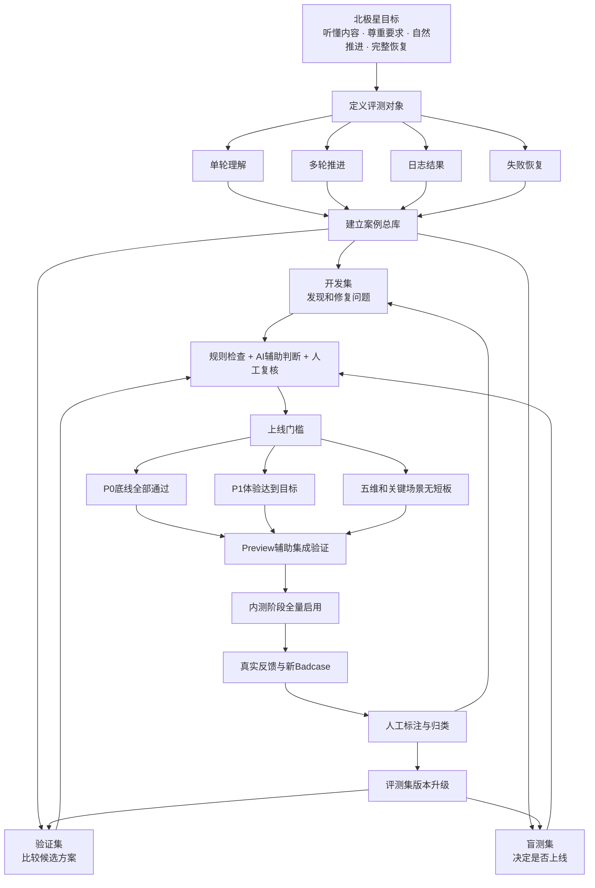
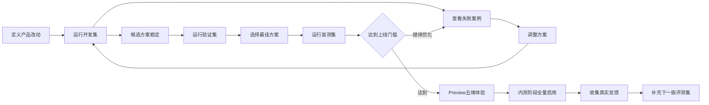

# 访谈意图评测与上线事实源

最后更新：`2026-08-02`

当前版本：`intent-eval-v1.13`

文档状态：`五维访谈意图评测事实源继续生效；事件中心 MVP 的板块 7候选已交付`

适用范围：`用户输入 → 意图理解 → 内容保留 → 访谈决策 → 下一步响应 → 日志结果 → 失败恢复`

## 当前有效口径｜2026-08-02

- 本文档继续管理五维访谈意图识别 v1.13、案例治理、线上反馈回流和既有 `legacy / enforce` 事实；历史评测数字与部署记录保留为当时的评测证据。
- 事件中心 MVP 的生成式问停、成果来源、两段式表达、事件日志闭环和可选入口由板块 7专项文档管理，当前候选详见[板块 7 Preview 候选交接](./technical/interview-event-centered/04o-board7-mvp-preview-candidate-handoff.md)。
- 板块 8独立负责事件中心 Preview、Go/No-Go、Production `optional + generative` 授权、线上冒烟、监控和回退；Production 在明确批准前继续 `legacy + baseline`。
- 事件中心大型模拟工作集、隐藏集、准入集和盲评转为上线后真实案例驱动的回归资产，不覆盖本文档既有五维意图评测事实。

## 1. 文档使命

这份文档是访谈意图评测、数据集建设和上线决策的统一事实源。

它帮助产品、理论、设计和研发团队在上下文不断增长时持续对齐以下问题：

1. 我们希望用户获得什么体验。
2. 哪些场景必须稳定通过。
3. 一条评测案例应该包含哪些信息。
4. 开发集、验证集和盲测集分别承担什么职责。
5. 什么结果支持版本上线。
6. 线上新问题如何回到评测体系。
7. 新输入出现后，哪些结论需要更新。

涉及访谈意图评测、案例归类、数据集划分和上线门槛的工作，应先阅读本文件。

### 1.1 文档边界

本文件负责：

- 意图识别的产品目标。
- 评测范围和错误分类。
- 评测数据集的设计与治理。
- 评判方式和上线门槛。
- 离线评测、预览验收、线上观察之间的关系。
- 当前阶段、下一步和决策记录。

相关文档继续承担各自职责：

- [访谈功能图谱](./diagrams/README.md)：解释访谈功能结构和各节点关系。
- [系统架构](./architecture.md)：解释系统如何实现和运行。
- [AI 质量闭环](./ai-quality-loop.md)：解释线上 Trace、反馈、案例、优化候选和发布观察。
- [五维理论文档](./theory/)：定义开心、充实、思考、改进和感谢各自需要理解的内容。

## 2. 北极星目标

### 2.1 用户最终感知

访谈意图识别需要让用户持续感受到：

> AI听懂了我刚刚说的内容，也尊重了我希望怎样继续这段对话。

用户体验可以拆成四个结果：

1. **内容被理解**：用户提供的人物、事件、感受、原因和修正得到准确理解。
2. **要求被执行**：生成日志、停止追问、换问法、跳过或切换等要求得到及时响应。
3. **访谈自然推进**：下一问承接当前内容，已经回答或明确否定的方向得到消费。
4. **结果保持完整**：混合表达中的有效内容进入后续快照和日志，失败恢复后保持一致。

### 2.2 一句话成功标准

> 用户说了什么、希望系统做什么、接下来怎样继续，三件事都得到正确处理。

### 2.3 本阶段发布范围

当前发布门槛聚焦文本输入。

未来语音转写继续使用同一套意图协议，并在语音能力接入后增加口语停顿、同音词、转写错误和标点缺失等专项案例。

## 3. 整体方案地图



## 4. 核心概念

### 4.1 评测集是总称

评测集代表所有经过整理、标注并带有明确成功标准的案例。

每条案例都需要回答：

- 用户当时处于什么对话背景。
- 用户说了什么。
- 系统应该理解哪些内容。
- 系统应该执行什么要求。
- 下一步应该如何推进。
- 哪些风险表现会伤害用户体验。

### 4.2 三类数据集

| 数据集 | 产品职责 | 使用方式 | 可见范围 |
|---|---|---|---|
| 开发集 | 帮助团队发现和修复问题 | 每次迭代反复运行，可查看具体失败原因 | 产品、理论、研发均可查看 |
| 验证集 | 帮助团队选择更好的候选方案 | 用于比较方案和调整门槛 | 负责人可查看汇总与必要案例 |
| 盲测集 | 帮助负责人做最终上线决策 | 在候选方案确定后运行 | 日常迭代保持封存，上线评审时使用 |

### 4.3 两类评测目标

每个数据集都需要同时包含两类目标。

| 目标 | 需要回答的问题 | 预期水平 |
|---|---|---|
| 底线回归评测 | 已经解决的高风险问题是否持续稳定 | 接近或达到100% |
| 体验能力评测 | 产品理解、推进和表达是否持续提升 | 达到门槛并优于当前基线 |

底线回归案例保护用户信任，体验能力案例推动产品逐步变好。

## 5. 评测对象

访谈是一条连续链路，评测需要覆盖四个层级。

### 5.1 单轮理解

检查一条用户输入是否得到正确理解：

- 当前回答是否有效。
- 用户提供了哪些内容。
- 用户提出了哪些控制要求。
- 用户是在陈述事件，还是直接对AI提出要求。
- 用户是否在修正、否定或表达不确定。

### 5.2 多轮推进

检查理解结果是否正确影响下一步：

- 下一问是否承接当前回答。
- 已经回答的目标是否得到消费。
- 明确回答“没有”后是否切换方向。
- 重复提问反馈后是否换角度。
- 疲惫和压力表达后是否提供低压力选择。

### 5.3 日志结果

检查访谈理解是否进入最终结果：

- 混合表达中的内容是否进入日志材料。
- 用户修正后的信息是否覆盖旧理解。
- 日志是否保留用户真正想表达的重点。
- 操作要求是否被排除在日志事实之外。

### 5.4 失败恢复

检查网络或AI服务中断后的连续性：

- 用户原话是否保留。
- 恢复前后的理解是否一致。
- 内容是否保持一份。
- 问题是否从正确位置继续。
- 用户是否能够自然完成这一轮。

## 6. 场景分类地图

### 6.1 P0：直接影响用户信任

| 场景 | 典型表达 | 正确产品表现 |
|---|---|---|
| 明确生成 | “直接生成吧” | 校验当前材料并进入日志收束 |
| 内容加生成 | “被理解很重要，直接生成吧” | 先保留内容，再进入日志收束 |
| 明确停止 | “先别问了” | 停止继续追问，按现有材料收束 |
| 内容加停止 | “同事帮我改完方案，先别问了” | 保留事件内容，然后停止追问 |
| 问题修复 | “太绕了，说简单点” | 保持已有内容，用更简单的方式提问 |
| 修复加回答 | “你问得太绕了，其实就是我松了口气” | 接收“松了口气”，下一问使用简化表达 |
| 事件转述 | “同事骂我有病，我很难受” | 作为事件内容继续访谈 |
| 强烈边界 | “你有病吧，别再问了” | 识别强烈不满，立即停止追问 |
| 恢复生成 | 提交后中断，再点击继续 | 复用原理解并从正确位置继续 |

### 6.2 P1：影响理解感和流畅度

| 场景 | 典型表达 | 正确产品表现 |
|---|---|---|
| 人物短回答 | “妈妈” | 结合人物问题理解为人物或关系 |
| 感受短回答 | “委屈” | 结合感受问题理解为情绪 |
| 存在性回答 | “没有”“有”“算是” | 消费当前问题并选择新的提问方向 |
| 修正AI理解 | “这不是因为开心，是因为终于结束了” | 清理旧推测，接收新的原因 |
| 表达不确定 | “可能就是……” | 保持当前阶段，提供低压力续说入口 |
| 重复提问反馈 | “这个刚才问过了” | 换信息目标和提问角度 |
| 疲惫或压力 | “有点累，不想想这么多” | 提供继续、整理当前版本或退出 |
| 跳过当前问题 | “这个不想回答” | 尊重跳过并选择新的方向 |
| 切换事件 | “我想说另一件事” | 开启新的事件片段 |
| 切换维度 | “这个更像感谢” | 引导切换到合适维度 |

### 6.3 五维专项理解

通用意图协议需要在五个维度中保持一致，内容理解继续遵守各维度理论：

- 开心：发生了什么轻快乐、从哪里来、带来怎样的状态变化。
- 充实：做了什么、推进了什么、为什么觉得今天没有白过。
- 思考：什么片段触发了新理解、判断发生了怎样的变化。
- 改进：什么情境值得复盘、卡点或有效条件是什么、下次怎样尝试。
- 感谢：谁做了什么、回应了什么需要、为什么值得珍惜。

每个维度都需要覆盖短回答、混合表达、否定修正和收束控制。

## 7. 单条案例标准

### 7.1 必填信息

| 字段 | 产品含义 |
|---|---|
| 案例编号 | 稳定且唯一的身份，例如 `INT-EVAL-001` |
| 案例版本 | 当前案例规则版本 |
| 案例来源 | 产品要求、历史Badcase、匿名真实对话或人工扩写 |
| 风险等级 | P0、P1或P2 |
| 所属场景 | 短回答、混合表达、引用转述、修正等 |
| 所属维度 | 开心、充实、思考、改进、感谢或通用 |
| 前置对话 | 当前问题、必要的历史回答和已知内容 |
| 用户原话 | 本轮需要被理解的表达 |
| 应保留内容 | 进入后续访谈和日志的有效内容 |
| 应执行要求 | 生成、停止、修复、跳过、切换等 |
| 下一步期望 | 继续提问、换角度、低压选择或日志收束 |
| 风险表现 | 会伤害用户体验的明确行为 |
| 评判方式 | 自动检查、AI辅助或人工复核 |
| 通过条件 | 可明确判断的成功标准 |
| 语义家族 | 同义改写和近似案例的分组编号 |

### 7.2 案例示例

| 字段 | 内容 |
|---|---|
| 案例编号 | `INT-EVAL-021` |
| 风险等级 | P0 |
| 所属场景 | 内容加生成 |
| 所属维度 | 感谢 |
| 前置对话 | AI问：“这件事为什么让你觉得被照顾到了？” |
| 用户原话 | “她愿意先听我说完，这对我很重要，直接生成吧。” |
| 应保留内容 | 对方愿意听用户说完；用户重视被完整倾听 |
| 应执行要求 | 生成当前版本日志 |
| 下一步期望 | 接收内容并进入日志收束 |
| 风险表现 | 继续追问；遗漏“愿意听我说完”；把“直接生成”写进日志 |
| 通过条件 | 内容完整进入材料，同时正确进入生成流程 |

## 8. 数据来源与质量标准

### 8.1 数据来源

评测案例按以下顺序持续积累：

1. 已经确认的产品要求。
2. 当前人工验收时使用的表达。
3. 历史自动化测试和Badcase。
4. 匿名化的真实用户对话。
5. 基于真实语义家族生成的口语变体。
6. 未来语音转写产生的表达变体。

### 8.2 真实案例处理原则

- 保留影响意图理解的上下文。
- 删除姓名、联系方式、地址和可识别身份的信息。
- 将敏感细节替换为等价占位信息。
- 保留案例来源、时间和授权范围。
- 产品和理论负责人共同确认标签。
- 用户原话仅进入受控评测资产。

### 8.3 正反案例平衡

每个控制行为都需要同时覆盖：

- 应该触发的表达。
- 含有相同关键词但应继续访谈的表达。
- 内容和要求同时出现的表达。
- 口语、省略、错别字和情绪化表达。

例如“结束”需要同时覆盖：

- “访谈到这里结束吧。”
- “这个项目终于结束了。”
- “项目终于结束了，我松了口气，直接生成吧。”

## 9. 数据集建设方案

### 9.1 第一阶段：40条种子集

第一批案例用于建立共同语言、验证案例模板和形成错误分类。

| 场景 | 数量 |
|---|---:|
| 明确停止、生成、换问法、跳过与切换 | 8 |
| 内容加控制要求 | 8 |
| 上下文短回答 | 8 |
| 引用、转述、否定和修正 | 6 |
| 重复提问、疲惫和压力表达 | 5 |
| 失败恢复 | 5 |
| 合计 | 40 |

这40条全部进入开发集，并覆盖五个维度。

### 9.2 第二阶段：扩充到120条

当案例定义和评判标准稳定后，将总库扩充到120条：

| 数据集 | 数量 | 主要用途 |
|---|---:|---|
| 开发集 | 72 | 日常发现问题和修复 |
| 验证集 | 24 | 比较候选方案 |
| 盲测集 | 24 | 上线前最终确认 |
| 合计 | 120 | 首个可持续运行版本 |

### 9.3 划分原则

- 按语义家族划分，保持同义改写在同一数据集。
- 五个维度在三类数据集中都有覆盖。
- P0和P1在三类数据集中都有覆盖。
- 验证集和盲测集优先使用真实表达或贴近真实表达的案例。
- 相同事件模板、相同前置问题和高度相似的表达进入同一组。
- 每次扩充时检查重复、标签冲突和场景失衡。

## 10. 评判体系

### 10.1 自动检查

适合判断明确结果：

- 是否执行停止、生成、修复、跳过或切换。
- 内容是否进入后续材料。
- 操作指令是否被排除在日志事实之外。
- 是否重复追问已经消费的目标。
- 恢复前后的理解是否一致。
- 用户内容是否重复或丢失。
- 一轮处理的资源消耗是否符合产品约束。

### 10.2 AI辅助判断

适合大批量初筛：

- 下一问是否承接用户表达。
- 问法是否清晰。
- 语气是否尊重用户节奏。
- 日志是否忠于用户原意。
- 修正后的理解是否自然覆盖旧推测。

AI辅助判断需要定期与人工结果对照，保持评判口径稳定。

### 10.3 人工复核

以下情况进入人工复核：

- P0案例失败。
- 自动检查和AI辅助判断结论冲突。
- 用户表达存在多种合理理解。
- 涉及五维理论边界。
- 涉及情绪压力、关系伤害或强烈不满。
- 新场景首次进入评测集。

### 10.4 人工标注一致性

- 产品负责人判断用户意图、产品动作和体验结果。
- 理论负责人判断五维内容理解。
- 两位评审意见一致后形成正式标签。
- 存在分歧时先完善案例描述和通过条件，再进入数据集。

### 10.5 核心评分边界

本轮核心评测对象固定为`IntentAssessmentV1`，评分回答“系统是否正确描述了用户这一轮表达”。核心评分包含：

1. 控制信号是否正确。
2. 对话行为是否正确。
3. 内容存在性和有效内容边界是否正确。
4. 用户表达指向的对象是否正确。
5. 短回答是否结合当前问题得到正确理解。
6. 引用、转述、修正、不确定和压力表达是否得到正确分类。
7. 识别结果是否稳定、可复用、可追溯。

`TurnDecisionV1`作为相邻策略接口单独验收，检查同一份意图结果是否稳定映射到抽取、推进、停止和下一步动作。该部分采用契约通过率，不与意图识别准确率混合计算。

五维端到端体验作为辅助验证，检查意图结果是否被槽位抽取、问题规划、日志收束和恢复链路正确采用。端到端验证采用通过/失败和问题记录，不承担本轮核心体验评分。

20条普通访谈用于观察共享Preview中的调用次数、解析与fallback情况、恢复复用和整体响应时长。速度结果用于发现集成回退，并与意图准确率分开报告。

## 11. 上线门槛

### 11.1 P0硬门槛

以下指标全部满足时，版本具备进入下一发布阶段的资格：

| 指标 | 门槛 |
|---|---:|
| 明确停止、生成和修复正确识别率 | 100% |
| 事件引用或转述误识别为高影响控制 | 0次 |
| 内容加控制表达的内容边界识别正确率 | 100% |
| 高影响控制的候选、指向与置信条件 | 100%满足 |
| 恢复前后`IntentAssessmentV1`一致率 | 100% |
| 用户原话与意图结果不可追溯 | 0次 |
| 五个维度语境中的P0识别失败 | 0次 |

### 11.2 P1意图识别门槛

| 指标 | 门槛 |
|---|---:|
| 意图结果整体加权分 | ≥95% |
| 上下文短回答理解正确率 | ≥95% |
| 对话行为多标签F1 | ≥90% |
| 引用目标准确率 | ≥95% |
| 内容存在性准确率 | ≥95% |
| 历史回归集表现 | 保持当前基线或提升 |

### 11.3 多次运行规则

AI输出具有一定变化时：

- P0关键案例运行3次，3次均需通过。
- P1体验案例运行3次，记录平均通过率和最低表现。
- 同一案例出现不同结论时进入人工复核。
- 报告同时展示平均值、最低值和失败案例。

### 11.4 Preview辅助验收门槛

意图识别离线门槛通过后，Preview用于确认识别结果被后续链路正确采用：

| 指标 | 门槛 |
|---|---:|
| 五维关键动作正确完成 | 5/5 |
| 中断后原话可恢复并完成 | 100% |
| 用户永久停在“处理中” | 0次 |
| 意图结果与后续动作一致 | 100% |
| 明显重复追问已回答内容 | 0次 |
| 日志保留内容且排除控制指令 | 100% |

响应速度采用以下首版体验目标：

| 用户等待节点 | 门槛 |
|---|---:|
| 用户原话出现在对话中 | ≤0.5秒 |
| 确定性控制或换问法完成 | P95≤1.5秒 |
| 需要模型理解的普通访谈轮 | P50≤12秒，P95≤20秒 |
| 单维度日志初稿完成 | P50≤15秒，P95≤25秒 |
| 用户永久停在“处理中” | 0次 |

Preview每次候选验收至少覆盖五个维度各1条关键场景；五维日志文风、整体陪伴感和完整访谈自然度作为问题观察项，不计入本轮意图识别核心评分。共享环境积累到20条普通访谈轮后再计算P50和P95，用于判断意图改造是否引入集成速度回退。样本未达到20条时，同时报告全部样本、最大值和环境说明。

### 11.5 上线决策规则

| 结果 | 产品决策 |
|---|---|
| P0全部通过，P1达到门槛 | 进入Preview辅助集成验证 |
| Preview辅助集成验证通过 | 内测阶段全量启用并观察真实问题 |
| 用户量进入稳定规模 | 评估分流实验和精细化灰度的收益 |
| P0出现失败 | 回到开发集修复并重新评测 |
| P1低于门槛 | 继续优化体验并比较新方案 |
| 新版本引入历史回退 | 修复回退后重新评测 |

## 12. 发布与评测流程



### 12.1 开发阶段

1. 产品先定义成功体验和错误类型。
2. 使用开发集反复发现问题。
3. 每次修复记录影响了哪些案例。
4. 新出现的Badcase进入开发集。
5. 历史已解决问题持续保留为回归案例。

### 12.2 方案选择阶段

1. 候选方案在开发集上稳定后进入验证。
2. 使用验证集比较当前版本和候选版本。
3. 同时观察总体表现和场景切片。
4. 选择P0稳定、P1表现更好的方案。

### 12.3 上线决策阶段

1. 候选版本确定后运行盲测集。
2. 按硬门槛和体验门槛判断。
3. 通过后完成五维Preview体验。
4. Preview覆盖完整访谈、日志生成和失败恢复。
5. 结果形成版本化上线报告。

### 12.4 线上观察阶段

1. 新策略先进入对照观察。
2. 观察真实用户的停止、修正、退出和日志编辑行为。
3. 每周抽样查看典型对话。
4. 新问题经过匿名化和人工标注后进入下一版开发集。
5. 稳定解决的问题进入长期回归集。

## 13. 线上产品指标

离线评测决定版本是否具备上线资格，线上指标验证真实用户价值。

### 13.1 理解类指标

- 用户连续修正AI理解的比例。
- 用户表达“不是这个意思”的比例。
- 用户要求换问法的比例。
- 短回答后出现重复确认的比例。

### 13.2 边界类指标

- 用户要求停止后继续出现追问的比例。
- 强烈不满表达的发生量。
- 低压力选择后的继续、整理和退出分布。

### 13.3 完成类指标

- 混合表达后成功生成日志的比例。
- 访谈中途退出率。
- 失败后继续生成成功率。
- 日志生成后大幅删除或改写的比例。

### 13.4 反馈类指标

- “理解准确”“追问合适”“尊重节奏”等正向标签。
- “没理解我的意思”“追问重复”“忽视停止或边界”等负向标签。
- 文字反馈中的新表达和新场景。

线上指标需要结合真实对话抽样判断，避免单一行为指标带来错误结论。

## 14. 评测集治理

### 14.1 版本命名

采用以下格式：

```text
intent-eval-v主版本.次版本
```

示例：

- `intent-eval-v1.0`：第一版评测方案和种子集。
- `intent-eval-v1.1`：补充案例、保持核心门槛。
- `intent-eval-v2.0`：目标、分类或门槛发生重要变化。

### 14.2 更新触发条件

出现以下情况时更新本事实源：

- 用户提出新的产品要求。
- 发现新的高风险Badcase。
- 五维理论对意图理解提出新约束。
- 评测指标或上线门槛调整。
- 数据集规模和划分方式变化。
- 新模型、新输入方式或新访谈入口上线。
- 线上真实数据揭示新的表达分布。

### 14.3 更新流程

1. 在“新输入记录”中登记来源和影响。
2. 判断它影响目标、场景、案例、门槛还是流程。
3. 更新对应章节。
4. 在“决策记录”中写明结论和原因。
5. 更新文档版本与最后更新时间。
6. 同步需要调整的评测案例和发布报告。

### 14.4 盲测集维护

- 盲测集仅用于最终上线判断。
- 一旦某条盲测案例被用于具体优化，它会转入开发集。
- 同时补充新的同等级盲测案例。
- 每次重大版本或模型升级后检查盲测集代表性。
- 定期使用新的匿名真实表达刷新盲测集。

### 14.5 案例状态

| 状态 | 含义 |
|---|---|
| 草稿 | 案例正在整理 |
| 待复核 | 等待产品或理论负责人确认 |
| 生效 | 已进入正式评测 |
| 回归 | 已解决并长期守护 |
| 替换 | 已由更具代表性的案例接替 |
| 归档 | 保留历史，不参与当前评分 |

## 15. 团队职责

| 角色 | 主要职责 |
|---|---|
| 产品负责人 | 定义成功体验、错误分类、风险等级和上线门槛 |
| 理论负责人 | 确认五维内容理解和维度边界 |
| 研发负责人 | 保证评测可以稳定运行、结果可追溯 |
| 数据或运营负责人 | 整理匿名真实案例和线上指标 |
| 发布负责人 | 根据盲测、Preview和线上观察做阶段决策 |

在当前团队规模下，同一个人可以承担多个角色，但每项职责需要有明确负责人。

## 16. 历史阶段记录（截至 2026-07-21）

本节保留五维意图 v1.13 在 `2026-07-21` 的评测、Preview 和发布证据。事件中心板块 7/8 的当前状态以上方“当前有效口径”和生成式专项 Map 为准。

截至`2026-07-21`：

| 项目 | 状态 | 说明 |
|---|---|---|
| 意图识别P0+P1能力改造 | 已完成 | 已覆盖控制要求、混合表达、短回答、转述和恢复 |
| 自动化回归 | 已完成 | 当前全量测试为187个文件、1392个用例通过；类型检查与生产构建通过 |
| 评测事实源 | 已建立 | 本文档为统一依据 |
| 40条种子案例 | 已完成 | 已覆盖六类场景和五个维度 |
| 产品与理论口径复核 | 已完成 | 已按产品动作、五维内容边界和风险表现完成双角色复核 |
| 早期产品与理论复核 | 已完成 | 由同一执行主体完成，结果作为历史基线保留 |
| 当前版本基线评测 | 已完成 | 初始75%，共同原因修复后达到100% |
| 120条正式评测集 | 已完成 | 开发集72、验证集24、盲测集24 |
| 正式离线门槛 | 已通过 | 连续3次120/120，P0失败为0 |
| Preview五维复测 | 执行侧通过（本机历史证据，公开精简包未收录：`2026-07-20-preview-experience-gate-v2.md`） | 五维关键动作5/5；重复追问与标题问题已修复；执行侧体验评分4.7/5 |
| 响应速度复测 | 正式20条通过（本机历史证据，公开精简包未收录：`2026-07-21-preview-adoption-and-20-turn-observation.md`） | 20条普通访谈服务端P50为9.17秒、P95为9.99秒、最大值为10.13秒，达到P50≤12秒、P95≤20秒门槛 |
| 共享Preview环境 | 已完成 | 当前候选deployment为`redacted-deployment-id`；意图策略为enforce；共享Preview使用独立数据库、独立应用账号和完整迁移；稳定地址为`https://xingfuxitong-example-user-code-example-team.vercel.app` |
| 隔离验收数据 | 已完成 | 已创建空白独立评审账号；该账号仅存在于Preview数据库，生产数据库同名账号数量为0 |
| 意图识别执行侧人工复核 | 已完成（本机历史证据，公开精简包未收录：`2026-07-20-intent-execution-side-review.md`） | 24条中20条完全正确、3条部分正确、1条合理歧义；核心加权分98.1%；高影响控制错误为0 |
| 四条分歧产品裁决 | 已完成（本机历史证据，公开精简包未收录：`2026-07-20-intent-adjudication-resolution.md`） | 3条人工字段判断被采纳，1条歧义完成定义收口；修正后真实模型连续3次24/24 |
| 新一轮外部评审封存集 | 已完成（本机历史证据，公开精简包未收录：`2026-07-21-external-review-seal.md`） | 新增24条未参与规则优化的案例，覆盖五维和六类场景；候选结果与完整性指纹已经冻结 |
| 新封存集内部复核 | 已完成（本机历史证据，公开精简包未收录：`2026-07-21-internal-external-set-review.md`） | 19条正确、4条部分正确、1条错误；内部裁决加权分94.2%，P0硬门槛未通过 |
| 五条意图边界修正 | 已通过（本机历史证据，公开精简包未收录：`2026-07-21-intent-boundary-regression.md`） | `229/231/233/247/248`全部修复；新24条规则层24/24，规则＋模型连续3次24/24，P0失败为0 |
| 意图识别独立产品评审 | 已通过（本机历史证据，公开精简包未收录：`2026-07-21-independent-intent-review.md`） | 产品负责人完成24/24条独立判断；23条完全正确，1条P1内容边界问题；P0为10/10，加权分99.17% |
| `INT-EVAL-252`内容边界修正 | 已通过 | 未完成表达保持`possible`，有效内容为空；24条评审回归和120条正式意图回归均为100% |
| 120条意图金标准 | 已完成 | 已物化72条开发、24条验证和24条裁决后回归案例的`IntentAssessmentV1`标签；当前版本为`v1.7-blind-adjudicated` |
| 意图自动化核心门槛 | 已通过（本机历史证据，公开精简包未收录：`2026-07-20-intent-core-release-gate.md`） | 裁决后规则层120/120；规则＋模型连续3次24/24；P0失败为0 |
| 意图回归复核入口 | 已部署 | 稳定地址`https://xingfuxitong-example-user-code-example-team.vercel.app/intent-review`展示修正后的24条结果，只展示上下文、原话和系统结果，用于独立人工回归复核 |
| 五维端到端验证 | 辅助验证通过（本机历史证据，公开精简包未收录：`2026-07-21-preview-adoption-and-20-turn-observation.md`） | 五个维度各1条关键场景，意图结果被后续链路正确采用，结果为5/5 |
| 20条普通访谈观察 | 已通过（本机历史证据，公开精简包未收录：`2026-07-21-preview-adoption-and-20-turn-observation.md`） | 20/20完成，20/20正常内容路由，每轮恰好1次抽取调用，模型成功20/20，fallback为0 |
| 发布决策 | 已全量上线（本机历史证据，公开精简包未收录：`2026-07-21-production-enforce-release.md`） | 正式环境使用enforce；当前deployment为`redacted-deployment-id`；公开主链和正式候选访谈验证通过 |
| 真实效果观察 | 进行中 | 内测阶段直接收集真实问题；P0出现1条即触发紧急修复与回退判断，P1按语义家族累计 |

## 17. 已确认决策

以下结论作为当前执行依据：

1. 评测集是总库，开发集、验证集和盲测集按用途划分。
2. 当前产品优化使用“开发集”称呼，便于表达产品迭代用途。
3. 同一轮内容和控制要求需要同时得到处理。
4. 评测覆盖单轮理解、多轮推进、日志结果和失败恢复。
5. P0底线案例采用硬门槛。
6. P1体验案例采用通过率、分维度结果和人工体验评分。
7. 同义改写按语义家族划分，保持在同一数据集。
8. 自动检查、AI辅助和人工复核共同参与评判。
9. 盲测集仅用于上线决策，被用于优化后转入开发集并补充新案例。
10. 离线评测、Preview体验和线上观察共同组成完整上线依据。
11. 真实用户案例经过匿名化和复核后进入评测体系。
12. 新Badcase优先进入开发集，稳定解决后进入长期回归集。
13. 40条种子集作为第一版开发集，当前版本达到40/40，P0失败为0。
14. 当前正式评测采用72条开发集、24条验证集和24条第七轮封存盲测集。
15. 历次盲测失败案例均转入开发回归，最终盲测只保留未参与具体优化的案例。
16. 正式离线评测连续3次达到120/120后，候选版本进入五维Preview体验。
17. 五维Preview的P0关键行为全部通过，控制要求、内容保留、转述路由和失败恢复均符合预期。
18. Preview人工体验评分为3.8/5，感谢维度存在一次重复追问，开心日志fallback标题自然度不足，多轮完整响应耗时偏长。
19. Preview阶段曾保持生产legacy并完成P1复测；该阶段已经结束，当前发布策略以第54–56项为准。
20. 服务进程中断留下的processing回复采用90秒处理租约，租约过期后用户可以继续生成；并发中的有效请求继续受到保护。
21. P1复测已修复感谢维度重复追问、转述与帮助动作混杂、开心fallback标题生硬和多次长重试问题；执行侧体验评分达到4.7/5。
22. 首版速度目标固定为：确定性控制P95不超过1.5秒、普通访谈轮P50不超过12秒且P95不超过20秒、日志初稿P50不超过15秒且P95不超过25秒。
23. 小样本只用于候选体验判断；共享Preview至少积累20条普通访谈轮后，才形成正式P50和P95结论。
24. 意图识别独立评审、策略契约验证、五维辅助采用验证和运行观察共同构成全量发布依据。
25. 当前执行顺序固定为：先补齐共享Preview与隔离测试数据，再完成意图识别核心评测和独立复核，随后运行策略契约、五维辅助验证和20条运行观察，最后共同讨论后续动作。
26. 本轮核心评分聚焦`IntentAssessmentV1`；策略映射采用独立契约测试；五维端到端和20条普通访谈作为辅助集成与性能验证。
27. 意图识别核心评分采用六项指标：控制信号25%、对话行为15%、内容与控制边界20%、引用目标15%、上下文理解15%、稳定性与可追溯10%。
28. 模型合并结果只能补充规则层无法确定的信息；当前问题已经确定的回答目标、明确控制的指向对象和规则确认的引用目标保持稳定。
29. 自动化核心评测采用120条规则层全量检查和24条规则＋模型盲测连续3次运行；独立人工评审继续作为单独上线依据。
30. 执行侧人工复核结果为20条完全正确、3条部分正确、1条合理歧义；按六项既定权重计算核心分98.1%，高影响控制硬门槛继续通过。
31. `INT-EVAL-213`存在案例内容与产品期望不一致，`INT-EVAL-217`和`INT-EVAL-225`存在标签口径分歧，`INT-EVAL-223`存在合理歧义；四条进入裁决清单。
32. 当前24条盲测已经被执行主体查看和讨论，后续作为回归资产使用；外部独立评审需要补充新的封存案例。
33. 执行侧人工复核用于发现产品和金标准问题，独立产品评审作为全量发布的独立依据。
34. 跨维度内容继续保留；只有内容在语义上回答当前问题时才消费`answeredTarget`。模型清空标准目标时需要提供`semantic_target_mismatch`原因码。
35. `switch_event`统一指向`current_event`；强烈被迫回答表达同时记录`give_feedback`；`frustration=mild`覆盖轻度不满、访谈压力和当前精力不足。
36. 四条分歧修正后的真实模型评测连续3次24/24，规则层120/120，完整测试186个文件、1377个用例通过。
37. 当前24条在新盲测补位前继续作为正式回归守护资产，补位完成后结束其盲测职责。
38. 新24条外部评审案例使用`INT-EVAL-229–252`，当前候选结果已经冻结；评审完成前不参与规则、提示词或标签优化。
39. 新评审包包含19条规则＋模型合并结果和5条确定性结果；19次模型调用均成功返回合法结构化结果。
40. 产品负责人授权当前执行主体直接完成新封存集评分；结果登记为内部复核，不能直接对外表述为外部独立评审。
41. 内部复核结果为19条正确、4条部分正确、1条错误；核心加权分94.2%，P0硬门槛未通过。
42. `INT-EVAL-229/231/233/247/248`进入下一轮问题清单；`INT-EVAL-249/251`进入金标准口径复核清单。
43. 五条意图边界已完成修正：纯控制表达保持内容为空；问题压力加明确回答继续推进；强烈不满停止且隔离攻击文本；感谢原因绑定当前目标；普通事实与感受保持完整。
44. 新24条在参与本轮优化后正式转为回归资产。规则层达到24/24，规则＋模型连续3次达到24/24，三次P0失败均为0。
45. 真实模型三轮共发起48次识别调用，31次成功、17次进入保护性fallback；最终意图准确率保持100%。provider稳定性继续进入共享Preview的20条普通访谈观察。
46. 当前完整自动化回归为187个文件、1392个用例，类型检查与生产构建通过。
47. 共享Preview五维辅助采用验证达到5/5，控制与内容在五个维度中均被后续链路正确采用。
48. 共享Preview完成20条普通访谈观察：20/20正常完成，每轮恰好一次抽取调用，provider成功20/20，fallback为0。
49. 20条普通访谈服务端完整处理时间为P50 9.17秒、P95 9.99秒、最大值10.13秒，达到既定速度门槛；受保护验收通道时间作为环境开销单独报告。
50. 系统侧发布前置验证和独立产品评审均已达标，并共同支持第54项全量发布决策。
51. 产品负责人完成24条独立评审：23条完全正确、1条内容边界错误，P0为10/10，六项加权分99.17%，核心门槛通过。
52. `INT-EVAL-252`的`presence=possible`继续表达用户正在组织内容；`evidenceText`应为空，防止将“我想说的是……”视为可用访谈材料。
53. `INT-EVAL-252`已经按产品裁决修正，三类未完成表达、24条独立评审回归和120条正式意图回归全部通过。
54. 内测阶段采用全量发布和问题驱动迭代；当前样本量下，直接观察真实使用更有利于快速发现和解决问题。
55. 正式环境已切换到`enforce`，当前deployment为`redacted-deployment-id`，主域名公开smoke与正式候选访谈验证通过。
56. 上一正式版本`redacted-deployment-id`和`legacy`档位继续承担P0即时回退能力。

## 18. 当前开放问题

以下问题将在后续发布阶段确定：

1. 产品复核和理论复核的具体负责人。
2. 第一批真实案例的来源范围。
3. 新封存盲测的外部独立评审人。
4. 评测集的月度或季度刷新频率。
5. 用户量达到什么规模后，再引入分流实验和精细化灰度。
6. 语音输入进入评测体系的时间点。

开放问题形成结论后，需要写入“已确认决策”，并从本节移除。

## 19. 下一步执行清单

当前产品主线按以下顺序推进：

1. 共享Preview与隔离测试数据已经补齐，保持当前候选版本和评审账号稳定。
2. 120条`IntentAssessmentV1`金标准和自动化核心评测已经完成，保持对应资产封存。
3. 24条执行侧人工复核已经完成，保持逐条判断和评分报告可追溯。
4. 3条字段偏差和1条合理歧义已经完成产品裁决，保持裁决报告和回归结果可追溯。
5. `229/231/233/247/248`意图边界修正与连续回归已经完成，新24条保持为长期回归资产。
6. `IntentAssessmentV1 -> TurnDecisionV1`策略契约已通过自动化回归，保持120条正式案例和24条新增回归案例持续通过。
7. 当前候选和意图回归复核入口已经部署到共享Preview，保持稳定地址可访问。
8. 五维辅助采用验证已经完成并达到5/5，保持报告可追溯。
9. 共享Preview的20条普通访谈观察已经完成并达到速度、调用次数和稳定性门槛，保持报告可追溯。
10. 系统侧结果已经汇总完成，正式环境已经全量使用enforce。
11. 独立评审已经完成24条意图回归复核，加权分99.17%，P0为10/10，保持逐条结果可追溯。
12. `INT-EVAL-252`已经完成修正，未完成表达语义家族和意图全量回归均通过。
13. 正式环境已经全量启用新意图识别，持续观察重复追问、修正表达、停止后追问、未完成表达和意图采用异常。
14. P0问题出现1条即进入紧急修复和回退判断；P1问题按语义家族合并后快速排期。
15. 将真实新问题持续回流到下一版评测集；用户量稳定后再引入分流实验和精细化灰度。

## 20. 新输入记录

每次出现影响本方案的新输入时，按以下格式登记：

| 日期 | 输入来源 | 新信息 | 影响范围 | 处理状态 |
|---|---|---|---|---|
| 2026-07-20 | 产品讨论 | 需要建立独立于会话的固定事实源，持续防止目标偏移 | 全局治理 | 已纳入 |
| 2026-07-20 | 种子集基线 | 40条初始通过率75%，发现纯控制残留、引用误触发、因果修正和压力反馈四类问题 | 开发集与意图策略 | 已修复并达到100% |
| 2026-07-20 | 第一至第五轮盲测 | 连续发现收束、成稿、跳过、切换、修正、疲惫和转述等自然口语表达 | 意图规则与回归资产 | 已修复并完成案例替换 |
| 2026-07-20 | 第六轮盲测 | 达到22/24，剩余控制语清理和拒答标签两处问题 | 内容边界与对话行为 | 已修复并完成案例替换 |
| 2026-07-20 | 第七轮盲测 | 24条封存案例全部通过，正式120条连续3次达到100% | 离线上线门槛 | 已通过，进入Preview |
| 2026-07-20 | 五维Preview | 五维关键意图全部正确；发现感谢维度重复追问、开心fallback标题生硬和响应耗时偏长 | P1体验与发布决策 | 已记录，进入下一轮优化 |
| 2026-07-20 | 中断恢复演练 | 服务进程中断后，刷新页面会长期停在“处理中” | P0恢复与UserTurn状态 | 已增加90秒处理租约并复测通过 |
| 2026-07-20 | 恢复复测 | 同一clientTurnId恢复完成，assessment时间与版本不变，Trace记录reusedAssessment=true | P1持久化与恢复 | 已通过 |
| 2026-07-20 | P1体验复测 | 重复追问、转述动作混杂和开心fallback标题已修复；普通访谈轮9.6～11.5秒，日志初稿12.6秒 | P1体验与速度门槛 | 执行侧通过，评分4.7/5 |
| 2026-07-20 | Preview环境核对 | 当前共享Preview数据库连接配置为空，无法形成共享环境正式速度样本 | 发布准备 | 待补齐隔离数据库配置 |
| 2026-07-20 | 执行顺序修正 | 先补齐共享Preview与隔离测试数据，再完成独立五维评分，同时累计20条普通访谈并统计速度 | 发布准备与独立评审 | 已被后续评测范围修正替代 |
| 2026-07-20 | 共享Preview补齐 | 候选版本已部署，Preview启用enforce，独立数据库完成29条迁移，评审账号仅存在于Preview | 发布准备与数据隔离 | 已完成 |
| 2026-07-20 | 评测范围修正 | 核心对象需要收敛到意图识别模块，五维端到端只验证下游是否正确采用意图结果 | 评分口径与执行顺序 | 已纳入并暂停旧五维体验评分卡 |
| 2026-07-20 | 首次真实模型核心盲测 | 规则＋模型合并结果为94.2%，模型覆盖了回答目标和明确控制指向 | 意图合并规则 | 已修复并进入连续复测 |
| 2026-07-20 | 意图核心复测 | 修正后24条盲测连续3次达到24/24，三次P0失败均为0 | 意图识别核心门槛 | 自动化通过，进入独立人工评审 |
| 2026-07-20 | 执行侧人工复核 | 24条中20条完全正确、3条部分正确、1条合理歧义；发现跨维度回答目标、事件指向、强边界反馈标签和疲惫压力定义问题 | 意图协议、金标准与发布判断 | 已记录，进入产品裁决 |
| 2026-07-20 | 四条分歧裁决 | 跨维度目标、切换事件指向、强边界反馈和低状态标签完成统一口径 | 意图协议、模型提示与金标准 | 已修正并连续复测通过 |
| 2026-07-21 | 新外部评审集封存 | 新增24条未参与规则优化的五维案例，候选结果和完整性指纹已冻结 | 外部独立评审 | 已发布，等待评审结果 |
| 2026-07-21 | 产品负责人授权直接评分 | 当前执行主体完成24条逐项判断，发现5条真实问题和2条金标准口径分歧 | 意图识别核心评测 | 内部复核完成，进入产品讨论 |
| 2026-07-21 | 五条意图边界修正 | 纯控制残留、压力加回答误停、强烈不满内容污染、感谢原因目标遗漏和普通内容截短均已收口 | 意图规则、模型提示与内容保护 | 连续回归通过 |
| 2026-07-21 | 新24条回归复测 | 规则层24/24；规则＋模型连续3次24/24；三次P0失败均为0 | 意图识别核心门槛 | 已通过，进入Preview辅助验证 |
| 2026-07-21 | provider波动观察 | 三轮48次模型请求中31次成功、17次由fallback接住，最终意图结果保持100%正确 | 稳定性与速度 | 纳入20条普通访谈观察 |
| 2026-07-21 | 共享Preview五维辅助验证 | 内容＋生成、内容＋停止、问题修复、修正理解和事件转述五类场景均被下游正确采用 | 五维集成 | 5/5通过 |
| 2026-07-21 | 共享Preview 20条普通访谈 | 20/20完成，每轮恰好一次抽取调用，provider成功20/20，fallback为0；服务端P50 9.17秒、P95 9.99秒 | 稳定性、调用次数与速度 | 已通过 |
| 2026-07-21 | 产品负责人独立评审 | 24条中23条完全正确；`INT-EVAL-252`将未完成表达显示为有效内容 | 意图核心评分与内容边界 | 加权分99.17%，P0通过，P1进入处置讨论 |
| 2026-07-21 | 产品阶段判断 | 当前处于内测和大幅调整阶段，用户与提问数量较少，影子观察成本高且效果有限 | 发布策略 | 决定直接全量上线，以真实问题驱动快速迭代 |
| 2026-07-21 | 未完成表达修正 | `presence=possible`继续保留，`evidenceText`改为空；120条与24条回归均为100% | 内容边界与回归资产 | 已完成 |
| 2026-07-21 | 正式环境全量发布 | Production切换enforce，主域名指向`redacted-deployment-id`；公开smoke和正式访谈验证通过 | 生产发布与真实效果观察 | 已完成，进入问题驱动观察 |

## 21. 决策记录

| 日期 | 决策 | 原因 | 影响 |
|---|---|---|---|
| 2026-07-20 | 建立独立的访谈意图评测事实源 | 后续上下文会持续增长，需要稳定依据统一产品、评测和上线决策 | 后续相关工作优先读取并更新本文档 |
| 2026-07-20 | 采用开发集、验证集和盲测集三层结构 | 日常优化、方案选择和最终上线需要各自独立的依据 | 减少反复使用同一批案例带来的判断偏差 |
| 2026-07-20 | 采用P0硬门槛和P1体验门槛 | 用户信任问题需要稳定守护，体验问题需要持续提升 | 上线报告需要同时展示底线和体验结果 |
| 2026-07-20 | 40条种子案例达到100%后进入正式评测集扩充 | P0失败已经归零，专项历史回归保持稳定 | 下一阶段扩充到120条并建立独立验证和盲测 |
| 2026-07-20 | 盲测失败案例即时转入开发回归并补入新案例 | 防止用已参与优化的案例证明泛化能力 | 七轮首跑结果全部保留，最终盲测保持独立 |
| 2026-07-20 | 正式离线门槛判定通过 | 开发、验证和盲测均为100%，五维与六类场景均无失败 | 候选版本进入五维Preview体验 |
| 2026-07-20 | Preview判定为P0通过、P1待优化 | 五维关键行为和恢复符合预期，人工体验评分3.8/5，仍有重复追问、标题自然度和耗时问题 | 生产保持legacy，Preview继续enforce |
| 2026-07-20 | 增加processing回复90秒处理租约 | 服务进程中断无法执行失败落库，用户重新打开页面后需要可恢复入口 | 超时后允许同一回复继续生成，并通过条件更新避免并发重复 |
| 2026-07-20 | P1候选版本执行侧判定通过 | 五维关键动作5/5，执行侧体验评分4.7/5，普通访谈轮和日志初稿均达到首版速度目标 | 候选版本进入发布准备阶段 |
| 2026-07-20 | 固定首版等待体验门槛 | 用户需要稳定预期，团队需要同一把速度尺子持续验收 | 后续Preview和线上报告统一展示确定性动作、普通访谈轮和日志初稿时长 |
| 2026-07-20 | 继续保持生产legacy | 当时独立评审、共享Preview数据库配置和20条速度样本仍待完成 | 保留为历史决策；当前采用核心评测与辅助验证分层方案 |
| 2026-07-20 | 共享Preview与隔离数据判定完成 | 候选部署已Ready；评审账号写入Preview数据库成功；生产数据库同名账号数量为0 | 独立评审可以在稳定、隔离的环境中开始 |
| 2026-07-20 | 独立评审与20条速度样本合并执行 | 该方案曾用于减少重复体验工作，后续评测范围修正后已被新的分层方案替代 | 保留为历史决策；当前按核心评测、接口验证、端到端辅助和运行观察分层执行 |
| 2026-07-20 | 意图识别改为核心独立评分对象 | 当前改动的核心价值是稳定理解用户表达；槽位、问题、日志和整体访谈体验受到更多模块共同影响 | 核心报告只评价意图字段；策略、五维和速度分别形成辅助报告 |
| 2026-07-20 | 收紧规则与模型的合并边界 | 真实模型会把精确目标泛化成“当前问题”，也会改变明确控制的指向 | 规则确认的回答目标和引用目标优先，模型继续补充不确定字段 |
| 2026-07-20 | 意图自动化核心门槛判定通过 | 120条规则层全量通过，24条规则＋模型盲测连续3次通过，P0失败为0 | 候选进入24条独立人工评审 |
| 2026-07-20 | 执行侧人工复核判定核心门槛通过 | 核心加权分98.1%，所有高影响控制正确，3条字段偏差和1条合理歧义均未造成停止、生成或内容保留错误 | 候选可继续辅助验证；生产继续保持legacy |
| 2026-07-20 | 当前24条盲测转入回归治理 | 案例已经被执行主体查看并用于产品判断，继续作为封存盲测会降低独立性 | 完成标签裁决后补充新案例供外部独立评审 |
| 2026-07-20 | 四条分歧裁决完成 | 人工复核发现的问题已经转成可执行产品规则，修正后真实模型连续3次24/24 | 四条案例进入长期回归；下一阶段准备新封存盲测 |
| 2026-07-21 | 新24条外部评审候选冻结 | 保持测试集独立性，避免使用已经参与优化的案例证明泛化能力 | 评审完成前不修改案例、候选结果、规则或提示词；结果返回后再揭盲讨论 |
| 2026-07-21 | 新封存集内部复核判定暂缓推进 | 加权分94.2%，P0存在3条字段偏差，并出现1次压力反馈误触发停止 | 生产保持legacy；先解决五条意图边界问题，再进入策略契约和辅助验证 |
| 2026-07-21 | 五条意图边界修正判定通过 | 新24条规则层与规则＋模型三轮均达到100%，P0失败为0，完整回归通过 | 新24条转为长期回归；候选进入共享Preview辅助采用验证和20条运行观察 |
| 2026-07-21 | 系统侧发布前置验证判定通过 | 五维辅助采用5/5，20条普通访谈20/20，服务端速度和单轮调用次数均达到门槛 | 生产继续保持legacy；等待独立评分后共同决定是否进入线上对照观察 |
| 2026-07-21 | 独立产品评审核心门槛判定通过 | 23/24完全正确，P0为10/10，内容边界为95.83%，六项加权分99.17% | 生产继续保持legacy；共同决定先修正唯一P1问题或直接进入线上对照观察 |
| 2026-07-21 | 内测阶段采用全量发布 | 用户量和提问量较少，真实问题比影子统计更能推动当前产品进展 | Production直接使用enforce；保留legacy和上一正式版本作为P0回退入口 |

## 22. 行业方法依据

本方案结合以下公开方法，并按照Daily Light访谈场景进行了产品化调整：

- [OpenAI：Specify → Measure → Improve](https://openai.com/index/evals-drive-next-chapter-of-ai/)：先定义优秀表现，再测量真实条件下的结果，并持续把线上反馈回流到评测集。
- [Anthropic：AI Agent评测实践](https://www.anthropic.com/engineering/demystifying-evals-for-ai-agents)：区分能力评测和回归评测，结合自动、AI和人工判断，从20～50条高质量案例起步。
- [Google：开发、验证和测试数据划分](https://developers.google.com/machine-learning/crash-course/overfitting/dividing-datasets)：使用独立数据完成方案选择和最终确认，并定期刷新反复使用的数据集。
