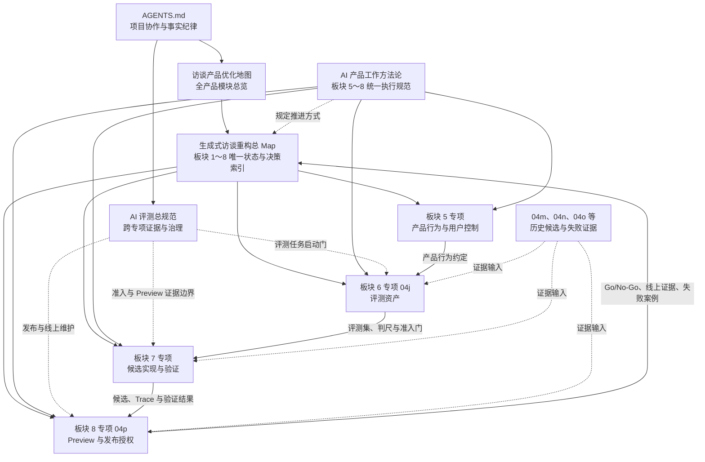
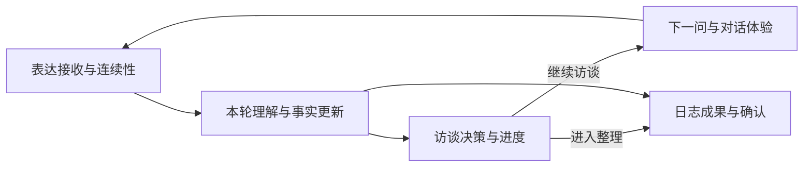

# 幸福日志访谈产品优化地图

- 文档职责：总 Map
- 文档状态：已确认·实施中
- 最后核验：`2026-08-20`
- 权威入口：[`DL-PROD-20260819`](./ai-tasks/running/DL-PROD-20260819-production-evidence-hardening.md)

最后更新：`2026-08-20`

文档状态：`生效中；五阶段生产主线完善已确认·实施中；Production 使用 event_centered + baseline`

当前讨论位置：`DL-PROD-20260819｜阶段 1 管理员成功读取 pending；阶段 2 热修复远程门与 main CI 全绿、Preview 通过至需更新、Production blocked；阶段 3 已合入 main、收集 pending；阶段 4 第一批与画像测试热修已合入 main、第二批前端本地门全绿且远程门 pending、Production P1 blocked；阶段 5 No-Go / insufficient_evidence`

落地验证状态：`总规范 v1.0 与阶段 B2 资产已冻结；阶段 C 保留 19 次技术阻断历史，阶段 C2 的 Plus 普通／思考均 20/20 且 No-Go，Max 思考 15/20 后网络阻断；当前无可推荐 Judge，独立准入继续关闭`

本次同步范围：`数据口径 v2 已发布；零模型端到端回归热修复已合入 main；Production 日志 Golden Set v2 已合入 main 并进入自然样本收集；主链重构第一批与画像测试热修已合入 main，第二批前端本地发布门通过并等待远程验证；月度个性化洞察评估已形成 No-Go / insufficient_evidence`

当前跨模块专项：[`Daily Light 五阶段生产主线完善`](./ai-tasks/running/DL-PROD-20260819-production-evidence-hardening.md)

当前停止点：阶段 1 管理员成功读取等待白名单内既有内部管理员合法登录态；阶段 2 Preview 已通过编辑、保存和需更新，浏览器续跑等待稳定网络／线路，Production 同时受 `PEH-020`、`PEH-022` 与 `PEH-028` 约束；凭证轮换见 `PEH-029`。阶段 3 已合入 main，`P0=0 / P1=0 / P2=3`，正文开关继续关闭，完整轨迹 `0/30`，等待自然样本与样本级授权。阶段 4 第二批前端本地工程门已通过，下一门为最终独立复核、推送、PR、远程 CI 与 Preview；Production 受 `PEH-033` 日记 `stale` 刷新竞态阻断，`PEH-035` 草稿保护 P1 已关闭。第三批日记候选需完成延迟读取与保存交错合同及零模型 E2E 连续三轮。阶段 5 维持 No-Go 候选隔离。数据库迁移、GI-088 新调用、生成式策略发布、月度洞察上线和破坏性清理继续使用独立停止门。

网页端实现同步：管理分析合同 v2 已于 `2026-08-20` 发布 Production，deployment `dpl_DCGYzf4U3nHdCiHyjo4U8NgkbGe5` 已通过正式域名核心 smoke；阶段 2 PR #41 已合入 main `77de8d1`，只形成 Preview，正式域名继续运行阶段 1 deployment。项目主链继续使用 `event_centered + baseline`。管理员成功读取保持 pending；GI-088 的模型评测、独立准入和生成式能力授权边界保持原状态。

当前专项进度源：[`生成式访谈重构总 Map（Batch B 专项）`](./generative-interview-refactor-map.md)

上一板块专项：[`板块 5｜稳定性、用户控制与交互收束`](./technical/interview-event-centered/05-board5-stability-user-control-and-interaction-scope.md)（`产品决策已冻结；6/6`）

当前板块专项：[`板块 6｜生成式访谈质量评测 v1`](./technical/interview-event-centered/04j-generative-quality-evaluation-v1.md)

当前工作方法：[`生成式访谈 AI 产品工作方法 v1.0`](./technical/interview-event-centered/00-generative-interview-ai-product-working-method.md)（`已冻结`）

当前评测总规范：[`Daily Light AI 评测总规范 v1.0`](./ai-evaluation-standard.md)（`已冻结`）

当前评测专项模板：[`Daily Light AI 评测专项模板 v1.0`](./templates/ai-evaluation-specialty-template.md)

阶段 B 已将 GI-088 现有 12 项转为开发挑战集，并建立正式准入的隐藏能力蓝图；阶段 B2 已补齐私有正文与隔离回执。阶段 C／C2 的 Judge 校准均已停止，新的 Judge 路线、独立准入、人工评测和 Preview 继续等待单独授权。

## 生成式访谈文档关系

本地图管理整个访谈产品的模块关系；生成式访谈板块 1～8 的详细状态、决策、依赖和当前入口统一由[生成式访谈重构总 Map](./generative-interview-refactor-map.md)维护。方法论文档规定板块 5～8 怎样工作，各板块专项保存详细讨论、案例、评测和交接。

## 当前有效口径｜2026-08-06

### 2026-08-11 网页端访谈与今日日记交接

产品负责人已确认网页端用户路径：一条【帮我记】或【陪我聊】记录完成后沉淀为当天时间线事件卡片；用户在当天日记页一键生成、查看或更新唯一的今日日记。访谈页只承接表达、回应、保存与返回当天，不出现日志生成、更新或版本信息。当天有效事件卡片自动参与今日日记；卡片变化后日记进入“需更新”，由用户在日记页主动更新。完整范围、原型要求和开发验收见[网页端前端设计交接](./plans/2026-08-11-daily-light-journal-page-frontend-handoff.md)。

这项交接覆盖用户可见网页端链路，作为后续设计和开发的当前方向；模型策略、评测、Preview、Production 与已冻结历史证据保持各自范围。

跨会话联调由前端设计／联调会话统一总控，按“纯页面验收 → 固定六案例日志联调 → 访谈链路接入 → 端到端闭环验收”推进。三方 Ready 条件、页面动作与接口映射、问题归属和停止点见[端到端联调总交接](./plans/2026-08-12-daily-light-end-to-end-integration-handoff.md)。生成式访谈板块 6／7／8 与 Production 继续保持当前状态。

### 已确认并继续生效

- `GI-068` 已冻结每次新记录先由用户明确选择【帮我记】或【陪我聊】；产品不预选，也不沿用上一次模式。当前记录全程保持所选模式；结束当前记录后，在新记录入口重新选择模式。
- 【帮我记】允许输入前轮播起笔提示，用户表达后零追问；每轮先保存原话，再围绕本轮最新重点自然回应，不使用【陪我聊】的理解回应双层结构。
- 一场【帮我记】可以包含一个或多个内部来源片段，完成后沉淀为当天时间线事件卡片；当天日记页把有效卡片整理为一篇可读、可编辑的今日日记；AI 对话回应不作为日记来源。
- `GI-069` 已冻结【陪我聊】阶段 1：三阶段作为可回返主任务；焦点纠正、新重点或更重要支线触发重新定位，事实纠正只更新证据。
- 用户工作焦点唯一拥有主线推进权，AI 机会假设保持可拒绝；同一时刻只激活一个工作焦点，其他重要内容作为支线保留。
- 工作焦点通过用户来源、具体内容、可说清张力、单一主焦点、无预设原因与用户可自然继续六项对齐门；每轮先反映理解，再执行跟随、共同聚焦、保持开放或暂停中的一个动作。
- 定位问题常规为 `0～1` 个；只有第一问产生进展且仍有两条证据接近、路径不同的竞争方向时，才低频使用第二问。第一问后方向明显领先时直接进入探索，缺少进展时暂停定位。
- 过去内容只使用当前对话中用户主动提供的经历；历史日志、跨会话记忆和自动相似事件匹配暂不进入 MVP。
- `GI-070` 已冻结【陪我聊】阶段 2：AI 基于完整有效上下文，自主比较直接形成认识、提出一个内容问题或暂停对用户的价值，并决定下一步；能够形成有来源、贴近体验且可纠正的认识时，可以直接反映并零问结束阶段 2。
- 提问的方向、时机和问法由模型完成。Prompt 或访谈 Skill 提供原则、方法和正反案例，评测与真人 Preview 裁决问题价值；程序不设置“必须缺少某类主观连接”等语义资格门、判断地图或选题路由。
- 内容问题常规为 `0～1` 个，低频最多 `2` 个。第二问通常要求第一问已产生实质进展且同一认识关系只差一小段；首次“说不清”允许一次真正降低回答负担的新入口，明确拒答立即停止。
- AI 以自然、可纠正的方式提出认识；用户未纠正即视为确认，阶段 2 完成并可正常进入日志。后续纠正以最新表达覆盖，`ai_synthesized` 只作为内部来源记录。
- 用户只是完成当前回答时，AI 总结并暂停；用户最新表达主动打开同一焦点下更深的顾虑、冲突或张力时，可以连续进入阶段 3。AI 单独发现的新方向继续保持为可拒绝机会。
- `GI-071` 已冻结【陪我聊】阶段 3：当前探索方向由“已有认识 + 用户最新打开的一个未解部分 + 它可能怎样影响当前理解”组成，并随用户回答逐轮更新。
- 阶段 3 的问题数量不设数字上限。每轮根据最新回答带来的实际进展、仍然活跃的用户来源未解部分、下一问预期改变的认识和用户回答负担，动态选择继续提问、直接整合、保持开放、暂停或阶段回返。
- 形成整合认识后，用户仍打开高价值未解部分时可以继续；缺少新的高价值内容、下一问只能重复或增加抽象程度、用户负担上升时自然暂停。用户仍然矛盾但已经看清两边各自保护什么和边界在哪里，也可以构成有效进展。
- 用户只说“继续”时，一个清楚的已有未解部分直接跟随；多个方向最多呈现两个共同选择；没有用户来源方向时保持开放。AI 新主线机会继续以可拒绝提议存在。
- 阶段 3 最新整合认识沿用自然确认和日志资格；阶段 3 暂无新增进展时，阶段 2 已有成果和日志资格继续有效。当前 MVP 只使用本次对话及用户主动建立的跨经历联系。
- `GI-072｜高频场景、决策支持与话题修正策略` 已冻结：每轮依次处理“用户控制与安全 → 纠正与事件边界 → 回答状态更新 → 服务请求 → 当前阶段决策 → 话题修正 → 用户可见回应 → 认识与日志状态更新”。同一轮只形成一个主要可见动作，用户工作焦点继续拥有主线推进权。
- 用户求建议或面临选择时，AI 整理用户已经提出的选项、目标、依据、限制、风险和主要取舍，可以表达条件化匹配，帮助用户形成自己的判断；缺少一个会实质改变取舍的用户条件时，最多提出一个问题。
- 用户提出外部知识问题时，将其视为尚待核实的决策条件，说明不确定性怎样影响当前判断，并继续帮助用户整理体验、顾虑与取舍；模型不承担事实查询，MCP、实时检索和外部知识工具暂不进入 MVP。
- 同一事件内换重点时保存有效认识与支线并回阶段 1；顺带提到另一独立事件时只保留原话；明确切换到另一独立事件时，先完成或返回当前记录，使其作为事件卡片留在当天工作台，再由用户手动开始新记录。页面跳转只保存并暂停。新记录不继承旧事件的事实、认识和未解部分。话题只修正语言、证据边界、推断范围和风险，不规定固定阶段顺序或专属提问路线。
- `GI-073｜理解回应与用户可见表达协议` 已冻结：目标产品将用户可见的 Think Summary 统一称为“理解回应”；正式提问、共同聚焦、纠正后继续提问和条件问题使用同一 AI 回合内的“理解回应＋主回应”，直接认识、无问决策支持、开放、成果与暂停使用单段主回应。
- 理解回应只呈现本轮新增理解、重要关系、张力或认识缺口，不复述、不暴露内部流程、不形成第二问。回答、认识、纠正、焦点和阶段在内部更新，用户只看见会改变当前理解或下一步的变化；成果和暂停不追加仪式性确认问题。
- 产品协议固定用户结果与硬边界，Prompt 或访谈 Skill 承载方法和案例，大模型自主完成语义判断与表达；程序稳定执行用户控制、问题次数、来源、安全、单轮一问、事件隔离和输出可用性，Evals 与真人 Preview 判断体验质量。
- `GI-074｜生成式访谈评测体系与下游交接协议` 已冻结：评测覆盖定义、数据、运行、分析、改进和持续监测，联合使用决策点、对话片段和完整记录；适用维度采用 `2 / 1 / 0 / N/A` 并保留单例阻断。
- 冷启动保留 `24` 条硬边界和 `40` 条质量案例，运行采用 `28` 条开发集与 `12` 条独立准入集；真人 Preview 使用真实记录、风险记录、真实价值聊天、风险／边界聊天共 `4` 条计分轨迹，以及两模式底座和旧五维／Production 隔离 `2` 条冒烟。
- 正常【陪我聊】需要形成至少一个有效认识；停止、拒答、说不清和材料有限路径可以合格暂停，通过质量门但不计价值成功。上线后前 `10` 次有效会话全审，`30` 次建立 Golden Set v2，随后按会话量与风险持续抽样。
- `GI-075｜阶段 1～2 回答机会计数` 已冻结·中置信度：阶段 1～2 以新的用户回答机会为主计数单位；模型判断内容任务、焦点血缘、阶段主任务、同一份核心回答材料、进展和累计负担，程序按记录、模式、阶段和焦点执行首次完整交付计数、分段上限、机会复用、幂等恢复和隔离。
- 阶段 1、2 分别保持 GI-069～070 的常规 `0～1` 与低频第二问，程序不增加跨阶段合计数字上限；同一待回答位置且继续使用同一份核心材料时复用机会，清楚的新焦点使用独立账本，回到旧焦点恢复旧账本，纠正后已经发生的计数继续有效。阶段 3 保持动态问停。
- `GI-076｜模型主导的问题修复协议` 已冻结·中置信度：修复反馈进入完整语境，由模型重新判断焦点、阶段、下一步价值和回答负担；MVP 不建立语义分类路由、固定模板或修复专属次数上限，程序继续执行用户控制、GI-075 计数、来源、安全、隔离和恢复。
- `GI-077｜回复版本退出 MVP` 已冻结·高置信度：【换个问法】及回复版本退出事件中心目标 MVP，自然语言修复与纠正继续由模型承接；Production legacy 现有版本能力、代码和历史数据保持不变。
- `GI-078｜模型主导的纠正与有效状态协议` 已冻结·中置信度：原始对话持续保留，被用户明确否定的状态退出当前事实、成果和日志；模型判断纠正影响范围、焦点关系、阶段和下一步，程序保证来源、计数和恢复一致。
- `GI-079｜中断与失败恢复协议` 已冻结·高置信度：继承两阶段提交、结构化 `issue`、错误码、`requestId`、原话保存和同一 `clientTurnId` 恢复；完整结果直接恢复，未完整提交的输出不进入当前认识、日志、阶段或计数。
- `GI-080｜成果／暂停后的自然收束协议` 已冻结·高置信度：成果或暂停后由输入框承接继续表达；目标 MVP 不提供【继续聊】和独立【结束记录】按钮；网页端后续实现采用 `2026-08-11` 交接：记录完成后形成事件卡片，今日日记由当天日记页统一生成和更新。失败时保留可恢复状态，页面跳转只保存和暂停。
- `GI-065` 的“理清想法”单角度验证目标继续约束【陪我聊】；感受、关系和行动继续保留历史数据与代码兼容，新会话入口保持隐藏。自动进入规则由 GI-068 覆盖。
- 用户原话、明确纠正、停止意愿、来源安全、可靠提交、失败恢复、事件卡片沉淀与日记页生成更新继续作为产品底座。
- 正式内容问题的候选 Provider 使用 DeepSeek 官方 API，新候选模型固定为 `deepseek-v4-flash`；候选 Provider、模型和版本仍需在 Preview 前完成预检。
- 推进职责已经确认：板块 4 已完成 GI-067 全部批次；板块 5 已冻结 GI-075～080，六类规则完成 `6/6`，生成式访谈方法 v1.0 与项目级评测总规范 v1.0 均已冻结。板块 6 的阶段 B2 资产已封存；阶段 C2 最终为技术阻断，当前无可推荐 Judge。板块 7 正式准入与板块 8 继续等待新的 Judge 路线及独立授权。
- Production 当前使用 `event_centered + baseline`。`optional + generative` 需要新候选通过板块 8 真人验收，并获得产品负责人独立 Production 授权。

### 待执行与待校准

- 板块 6 需要按 GI-074 建立复标后的 `24＋40`、`28＋12`、Judge 说明、人工评分卡、两模式 `4＋2` 脚本和正式准入报告。
- 板块 7 已完成 GI-087 的基础 Prompt、Interview Skill、共同任务结构、状态合并、六题运行器和真人工作台。GI-088 v1～v8r2 保留各自产品、技术和运行证据；v8r2 的 `running 0/12` 只承担初始化历史。阶段 B 审计确认目标 run 已于 `2026-08-11` 封存，同版本后续 run 保留技术验收和 v8r3 No-Go 身份。正式评测资产、日志映射和 Production 接入继续等待 Judge 校准、全新隐藏准入和真人质量门；板块 8 继续等待。

### 历史候选与证据

- GI-050–064 的四角度产品规则、自动 Preview、人工裁决和发布门记录继续保留，用于回归、归因和安全边界追溯。
- GI-066 历史上冻结了有限判断地图、系统选题、语义重复门、纠正重规划和开放转场。修复候选通过 DeepSeek 官方预检、严格 `10×3` 和新库自动 `8+2`；最新真人实聊仍出现目标偏移、重要线索遗漏、同义重复和纠正后错误重规划，人工体验裁决为 `No-Go`，候选失效，剩余人工批次停止。
- 自动层通过只证明当时候选的工程与脚本化稳定性，不承担 GI-067 产品体验证明。

板块 5 的 GI-075～080 完整行为、职责、案例和硬失败以[板块 5 专项](./technical/interview-event-centered/05-board5-stability-user-control-and-interaction-scope.md)为准；全局状态以[生成式访谈重构总 Map](./generative-interview-refactor-map.md)为准；GI-068～074 的依据、案例与历史分别保存在 04x-01～07 决策档案。

## 1. 这份地图解决什么问题

这份地图用于跨会话保持产品目标、模块边界和讨论顺序一致。

后续优化访谈链路时，先用本文件确认四件事：

1. 当前讨论属于哪个模块。
2. 这个模块为用户解决什么问题。
3. 它依赖哪些上游结果，又会影响哪些下游体验。
4. 优化效果应该通过什么结果衡量。

产品级地图见：

- [PNG](./diagrams/interview-product-optimization-map.png)
- [Draw.io 源文件](./diagrams/interview-product-optimization-map.drawio)

现有的[访谈功能图谱](./diagrams/README.md)继续解释详细功能和运行顺序；本文件负责产品优化边界与跨模块关系。

## 2. 北极星目标

> 用户愿意讲，AI 能听懂，访谈会顺着用户的表达自然推进，最终形成一篇忠于用户原意、值得保存的日志。

这句话包含五个连续结果：

1. 用户的表达被稳稳接住。
2. 用户说的内容和希望怎样继续都被理解。
3. 系统选择了合适的下一步。
4. 下一问清楚、自然、有价值。
5. 日志准确保留了用户真正想记录的内容。

## 3. 模块划分依据

模块按照用户能够感知的结果划分，并遵循三条原则：

1. **共同决定同一个结果的能力放在一起。** 意图识别、内容理解和事实更新共同决定“AI 有没有听懂这一轮”，因此归入同一个理解模块。
2. **每个模块都有稳定产物。** 上游产物交给下游使用，问题定位和效果衡量都有明确落点。
3. **跨模块能力单独标注。** 五维理论、状态连续性和质量评测贯穿整条链路，不归入单一业务步骤。

## 4. 五个核心模块

| 模块 | 用户关心的问题 | 包含的产品能力 | 稳定产物 | 核心衡量 |
|---|---|---|---|---|
| 一、表达接收与连续性 | 我说的话有没有被接住？ | 输入引导、原话保存、重复提交保护、中断恢复、继续生成 | 一轮完整、可恢复的用户表达 | 内容丢失率、重复率、恢复成功率、提交失败退出率 |
| 二、本轮理解与事实更新 | AI 有没有理解我说了什么，也知道我想怎样继续？ | 操作要求识别、内容理解、修正与否定、用户方向证据、当前场景、可信事实更新 | 本轮可信理解结果 | 内容保留准确率、要求执行率、修正生效率、场景识别准确率、误解率 |
| 三、访谈决策与进度 | 现在应该继续问、换方向，还是整理日志？ | 可回返阶段、用户工作焦点、当前场景、AI 机会、重要支线、决策支持、外部知识待核实边界、独立事件结束与新记录入口、边界收束、下一步选择 | 清楚的下一步决定 | 工作焦点对齐率、场景动作匹配率、纠正恢复率、支线遗漏率、无效追问率、过早收束率 |
| 四、下一问与对话体验 | 下一问是否清楚、自然、值得回答？ | 理解回应、共同聚焦、提问目标、难度、主回应表达和质量检查 | 一条可直接展示的主回应；正式提问轮同时包含理解回应 | 被听懂裁决、问题值得回答率、看不懂率、重复率、换问率、回答率 |
| 五、日志成果与确认 | 今日日记是否像我、是否值得保存？ | 当天事件卡片、材料选取、日志组织、正文生成、质量检查、编辑保存、当天整合 | 用户确认过的事件卡片和今日日记 | 生成后保存率、修改幅度、事实偏差率、再次打开率 |

## 5. 模块之间怎样相互依赖

### 5.1 主循环

### 5.2 关键耦合点

| 相邻模块 | 共同负责的结果 | 优化时需要一起检查什么 |
|---|---|---|
| 表达接收 × 本轮理解 | 同一轮原话被完整、稳定地理解 | 中断恢复后理解是否一致，短回答是否保留上下文 |
| 意图识别 × 内容理解 × 事实更新 | 用户要求得到执行，有效内容同时进入材料 | “内容＋生成”“内容＋停止”“修正＋补充”等混合表达 |
| 本轮理解 × 访谈决策 | 系统根据真实材料选择下一步 | 明确回答“没有”后是否换方向，修正后是否重新判断充分度 |
| 访谈决策 × 下一问 | 决定问什么以及怎样问 | 信息目标、问题难度、重复保护和用户压力是否一致 |
| 本轮理解 × 日志成果 | 日志忠于用户最终确认的表达 | 修正内容是否覆盖旧理解，操作要求是否被排除在日志事实之外 |
| 下一问 × 表达接收 | 新问题塑造下一轮回答质量 | 问题是否容易回答，是否给用户留下自由表达空间 |

## 6. 三条贯穿全链路的基础能力

### 6.1 五维理论标准

五个维度分别规定“什么内容值得理解、什么材料支持完成、日志最终要回答什么”。它同时约束内容理解、访谈决策、提问和日志生成。

### 6.2 状态连续性

会话、事件、当前有效问题、用户修正、日志状态和失败恢复需要保持同一条事实路径。Production legacy 的问题版本继续作为兼容状态保留；事件中心目标 MVP 只恢复单一可信对话路径。任何模块发生中断，恢复后都应继续原来的用户目标。

### 6.3 质量评测与反馈闭环

每个模块使用自己的结果指标，同时保留端到端案例。线上误解、重复追问、日志偏差和用户反馈都要回到对应模块的评测集。项目级集合分工、Judge 校准、启动门、三本账、隐私和维护规则统一以 [Daily Light AI 评测总规范](./ai-evaluation-standard.md) 为准；具体判尺、阈值和案例继续由对应专项冻结。

## 7. 建议的讨论顺序

| 顺序 | 讨论主题 | 当前状态 |
|---:|---|---|
| 1 | 表达接收与连续性 | 已完成一轮优化 |
| 2A | 本轮理解：操作要求与对话意图 | 已完成 v1，进入线上评测 |
| 2B | 本轮理解：内容理解与事实更新 | GI-068 已冻结【帮我记】上下文；GI-069 已冻结【陪我聊】方向证据、焦点纠正与支线保留；GI-070 已冻结阶段 2 的回答状态、认识确认与纠正覆盖；GI-071 已冻结阶段 3 的逐轮理解变化与当前探索方向；GI-072 已冻结当前场景和话题修正的理解边界；GI-073 已冻结这些状态怎样投影为用户可见表达 |
| 3 | 访谈决策与进度 | GI-068 已冻结记录路径；GI-069 已冻结阶段 1；GI-070 已冻结阶段 2；GI-071 已冻结阶段 3；GI-072 已冻结白盒决策顺序、高频回答状态、决策支持、外部知识待核实边界，以及独立事件结束与新记录入口，三阶段与高频场景机制已经闭合 |
| 4 | 下一问与对话体验 | GI-070～080 已冻结；GI-088 阶段 B 已形成开发 28、硬边界 24、Judge 20 和隐藏 12 能力蓝图。当前等待 Judge 旧口径裁决、私有脱敏和隐藏正文，正式接入随后依次经过 Judge 校准、新隐藏准入与两模式 `4＋2` |
| 5 | 日志成果与确认 | 产品路径已确认为“访谈记录 → 当天事件卡片 → 今日日记”。今日日记 Prompt v3 已覆盖 9 条真人轨迹并全部通过当前人工门槛；其中 6 条完成“记录卡 v3 → 今日日记 v3”完整回归。生成式访谈评测与前端 Preview 保持独立授权链，正式运行与 Production 决策依次后置 |

## 8. 地图维护规则

后续讨论形成稳定结论时，更新本文件中的模块定义、关键依赖、衡量方式和当前讨论位置。具体功能、评测标准和实现事实继续写入各自的专项文档，本文件只保留全局共识。

事件中心 Batch B 的生成式访谈详细结论、板块状态、依赖和验证证据统一维护在[生成式访谈重构总 Map（Batch B 专项）](./generative-interview-refactor-map.md)；本文件继续管理五个端到端产品模块及其关系。
