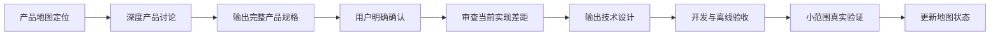

# 幸福日志访谈产品优化地图

最后更新：`2026-07-21`

文档状态：`生效中`

当前讨论位置：`模块三｜访谈决策与进度，已进入深度产品讨论`

## 1. 这份地图解决什么问题

这份地图用于跨会话保持产品目标、模块边界和讨论顺序一致。

后续优化访谈链路时，先用本文件确认四件事：

1. 当前讨论属于哪个模块。
2. 这个模块为用户解决什么问题。
3. 它依赖哪些上游结果，又会影响哪些下游体验。
4. 优化效果应该通过什么结果衡量。

产品级地图见：

- [PNG](./diagrams/interview-product-optimization-map.png)
- [Draw.io 源文件](./diagrams/interview-product-optimization-map.drawio)

当前模块专项文档见：

- [模块二｜本轮理解与事实更新产品规格](./interview-understanding-product-spec.md)
- [模块二｜本轮理解与事实更新技术设计](./interview-understanding-technical-design.md)
- [模块二｜离线验收报告](./interview-understanding-acceptance-report.md)
- [模块二｜上线后20轮可选观察模板](./interview-understanding-real-validation.md)

现有的[访谈功能图谱](./diagrams/README.md)继续解释详细功能和运行顺序；本文件负责产品优化边界与跨模块关系。

## 2. 北极星目标

> 用户愿意讲，AI 能听懂，访谈会顺着用户的表达自然推进，最终形成一篇忠于用户原意、值得保存的日志。

这句话包含五个连续结果：

1. 用户的表达被稳稳接住。
2. 用户说的内容和希望怎样继续都被理解。
3. 系统选择了合适的下一步。
4. 下一问清楚、自然、有价值。
5. 日志准确保留了用户真正想记录的内容。

## 3. 模块划分依据

模块按照用户能够感知的结果划分，并遵循三条原则：

1. **共同决定同一个结果的能力放在一起。** 意图识别、内容理解和事实更新共同决定“AI 有没有听懂这一轮”，因此归入同一个理解模块。
2. **每个模块都有稳定产物。** 上游产物交给下游使用，问题定位和效果衡量都有明确落点。
3. **跨模块能力单独标注。** 五维理论、状态连续性和质量评测贯穿整条链路，不归入单一业务步骤。

## 4. 五个核心模块

| 模块 | 用户关心的问题 | 包含的产品能力 | 稳定产物 | 核心衡量 |
|---|---|---|---|---|
| 一、表达接收与连续性 | 我说的话有没有被接住？ | 输入引导、原话保存、重复提交保护、中断恢复、继续生成 | 一轮完整、可恢复的用户表达 | 内容丢失率、重复率、恢复成功率、提交失败退出率 |
| 二、本轮理解与事实更新 | AI 有没有理解我说了什么，也知道我想怎样继续？ | 操作要求识别、内容理解、修正与否定、明确缺失、可信事实更新 | 本轮可信理解结果 | 内容保留准确率、要求执行率、修正生效率、误解率 |
| 三、访谈决策与进度 | 现在应该继续问、换方向，还是整理日志？ | 材料充分度、阶段判断、边界收束、事件切换、维度建议、下一步选择 | 清楚的下一步决定 | 无效追问率、过早收束率、过度追问率、分支选择完成率 |
| 四、下一问与对话体验 | 下一问是否清楚、自然、值得回答？ | 提问目标、难度、角度、表达方式、理解摘要、质量检查、按意图重新生成 | 一条可直接展示的问题与理解摘要 | 看不懂率、重复率、换问率、回答率、继续访谈率 |
| 五、日志成果与确认 | 最终日志是否像我、是否值得保存？ | 材料选取、日志组织、正文生成、质量检查、编辑保存、当天整合 | 用户确认过的维度日志和当天日志 | 生成后保存率、修改幅度、事实偏差率、再次打开率 |

## 5. 模块之间怎样相互依赖

### 5.1 主循环

```mermaid
flowchart LR
  A[表达接收与连续性] --> B[本轮理解与事实更新]
  B --> C[访谈决策与进度]
  C -->|继续访谈| D[下一问与对话体验]
  D --> A
  C -->|进入整理| E[日志成果与确认]
  B --> E
```

### 5.2 关键耦合点

| 相邻模块 | 共同负责的结果 | 优化时需要一起检查什么 |
|---|---|---|
| 表达接收 × 本轮理解 | 同一轮原话被完整、稳定地理解 | 中断恢复后理解是否一致，短回答是否保留上下文 |
| 意图识别 × 内容理解 × 事实更新 | 用户要求得到执行，有效内容同时进入材料 | “内容＋生成”“内容＋停止”“修正＋补充”等混合表达 |
| 本轮理解 × 访谈决策 | 系统根据真实材料选择下一步 | 明确回答“没有”后是否换方向，修正后是否重新判断充分度 |
| 访谈决策 × 下一问 | 决定问什么以及怎样问 | 信息目标、问题难度、重复保护和用户压力是否一致 |
| 本轮理解 × 日志成果 | 日志忠于用户最终确认的表达 | 修正内容是否覆盖旧理解，操作要求是否被排除在日志事实之外 |
| 下一问 × 表达接收 | 新问题塑造下一轮回答质量 | 问题是否容易回答，是否给用户留下自由表达空间 |

## 6. 贯穿全链路的基础规则

### 6.1 五维理论标准

五个维度分别规定“什么内容值得理解、什么材料支持完成、日志最终要回答什么”。它同时约束内容理解、访谈决策、提问和日志生成。

### 6.2 状态连续性

会话、事件、问题版本、用户修正、日志状态和失败恢复需要保持同一条事实路径。任何模块发生中断，恢复后都应继续原来的用户目标。

### 6.3 质量评测与反馈闭环

每个模块使用自己的结果指标，同时保留端到端案例。线上误解、重复追问、日志偏差和用户反馈都要回到对应模块的评测集。

### 6.4 低流量产品的验证原则

当前产品流量较小，只记录结果、不影响用户体验的旁路观察很难在合理时间内积累足够样本，验证收益有限。一般情况下，新增能力完成离线案例验收后，直接进入可回退的小范围真实使用，通过真实对话反馈判断效果；只有改动风险较高且能够获得足够样本时，才安排旁路观察期。

## 7. 核心模块的标准推进节奏

所有核心模块及其重要改造统一采用“产品规格先行”的推进方式：

具体执行规则：

1. 先通过本地图确认当前模块、用户问题、上下游关系和稳定产物。
2. 通过深度讨论锁定目标、边界、规则、例外、指标和验收方式。
3. 形成独立、完整的产品规格，并等待用户明确确认。
4. 产品规格确认后，再审查当前实现，形成逐条差距清单。
5. 技术文档逐条映射产品规则，说明数据变化、兼容方式、失败保护和验证证据。
6. 会话中新确认的产品规则先更新产品规格，再更新技术文档和代码。
7. 产品规格与旧实现发生冲突时，最新确认的产品规格承担产品判断依据。
8. 离线门槛通过后，按照低流量验证原则进入可回退的小范围真实使用。
9. 线上发布作为独立操作，在开发和验收完成后单独确认。
10. 当前模块完成产品规格、技术设计、开发、验收和上线后，由用户决定是否进入下一模块；模块完成不会自动推进讨论位置。

## 8. 建议的讨论顺序

| 顺序 | 讨论主题 | 当前状态 |
|---:|---|---|
| 1 | 表达接收与连续性 | 已完成一轮优化 |
| 2A | 本轮理解：操作要求与对话意图 | 已完成并生产上线，纳入模块二统一成果 |
| 2B | 本轮理解：内容理解与事实更新 | **产品规格、技术设计、开发、验收与生产上线均已完成** |
| 3 | 访谈决策与进度 | **已进入深度产品讨论，待锁定目标、边界、规则、例外、指标和验收方式** |
| 4 | 下一问与对话体验 | 已有较完整能力，待按全局地图复盘 |
| 5 | 日志成果与确认 | 已有较完整能力，待按全局地图复盘 |

## 9. 地图维护规则

后续讨论形成稳定结论时，更新本文件中的模块定义、关键依赖、衡量方式和当前讨论位置。具体功能、评测标准和实现事实继续写入各自的专项文档，本文件只保留全局共识。
