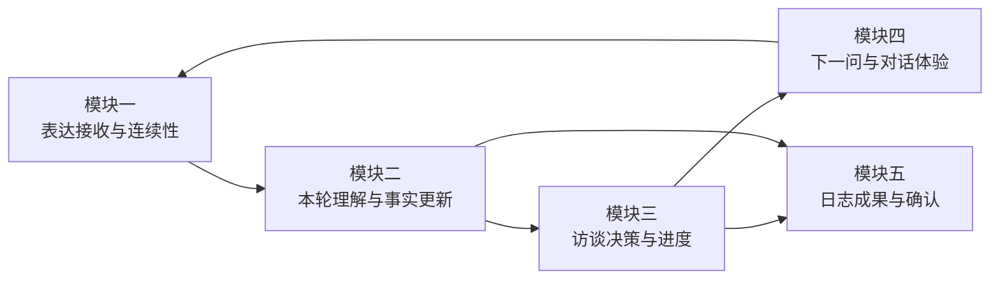
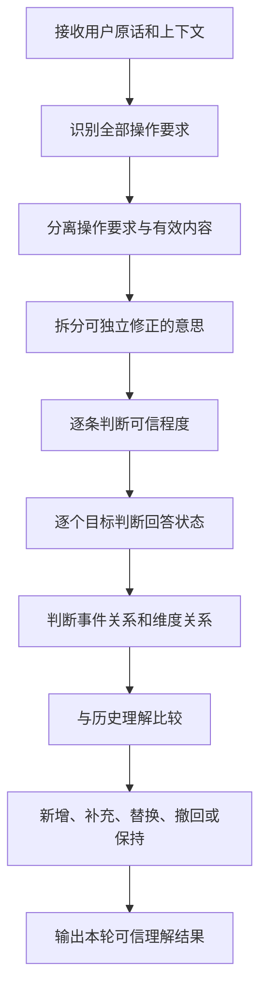

# 访谈模块二｜本轮理解与事实更新产品规格

最后更新：`2026-07-21`

文档状态：`产品规格已确认`

当前讨论位置：`模块二已完成并生产上线；继续停留在模块二`

## 1. 这份文档解决什么问题

用户每说一句话，系统都需要同时理解两件事：

1. 用户表达了哪些内容。
2. 用户希望这段对话怎样继续。

这两类理解会共同影响访谈进度、下一问和日志。如果操作要求遗漏，系统可能在用户要求停止后继续追问；如果内容理解有误，系统可能沿着错误方向提问，并把错误事实写进日志；如果修正没有覆盖旧理解，用户会反复感受到“AI没有听懂我”。

模块二因此承担一个基础责任：

> 每轮回答后，形成一份忠于用户表达、能够持续修正、可以被下游安全使用的可信理解结果。

这份文档统一定义模块二的产品目标、边界、处理流程、理解状态、更新规则、事件关系、五维差异、下游权限、案例和验收标准。

相关文档继续承担各自职责：

- [访谈产品优化地图](./interview-product-optimization-map.md)：定义全链路模块边界和讨论位置。
- [访谈意图评测与上线事实源](./interview-intent-evaluation-source-of-truth.md)：管理操作要求与对话意图评测。
- [访谈内容理解与事实更新协议](./interview-content-understanding.md)：记录当前实现协议和实现参考。
- [五维理论文档](./theory/)：定义五个维度分别需要理解什么内容。

## 2. 模块位置与第一性原理

### 2.1 模块位置

完整访谈链路为：

模块一保证原话完整、可恢复地进入系统。模块二把原话转化为可信理解。模块三根据理解结果决定下一步。模块四把决定表达为自然摘要和问题。模块五只使用允许进入日志的材料形成成果。

### 2.2 用户关心的问题

> AI有没有理解我刚才说了什么，也知道我希望怎样继续？

### 2.3 第一性原理

模块设计遵循六条原则：

1. **用户原话是最终依据。** 所有理解都需要能够回到用户表达或明确的上下文。
2. **可信度优先于材料数量。** 少量准确材料比大量推测更能保护用户信任。
3. **内容和操作要求并行理解。** 用户可以一边补充内容，一边要求停止、切换或整理日志。
4. **每条意思可以独立修正。** 同一轮中的事实、感受、推测和拒绝边界分别判断。
5. **用户修正立即生效。** 最新明确修正会同步影响进度、下一问和日志。
6. **当前表达连续性优先。** 跨事件和跨维度内容先被接住，再由后续模块决定切换时机。

## 3. 产品目标与成功标准

### 3.1 模块目标

> 每轮回答后，形成一份忠于用户表达、能够持续修正、可以被下游安全使用的可信理解结果。

### 3.2 第一成功标准

> 内部可信理解准确。

用户是否感到被理解，还会受到理解摘要、下一问和日志表达的影响。模块二首先保证下游拿到的事实、回答状态和操作要求是准确的。

### 3.3 成功结果

模块成功时，系统能够做到：

- 用户提供的重要内容得到保留。
- 用户的操作要求得到完整识别。
- 操作要求不会混入日志事实。
- 明确修正覆盖旧理解。
- 明确否定、想不起来、不确定和不愿回答得到区分。
- AI推测在用户确认前不会推动进度或进入日志。
- 同一轮中的多件事得到正确归属。
- 中断恢复后继续采用同一份理解。

### 3.4 高影响错误

以下表现会直接损害用户信任：

- 凭空增加用户没有表达的事实。
- 用户要求停止后继续追问。
- 用户要求整理日志却继续进入普通追问。
- 混合表达中的重要内容被丢弃。
- 第三方转述被误判为用户对系统的命令。
- 用户修正后继续采用旧理解。
- 用户拒绝某个问题后继续追问同一目标。
- 等待确认的推测进入日志。
- 候选事件被写成当前事件事实。
- 同一轮恢复后出现重复或互相矛盾的理解。

## 4. 模块边界

### 4.1 五个模块的责任

| 用户结果 | 负责模块 | 模块二提供什么 |
|---|---|---|
| 原话完整保存和失败恢复 | 表达接收与连续性 | 读取原话和恢复状态 |
| 操作要求、内容和历史修正得到理解 | 本轮理解与事实更新 | 直接负责并形成可信理解结果 |
| 决定继续、换方向、收束或生成 | 访谈决策与进度 | 提供操作要求、可信材料、回答状态和候选信号 |
| 生成理解摘要和具体提问 | 下一问与对话体验 | 提供最新理解和需要确认的内容 |
| 形成并确认日志 | 日志成果与确认 | 提供允许进入日志的材料及其关系 |

### 4.2 模块二负责

- 识别用户提出的全部操作要求。
- 分离操作要求和有效内容。
- 把内容拆成可独立修正的意思。
- 判断每条意思的可信程度。
- 判断每个问题目标的回答状态。
- 判断内容与当前事件的关系。
- 标记候选事件和候选维度。
- 更新、替换或撤回历史理解。
- 保持中断恢复和重复处理的一致性。
- 输出理解风险和待确认内容。

### 4.3 后续模块负责

- 多个操作要求最终怎样执行。
- 当前问题是否继续、换目标或收束。
- 候选事件何时回收。
- 候选维度何时提示用户。
- 理解摘要怎样自然表达。
- 具体提问怎样降低压力并承接上下文。
- 日志怎样组织和呈现材料。

### 4.4 用户可见边界

用户继续只看到：

- 自己的原话。
- AI的理解摘要。
- AI的具体提问或选择。
- 日志正文。

可信程度、回答状态、事件关系、历史替换记录和候选维度属于内部状态。模块四可以把必要的修正确认自然表达给用户，但不会展示内部标签。

## 5. 上游输入

每轮处理需要读取以下信息：

| 输入 | 作用 | 缺失时的保护方式 |
|---|---|---|
| 用户原话 | 识别内容和操作要求的最终依据 | 无原话时停止理解更新 |
| 上一句问题 | 解释“妈妈”“委屈”“没有”等短回答 | 问题不明确时保持待确认 |
| 上一句问题目标 | 判断用户回答了哪个信息目标 | 目标不明确时不关闭具体方向 |
| 当前维度 | 判断内容在五维理论中的价值 | 只保留通用理解，不进行维度强归类 |
| 当前访谈阶段 | 理解本轮上下文 | 不用于覆盖用户原话 |
| 当前主事件 | 判断内容是细节、关联还是新事件 | 无法判断时保存候选关系 |
| 已有可信理解 | 判断新增、补充、修正和冲突 | 缺失时只处理本轮内容 |
| 历史修正和拒绝记录 | 避免恢复失效理解和重复追问 | 缺失时采用更保守的推进 |
| 候选事件和候选维度 | 保持多事件与跨维度连续性 | 不自动切换 |
| 恢复或重复处理状态 | 保证同一轮只产生一份结果 | 状态不明确时优先复用已有结果 |

## 6. 稳定产物

模块二统一输出“本轮可信理解结果”，包含：

1. 全部操作要求及其出现顺序。
2. 每个操作要求的原话依据、作用对象和作用范围。
3. 生效中的可信材料。
4. 等待用户确认的理解。
5. 已经失效的历史材料。
6. 本轮新增、补充、替换、撤回和保持记录。
7. 每条材料的原话依据、来源轮次和所属事件。
8. 每个问题目标的回答状态。
9. 当前事件、关联片段、候选事件和顺带信息。
10. 候选维度信号。
11. 理解风险、含糊冲突和无法确认的内容。

模块三、模块四和模块五必须读取同一份结果，避免进度、追问和日志各自形成不同理解。

## 7. 完整处理流程

### 7.1 接收原话和上下文

**输入：** 用户原话、上一问、当前事件和历史理解。

**判断：** 当前内容是否完整到可以开始理解，是否属于恢复或重复处理。

**输出：** 一份待分析的原话和上下文组合。

**保护：** 原话未说完时保留原文，不推动进度，邀请用户继续表达。

### 7.2 识别操作要求

**输入：** 用户原话和引用关系。

**判断：** 用户是否要求整理、停止、调整问题、跳过、切换事件或切换维度。

**输出：** 有顺序的操作要求列表。

**保护：** 引用和第三方转述中的命令词继续作为事件内容。

### 7.3 分离内容与操作要求

**输入：** 用户原话和操作要求列表。

**判断：** 去除操作要求后，是否仍有事件、感受、原因、判断或行动内容。

**输出：** 操作要求与有效内容两部分。

**保护：** 混合表达中的内容优先保留，操作要求禁止进入日志材料。

### 7.4 拆分独立意思

**输入：** 有效内容。

**判断：** 哪些意思可以被单独补充、修正或撤回。

**输出：** 人物、事件、感受、原因、判断、行动、修正等独立材料。

**保护：** 不使用日志字段强行裁剪用户叙事。

### 7.5 判断可信程度

**输入：** 每条独立材料、原话依据和上一问。

**判断：** 用户是否直接确认，能否结合上下文唯一还原，或仍属于AI推测。

**输出：** 每条材料的可信程度。

**保护：** 缺少原话依据且无法由上一问唯一还原时，进入等待确认。

### 7.6 判断回答状态

**输入：** 每条意思、上一问目标和用户边界表达。

**判断：** 用户已经回答、明确表示不存在、暂时想不起来、尚不确定或不愿回答。

**输出：** 一个或多个问题目标的回答状态。

**保护：** 回答状态只作用于有明确依据的目标。

### 7.7 判断事件和维度关系

**输入：** 独立材料、当前主事件和当前维度。

**判断：** 内容是当前细节、关联片段、候选事件、顺带信息或跨维度信号。

**输出：** 事件关系和候选维度。

**保护：** 继续接住当前表达，不在理解阶段打断用户切换。

### 7.8 更新历史理解

**输入：** 本轮理解和已有材料。

**判断：** 本轮属于新增、补充、明确修正、撤回、含糊冲突或重复处理。

**输出：** 最新生效材料和完整变化记录。

**保护：** 含糊冲突不会直接覆盖旧理解；明确修正会立即让旧理解失效。

### 7.9 输出可信理解结果

**输入：** 本轮所有判断。

**输出：** 供下游统一读取的可信理解结果。

**保护：** 无法可靠判断时保留原话和风险信号，不增加完成度。

## 8. 操作要求理解

### 8.1 操作要求类型

| 操作要求 | 用户希望得到的结果 | 模块二输出 |
|---|---|---|
| 整理日志 | 使用当前材料形成日志 | 记录整理要求及其对象 |
| 停止追问 | 当前不再继续普通追问 | 记录停止范围和强度 |
| 调整问题 | 保持目标或更换角度重新提问 | 记录问题调整要求 |
| 跳过问题 | 当前目标暂不继续 | 记录被跳过的问题目标 |
| 切换事件 | 开始讲另一件事 | 记录事件切换要求 |
| 切换维度 | 把内容放到另一个维度继续 | 记录目标维度 |
| 继续提供内容 | 用户仍在回答当前访谈 | 记录有效内容 |

### 8.2 多个操作要求

**规则 M2-01：全部保留。** 同一句话出现多个操作要求时，模块二必须识别全部要求。

**规则 M2-02：保留顺序。** 操作要求按照用户原话中的出现位置排序，并保留各自依据。

**规则 M2-03：保留作用对象。** 每项要求需要说明作用于当前问题、当前事件、当前维度、整轮访谈还是日志。

**规则 M2-04：执行权交给模块三。** 模块二提供完整要求，不提前裁剪成单一动作。

例如：

> “这件事更像感谢，先别问了，按刚才这些整理一下。”

模块二应输出：

1. 候选切换到感谢维度。
2. 停止当前追问。
3. 使用已有材料整理日志。

具体执行次序由模块三结合当前材料决定。

### 8.3 内容与操作要求混合

**规则 M2-05：并行处理。** 有效内容和操作要求分别进入对应结果。

**规则 M2-06：内容继续生效。** “她愿意先听我说完，这很重要，直接整理吧”中的前半句继续进入可信材料。

**规则 M2-07：操作要求退出日志。** “直接整理吧”不能被写成事件事实。

### 8.4 引用和转述

**规则 M2-08：先判断说话对象。** “同事说‘别再问了’”属于事件内容。

**规则 M2-09：直接指向系统才形成操作要求。** “你别再问了”属于停止追问。

**规则 M2-10：引用与真实要求可以共存。** “他说‘别问了’，我当时很难受；你也先别问了”同时包含事件内容和用户操作要求。

## 9. 独立信息拆分

### 9.1 拆分标准

一条材料应当满足：

- 表达一个相对完整的意思。
- 可以单独找到原话依据。
- 可以被单独补充、修正或撤回。
- 能够判断属于哪个事件。
- 能够独立决定是否进入进度和日志。

### 9.2 信息类型

| 信息类型 | 典型内容 |
|---|---|
| 事件 | 发生了什么 |
| 人物与关系 | 谁参与、与用户是什么关系 |
| 感受 | 用户当时或现在的感受 |
| 原因 | 什么触发了感受或判断 |
| 判断 | 用户怎么看这件事 |
| 行动 | 用户或他人做了什么 |
| 后续尝试 | 用户希望下次怎样行动 |
| 补充 | 为已有理解增加细节 |
| 修正 | 明确指出旧理解有误 |
| 撤回 | 明确收回旧表达 |

### 9.3 混合状态

**规则 M2-11：逐条判断。** 同一轮可以同时包含确定事实、待确认推测和拒绝边界。

例如：

> “她确实帮我改了方案，但我不确定她是不是理解我的压力，这部分我也不想继续说。”

应拆分为：

- “她帮我改了方案”：用户直接确认。
- “她理解我的压力”：等待用户确认。
- “关系判断这部分不想继续说”：当前目标为不愿回答。

### 9.4 拆分边界

**规则 M2-12：保持用户原意。** 不为了填满日志结构而拆出用户没有表达的结论。

**规则 M2-13：相同意思避免重复。** 同一轮中的同义复述保持一条主材料，并保留完整原话依据。

**规则 M2-14：关系明确才能合并。** 原因、后果、对比和例证需要明确关系后才能支持当前事件判断。

## 10. 可信程度

| 状态 | 判定条件 | 可以做什么 | 禁止做什么 |
|---|---|---|---|
| 用户直接确认 | 用户在本轮明确表达 | 参与进度、下一问和日志 | 扩写出用户未说的结论 |
| 结合上下文确认 | 短回答能唯一对应上一问 | 参与进度、下一问和日志 | 在上下文不唯一时强行确认 |
| 等待用户确认 | AI形成了合理理解，用户尚未确认 | 用于低压力确认 | 推动完成度、进入日志 |
| 已经失效 | 用户修正、否定或撤回 | 保留变化记录 | 继续参与任何下游结果 |

### 10.1 原话依据

**规则 M2-15：确认材料必须可追溯。** 用户直接确认的材料必须能够指向本轮原话。

**规则 M2-16：上下文确认必须唯一。** “妈妈”“委屈”“没有”等短回答只有在上一问目标唯一明确时才能确认。

**规则 M2-17：上下文不完整时保持谨慎。** 页面恢复缺少上一问、问题目标不明或存在多个可能解释时，短回答进入等待确认。

### 10.2 AI推测

**规则 M2-18：推测先等待确认。** 推测只能用于低压力确认。

**规则 M2-19：用户确认后升级。** 用户明确认可推测后，材料才能参与进度和日志。

**规则 M2-20：用户否定后失效。** 被否定的推测立即退出，并关闭对应确认方向。

## 11. 回答状态

| 回答状态 | 产品含义 | 判定边界 | 下游可读取的信号 |
|---|---|---|---|
| 已经回答 | 用户提供了当前目标所需的信息 | 内容与目标存在明确对应 | 当前目标获得材料 |
| 明确不存在 | 用户确认当前目标没有对应内容 | “没有”能唯一指向上一问 | 当前目标可以关闭 |
| 暂时想不起来 | 用户当前无法回忆 | 没有否定内容存在 | 当前目标暂时受阻 |
| 尚不确定 | 用户无法确认某项原因或判断 | 具体事实仍可分别成立 | 推测压力需要降低 |
| 不愿回答 | 用户主动设置边界 | 作用于当前问题目标 | 当前目标需要避开 |
| 尚未涉及 | 本轮没有回答该目标 | 不等同于拒绝或不存在 | 保持原状态 |

### 11.1 多目标回答

**规则 M2-21：每个目标独立记录。** 同一轮可以回答一个目标、拒绝另一个目标，并对第三个目标表达不确定。

**规则 M2-22：状态不扩散。** “我不确定她是不是理解我”只影响关系判断，不影响“她帮我改了方案”这一事实。

**规则 M2-23：边界默认关闭当前目标。** “这个我不想说”默认作用于当前问题目标。

**规则 M2-24：用户主动提起后恢复。** 用户后续主动谈到被关闭目标时，可以重新记录内容。

### 11.2 四类缺失语义

| 用户表达 | 理解状态 | 产品含义 |
|---|---|---|
| “没有” | 明确不存在 | 当前目标没有对应内容 |
| “想不起来” | 暂时想不起来 | 内容可能存在，当前无法回忆 |
| “我不确定” | 尚不确定 | 无法确认原因或判断 |
| “这个不想说” | 不愿回答 | 用户设置当前目标边界 |

四类表达必须分别保存，模块二不把它们统一归为“缺少内容”。

## 12. 历史理解更新

| 更新方式 | 适用情况 | 旧材料状态 | 新材料状态 |
|---|---|---|---|
| 新增 | 新信息与旧材料不冲突 | 保持 | 按可信程度进入 |
| 补充 | 为同一意思增加细节 | 继续有效 | 与旧材料合并理解 |
| 替换 | 用户明确指出旧理解有误 | 立即失效 | 立即生效 |
| 撤回 | 用户明确收回旧表达 | 立即失效 | 可以为空 |
| 保持 | 同一轮恢复、重复处理或没有变化 | 保持 | 不重复新增 |

### 12.1 明确修正

**规则 M2-25：明确修正立即替换。** “刚才说错了”“更准确地说”“你理解偏了”等表达触发替换。

**规则 M2-26：旧理解同步退出。** 被替换材料立即退出进度、下一问和日志候选。

**规则 M2-27：重新判断充分度。** 修正导致核心材料缺失时，进度和日志资格回到修正后的真实状态。

**规则 M2-28：保留变化记录。** 旧材料继续作为已经失效的历史记录存在，便于恢复和问题回放。

### 12.2 补充

**规则 M2-29：补充不自动推翻。** “还有一点”“补充一下”默认增加细节。

**规则 M2-30：补充需要同一主语和事件。** 无法确认属于同一事件时，先判断事件关系。

### 12.3 含糊冲突

**规则 M2-31：含糊冲突不直接替换。** 新表达与旧理解似乎冲突，但用户没有明确修正时，旧理解继续生效。

**规则 M2-32：新表达等待确认。** 冲突内容保存为待确认理解，并记录冲突对象。

**规则 M2-33：冲突内容不进入日志。** 用户确认前，冲突内容不能推动进度或进入日志。

例如：

历史理解为“用户因为被认可而开心”，用户后来表达“可能也不完全是认可”。系统需要保留旧理解，同时把“开心来源可能另有原因”标记为待确认，等待自然澄清。

### 12.4 重复处理

**规则 M2-34：同一轮保持唯一。** 网络恢复、继续生成和重复提交都复用同一轮理解结果。

**规则 M2-35：重复处理不增加尝试次数。** 同一轮重新执行不会被当成用户再次拒绝或再次想不起来。

## 13. 多事件关系

| 事件关系 | 判定依据 | 处理方式 | 日志权限 |
|---|---|---|---|
| 当前事件细节 | 继续补充当前主线的人物、过程、感受或原因 | 合入当前事件 | 可以使用 |
| 关联片段 | 作为原因、后果、对比或例证支持当前判断 | 保存明确关系 | 关系明确时使用 |
| 候选新事件 | 具有独立人物、行动或场景，单独追问仍有意义 | 保存候选信号 | 当前事件日志暂不使用 |
| 顺带信息 | 对当前访谈和日志价值较低 | 保留在原话中 | 暂不使用 |

### 13.1 候选事件标准

**规则 M2-36：具备独立讲述能力。** 新片段具有独立人物、行动或场景，并且单独追问仍有意义时，才成为候选事件。

**规则 M2-37：新人物不等于新事件。** 当前事件里的参与者、原因和例子继续归入当前主线。

**规则 M2-38：用户明确换事时输出切换要求。** 用户主动说“我想讲另一件事”时，同时输出事件切换要求。

### 13.2 关联片段

**规则 M2-39：关系需要明确。** 关联片段必须说明它是原因、后果、对比还是例证。

**规则 M2-40：核心场景由主事件提供。** 关联片段可以支持判断，但不能替代当前主事件的核心场景。

## 14. 跨维度内容

**规则 M2-41：继续承接当前表达。** 用户在开心维度谈到感谢内容时，当前表达继续被完整理解。

**规则 M2-42：输出候选维度信号。** 内容明显符合另一个维度时，保存候选维度及其原话依据。

**规则 M2-43：不自动切换。** 是否提示用户、何时切换由模块三决定。

**规则 M2-44：不自动重复写入。** 同一内容不会自动进入两个维度日志。

## 15. 理解失败与连续性

### 15.1 无法可靠理解

**规则 M2-45：保留原话。** 原话始终作为后续恢复和人工判断的依据。

**规则 M2-46：不新增未经确认事实。** 理解失败时，已有可信材料保持稳定。

**规则 M2-47：不增加完成度。** 无法理解的内容不会推动阶段和日志资格。

**规则 M2-48：输出理解风险。** 下游可以选择自然确认、具体锚点或换角度。

### 15.2 中断恢复

**规则 M2-49：恢复前后一致。** 同一轮恢复后，操作要求、材料、回答状态和更新记录保持一致。

**规则 M2-50：复用已经完成的理解。** 已经形成结果时不重新生成另一份判断。

### 15.3 历史会话

历史会话缺少部分理解状态时：

- 保留已有原话和结构化内容。
- 不反向创造新的历史事实。
- 从下一轮开始使用新协议。
- 无法还原的状态保持尚未涉及或等待确认。

## 16. 五维理解重点

| 维度 | 用户真正想保留什么 | 核心理解内容 | 需要警惕的误解 |
|---|---|---|---|
| 开心 | 什么让今天亮了一下 | 开心时刻、来源、状态变化、个人线索 | 把普通完成感硬写成开心；强行拔高意义 |
| 充实 | 今天为什么没有白过 | 具体经历、推进证据、值得感标准 | 把单纯忙碌当成充实；凭空生成价值标准 |
| 思考 | 今天形成了什么新理解 | 触发片段、新理解、判断变化 | 只有情绪却写出稳定洞察 |
| 改进 | 下次想在哪个小地方做得更好 | 具体情境、有效条件或卡点、可控调整、下次尝试 | 把全局自责当卡点；替用户制定计划 |
| 感谢 | 谁回应了我的什么需要 | 具体时刻、对方行动、被回应的需要、珍惜原因、关系线索 | 把礼貌感谢写成深层关系结论 |

五维共用相同的可信程度、回答状态、修正更新和事件关系。五维理论决定内容价值，不改变用户边界。

## 17. 下游使用权限

| 理解结果 | 访谈决策与进度 | 下一问与对话体验 | 日志成果与确认 |
|---|---|---|---|
| 用户直接确认 | 可以使用 | 可以承接 | 可以使用 |
| 结合上下文确认 | 可以使用 | 可以承接 | 可以使用 |
| 等待用户确认 | 只作为候选 | 可以低压力确认 | 禁止使用 |
| 已经失效 | 禁止使用 | 禁止继续承接 | 禁止使用 |
| 明确不存在 | 关闭对应目标的候选信号 | 转向其他目标 | 不补写该内容 |
| 暂时想不起来 | 降低当前方向收益 | 可以换具体锚点 | 不补写该内容 |
| 尚不确定 | 放下当前推测 | 回到具体场景或感受 | 不写成确定结论 |
| 不愿回答 | 避开对应目标 | 不继续追问同一方向 | 不推断缺失内容 |
| 关联片段 | 可以辅助判断 | 可以自然承接 | 关系明确时使用 |
| 候选事件 | 决定是否回收 | 当前主线结束后使用 | 当前事件日志暂不使用 |
| 候选维度 | 决定提示时机 | 当前表达继续被接住 | 不自动进入另一维度 |
| 操作要求 | 决定下一步动作 | 调整承接方式 | 禁止作为事实 |

## 18. 规则优先级

出现规则冲突时，按以下顺序判断：

1. 用户明确边界和安全感受。
2. 用户最新明确修正。
3. 用户原话和唯一明确的上下文。
4. 已经确认的历史材料。
5. 用户重要内容保留。
6. 当前事件连续性。
7. AI推测和候选信号。
8. 材料数量与推进效率。

这一顺序只负责保护理解结果。多个操作要求最终怎样执行由模块三定义。

## 19. 正常、边界与反例

| 语义家族 | 正常案例 | 边界案例 | 明确禁止表现 |
|---|---|---|---|
| 纯内容 | “同事帮我改完方案，我松了口气。”保留事件、人物和感受 | “然后呢……”属于未完成表达，保留原话等待续说 | 把“然后呢”抽成事件进展 |
| 纯操作要求 | “先别问了。”记录停止追问 | “今天的项目终于结束了。”属于事件内容 | 因为出现“结束”就终止访谈 |
| 内容加操作要求 | “她愿意听我说完，这很重要，直接整理吧。”内容与整理要求分别保留 | “我想先收一收，但这件事确实让我安心。”同时保留边界和感受 | 只执行整理并丢掉内容 |
| 多个操作要求 | “换到感谢，先别问，按这些整理。”保留三个要求及顺序 | “换个问法，还是算了，先整理吧。”保留变化过程 | 只留下固定优先级最高的一项 |
| 引用转述 | “他说‘别再问了’，我很难受。”作为事件内容 | “他说别问了；你也先别问了。”后半句形成真实要求 | 把引用内容当成用户命令 |
| 上下文短回答 | 上一问问“当时什么感受”，用户答“委屈”，直接确认感受 | 上一问同时问人物和感受，用户答“妈妈”，需要确认指向 | 脱离上一问直接归入固定字段 |
| 补充 | “还有一点，她后来也帮我复查了。”增加细节 | 新增内容可能属于另一件事时先判断事件关系 | 补充内容自动覆盖旧事实 |
| 明确修正 | “刚才说错了，是主管帮我的。”立即替换人物 | “更准确地说，我既轻松也有点担心。”可以补充两个感受 | 修正后继续在日志里使用旧人物 |
| 含糊冲突 | “可能也不完全是因为认可。”保留旧理解并等待确认 | “有时是认可，有时是终于结束。”可能属于不同事件 | 直接用模糊新表达替换旧事实 |
| 明确不存在 | 上一问问“有具体对话吗”，用户答“没有”，关闭具体对话目标 | 上一问目标不明确时，“没有”保持待确认 | 关闭整个事件或维度 |
| 暂时想不起来 | “现在想不起来具体哪句话。”记录暂时无法回忆 | 用户同时说出感受时，感受继续确认 | 当作明确不存在 |
| 尚不确定 | “我不确定她是不是理解我。”关系判断保持不确定 | 对方确实帮忙这一事实仍然成立 | 让整轮内容全部失效 |
| 不愿回答 | “这部分我不想说。”关闭当前目标 | 用户后续主动谈到时允许恢复 | 继续追问同一目标 |
| 多事件 | “中午同事帮我，晚上家人又安慰我。”可形成两个独立候选事件 | 当前事件中的前因后果保持关联片段 | 出现新人物就立即拆成新事件 |
| 跨维度 | 开心访谈中表达“我很感谢她接住我”，继续承接并标记感谢信号 | 同一片段同时具有开心和感谢意义，保持当前主线 | 自动写入两个维度日志 |
| 理解失败 | 原话保留，已有材料保持，输出理解风险 | 部分内容可靠时只更新可靠部分 | 采用最可能猜测推动完成 |
| 中断恢复 | 同一轮恢复后复用原理解 | 已写入原话但理解未完成时继续处理一次 | 生成两份材料或重复增加拒绝次数 |

## 20. 当前能力审查

| 产品能力 | 当前状态 | 产品判断 | 后续处理 |
|---|---|---|---|
| 内容与操作要求分离 | 已完成并上线 | 混合表达中的内容和要求分别生效 | 持续观察 |
| 纯操作、混合表达和引用转述 | 已完成并上线 | 引用保护与真实要求可以共存 | 持续观察 |
| 多个操作要求完整识别 | 已完成并上线 | 已保存顺序、依据、对象和范围 | 最终执行策略继续由模块三负责 |
| 每条意思独立判断可信程度 | 已完成并上线 | 支持同轮混合可信状态 | 持续观察 |
| 每个问题目标保存回答状态 | 已完成并上线 | 同轮多个目标独立更新 | 持续观察 |
| 短回答结合上一问理解 | 已完成并上线 | 唯一问题目标成为确认门槛 | 持续观察 |
| 明确修正立即生效 | 已完成并上线 | 进度、下一问和日志材料统一重新判断 | 持续观察 |
| 含糊冲突等待确认 | 已完成并上线 | 旧理解继续生效，新表达等待确认 | 持续观察 |
| 多事件和跨维度标记 | 已完成并上线 | 候选事件与候选维度保持独立信号 | 持续观察 |
| 理解失败保护 | 已完成并上线 | 原话、未解决片段和风险统一保留 | 持续观察 |
| 中断恢复和同轮重放 | 已完成并上线 | 本轮结果保存并复用，重复处理保持唯一 | 持续观察 |
| 生产上线 | 已完成 | 数据升级、正式部署和线上核心验证通过 | 保留快速恢复能力 |

这张表说明产品能力的最新状态。逐条实现位置、数据变化、兼容方案和测试证据见[模块二技术设计](./interview-understanding-technical-design.md)。

## 21. 衡量体系

### 21.1 模块核心指标

| 指标 | 计算口径 | 目标 |
|---|---|---:|
| 已确认材料准确率 | 正确确认的材料数 ÷ 系统确认的材料总数 | ≥98% |
| 重要内容保留率 | 被正确保留的重要内容数 ÷ 应保留的重要内容总数 | ≥95% |
| 操作要求完整识别率 | 正确识别的操作要求数 ÷ 用户实际提出的要求总数 | ≥98% |
| 多要求顺序准确率 | 顺序完全正确的多要求案例数 ÷ 多要求案例总数 | ≥95% |
| 明确修正更新准确率 | 正确替换或撤回的明确修正数 ÷ 明确修正总数 | 100% |
| 回答状态识别准确率 | 正确状态数 ÷ 应判断状态总数 | ≥95% |
| 事件归属准确率 | 正确归属的材料数 ÷ 应归属材料总数 | ≥95% |
| 待确认内容错误升级率 | 未经确认却进入正式材料的数量 ÷ 待确认材料总数 | <1% |
| 恢复理解一致率 | 恢复前后结果一致的轮次 ÷ 恢复轮次总数 | 100% |

### 21.2 跨模块护栏指标

- 明确否定后重复追问率。
- 用户修正后旧理解继续出现率。
- 用户拒绝后同目标重复追问率。
- 操作要求进入日志的比例。
- 日志事实偏差率。
- 额外澄清问题数量。
- 理解失败后错误推进率。

这些指标用于发现模块二结果是否被下游正确采用，不替代模块二自身准确率。

### 21.3 高影响底线

以下案例要求全部通过：

- 明确停止、整理日志和调整问题。
- 内容加操作要求。
- 第三方引用和转述。
- 凭空增加事实。
- 明确修正和撤回。
- 拒绝后重复追问。
- 待确认内容进入日志。
- 候选事件错误进入当前日志。
- 中断恢复后材料重复或变化。

## 22. 离线评测与上线后观察

### 22.1 离线评测

继续使用两套既有资产：

- 120条操作要求与对话意图案例。
- 120条内容理解与事实更新案例。

产品规格确认并完成补充开发后，新增40条专项案例：

| 新场景 | 数量 |
|---|---:|
| 多个操作要求及顺序 | 10 |
| 同一轮多个回答目标和多种状态 | 10 |
| 明确修正与含糊冲突 | 8 |
| 多事件和跨维度边界 | 6 |
| 修正后重新判断、中断恢复和重复处理 | 6 |
| 合计 | 40 |

最终模块二专项案例总数为280条。

关键语义案例连续运行三次，三次都需要达到门槛。自动判断与人工判断发生冲突时，由产品负责人结合用户原话和上下文复核。

### 22.2 低流量验证原则

当前产品流量较小，只记录结果、不影响用户体验的旁路观察难以在合理时间内积累有效样本。离线门槛通过后，直接进入可回退的小范围真实使用。

### 22.3 20轮可选观察

- 至少完成20个有效用户回答轮次。
- 覆盖至少5场完整访谈，五个维度各覆盖4个回答轮次。
- 至少覆盖内容加操作要求、修正、短回答、拒绝和多事件五类场景。
- 高影响问题保持0次。
- 同一体验问题出现2次时，暂停扩大使用范围并进入修复。
- 每轮记录预期理解、实际理解、下一步动作和最终日志材料。
- 新问题匿名化后进入下一版开发集。

这组观察用于继续发现真实表达中的新问题。生产发布已经于 `2026-07-21` 完成，观察结果不影响模块二完成状态。

## 23. 产品规格确认后的标准推进节奏

模块二后续严格按照以下顺序推进：

1. 用户确认本产品规格。
2. 审查当前实现与产品规则的差距。
3. 输出模块二技术设计。
4. 技术设计逐条映射本文件中的产品规则编号。
5. 完成数据兼容、开发实现和自动化评测。
6. 获得生产上线授权。
7. 完成数据升级、生产部署和线上核心链路验证。
8. 更新产品地图状态，并由用户决定是否进入下一模块。

本产品规格已经于 `2026-07-21` 获得用户明确确认。技术设计、开发、离线验收、数据升级、生产部署和线上核心链路验证均已完成。用户将“成功推上线”确定为模块二完成标准，因此模块二已经完成；20轮记录方案转为上线后可选观察资产。

## 24. 文档质量检查

产品规格通过确认前，需要满足：

- 每条核心规则都有稳定编号。
- 每条规则都有触发条件、正确结果和下游权限。
- 核心语义家族包含正常、边界和禁止表现。
- 模块二与模块三、模块四、模块五的责任边界清晰。
- 所有产品状态使用自然中文表达。
- 目标设计与当前能力分别标注。
- 衡量指标具有明确计算口径。
- 发布范围和停止条件明确。
- 技术实现者无需重新做产品取舍。

## 25. 已锁定的产品原则

1. 模块二首先保证可信理解准确。
2. 用户重要表达全量保留、分层使用。
3. 一条材料对应一条可独立修正的意思。
4. AI推测经过低压力确认后生效。
5. 多个操作要求全部识别并保留顺序。
6. 明确修正立即替换旧理解并联动下游。
7. 拒绝回答默认关闭当前问题目标。
8. 含糊冲突保留旧理解，新表达等待确认。
9. 短回答只有在上一问目标唯一明确时直接确认。
10. 候选事件需要具备独立继续讲述的能力。
11. 跨维度内容继续承接当前表达并输出候选信号。
12. 理解状态默认保存在当前访谈事件中。
13. 理解失败时保留原话并降低推进程度。
14. 离线门槛通过后直接进入可回退的小范围真实使用。
15. 产品规格经用户确认后再进入技术设计和开发。

## 26. 决策记录

| 日期 | 决策 | 原因 | 影响 |
|---|---|---|---|
| 2026-07-21 | 模块二以内部可信理解准确为第一成功标准 | 为进度、提问和日志提供统一事实基础 | 用户感知由模块四共同完成 |
| 2026-07-21 | 内容全量保留并分层使用 | 兼顾重要内容保留与下游安全 | 顺带信息保留在原话中 |
| 2026-07-21 | AI推测先等待确认 | 降低错误事实进入日志的风险 | 只允许低压力确认 |
| 2026-07-21 | 多个操作要求全部保留顺序 | 避免单一优先级丢失用户真实意图 | 最终执行由模块三决定 |
| 2026-07-21 | 明确修正立即联动下游 | 保证系统持续采用用户最终表达 | 进度和日志资格重新判断 |
| 2026-07-21 | 回答状态按问题目标分别保存 | 支持一轮同时包含事实、不确定和边界 | 需要补齐一轮多目标能力 |
| 2026-07-21 | 含糊冲突保留旧理解并等待确认 | 避免把补充、口误和不同事件误判为修正 | 增加冲突对象和确认路径 |
| 2026-07-21 | 低流量阶段采用离线验收加小范围真实使用 | 只记录观察难以快速积累有效样本 | 首批覆盖20轮有效访谈 |
| 2026-07-21 | 所有核心模块采用产品规格先行 | 保证产品规则先稳定，再进入技术实现 | 产品规格需要用户明确确认 |
| 2026-07-21 | 用户明确确认模块二产品规格 | 产品目标、边界、规则和验收口径已经稳定 | 进入实现差距审查、技术设计与开发 |
| 2026-07-21 | 真实验证按20个有效回答轮次计算 | 模块二的最小处理单位是每轮用户回答 | 同时覆盖至少5场完整访谈，五维各4轮 |
| 2026-07-21 | 模块二开发与离线验收通过 | 280条专项案例连续三次稳定，完整回归、类型检查与生产构建通过 | 当时进入上线授权阶段，随后由生产上线决策完成收口 |
| 2026-07-21 | 用户将生产上线确定为模块二完成标准 | 当前希望先完成模块二，不进入模块三 | 20轮方案转为可选观察，不再阻塞完成状态 |
| 2026-07-21 | 模块二生产上线完成 | 数据升级、正式部署、公开页面检查和真实访谈写入校验全部通过 | 模块二标记完成，讨论位置继续停留在模块二 |
