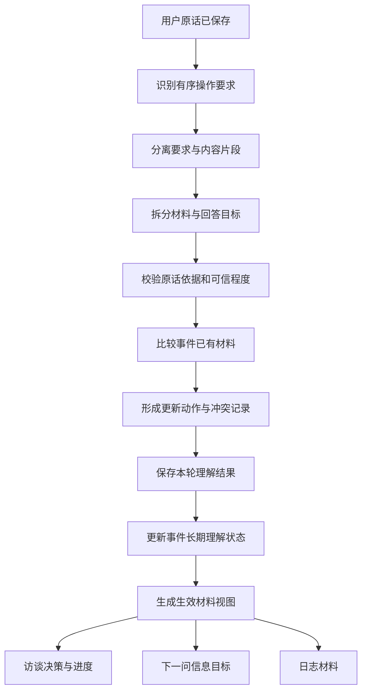

# 访谈模块二｜本轮理解与事实更新技术设计

最后更新：`2026-07-21`

文档状态：`开发、离线验收与生产上线完成`

产品依据：[本轮理解与事实更新产品规格](./interview-understanding-product-spec.md)

## 1. 技术目标

每个用户回答形成一份可追溯、可复用的“本轮理解结果”，再据此更新当前事件的长期理解状态。访谈进度、下一问和日志从同一份生效材料视图读取各自有权限使用的信息。

用户侧接口保持现状，可信程度、回答状态、冲突记录和候选信号继续作为内部状态。

## 2. 开发前实现差距

| 产品规则 | 当前基础 | 第二版改造 |
|---|---|---|
| M2-01～M2-04 | 能识别多种操作要求并选出当前动作 | 保存每次要求的原话顺序、位置、对象和范围，完整列表交给模块三 |
| M2-05～M2-10 | 已有内容分离、引用和转述保护 | 把有序要求片段从有效内容中分离，逐项保留依据 |
| M2-11～M2-20 | 已有独立材料和四种可信状态 | 增加原话位置、关联材料、待确认升级与逐条状态校验 |
| M2-21～M2-24 | 事件累计状态支持多个目标 | 本轮候选由单目标升级为多目标，每个目标独立保存依据 |
| M2-25～M2-30 | 明确修正可以撤回旧字段 | 缩小替换范围，记录确认关系，并统一触发下游重新计算 |
| M2-31～M2-33 | 新旧表达可以同时保存 | 增加含糊冲突对象，旧材料继续生效，新材料等待确认 |
| M2-34～M2-35 | 最近一轮可以复用 | 本轮理解结果保存到用户回答，任意恢复路径按回答编号复用 |
| M2-36～M2-44 | 已有候选事件和候选维度 | 强化独立成篇和关联关系校验，统一日志准入 |
| M2-45～M2-50 | 已有保守抽取与可靠提交 | 保存未解决片段和风险，理解完成后先落库再继续生成 |

## 3. 处理链路

规则层优先识别明确操作、引用、拒绝和短回答。模型补充语义拆分、事件关系、候选维度和历史关系。服务端统一验证原话依据、可信状态、材料更新和下游权限。

## 4. 核心协议

### 4.1 本轮理解结果

`TurnUnderstandingResultV2` 包含：

- 回答编号、事件、维度和消息顺序。
- 有序操作要求。
- 本轮独立材料。
- 多个问题目标的回答状态。
- 新增、补充、替换、撤回、确认和保持记录。
- 含糊冲突及其关联材料。
- 候选事件和候选维度。
- 未解决内容片段和理解风险。

### 4.2 有序操作要求

每项要求保存：类型、原话顺序、文字依据、起止位置、作用对象、作用范围和目标维度。相同类型的多次表达继续分别保存。引用和第三方转述中的要求词退出操作要求列表。

当前单动作决策通过兼容投影继续工作；完整有序列表承担模块二稳定产物，等待模块三定义最终执行次序。

### 4.3 多目标回答状态

每个回答目标独立保存状态、依据、位置和关联材料。同一目标一轮内发生变化时按原话顺序更新；用户后续主动提供具体内容可以重新打开先前关闭的目标。重复处理同一回答不会增加尝试次数。

### 4.4 材料与冲突

材料比较顺序固定为：同义复述、补充、明确替换、明确撤回、含糊冲突、不同事件。

- 明确替换让旧材料立即失效。
- 明确撤回允许暂时缺少替代材料。
- 含糊冲突保留旧材料，新表达进入等待确认。
- 普通补充让旧材料和新增细节共同生效。
- 用户确认待确认理解后，材料升级并保留确认关系。

### 4.5 事件长期状态

`InterviewEvent.understandingData` 保存事件累计状态，包括材料、目标状态、冲突、候选信号、已应用回答编号和最近消息顺序。`InterviewUserTurn` 保存对应的本轮理解结果，用于恢复、重放和质量回放。

## 5. 下游统一视图

`EffectiveUnderstandingView` 提供三类使用结果：

| 视图 | 可以读取 | 统一排除 |
|---|---|---|
| 访谈决策与进度 | 生效确认材料、目标状态、操作要求、候选信号和风险 | 待确认、失效和顺带材料 |
| 下一问 | 生效确认材料、待确认理解、冲突、关闭目标和候选信号 | 已经失效材料 |
| 日志 | 生效确认材料、关系明确的关联片段 | 操作要求、待确认、失效、候选事件、顺带信息和未解决冲突 |

现有结构化快照作为兼容投影继续服务已有代码。修正完成后，从生效材料视图重新投影快照并重新计算充分度、阶段、日志资格和下一问信息目标。

## 6. 持久化、兼容和恢复

`InterviewUserTurn` 增加本轮理解结果、协议版本和理解完成时间。保存顺序为：原话落库、本轮理解落库、事件状态与下游结果事务更新。

历史事件在读取时转换为第二版累计状态，历史用户回答无需批量补写。从下一次新回答开始写入第二版结果。转换失败时保留原话和现有快照，并输出理解风险。

分支检查点保存事件理解状态和协议版本。同一回答恢复时优先复用已保存结果，事件状态通过已应用回答编号保持唯一。

## 7. 使用与恢复方式

正式环境已经全量采用第二版结果。协议版本选择和指定账号名单继续保留，出现高影响问题时可以切回上一稳定链路；新结构数据会继续保留。

历史配置由兼容读取层继续支持。新增环境采用第二版版本选择，不安排只记录结果的长期观察阶段。

## 8. 评测与验收

专项案例共 `280` 条：既有操作要求案例 `120` 条、既有内容理解案例 `120` 条、新增组合案例 `40` 条。新增案例覆盖多要求顺序、多目标状态、明确修正与含糊冲突、多事件与跨维度、重新判断和恢复重放。

内容理解评测需要实际运行处理链路并计算：已确认材料准确率、重要内容保留率、操作要求完整率、顺序准确率、修正准确率、回答状态准确率、事件归属准确率、待确认错误升级率和恢复一致率。

发布门槛沿用产品规格。关键语义已经连续运行三次，三次均达到门槛；正式环境核心链路验证已经通过。20轮方案转为上线后可选观察。

### 8.1 本次离线验收结果

截至 `2026-07-21`，开发与离线验收结果如下：

| 验证项 | 结果 |
|---|---|
| 280条专项案例 | 通过 |
| 原120条内容理解案例真实运行 | 每条同时验证回答状态、材料更新、历史变化、事件归属和下游准入 |
| 新增40条组合案例 | 覆盖有序要求、多目标、修正与冲突、多事件、跨维度和恢复 |
| 连续三次稳定性检查 | 每次285项检查全部通过 |
| 模块二相关自动化检查 | 10个测试文件、559个用例通过 |
| 完整回归 | 191个测试文件、1711个用例通过 |
| 数据结构检查 | 通过 |
| 类型检查 | 通过 |
| 生产构建 | 通过 |

稳定性报告见[离线稳定性报告](../evals/interview-content-understanding/reports/latest-summary.md)，完整结论见[模块二验收报告](./interview-understanding-acceptance-report.md)。

## 9. 产品规则逐条映射

| 规则 | 实现落点 | 验证证据 |
|---|---|---|
| M2-01 全部保留 | 意图分析保存每次命中的操作要求，相同类型可以重复出现 | 多要求案例与意图单元测试 |
| M2-02 保留顺序 | 每项要求保存原话起止位置，并按开始位置排序 | 10条有序要求案例逐项校验 |
| M2-03 保留作用对象 | 每项要求保存当前问题、事件、维度、会话或日志等作用对象及范围 | 操作要求协议校验 |
| M2-04 执行权交给模块三 | 完整要求列表写入本轮结果，同时保留当前动作兼容投影 | 主链路服务测试 |
| M2-05 并行处理 | 操作要求与有效内容分别进入操作列表和内容证据 | 内容加操作要求案例 |
| M2-06 内容继续生效 | 删除操作片段后继续抽取剩余内容 | 有效内容保留断言 |
| M2-07 操作要求退出日志 | 日志视图只读取可信材料，不读取操作要求 | 日志材料准入测试 |
| M2-08 先判断说话对象 | 引用和第三方转述范围先被保护，再进行操作匹配 | 引用转述单元测试 |
| M2-09 直接指向系统才形成要求 | 高影响要求需要指向当前提问、访谈或系统动作 | 边界要求测试 |
| M2-10 引用与真实要求共存 | 引用片段保留为内容，引用外的真实要求单独保存 | 混合引用案例 |
| M2-11 逐条判断 | 一轮候选包含多条独立材料和多个目标状态 | 多目标与混合可信状态测试 |
| M2-12 保持用户原意 | 每条材料经过原话依据校验，缺少依据时降为等待确认 | 原话校验测试 |
| M2-13 相同意思避免重复 | 同字段同文本记录为保持，不重复新增材料 | 材料状态更新测试 |
| M2-14 关系明确才能合并 | 关联片段保存原因、后果、对比或例证关系 | 6条事件关系案例 |
| M2-15 确认材料可追溯 | 材料保存依据文字及起止位置，直接确认要求依据命中原话 | 材料依据测试 |
| M2-16 上下文确认必须唯一 | 短回答需要上一问及唯一问题目标 | 短回答边界测试 |
| M2-17 上下文不完整时谨慎 | 缺少上一问目标时不升级为上下文确认 | 恢复缺少上下文测试 |
| M2-18 推测先等待确认 | 缺少直接依据或表达不确定时保存为等待确认 | 等待确认准入测试 |
| M2-19 用户确认后升级 | 确认关系把等待材料升级为生效材料并关闭冲突 | 确认待定材料案例 |
| M2-20 用户否定后失效 | 否定或撤回让对应材料失效并关闭冲突方向 | 撤回与否定测试 |
| M2-21 每个目标独立记录 | 本轮结果保存回答目标列表，每项拥有独立状态和依据 | 10条多目标案例 |
| M2-22 状态不扩散 | 目标状态按目标键更新，其他材料和目标保持原状态 | 多状态组合测试 |
| M2-23 边界关闭当前目标 | 拒绝表达绑定当前问题目标，供下游停止该方向 | 拒绝目标测试 |
| M2-24 主动提起后恢复 | 新回答可以覆盖目标最新状态，同时保留历史变化 | 目标恢复状态测试 |
| M2-25 明确修正立即替换 | 明确修正信号与材料关系共同触发替换 | 明确修正案例 |
| M2-26 旧理解同步退出 | 替换材料进入失效状态，三类下游视图统一排除 | 修正后下游测试 |
| M2-27 重新判断充分度 | 生效材料重新投影结构化快照，再计算阶段和日志资格 | 服务集成测试 |
| M2-28 保留变化记录 | 失效材料、替换关系和更新记录继续保存在事件状态 | 历史回放测试 |
| M2-29 补充不自动推翻 | 补充关系新增细节，原材料继续生效 | 补充案例 |
| M2-30 补充需要同一事件 | 材料先保存事件关系，候选事件退出当前事件投影 | 多事件边界测试 |
| M2-31 含糊冲突不直接替换 | 缺少明确修正信号时保留旧材料 | 含糊冲突案例 |
| M2-32 新表达等待确认 | 新材料降为等待确认，并记录冲突双方编号 | 冲突结构测试 |
| M2-33 冲突内容不进入日志 | 进度和日志视图排除等待确认及未解决冲突材料 | 下游准入测试 |
| M2-34 同一轮保持唯一 | 事件状态保存已应用回答编号，用户回答保存本轮结果 | 同轮重放测试 |
| M2-35 重复处理不增加次数 | 已应用回答直接复用原状态，目标尝试次数保持不变 | 幂等状态测试 |
| M2-36 候选事件可独立讲述 | 模型输出候选事件关系，服务端保存独立场景信号 | 候选事件案例 |
| M2-37 新人物不等于新事件 | 人物材料默认留在当前事件，事件关系单独判断 | 多事件边界测试 |
| M2-38 明确换事输出切换要求 | 换事件操作进入有序要求列表，内容继续独立处理 | 切换事件案例 |
| M2-39 关联关系需要明确 | 关联片段强制保存关系类型 | 原因、后果、对比、例证案例 |
| M2-40 核心场景来自主事件 | 日志视图允许明确关联片段，候选事件退出当前日志 | 草稿材料测试 |
| M2-41 跨维度表达继续承接 | 材料继续保存在当前事件状态 | 跨维度案例 |
| M2-42 输出候选维度 | 材料与本轮结果保存候选维度及原话依据 | 候选维度测试 |
| M2-43 不自动切换 | 模块二只输出信号，当前动作继续由访谈决策模块选择 | 主链路兼容测试 |
| M2-44 不自动重复写入 | 日志视图以当前事件维度生成，候选维度只作信号 | 日志材料测试 |
| M2-45 保留原话 | 用户原话先于理解结果保存到用户回答记录 | 用户回答持久化测试 |
| M2-46 不新增未经确认事实 | 模型异常时只接纳能在原话中校验的材料 | 服务异常保护测试 |
| M2-47 不增加完成度 | 等待确认、候选事件和未解决内容退出进度视图 | 进度视图测试 |
| M2-48 输出理解风险 | 本轮结果保存未解决片段、风险类型和依据 | 异常与未说完案例 |
| M2-49 恢复前后一致 | 已保存本轮结果可重建相同事件状态 | 持久结果重放测试 |
| M2-50 复用完成理解 | 恢复流程优先读取用户回答中的本轮结果 | 服务恢复集成测试 |

## 10. 实施与上线结果

已完成：

1. 第二版协议和历史状态转换。
2. 有序操作要求、多目标回答和冲突更新。
3. 用户回答级保存与恢复复用。
4. 生效材料视图、进度重新判断和日志材料准入。
5. 40条新增案例与原120条案例真实链路评测。
6. 数据升级、指定账号验证能力和快速恢复说明。
7. 专项验收、完整回归、类型检查和生产构建。
8. 生产数据库升级和升级记录校验。
9. 正式环境启用新理解结果。
10. 生产部署、域名切换和真实访谈写入校验。

### 10.1 生产结果

| 项目 | 结果 |
|---|---|
| 正式部署编号 | `dpl_CKPntUXFtyrqFSQW8eqGEvgKA8rZ` |
| 正式部署地址 | `https://xingfuxitong-bh0w23b5x-zouzhijies-projects.vercel.app` |
| 主域名 | `https://dailylight.chat` 已指向新版本 |
| 数据升级 | 两项模块二升级均成功，新增4个字段，迁移记录完整 |
| 生产理解协议 | 全量采用第二版结果 |
| 公开页面检查 | 首页、登录、注册、协议、隐私与会话接口全部通过 |
| 真实访谈检查 | 用户回答、本轮结果、事件累计状态和用户侧隐藏边界全部通过 |
| 验证数据 | 临时账号及关联数据已经清理 |

上一正式部署 `dpl_3CrHUAqd4MtrMc5PTSsNitrwB4Nr` 继续承担快速恢复入口。20轮方案保留为[上线后观察模板](./interview-understanding-real-validation.md)，不再影响模块二完成状态。
