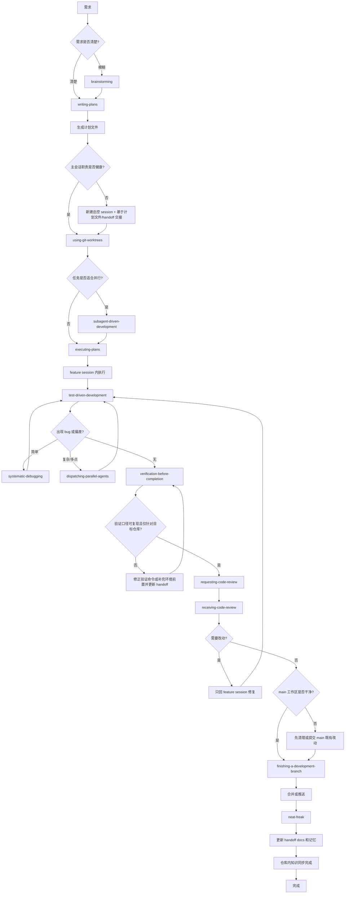
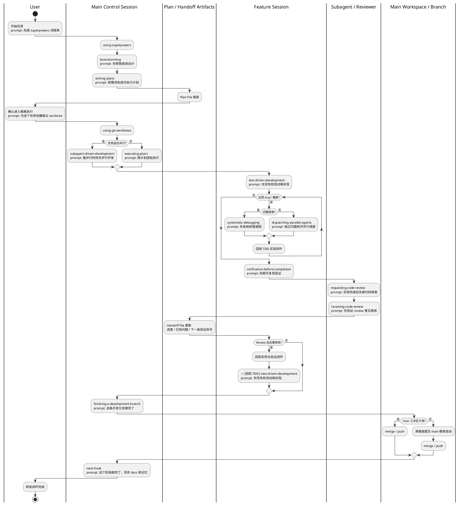
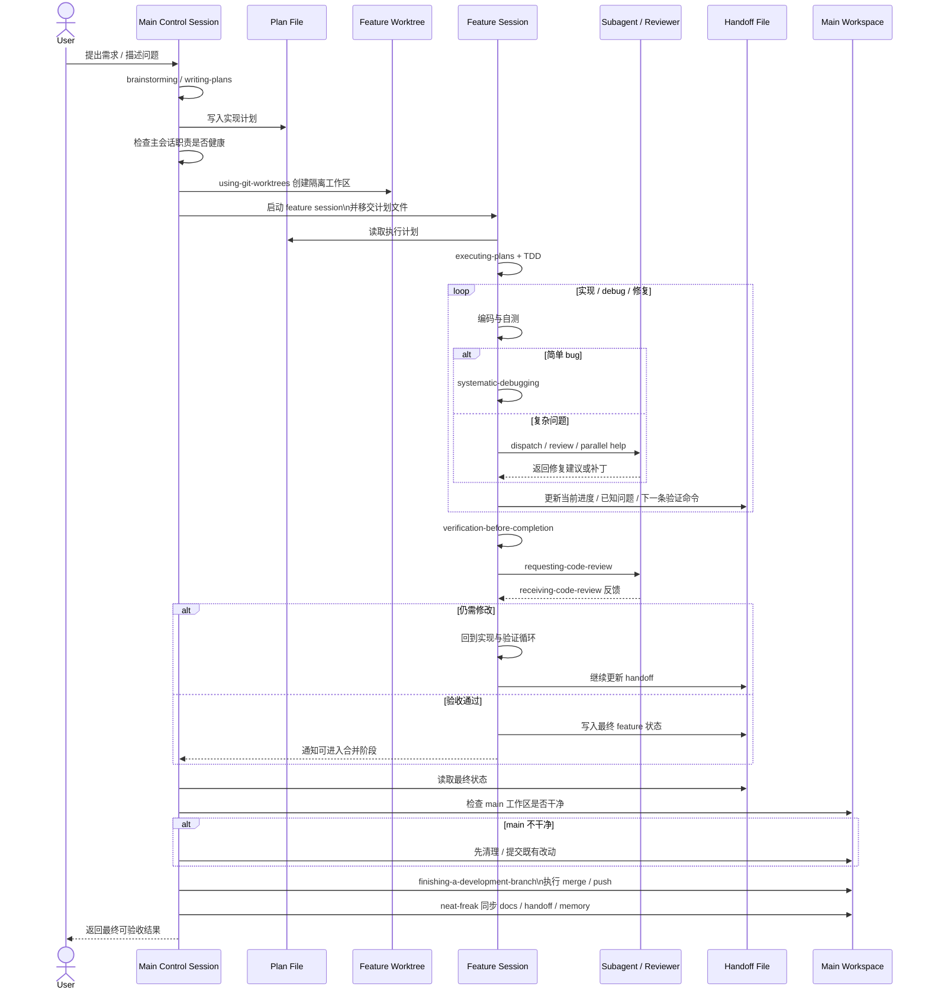

# Codex 项目开发流程 V2

最后更新：`2026-05-17`

## 背景

这份流程是基于本次“账户体系首版”开发复盘后整理出的 Codex 专用工作流，目标是解决以下问题：

- `main` 会话承担了实现、debug、收尾等过多职责，导致上下文快速耗尽
- feature worktree 已创建，但 session 隔离没有贯彻到底
- handoff 过度依赖聊天记录，缺少仓库内稳定交接文件
- 验证口径不统一，出现“说通过了，但命令不可复现”的情况
- `npm test`、`.worktrees/*`、`.next/types` 等环境细节没有进入标准流程
- merge、docs sync、push、clean-up 混在同一个阶段执行，收尾复杂度过高

## 设计原则

- `main` 会话只做总控、集成、收尾，不做功能开发
- 功能实现、debug、review loop 全部沉到 feature worktree/session
- 每个阶段都要留下仓库内 handoff 文件，不依赖聊天记录
- 验证必须区分“主仓真实基线”和“worktree/临时环境结果”
- `neat-freak` 进入主流程，作为固定收尾阶段
- 标准研发闭环只到仓库内 `docs / handoff / memory` 同步完成，不把飞书作为常规流程参与者

## 新版完整流程图



## 14 Skill 角色泳道图

这张泳道图体现的是理想执行版本：`main` 负责总控、计划和集成，功能实现只发生在 feature session 及其 review/debug 闭环里。图内每个 skill 节点只保留 1 句短 prompt，完整 prompt 见后面的对照表。



## 时序图补充

这张时序图用于补足“谁和谁交互”的信息，重点解释 `main`、feature session、review/session、计划文件、handoff 文件和 worktree 之间的真实协作关系。



## 强制守门节点

### 1. 生成计划文件

`writing-plans` 之后必须把实现计划落到仓库内文件。后续的 feature session、subagent、review 和收尾都基于这份文件推进，而不是基于聊天上下文。

推荐文件：

- `docs/plans/YYYY-MM-DD-<topic>.md`
- `docs/handoff.md`

### 2. 主会话职责是否健康

`main` 会话只允许承担这些职责：

- 需求收敛
- 计划确认
- worktree/分支总控
- 最终合并
- 文档同步

一旦 `main` 会话开始承担以下任一工作，就必须切新总控 session：

- 功能实现
- 复杂 debug
- 多轮 review 修复
- 长链路验证排查

### 3. 验证口径可复现且仅针对目标仓库

验证前必须确认：

- 命令是否误扫 `.worktrees/*`
- `typecheck` 是否依赖 `.next/types`
- 测试是否依赖环境变量或数据库
- 当前结果到底是主仓结果，还是某个 feature worktree 结果

禁止直接把“某个 worktree 跑绿”表述成“主仓通过”。

### 4. main 工作区是否干净

合并前必须先处理 `main` 上已有未提交改动。不要把“主仓清理”和“功能合并”揉成一步。

推荐顺序：

1. 清理或提交 `main` 既有改动
2. 单独合并 feature
3. 单独做 docs sync / neat-freak
4. 最后 push

## 新旧流程的关键差异

### 新增的硬规则

- `main` 会话只做总控，不做实现
- 计划文件和 handoff 文件成为主链路资产
- 验证必须写清命令、前置条件和作用范围
- `neat-freak` 成为固定收尾阶段

### 维持不变的 Skill 主链

- `brainstorming`
- `writing-plans`
- `using-git-worktrees`
- `subagent-driven-development`
- `executing-plans`
- `test-driven-development`
- `systematic-debugging`
- `dispatching-parallel-agents`
- `verification-before-completion`
- `requesting-code-review`
- `receiving-code-review`
- `finishing-a-development-branch`
- `neat-freak`

## 本次复盘识别出的反模式

- `main` 会话参与功能开发和 debug
- session 切换前没有稳定 handoff 文件
- 先宣布“通过”，再回头解释命令为什么不可复现
- 在 `main` 脏工作区上直接 merge
- docs sync 晚于 merge，且没有单独收尾阶段
- worktree 已建立，但验证命令和测试口径仍然指向混合环境

## 推荐验证命令模板

### 主仓构建验证

```bash
npm run build
```

### 主仓类型验证

如果 `tsconfig.json` 包含 `.next/types/**/*.ts`：

```bash
npm run build
npm run typecheck
```

### 主仓测试验证

优先使用 repo-scoped 命令，避免扫入 `.worktrees/*`：

```bash
npx vitest run --dir tests
```

### handoff 最小模板

每次切 session 或进入收尾前，至少补齐：

- 当前目标
- 当前分支 / worktree / session 角色
- 已完成项
- 待验证项
- 已知问题
- 推荐下一条验证命令

## 14 Skill 典型触发 Prompt 对照表

| Skill | 触发节点 | 典型 Prompt |
|---|---|---|
| `using-superpowers` | 任务刚开始 | `先按 superpowers 流程来` |
| `brainstorming` | 需求模糊、方案未定 | `先帮我收敛设计` |
| `writing-plans` | 需求已清楚，需要落执行计划 | `把需求拆成可执行计划` |
| `using-git-worktrees` | 进入实现前需要隔离工作区 | `为这个任务创建独立 worktree` |
| `subagent-driven-development` | 任务可并行，且在当前 session 内执行 | `能并行的优先并行开发` |
| `executing-plans` | 任务不适合并行，按计划顺序推进 | `按计划逐批执行，不要跳步骤` |
| `test-driven-development` | 任一功能实现或修 bug 前 | `先写失败测试再实现` |
| `systematic-debugging` | 简单 bug / 单点异常 | `这个 bug 先系统排查根因` |
| `dispatching-parallel-agents` | 多个独立问题可并行排查 | `这几个问题拆开并行调查` |
| `verification-before-completion` | 宣布完成前 | `先跑可复现验证，再说完成` |
| `requesting-code-review` | 功能实现和本地验证后 | `实现完成后先做代码审查` |
| `receiving-code-review` | 收到 review 后 | `先验证 review 意见，再决定是否修改` |
| `finishing-a-development-branch` | feature 分支开发完成 | `这条开发分支做完了，进入收尾` |
| `neat-freak` | merge/push 完成后 | `这个阶段做完了，同步 docs 和记忆` |

## 什么时候必须新开 session

- `main` 会话开始参与实现
- 上下文已经积累了大量调试往返
- 进入新的 feature 子链路
- 需要交给另一位 agent 继续推进
- 收尾阶段需要与实现阶段完全隔离

## 这次为什么还用了飞书

飞书不是标准研发流程参与者。它只在这次专项复盘里作为对外沉淀载体存在，用来把最终整理好的流程图同步给你查看。标准流程本身只要求仓库内 `docs / handoff / memory` 完成同步。
