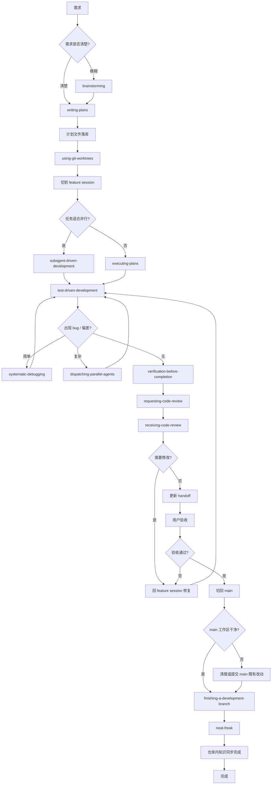
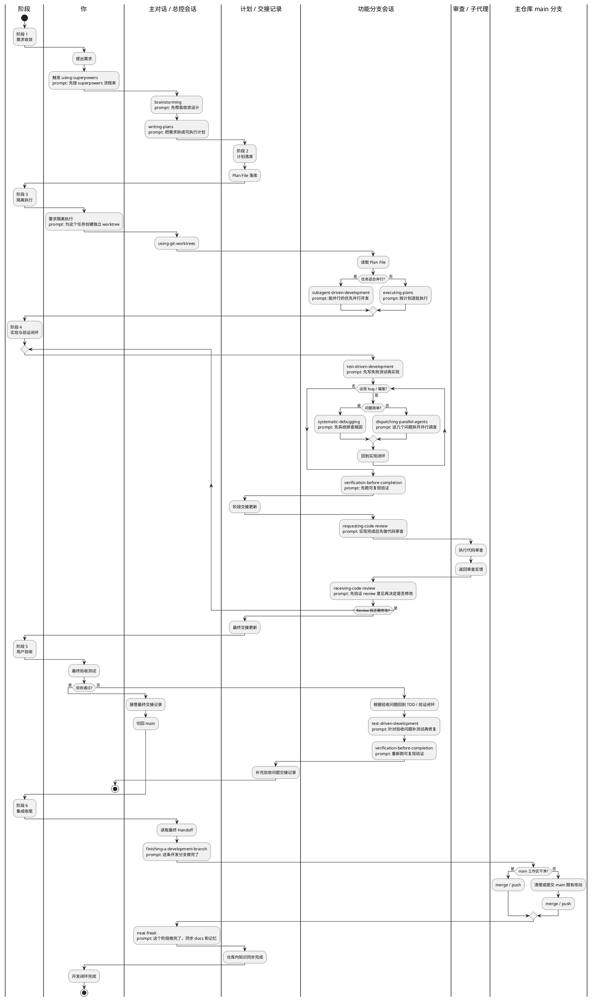
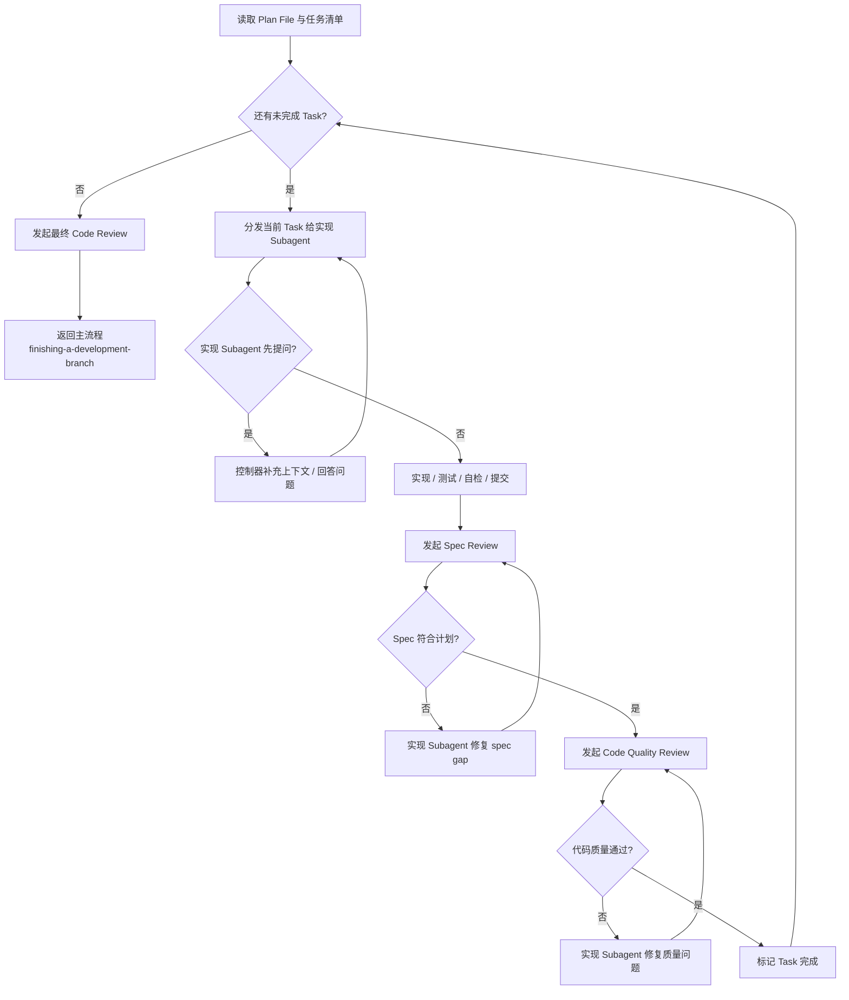
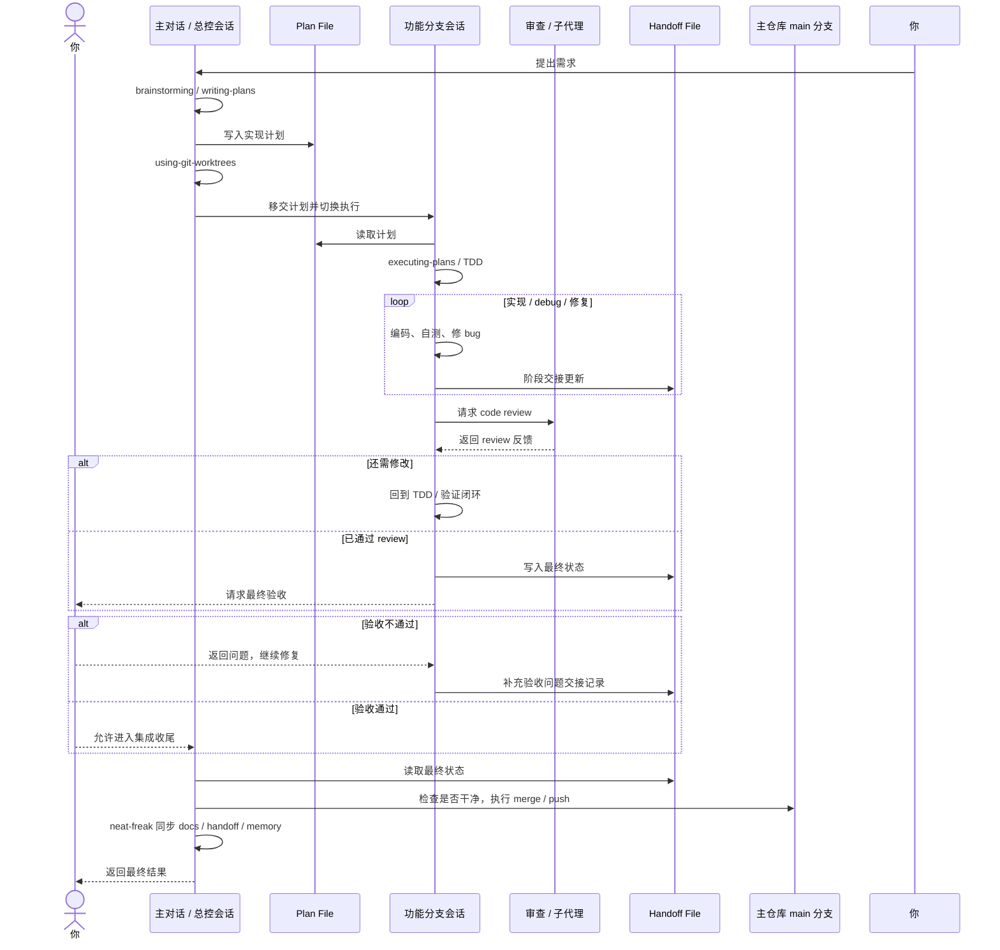

# Codex 开发 SOP V3（可执行版）

最后更新：`2026-05-17`

## 目标

这份 `V3` 不是复盘展示稿，而是“拿来就能跑一个功能开发闭环”的操作手册。
它解决 `V2` 仍然存在的几个断点：

- `main` 和 feature session 的切换规则不够硬
- `handoff` 何时写、写什么不够明确
- skill prompt 过短，难以直接复制使用
- 缺少正式的“用户验收”节点
- bug、review、上下文过载后的升级路径不够清楚

## 核心原则

- `main` 只负责总控、计划、集成、收尾，不做功能实现和 debug
- 功能实现只能发生在 feature session / feature worktree 内
- 每次切 session、进入 review、准备合并前都必须更新仓库内 handoff
- 所有“完成”都先经过可复现验证，再经过用户验收
- 标准研发闭环只到仓库内 `docs / handoff / memory` 同步完成

## 主流程图



## 角色泳道图

读图顺序固定为：先看最左侧 `阶段` 栏，确认当前处于哪个阶段；再横向看这一阶段内各个角色应该做什么、不应该做什么。这样可以同时表达时间切片和责任切片。



## 阶段 × 角色矩阵

这张图只负责表达“当前阶段”和“角色责任边界”，不承载完整技能细节。
图内保持短句，完整 prompt、触发时机、验证命令和收尾规则继续由 `14 Skills 操作表` 和 `硬规则表` 承接。

| 阶段 | 你 | 主对话 / 总控会话 | 计划 / 交接记录 | 功能分支会话 | 审查 / 子代理 | 主仓库 main 分支 |
|---|---|---|---|---|---|---|
| 需求收敛 | 提出需求 | `using-superpowers` / `brainstorming` |  |  |  |  |
| 计划落库 | 确认计划 | `writing-plans` | 落 Plan File |  |  |  |
| 隔离执行 | 要求独立 worktree | `using-git-worktrees` |  | 读 Plan File |  |  |
| 实现与验证闭环 |  |  | 阶段交接更新 | `TDD` / `debug` / `verify` / `review` | 只做 review |  |
| 用户验收 | 最终验收测试 | 验收通过后接管最终交接 | 验收问题交接 | 回 `TDD` / 验证闭环 |  |  |
| 集成收尾 | 确认闭环完成 | `finishing-a-development-branch` / `neat-freak` | 仓库内知识同步完成 |  |  | 检查干净 / `merge` / `push` |

## Subagent-Driven Development 子流程图

当 `任务适合并行? -> 是` 时，主图只给出入口。这里单独展开它的内部机制：控制器分发任务，实现 subagent 负责实现与自测，spec reviewer 先查“是否符合计划”，code quality reviewer 再查“实现质量是否达标”。任何一层不过，都回 implementer 修复，直到单个 task 完成；全部 task 完成后，才返回主流程进入分支收尾。



这张子图回答的是“并行开发模式内部怎么运转”，不替代主流程图和主泳道图。

## 时序图



## 14 Skills 操作表

| Skill | 触发时机 | 由谁触发 | 可复制 Prompt | 预期输出物 |
|---|---|---|---|---|
| `using-superpowers` | 任务刚开始 | 你 / 主对话 | `先按 superpowers 流程来` | 明确需要哪些 skills |
| `brainstorming` | 需求模糊、边界未清 | 你 / 主对话 | `这个需求还比较模糊，先帮我收敛设计` | 需求澄清、方案收敛 |
| `writing-plans` | 需求已清楚，需要计划 | 主对话 | `把需求拆成可执行计划，保存为计划文件` | `docs/plans/...md` |
| `using-git-worktrees` | 准备进入实现 | 主对话 | `为这个任务创建独立 worktree` | feature worktree / feature branch |
| `subagent-driven-development` | 任务可并行，留在当前会话执行 | 主对话 | `能并行的部分优先并行开发` | 并行任务执行与 review loop |
| `executing-plans` | 任务不适合并行，按计划逐批执行 | 功能分支会话 | `按计划逐批执行，不要跳步骤` | 批次化实现结果 |
| `test-driven-development` | 任一功能实现或修 bug 前 | 功能分支会话 | `每个功能都先写失败测试再实现` | failing test -> passing test |
| `systematic-debugging` | 简单 bug / 单点异常 | 功能分支会话 | `这个 bug 先系统排查根因` | 根因定位与修复路径 |
| `dispatching-parallel-agents` | 多个独立问题并行排查 | 功能分支会话 | `这几个问题拆开并行调查` | 并行调查结果 |
| `verification-before-completion` | 宣布完成前 | 功能分支会话 | `先跑可复现验证，再说完成` | 验证命令与输出 |
| `requesting-code-review` | 本地验证后 | 功能分支会话 | `实现完成后先做代码审查` | review findings |
| `receiving-code-review` | 收到 review 后 | 功能分支会话 | `先验证 review 意见，再决定是否修改` | 修复或有理有据的回绝 |
| `finishing-a-development-branch` | 验收通过，准备集成 | 主对话 | `这条开发分支做完了，进入收尾` | merge / PR / 保留分支决策 |
| `neat-freak` | merge / push 后 | 主对话 | `这个阶段做完了，同步 docs 和记忆` | 更新后的 `README / docs / AGENTS / handoff` |

## 硬规则表

### 1. 会话切换规则

- `writing-plans` 完成并落库后，必须离开 `main` 进入 feature session
- 进入 feature session 后，功能性反馈、bug、截图、报错都只在 feature session 里处理
- `main` 只允许处理：计划调整、阶段状态、最终集成、最终收尾
- 只有在“用户验收通过”后，才允许切回 `main`

### 2. Handoff 规则

必须写 handoff 的时机：

- 准备切新 session 前
- 请求 code review 前
- 用户验收前
- 准备 merge 前
- 上下文接近耗尽时

最少字段模板：

```md
当前目标：
当前分支 / worktree / session：
已完成：
未完成：
已知问题：
下一条验证命令：
```

### 3. 用户验收规则

- code review 通过不等于开发完成
- 只有用户执行最终验收后，才能进入 `finishing-a-development-branch`
- 验收失败时，直接回 feature session 修复，不回 `main`

### 4. 失败升级路径

- 单点 bug：`systematic-debugging`
- 多点独立问题：`dispatching-parallel-agents`
- review 提出修改：回 feature session -> 重新验证 -> 必要时二次 review
- session 上下文将耗尽：先写 handoff，再切新 session
- 如果发现计划本身有缺口：停止执行，回到 `brainstorming / writing-plans`

### 5. 推荐验证命令

主仓构建验证：

```bash
npm run build
```

主仓类型验证：

```bash
npm run build
npm run typecheck
```

主仓测试验证：

```bash
npx vitest run --dir tests
```
