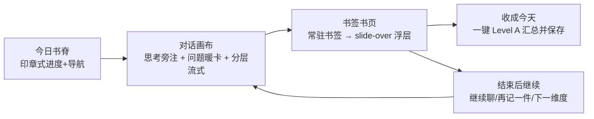

# UX 链路全量改造计划（v3 重构基线）

归档日期：`2026-06-12`  
来源：Cursor Plan `ux链路全量改造_cb4cd462`（对话中验收通过的设计方向）  
**实时状态矩阵**见 [`docs/handoff/2026-06-12-interview-ux-acceptance-handoff.md`](../handoff/2026-06-12-interview-ux-acceptance-handoff.md) §「RD/PERF 全景状态表」。

> 设计方向已于对话中验收通过，基线原型：`docs/plans/ux-flow-prototype-v3.html`。  
> 本计划从「在旧结构上小修小补」升级为「按 v3 重构交互模型」。**进度条**相关项由用户单独处理，明确排除。

---

## 一、四个心智模型支柱



1. **今日书脊**：`悦 实 思 改 谢 → 完整` 一条脊线，是进度+导航+收成入口；印章=已记，描边=在聊，虚线=草稿，文字状态保留。取代溢出 header。
2. **对话画布**：思考=轻旁注（不加重、无标签）、问题=暖色衬线卡（无额外标识），两者分段流式，可停止。
3. **书签书页**：右侧常驻书签丝带，点开 slide-over 书页浮层（对话全高、不再双栏抢宽度），保存三态显性。
4. **收成今天 + 结束后继续**：完整日志一步收成（Level A）；保存不再是死胡同，可继续聊并把日志更新。

---

## 二、已锁定决策

- 术语统一 **「完整日志」**。
- 一键「收成今天」走 **Level A**：只自动落库当天「已生成 draft 未保存」的维度；进行中无草稿的维度明示跳过。
- 配色严格对齐现有 `globals.css` 暖纸+琥珀金 token，不引入新主色。
- 思考层不加重、不加「AI 在想」标签；问题卡不加「问」标识。

---

## 三、明确排除（用户单独处理）

- 单维 / 完整日志的**进度条**（假进度、时长预期、超时反馈、阶段文案）。仓库已有 `journal-generation-copy.ts` / `journal-generation-progress.ts`，与用户本地未提交改动可能冲突。

---

## 四、工作项定义（RD-1 ~ RD-10）

### A. 设计系统地基

| ID | 内容 | 主要文件 | 覆盖旧 WS |
|----|------|----------|-----------|
| **RD-1** | 今日书脊：印章式进度脊线（悦实思改谢→完整）取代 header 维度 tab + 进度环 + 生成/完整按钮；文字状态（未记/在聊/草稿/已记/可更新/已收成）；**跨 header + 共享词表 + 日历 + ~60 测试** | 新建脊线组件；替换 `interview-header-toolbar.tsx`；联动 `calendar` 读模型 | #3 header 溢出、#1#2 生成入口漂移 |
| **RD-2** | 思考/问题分层：思考=轻旁注（faint+小圆点，无标签），问题=暖色衬线卡 | `interview-shell.tsx` `MessageBubble` / `ConversationMessage` | #6 |
| **RD-3** | 书签日志书页：常驻书签丝带 + 右侧 slide-over 书页浮层取代 xl 双栏，对话全高 | `interview-shell.tsx` panel/bookmark；`globals.css` | #11 响应式 |
| **RD-5** | 确认与撤销：新建 `confirm-dialog.tsx` 替换 4 处 `window.confirm` | `src/components/ui/confirm-dialog.tsx` | #7 #22 #26 |

### B. 核心流程

| ID | 内容 | 主要文件 |
|----|------|----------|
| **RD-4** | 保存三态显性 + 自动暂存时间戳 + 关闭面板反馈 | `interview-shell.tsx` `panelStatusText` / `handleClosePanel` |
| **RD-6** | 流式与停止：发送键流式中变「停止」 | `interview-shell.tsx` composer + `cancelInterviewResponse` |
| **RD-7** | 访谈结束后继续：收束卡=继续聊/再记一件/下一维度；reopen；继续后日志可更新 | `InterviewEndedCard` + `POST /api/interview/session/reopen` |
| **RD-8** | 收成今天 Level A：后端 save-all 编排 + `POST /api/daily-journal/save-all`；前端主 CTA | `daily-journal.service.ts`、`save-all/route.ts`、`daily-journal-workspace.tsx` |
| **RD-9** | 术语统一「完整日志」 | `daily-journal-workspace`、`calendar-day-view`、`interview-shell` |

### C. 打磨

| ID | 内容 |
|----|------|
| **RD-10** | 生成失败结构化 / 导出禁用理由常驻 / stale 文案口语化 / 重复日期去冗余 / 工作区 transition 减负 |

---

## 五、性能专项（PERF-1 ~ PERF-6）

| ID | 根因 | 方案 |
|----|------|------|
| **PERF-1** | `generateJoyInterviewDraft` 同步阻塞，整段等 AI | draft/generate 改 SSE，标题/正文逐字流入书页 |
| **PERF-2** | `generateDailyJournal` 同步 `completeStructuredOutput` | 先确定性拼章秒出骨架，再 AI 流式润色替换 |
| **PERF-3** | 收成串行、失败面大 | DB 落库并行 + 分步真实进度 + 部分失败可恢复 |
| **PERF-4** | header 对每个缓存维度各发 `/api/interview/session/[id]`（N+1） | 合并为单次 day 快照（复用 `/api/calendar/day`） |
| **PERF-5** | 切维度重复取数；`calendar/day` 全 `no-store` | 客户端短缓存/SWR + 保存后失效 |
| **PERF-6** | 首屏空白 | 书脊/对话/书签骨架；开场问题乐观显示 |

**耦合说明**（2026-06-12 执行时记录）：

- PERF-1/2 与用户在做的**单维进度条**未提交改动冲突，暂缓。
- PERF-4/5 归入 **RD-1 专注轮**（header 数据层一并重写；`interview-shell.test.tsx` L3651–3655 显式断言 N+1 行为）。

---

## 六、计划执行顺序（原始）

1. A 地基（RD-1/2/3/5）
2. B 流程（RD-4/6/7/8/9）
3. C 打磨（RD-10）
4. D 性能（PERF-*）

**实际执行顺序**（因用户指令调整）：

1. 第一轮：RD-5 → RD-2 → RD-9 → RD-6 → RD-4（已 commit `60db348` 之前）
2. 第二轮（用户指定）：RD-3 → RD-7 → RD-8 → RD-10 → PERF 可落地项
3. **RD-1 单列专注一轮**，至今未启动
4. Debug 轮：未 commit 修补（流式/聊天/布局）

---

## 七、验收命令（每个 RD 完成后）

```bash
npx tsc --noEmit
npm test
# 访谈 UX 专项：
npm test -- tests/unit/interview-shell.test.tsx tests/unit/daily-journal-workspace.test.tsx tests/unit/daily-journal.api.test.ts
ACCEPTANCE_BASE_URL=http://127.0.0.1:3000 node scripts/browser-full-flow.mjs
```

人工必验：访谈主链路 / 生成 / 重新生成 / 保存 / 刷新恢复 / 边界收束 / 标题治理 / 结束后继续 / 收成今天 / **多维度快速切换** / **与 v3 HTML 视觉对比**。

---

## 八、设计交付物（仓库内）

| 文件 | 说明 |
|------|------|
| `docs/plans/ux-flow-prototype-v3.html` | **验收基线（可交互）** |
| `docs/plans/ux-flow-interactive-prototype.html` | 可点全流程 demo |
| `docs/plans/ux-flow-redesign-preview.html` | 心智模型说明 |
| `docs/plans/ux-flow-before-after-preview.md` | WS-A~K 对照（初版小修视角） |
| `docs/plans/journal-skeleton-loader-preview.html` | 骨架流光预览 |

以上 HTML 多数为 **untracked**，未纳入 git；接手模型可本地 `open docs/plans/ux-flow-prototype-v3.html` 对照。
