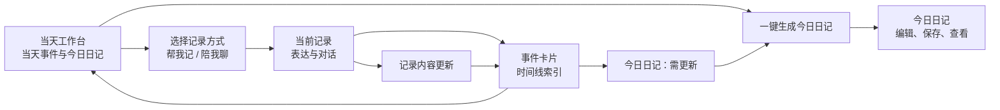

# Daily Light：访谈、事件卡片与今日日记网页端前端设计交接

最后更新：`2026-08-12`

状态：产品方向已确认；新前端构建中，等待产品负责人验收；旧 UI Preview 作为历史工程证据保留
适用范围：Daily Light 网页端的【帮我记】、【陪我聊】、当天事件卡片与今日日记闭环

## 1. 这份文档解决什么问题

这份文档用于把 Daily Light 的访谈链路和日记生成链路设计成一条连续、可理解的用户旅程。

用户的完整体验是：

```text
来到某一天 → 选择帮我记或陪我聊 → 完成一条记录 → 看见事件卡片
→ 回到当天日记页 → 一键生成今日日记 → 编辑、保存、查看 → 新内容出现后更新今日日记
```

访谈与日记页共用日期、记录素材、保存状态、恢复逻辑和更新提示。因此，设计师需要将它们作为一个完整闭环出原型；开发时可以按页面和组件拆分实现。

本文件是“设计师出原型”和“Codex 根据原型开发”的共同约束。设计师负责页面布局、视觉层次、动效、控件表达和具体操作细节；本文件负责用户旅程、状态边界、素材规则和验收结果。

## 0. 当前状态与历史工程证据

当前新前端正在按本文件的用户旅程构建，完成后由产品负责人先验收视觉与交互，再接入固定六案例 Preview。生产环境继续保持当前版本。

`2026-08-12` 曾形成一版网页实现并部署独立 UI Preview。以下页面结果、链接和专项验证只作为历史工程证据，用于后续联调参考；它们不代表当前新前端已经通过产品验收。

历史页面结果：

- 无会话进入 `/interview?mode=event-centered&entryDate=YYYY-MM-DD` 时，先展示当天工作台空状态；用户点击【帮我记】或【陪我聊】后才创建对应记录。
- 三阶段进度、当前记录信息和【帮我记】的“原话已保存”状态进入顶部导航上下文区；聊天区不再重复占用一块进度卡片。
- 理解与提问共用 dailylight.chat 的 AI 气泡，用户气泡与输入框继续复用现有访谈视觉和键盘行为。
- 每条带生成记录的回复保留【赞】【踩】【重新生成】；重新生成菜单提供“更简单一点 / 更具体一点 / 换一个角度”，支持键盘导航、Esc 关闭、焦点恢复和已有版本切换。
- `/calendar?view=day|week|month&date=YYYY-MM-DD` 统一使用归档侧栏 + 报告画布骨架，加载、错误和空状态保持同一版式；日报、周报、月报分别接入真实合同。

历史 Preview 入口：

- Preview：<https://xingfuxitong-myks9m13t-zouzhijies-projects.vercel.app/>
- 当天访谈空工作台：<https://xingfuxitong-myks9m13t-zouzhijies-projects.vercel.app/interview?mode=event-centered&entryDate=2026-08-12>
- 日报：<https://xingfuxitong-myks9m13t-zouzhijies-projects.vercel.app/calendar?view=day&date=2026-08-12>
- 周报：<https://xingfuxitong-myks9m13t-zouzhijies-projects.vercel.app/calendar?view=week&date=2026-08-12>
- 月报：<https://xingfuxitong-myks9m13t-zouzhijies-projects.vercel.app/calendar?view=month&date=2026-08-12>

历史专项验证记录：访谈、日记和归档页面专项测试 `36/36`，类型检查、Lint、差异检查通过，远端 Preview 构建状态为 `Ready`。这组结果证明旧候选具备工程可运行性；当前新前端仍以产品负责人的新一轮验收结果作为完成依据。

## 2. 产品方向：本轮已确认

以下结论来自产品负责人于 `2026-08-11` 的明确决定，设计稿和后续开发都以此为准。

| 主题 | 已确认方向 |
| --- | --- |
| 访谈成果 | 每条完整记录沉淀为一张**事件卡片**。它是当天时间线的索引和素材入口。 |
| 日记成果 | 用户在日记页生成一篇**今日日记**；当天只存在这一份总日志。 |
| 访谈中的日志感知 | 【帮我记】和【陪我聊】完成对话时，用户只感知表达、回应和“这条内容被记下”。访谈页不出现生成日志、更新日志、日志版本等内容。 |
| 日记生成入口 | 日记页保留一个固定位置的日记主动作。首次为“**一键生成今日日记**”，内容变化后为“**更新今日日记**”，已保存且内容未变化时为“**查看今日日记**”。 |
| 事件卡片 | 卡片定位为时间线索引，默认展示时间、记录方式、自然标题和一句内容摘录；用户按需查看原话。卡片不承担完整聊天记录和日志正文的展示职责。 |
| 素材范围 | 当天有效事件卡片自动参与今日日记，不提供“纳入／排除”操作。 |
| 更新规则 | 访谈内容或事件卡片更新后，日记页显示“需更新”；用户在日记页主动更新，系统保护已编辑且未受影响的日记内容。 |
| 设备范围 | 本轮交付完整网页端原型与开发方案。移动端不在本轮范围内。 |

### 2.1 历史资料的使用方式

项目历史资料中存在“在访谈内生成事件日志”的早期链路描述。它们保留为代码和产品演进背景。

本轮前端目标采用以下用户可见结构：

```text
访谈记录 → 事件卡片 → 今日日记
```

设计师和开发者应以本文件的结构组织用户界面。历史描述中的访谈内“生成日志”入口不进入本轮原型。

## 3. 用户旅程与页面职责

### 3.1 一天是用户组织内容的主单位

用户进入当天工作台后，可以开始一条新记录，也可以查看当天已有的事件卡片和今日日记。

`entryDate` 是当天工作台、事件卡片与今日日记的共同归属。记录发生时间只用于当天时间线排序。

### 3.2 三个连续工作区



| 工作区 | 用户任务 | 必须传递给下一步的内容 |
| --- | --- | --- |
| 当天工作台 | 看今天、开始一条记录、浏览事件卡片、处理今日日记 | `entryDate`、当天卡片、今日日记状态 |
| 当前记录／访谈 | 表达一件事，或围绕一件事陪聊 | 当前记录、用户原话、记录方式、保存与恢复状态 |
| 今日日记 | 生成、阅读、编辑、保存、更新当天总日志 | 当天有效事件卡片、日记状态、用户已有编辑 |

### 3.3 两种记录方式

| 记录方式 | 用户感受 | 访谈页的设计重点 | 回到当天后的结果 |
| --- | --- | --- | --- |
| 【帮我记】 | 快速把一件事留下来 | 输入、原话已保存、自然承接、低打扰 | 形成或更新一张事件卡片 |
| 【陪我聊】 | 围绕当前困惑或体验理清想法 | 大面积对话区、清楚的理解回应、可继续输入、自然暂停 | 形成或更新一张事件卡片 |

两种模式都回到同一个当天工作台。页面需要让用户理解“我正在记录今天的一件事”，同时不把模型、评测、日志生成规则带入对话现场。

### 3.4 记录完成与返回当天

设计师决定“自然收束”“回到今天”“已记下”等具体交互表达。设计必须满足以下结果：

- 用户能在访谈自然暂停、主动离开或内容已经保存后回到当天工作台；
- 返回过程不使用“生成日志”作为记录结束动作；
- 事件卡片在当天时间线可见，并能承接后续回看与编辑；
- 用户中断、刷新或网络波动后，仍能知道原话是否已保存，并回到正确的记录或当天工作台；
- 用户开始另一条记录时重新选择【帮我记】或【陪我聊】，不同记录的内容不串联。

## 4. 日记页的状态与唯一主动作

日记页保留一个固定位置的主动作位。它随状态改变文案和可用性，帮助用户在每个时刻知道下一步。

| 页面状态 | 主动作 | 用户看到的结果 | 设计要求 |
| --- | --- | --- | --- |
| 当天没有事件卡片 | 开始记录 | 引导用户选择【帮我记】或【陪我聊】 | 日记区域保持轻量，不制造“空白失败感” |
| 未生成 | 一键生成今日日记 | 开始整理当天素材 | 卡片存在时可直接发起 |
| 生成中 | 正在生成 | 防止重复提交 | 同时明确告知已保存的素材和当前等待状态 |
| 草稿 | 继续编辑 | 进入可编辑日记 | 恢复上次编辑位置与未保存内容 |
| 已保存 | 查看今日日记 | 进入阅读与编辑 | 让用户知道这份日记已经保存 |
| 需更新 | 更新今日日记 | 用当天新增或修改的卡片更新内容 | 明确表达已有日记仍然保留，更新由用户主动发起 |
| 更新失败 | 重试更新 | 允许重新尝试 | 保留原日记，提供清楚的恢复动作 |

### 4.1 生成、编辑与更新的体验原则

- 生成成功后，用户直接进入今日日记的阅读与编辑体验；具体采用全页、同页展开、抽屉或其他形态由设计师决定。
- 日记正文是连续阅读和书写的成果区域，卡片时间线承担素材回看职责。
- 用户编辑日记时自动暂存；刷新、离开和跨设备返回时优先恢复用户已有内容。
- 事件卡片发生变化后，已保存日记进入“需更新”。更新过程保护用户手工修改过、且与新素材无关的内容。
- 生成失败、更新失败和网络中断都提供就地恢复。用户不需要重新讲述已经保存的内容。

## 5. 事件卡片的内容与交互边界

事件卡片帮助用户回看“今天记了什么”，同时为今日日记提供可信素材。

### 5.1 卡片默认信息

每张卡片默认呈现：

- 记录时间；
- 【帮我记】或【陪我聊】；
- 自然、简短的事件标题；
- 一句内容摘录；
- 事件发生时间或记录次数等已有的轻量上下文。

### 5.2 按需展开的信息

用户可按需查看自己的原话、编辑记录内容，或回到相应记录继续表达。具体入口形态由设计师决定。

以下内容保持在用户界面之外：

- 完整 AI 调用细节、模型名称、Prompt、评测状态与内部诊断；
- 隐藏推理、内部来源签名和程序追踪字段；
- 把 AI 提问直接当作日记素材的内容；
- 将卡片扩展为另一篇完整日志的视觉表达。

### 5.3 卡片变化与日记更新

卡片新增、编辑或来源内容变化后，当天日记状态变为“需更新”。

用户在日记页点击“更新今日日记”后，系统将当天最新卡片纳入生成过程。日记页需要说明“今天有新的内容可以加入”，同时让用户保有对原日记的掌控感。

## 6. 设计师需要完成的网页端原型

设计师交付一套完整、可点击的网页端高保真原型。原型的价值在于验证整条链路的可理解性和操作连续性，页面布局与视觉方案可由设计师自主决定。

### 6.1 必须覆盖的核心场景

| 场景 | 原型必须说明的体验结果 |
| --- | --- |
| 空白当天 | 用户理解今天还没有记录，并能从当天工作台开始选择两种记录方式。 |
| 【帮我记】 | 用户表达后感到内容被可靠记下；返回当天后看见时间线事件卡片。 |
| 【陪我聊】 | 用户能在足够高的对话区域中自然表达、继续输入、等待回应或自然暂停；完成后回到事件卡片。 |
| 首次生成 | 用户在日记页点击“一键生成今日日记”，进入可阅读、可编辑的成果。 |
| 已保存日记 | 用户能查看、继续编辑或回到当天工作台开始新记录。 |
| 新卡片出现 | 用户看见“需更新”，理解新内容尚未进入今日日记，并能主动更新。 |
| 卡片编辑 | 用户编辑已有事件内容后，日记进入“需更新”；用户原话可按需查看。 |
| 失败与恢复 | 对话等待、网络中断、生成失败和更新失败都有单一、清楚的恢复路径。 |
| 日期切换 | 用户始终清楚自己查看的是哪一天，内容不会跨天混合。 |

### 6.2 网页端可用性结果

- 在 `1440 × 900` 的常见桌面窗口中，对话页能同时看见至少三至四条常规消息气泡、当前等待状态和输入区；用户无需缩放窗口才能理解主链路。
- 在 `1024 × 768` 的笔记本窗口中，开始记录、继续表达、回到当天、生成／查看／更新日记等核心动作始终可达，页面不裁切关键内容。
- 日记页保持“当天事件卡片 + 今日日记”的同时可理解性；设计师自行决定双栏比例、折叠方式、固定区域和阅读节奏。
- 同一页面只有一个权威等待提示，避免对话区、卡片区和日记区同时出现相互冲突的加载状态。
- 键盘焦点、可见焦点、错误提示、自动暂存提示、减少动态效果和增强对比度纳入原型说明。

### 6.3 设计师的自由度

设计师可自主决定：

- 双栏、单栏、局部抽屉、弹层、编辑器承载方式和具体导航层级；
- “回到今天”“已记下”“继续编辑”等文案细节；
- 卡片密度、时间线表现、状态图标、动效和页面节奏；
- 今日日记在生成后采用完整页面、同页阅读区、抽屉或其他连续的阅读编辑形态。

设计稿持续遵循 Daily Light 的现有视觉语言：温暖、安静、低压力、紧凑工作台感，以及“一张页面底板加一层卡片”的结构原则。

## 7. 设计与开发共同遵守的实现事实

设计师可阅读代码理解真实状态和接口；设计稿不需要复制当前页面的布局。

| 现有能力 | 设计与开发中的作用 |
| --- | --- |
| `JournalDailyJournalView` | 日记页唯一数据合同，提供当天卡片、今日日记、六种页面状态、更新条件和进行中信息。 |
| `/api/journal/day` | 读取指定 `entryDate` 的当天工作台数据。 |
| 日记生成、更新、保存接口 | 驱动“生成／草稿／保存／需更新／失败恢复”。 |
| 记录卡编辑与原话读取能力 | 支持事件卡片的编辑、查看原话和日记变为“需更新”。 |
| 【帮我记】与【陪我聊】的记录模式 | 两种入口、两种访谈体验，以及回到同一当天工作台的上下文。 |
| 日记更新保护 | 保留未受影响的用户编辑，避免更新覆盖用户写过的内容。 |

### 7.1 代码阅读入口

- 仓库：[ZouZhiJie-code/happiness-system](https://github.com/ZouZhiJie-code/happiness-system)
- 项目规则：[AGENTS.md](../../AGENTS.md)
- 访谈产品地图：[docs/interview-product-optimization-map.md](../interview-product-optimization-map.md)
- 当前日记数据合同：[src/types/journal-daily-entry.ts](../../src/types/journal-daily-entry.ts)
- 当前日记工作区：[src/components/journal/journal-day-workspace.tsx](../../src/components/journal/journal-day-workspace.tsx)
- 当前访谈页：[src/app/interview/page.tsx](../../src/app/interview/page.tsx)
- 事件中心工作区：[src/components/interview/event-centered/event-centered-interview-workspace.tsx](../../src/components/interview/event-centered/event-centered-interview-workspace.tsx)
- 对话视图：[src/components/interview/event-centered/event-centered-dialogue-workspace-view.tsx](../../src/components/interview/event-centered/event-centered-dialogue-workspace-view.tsx)
- 当天日记接口：[src/app/api/journal/day/route.ts](../../src/app/api/journal/day/route.ts)
- 日记生成与更新保护：[src/server/services/journal-daily-entry/journal-daily-entry-generation.service.ts](../../src/server/services/journal-daily-entry/journal-daily-entry-generation.service.ts)
- UI 规范：[docs/design/ui-conventions.md](../design/ui-conventions.md)

本 Markdown 当前需要与设计师单独共享；它尚未进入 GitHub 的已提交文件列表。设计师拥有仓库访问权限后，可以结合上述路径理解代码事实。

## 8. Codex 收到原型后的开发职责

设计师完成原型后，Codex 需要先做一次“原型—产品规则—现有接口”核对，再进入实现。核对重点如下：

1. 原型是否始终遵守“访谈完成沉淀事件卡片，日记页生成今日日记”的链路；
2. 原型是否在访谈页隐藏日志相关行为与内部技术信息；
3. 页面状态是否完整映射现有六态，且每一态只保留一个明确的日记主动作；
4. 日期、事件卡片、保存恢复、编辑保护和“需更新”是否能使用现有真实接口实现；
5. 设计师新增的体验是否需要新增用户可见状态、素材层级或生成行为；出现这类变化时，先回到产品负责人讨论；
6. 访谈、事件卡片和日记页是否在桌面尺寸下保持连续、可读、可操作。

随后按风险完成页面实现、真实接口联调、自动化验证和网页端人工验收。

## 9. 开发验收清单

### 用户体验验收

- 用户从当天工作台可明确选择【帮我记】或【陪我聊】；
- 两种记录方式都能回到同一日期的事件卡片时间线；
- 访谈过程不展示“生成日志”“更新日志”或内部评测信息；
- 用户在日记页只面对一个清楚的日记主动作；
- 每张事件卡片作为时间线索引可辨认、可回看原话、可编辑；
- 当天事件卡片自动参与今日日记，页面没有纳入／排除选择；
- 首次生成、编辑保存、查看、需更新、更新失败和重试都具有可理解的状态反馈；
- 新记录或卡片编辑后，已有今日日记保持可查看，日记页提示用户主动更新；
- 刷新、离开、网络中断后，已保存原话和已暂存日记可恢复；
- 在 `1440 × 900` 与 `1024 × 768` 的网页端窗口中完成主链路时无需缩放、无关键区域裁切。

### 工程验收

- 设计使用真实 `JournalDailyJournalView` 状态合同，模拟数据字段与真实接口一致；
- 日记生成、更新、保存和卡片编辑均保留幂等、防重复与版本保护；
- 用户界面持续排除 Prompt、模型、评测、隐藏推理、内部来源签名和诊断；
- 相关组件测试覆盖六态、日期隔离、卡片变化、恢复和错误路径；
- 类型检查、相关测试、构建、数据库合同校验与差异检查按实现风险通过。

## 10. 本轮边界

本交接覆盖用户网页端体验与其对现有接口的使用方式。以下方向由主会话或后续专项单独负责：

- 模型、Prompt、评测、候选版本、调用预算与真人评审；
- Preview、Production、环境变量和发布操作；
- 隐藏推理、内部诊断、运行追踪与私有对话内容；
- 移动端界面；
- 改变当天素材自动参与、日记更新保护、记录隔离或六态合同的产品规则。

## 11. 交付顺序

1. 产品负责人确认本文件中的用户旅程与页面边界；
2. 设计师交付完整网页端可点击原型，并标注核心状态、转场、错误恢复和桌面尺寸表现；
3. Codex 使用“已确认原型 + 本文件 + 当前代码事实”完成核对与实施；
4. Codex 在独立 Preview 完成真实接口联调与产品验收；
5. Preview 验收通过后，Production 发布和事件中心模式切换仍需产品负责人单独授权。
