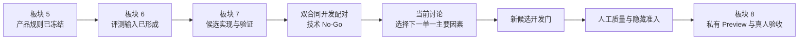

# GI-088｜板块 7 下一会话讨论交接

最后更新：`2026-08-13`

状态：`生效中｜官方 Pro 双合同开发配对技术 No-Go 已封存，等待下一单一主要因素决策`

适用对象：`产品负责人、下一会话 Codex、后续板块 7 实施协作者`

工作分支：`codex/gi088-v8r3r3-adaptive-recovery-30-60`

运行时冻结提交：`71a6e0a7544a4d66770f6d8c330410a0a6940d6f`

隔离工作树：`/private/tmp/gi088-v8r3-existing-20260811`

## 1. 新会话先记住这一句话

板块 7 仍在解决“怎样让【陪我聊】稳定、及时地产生有价值回应”。最新双合同开发配对证明状态投影程序可靠，同时暴露模型语义合规和等待时间仍未达门；下一会话先完成失败归因，再只选择一个主要因素建立新候选。

## 2. 当前处在哪一步



- 板块 5：`GI-075～080` 六类规则已冻结。
- 板块 6：Golden `32＋8`、开发集、隐藏准入和人工判尺已经形成；Judge `20＋20` 保持后置。
- 板块 7：最新双合同开发配对触发技术 No-Go，当前没有架构胜出组。
- 板块 8：暂停，等待新的板块 7 候选通过完整准入。
- Production：继续使用 `legacy + baseline`。

## 3. 已冻结的产品目标

以下内容直接继承，下一会话不重新讨论：

1. 每次新记录由用户选择【帮我记】或【陪我聊】，记录内保持该模式。
2. 【陪我聊】围绕共同任务推进，问题需要有用户来源、认识增量和可承受的回答负担。
3. 用户明确纠正后更新有效事实；被否定内容退出当前认识与日志。
4. 用户明确停止当前访谈时才暂停；问题价值不足时可以总结或承接，并保持访谈开放。
5. 程序负责能够唯一确定的来源绑定与校验，以及安全、计数、幂等、恢复、状态提交和回放；模型负责需要理解语言含义的来源选择、语义判断与用户可见回应。
6. 隐藏推理、密钥、请求正文和上游请求 ID 原值不进入 Public Session、公开报告或持久化证据。

## 4. 证据链怎样走到当前 No-Go

### 4.1 v8r3r2：内容能用，等待体验未达线

- EMPTY_CONTENT 恢复样本 `10/10` 被产品负责人判为可直接用。
- 私有 Preview 的 4 条【陪我聊】与 2 条【帮我记】内容和兼容性通过。
- 最终可见回复 `22/22`。
- 等待 P90 `64.7s`、最长 `70.1s`，超过发布目标。

证据入口：[v8r3r2 双恢复与历史 Preview](../../artifacts/generative-interview-board7/2026-08-12-gi088-v8r3r2-empty-content-recovery-2/README.md)

### 4.2 v8r3r3：恢复调度无法挽救模型稳定性

- 正式运行最终可见 `50/96`，最终保护 `46`。
- 工程与原子赢家机制通过，运行可靠性门 No-Go。

证据入口：[v8r3r3 自适应恢复 No-Go](../../artifacts/generative-interview-board7/2026-08-12-gi088-v8r3r3-adaptive-recovery-30-60/README.md)

### 4.3 运行链根因对照：官方 Pro 成为质量可用方向

- Ark Flash＋完整合同：`9/24`。
- Ark Flash＋精简诊断合同：`18/24`，空内容从 `9` 降为 `0`。
- 官方 Flash＋完整合同：`10/24`。
- 官方 Pro＋完整合同：`20/24`，空内容 `0`。
- 官方 Pro 固定八条人工裁决：`7` 条可直接用、`1` 条轻微问题、`0` 质量失败。

这组证据支持两个判断：模型档位稳定性是当前主要影响因素；模型承担完整状态账本会进一步放大失败和等待。

证据入口：[模型运行链与输出合同根因对照](../../artifacts/generative-interview-board7/2026-08-12-gi088-runtime-contract-root-cause-diagnostic-v1/README.md)

### 4.4 最新双合同配对：两条可运行链路都未过开发门

两组固定使用官方 DeepSeek Pro、Thinking high、同一 Interview Skill、公开开发集、输入语境、`json_object` 和 `60s` 配置：

| 组别 | 技术有效 | P50 | P90 | 最长 | 结论 |
|---|---:|---:|---:|---:|---|
| 完整合同 | `53/64` | `35.042s` | `50.215s` | `60.003s` | 技术 No-Go |
| 可执行精简合同＋状态投影 | `38/64` | `32.085s` | `54.127s` | `60.003s` | 技术 No-Go |

冻结门要求技术有效至少 `55/64`，P50 `≤20s`、P90 `≤40s`、单次 `≤60s`。两组同时失败后，流程按规则停止：

- 实际 Provider 调用：`126/128`；
- 恢复、重试、Judge：`0`；
- 人工配对裁决源：`0`；
- 隐藏集读取和隐藏调用：`0`；
- Preview 和 Production 变更：`0`。

证据入口：[官方 Pro 双合同配对技术 No-Go](../../artifacts/generative-interview-board7/2026-08-12-gi088-pro-contract-projection-paired-v1/README.md)

## 5. 本轮已经证明什么

### 5.1 可以继续复用的事实

- 任务归属状态 v2 的程序投影链稳定：投影歧义、状态不变量失败、重复提交和状态污染均为 `0`。
- 轨迹第一轮失败会阻断同组第二轮，并停止追加调用；状态继承和预算边界有效。
- 官方 Pro 的内容质量方向继续有效；其等待时间仍是明确风险。
- 完整合同距离技术有效门只差 `2` 份结果，仍有继续诊断价值。

### 5.2 当前证据保持开放的结论

- 完整合同与精简合同的产品质量没有完成对比，因为技术门前已停止。
- 精简架构的职责边界仍可继续设计；当前精简合同本身未达到可用线。
- 官方 Pro 的等待问题需要单独处理；当前证据无法证明合同调整足以达到 `20s / 40s / 60s`。
- 板块 7 尚未获得关闭条件，板块 8 尚未获得新候选。

## 6. 失败分布与第一性归因入口

完整组 `11` 次失败：

- `ACTION_NOT_ALLOWED`：`4`；
- `ASK_VISIBLE_UNDERSTANDING_REQUIRED`：`3`；
- `SYNTHESIZE_UNDERSTANDING_DELTA_REQUIRED`：`2`；
- `TIMEOUT`：`1`；
- `EMPTY_CONTENT`：`1`。

精简组 `26` 次失败：

- `REQUIRED_EVIDENCE_MISSING`：`15`；
- `ACTION_NOT_ALLOWED`：`5`；
- `TIMEOUT`：`4`；
- `BLOCKED_BY_PRIOR_FAILURE`：`2`。

其中两条 `BLOCKED_BY_PRIOR_FAILURE` 来自精简组轨迹第一 checkpoint 的来源引用缺失，第二 checkpoint 按协议未调用 Provider。五份 Token usage 缺失全部对应 `60.003s` 硬截止，实际计费 Token 保持未知。

## 7. 下一会话先讨论什么

### 第一步：零模型复核 37 个失败结果

先读取公开开发集和 `0600` 私有报告，对每次失败回答四个问题：

1. 模型理解错了用户当前共同任务，还是输出格式未满足合同？
2. `ACTION_NOT_ALLOWED` 对应真实产品质量问题，还是评测允许动作过窄？
3. `REQUIRED_EVIDENCE_MISSING` 中哪些来源可由程序唯一确定，哪些确实需要模型选择？
4. 完整组的“理解回应／认识变化必填”是否符合当前产品规则，还是合同把表达形式变成了技术硬门？

这一步只做归因，不修改 Prompt、Skill、合同、数据集或 Gate，也不调用模型。

私有报告位置：

`artifacts/local-runtime/generative-interview-board7/2026-08-12-gi088-pro-contract-projection-ab/development-private-report.json`

私有报告 SHA-256：

`99348b9a7e5402bb0e960db5d79d3e4ae5ab3bc19bda94e5e6c2e4ce9624597d`

### 第二步：只选择一个主要因素

以下均为讨论候选，尚未冻结：

| 讨论候选 | 解决的问题 | 核心风险 |
|---|---|---|
| 来源责任重新划分 | 程序自动附加能够唯一确定的当前用户消息来源；模型只选择修订、返回等真正需要语义判断的目标引用 | 自动附加范围过宽会把模型判断错误包装成合法状态 |
| 动作与价值门对齐 | 复核 `ask / synthesize / acknowledge` 的允许范围，让低问题价值时的总结与承接得到一致判尺 | 放宽过度会隐藏真实的任务漂移或停止错误 |
| Pro 等待优化 | 保持产品与合同不变，只调整一个运行因素验证速度与质量取舍 | 速度提升可能伴随语义质量或结构可靠性下降 |

当前推荐先讨论“来源责任重新划分”。原因是精简组 `15` 次来源引用缺失是最大单因，程序投影链本身保持稳定，而且这项问题直接对应已经确认的第一性职责边界：程序接管可以唯一计算的机械工作，模型保留真正需要语义选择的引用。

推荐只在 37 个失败逐项复核完成后冻结该方向，避免把真实语义遗漏误归为机械字段负担。

## 8. 新候选形成前的固定边界

- 新模型调用需要新的版本、计划、预算和停止点。
- 人工配对裁决只在开发技术门通过后开放。
- 隐藏集只对开发胜出组开放；本轮隐藏集保持未读取。
- Judge `20＋20` 继续后置。
- 新 Preview、新 `0/6` 和板块 8 真人内容继续暂停。
- Production 保持 `legacy + baseline`。
- 真人内容由产品负责人提交。
- 隐藏推理继续不持久化。
- 约 `200` 轮以上容量优化继续排除。

## 9. 工程起点

当前分支和运行时冻结提交：

- 分支：`codex/gi088-v8r3r3-adaptive-recovery-30-60`
- 提交：`71a6e0a7544a4d66770f6d8c330410a0a6940d6f`

关键实现：

- 任务归属状态 v2：`src/server/services/evaluation/gi088/canonical-interview-state-v2.ts`
- 配对合同：`evals/event-centered-generative/gi088-pro-contract-projection-ab/contracts.ts`
- 完整／精简状态适配：`evals/event-centered-generative/gi088-pro-contract-projection-ab/state-adapter.ts`
- 配对执行器：`evals/event-centered-generative/gi088-pro-contract-projection-ab/runner.ts`
- 执行入口：`scripts/run-gi088-pro-contract-projection-ab.ts`
- 零模型专项：`tests/evals/gi088-pro-contract-projection-ab.test.ts`
- 状态矩阵：`tests/unit/gi088-canonical-interview-state-v2.test.ts`

运行时五层指纹在诊断前后保持不变：

- Candidate：`d997e0d99a9d4c138049b2812f6e6667fe825fef3426421482f95ba0223eba6b`
- Dataset：`258a4b47ec4eb36393bcf37191fe5088ce699fc0abec5a6d7ccbc8e4b8f5a027`
- Runner：`5cc5c713e632a2fc2257a233fa26f6ec77040ecf838c30b639994ea83298d02f`
- Experience：`badebe8dfb3116a4784533eb09fa41d29832a27ddbb4757db2f5884db6f160af`
- Execution：`b0e5d613d323987950f31a3c7a5d77cfedfae244a8ccb842369d8553483fc21f`

## 10. 新会话阅读顺序

1. [AGENTS.md](../../AGENTS.md)
2. [访谈产品优化地图](../interview-product-optimization-map.md)
3. [生成式访谈重构总 Map](../generative-interview-refactor-map.md)
4. [生成式访谈 AI 产品工作方法 v1.0](../technical/interview-event-centered/00-generative-interview-ai-product-working-method.md)
5. [本文](./2026-08-13-gi088-board7-next-session-handoff.md)
6. [板块 7 当前专项](../technical/interview-event-centered/07-board7-model-led-semantic-implementation.md)
7. [双合同配对技术 No-Go](../../artifacts/generative-interview-board7/2026-08-12-gi088-pro-contract-projection-paired-v1/README.md)
8. [机器可读公开摘要](../../artifacts/generative-interview-board7/2026-08-12-gi088-pro-contract-projection-paired-v1/gi088-pro-contract-projection-paired-summary.json)
9. 需要逐项归因时，再读取本机 `0600` 私有报告。

## 11. 可直接复制到新会话的开场提示

```text
请先读取并严格遵循：
1. AGENTS.md
2. docs/interview-product-optimization-map.md
3. docs/generative-interview-refactor-map.md
4. docs/technical/interview-event-centered/00-generative-interview-ai-product-working-method.md
5. docs/plans/2026-08-13-gi088-board7-next-session-handoff.md
6. docs/technical/interview-event-centered/07-board7-model-led-semantic-implementation.md
7. artifacts/generative-interview-board7/2026-08-12-gi088-pro-contract-projection-paired-v1/README.md

当前任务是继续讨论 GI-088 板块 7。先用产品语言复述：当前双合同技术 No-Go 说明了什么、还不能说明什么、板块 7 距离交接板块 8 还差什么。然后只讨论一个问题：37 个失败应怎样归因，以及下一候选应选择哪一个主要因素。

先进行只读分析，不修改代码、不调用模型、不读取隐藏集、不运行 Judge、不部署 Preview、不改变 Production。把已冻结事实、产品判断、Codex 建议和待验证假设分开表达。Production 继续保持 legacy + baseline。
```

## 12. 本交接的停止点

下一会话完成以下输出后暂停，由产品负责人决定是否写实施计划：

1. 37 个失败的产品化根因分类；
2. 当前合同与程序责任边界的复核；
3. 一个主要因素的推荐方案、预期收益、风险和最小样本设计；
4. 明确哪些旧证据可以复用，哪些必须重新运行；
5. 新模型调用、隐藏准入、Preview 和 Production 的继续边界。
