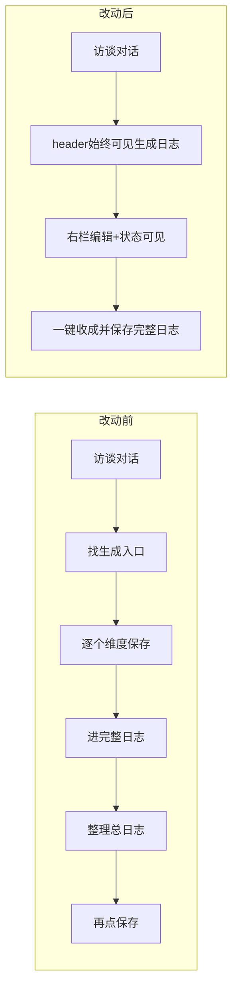

# 访谈 → 单维日志 → 完整日志 · 改动前后对比

> 进度条相关改动**未纳入**本预览（你单独处理）。  
> **HTML 交互版**：`docs/plans/ux-flow-before-after-preview.html`（需 Agent 模式落盘后用浏览器打开）

---

## 总览：用户走完一条链路的体感变化

---

## 1. 顶部工具栏

| | 改动前 | 改动后 |
|---|--------|--------|
| 布局 | 五维+进度+生成+完整+评分 挤一行，`overflow-x-auto` 横滑 | 允许换行；**生成日志 / 完整日志** 固定首屏优先级 |
| 用户痛点 | 窄屏横滑才看到「生成日志」 | 关键 CTA 永远可见 |
| 对应 WS | — | WS-G |

---

## 2. 「生成日志」入口与文案

| | 改动前 | 改动后 |
|---|--------|--------|
| 顶部 | 「生成日志」 | 「生成日志」（分岔时出现 choice 卡时 header 仍隐藏，行为不变） |
| 分岔卡 | 「现在整理日志」「先整理当前日志」 | 统一「**生成日志**」 |
| 口语 | 输入「整理成日志」也能触发 | 保留，但对外文案统一 |
| 对应 WS | — | WS-D |

---

## 3. 确认弹窗

| | 改动前 | 改动后 |
|---|--------|--------|
| 样式 | 系统灰框 `window.confirm` | 暖色自绘 `ConfirmDialog`（与保存确认卡同系） |
| 场景 | 覆盖生成、保存完整日志、离开访谈、清除对话 | 同上，全部替换 |
| 保存日志 | 只说「会结束访谈」 | 补充：保存后仍可改日志；想再聊需新开 |
| 对应 WS | — | WS-B |

---

## 4. 单维日志：保存 / 暂存 / 草稿

| | 改动前 | 改动后 |
|---|--------|--------|
| 已保存后编辑 | 静默变 `draft`，界面无提示 | 状态条：**未保存的修改** / **已暂存** |
| 暂存成功 | 几乎无反馈 | 显示「已暂存」；关面板时 toast「已帮你暂存」 |
| 关面板 | 静默 `persistDraftEdits` | 成功有反馈；失败面板不关闭并说明 |
| 对应 WS | — | WS-F |

---

## 5. 窄屏日志面板（&lt;1280px）

| | 改动前 | 改动后 |
|---|--------|--------|
| 布局 | 对话+右栏日志挤同一固定高度 grid | 对话区**全高**；日志改**底部抽屉/浮层** |
| 体感 | 边聊边改几乎不可用 | 窄屏优先保证访谈可读可写 |
| 对应 WS | — | WS-E |

---

## 6. 完整日志工作区

| | 改动前 | 改动后 |
|---|--------|--------|
| 名称 | 总日志 / 汇总日志 / 完整日志 混用 | 全站用户可见处统一 **完整日志** |
| 来源 | 灰色「未保存」，易被忽略 | 「有草稿，未保存」「已保存」口语化 |
| stale | 「来源已更新」 | 「今天的维度日志有更新，建议重新整理完整日志」 |
| 对应 WS | — | WS-A, WS-K(#24) |

---

## 7. 一键「收成并保存完整日志」（Level A）

| | 改动前 | 改动后 |
|---|--------|--------|
| 流程 | ①各维度手动保存 → ②点完整日志 → ③整理 → ④保存（4步） | **一个主按钮**：自动落库有草稿维度 → 生成 → 保存完整日志 |
| 草稿维度 | 未保存的被汇总**静默跳过** | 自动 `saveGeneratedJoyEntry` 纳入汇总 |
| 进行中无草稿 | 无说明 | **明确列出跳过**（如：充实·访谈进行中） |
| 次级操作 | — | 「重新整理」「导出」降为次级 |
| 对应 WS | — | WS-C |

---

## 8. 对话区细节

| | 改动前 | 改动后 |
|---|--------|--------|
| 流式中 | 发送键灰掉显示「生成中」，不可中断 | 可点「**停止**」；提示条说明原因 |
| 气泡 | 思考中 + 思路 + 问题 最多三气泡 | 思路收敛为一行轻提示 + 正式问题 |
| 输入禁用 | 无说明（分岔卡/忙碌时） | 提示「请先选择上方选项」等 |
| 重复日期 | 正文区再显示一行日期 | header 有日期时去冗余 |
| 对应 WS | — | WS-H, WS-I, WS-J, WS-K |

---

## 如何查看 HTML 交互版

1. 在对话里说「切到 Agent 落盘 HTML 预览」
2. 终端执行：`open docs/plans/ux-flow-before-after-preview.html`
3. HTML 内含 8 个章节，每章左右（或上下）并排 **改动前 / 改动后** 迷你 UI 示意
