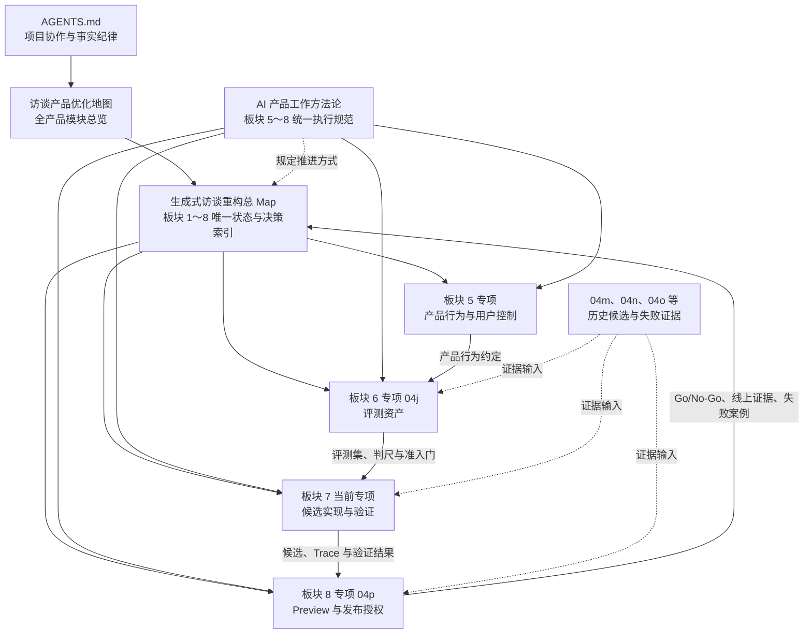

# 生成式访谈 AI 产品工作方法 v1.0

最后更新：`2026-08-06`

方法状态：`v1.0 已冻结`；产品负责人已在板块 5 后续讨论开始前独立确认

确认日期：`2026-08-06`

适用范围：`生成式访谈板块 5～8 的产品讨论、评测、实现方案与 Preview`

当前验证状态：`板块 4 回溯检查、板块 6～8 纸面交接演练、板块 5 首题真实试运行均已完成；试运行问题已纳入 v1.0`

v1.0 冻结条件：`已满足`

上游与当前产品状态：`GI-067 / GI-068～074 已冻结·高置信度；GI-075～080 已冻结；落地验证均未启动`

当前推进位置：`板块 5 六类产品规则完成 6/6；下一板块为板块 6 正式评测资产建设`

Production：`继续保持 legacy + baseline`

本次同步范围：`只更新产品文档；公共 API、类型、代码、配置、Prompt、数据库和运行开关保持原样`

总状态导航：[生成式访谈重构总 Map](../../generative-interview-refactor-map.md)

上一板块专项：[板块 5｜稳定性、用户控制与交互收束](./05-board5-stability-user-control-and-interaction-scope.md)

当前板块专项：[板块 6｜生成式访谈质量评测 v1](./04j-generative-quality-evaluation-v1.md)

评测决策档案：[04x-07｜GI-074 生成式访谈评测体系与下游交接协议](./04x-07-evaluation-preview-and-handoff.md)

> 本文规定板块 5～8 怎样读取事实、讨论产品、形成证据并完成交接。它不新增或重开 GI-068～074 的产品结论，也不授权生产代码、生产配置、Prompt、API、数据库、模型调用或运行开关变更。

## 0. 关键概念与首次定义

下表在方法正文使用相关概念前先固定含义，防止把讨论方案写成既有机制。

| 概念 | 定义 | 来源与适用范围 | 触发条件 | 使用者与实际作用 | 当前状态 |
|---|---|---|---|---|---|
| 产品行为约定 | 对一个产品问题形成的结构化结论，包含用户目标、模型可以自主判断的范围、需要程序稳定执行的限制、用户控制、允许变化及一例即可阻断的条件 | 本方法定义；用于板块 5 的每类开放问题及其下游交接 | 一个产品问题准备确认或交给下游时 | 产品负责人和 AI 讨论伙伴共同形成；供板块 6 资产化、板块 7 实现、板块 8 验收 | `方法字段·待各议题填写` |
| 完整有效语境 | 冻结档案中的“完整有效对话／上下文”在本方法内的统一称呼。产品级事实范围由当前记录内的全部用户原话、最新纠正、已形成认识、当前焦点与未解部分、明确用户控制，以及可追溯的来源和产品状态组成。“有效”表示来源与当前状态可用，不能按表达长短或主观价值删去用户材料 | 继承 GI-069～073；用于当前记录内的开放语义判断 | 模型执行当前记录内的语义判断时 | 模型据此判断下一步；板块 7 决定实际上下文窗口、压缩和注入方式，运行记录保存实际输入 | `产品语义已冻结·具体实现待板块 7` |
| 模型主导语义判断 | 模型依据完整有效语境，判断用户焦点、认识增量、下一步价值、回答负担和自然表达 | 继承 GI-069～073；适用于开放语义判断 | 当前轮需要理解用户含义并选择承接、提问、整合、暂停或纠正后的下一步时 | 模型执行；产品通过目标、底线、上下文与正反例约束 | `已冻结上游方向` |
| 模型规则约束 | 对模型语义判断规定用户目标、信息来源、优先级、允许变化和风险底线，同时保留模型结合完整语境选择具体动作与表达的空间 | 本方法定义；用于板块 5 六类开放问题，后续由板块 7 转化为 Prompt／Interview Skill | 当前问题依赖开放语义判断，并且需要形成跨场景稳定要求时 | 产品负责人冻结，模型执行，板块 6 与真人 Preview 验证；采用跨场景原则和代表案例表达 | `方法字段·具体内容待板块 5 逐项确认` |
| 程序硬边界 | 能由客观产品状态、显式用户动作或可验证结构确定，并需要稳定执行的限制 | 本方法归纳；用于模式、次数、来源、安全执行、事件隔离、用户控制与恢复 | 触发条件来自明确动作、计数、版本、状态或来源，并且结果需要稳定复现时 | 板块 7 转化为确定性实现；板块 6 验证执行结果 | `分类原则·具体规则待各板块冻结` |
| 选项卡 | 产品讨论中的结构化提问界面，提供 `2～3` 个互斥选择和自由输入框；每个选项说明用户价值、取舍、风险或 MVP 影响 | 继承本项目 Plan 模式协作要求；用于高影响产品选择 | 选择会改变用户价值、体验目标、MVP 边界或下游方向，并且现有证据无法给出唯一答案时 | AI 讨论伙伴提出，产品负责人选择或自由输入；帮助明确偏好和取舍 | `强制讨论方式` |
| 代表案例 | 用来检验规则能否覆盖目标场景的正常案例、反例、边界案例和材料有限案例 | 继承 GI-074；用于板块 5～8 | 产品行为约定进入证据设计或下游评测交接时 | 产品讨论用于检验结论，板块 6 转化为评测资产 | `固定输出` |
| 候选 | 在冻结产品行为与评测门下形成、具备版本血缘并等待验证的实现组合 | 继承 GI-074；用于板块 7～8 | 板块 5 行为与板块 6 评测输入齐备，板块 7 提交实现组合验证时 | 板块 7 交付，板块 8 验收；验证完成前保持候选身份 | `定义已明确·当前新候选待板块 7` |
| Judge | 按已校准评分卡评价开放语义质量的评测模型；输出分项分数、证据、原因和不确定项 | 继承 GI-074；用于板块 6～8 的候选质量评测 | 候选产生可评结果，并进入开发评测、独立准入或 Preview 前复核时 | 板块 6 定义并用真人案例校准，板块 7 运行；结果为产品负责人提供证据 | `职责已冻结·评分资产待板块 6` |
| 硬失败 | 一例即可阻断候选继续推进的问题，范围以 GI-074 和后续冻结判尺为准 | 继承 GI-074；用于评测、实现与 Preview | 候选结果命中已经冻结的单例阻断条件时 | 自动检查、Judge 和真人评审共同识别；产品负责人裁决发布 | `已冻结上游框架·具体资产待板块 6` |
| Trace | 可追溯的运行记录，用来说明候选看到了什么事实、采用了什么版本、作出了什么动作并产生了什么结果 | 继承 GI-024、GI-071、GI-074；用于板块 7～8 | 候选发生生成、程序处理、恢复或评测时 | 板块 7 实现，板块 6 定义所需证据，板块 8 用于失败归因 | `产品要求已冻结·实现待板块 7` |
| 产品负责人 | 对产品结论冻结、真人体验和生产发布拥有最终确认权的项目角色 | 继承本项目决策机制；用于板块 5～8 | 产品结论、评测争议、Go/No-Go 或生产发布需要最终决定时 | 确认产品结论、评测争议、Go/No-Go 与生产授权 | `现行职责` |

新概念首次出现时，必须说明定义、来源、适用范围、使用者、触发条件、实际作用和当前状态。缺少这些信息时，继续使用已经确认的具体事实描述。

## 1. 为什么需要这套方法

生成式访谈依赖模型理解连续语境，并根据用户当前重点决定承接、提问、整合或暂停。用户表达具有开放性，同一产品目标允许多种合格回应。产品仍需稳定守住模式、来源、用户控制、安全、恢复和发布边界。

因此，后续工作需要同时满足三项要求：

1. **保留模型的语义判断空间**：产品规定目标、底线、上下文和代表案例，模型根据完整有效语境选择下一步。
2. **把稳定边界交给确定性执行**：程序承接可以客观识别和验证的状态、次数、来源、隔离、控制与恢复要求。
3. **用证据完成产品闭环**：每项规则从用户任务出发，经过案例与评测验证，再由真人 Preview 裁决发布资格。

这套方法用于防止两类偏差：

- 把开放语义问题不断拆成逐场景规则，使模型只能执行僵硬路线；
- 只凭单次体验或表达顺畅度判断质量，遗漏事实、状态、用户控制和长期稳定性。

## 2. 文档关系与职责

生成式访谈继续由总 Map 管理唯一状态。本文负责统一工作方式，各板块专项负责保存产品结论、评测资产、候选证据和裁决结果。



### 2.1 状态源与阅读顺序

板块 5～8 的新会话按以下顺序读取：

1. `AGENTS.md`：确认项目事实纪律、表达要求、变更权限和 Production 边界。
2. [访谈产品优化地图](../../interview-product-optimization-map.md)：确认全产品模块关系和当前讨论位置。
3. [生成式访谈重构总 Map](../../generative-interview-refactor-map.md)：确认当前板块、冻结事实、依赖、历史证据和下一步。
4. 本文：确认统一工作方式、输入、输出和退出门。
5. 当前板块专项：读取当前有效产品规则、开放问题和交接状态。
6. 当前问题直接依赖的上游冻结档案：只读取与本题有关的完整文档，保持已冻结结论关闭。

板块 5 开始“阶段 1～2 问题计数”前，还需完整读取：

- [04x-02｜【陪我聊】阶段 1——承接与定位](./04x-02-accompany-me-chat-stage1-engage-and-focus.md)
- [04x-03｜【陪我聊】阶段 2——探索与澄清](./04x-03-accompany-me-chat-stage2-explore-and-clarify.md)
- [04x-04｜【陪我聊】阶段 3——动态深化与整合](./04x-04-accompany-me-chat-stage3-deepen-and-integrate.md)

## 3. 两层执行框架

### 3.1 第一层：板块内产品决策

每个板块统一完成六步。六步规定讨论顺序和交付物，不预设具体产品答案。

| 步骤 | 为什么需要 | 必做动作 | 本步输出 | 进入下一步的条件 |
|---|---|---|---|---|
| 1. 读取事实 | 防止重开冻结结论或引用失效候选 | 按第 2.1 节阅读；区分当前事实、待讨论、待校准和历史证据；核对 Production | 事实清单、冲突清单、证据缺口 | 当前问题与事实来源一致，冲突已列明 |
| 2. 定义问题 | 同一交互问题可能服务不同用户目标 | 说明用户、场景、目标、成功结果、失败影响、MVP 范围和排除范围 | 一句话问题定义和成功标准 | 产品负责人能够判断该问题是否值得解决 |
| 3. 分配职责 | 语义判断与确定性执行需要采用不同验证方式 | 明确模型、程序、用户控制、评测、真人和产品负责人的职责 | 职责分工表 | 每项行为有唯一主责，交接关系清楚 |
| 4. 形成产品行为约定 | 下游需要稳定理解“允许什么、必须守住什么” | 冻结模型自主范围、程序硬边界、用户控制、允许变化和硬失败 | 产品行为约定 | 不依赖逐场景枚举也能解释代表案例 |
| 5. 设计证据 | 开放语义质量需要通过案例和评测证明 | 建立正常、反例、边界、材料有限案例；确定评测单位、判尺、Trace 和待验证假设 | 代表案例与评测交接 | 板块 6 能直接转化为评测任务 |
| 6. 决策与交接 | 产品结论需要可追溯并约束下游 | 补齐决策记录、影响板块、未决问题、退出条件和下一建议板块 | 决策档案与下游交接 | 达到第 9 节退出门，并由产品负责人确认 |

板块内讨论始终从用户价值、使用场景、体验目标、风险和 MVP 边界出发。实现字段、Prompt 结构、调用方式和数据结构只在当前板块需要验证可行性时作为事实输入；板块 5 的六类规则均在产品定义层完成冻结。

### 3.2 第二层：跨板块证据闭环

```text
板块 5 产品行为约定
→ 板块 6 评测资产与准入门
→ 板块 7 可验证候选
→ 板块 8 真人 Preview 与发布裁决
→ 线上证据和失败案例回流总 Map
```

| 板块 | 正式输入 | 核心工作 | 正式输出 | 下一层不得自行决定的事项 |
|---|---|---|---|---|
| 5｜产品行为与用户控制 | GI-068～074、六类开放问题、真实失败证据、Production 边界 | 冻结模型约束、稳定边界、用户路径和恢复口径 | 产品行为约定、代表案例、硬失败、评测与实现交接 | Prompt、字段、调用编排和具体界面实现 |
| 6｜评测资产 | GI-074、板块 5 冻结行为、历史 No-Go 和真实任务分布 | 建立评测集、判尺、Judge 说明、校准方法、运行模板和准入门 | 可执行评测资产、所需 Trace、正式报告格式 | 改写产品标准或替候选选择实现方案 |
| 7｜候选实现与验证 | 板块 5 行为约定、板块 6 评测资产、当前工程事实和兼容约束 | 设计 Prompt / Interview Skill、上下文、状态、Trace、保护和恢复；完成离线验证 | 版本化候选、候选血缘、验证报告、已知风险和回退方案 | 降低评测门、覆盖真人裁决或切换 Production |
| 8｜Preview 与发布授权 | 板块 6 准入结果、板块 7 候选和 Trace、GI-074 的 `4＋2` | 真人完成价值、被理解感、负担、风险和链路验收 | Go/No-Go、问题清单、上线或回退授权、线上观察要求 | 用自动通过替代真人体验，或在缺少产品负责人授权时切换 Production |

任何线上失败案例先回到总 Map 定位受影响的产品规则、评测资产或候选实现，再进入相应板块复核。单个失败案例保留原始版本血缘和裁决，避免直接升级为跨场景规则。

## 4. 板块工作合同

### 4.1 固定输入

每个板块会话开始前必须具备：

1. 当前板块及此时讨论它的原因。
2. 目标用户、目标场景、用户任务和成功结果。
3. 上游冻结结论、决策编号、状态与置信度。
4. 当前开放问题、重新打开问题、待校准项和证据缺口。
5. 脱敏真实案例、历史失败案例和当前实现事实。
6. 前置依赖、排除范围、MVP 范围和 Production 边界。
7. 下游板块需要获得的具体交付物。

缺少可从仓库获取的事实时，先完成只读检查。需要产品偏好、价值取舍或范围选择时，进入第 7 节的 grill-me 讨论。

### 4.2 固定输出

每个板块退出前必须形成：

1. **产品行为约定**：用户目标、模型自主范围、程序硬边界、用户控制、允许变化和硬失败。
2. **职责分工表**：模型、程序、评测、真人和产品负责人的责任与交接关系。
3. **决策记录**：决策编号、状态与置信度、最终结论、选择原因、适用范围、依据与案例、影响板块、专项文档和确认日期。
4. **代表案例**：正常案例、反例、边界案例和材料有限案例。
5. **评测交接**：评测单位、判尺、阻断项、待验证假设和所需 Trace。
6. **下游交接**：实现输入、未决问题、依赖变化、当前板块状态和下一建议板块。
7. **状态同步**：当前板块的产品决策状态、落地验证状态、受影响下游是否需要复核，以及总 Map 的当前板块和下一建议板块。

### 4.3 产品行为约定模板

```markdown
## [议题名称] 产品行为约定

- 用户与场景：
- 用户目标：
- 成功结果：
- 失败影响：
- MVP 适用范围：
- 当前排除范围：
- 涉及计数或状态时的可观察单位／结果：
- 涉及计数或状态时的作用域与稳定身份：
- 涉及计数或状态时的提交点：
- 涉及计数或状态时的保留、重置与复用关系：
- 跨阶段、跨状态或连续交互的累计影响：
- 模型自主判断：
- 程序稳定执行：
- 用户可见控制：
- 允许变化：
- 硬失败：
- 代表案例：
- 待验证假设：
- 下游评测输入：
- 下游实现输入：
```

### 4.4 决策记录模板

```markdown
- 决策编号：`GI-xxx｜名称`
- 状态与置信度：`待讨论 / 讨论中 / 待确认 / 已冻结 / 重新打开 / 已撤回；高 / 中 / 待重证`
- 落地验证状态：`未启动 / 方案中 / 实现中 / 待验证 / 已验证 / 已发布`
- 最终结论：
- 选择原因：
- 适用范围：
- 依据与案例：
- 影响板块：
- 受影响下游复核：`需要 / 无需`，原因：
- 专项文档：
- 确认日期：`YYYY-MM-DD`
```

讨论中的方案使用“候选”或“待验证假设”标识。产品负责人明确说“确认”“冻结”或“把结论写回 Map”后，才把结论更新为已冻结并同步状态源。

### 4.5 评测交接模板

```markdown
## 评测交接

- 需要验证的产品行为：
- 评测单位：`决策点 / 对话片段 / 完整记录`
- 正常案例：
- 反例：
- 边界案例：
- 材料有限案例：
- 硬失败：
- 人工判尺：
- 自动检查范围：
- Judge 任务：
- 所需 Trace：
- 当前待验证假设：
- 通过后进入：
- 失败后回到：
```

### 4.6 会话交接模板

```markdown
- 已确认结论：
- 仍未决的问题：
- 已更新文档：
- 当前板块产品决策状态：
- 当前板块落地验证状态：
- 受影响下游及复核要求：
- Production 状态：`legacy + baseline`
- 下一会话建议板块与原因：
```

## 5. 职责分工

| 责任主体 | 主要职责 | 必须接收的输入 | 必须交付的输出 | 决策权限与边界 |
|---|---|---|---|---|
| 产品负责人 | 定义用户价值、产品边界、评测标准；确认冻结、Go/No-Go 和生产发布 | 用户目标、方案取舍、代表案例、评测与 Preview 证据 | 产品结论、最终裁决和明确授权 | 拥有最终产品与发布确认权 |
| 模型 | 基于完整有效语境判断焦点、认识增量、下一步价值、回答负担和自然表达 | 当前记录内的用户原话、最新纠正、已形成认识、当前焦点与未解部分、用户控制、来源状态、产品目标、底线和代表案例 | 符合协议的理解、动作和用户可见回应 | 在产品行为约定内自主判断；不得改变确定性边界 |
| 程序 | 稳定执行模式保持、问题计数、单轮一问、来源、安全动作、事件隔离、用户控制和失败恢复 | 冻结产品边界、模型结果、显式用户动作和可信状态 | 一致状态、幂等执行、可恢复路径和 Trace | 执行客观边界；不得用固定语义路线替代模型判断 |
| 自动检查 | 验证结构、次数、来源、模式、状态、版本、幂等和其他可确定结果 | 板块 6 的客观判尺和板块 7 运行结果 | 逐项通过／失败与定位证据 | 只裁决可确定项，不承担开放语义体验判断 |
| Judge | 按校准判尺评价焦点、认识、问题价值、负担、自然度等开放语义质量 | 冻结评分卡、正反例、候选输出和必要上下文 | 分项评分、理由和不确定项 | 结果必须经过真人校准，不承担最终发布授权 |
| 真人 Preview | 裁决真实价值、被理解感、回答负担、风险和完整链路 | 通过离线门的候选、真实任务、风险脚本和恢复路径 | `4＋2` 逐轨迹结果、问题清单和体验裁决 | 真人体验结果可以阻断发布；不能改写冻结产品规则 |

安全职责采用共同约束：产品负责人冻结风险边界，模型识别语境中的风险信号，程序保证规定动作被执行，评测与 Preview 验证结果。具体信号、动作和升级范围留给对应专项冻结。

## 6. 候选规则分流

### 6.1 四类去向

每条候选规则先回答“它依赖开放语义判断，还是依赖可确定事实”，再归入以下一种去向：

| 类型 | 判断条件 | 正式去向 | 验证方式 | 当前项目例子 |
|---|---|---|---|---|
| 跨场景原则 | 能解释多个表达和场景；需要结合语境理解；直接服务用户目标 | 产品行为约定，后续进入 Prompt / Interview Skill | 正反例、对话片段、Judge 和真人 Preview | GI-069 的用户工作焦点拥有主线推进权 |
| 可确定执行的客观边界 | 触发条件来自显式动作、计数、版本、状态或来源；结果可以稳定复现 | 程序保护与自动检查 | 单元检查、状态组合、恢复和端到端回归 | GI-068 的当前记录保持所选模式，结束后由新记录入口重新选择 |
| 长尾表达或单个案例 | 只证明一种说法或一次失败，尚未证明跨场景规律 | 板块 6 评测集或历史证据库 | 同类变体、反事实、回归与真实分布复核 | 历史真人 No-Go 中的具体提问失败，保留原语境与候选血缘 |
| 证据不足的判断 | 可能影响设计，当前缺少真实案例、稳定复现或清晰因果 | 待验证假设 | 定向案例、A/B、Trace 或真人访谈 | GI-075 中“两个阶段各自合规时，极端合计四问的真实负担仍可接受” |

表中例子只说明分类方式，不新增产品结论。GI-068～080 继续保持关闭；板块 6 当前把已冻结行为转化为正式评测资产。

### 6.2 防止逐场景规则表的检查

一条候选规则进入产品协议或程序保护前，依次检查：

1. 它解决的用户问题和失败影响能否清楚说明。
2. 它能否覆盖多个表达相近、表面场景不同的案例。
3. 触发条件是否可以由客观状态或显式动作稳定判断。
4. 语义判断交给模型后，产品底线是否仍然可验证。
5. 现有跨场景原则、上下文或代表案例能否覆盖该问题。
6. 增加规则后是否制造新的固定路线、重复状态或冲突优先级。

归类结果遵守以下处理：

- 能跨场景解释且依赖语境的内容，写成模型目标、原则或底线。
- 能由客观事实稳定判断的内容，写成程序边界。
- 只代表一种说法或一次现象的内容，进入评测案例。
- 证据仍不足的内容，保留待验证状态并注明补证方式。

严重安全、隐私、越权、用户控制或不可恢复数据风险可以直接进入硬失败候选；最终范围仍由对应产品决策和评测门冻结。

## 7. 产品负责人关键选择

### 7.1 选项卡与连续推进

需要产品负责人裁决的高影响选择按以下顺序推进：

1. **先检查冻结兼容性**：候选选项先与上游冻结事实、当前范围和 Production 边界核对。会改变关闭结论的路线只能明确标记为“启动重新打开”，并说明证据、影响和暂停范围；不能伪装成当前议题内的普通选择。
2. **先给具体场景**：抽象概念先用一段真实对话或产品路径说明用户经历了什么、不同选择会产生什么体验差异，再进入内部概念和选项卡。产品负责人已经理解概念时可以压缩场景说明。
3. **只提交真实取舍**：用户价值、体验目标、MVP 范围或下游方向存在多种合理路线时使用选项卡；能从冻结事实和客观状态唯一推出的程序边界直接写入候选，并说明推导依据。
4. **一次一个关键选择**：每张卡提供 `2～3` 个互斥选项和自由输入，推荐项放在首位并说明原因与代价。收到选择后立即复述、检查假设与冲突、更新候选，然后继续当前议题的下一个关键选择。
5. **连续推进到议题退出**：AI 讨论伙伴持续显示当前议题已经完成的选择、剩余关键选择和进入案例检验的条件；无需产品负责人反复发送“继续”。每一时刻仍只讨论一个会实质改变产品行为的选择。
6. **能力缺失时保持开放**：当前协作模式缺少选项卡能力时，完成事实读取、问题定义和方案准备，保持关键结论开放，并提示产品负责人进入支持选项卡的 Plan 模式后继续选择。
7. **选择后仍需证据检验**：选项卡表达产品偏好，不直接替代正常、反例、边界和材料有限案例，也不替代职责检查、硬失败和下游交接。

### 7.2 每轮讨论结构

每次只讨论一个高影响问题：

1. **说明原因**：解释为什么当前需要做这个选择，以及它影响的用户、场景和下游。
2. **复述事实**：只列上游冻结事实、现有证据和当前未知项。
3. **提供选项卡**：给出 `2～3` 个互斥选项和自由输入框；推荐项放在首位并说明推荐依据。
4. **说明取舍**：每个选项写清用户价值、风险、回答负担、MVP 影响和所需证据。
5. **等待判断**：结论充分讨论前保持开放，不把推荐项写成已确认事实。
6. **回应选择**：复述产品负责人的判断，指出其中的假设、潜在矛盾和待补证据。
7. **形成候选结论**：写成产品行为约定草案，并进入代表案例检验。

选项必须真实、互斥并能改变产品决策。禁止使用明显无法成立的陪衬选项，也禁止只在对话正文中模拟选项卡。

### 7.3 讨论问题模板
```markdown
当前只讨论：[一个关键选择]

为什么现在要决定：
继承的冻结事实：
当前未知项：
它影响的用户结果：

选项 A（推荐）：
- 用户价值：
- 主要风险：
- MVP 影响：
- 还需什么证据：

选项 B：
- 用户价值：
- 主要风险：
- MVP 影响：
- 还需什么证据：

选项 C（确有第三种实质路线时使用）：
- 用户价值：
- 主要风险：
- MVP 影响：
- 还需什么证据：
```

## 8. 证据设计方法

### 8.1 从产品行为到评测任务

每条产品行为约定需要映射到四类证据：

| 证据 | 回答的问题 | 主要承接板块 |
|---|---|---|
| 正常案例 | 目标体验在常见任务中能否成立 | 板块 5 定义，板块 6 资产化 |
| 反例与边界案例 | 模型会在哪些相邻方向偏航，程序需要守住什么 | 板块 5 定义，板块 6 扩展 |
| 材料有限案例 | 用户经历或表达不足时，产品能否诚实承接、降低负担并暂停 | 板块 5 定义，板块 6 评分 |
| 完整轨迹 | 单轮质量能否延续为整条记录、日志与恢复一致性 | 板块 6 建立，板块 8 真人验收 |

具体分析工具按问题选择：

- 关键交互分析：确认用户在哪个时刻需要理解、控制或恢复。
- 风险矩阵：按发生可能性和用户影响确定验证优先级。
- 正反例：校准模型目标和 Judge 判尺。
- 反事实对：只改变一个条件，验证规则边界。
- 盲测成对比较：比较两个候选的真实用户可见结果。
- Trace 复盘：定位上下文、模型判断、程序执行或状态恢复问题。

工具的选择服务当前问题，不承担板块完成门。板块完成仍以第 9 节固定退出条件为准。

### 8.2 证据纪律

- 当前事实、模型建议、用户本轮选择、待验证假设和历史证据分开记录。
- 自动技术通过只能证明对应客观检查，真人体验裁决继续独立保留。
- Judge 先用真人标注案例校准，报告分项结果和分歧，不使用单一总分掩盖硬失败。
- 候选一次只改变一个可归因变量；多个变化确有共同依赖时，先记录共同原因和影响范围。
- 每个结果绑定模型、Prompt、Skill、上下文、程序、数据集和评测版本。
- 失败案例保留用户语境、触发步骤、实际结果、预期结果、版本血缘和裁决状态。

## 9. 板块退出门

每个板块退出前逐项检查：

1. **事实一致**：上游冻结结论保持关闭；冲突、重新打开项和历史证据均有明确状态。
2. **用户目标明确**：目标场景、成功结果、失败影响、MVP 和排除范围清楚。
3. **职责完整**：模型、程序、用户控制、评测、真人和产品负责人各有明确职责。
4. **行为可验证**：模型自主范围、程序硬边界、允许变化和硬失败均能映射到代表案例。
5. **证据可执行**：评测单位、判尺、Trace、阻断项和待验证假设足以交给下一板块。
6. **状态可追溯**：决策记录、产品决策状态、落地验证状态、影响板块和确认日期完整。
7. **交接闭合**：下一板块可以直接使用当前输出，未决问题及其归属清楚。
8. **Production 隔离**：`legacy + baseline` 保持不变；任何新候选、Preview 或发布都等待对应授权。
9. **产品确认**：需要冻结的结论已经由产品负责人明确确认。

未满足的条目标记为“待讨论”“待校准”或“验证中”，并写明责任板块和补证方式。达到退出门后，更新总 Map 顶部的当前板块、下一建议板块及受影响下游复核状态。

## 10. 板块 4 回溯检查

检查日期：`2026-08-05`

检查目的：验证本方法能否完整承接 GI-068～074，不复核或改写这些产品结论。

| 方法要求 | 板块 4 现有承接 | 检查结果 |
|---|---|---|
| 用户任务与模式 | GI-068 冻结【帮我记】和【陪我聊】的任务、入口和记录边界 | 已覆盖 |
| 模型与程序职责 | GI-069～073 冻结模型自治、阶段、焦点、问停、表达和确定性保护 | 已覆盖 |
| 产品行为约定 | 04x-01～06 分批记录适用范围、结论、原因、案例和影响板块 | 已覆盖；字段分散在各冻结档案 |
| 代表案例与硬失败 | 04x-01～07 保存正常、边界、纠正、材料有限和 No-Go 证据 | 已覆盖 |
| 评测交接 | GI-074 冻结评测单位、结果状态、判尺、数据、人工职责和 `4＋2` | 已覆盖 |
| 下游交接 | 板块 5、6、7、8 的职责和顺序已在 04x-07 明确 | 已覆盖 |
| Production 边界 | 所有 04x 批次均保持 `legacy + baseline` | 已覆盖 |

回溯结论：本方法可以承接板块 4 的现有决策。板块 4 的信息分布在总架构和七个冻结档案中，本文通过统一输入、输出和阅读顺序减少后续遗漏。GI-068～074 保持 `已冻结·高置信度`，落地验证保持 `未启动`，无需重新讨论。

## 11. 板块 6～8 纸面交接演练

演练日期：`2026-08-05`

演练目的：验证上一板块的固定输出能否直接成为下一板块的正式输入。此次演练只检查交接结构，不预先决定具体评测资产、实现方案或发布结果。

| 交接 | 上一板块需要交付 | 下一板块如何使用 | 纸面结果 | 仍留给后续板块 |
|---|---|---|---|---|
| 板块 5 → 6 | 六类产品行为约定、代表案例、硬失败、允许变化、待验证假设 | 转化为决策点、对话片段、完整记录、评分卡和 Judge 校准任务 | 结构可直接承接 | 具体案例数量、分值样例、校准结果和准入数值 |
| 板块 6 → 7 | 数据集、评分判尺、客观检查、Judge 说明、所需 Trace、离线准入门 | 约束 Prompt / Skill、上下文、状态、恢复、运行器和版本血缘 | 结构可直接承接 | 具体字段、调用架构、上下文压缩、保护实现和候选版本 |
| 板块 7 → 8 | 通过离线门的候选、候选血缘、逐项报告、已知风险、恢复和回退方案 | 执行两模式 `4 条计分轨迹＋2 条冒烟`，形成真人体验和链路裁决 | 结构可直接承接 | 真实轨迹结果、问题归因、Go/No-Go 和生产授权 |
| 板块 8 → 总 Map | 裁决、发布范围、线上观察、回退条件和新增失败案例 | 更新当前事实、历史证据、下游复核和下一步 | 结构可直接承接 | 真实上线结果和持续监测数据 |

纸面演练结论：跨板块输入与输出能够闭合。具体细节继续由对应板块讨论；本文不提前固定评测阈值、实现结构或 Preview 结果。

## 12. 板块 5 首题试运行

试运行议题：`阶段 1～2 问题计数`

试运行日期：`2026-08-06`

当前状态：`已完成；产品结论 GI-075 已冻结·中置信度；方法问题已纳入已冻结的 v1.0`

试运行目标：验证本方法能否帮助产品负责人形成模型约束和稳定产品边界，同时控制讨论深度，避免把问题计数展开成逐场景规则表。

### 12.1 输入与范围检查

1. 已按顺序完整读取 `AGENTS.md`、访谈产品优化地图、生成式访谈总 Map、本文、板块 5 专项，以及 04x-02、04x-03、04x-04。
2. 已复述 GI-068～074 冻结事实、板块 5 六类开放问题、依赖、退出条件和 Production 边界。
3. GI-068～074 全程保持关闭；讨论只校准阶段 1～2 的问题计数，阶段 3 继续保持无数字上限。
4. Production 全程保持 `legacy + baseline`，代码、配置、Prompt、API、数据库和运行开关均未进入修改范围。

### 12.2 关键选择与产品结果

试运行通过连续选项卡完成以下选择，并在形成结论前执行假设、冲突和证据检查：

1. 主计数单位采用“用户回答机会”，语义提问目标另行保留。
2. 正式问题完整形成、可靠记录并交付用户时计数。
3. 计数作用域采用“记录 × 模式 × 阶段 × 焦点血缘”；返回旧焦点恢复旧账本。
4. 模型基于用户表达自主判断实质新焦点；AI 自身机会继续等待用户接受；模糊转向沿用旧账本。
5. 新访谈内容和语义方向选择计数，直接认识、暂停、纯控制和用户主动表达的计数为 `0`。
6. 回答位置与语义任务同时连续时复用机会；“同一份核心回答材料”成为语义连续的跨场景判断原则。
7. 问题按实际主任务归入阶段 1 或阶段 2；清楚的焦点修改由模型直接承接，不增加固定确认问题。
8. 阶段 1、2 保留各自冻结上限，程序不增加合计数字上限；模型、Judge 和真人 Preview 检查累计负担。
9. 同一焦点纠正后保留已经发生的计数。讨论中出现的“返还一次额度”选择会允许阶段 2 第三问，经冻结冲突检查后继续保持 GI-070 关闭。
10. 同一回答机会在刷新、重试和恢复中使用稳定身份并只计数一次。

完整产品行为、职责、案例、硬失败和交接见[板块 5 专项 GI-075](./05-board5-stability-user-control-and-interaction-scope.md)。

### 12.3 方法验证记录

| 类型 | 试运行发现 | v1.0 处理 |
|---|---|---|
| 缺少字段 | 产品行为模板缺少计数单位、作用域、提交点、稳定身份、保留／重置、复用关系和跨阶段累计影响 | 已在 4.3 增加适用于计数或状态议题的合同字段 |
| 缺少字段 | 只记录问题目标无法区分用户实际承担的新回答机会，也无法解释第二问资格 | 在 GI-075 中分开定义“语义提问目标、用户回答机会、第二问资格”；后续议题沿用这种事实与资格分层 |
| 缺少流程 | 第一项选择完成后曾暂停并要求产品负责人再次发送“继续” | 已在 7.1 增加连续推进：每次仍聚焦一个选择，选择完成后自动进入下一关键选择，直至案例检验和退出门 |
| 缺少流程 | 初次“阶段归属”选项使用内部抽象词，产品负责人明确反馈难以理解 | 已增加“具体场景／对话 → 体验差异 → 内部概念 → 选项卡”的场景先行顺序 |
| 缺少流程 | “返还一次额度”表面合理，实际会重新打开 GI-070 的阶段 2 总计最多二问 | 已增加选项形成前的冻结兼容性检查；重新打开路线必须独立标记并说明影响 |
| 缺少流程 | 方法未区分需要产品价值取舍的选择与可以从冻结事实唯一推出的客观边界 | 已明确选项卡用于真实产品取舍；幂等、稳定身份等客观边界直接推导并说明依据 |
| 缺少流程 | 方法只要求单轮一题，缺少议题级进度与剩余选择提示 | 已增加议题进度、剩余选择和进入案例检验条件的连续说明 |
| 缺少边界 | 数字上限容易被理解成建议用量，分段合规也可能造成累计负担 | 已要求区分“保护上限”和“目标用量”，并记录跨阶段、跨状态或连续交互的累计影响 |
| 缺少边界 | 当前协作模式缺少选项卡能力时没有统一处理方式 | 已增加保持结论开放、完成准备并提示进入 Plan 模式的规则 |
| 诱发规则表 | 按修复、纠正、回返、刷新逐场景追问计数结果，会持续增加状态枚举 | 提升为两个跨场景问题：是否开启新回答位置、是否仍可使用同一份核心回答材料；长尾表达进入板块 6 案例 |
| 诱发规则表 | 按可见文字或问号相似度判断问题连续性，会把模型语义判断重新变成固定标签路线 | 使用完整语境和用户回答任务判断；程序只接收并保存已经形成的关系与计数结果 |
| 重复观察 | 职责信息同时出现在固定输出、职责表、行为约定和评测交接中 | 当前保留，确保每份交付独立可用；继续用后续议题验证是否能安全合并，不在一次试运行后删除 |
| 文档结构 | 第 6 章后直接出现 7.2，缺少第 7 章与 7.1 | 已补齐第 7 章和 7.1 |

### 12.4 通过条件检查

| 通过条件 | 结果 | 依据 |
|---|---|---|
| 产品负责人能够用选项卡表达关键取舍 | `通过` | 完成计数单位、提交点、作用域、焦点授权、语义连续、阶段归属、合计上限和纠正边界选择 |
| 区分模型语义判断与程序确定性执行 | `通过` | GI-075 分别冻结模型职责、程序边界、自动检查、Judge 和真人职责 |
| 单个案例不会自动升格为通用规则 | `通过` | 抽象出“新回答位置＋同一份核心材料”，案例继续进入评测集 |
| 产品行为约定可以直接生成板块 6 任务 | `通过` | 已提供三类评测单位、四类案例、硬失败、Judge 任务和待验证假设 |
| 下游实现者无需重新决定用户目标、MVP 和硬失败 | `通过` | GI-075 已提供用户结果、范围、模型约束、程序边界和实现输入 |
| 方法未提前决定板块 6～8 具体实现 | `通过` | 具体字段、Prompt、存储、调用、样本扩展和 Preview 结果继续由对应板块决定 |

试运行结论：`v0.1 首题真实试运行完成并通过；已按实际问题修订为 v1.0 候选`。产品负责人随后于 `2026-08-06` 独立确认，当前状态为 `v1.0 已冻结`。

## 13. 外部方法的项目适配

外部资料只提供工作方法参考，不承担本项目产品结论或发布授权。具体做法需要通过本项目的用户任务、历史 No-Go、GI-068～074 和后续评测验证。

| 资料 | 可复用方法 | 本项目适配 | 不提前决定的内容 |
|---|---|---|---|
| [Google PAIR People + AI Guidebook](https://pair.withgoogle.com/guidebook-v2/) | 从用户需要和成功定义出发；设计用户控制、反馈、信任和优雅失败 | 每个板块先定义用户任务、成功结果和失败影响；【陪我聊】由 AI 增强用户理解，用户继续拥有纠正、停止、生成和结束控制 | 具体界面、次数、提示语和发布门 |
| [Microsoft HAX Toolkit](https://www.microsoft.com/en-us/haxtoolkit/library/) | 覆盖首次使用、正常交互、出错和随时间变化的 Human-AI 体验 | 板块 5 同时检查正常对话、修复、恢复、收束和版本变化；板块 8 用完整轨迹验收 | 本项目的具体交互组件和错误分级 |
| [OpenAI Evaluation best practices](https://developers.openai.com/api/docs/guides/evaluation-best-practices) | 评测驱动开发、真实任务分布、日志、人工校准和持续评测 | 板块 5 先写可评测行为，板块 6 建数据与判尺，板块 7 运行候选，板块 8 和线上真实会话持续回流 | 具体评测平台、模型、阈值和数据规模 |
| [Anthropic Context Engineering](https://www.anthropic.com/engineering/effective-context-engineering-for-ai-agents) | 使用足够完成任务的最小高信号上下文；Prompt 保持合适抽象层级；通过典型例子校准 | 延续完整当前对话，以及可追溯的焦点、认识、未解部分和来源状态；规则写目标、底线和代表案例；板块 7 决定窗口、压缩和注入结构 | Token 数、摘要算法、Prompt 章节和调用架构 |
| [NIST AI 600-1](https://doi.org/10.6028/NIST.AI.600-1) | 按治理、情境、测量和处置形成持续风险管理 | 明确产品、模型、程序、评测、真人和发布职责；风险案例进入硬失败、Preview、监测与回退 | 合规评级、组织治理制度和本项目以外的风险范围 |
| [AI 产品评测方法论](https://my.feishu.cn/wiki/IUGUwdEEYim5D9kpdfMcQW3knue?from=from_copylink) | 从定义质量、建立代表数据、运行、分析和改进形成离线与在线闭环 | 与 GI-074 对齐，作为板块 6 评测资产化、失败归因和持续回流的工作参考 | 具体评分维度、样本内容、阈值和发布门 |
| [上下文工程](https://my.feishu.cn/wiki/WK2IwrCL3idtaHkAqQ1clMCSnwc?from=from_copylink) | 按任务选择、组织和维护模型真正需要的上下文 | 板块 7 需要明确稳定协议、当前状态、来源证据和当前任务模块，并通过 Trace 记录实际输入 | 具体窗口、压缩算法、字段和注入顺序 |
| [Prompt 与 Skill](https://my.feishu.cn/wiki/JSuYw4laNixcdnkogiscyss8nmb?from=from_copylink) | 区分稳定目标、可复用方法、案例和按需加载材料 | 板块 7 用产品行为约定约束核心目标，用 Interview Skill 承载可复用方法与代表案例 | Prompt／Skill 文件结构、触发方式、版本和实现框架 |

本项目采用以下适配原则：

1. 外部框架进入本文前，先说明它解决的项目问题。
2. 外部建议与已冻结产品结论冲突时，继续执行本项目当前事实源。
3. 外部方法只固定工作框架，具体产品规则留给板块 5，具体评测资产留给板块 6，具体实现留给板块 7，具体发布裁决留给板块 8。
4. 新资料先记录来源、适用范围和候选影响；经过试运行后再决定是否纳入强制规范。

## 14. 版本治理

### 14.1 状态规则

| 版本状态 | 含义 | 可用于什么 | 限制 |
|---|---|---|---|
| `v0.1 候选·验证中` | 框架、输入、输出和模板已形成，正在通过真实板块验证 | 板块 5 首题试运行；板块 6～8 纸面交接 | 发现缺口可以修订；不宣称为长期冻结规则 |
| `v1.0 候选` | 板块 5 首题试运行完成，方法问题已经修订 | 产品负责人最终复核 | 未确认前继续保留候选状态 |
| `v1.0 已冻结` | 产品负责人明确确认，成为板块 5 余下议题及板块 6～8 的强制规范 | 正式产品讨论、评测、实现和 Preview 交接 | 变更需要版本记录和影响复核 |

### 14.2 v1.0 形成步骤

1. 完成板块 4 回溯检查。`已完成`
2. 完成板块 6～8 纸面交接演练。`已完成`
3. 使用“阶段 1～2 问题计数”完成板块 5 真实试运行。`已完成`
4. 汇总缺少字段、重复字段和诱发规则表的表达。`已完成`
5. 修订方法并提交 `v1.0 候选`。`已完成`
6. 产品负责人明确确认后冻结。`已完成`

### 14.3 后续变更规则

- 每次修改记录版本、日期、原因、证据和影响板块。
- 修改只影响工作方式时，保持既有产品结论关闭。
- 修改会改变产品行为、判尺、实现合同或发布门时，标记对应板块需要复核。
- 失效方法和失败试运行结果保留为历史证据，并与当前规范分开。
- 总 Map、当前专项和本文的版本、当前板块、下一建议板块及 Production 状态保持一致。

### 14.4 当前版本记录

| 版本 | 日期 | 状态 | 主要内容 | 影响板块 |
|---|---|---|---|---|
| `v0.1` | `2026-08-05` | `候选·验证中` | 建立两层框架、固定输入输出、职责、规则分流、grill-me、退出门、模板、资料适配和版本治理；完成板块 4 回溯与板块 6～8 纸面演练 | `5、6、7、8` |
| `v1.0` | `2026-08-06` | `已冻结` | 完成板块 5 首题真实试运行；补齐计数／状态合同字段、冻结兼容性检查、场景先行选项卡、连续推进、客观边界分流和选项卡能力缺失处理；产品负责人独立确认；职责字段重复继续作为后续观察项 | `5、6、7、8` |

## 15. 当前交接

- 已确认产品事实：`GI-067 / GI-068～074 已冻结·高置信度；GI-075、GI-076、GI-078 已冻结·中置信度；GI-077、GI-079、GI-080 已冻结·高置信度`，事件中心落地验证均未启动。
- 方法状态：`v1.0 已冻结`。
- 已完成方法验证：`板块 4 回溯检查、板块 6～8 纸面交接演练、板块 5“阶段 1～2 问题计数”首次真实试运行`。
- 当前板块：`板块 5 产品决策已冻结；六类产品规则完成 6/6；落地验证未启动`。
- 下一板块：`6｜按 GI-074 和 GI-075～080 建立正式评测资产`。
- 下游状态：`板块 6 可以开始；板块 7 等待板块 6 正式资产；板块 8 等待新候选`。
- Production：`legacy + baseline`，保持不变。
