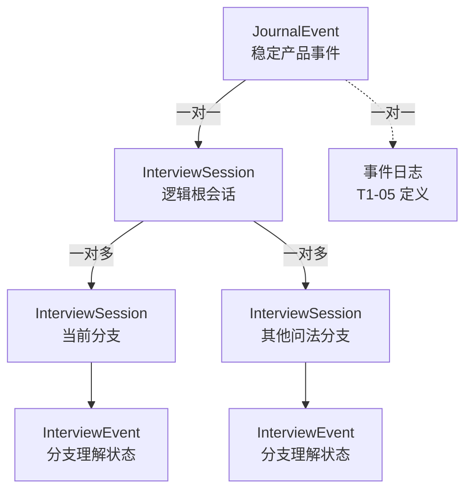
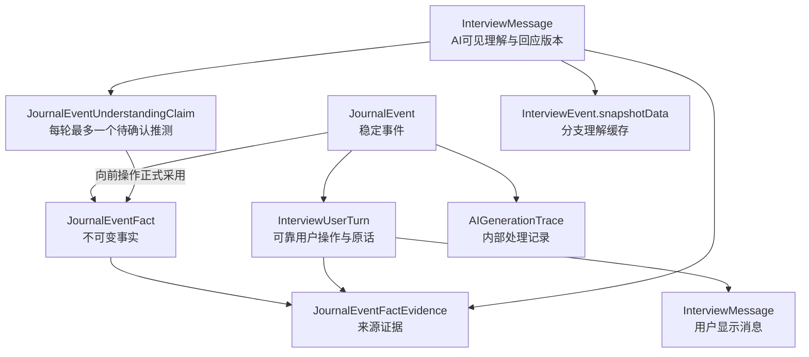

# 事件与成果领域模型技术方案

最后更新：`2026-07-22`

技术阶段：`阶段 1｜事件与成果对象`

当前讨论点：`T1-02｜方案已确认，待开发与技术验证`

文档版本：`0.5`

方案状态：`讨论中（T1-02 已确认）`

开发状态：`T1-01 已开发并通过技术验证；T1-02 待开发；T1-03 至 T1-08 待讨论`

验收状态：`T1-01 技术验证通过，待阶段 1 整体验收`

产品事实源：[`docs/interview-event-centered-product-spec.md`](../../interview-event-centered-product-spec.md)

讨论进度源：[`docs/interview-event-centered-refactor-discussion-map.md`](../../interview-event-centered-refactor-discussion-map.md)

## 1. 背景、原因与用户结果

事件中心 MVP 将每日复盘的基本单位从“维度会话”调整为“一件具体发生的事”。用户先完整表达当前事件，再按需要选择理解感受、理清想法、梳理关系或复盘行动，最终形成一篇事件日志；同一天多篇已保存事件日志可以继续形成当天完整日志。

当前系统已经具备事件、可靠用户轮次、维度日志、当天完整日志和日历读模型，但这些能力仍围绕五维会话组织。阶段 1 需要先建立稳定的事件与成果关系，让后续表达理解、对话状态、四角度能力、日志生成和页面适配共用同一条事实路径。

本阶段服务的用户结果：

1. 当前访谈始终围绕一件事，另一事件不会进入当前成果。
2. 用户原话和明确纠正可以找到稳定、可追溯的来源。
3. 一件事只形成一篇事件日志。
4. 日志草稿、保存和重新编辑拥有清楚的成果状态。
5. 多篇已保存事件日志能够成为当天完整日志的可信来源。
6. 历史五维记录继续按原有口径阅读。

## 2. 产品范围和验收编号

### 2.1 产品输入

本方案主要读取产品规格：

- 第 10 章：事件定义与边界。
- 第 11 章：信息可信度与用户纠正。
- 第 13 章：用户可见自然理解与回应。
- 第 14 章：事件日志产品规格。
- 第 15 章：今日日志与当天完整日志。
- 第 16 章：日历、历史与旧数据。
- 第 17 章：失败恢复体验。
- 第 19 章：产品验收矩阵。

### 2.2 直接支撑的产品验收

| 编号 | 场景 | 本阶段需要提供的领域保障 |
|---|---|---|
| P-08 | 生成事件日志 | 事件和事件日志保持一对一关系，成稿后可以锁定访谈来源 |
| P-09 | 同一天记录第二件事 | 新事件拥有独立身份、原话、事实和成果关系 |
| P-10 | 两篇事件形成完整日志 | 日级成果能够引用两篇已保存事件日志，并保留来源顺序 |
| P-11 | 首轮包含两件并列事件 | 原话可以完整保存，当前事件成果只接收被选择事件 |
| P-12 | 回答中出现另一独立事件 | 当前事件事实、角度成果和日志保持隔离 |
| P-13 | 过去经历用于解释今天 | 背景材料可以保留，同时保持当前事件归属 |
| P-14 | 用户明确纠正事实 | 事实和相关角度成果能够被修正或撤销 |
| P-15 | 用户回答“没有” | 边界回答可以保存并关联所回应的问题 |
| P-23 | 当天只有一篇已保存日志 | 日级入口能够直接定位唯一事件日志 |
| P-24 | 事件日志重新编辑 | 日志进入待保存状态，日级成果能够识别来源变化 |
| P-26 | 打开历史五维日期 | 历史数据继续使用旧维度阅读口径 |
| P-28 | AI提出一个新推测 | 每轮最多一个；向前操作形成可追溯事实；其他操作保持待确认 |

### 2.3 阶段边界

本阶段负责领域对象、数据所有权、成果关系、生命周期锚点和历史兼容边界。

后续阶段继续负责：

- 阶段 2：一轮表达怎样识别当前事件、背景和另一事件，并更新可信事实。
- 阶段 3：完整对话阶段、检查点和用户操作状态机。
- 阶段 4：四角度的探索、完成判断和自然线索质量。
- 阶段 6：事件日志正文生成、质量门和用户可见编辑体验。
- 阶段 7：今日日志面板和当天完整日志的具体聚合行为。
- 阶段 8：访谈工作台、日历和历史页面投影。

## 3. 当前实现事实

以下内容来自`2026-07-22`工作区，以及T1-01开发工作区`/Users/zouzhijie/.codex/worktrees/acc5/Happiness-system-codex`中的Prisma模型、repository、service、类型、测试和回填记录。

### 3.1 会话与事件

- T1-01已经为`InterviewSession`增加`dimension_legacy / event_centered`显式模式；事件中心会话允许`dimension`为空并使用协议版本3。
- `JournalEvent`已经提供稳定`eventId`、`rootSessionId`、`entryDate`、`daySequence`和事件生命周期。
- `InterviewSession.activeEventId`继续指向当前分支的`InterviewEvent`，在事件中心接口中称为`branchStateId`。
- `InterviewEvent`保存事件级`stage / snapshotData / progressData / missingSlots / draftSummary`等结构化状态。
- `InterviewEvent.sequence`保证同一会话内的事件顺序，当前状态为`active / ready_for_choice / completed`。
- `InterviewSession.entryDate`是日志归属日期来源，当前统一使用`Asia/Shanghai`日界线。

### 3.2 原话、消息与可靠提交

- `InterviewMessage`保存会话内全部消息和顺序，通过`sessionId`归属物理分支，并使用`userTurnId`连接可靠用户轮次。
- `InterviewUserTurn`保存`clientTurnId / rawText / baseMessageSequence / status / attemptCount`，同一会话内`clientTurnId`唯一。
- T1-01事件中心首轮提交已经在同一事务中创建`JournalEvent`、`InterviewUserTurn`和用户`InterviewMessage`，但`InterviewUserTurn`尚未直接关联稳定`eventId`。
- `InterviewUserTurn.activeEventId`记录提交发生时的分支状态ID，继续缺少到稳定产品事件的直接关系。
- 用户原话先持久化，AI结果再完成；失败或取消后可以使用同一`clientTurnId`继续生成。
- 回复重新生成已经具备`responseGroupId / responseVersion`、分支会话、checkpoint和独立 Trace。

### 3.3 维度日志

- `JoyEntry`已经承担五个维度的通用日志容器职责，表名保留 joy 历史语义。
- `JoyEntry.sessionId`唯一，因此当前关系是一条维度会话对应一篇维度日志。
- `JoyEntry.payload / eventBlocks`承载多维度结构和 stitched 多事件材料。
- `JoyEntry.status`使用`draft / saved`，已保存日志重新编辑后的用户体验由现有日志工作区和保存接口共同承接。
- `linkedSessionIds`和`eventBlocks`支持多来源记录，但当前成果主身份仍绑定`sessionId`。

### 3.4 当天完整日志

- `DailyJournalEntry`以`userId + date`唯一，状态为`draft / saved`。
- `sourceEntryIds / sourceSessionIds / sourceSignature / sourceUpdatedAt`记录日级成果来源及其变化。
- 当前来源选择规则为“同一天每个维度最新一篇已保存日志”。
- 当前完整日志会重新组织来源维度日志；事件中心产品要求多事件正文按记录顺序原样保留。

### 3.5 日历和历史读取

- calendar repository当前同时读取会话、维度日志、当天完整日志和日评分，再聚合为月、周、日读模型。
- 月、周、日视图的主动作仍围绕维度状态和维度日志解析。
- 历史五维数据与新事件数据需要通过明确的数据版本或记录类型进入各自读取路径。

### 3.6 当前架构集中点

- `joy-interview.service.ts`和`joy-interview.repository.ts`仍承担大部分通用访谈编排与持久化职责。
- `JoyInterviewStage`继续被会话和事件共同使用，保留 joy-first 的历史结构。
- 阶段 1 的领域选择会直接影响阶段 2、3、6、7、8 的数据和接口边界。

## 4. 可复用能力与职责变化

### 4.1 可以继续复用

1. `InterviewUserTurn`的原话优先保存、幂等提交和失败续接。
2. `InterviewMessage`的完整 transcript 和消息顺序。
3. 回复分支、checkpoint、版本选择和 Trace 血缘。
4. `entryDate`与`Asia/Shanghai`整天查询规则。
5. 日志草稿、自动暂存、手动保存和重新编辑体验。
6. `sourceSignature`驱动的日级成果 stale 判断。
7. calendar repository → service → 展示读模型的分层方式。
8. 历史五维数据现有读取链路。

### 4.2 需要重新定义职责

1. 新事件与会话之间的聚合边界。
2. 消息、用户轮次与当前事件之间的稳定归属。
3. 可信事实、AI理解和角度成果的来源与可撤销关系。
4. 事件日志的独立身份及其与事件的一对一关系。
5. 当天完整日志从维度来源切换到事件日志来源后的签名规则。
6. 新事件数据与历史五维数据的识别和读取边界。
7. 现有`JoyEntry / InterviewEvent`历史命名在新模型中的兼容方式。

## 5. 最终技术选择及选择原因

本节是阶段 1 的技术决策板。每项决策确认后，需要同步更新本节、文档版本和讨论地图。

| 编号 | 需要确认的技术决策 | 状态 | 选择结果 |
|---|---|---|---|
| T1-01 | 新事件与`InterviewSession`采用怎样的聚合关系 | 技术验证通过 | 新增稳定`JournalEvent`；一件事对应一条逻辑根会话，换问法分支共享同一`eventId` |
| T1-02 | 用户原话、事件事实和AI派生理解分别怎样保存 | 已确认，待开发与技术验证 | 原话以可靠用户轮次为唯一依据；事实采用可追溯独立条目；AI可见理解按回复版本保存，分支内最多保留一个待确认新推测 |
| T1-03 | 用户补充、明确否定和纠正怎样形成事实修订关系 | 待讨论 | — |
| T1-04 | 四角度成果怎样独立保存并随事实修订失效或更新 | 待讨论 | — |
| T1-05 | 事件日志使用新实体还是演进现有`JoyEntry` | 待讨论 | — |
| T1-06 | 当天完整日志怎样引用、排序和校验事件日志来源 | 待讨论 | — |
| T1-07 | 新旧数据怎样进行版本识别并进入各自读取路径 | 待讨论 | — |
| T1-08 | 数据演进采用怎样的增量迁移、切换和回退顺序 | 待讨论 | — |

每项决策需要记录：

- 服务的用户结果。
- 当前实现约束。
- 最终选择和选择原因。
- 主要代价。
- 失败方式和恢复方式。
- 对后续阶段的影响。
- 对应自动化验证。

### 5.1 T1-01｜新事件与 InterviewSession 的聚合关系

#### 服务的用户结果

1. 一件事在表达、换问法、生成日志、日级汇总和日历之间保持同一个稳定身份。
2. 点击“记下一件”后获得全新的空白对话，上一事件继续保留自己的对话和成果。
3. 同一记录日期的多个页面恢复同一件活动事件，避免重复创建和内容串线。
4. 历史五维会话继续沿用原有关系读取。

#### 当前实现约束

- 现有`InterviewEvent`会随回复分支复制，适合承载分支内临时理解状态。
- `InterviewSession`已经具备根会话、活动分支、checkpoint、可靠用户轮次和失败续接能力。
- `InterviewSession.dimension`当前必填，历史读取和大量服务逻辑继续依赖该字段。
- 当前`activeEventId`指向分支内`InterviewEvent`，其语义无法承担新的稳定产品事件身份。

#### 最终技术选择

1. 新增稳定产品事件实体`JournalEvent`，用户侧继续统一称“事件”。
2. 一条`JournalEvent`唯一绑定一条逻辑根`InterviewSession`。
3. 根会话的全部物理分支通过`rootSessionId`共享同一个`JournalEvent.id`。
4. 现有`InterviewEvent`继续承载分支内临时理解状态；新接口把它称为`branchStateId`。
5. 页面成果、事件日志和日历优先使用稳定`eventId`；底层对话提交继续使用`rootSessionId / activeBranchSessionId`。
6. `InterviewSession`增加显式模式`dimension_legacy / event_centered`；事件中心会话允许`dimension`为空。
7. `conversationSchemaVersion`继续表达对话协议版本，新事件会话从版本`3`开始。
8. 用户进入入口时先创建或恢复空白根会话；首条用户原话可靠落库时，同一事务创建`JournalEvent`。
9. 同一用户、同一`entryDate`最多存在一条活动的事件中心根会话；不同记录日期分别计算。
10. 用户退出且未成稿的事件标记为`abandoned`，普通用户成果入口隐藏，数据随账号生命周期保留。

#### 选择原因

- 稳定事件身份能够让原话、事实、角度成果和日志共用一条可追溯关系。
- 继续复用根会话和分支能力，可以保留可靠提交、换问法、失败续接和 Trace 血缘。
- 显式会话模式让历史五维数据与新事件数据进入各自读取路径。
- 首条表达时创建事件，可以让空开场保持为技术会话壳，事件列表只承载真实用户表达。

#### 主要代价

- 新链路同时存在稳定`eventId`、根会话ID、活动分支ID和旧分支状态ID，需要严格限定每个身份的使用范围。
- `dimension`改为可空后，需要增加模式约束和历史回归测试。
- 同日唯一活动根会话需要数据库条件唯一索引与并发恢复逻辑共同保证。
- 旧`InterviewEvent`名称保留历史语义，代码和接口需要使用`branchStateId`避免误用。

#### 失败与恢复

- 重复页面同时启动时，由数据库唯一约束选出同一根会话，后返回请求重新读取胜出会话。
- 同时提交时，服务端使用`baseMessageSequence`和活动分支校验串行接收；落后请求返回`409 EVENT_STATE_CHANGED`，前端保留输入草稿。
- 首轮事件创建事务失败时不发送用户轮次确认，outbox保留原话供重试。
- AI回复失败发生在原话与事件落库之后，恢复时继续使用同一`clientTurnId`和`eventId`。
- 日志生成取消或失败时，事件从`generating`回到原检查点对应的`active`状态。
- 生成成功或用户退出时，根会话及整条分支树进入终态，后续分支写入关闭。

#### 对后续阶段的影响

- T1-02至T1-04统一以`JournalEvent.id`作为原话、事实、AI理解和角度成果的产品归属键。
- T1-05建立`JournalEvent`与事件日志的一对一关系。
- T1-06使用`daySequence`确定当天事件日志来源顺序。
- 阶段 3 使用事件生命周期决定恢复、生成、退出和记下一件。
- 阶段 5 的回复版本只改变活动分支，保持`eventId`稳定。
- 阶段 8 的页面、日历和历史读模型按会话模式及事件状态分流。

### 5.2 T1-02｜用户原话、事件事实与AI理解

#### 服务的用户结果

1. 用户已经发送的每段原话完整保留，刷新、重试和切换回复版本后继续指向同一条来源。
2. 当前事件事实能够指出来自哪轮原话、哪条AI问题或理解，以及在哪条分支路径生效。
3. 当前事件、必要背景和另一独立事件保持清楚边界。
4. AI自然理解可以重新生成；用户看到的具体版本能够恢复，并与内部待确认命题保持一致。
5. AI提出的新推测每轮最多一个；用户执行向前操作后，该推测正式成为有来源的事件事实。

#### 当前实现约束

- `InterviewUserTurn.rawText`已经承担原话优先保存、幂等提交和失败续接，适合作为唯一原话依据。
- `InterviewMessage`同时保存用户显示消息和AI回复版本，能够通过`userTurnId`回指可靠轮次。
- `InterviewEvent.snapshotData`会随分支复制并进入checkpoint，适合作为可重建的分支理解缓存。
- 当前缺少稳定事件事实、事实证据、待确认AI命题和事件级Trace归属。
- 回复分支通过父子会话和`forkMessageSequence`组成有效消息路径；只按`eventId`合并事实会把兄弟分支的后续回答混在一起。

#### 最终技术选择

1. `InterviewUserTurn.rawText`是唯一原话依据，采用追加写入；补充和纠正创建新轮次。
2. `InterviewUserTurn`增加可空`journalEventId`外键。事件中心轮次直接关联`JournalEvent`；历史五维轮次保持为空；原`activeEventId`继续表示分支内`branchStateId`。
3. `InterviewMessage`负责用户可见内容、消息顺序和回复版本，通过`userTurnId`回指原话，不承担第二份原话权威。
4. 新增`JournalEventFact`保存不可变的独立事实条目。事实包含自然中文陈述，以及`scope / stance / kind / origin`四组控制字段。
5. 新增`JournalEventFactEvidence`保存一条事实的一条或多条来源证据。重复表达为已有事实增加证据，语义匹配由阶段 2 决定。
6. 新增`JournalEventUnderstandingClaim`，一条AI消息最多对应一个缺少原话支持的新推测。待确认命题尚未进入有效事实集合。
7. 用户执行普通内容回复、选择事件、选择角度、继续探索或生成日志后，当前活动回复的待确认命题转为`implicit_confirmation`事实。
8. 纠正理解、换问法、切换回复版本、问题修复、退出事件和失败后的继续生成不触发确认。自然语言轮次先完成意图判断，纠正优先。
9. AI可见自然理解继续随`InterviewMessage`和回复版本保存；完整内部处理进入`AIGenerationTrace`；`InterviewEvent.snapshotData`只保存分支内可重建缓存。
10. `JournalEventFact`和事实证据使用`pathAnchorMessageId`表达生效路径。当前事实读取复用有效消息路径，只接收锚点仍在活动分支路径中的记录。
11. 首轮同时出现两件并列事件时先保存完整原话，不建立事件事实；用户选择后，事实同时关联首轮表达和选择轮次。
12. “没有、不了解、想不起来”保存为`denied / unknown`边界事实；“对、是的”等短回答只在回应单一清楚命题时生效，并关联上下文AI消息。
13. 事件成稿后冻结事实、理解命题和分支缓存；用户编辑事件日志只改变最终呈现。

#### 事实控制字段

| 字段 | 固定取值 | 产品语义 |
|---|---|---|
| `scope` | `current_event / background` | 当前事件内容或理解当前事件所需背景 |
| `stance` | `affirmed / denied / unknown` | 用户确认、明确否定或无法提供该内容 |
| `kind` | `event_detail / inner_experience / stated_interpretation / stated_preference / boundary_answer` | 事件细节、内在体验、用户自己的解释、用户表达的偏好或有效边界回答 |
| `origin` | `user_expression / explicit_confirmation / implicit_confirmation` | 用户直接表达、用户明确确认或用户通过向前操作正式采用 |

另一独立事件不进入`scope`枚举。它继续保留在原话和内部边界判断记录中，防止下游把它当作当前事件或背景使用。

#### 隐式确认规则

待确认AI命题需要满足：

- 一轮最多一个。
- 使用可能性语气，并与用户看到的自然理解保持语义一致。
- 内容属于当前事件或必要背景。
- 当前有效原话尚未直接支持该命题。

能够确认命题的向前操作：

- 普通内容回复。
- 选择当前事件。
- 选择探索角度。
- 继续探索。
- 生成事件日志。

不确认命题的操作：

- 纠正理解。
- 换问法或切换回复版本。
- 问题修复。
- 退出事件。
- 对失败轮次执行继续生成或幂等重放。

确认发生在用户操作被可靠接收、意图判断通过之后。确认与后续AI或日志生成分开提交；后续生成失败时，已经完成的确认继续有效。界面沿用当前自然理解、纠正和换问法入口，不增加确认提示。

#### 分支有效事实

- 事件保存全部分支的事实和证据，稳定归属始终使用同一个`eventId`。
- 事实创建时记录`createdBranchSessionId`和`pathAnchorMessageId`。
- 直接表达形成的事实以对应用户消息作为路径锚点。
- 无可见用户消息的向前操作确认AI命题时，以被确认的AI消息作为路径锚点。
- 当前读取先得到活动分支的有效消息集合，再筛选路径锚点存在于该集合中的事实和证据。
- 共同祖先消息形成的事实自然共享；分叉后新增事实只对相应分支生效。
- 切换回复版本同时切换自然理解、待确认命题和有效事实投影，`eventId`保持稳定。

#### 失败与恢复

- 原话接收失败时，前端outbox继续保留待提交文本。
- 原话已可靠落库后，事实识别失败或自然理解与结构化命题不一致时，本轮事实、AI理解、AI回复和分支缓存均不提交。
- 失败轮次保留原话和已经完成的上一轮隐式确认，用户使用同一`clientTurnId`继续生成。
- 当前轮的事实、证据、AI回复、待确认命题、Trace、checkpoint和轮次完成状态在同一事务中提交。
- 幂等重放返回已有结果，不重复创建事实、证据或确认。
- 确认待确认命题时使用命题、确认轮次和已确认事实之间的唯一约束，防止并发重复确认。

#### 主要代价

- 原话、事实、证据、可见理解、待确认命题和分支缓存形成多层关系，需要清楚限定每层用途。
- 有效事实读取需要复用活动分支的消息路径，查询和测试复杂度增加。
- “向前操作即正式采用”会让自然理解质量直接影响事实与日志；每轮一个新推测、一致性检查、来源标记和纠正优先共同承担质量护栏。
- 界面不增加确认提示，质量评测需要重点观察隐式确认导致的误事实和后续纠正率。

#### 对后续阶段的影响

- T1-03以不可变事实和证据为基础增加补充、否定、纠正、撤销与有效投影，不直接改写旧事实文本。
- T1-04的角度成果需要引用有效`factId`，并根据事实修订结果失效或更新。
- 阶段 2负责事件边界、事实抽取、已有事实语义匹配和短回答理解。
- 阶段 3和阶段 6需要把选择角度、继续探索和生成日志登记为可靠用户操作，供隐式确认使用。
- 阶段 5需要保证可见自然理解、结构化待确认命题和回复版本严格一致。
- 阶段 9需要按`origin`观察直接表达、明确确认和隐式确认的质量差异。

## 6. 领域对象、状态和数据所有权

### 6.1 逻辑对象与可信来源

下表描述产品所需的逻辑职责。T1-01确认事件身份，T1-02确认原话、事实和AI理解；成果对象继续由后续决策补齐。

| 逻辑对象 | 核心职责 | 可信来源 | 是否允许重新生成 |
|---|---|---|---|
| 当前事件（`JournalEvent`） | 标识本次访谈正在处理的一件事，并提供跨分支稳定`eventId` | 首条用户表达和当前对话边界 | 身份保持稳定 |
| 用户原话（`InterviewUserTurn.rawText`） | 完整保留用户已经发送的表达 | 用户提交 | 保持原文，只追加新轮次 |
| 事件事实（`JournalEventFact`） | 保存归属于当前事件或必要背景的独立陈述 | 用户原话、明确确认或正式采用的AI理解 | 事实文本保持不可变，T1-03追加修订关系 |
| 事实证据（`JournalEventFactEvidence`） | 连接事实、用户轮次、上下文AI消息和分支路径 | 原话精确摘录与可靠用户操作 | 只追加 |
| AI待确认命题（`JournalEventUnderstandingClaim`） | 保存每轮最多一个缺少原话支持的新推测 | 用户可见自然理解 | 可以随回复版本重新生成；向前操作后转为事实 |
| AI理解 | 保存当前可见理解和内部派生解释 | 当前有效事实与活动分支上下文 | 可以重新生成 |
| 角度成果 | 保存当前事件支持的感受、想法、关系或行动线索 | 事件事实和对应角度对话 | 可以修订或撤销 |
| 事件日志 | 保存一件事的可编辑成果 | 事件材料、角度成果和用户编辑 | AI草稿可以重建，用户编辑具有最终呈现权 |
| 当天完整日志 | 保存一天内多篇事件日志的组合成果 | 已保存事件日志和用户编辑 | 可以按最新来源更新 |
| 历史五维记录 | 保存旧产品已经确认的成果 | 现有会话和日志表 | 继续使用旧读取口径 |

### 6.2 已确认的事件与会话关系



### 6.3 已确认的事件生命周期

```text
空白根会话，eventId = null
→ 首条原话可靠落库并创建事件
→ active
→ 用户点击生成
→ generating
→ 生成成功
→ completed
```

补充分支：

- `generating → active`：用户取消，或生成失败且基础版本未通过质量检查。
- `active → abandoned`：用户明确执行退出当前事件。
- `completed → 新空白根会话`：用户执行记下一件。
- 刷新、关闭页面和普通导航保持`active`，下次恢复同一事件。
- 日志保存、重新编辑和待保存状态属于事件日志，`JournalEvent`继续保持`completed`。

事件中心根会话在`active / generating`期间保持`InterviewSession.status = active`；事件生成成功时整条会话树进入`completed`，退出时整条会话树进入`abandoned`。完整对话阶段和检查点继续由阶段 3 定义。

### 6.4 T1-02 已确认的可信信息关系



数据所有权固定为：原话由`InterviewUserTurn`拥有；可见对话由`InterviewMessage`拥有；可信事实由`JournalEventFact`拥有；AI临时理解由回复版本、待确认命题和分支缓存共同承载；Trace只承担质量追踪。

## 7. 输入、输出、接口与数据流

### 7.1 目标数据流

```text
用户提交原话
→ 归属当前事件
→ 更新可信事实
→ 形成或修订角度成果
→ 生成事件日志草稿
→ 用户编辑并保存事件日志
→ 已保存事件日志进入当天来源集合
→ 形成或更新当天完整日志
```

### 7.2 本阶段需要明确的接口契约

1. 创建事件时返回的稳定身份和数据版本。
2. 查询当前活动事件时返回的成果关系。
3. 用户轮次、消息、事实和角度成果使用的事件归属键。
4. 生成事件日志时使用的只读来源集合。
5. 保存事件日志时更新的事件和日级来源状态。
6. 查询一天成果时区分新事件数据与历史五维数据的读模型。

具体 API 路径、请求字段和响应字段在 T1-01 至 T1-08 确认后补齐。

### 7.3 T1-01 已确认的身份契约

- 启动事件中心访谈返回`mode / rootSessionId / activeBranchSessionId / eventId / entryDate / conversationSchemaVersion`。
- 空白根会话返回`eventId = null`。
- 首条用户轮次确认必须返回新建或已存在的稳定`eventId`。
- 事件日志、今日日志和日历后续使用`eventId`定位产品事件。
- 对话提交和回复分支继续使用根会话与活动分支身份。
- 现有`activeEventId`在事件中心接口中只作为内部`branchStateId`使用。
- 状态落后的并发提交返回`409 EVENT_STATE_CHANGED`并附带最新根会话和活动分支身份。

### 7.4 T1-02 已确认的可信信息契约

普通用户接口继续只返回对话、恢复状态和成果入口，不直接返回事实、证据、分支缓存或Trace。

内部增加三个稳定能力：

1. `getEffectiveJournalEventFacts(eventId, activeBranchSessionId)`
   - 校验事件、根会话和活动分支关系。
   - 复用有效消息路径计算当前事实。
   - 返回有效事实及当前路径内的有效证据。
2. `confirmPendingUnderstandingClaim(userTurnId, activeBranchSessionId)`
   - 只处理当前活动分支最后一个可确认命题。
   - 要求可靠用户操作已经完成意图判断，并属于向前操作。
   - 幂等创建`implicit_confirmation`事实和确认来源。
3. `commitEventCenteredTurnUnderstanding(...)`
   - 输入当前轮次、预期分支与消息版本、事实新增或证据追加、AI回复、可选待确认命题、分支缓存和Trace结果。
   - 在一个事务中写入全部本轮派生结果并完成用户轮次。
   - 自然理解与结构化待确认命题不一致时拒绝提交。

`POST /api/interview/event-centered/session/turn`继续承担原话可靠接收并返回稳定`eventId`。阶段 2 接入内容理解后调用上述内部能力；阶段 3、5、6继续接入用户操作和完整回复体验。

## 8. 用户纠正、重试、恢复和并发规则

### 8.1 已确认的产品约束

- 用户原话完整保留，补充和纠正通过新的表达进入事实路径。
- 用户明确否定后，旧解释停止影响后续问题和日志。
- 事件日志生成后冻结访谈内容和内部理解，后续修改通过日志编辑完成。
- 同一事件只形成一篇事件日志。
- 重试和继续生成沿用同一用户轮次，不重复用户原话和事实。

### 8.2 本阶段待确认

- 事实修订采用当前值投影、追加记录或两者组合。
- 角度成果怎样记录所依赖的事实，并在事实纠正后失效。
- 日志生成与用户继续提交并发时怎样锁定来源窗口。
- 日志草稿创建成功与事件关闭怎样保持原子性。
- 重复生成请求怎样返回同一事件日志。
- 保存事件日志与更新当天来源签名怎样保持一致。

### 8.3 T1-01 已确认的并发与恢复规则

1. 启动入口通过“同一用户＋同一日期＋活动事件中心根会话”的数据库唯一约束收敛重复请求。
2. 启动竞态中的失败方读取并返回已经存在的根会话。
3. 首条原话、可靠用户轮次和`JournalEvent`在同一事务中创建。
4. `daySequence`在该事务内按用户和日期串行分配。
5. 同时提交通过`baseMessageSequence`和活动分支身份校验；落后输入保留在前端 outbox。
6. 回复分支共享稳定事件身份，选择版本只更新`activeBranchSessionId`。
7. `generating / completed / abandoned`状态关闭新的回复分支写入。

### 8.4 T1-02 已确认的确认、重试与恢复规则

1. 原话或操作先以`InterviewUserTurn`可靠落库，再进入意图判断和AI处理。
2. 自然语言轮次先区分普通回复、纠正、问题修复、换问法和退出；纠正优先于隐式确认。
3. 被可靠接收的向前操作只确认当前活动回复中的一个待确认命题。
4. 确认记录与后续AI生成分开提交，AI或日志生成失败不撤销已经完成的确认。
5. 当前轮事实、证据、AI回复、待确认命题、分支缓存、Trace、checkpoint和轮次完成状态在同一事务中提交。
6. 事实识别失败或自然理解一致性检查失败时，当前轮派生结果保持为空，原话和上一轮确认继续有效。
7. 使用同一`clientTurnId`继续生成时复用原轮次；确认、事实和证据各自使用唯一约束保持幂等。
8. AI回复重新生成产生新的消息版本和待确认命题；旧版本记录继续保留，其事实资格由活动分支消息路径决定。
9. 事件进入`completed / abandoned`后关闭事实、证据和待确认命题写入。

## 9. 数据演进与历史兼容

### 9.1 已确认边界

- 历史五维会话、维度日志和当天完整日志继续可读。
- 历史记录保持原维度名称和展示结构。
- 新事件数据与旧五维数据使用独立统计和理解口径。
- 历史五维记录保持原始关系，不映射为新四角度成果。

### 9.2 迁移方案需要回答

1. 新模型采用新增表、演进现有表或组合方式。
2. 新记录从哪个版本或时间点开始写入事件中心结构。
3. 页面和 calendar repository怎样识别某一天的数据版本。
4. 当前五维写入在发布切换后怎样停止，新读取怎样继续保留。
5. 数据库变更怎样采用增量、可回退的迁移顺序。
6. Preview 与 Production 怎样验证旧数据读取和新数据写入。

完整字段字典和 migration 顺序将在技术选择确认后进入附录 A。

### 9.3 T1-01 已确认的兼容方向

- 所有现有会话回填`mode = dimension_legacy`，继续保留必填维度语义。
- 新事件会话写入`mode = event_centered`和`conversationSchemaVersion = 3`，`dimension`为空。
- 数据库增加模式与维度组合检查，阻止无效数据进入两条读取路径。
- 历史`InterviewEvent`数据保持原结构；`JournalEvent`只由新的事件中心表达创建。
- 新增条件唯一索引，约束同一用户同一日期只有一条活动事件中心根会话。
- 发布回退关闭事件中心新写入，已经产生的`JournalEvent`及其会话继续保留。

### 9.4 T1-02 已确认的数据演进方向

- `InterviewUserTurn`新增可空`journalEventId`和索引；现有五维轮次保持为空，不执行语义回填。
- `AIGenerationTrace`新增可空`journalEventId`和索引；现有Trace保持为空。
- 新增事实、事实证据和待确认命题表，以及对应枚举、外键和账号删除级联关系。
- `JournalEventFact.statement`创建后保持不可变；T1-03通过新关系表达修订。
- 事实和证据分别保存分支与路径消息锚点，读取时复用活动分支的有效消息算法。
- 待确认命题使用`assistantMessageId`唯一约束实现每条AI回复最多一个；确认事实与确认轮次使用唯一关系防止重复确认。
- 事件中心功能回退时停止新增事实和命题写入；已经写入的数据继续随事件保留，旧五维读取路径保持独立。

## 10. 失败降级、可观测性和回退方式

### 10.1 需要建立防线的高影响失败

- 用户原话缺少事件归属或发生重复归属。
- 当前事件事实混入另一独立事件。
- 用户纠正后旧事实或旧角度成果继续进入日志。
- 同一事件形成多篇事件日志。
- 日级成果遗漏、重复或改写来源事件日志。
- 新事件数据进入历史五维统计。
- 数据迁移后旧日期无法继续阅读。

### 10.2 阶段 1 需要预留的观测信息

- 事件身份、数据版本和归属日期。
- 用户轮次、事实修订、角度成果和日志之间的关联标识。
- 事件日志生成与保存的幂等键。
- 当天完整日志的来源集合、顺序和签名。
- 新旧读取路径及兼容分支的命中记录。

T1-01同时要求记录：

- 稳定`eventId`、根会话ID、活动分支ID和内部`branchStateId`。
- 事件状态变化时间和触发动作。
- 同日入口复用、唯一约束冲突和`EVENT_STATE_CHANGED`次数。
- 首条表达创建事件的事务结果与恢复结果。

T1-02同时要求记录：

- 原话轮次、事实、证据、AI消息版本和待确认命题之间的关联标识。
- 每轮新增事实数、追加证据数、待确认命题数和一致性检查结果。
- `user_expression / explicit_confirmation / implicit_confirmation`三类事实来源。
- 隐式确认触发动作、确认成功、幂等命中和被纠正优先级拦截的次数。
- 当前事件、背景和另一独立事件的边界判断结果；另一事件内容只保存在内部Trace。
- 有效事实读取命中的分支路径和被排除的兄弟分支事实数。
- 事实识别或理解一致性失败后保留原话、继续生成和最终恢复的结果。

### 10.3 回退原则

- 数据结构采用增量演进，历史读取路径持续可用。
- 新事件写入和页面切换拥有统一回退入口。
- 回退后已经产生的新事件成果保持可读取和可导出。
- 阶段 9 负责形成最终发布与快速回退计划；阶段 1 负责保证领域模型支持该路径。

## 11. 分步骤开发顺序

### 11.1 阶段 1 总体顺序

本节在 T1-01 至 T1-08 全部确认后形成完整阶段交接版本。当前总体顺序为：

1. 增加领域模型、枚举、约束和 migration。
2. 增加新模型的 repository 映射和事务边界。
3. 建立新旧数据识别与兼容读取能力。
4. 建立事件、原话、事实、角度成果和事件日志的关系写入。
5. 建立事件日志保存与当天来源签名更新能力。
6. 补齐数据约束、迁移、repository和兼容读取测试。
7. 在 Preview 验证新数据写入和历史数据读取。

阶段 1 开发聚焦领域和持久化基础；后续阶段分别接入表达理解、状态机、AI能力、日志正文和页面体验。

### 11.2 T1-02 开发交接顺序

1. 增加事实、证据、待确认命题相关枚举和数据表，并为用户轮次与Trace增加稳定事件外键。
2. 建立原话、事实、证据、待确认命题和Trace的repository映射、外键校验与账号删除级联。
3. 抽取并复用现有有效消息路径算法，完成`getEffectiveJournalEventFacts`。
4. 完成待确认命题资格判断和`confirmPendingUnderstandingClaim`幂等事务。
5. 完成`commitEventCenteredTurnUnderstanding`原子提交及自然理解一致性校验。
6. 扩展事件中心内部类型和测试夹具；普通用户接口继续保持事实与内部理解隐藏。
7. 完成migration、repository、service、分支路径、并发、失败恢复和历史兼容测试。
8. 运行Prisma校验、类型检查、相关测试、完整测试和生产构建，并把实际差异与结果回填本文档。

T1-02开发只建立可信信息持久化和确定性规则。事件边界识别、事实语义匹配和AI生成策略由阶段 2 接入；完整用户操作状态机和页面体验由阶段 3、5、6 接入。

## 12. 自动化测试、AI评测和产品验收清单

### 12.1 自动化测试候选

- 同一用户同一天重复进入，只得到一条活动根会话。
- 空白开场保持`eventId = null`。
- 首条表达只创建一个事件，并返回稳定`eventId`。
- 同一天完成或退出后可以创建下一事件，`daySequence`保持创建顺序。
- 不同记录日期可以分别恢复活动事件。
- 换问法和选择版本前后`eventId`保持一致。
- 同时启动和同时提交无法产生重复活动事件。
- 生成失败或取消后恢复同一事件和原检查点。
- 生成成功或退出后整条会话树进入对应终态。
- `abandoned`事件从普通用户读模型中过滤，并随账号删除级联清除。
- 一个新事件拥有稳定、唯一的身份。
- 两个事件的原话、事实、角度成果和日志保持隔离。
- 同一事件重复生成请求只得到一篇事件日志。
- 用户纠正可以使旧事实和依赖成果退出有效投影。
- 事件日志草稿、已保存和重新编辑状态保持一致。
- 当天来源集合只接收已保存事件日志，并保持记录顺序。
- 来源日志保存状态或内容版本变化后，完整日志进入需更新状态。
- 历史五维日期继续返回原有读模型。
- 新旧数据不会共同进入角度统计和长期模式。
- migration可以在现有数据样本上安全执行。

#### T1-02 技术验证清单

- 原话完整保留并直接关联稳定`eventId`，显示消息能够通过`userTurnId`回指原话。
- 重试、幂等重放和并发提交不会重复产生原话、事实、证据或确认。
- 首轮同时出现两件事时，选择前事实集合为空；选择后只有选定事件进入事实。
- 当前事件事实与背景事实使用不同`scope`；另一独立事件只保留在原话和内部Trace。
- “没有、不了解、想不起来”形成`denied / unknown`边界事实并关联对应AI消息。
- 简短确认只接受单一明确命题，同时保留AI上下文和用户回答。
- 同一事实被再次表达时追加证据，不创建重复事实。
- 每条AI回复最多拥有一个待确认新推测，可见自然理解与命题语义一致。
- 普通回复、选择事件、选择角度、继续探索和生成日志可以确认命题。
- 纠正、换问法、切换版本、问题修复、退出和失败续接不会确认命题。
- 后续AI或日志生成失败时，已经完成的隐式确认继续有效。
- 活动分支只读取有效消息路径上的事实和证据，兄弟分支内容保持隔离。
- 理解检查失败时只保留原话，继续生成后本轮派生结果一次性提交。
- 事件成稿后关闭事实和命题写入；日志编辑不反向修改事件事实。
- 历史五维轮次和Trace的`journalEventId`保持为空，旧读取结果不变。
- 账号删除级联清理事实、证据、命题和事件中心Trace。

### 12.2 AI评测边界

阶段 1 主要验证数据关系和确定性规则。T1-02额外验证可见自然理解与待确认命题的一致性、隐式确认资格和来源完整性。事件边界识别、事实抽取和纠正理解的语义评测进入阶段 2；阶段 1 需要提供可评测、可追踪的数据输出。

### 12.3 产品验收清单

- P-08、P-09、P-10拥有稳定领域关系。
- P-11至P-15、P-19和P-28拥有原话保留、事件隔离、边界回答、隐式确认、失败续接和纠正传播位置。
- P-23、P-24拥有单事件直达和来源更新能力。
- P-26拥有历史五维读取路径。
- 数据丢失、重复日志、事件串线和新旧数据混合拥有自动化防线。

## 13. 跨阶段影响

| 阶段 | 阶段 1 需要提供的稳定输入 |
|---|---|
| 阶段 2｜表达接收与理解 | 事件身份、原话归属、事实修订和可信状态接口 |
| 阶段 3｜状态与用户控制 | 事件和事件日志的生命周期锚点、恢复状态 |
| 阶段 4｜四角度能力 | 公共事实读取、角度成果保存和失效关系 |
| 阶段 5｜用户可见回复 | 回复、纠正和版本与事件身份的关联方式 |
| 阶段 6｜事件日志 | 事件日志身份、只读生成来源和编辑后的权威边界 |
| 阶段 7｜当天成果 | 已保存事件日志集合、排序、版本和来源签名 |
| 阶段 8｜页面与历史 | 新旧数据识别、日级读模型和直达身份 |
| 阶段 9｜可靠性与发布 | 数据版本、血缘、幂等、兼容读取和回退基础 |

## 14. 版本与决策变更记录

| 版本 | 日期 | 状态 | 变化 |
|---|---|---|---|
| 0.1 | 2026-07-22 | 讨论中 | 建立阶段 1 草稿，记录产品输入、当前实现事实、待决技术问题和交接模板 |
| 0.2 | 2026-07-22 | 讨论中 | 确认 T1-01：新增稳定`JournalEvent`、一事件一根会话、跨分支共享`eventId`、首条表达建事件、同日活动唯一性和生命周期规则 |
| 0.3 | 2026-07-22 | T1-01 已开发 | 落地稳定事件聚合基础、事件中心会话接口、首条表达事务、生命周期、历史五维读取分流和自动化验证 |
| 0.4 | 2026-07-22 | T1-01 技术验证通过 | 登记 T1-01 技术验证结果，进入 T1-02 讨论；T1-01 随阶段 1 等待整体产品验收 |
| 0.5 | 2026-07-22 | T1-02 方案已确认 | 确认原话唯一依据、可追溯事实与证据、分支有效事实、AI待确认命题、隐式确认、原子提交和失败恢复规则 |

阶段技术决策确认后，同时更新：

1. 本文档第 5 节技术决策板。
2. 对应的数据、接口、迁移和验收章节。
3. 重构讨论地图中的`T-XX`记录和当前讨论位置。

## 15. 开发和验收回填区

### 15.1 T1-01 开发交接

- 交接版本：本文档`0.2`中的已确认决策`T1-01`。
- 交接日期：`2026-07-22`。
- 开发工作区：`/Users/zouzhijie/.codex/worktrees/acc5/Happiness-system-codex`。
- 前置文档：本文档、产品规格、重构讨论地图、访谈产品优化地图。
- 实施范围：稳定事件与根会话聚合基础；该次交接不包含事实、成果和日志对象。

### 15.2 T1-01 实际变更

- 变更摘要：新增事件中心持久化链路；空白入口复用同日活动根会话，首条原话与稳定事件同事务落库，重复提交返回同一事件身份，生成、恢复、完成和退出状态拥有统一转换函数。
- 数据库变化：新增`InterviewSessionMode`、`JournalEventStatus`和`JournalEvent`；`InterviewSession.dimension`允许为空并增加模式组合检查；事件中心协议要求版本不低于`3`；增加同日活动根会话条件唯一索引、事件顺序唯一约束和账号删除级联关系。迁移文件为`20260722120000_add_event_centered_aggregate`。
- 接口变化：新增`POST /api/interview/event-centered/session/start`、`GET /api/interview/event-centered/session/[id]`和`POST /api/interview/event-centered/session/turn`。身份响应包含`mode / rootSessionId / activeBranchSessionId / eventId / branchStateId / entryDate / conversationSchemaVersion`；状态落后提交返回`409 EVENT_STATE_CHANGED`。
- 历史兼容：旧日历、旧当天日志、管理员五维明细和回复再生成指标显式读取`dimension_legacy`，防止事件中心空维度进入旧口径。
- 与方案差异：空白根会话会预先创建一条内部`InterviewEvent`作为`branchStateId`，稳定`JournalEvent`仍严格在首条原话可靠落库时创建；AI理解与回复继续等待T1-02及后续阶段接入。
- 后续阶段影响：T1-02可以直接使用稳定`eventId`与可靠用户轮次；T1-03可以复用事件状态转换；T1-05需要把事件日志实体接到`JournalEvent`并调用生成终态事务。

### 15.3 T1-01 验证证据

- 自动化测试：`188`个测试文件、`1396`个用例全部通过；新增`4`个事件聚合用例，覆盖空白复用、首条建事件、幂等重放、同日顺序、过期提交和生命周期。
- TypeScript检查：`npm run typecheck`通过。
- Prisma检查：`prisma format / validate / generate`通过。
- 构建结果：`npm run build`通过；构建保留仓库既有lint warning，未新增阻断项。
- Preview地址：本次仅完成本地领域基础，尚未部署Preview。
- 产品验收结果：T1-01 技术验证通过，等待阶段 1 全部决策开发完成后的整体产品验收。
- 遗留问题：T1-02事实来源方案现已确认并等待开发；纠正传播、四角度成果、事件日志和日级聚合继续由T1-03至T1-08确认；页面切换与完整AI回复链路属于后续阶段。

### 15.4 阶段结论

- 当前结论：T1-01开发完成并通过技术验证；T1-02方案已经确认并可交给新的开发窗口；阶段1整体产品验收将在T1-02至T1-08完成开发后统一进行。
- 下一讨论启动条件：T1-02完成开发并通过技术验证后进入T1-03；阶段2继续等待阶段1全部决策、开发和产品验收完成。

### 15.5 T1-02 开发交接

- 交接版本：本文档`0.5`中的已确认决策`T1-02`。
- 交接日期：`2026-07-22`。
- 前置文档：本文档、产品规格、重构讨论地图、访谈产品优化地图，以及T1-01实际变更所在开发工作区。
- 实施范围：可靠原话事件归属、事实与证据实体、AI待确认命题、分支有效事实读取、隐式确认、原子提交、Trace归属和确定性测试。
- 后续范围：T1-03事实修订；阶段2语义识别与事实匹配；阶段3用户操作状态机；阶段5完整AI回复与重新生成体验；阶段6日志生成。
- 开发状态：待新的开发窗口实施。
- 技术验证状态：待回传。
- 产品验收状态：随阶段1整体链路统一验收。

## 附录 A｜数据字典与迁移方案

### A.1 T1-01 已确认字段

`JournalEvent`至少包含：

| 字段 | 约束与语义 |
|---|---|
| `id` | 稳定产品事件身份 |
| `userId` | 所属用户，账号删除时级联清除 |
| `rootSessionId` | 唯一，指向逻辑根会话 |
| `entryDate` | 记录归属日期，创建后保持稳定 |
| `daySequence` | 同一用户同一日期内按首条表达成功落库的顺序递增 |
| `status` | `active / generating / completed / abandoned` |
| `startedAt` | 首条原话可靠落库时间 |
| `generationStartedAt` | 当前日志生成开始时间，可空 |
| `completedAt` | 事件日志草稿成功形成时间，可空 |
| `abandonedAt` | 用户明确退出时间，可空 |
| `createdAt / updatedAt` | 数据创建和更新时间 |

确认的数据约束：

- `rootSessionId`唯一。
- `userId + entryDate + daySequence`唯一。
- 事件中心根会话采用“用户＋记录日期＋活动状态”条件唯一索引。
- `dimension_legacy`会话的`dimension`有值，`event_centered`会话的`dimension`为空。

### A.2 T1-02 已确认字段

`InterviewUserTurn`新增：

| 字段 | 约束与语义 |
|---|---|
| `journalEventId` | 可空外键；事件中心轮次指向稳定`JournalEvent`，历史五维轮次为空 |

`JournalEventFact`包含：

| 字段 | 约束与语义 |
|---|---|
| `id` | 稳定事实身份 |
| `eventId` | 指向`JournalEvent`，账号或事件删除时级联清除 |
| `createdBranchSessionId` | 事实形成时所在分支 |
| `pathAnchorMessageId` | 决定事实是否位于当前有效消息路径 |
| `statement` | 不可变的自然中文事实陈述 |
| `scope` | `current_event / background` |
| `stance` | `affirmed / denied / unknown` |
| `kind` | `event_detail / inner_experience / stated_interpretation / stated_preference / boundary_answer` |
| `origin` | `user_expression / explicit_confirmation / implicit_confirmation` |
| `createdAt` | 事实创建时间 |

`JournalEventFactEvidence`包含：

| 字段 | 约束与语义 |
|---|---|
| `id` | 证据身份 |
| `factId` | 指向所属事实 |
| `sourceTurnId` | 必填，指向提供表达或确认的可靠用户轮次 |
| `contextMessageId` | 可空；短回答或隐式确认所回应的AI问题或理解 |
| `pathAnchorMessageId` | 证据所在有效消息路径的锚点 |
| `role` | `direct_expression / event_selection / short_confirmation / repeated_support / implicit_confirmation` |
| `quote` | 可空；有原话内容时保存精确短摘录，不保存字符位置 |
| `createdAt` | 证据创建时间 |

`JournalEventUnderstandingClaim`包含：

| 字段 | 约束与语义 |
|---|---|
| `id` | 待确认命题身份 |
| `eventId` | 指向稳定事件 |
| `branchSessionId` | 命题所属回复分支 |
| `assistantMessageId` | 唯一；保证一条AI回复最多一个新推测 |
| `statement / scope / stance / kind` | 与正式事实使用相同语义 |
| `confirmedFactId` | 可空；确认后指向生成的事实 |
| `confirmedByTurnId` | 可空；指向完成正式采用的可靠用户操作 |
| `confirmedAt` | 可空；正式采用时间 |
| `createdAt` | 命题创建时间 |

`AIGenerationTrace`新增：

| 字段 | 约束与语义 |
|---|---|
| `journalEventId` | 可空外键；事件中心Trace指向稳定事件，历史Trace为空 |

T1-03 至 T1-08 确认后继续补充事实修订、成果、日志和完整 migration 顺序。

## 附录 B｜领域关系图与关键时序

T1-01 的领域关系图见第 6.2 节。首条表达关键时序固定为：

```text
提交 rawText
→ 校验当前根会话和活动分支
→ 串行分配 daySequence
→ 同一事务写入用户轮次与 JournalEvent
→ 返回包含 eventId 的 turn 确认
→ 事务外继续 AI 理解与回复
```

日志生成事务、事实修订和成果保存时序等待后续决策补充。

T1-02 的一轮表达时序固定为：

```text
可靠接收用户原话或操作
→ 写入 InterviewUserTurn.journalEventId
→ 完成意图判断
→ 若属于向前操作，幂等确认上一条活动待确认命题
→ 读取活动分支有效事实
→ 完成边界判断、事实变化和AI回复
→ 校验事实来源、待确认命题数量及自然理解一致性
→ 同一事务提交事实、证据、AI消息、待确认命题、分支缓存、Trace、checkpoint和轮次完成状态
```

校验失败时，本轮原话和已经完成的上一轮确认继续保留，本轮派生结果等待同一`clientTurnId`继续生成。事实修订和成果保存时序等待后续决策补充。

## 附录 C｜领域关系验收矩阵

T1-01已经覆盖事件身份、会话模式和生命周期。T1-02开发窗口需要把P-11至P-15、P-18、P-19和P-28映射到具体repository断言、事务断言和测试文件；T1-03至T1-08继续补充纠正、成果、日志和历史读模型验收。
