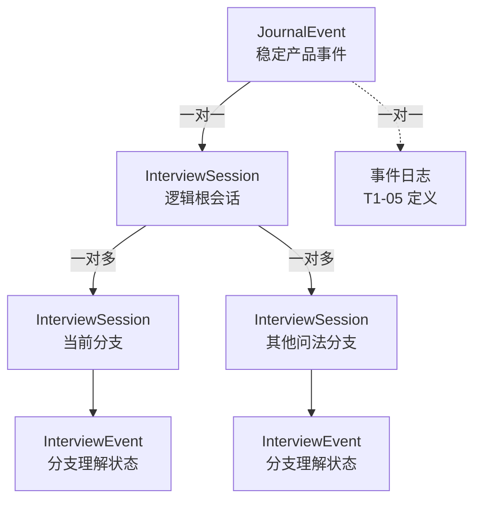
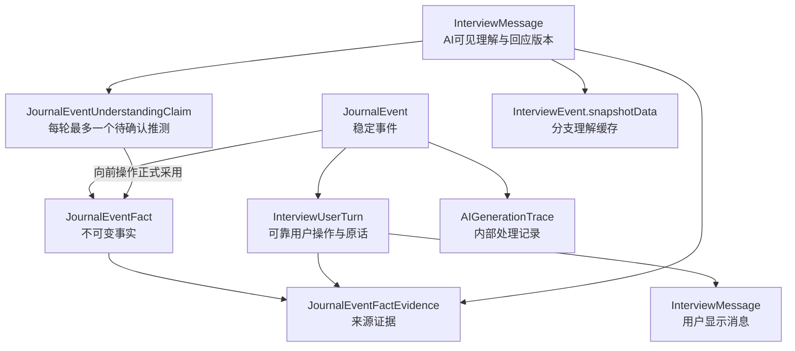
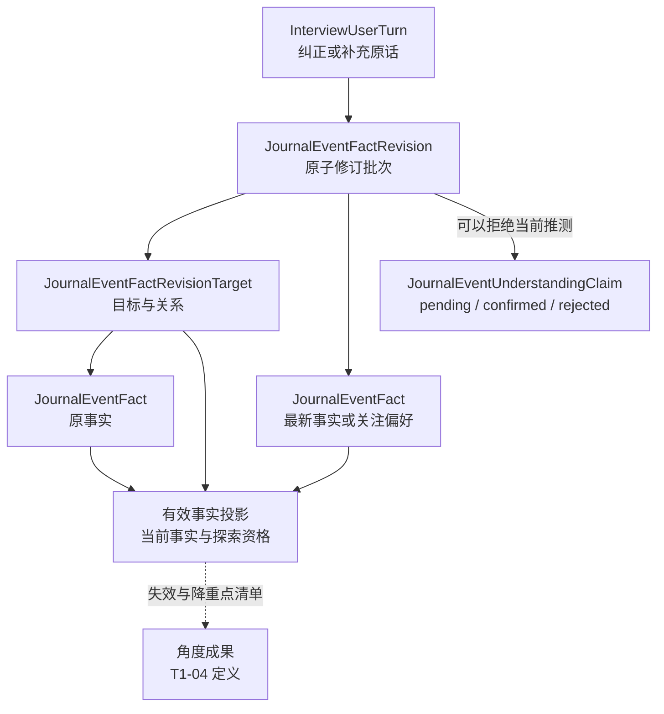
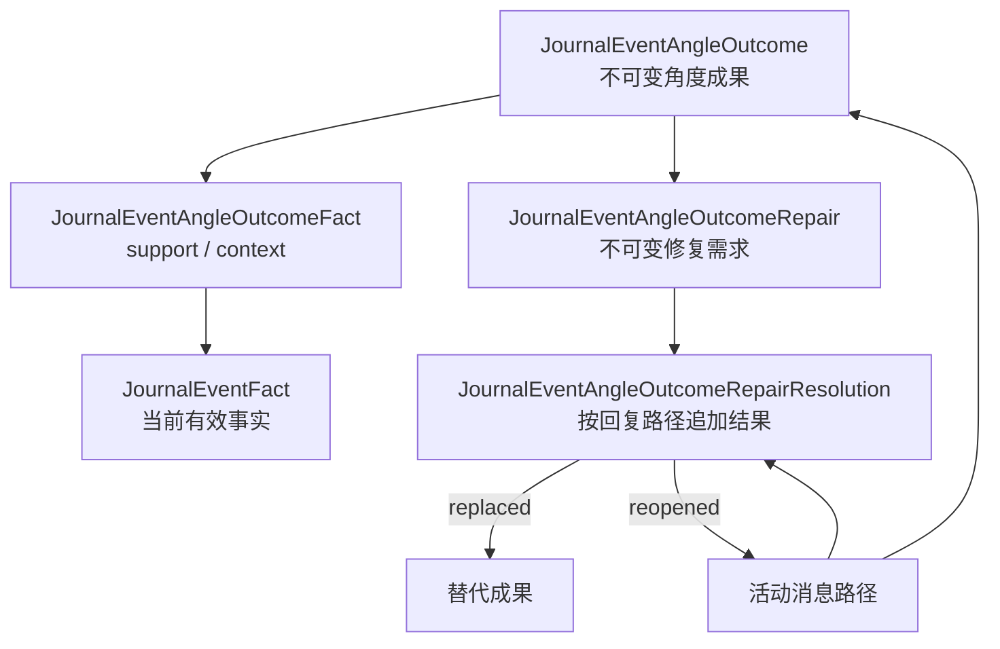

# 事件与成果领域模型技术方案

最后更新：`2026-07-22`

技术阶段：`阶段 1｜事件与成果对象`

当前讨论点：`T1-08｜基础界面、日历适配与发布保护已通过技术验证；等待完整AI访谈服务契约`

文档版本：`1.5`

方案状态：`基础实现已验证（完整AI访谈能力进入批次B共同设计）`

开发状态：`T1-01 至 T1-08基础接入已开发并通过技术验证；LeadAgent等待批次B公共提问协议后继续接入完整事件访谈服务`

验收状态：`T1-01 至 T1-05 技术验证通过，用户验收合并进入批次A`

产品事实源：[`docs/interview-event-centered-product-spec.md`](../../interview-event-centered-product-spec.md)

讨论进度源：[`docs/interview-event-centered-refactor-discussion-map.md`](../../interview-event-centered-refactor-discussion-map.md)

协作机制：[`00-lead-agent-collaboration-and-delivery.md`](./00-lead-agent-collaboration-and-delivery.md)

## 1. 背景、原因与用户结果

事件中心 MVP 将每日复盘的基本单位从“维度会话”调整为“一件具体发生的事”。用户先完整表达当前事件，再按需要选择理解感受、理清想法、梳理关系或复盘行动，最终形成一篇事件日志；同一天多篇已保存事件日志可以继续形成当天完整日志。

当前系统已经具备事件、可靠用户轮次、维度日志、当天完整日志和日历读模型，但这些能力仍围绕五维会话组织。阶段 1 需要先建立稳定的事件与成果关系，让后续表达理解、对话状态、四角度能力、日志生成和页面适配共用同一条事实路径。

本阶段服务的用户结果：

1. 当前访谈始终围绕一件事，另一事件不会进入当前成果。
2. 用户原话和明确纠正可以找到稳定、可追溯的来源。
3. 一件事只形成一篇事件日志。
4. 日志草稿、保存和重新编辑拥有清楚的成果状态。
5. 多篇已保存事件日志能够成为当天完整日志的可信来源。
6. 历史五维记录继续按原有口径阅读。

## 2. 产品范围和验收编号

### 2.1 产品输入

本方案主要读取产品规格：

- 第 10 章：事件定义与边界。
- 第 11 章：信息可信度与用户纠正。
- 第 13 章：用户可见自然理解与回应。
- 第 14 章：事件日志产品规格。
- 第 15 章：今日日志与当天完整日志。
- 第 16 章：日历、历史与旧数据。
- 第 17 章：失败恢复体验。
- 第 19 章：产品验收矩阵。

### 2.2 直接支撑的产品验收

| 编号 | 场景 | 本阶段需要提供的领域保障 |
|---|---|---|
| P-08 | 生成事件日志 | 事件和事件日志保持一对一关系，成稿后可以锁定访谈来源 |
| P-09 | 同一天记录第二件事 | 新事件拥有独立身份、原话、事实和成果关系 |
| P-10 | 两篇事件形成完整日志 | 日级成果能够引用两篇已保存事件日志，并保留来源顺序 |
| P-11 | 首轮包含两件并列事件 | 原话可以完整保存，当前事件成果只接收被选择事件 |
| P-12 | 回答中出现另一独立事件 | 当前事件事实、角度成果和日志保持隔离 |
| P-13 | 过去经历用于解释今天 | 背景材料可以保留，同时保持当前事件归属 |
| P-14 | 用户明确纠正事实 | 事实和相关角度成果能够被修正或撤销 |
| P-15 | 用户回答“没有” | 边界回答可以保存并关联所回应的问题 |
| P-23 | 当天只有一篇已保存日志 | 日级入口能够直接定位唯一事件日志 |
| P-24 | 事件日志重新编辑 | 日志进入待保存状态，日级成果能够识别来源变化 |
| P-26 | 打开历史五维日期 | 历史数据继续使用旧维度阅读口径 |
| P-28 | AI提出一个新推测 | 每轮最多一个；向前操作形成可追溯事实；其他操作保持待确认 |
| P-31 | 纠正使已完成角度线索失效 | 角度成果保存事实依赖；材料足够时更新，材料不足时失效并重新开放角度 |

### 2.3 阶段边界

本阶段负责领域对象、数据所有权、成果关系、生命周期锚点和历史兼容边界。

后续阶段继续负责：

- 阶段 2：一轮表达怎样识别当前事件、背景和另一事件，并更新可信事实。
- 阶段 3：完整对话阶段、检查点和用户操作状态机。
- 阶段 4：四角度的探索、完成判断和自然线索质量。
- 阶段 6：事件日志正文生成、质量门和用户可见编辑体验。
- 阶段 7：今日日志面板和当天完整日志的具体聚合行为。
- 阶段 8：访谈工作台、日历和历史页面投影。

## 3. 当前实现事实

以下内容来自`2026-07-22`工作区，以及T1-01、T1-02开发工作区`/path/to/Happiness-system-codex`中的Prisma模型、repository、service、类型、测试和回填记录。

### 3.1 会话与事件

- T1-01已经为`InterviewSession`增加`dimension_legacy / event_centered`显式模式；事件中心会话允许`dimension`为空并使用协议版本3。
- `JournalEvent`已经提供稳定`eventId`、`rootSessionId`、`entryDate`、`daySequence`和事件生命周期。
- `InterviewSession.activeEventId`继续指向当前分支的`InterviewEvent`，在事件中心接口中称为`branchStateId`。
- `InterviewEvent`保存事件级`stage / snapshotData / progressData / missingSlots / draftSummary`等结构化状态。
- `InterviewEvent.sequence`保证同一会话内的事件顺序，当前状态为`active / ready_for_choice / completed`。
- `InterviewSession.entryDate`是日志归属日期来源，当前统一使用`Asia/Shanghai`日界线。

### 3.2 原话、消息与可靠提交

- `InterviewMessage`保存会话内全部消息和顺序，通过`sessionId`归属物理分支，并使用`userTurnId`连接可靠用户轮次。
- `InterviewUserTurn`保存`clientTurnId / rawText / baseMessageSequence / status / attemptCount`，同一会话内`clientTurnId`唯一。
- T1-02已经为事件中心`InterviewUserTurn`增加`journalEventId`，用户原话能够直接追溯稳定事件；历史五维轮次保持为空。
- `InterviewUserTurn.activeEventId`继续记录提交发生时的分支状态ID，稳定事件归属由`journalEventId`独立表达。
- `JournalEventFact / JournalEventFactEvidence / JournalEventUnderstandingClaim`已经分别承载不可变事实、来源证据和每条AI回复最多一个待确认推测。
- `getEffectiveJournalEventFacts`按活动分支的有效消息路径投影事实和证据，兄弟分支内容不会进入当前结果。
- 用户原话先持久化；隐式确认独立提交；本轮事实、AI回复、待确认命题、分支缓存、Trace、checkpoint和轮次完成状态原子提交；失败或取消后可以使用同一`clientTurnId`继续生成。
- 当前事实正文保持不可变，但尚未建立事实之间的补充、替代、否定、撤回和关注重点关系。
- `JournalEventUnderstandingClaim`当前只通过确认字段区分待确认和已确认，尚未表达用户明确拒绝后的终态。
- 当前分支缓存尚未保存目标歧义或互斥事实的待澄清状态，向前操作也缺少对应门禁。
- 回复重新生成已经具备`responseGroupId / responseVersion`、分支会话、checkpoint和独立 Trace。

### 3.3 维度日志

- `JoyEntry`已经承担五个维度的通用日志容器职责，表名保留 joy 历史语义。
- `JoyEntry.sessionId`唯一，因此当前关系是一条维度会话对应一篇维度日志。
- `JoyEntry.payload / eventBlocks`承载多维度结构和 stitched 多事件材料。
- `JoyEntry.status`使用`draft / saved`，已保存日志重新编辑后的用户体验由现有日志工作区和保存接口共同承接。
- `linkedSessionIds`和`eventBlocks`支持多来源记录，但当前成果主身份仍绑定`sessionId`。

### 3.4 当天完整日志

- `DailyJournalEntry`以`userId + date`唯一，状态为`draft / saved`。
- `sourceEntryIds / sourceSessionIds / sourceSignature / sourceUpdatedAt`记录日级成果来源及其变化。
- 当前来源选择规则为“同一天每个维度最新一篇已保存日志”。
- 当前完整日志会重新组织来源维度日志；事件中心产品要求多事件正文按记录顺序原样保留。

### 3.5 日历和历史读取

- calendar repository当前同时读取会话、维度日志、当天完整日志和日评分，再聚合为月、周、日读模型。
- 月、周、日视图的主动作仍围绕维度状态和维度日志解析。
- 历史五维数据与新事件数据需要通过明确的数据版本或记录类型进入各自读取路径。

### 3.6 当前架构集中点

- `joy-interview.service.ts`和`joy-interview.repository.ts`仍承担大部分通用访谈编排与持久化职责。
- `JoyInterviewStage`继续被会话和事件共同使用，保留 joy-first 的历史结构。
- 阶段 1 的领域选择会直接影响阶段 2、3、6、7、8 的数据和接口边界。

## 4. 可复用能力与职责变化

### 4.1 可以继续复用

1. `InterviewUserTurn`的原话优先保存、幂等提交和失败续接。
2. `InterviewMessage`的完整 transcript 和消息顺序。
3. 回复分支、checkpoint、版本选择和 Trace 血缘。
4. `entryDate`与`Asia/Shanghai`整天查询规则。
5. 日志草稿、自动暂存、手动保存和重新编辑体验。
6. `sourceSignature`驱动的日级成果 stale 判断。
7. calendar repository → service → 展示读模型的分层方式。
8. 历史五维数据现有读取链路。

### 4.2 需要重新定义职责

1. 新事件与会话之间的聚合边界。
2. 消息、用户轮次与当前事件之间的稳定归属。
3. 可信事实、AI理解和角度成果的来源与可撤销关系。
4. 当前有效事实、已退出事实和探索重点的独立投影。
5. 事件日志的独立身份及其与事件的一对一关系。
6. 当天完整日志从维度来源切换到事件日志来源后的签名规则。
7. 新事件数据与历史五维数据的识别和读取边界。
8. 现有`JoyEntry / InterviewEvent`历史命名在新模型中的兼容方式。

### 4.3 批次 A 复用登记门

T1-03技术回传后、T1-04开发前，LeadAgent需要把阶段1至3涉及的能力登记为`直接复用 / 扩展复用 / 适配隔离 / 新增实现`，并在技术方案中说明证据。

首轮复用基线：

- 直接复用`InterviewUserTurn`可靠提交、`InterviewMessage`消息顺序、checkpoint和Trace血缘。
- 扩展复用回复分支、版本选择、现有意图识别、纠正优先、问题协议、问题生成器、确定性修复和重复问题防线，并接入稳定`eventId`与有效事实投影。
- 扩展复用日志草稿、暂存、保存、来源签名和日历repository至展示读模型的分层方式。
- 适配隔离历史五维读取和新事件中心读取，继续保护旧记录口径。
- T1-01至T1-03通过验证后直接作为稳定上游；后续新增集中在事件边界、角度成果与自适应修复、事件中心检查点与用户控制、事件日志与读模型和专项评测，并在对应决策记录原因和回退方式。

详细协作与复用规则见[`00-lead-agent-collaboration-and-delivery.md`](./00-lead-agent-collaboration-and-delivery.md)。

## 5. 最终技术选择及选择原因

本节是阶段 1 的技术决策板。每项决策确认后，需要同步更新本节、文档版本和讨论地图。

| 编号 | 需要确认的技术决策 | 状态 | 选择结果 |
|---|---|---|---|
| T1-01 | 新事件与`InterviewSession`采用怎样的聚合关系 | 技术验证通过 | 新增稳定`JournalEvent`；一件事对应一条逻辑根会话，换问法分支共享同一`eventId` |
| T1-02 | 用户原话、事件事实和AI派生理解分别怎样保存 | 技术验证通过 | 原话以可靠用户轮次为唯一依据；事实采用可追溯独立条目；AI可见理解按回复版本保存，分支内最多保留一个待确认新推测 |
| T1-03 | 用户补充、明确否定和纠正怎样形成事实修订关系 | 技术验证通过 | 不改写旧事实；通过修订批次追加补充、替代、否定、撤回和重点变化；活动路径投影当前有效事实 |
| T1-04 | 四角度成果怎样独立保存并随事实修订失效或更新 | 技术验证通过 | 成果按回复路径追加保存并显式引用事实；事实修订创建不可变修复需求，各回复版本分别追加替代或重新开放结果 |
| T1-05 | 事件日志使用新实体还是演进现有`JoyEntry` | 技术验证通过 | 新增独立`JournalEventEntry`和业务级生成记录；复用日志编辑、保存、Trace和质量基础设施，保持历史五维日志隔离 |
| T1-06 | 当天完整日志怎样引用、排序和校验事件日志来源 | 技术验证通过 | 独立`JournalDailyEntry`只读取已保存事件日志，按`daySequence + savedRevision`建立有序签名、更新门禁与版本保护 |
| T1-07 | 新旧数据怎样进行版本识别并进入各自读取路径 | 技术验证通过 | 日期归属唯一锁定首条有效表达的产品模式；旧五维与事件中心建立独立日历读模型，混合历史日期只读分流 |
| T1-08 | 数据演进采用怎样的增量迁移、切换和回退顺序 | 待LeadAgent设计与开发 | 以增量迁移、可恢复基线和快速回退为决策约束 |

每项决策需要记录：

- 服务的用户结果。
- 当前实现约束。
- 最终选择和选择原因。
- 主要代价。
- 失败方式和恢复方式。
- 对后续阶段的影响。
- 对应自动化验证。

### 5.1 T1-01｜新事件与 InterviewSession 的聚合关系

#### 服务的用户结果

1. 一件事在表达、换问法、生成日志、日级汇总和日历之间保持同一个稳定身份。
2. 点击“记下一件”后获得全新的空白对话，上一事件继续保留自己的对话和成果。
3. 同一记录日期的多个页面恢复同一件活动事件，避免重复创建和内容串线。
4. 历史五维会话继续沿用原有关系读取。

#### 当前实现约束

- 现有`InterviewEvent`会随回复分支复制，适合承载分支内临时理解状态。
- `InterviewSession`已经具备根会话、活动分支、checkpoint、可靠用户轮次和失败续接能力。
- `InterviewSession.dimension`当前必填，历史读取和大量服务逻辑继续依赖该字段。
- 当前`activeEventId`指向分支内`InterviewEvent`，其语义无法承担新的稳定产品事件身份。

#### 最终技术选择

1. 新增稳定产品事件实体`JournalEvent`，用户侧继续统一称“事件”。
2. 一条`JournalEvent`唯一绑定一条逻辑根`InterviewSession`。
3. 根会话的全部物理分支通过`rootSessionId`共享同一个`JournalEvent.id`。
4. 现有`InterviewEvent`继续承载分支内临时理解状态；新接口把它称为`branchStateId`。
5. 页面成果、事件日志和日历优先使用稳定`eventId`；底层对话提交继续使用`rootSessionId / activeBranchSessionId`。
6. `InterviewSession`增加显式模式`dimension_legacy / event_centered`；事件中心会话允许`dimension`为空。
7. `conversationSchemaVersion`继续表达对话协议版本，新事件会话从版本`3`开始。
8. 用户进入入口时先创建或恢复空白根会话；首条用户原话可靠落库时，同一事务创建`JournalEvent`。
9. 同一用户、同一`entryDate`最多存在一条活动的事件中心根会话；不同记录日期分别计算。
10. 用户退出且未成稿的事件标记为`abandoned`，普通用户成果入口隐藏，数据随账号生命周期保留。

#### 选择原因

- 稳定事件身份能够让原话、事实、角度成果和日志共用一条可追溯关系。
- 继续复用根会话和分支能力，可以保留可靠提交、换问法、失败续接和 Trace 血缘。
- 显式会话模式让历史五维数据与新事件数据进入各自读取路径。
- 首条表达时创建事件，可以让空开场保持为技术会话壳，事件列表只承载真实用户表达。

#### 主要代价

- 新链路同时存在稳定`eventId`、根会话ID、活动分支ID和旧分支状态ID，需要严格限定每个身份的使用范围。
- `dimension`改为可空后，需要增加模式约束和历史回归测试。
- 同日唯一活动根会话需要数据库条件唯一索引与并发恢复逻辑共同保证。
- 旧`InterviewEvent`名称保留历史语义，代码和接口需要使用`branchStateId`避免误用。

#### 失败与恢复

- 重复页面同时启动时，由数据库唯一约束选出同一根会话，后返回请求重新读取胜出会话。
- 同时提交时，服务端使用`baseMessageSequence`和活动分支校验串行接收；落后请求返回`409 EVENT_STATE_CHANGED`，前端保留输入草稿。
- 首轮事件创建事务失败时不发送用户轮次确认，outbox保留原话供重试。
- AI回复失败发生在原话与事件落库之后，恢复时继续使用同一`clientTurnId`和`eventId`。
- 日志生成取消或失败时，事件从`generating`回到原检查点对应的`active`状态。
- 生成成功或用户退出时，根会话及整条分支树进入终态，后续分支写入关闭。

#### 对后续阶段的影响

- T1-02至T1-04统一以`JournalEvent.id`作为原话、事实、AI理解和角度成果的产品归属键。
- T1-05建立`JournalEvent`与事件日志的一对一关系。
- T1-06使用`daySequence`确定当天事件日志来源顺序。
- 阶段 3 使用事件生命周期决定恢复、生成、退出和记下一件。
- 阶段 5 的回复版本只改变活动分支，保持`eventId`稳定。
- 阶段 8 的页面、日历和历史读模型按会话模式及事件状态分流。

### 5.2 T1-02｜用户原话、事件事实与AI理解

#### 服务的用户结果

1. 用户已经发送的每段原话完整保留，刷新、重试和切换回复版本后继续指向同一条来源。
2. 当前事件事实能够指出来自哪轮原话、哪条AI问题或理解，以及在哪条分支路径生效。
3. 当前事件、必要背景和另一独立事件保持清楚边界。
4. AI自然理解可以重新生成；用户看到的具体版本能够恢复，并与内部待确认命题保持一致。
5. AI提出的新推测每轮最多一个；用户执行向前操作后，该推测正式成为有来源的事件事实。

#### 当前实现约束

- `InterviewUserTurn.rawText`已经承担原话优先保存、幂等提交和失败续接，适合作为唯一原话依据。
- `InterviewMessage`同时保存用户显示消息和AI回复版本，能够通过`userTurnId`回指可靠轮次。
- `InterviewEvent.snapshotData`会随分支复制并进入checkpoint，适合作为可重建的分支理解缓存。
- 当前缺少稳定事件事实、事实证据、待确认AI命题和事件级Trace归属。
- 回复分支通过父子会话和`forkMessageSequence`组成有效消息路径；只按`eventId`合并事实会把兄弟分支的后续回答混在一起。

#### 最终技术选择

1. `InterviewUserTurn.rawText`是唯一原话依据，采用追加写入；补充和纠正创建新轮次。
2. `InterviewUserTurn`增加可空`journalEventId`外键。事件中心轮次直接关联`JournalEvent`；历史五维轮次保持为空；原`activeEventId`继续表示分支内`branchStateId`。
3. `InterviewMessage`负责用户可见内容、消息顺序和回复版本，通过`userTurnId`回指原话，不承担第二份原话权威。
4. 新增`JournalEventFact`保存不可变的独立事实条目。事实包含自然中文陈述，以及`scope / stance / kind / origin`四组控制字段。
5. 新增`JournalEventFactEvidence`保存一条事实的一条或多条来源证据。重复表达为已有事实增加证据，语义匹配由阶段 2 决定。
6. 新增`JournalEventUnderstandingClaim`，一条AI消息最多对应一个缺少原话支持的新推测。待确认命题尚未进入有效事实集合。
7. 用户执行普通内容回复、选择事件、选择角度、继续探索或生成日志后，当前活动回复的待确认命题转为`implicit_confirmation`事实。
8. 纠正理解、换问法、切换回复版本、问题修复、退出事件和失败后的继续生成不触发确认。自然语言轮次先完成意图判断，纠正优先。
9. AI可见自然理解继续随`InterviewMessage`和回复版本保存；完整内部处理进入`AIGenerationTrace`；`InterviewEvent.snapshotData`只保存分支内可重建缓存。
10. `JournalEventFact`和事实证据使用`pathAnchorMessageId`表达生效路径。当前事实读取复用有效消息路径，只接收锚点仍在活动分支路径中的记录。
11. 首轮同时出现两件并列事件时先保存完整原话，不建立事件事实；用户选择后，事实同时关联首轮表达和选择轮次。
12. “没有、不了解、想不起来”保存为`denied / unknown`边界事实；“对、是的”等短回答只在回应单一清楚命题时生效，并关联上下文AI消息。
13. 事件成稿后冻结事实、理解命题和分支缓存；用户编辑事件日志只改变最终呈现。

#### 事实控制字段

| 字段 | 固定取值 | 产品语义 |
|---|---|---|
| `scope` | `current_event / background` | 当前事件内容或理解当前事件所需背景 |
| `stance` | `affirmed / denied / unknown` | 用户确认、明确否定或无法提供该内容 |
| `kind` | `event_detail / inner_experience / stated_interpretation / stated_preference / boundary_answer` | 事件细节、内在体验、用户自己的解释、用户表达的偏好或有效边界回答 |
| `origin` | `user_expression / explicit_confirmation / implicit_confirmation` | 用户直接表达、用户明确确认或用户通过向前操作正式采用 |

另一独立事件不进入`scope`枚举。它继续保留在原话和内部边界判断记录中，防止下游把它当作当前事件或背景使用。

#### 隐式确认规则

待确认AI命题需要满足：

- 一轮最多一个。
- 使用可能性语气，并与用户看到的自然理解保持语义一致。
- 内容属于当前事件或必要背景。
- 当前有效原话尚未直接支持该命题。

能够确认命题的向前操作：

- 普通内容回复。
- 选择当前事件。
- 选择探索角度。
- 继续探索。
- 生成事件日志。

不确认命题的操作：

- 纠正理解。
- 换问法或切换回复版本。
- 问题修复。
- 退出事件。
- 对失败轮次执行继续生成或幂等重放。

确认发生在用户操作被可靠接收、意图判断通过之后。确认与后续AI或日志生成分开提交；后续生成失败时，已经完成的确认继续有效。界面沿用当前自然理解、纠正和换问法入口，不增加确认提示。

#### 分支有效事实

- 事件保存全部分支的事实和证据，稳定归属始终使用同一个`eventId`。
- 事实创建时记录`createdBranchSessionId`和`pathAnchorMessageId`。
- 直接表达形成的事实以对应用户消息作为路径锚点。
- 无可见用户消息的向前操作确认AI命题时，以被确认的AI消息作为路径锚点。
- 当前读取先得到活动分支的有效消息集合，再筛选路径锚点存在于该集合中的事实和证据。
- 共同祖先消息形成的事实自然共享；分叉后新增事实只对相应分支生效。
- 切换回复版本同时切换自然理解、待确认命题和有效事实投影，`eventId`保持稳定。

#### 失败与恢复

- 原话接收失败时，前端outbox继续保留待提交文本。
- 原话已可靠落库后，事实识别失败或自然理解与结构化命题不一致时，本轮事实、AI理解、AI回复和分支缓存均不提交。
- 失败轮次保留原话和已经完成的上一轮隐式确认，用户使用同一`clientTurnId`继续生成。
- 当前轮的事实、证据、AI回复、待确认命题、Trace、checkpoint和轮次完成状态在同一事务中提交。
- 幂等重放返回已有结果，不重复创建事实、证据或确认。
- 确认待确认命题时使用命题、确认轮次和已确认事实之间的唯一约束，防止并发重复确认。

#### 主要代价

- 原话、事实、证据、可见理解、待确认命题和分支缓存形成多层关系，需要清楚限定每层用途。
- 有效事实读取需要复用活动分支的消息路径，查询和测试复杂度增加。
- “向前操作即正式采用”会让自然理解质量直接影响事实与日志；每轮一个新推测、一致性检查、来源标记和纠正优先共同承担质量护栏。
- 界面不增加确认提示，质量评测需要重点观察隐式确认导致的误事实和后续纠正率。

#### 对后续阶段的影响

- T1-03以不可变事实和证据为基础增加补充、否定、纠正、撤销与有效投影，不直接改写旧事实文本。
- T1-04的角度成果需要引用有效`factId`，并根据事实修订结果失效或更新。
- 阶段 2负责事件边界、事实抽取、已有事实语义匹配和短回答理解。
- 阶段 3和阶段 6需要把选择角度、继续探索和生成日志登记为可靠用户操作，供隐式确认使用。
- 阶段 5需要保证可见自然理解、结构化待确认命题和回复版本严格一致。
- 阶段 9需要按`origin`观察直接表达、明确确认和隐式确认的质量差异。

### 5.3 T1-03｜用户补充、否定、纠正与事实修订关系

#### 服务的用户结果

1. 用户补充信息后，原事实与新增内容各自保留来源，并能共同参与后续理解。
2. 用户纠正、否定或撤回后，旧内容立即退出当前问题、角度成果和日志来源。
3. 用户调整关注重点时，客观事实继续作为必要上下文，探索方向采用最新选择。
4. 回复版本切换后，事实与修订始终和当前可见对话保持一致。
5. AI回应失败时，已经成功识别并提交的纠正继续有效，用户只需继续生成回应。
6. 新旧信息明显互斥时，冲突在进入角度和日志前得到澄清。

#### 当前实现约束

- T1-02的`JournalEventFact.statement`创建后保持不可变，适合通过追加关系表达变化。
- 一条事实可以拥有多份证据，最新明确纠正需要让完整语义事实退出，旧证据继续承担审计来源。
- 活动分支有效消息路径已经能够隔离兄弟分支，修订关系可以复用同一路径锚点。
- `JournalEventUnderstandingClaim`拥有确认事实与确认轮次关系，当前缺少显式拒绝状态。
- `InterviewEvent.snapshotData`与checkpoint可以承载分支内可恢复的待澄清状态。
- 当前角度成果实体尚未确定；T1-03需要先提供`invalidatedFactIds / deprioritizedFactIds`，T1-04再连接具体成果。
- 事件中心普通用户接口目前只承担原话可靠接收；语义识别、用户操作状态机和完整页面体验分别由阶段2、3、5接入。

#### 最终技术选择

1. 新增不可变修订批次`JournalEventFactRevision`。一条可靠用户轮次最多形成一个修订批次，使用`sourceTurnId`唯一约束保持幂等。
2. 新增`JournalEventFactRevisionTarget`记录批次涉及的原事实和关系类型；同一批次允许包含多个目标和多个结果事实，并在一个事务中提交。
3. 修订关系固定为`supersede / supplement / negate / withdraw / deprioritize / restore_focus`。
4. `JournalEventFact`增加可空`createdByRevisionId`，用于连接修订生成的新事实；结果事实继续使用T1-02的证据结构保存原话来源。
5. 一个修订批次至少包含目标关系、结果事实或被拒绝命题中的一项；只拒绝当前AI推测时允许目标事实集合为空。
6. 明确替代使用`supersede`：目标事实退出，新的直接表达事实进入。
7. 兼容补充使用`supplement`：目标事实继续有效，新增事实独立进入。
8. 明确否定使用`negate`：原肯定事实退出，新增`stance = denied`事实；纯撤回使用`withdraw`，不补写反面结论。
9. `supplement / supersede / negate`批次至少生成一条结果事实；`negate`结果至少包含一条`denied`事实；`deprioritize / restore_focus`至少生成一条`stated_preference`事实；`withdraw`允许结果为空。跨表组合由事务服务校验。
10. 用户说明内容真实但不希望继续围绕它探索时使用`deprioritize`；用户重新选择该内容时使用`restore_focus`。两者只改变探索资格，不改变事实真实性。
11. 用户再次采用曾经退出的说法时创建新的事实，不重新激活历史事实。
12. 有效事实按活动消息路径和修订关系共同计算；共同祖先事实可以在当前分支被修订，兄弟分支继续保持各自路径结果。
13. `JournalEventUnderstandingClaim`增加`pending / confirmed / rejected`显式状态。被拒绝命题永久失去确认资格；已确认命题后续通过其`confirmedFactId`进入普通修订链。
14. 目标不唯一或新旧事实明显互斥时，当前轮只保存原话并进入待澄清状态；澄清完成后再提交事实修订。
15. 待澄清状态阻塞选择角度、继续探索和生成日志；普通澄清回答与退出继续可用。
16. 用户无法确认冲突点时，目标旧事实使用`withdraw`退出，并创建`stance = unknown / kind = boundary_answer`事实后解除阻塞。
17. 用户新表达与当前待确认AI推测直接冲突时，先拒绝该推测，再执行事实修订；该轮不进行隐式确认。
18. 纠正轮的AI回复不创建新的待确认推测，`unsupportedClaimCount`固定为`0`。
19. 事实修订、命题拒绝、分支缓存、Trace和修订检查点先独立提交；自然回应在下一步生成。回应失败不会撤销修订。

#### 关系语义

| 关系 | 目标事实 | 结果事实 | 探索资格 | 典型用户语义 |
|---|---|---|---|---|
| `supplement` | 继续有效 | 新事实有效 | 保持 | “还有一点……” |
| `supersede` | 退出 | 最新事实有效 | 由新事实决定 | 明确改正时间、地点、感受或解释 |
| `negate` | 退出 | 新`denied`事实有效 | 按否定边界处理 | “我没有生气” |
| `withdraw` | 退出 | 可以为空 | 退出 | “刚才那句别算” |
| `deprioritize` | 继续有效 | 新关注偏好事实有效 | 退出主线 | “这是真的，但不是我想聊的重点” |
| `restore_focus` | 继续有效 | 新关注偏好事实有效 | 恢复 | “这部分才是我想聊的” |

#### 明显冲突与目标歧义

- 感受等可以同时成立的内容按补充处理，例如生气和委屈可以共同存在。
- 时间、地点、人物关系等明显互斥信息缺少改口信号时进入`hard_conflict`。
- 用户表达“这段不对”且可能对应多个事实时进入`ambiguous_target`。
- 待澄清状态保存在当前分支`InterviewEvent.snapshotData.pendingFactRevisionClarification`，至少记录类型、来源轮次、候选目标事实、候选事实草稿和澄清消息。
- 澄清答案同时关联原冲突轮次和当前回答轮次；短回答继续保留所回应的AI消息作为证据上下文。
- 冲突解决前不允许事实集合进入角度或日志生成；退出事件始终保持可用。

#### 分支、历史消息与有效投影

- 修订批次记录`branchSessionId`和`pathAnchorMessageId`，只在锚点位于当前有效消息路径时生效。
- 修订目标必须是该轮用户消息之前的当前有效事实，禁止修订兄弟分支事实、已退出事实或未来事实。
- 用户纠正较早的AI理解时，阶段5从目标消息处创建新分支；新分支的纠正消息成为修订路径锚点，旧后续对话留在原分支。
- 切换回复版本时，事实、修订、待确认命题、待澄清状态和探索资格一同切换。
- 多份证据不会抵消用户最新明确修订；目标事实一旦被替代、否定或撤回，其全部历史证据都退出当前投影。

#### 两阶段提交与失败恢复

1. 可靠保存纠正原话和用户消息。
2. 完成操作意图、待确认推测冲突和修订目标判断。
3. 目标需要澄清时，保存分支待澄清状态和澄清回复，不修改事实。
4. 目标明确时，在独立事务中提交修订批次、目标关系、结果事实与证据、命题拒绝、分支缓存、Trace和checkpoint。
5. 返回当前`effectiveFactIds / invalidatedFactIds / deprioritizedFactIds`。
6. 基于最新投影生成只含已支持理解的AI回复，并完成用户轮次。
7. AI回复失败时将轮次标为可续接；同一`clientTurnId`重试读取已经存在的修订批次，只补齐回复。

#### 主要代价

- 有效事实读取从路径筛选扩展为路径、修订和关注重点的组合投影。
- 一轮纠正拥有事实修订与AI回应两个提交阶段，需要为幂等、续接和并发增加专项测试。
- 冲突澄清会增加分支状态，并在阶段3接入向前操作门禁。
- 历史消息纠正需要阶段5保证分支创建、消息展示和当前投影同步切换。

#### 对后续阶段的影响

- T1-04的角度成果必须保存所依赖的`factId`；命中`invalidatedFactIds`时立即退出有效投影，命中`deprioritizedFactIds`时停止作为探索主线。
- 阶段2负责产出明确的修订关系、目标事实、结果事实、待确认命题决策和冲突类型，不在repository内进行开放式语义猜测。
- 阶段3在选择角度、继续探索和生成日志前调用待澄清门禁，并保留退出路径。
- 阶段5负责纠正轮的用户可见回复、历史消息分支和“本轮不新增推测”质量检查。
- 阶段6生成日志前必须读取无待澄清状态的有效事实投影。
- 阶段9需要观察修订成功率、拒绝后误确认、澄清完成率、旧事实泄漏和隐式确认事实后续修订率。

### 5.4 T1-04｜四角度成果、事实依赖与自适应修复

#### 服务的用户结果

1. 用户完成一个角度后，后续回复、检查点和事件日志都使用同一条可追溯线索。
2. 用户纠正支撑材料后，旧线索立即退出当前结果；最新材料足够时形成替代线索，材料不足时重新开放该角度。
3. 切换回复版本时，角度线索和修复状态随当前对话路径一起切换，不会把兄弟版本的结果带入当前页面。
4. 用户明确表示暂时说不清时，可以形成诚实边界结果并结束该角度；该结果不进入日志中的“我看见的”。

#### 最终技术选择

1. 新增不可变`JournalEventAngleOutcome`，固定保存`feeling / thought / relationship / action`四类角度成果；同一AI回复的同一角度最多一条成果。
2. 成果分为`insight`和`honest_limit`：两者都表示该角度本轮已经完成，只有`insight`具备日志候选资格。
3. 新增`JournalEventAngleOutcomeFact`显式保存全部事实依赖。`support`承担当前事件的直接支撑，`context`只承担背景解释。
4. 创建成果时，全部依赖必须仍为当前有效事实；至少一条`support`必须属于`current_event`并具备探索资格。
5. 当前投影先在活动消息路径上选择每个角度的最新版本，再检查有效性。最新版本失效时该角度退出，不回退展示更早的历史成果。
6. 任一`support`或`context`事实被替代、否定或撤回，依赖它的当前成果立即退出，并创建不可变`JournalEventAngleOutcomeRepair`。
7. `deprioritize`只让依赖该`support`的成果退出日志主线，成果本身继续可追溯并保持角度完成；`restore_focus`后恢复日志资格。
8. 新增追加式`JournalEventAngleOutcomeRepairResolution`。同一修复需求可以在不同回复路径分别记录`replaced / reopened`，当前投影只读取`resolvedMessageId`位于活动路径的结果。
9. `replaced`在同一事务中创建依赖最新事实的新成果；`reopened`保留诚实空缺并重新开放角度。一次事实修订产生的当前路径待修复项需要整组解决。
10. 普通回复和换问法回复都按活动路径查询待修复项。换问法继续复用现有子分支和新`regenerate_question`轮次，通过`targetMessageId / regeneratedFromMessageId`建立可靠绑定。
11. 日志生成只消费`logEligibleOutcomeIds`，不直接遍历全部已完成角度。

#### 原子性、幂等与所有权

- 正常成果与事实、AI消息、Trace、checkpoint和轮次完成状态在同一理解提交事务中落库。
- 事实修订与修复需求在同一修订事务中落库；修复结果与替代成果在对应AI回复事务中落库。
- 同一可靠请求保存语义指纹；并发重复提交命中唯一约束后读取赢家结果，语义不一致时返回幂等冲突。
- 修复需求保持不可变。删除某个回复版本只删除该路径的修复结果，其他路径继续独立投影。
- `AIGenerationTrace`承担质量追踪，清理Trace时成果与修复结果继续保留，Trace外键置空。
- 选择角度、继续探索和生成日志需要在最终状态迁移事务中再次调用带数据库事务参数的门禁；独立预检只承担快速反馈。

#### 选择原因与主要代价

活动消息路径已经是回复版本、事实与理解的共同边界。把成果和修复结果继续锚定到这条路径，可以复用现有分支模型，并保证用户切换版本时所有可见结果同步变化。追加式修复记录同时保留审计历史和兄弟分支独立性。

主要代价包括：成果读取需要组合消息路径、事实投影、最新版本、关注重点和修复结果；事实纠正会增加一次确定性依赖传播；阶段4和阶段6必须分别使用`availableAngles`与`logEligibleOutcomeIds`，避免绕过门禁。

#### 对后续阶段的影响

- T1-05将事件日志绑定到稳定`eventId`，并把`logEligibleOutcomeIds`作为角度成果唯一来源集合。
- 阶段2负责生成结构化成果草案和修复决策，并保证自然理解与成果陈述一致。
- 阶段3消费`completedAngles / availableAngles / repairPendingAngles / reopenedAngles`形成检查点与用户控制状态。
- 阶段4共同设计四角度逐轮策略时，成果完成标准需要落到`insight / honest_limit`写入协议。
- 阶段5接入换问法时继续传递事件归属，并使用新回复轮次独立完成当前路径修复。
- 阶段9观察失效传播、替代成功率、重新开放率、回复路径串线和日志引用失效成果等指标。

### 5.5 T1-05｜事件与事件日志的一对一关系

#### 服务的用户结果

1. 同一件事从首次生成、失败恢复、编辑到再次保存始终对应同一篇日志。
2. 草稿生成成功时，日志、事件结束和全部回复分支关闭同时生效；用户随后可以安全地记下下一件事。
3. 已保存日志再次编辑后显示为待保存，只有再次手动保存的当前版本才能成为当天成果来源。
4. 用户修改标题和正文拥有最终呈现权，修改不会反向改写原话、事实、理解或角度成果。
5. 新事件日志不进入旧五维日志、统计、日历和当天完整日志读取路径。

#### 最终选择与原因

新增独立`JournalEventEntry`，以`eventId`唯一关联稳定事件；新增`JournalEventEntryGeneration`保存一次可靠生成操作。`JoyEntry`继续服务历史五维会话与维度正文。

现有日志编辑、自动暂存、手动保存、Trace、质量评测、来源签名思想和工作区体验继续复用。独立实体保持事件日志的身份、成稿即结束访谈、四角度来源和五维历史口径清晰可分。

#### 生命周期与并发选择

1. 生成操作先可靠落库，并在同一事务内确认当前可确认命题、复检事实澄清和角度修复门禁、冻结活动路径和来源指纹，再把事件切换为`generating`。
2. 成功提交在一个事务中创建唯一日志、完成Trace和操作轮次、把事件和会话树切换为`completed`。
3. 生成失败或取消时，操作与Trace进入终态，事件恢复`active`，原有事实、角度成果和已完成的命题确认继续保留。
4. 两页同时生成由事件状态、条件唯一索引和操作幂等键收敛；同一操作重放返回同一任务或日志。
5. 编辑和保存采用内容版本校验。草稿编辑保持`draft`；已保存日志编辑进入`modified`；手动保存进入`saved`并记录当前保存版本。

#### 主要代价、恢复与后续影响

每次生成需要保存一份来源快照和操作记录，换来可追溯、可恢复的结果。生成中的来源再次变化时，提交会拒绝旧结果、把事件恢复到可继续状态；旧页面编辑返回版本冲突并保留用户本地文字。Trace按保留策略清理后，日志正文和来源快照继续可读。

- T1-06只读取`status = saved`的事件日志，并用`daySequence + savedRevision`确定当天来源顺序和变化。
- 阶段6在本契约上接入事件叙事、“我看见的”、基础版本和专项质量门。
- 阶段8把独立事件日志接入访谈工作台、日历和历史读模型，继续隔离旧五维页面。

### 5.6 T1-06｜当天完整日志的来源、排序与签名

#### 服务的用户结果

1. 同一天的多篇已保存事件日志始终按用户开始记录的顺序进入当天完整日志，晚保存不会改变事件顺序。
2. 已保存事件日志被再次编辑后，当天完整日志能准确显示需要更新；用户重新保存后才接纳其新版本。
3. 只有一篇已保存事件日志时，用户直接进入该篇日志；两篇及以上才形成独立的当天完整日志。
4. 旧五维当天日志继续使用原有来源和页面口径，新事件成果不会被维度去重、维度排序或旧提示误处理。

#### 最终技术选择

新增独立`JournalDailyEntry`，它承载事件中心的一天多事件成果；历史`DailyJournalEntry`继续承载五维当天日志。两张表并存，复用已有日期窗口、来源变化判断、编辑保存体验和日级工作区壳层。

`JournalDailyEntry`至少保存：`userId / entryDate / title / content / draft|saved|modified / sourceEntryIds / sourceEventIds / sourceSignature / sourceSnapshot / sourceUpdatedAt / contentRevision / savedRevision / editedAt / savedAt`。

当天有效来源严格满足：

```text
event.userId = 当前用户
event.entryDate = 目标日期
event.status = completed
entry.status = saved
entry.savedRevision = entry.contentRevision
entry.savedAt 已存在
```

来源项保存`eventId / entryId / daySequence / savedRevision / title / content / savedAt`。查询、来源快照和后续正文拼接均按`daySequence ASC`排列；该序号在首条原话可靠落库时固定，因此退出事件留下空号时仍保持真实记录节奏。

`sourceSignature`使用有序、可读的版本串：

```text
v1|event:{eventId}|entry:{entryId}|seq:{daySequence}|saved:{savedRevision}|...
```

它只表达用户已经正式保存的来源集合、顺序和版本。技术性`updatedAt`不进入签名，避免无关写入把当天完整日志误标为需要更新。阶段7的生成操作将另行使用哈希`sourceFingerprint`冻结一次生成输入。

#### 日级状态与待保存门禁

读取层同时返回来源集合、待保存事件日志、独立当天成果和来源新鲜度：

| 已保存事件日志 | 独立当天成果 | 主入口 | 生成或更新门禁 |
|---|---|---|---|
| 0篇 | 任意历史成果只读保留 | 提示先保存一篇事件日志 | 不可生成 |
| 1篇 | 不创建新的当天完整日志 | 直达该事件日志 | 不可生成 |
| 2篇及以上，缺少当天成果 | `none` | 生成日志 | 有任一`draft / modified`事件日志时阻塞 |
| 2篇及以上，来源一致 | `draft / saved / modified` | 继续编辑或查看日志 | `modified`代表当天成果自身待保存 |
| 2篇及以上，来源不一致 | `stale` | 更新日志 | 有任一`draft / modified`事件日志时先提示完成事件日志 |

来源变化包括：新增已保存事件、曾作为来源的事件日志改为`modified`、重新保存并得到新的`savedRevision`。用户即使把文字改回原句，只要重新保存生成新修订，签名仍会变化，从而保证当天成果显式更新。

#### 并发、编辑与恢复

1. 未来当天完整日志生成开始时读取并冻结`sourceSignature`、来源快照和当天成果的`contentRevision`。
2. AI完成前再次读取来源签名和当天成果修订；任一变化都拒绝旧结果，保留已有当天成果和用户文字。
3. 创建或更新草稿必须传入预期来源签名与当天成果修订。已有当天成果处于`modified`时，需要用户确认覆盖当前手动修改。
4. 当天成果编辑使用`contentRevision`乐观校验；首次草稿编辑保持`draft`，保存后编辑进入`modified`，再次保存回到`saved`。
5. 保存当天成果时再次校验至少两篇有效来源与签名一致，避免把已过期的组合标为最新。
6. AI生成操作的幂等、取消、失败和迟到结果保护归入阶段7；T1-06提供可复用的来源冻结与提交校验接口。

#### 新旧读取边界

- `DailyJournalEntry`、`JoyEntry`、五维来源签名和按维度取最新一篇的选择器保持不变。
- `JournalDailyEntry`只读取`JournalEventEntry`，保留当天全部事件，不使用维度去重器和五维章节生成提示。
- 同日新旧成果各自保留，T1-07定义日历、历史和入口怎样按会话模式选择阅读路径；两类成果不会互相成为来源或共同生成当天线索。
- 账号删除时用户关联的`JournalDailyEntry`级联清理；来源快照长期保存，Trace清理不会影响当天成果解释。

## 6. 领域对象、状态和数据所有权

### 6.1 逻辑对象与可信来源

下表描述产品所需的逻辑职责。T1-01确认事件身份，T1-02确认原话、事实和AI理解；成果对象继续由后续决策补齐。

| 逻辑对象 | 核心职责 | 可信来源 | 是否允许重新生成 |
|---|---|---|---|
| 当前事件（`JournalEvent`） | 标识本次访谈正在处理的一件事，并提供跨分支稳定`eventId` | 首条用户表达和当前对话边界 | 身份保持稳定 |
| 用户原话（`InterviewUserTurn.rawText`） | 完整保留用户已经发送的表达 | 用户提交 | 保持原文，只追加新轮次 |
| 事件事实（`JournalEventFact`） | 保存归属于当前事件或必要背景的独立陈述 | 用户原话、明确确认或正式采用的AI理解 | 事实文本保持不可变，通过修订关系退出或补充 |
| 事实证据（`JournalEventFactEvidence`） | 连接事实、用户轮次、上下文AI消息和分支路径 | 原话精确摘录与可靠用户操作 | 只追加 |
| 事实修订（`JournalEventFactRevision`） | 保存一次补充、替代、否定、撤回或重点变化 | 用户新的纠正或关注表达 | 只追加，同一来源轮次保持幂等 |
| 修订目标（`JournalEventFactRevisionTarget`） | 连接修订批次、原事实和关系类型 | 修订目标判断 | 只追加 |
| AI理解命题（`JournalEventUnderstandingClaim`） | 保存每轮最多一个缺少原话支持的新推测及其确认或拒绝终态 | 用户可见自然理解与后续可靠操作 | 可以随回复版本重新生成；单条命题只解析一次 |
| AI理解 | 保存当前可见理解和内部派生解释 | 当前有效事实与活动分支上下文 | 可以重新生成 |
| 角度成果（`JournalEventAngleOutcome`） | 保存当前事件支持的感受、想法、关系或行动线索 | 当前有效事实、活动回复路径和对应角度对话 | 旧版本保持不可变，新回复追加替代结果 |
| 成果事实依赖（`JournalEventAngleOutcomeFact`） | 明确区分直接支撑与背景上下文 | 有效事件事实 | 只追加 |
| 成果修复需求与路径结果 | 记录事实纠正造成的成果失效，以及各回复版本的替代或重新开放选择 | 事实修订、活动消息路径和AI回复 | 修复需求不可变；路径结果只追加 |
| 事件日志（`JournalEventEntry`） | 保存一件事的当前可编辑成果和冻结来源 | 稳定事件、活动路径有效事实、日志资格角度成果和用户编辑 | AI草稿由同一生成操作完成；后续只编辑当前版本 |
| 日志生成操作（`JournalEventEntryGeneration`） | 保存生成幂等键、来源冻结、运行状态和失败恢复依据 | 用户生成动作、活动分支与生成Trace | 同一操作只返回同一任务或结果；恢复后可发起新操作 |
| 当天完整日志（`JournalDailyEntry`） | 保存一天内多篇事件日志的组合成果 | 两篇及以上已保存事件日志、来源快照和用户编辑 | 可以按最新来源更新 |
| 历史五维记录 | 保存旧产品已经确认的成果 | 现有会话和日志表 | 继续使用旧读取口径 |

### 6.2 已确认的事件与会话关系



### 6.3 已确认的事件生命周期

```text
空白根会话，eventId = null
→ 首条原话可靠落库并创建事件
→ active
→ 用户点击生成
→ generating
→ 生成成功
→ completed
```

补充分支：

- `generating → active`：用户取消，或生成失败且基础版本未通过质量检查。
- `active → abandoned`：用户明确执行退出当前事件。
- `completed → 新空白根会话`：用户执行记下一件。
- 刷新、关闭页面和普通导航保持`active`，下次恢复同一事件。
- 日志保存、重新编辑和待保存状态属于事件日志，`JournalEvent`继续保持`completed`。

事件中心根会话在`active / generating`期间保持`InterviewSession.status = active`；事件生成成功时整条会话树进入`completed`，退出时整条会话树进入`abandoned`。完整对话阶段和检查点继续由阶段 3 定义。

### 6.4 T1-02 已确认的可信信息关系



数据所有权固定为：原话由`InterviewUserTurn`拥有；可见对话由`InterviewMessage`拥有；可信事实由`JournalEventFact`拥有；AI临时理解由回复版本、待确认命题和分支缓存共同承载；Trace只承担质量追踪。

### 6.5 T1-03 已确认的事实修订关系



事实正文、证据和修订历史保持不可变；“当前是否有效”和“是否属于探索重点”由活动分支投影计算。T1-04已经把这两个结果投影到角度成果资格与日志来源资格。

### 6.6 T1-04 已确认的角度成果关系



`JournalEventAngleOutcome`保持历史陈述不变；当前展示、角度完成状态和日志资格由活动消息路径、最新成果版本、事实有效性、关注重点与修复结果共同计算。一个修复需求可以在不同回复版本上形成不同结果，切换版本时同步恢复对应投影。

### 6.7 T1-05 已确认的日志对象与所有权

```text
JournalEvent 1 ── 1 JournalEventEntry
       │                   │
       ├── 1 ── N JournalEventEntryGeneration
       │                   └── 一次可靠生成操作、冻结来源与Trace
       └── 1 ── N JournalEventFact / JournalEventAngleOutcome
                           └── 生成时复制为日志来源快照
```

- `JournalEventEntry.eventId`是数据库唯一键，固定“一件事一篇日志”。
- `JournalEventEntryGeneration`独立保存生成幂等键、活动分支、来源指纹、操作状态和错误码；产品恢复不依赖Trace留存。
- 日志保存`sourceMessageIds / sourceFactIds / sourceAngleOutcomeIds / sourceSnapshot`，在Trace、分支或后续读模型调整后仍能解释成稿来源。
- 当前正文只保留一个版本；`draft / saved / modified`表达首次待保存、已正式保存和已保存后的再次编辑。
- 用户编辑只拥有日志标题和正文，原话、事实、理解、角度成果和来源快照在成稿后保持冻结。

### 6.8 T1-06 已确认的日级对象与所有权

```text
JournalEventEntry（当天全部已保存事件，按 daySequence）
       │
       ├── 0 篇：没有当天完整日志来源
       ├── 1 篇：直接打开该事件日志
       └── 2 篇及以上
                 │
                 ▼
        JournalDailyEntry（当天完整日志）
                 ├── sourceSignature：当前来源是否发生变化
                 ├── sourceSnapshot：本次生成时的原样事件正文
                 └── contentRevision / savedRevision：用户编辑与保存版本
```

- `JournalDailyEntry`仅归属于用户与记录日期，不反向改变任何事件、事实、角度成果或单篇事件日志。
- 事件日志的`daySequence`属于事件身份，保存时间只决定来源版本，不决定当天叙事的排列位置。
- 当天完整日志至少包含两篇已保存事件日志；单篇直达由读模型表达，不创建单篇日级副本。
- `sourceSignature`用于当天状态判断，阶段7的生成操作另行保存哈希`sourceFingerprint`用于一次生成的提交复核。

## 7. 输入、输出、接口与数据流

### 7.1 目标数据流

```text
用户提交原话
→ 归属当前事件
→ 更新可信事实
→ 形成或修订角度成果
→ 生成事件日志草稿
→ 用户编辑并保存事件日志
→ 已保存事件日志进入当天来源集合
→ 形成或更新当天完整日志
```

### 7.2 本阶段需要明确的接口契约

1. 创建事件时返回的稳定身份和数据版本。
2. 查询当前活动事件时返回的成果关系。
3. 用户轮次、消息、事实和角度成果使用的事件归属键。
4. 生成事件日志时使用的只读来源集合。
5. 保存事件日志时更新的事件和日级来源状态。
6. 查询一天成果时区分新事件数据与历史五维数据的读模型。

具体 API 路径、请求字段和响应字段在 T1-01 至 T1-08 确认后补齐。

### 7.3 T1-01 已确认的身份契约

- 启动事件中心访谈返回`mode / rootSessionId / activeBranchSessionId / eventId / entryDate / conversationSchemaVersion`。
- 空白根会话返回`eventId = null`。
- 首条用户轮次确认必须返回新建或已存在的稳定`eventId`。
- 事件日志、今日日志和日历后续使用`eventId`定位产品事件。
- 对话提交和回复分支继续使用根会话与活动分支身份。
- 现有`activeEventId`在事件中心接口中只作为内部`branchStateId`使用。
- 状态落后的并发提交返回`409 EVENT_STATE_CHANGED`并附带最新根会话和活动分支身份。

### 7.4 T1-02 已确认的可信信息契约

普通用户接口继续只返回对话、恢复状态和成果入口，不直接返回事实、证据、分支缓存或Trace。

内部增加三个稳定能力：

1. `getEffectiveJournalEventFacts(eventId, activeBranchSessionId)`
   - 校验事件、根会话和活动分支关系。
   - 复用有效消息路径计算当前事实。
   - 返回有效事实及当前路径内的有效证据。
2. `confirmPendingUnderstandingClaim(userTurnId, activeBranchSessionId)`
   - 只处理当前活动分支最后一个可确认命题。
   - 要求可靠用户操作已经完成意图判断，并属于向前操作。
   - 幂等创建`implicit_confirmation`事实和确认来源。
3. `commitEventCenteredTurnUnderstanding(...)`
   - 输入当前轮次、预期分支与消息版本、事实新增或证据追加、AI回复、可选待确认命题、分支缓存和Trace结果。
   - 在一个事务中写入全部本轮派生结果并完成用户轮次。
   - 自然理解与结构化待确认命题不一致时拒绝提交。

`POST /api/interview/event-centered/session/turn`继续承担原话可靠接收并返回稳定`eventId`。阶段 2 接入内容理解后调用上述内部能力；阶段 3、5、6继续接入用户操作和完整回复体验。

### 7.5 T1-03 已确认的事实修订契约

普通用户接口继续只暴露对话、恢复状态和可执行动作。事实修订、失效清单、待澄清状态和命题拒绝保持服务端内部。

新增内部能力：

1. `getEffectiveJournalEventFactProjection(eventId, activeBranchSessionId)`
   - 复用T1-02有效消息路径。
   - 返回`facts / effectiveFactIds / invalidatedFactIds / deprioritizedFactIds / explorationFactIds / pendingClarification`。
   - `supersede / negate / withdraw`排除目标事实；`supplement`保留目标和结果；按活动路径消息顺序、创建时间和ID确定最新`deprioritize / restore_focus`，再计算探索资格。
   - 返回的`invalidatedFactIds / deprioritizedFactIds`表示当前活动路径的完整投影结果。
2. `applyJournalEventFactRevision(...)`
   - 输入事件、活动分支、可靠用户轮次、修订原话摘录、可选AI上下文、目标事实与关系、结果事实与证据、可选拒绝命题、Trace和预期消息版本。
   - 校验事件可写、分支活动、来源原话、目标事实在修订前有效、路径锚点一致和结果事实约束。
   - 同一事务提交完整修订批次，并返回`revisionId / effectiveFactIds / invalidatedFactIds / deprioritizedFactIds / rejectedClaimId`；其中失效和降重点编号表示本批次带来的变化，完整集合由投影接口返回。
   - 同一`sourceTurnId`重放返回原结果。
3. `rejectPendingUnderstandingClaim(...)`
   - 只处理当前活动路径中仍为`pending`的目标命题。
   - 记录拒绝修订、拒绝轮次和时间，后续确认请求返回无可确认命题。
4. `setPendingJournalEventFactClarification(...)`
   - 写入`ambiguous_target / hard_conflict`分支状态、候选目标和候选事实草稿。
   - 保存到`InterviewEvent.snapshotData`和对应checkpoint，支持刷新与失败恢复。
5. `resolvePendingJournalEventFactClarification(...)`
   - 使用澄清回答提交补充、替代、否定、撤回或未知边界结果。
   - 修订成功后清空待澄清状态；重复解析保持幂等。
6. `assertEventCenteredForwardOperationAllowed(...)`
   - 待澄清期间拒绝选择角度、继续探索和生成事件日志。
   - 普通回答与退出事件继续通过。

`getEffectiveJournalEventFacts`保持现有调用方式，内部读取新投影的`facts`字段。阶段2负责把自然语言转成上述明确输入；repository不自行选择修订目标。

### 7.6 T1-04 已确认的角度成果契约

普通用户接口继续只返回自然对话、角度可选状态和后续成果入口。事实编号、成果依赖、修复需求与内部Trace保持服务端内部。

新增内部能力：

1. `getEffectiveJournalEventAngleProjection(eventId, activeBranchSessionId)`
   - 返回`outcomesByAngle / completedAngles / availableAngles / invalidatedOutcomeIds / deprioritizedOutcomeIds / logEligibleOutcomeIds / repairPendingAngles / reopenedAngles / repairs`。
   - 每个角度先选择活动路径上的最新成果，再验证全部事实依赖；最新成果失效时该角度退出，不回退到旧版本。
2. `commitJournalEventAngleResultsWithClient(...)`
   - 与调用方共享同一数据库事务，校验事件、活动分支、用户轮次、AI消息、Trace、事实来源和当前全部待修复项。
   - 支持创建一条新成果，或整组提交`replace / reopen`修复结果；并发重复通过请求指纹与唯一约束收敛。
3. `enqueueJournalEventAngleOutcomeRepairsWithClient(...)`
   - 由事实修订事务调用，根据本次失效事实找出当前路径受影响成果并创建不可变修复需求。
   - 任何`support / context`依赖失效都会触发修复；降为非重点只调整日志资格。
4. `assertEventCenteredForwardOperationAllowedWithClient(...)`
   - 选择角度、继续探索和生成日志的最终状态迁移必须在同一事务内再次校验待澄清与角度修复状态。

现有五维回复再生成服务继续只处理`dimension_legacy`。事件中心的换问法持久化复用真实子分支、`regenerate_question`轮次、消息版本和Trace契约；用户可见生成策略与入口由阶段5接入。

### 7.7 T1-05 已确认的日志事务接口

新增内部能力，阶段6和页面层只能通过这些能力读写事件日志：

1. `reserveJournalEventEntryGeneration(...)`
   - 输入用户、事件、活动分支、客户端操作编号和消息版本。
   - 可靠写入`generate_event_journal`操作；确认上一条可确认命题；复检待澄清和待修复门禁；冻结活动路径、有效事实、日志资格成果和来源快照；事件切换为`generating`。
   - 同一操作返回已有任务或日志，其他页面的冲突操作返回状态变化。
2. `completeJournalEventEntryGeneration(...)`
   - 输入生成编号、来源指纹、标题、正文、生成来源和通过的基础质量检查。
   - 再次核对冻结来源，原子创建日志、完成Trace和用户操作、结束事件及整个会话树。
3. `failJournalEventEntryGeneration(...)`与`cancelJournalEventEntryGeneration(...)`
   - 仅处理仍在生成的同一操作；记录终态和错误，事件恢复`active`，迟到结果不能再次落稿。
4. `updateJournalEventEntry(...)`与`saveJournalEventEntry(...)`
   - 使用`expectedContentRevision`保护自动暂存和保存；冲突返回版本错误，服务端不覆盖较新的正文。
5. `getJournalEventEntryForEvent(...)`
   - 按`eventId`读取唯一日志，并通过事件归属校验用户身份。

事件日志正文生成Prompt、基础版本内容、用户可见接口和工作台组件继续由阶段6与批次C实现。本单元只提供可直接接入的可靠操作边界。

### 7.8 T1-06 已确认的日级来源接口

新增内部能力，阶段7生成、阶段8读模型和页面层基于这些能力接入事件中心当天成果：

1. `listSavedJournalEventEntriesForDailyJournal(userId, entryDate)`
   - 只返回满足保存资格的事件日志，按`daySequence ASC`排列。
   - 每项携带事件、日志、保存版本、标题、正文和保存时间；不做维度去重。
2. `getJournalDailyJournalView(userId, entryDate)`
   - 返回已保存来源、待保存事件日志、来源签名、`empty / single_entry / multiple_entries`集合、现有当天成果和`none / draft / saved / modified / stale`新鲜度。
   - 当来源两篇及以上且存在`draft / modified`事件日志时返回更新门禁，页面可解释提示用户先完成事件日志。
3. `commitJournalDailyEntryDraft(...)`
   - 阶段7在AI或基础版本完成后调用，提交前重新检查来源数量、来源签名、当天内容版本与用户是否确认覆盖手动编辑。
   - 成功后原子写入新来源快照和`draft`正文；来源或内容版本变化时拒绝旧结果。
4. `updateJournalDailyEntry(...)`与`saveJournalDailyEntry(...)`
   - 编辑和保存使用`expectedContentRevision`保护跨页面修改；保存再次验证至少两篇有效来源与来源签名一致。
5. `getJournalDailyEntry(userId, entryDate)`
   - 按用户和日期读取独立当天成果，供后续日历和工作台建立事件中心读模型。

阶段7在这些接口之外增加生成操作、Trace、Prompt、基础版本、AI质量和失败恢复。旧`daily-journal` service继续只服务`dimension_legacy`，不调用以上接口。

## 8. 用户纠正、重试、恢复和并发规则

### 8.1 已确认的产品约束

- 用户原话完整保留，补充和纠正通过新的表达进入事实路径。
- 用户明确否定后，旧解释停止影响后续问题和日志。
- 事件日志生成后冻结访谈内容和内部理解，后续修改通过日志编辑完成。
- 同一事件只形成一篇事件日志。
- 重试和继续生成沿用同一用户轮次，不重复用户原话和事实。

### 8.2 本阶段待确认

- T1-06怎样把已保存事件日志按`daySequence`形成当天来源，并在再次保存后更新来源签名。
- T1-07怎样让新旧日志进入互不混淆的日历、历史和分析读模型。
- T1-08怎样安排存量兼容、功能切换与快速回退。

### 8.3 T1-01 已确认的并发与恢复规则

1. 启动入口通过“同一用户＋同一日期＋活动事件中心根会话”的数据库唯一约束收敛重复请求。
2. 启动竞态中的失败方读取并返回已经存在的根会话。
3. 首条原话、可靠用户轮次和`JournalEvent`在同一事务中创建。
4. `daySequence`在该事务内按用户和日期串行分配。
5. 同时提交通过`baseMessageSequence`和活动分支身份校验；落后输入保留在前端 outbox。
6. 回复分支共享稳定事件身份，选择版本只更新`activeBranchSessionId`。
7. `generating / completed / abandoned`状态关闭新的回复分支写入。

### 8.4 T1-02 已确认的确认、重试与恢复规则

1. 原话或操作先以`InterviewUserTurn`可靠落库，再进入意图判断和AI处理。
2. 自然语言轮次先区分普通回复、纠正、问题修复、换问法和退出；纠正优先于隐式确认。
3. 被可靠接收的向前操作只确认当前活动回复中的一个待确认命题。
4. 确认记录与后续AI生成分开提交，AI或日志生成失败不撤销已经完成的确认。
5. 当前轮事实、证据、AI回复、待确认命题、分支缓存、Trace、checkpoint和轮次完成状态在同一事务中提交。
6. 事实识别失败或自然理解一致性检查失败时，当前轮派生结果保持为空，原话和上一轮确认继续有效。
7. 使用同一`clientTurnId`继续生成时复用原轮次；确认、事实和证据各自使用唯一约束保持幂等。
8. AI回复重新生成产生新的消息版本和待确认命题；旧版本记录继续保留，其事实资格由活动分支消息路径决定。
9. 事件进入`completed / abandoned`后关闭事实、证据和待确认命题写入。

### 8.5 T1-03 已确认的修订、澄清与恢复规则

1. 修订原话先可靠落库，语义判断随后输出明确目标和关系。
2. 新表达与当前待确认推测直接冲突时，拒绝优先于隐式确认。
3. 一次用户轮次最多形成一个修订批次，批次内多目标和多结果原子提交。
4. 目标不唯一或存在明显互斥事实时，事实保持修订前状态并进入待澄清。
5. 待澄清期间，选择角度、继续探索和生成日志返回稳定阻塞错误；普通回答与退出继续可用。
6. 用户无法确认冲突时，相关旧事实退出，未知边界事实进入，随后解除门禁。
7. 修订批次提交后立即影响有效事实投影；依赖旧事实的角度成果由T1-04消费失效清单。
8. 纠正轮不创建新的待确认命题，AI回复只使用当前有效且已有来源的事实。
9. AI回复生成失败时，修订批次、命题拒绝和待澄清解除结果继续有效；续接只补回应。
10. 同一`sourceTurnId`重放返回已有修订结果；同时提交继续通过活动分支和消息版本校验，落后请求返回`409 EVENT_STATE_CHANGED`。
11. 历史消息纠正从目标处创建新分支，修订锚定新路径；切换分支会同时切换事实、修订和关注重点。
12. `generating / completed / abandoned`事件拒绝新的事实修订；日志编辑不反向修改事实或修订历史。

### 8.6 T1-04 已确认的成果修复、重试与并发规则

1. 正常角度成果与事实、AI回复、Trace、分支缓存、checkpoint和轮次完成状态在同一事务中生效。
2. 事实修订和对应修复需求在同一修订事务中生效；修订成功后旧成果立即退出当前投影。
3. 当前路径存在待修复项时，下一条有效AI回复必须一次性对完整集合选择替代或重新开放，遗漏和跨路径编号都会拒绝提交。
4. 替代结果必须引用最新有效事实；重新开放结果不创建伪线索，并让该角度重新进入可选集合。
5. 回复重新生成创建真实子分支、独立可靠轮次和独立修复结果；子分支继承事件中心模式与协议版本3，稳定`eventId`保持不变。
6. 回复分支完成时，同一事务先切换活动分支，再提交当前路径修复结果，并同步刷新分支缓存、checkpoint与Trace决策。
7. 删除某条回复版本只清理该路径的修复结果和替代成果；修复需求与兄弟路径结果继续保留。
8. 同一语义请求的并发重放读取已经成功的结果；同一幂等键携带不同语义时返回冲突。
9. 独立门禁预检用于快速反馈，真正改变检查点或日志状态的写入必须在业务事务内复检。
10. 已完成、已退出或正在生成日志的事件关闭新的角度成果与修复写入。

### 8.7 T1-05 已确认的日志生成、编辑与恢复规则

1. 生成操作使用独立`clientOperationId`和可靠用户轮次；同一编号重放只返回同一任务或已形成日志。
2. 预占事务确认上一条可确认命题后冻结活动消息路径、有效事实、探索重点和`logEligibleOutcomeIds`，再把事件切换为`generating`。
3. 生成期间新的回复、换问法和分支切换关闭；完成提交前再次比较来源指纹，来源变化时旧任务失败并恢复事件。
4. 成功事务同时创建唯一日志、完成生成Trace和操作轮次、结束事件及整棵会话树；事件`generating / completed`状态只在该事务中写入。
5. AI结果和基础版本都无法通过质量检查时不创建日志，事件恢复`active`，用户可从原检查点继续。
6. 显式取消把生成操作和Trace标记为取消、事件恢复`active`；迟到AI结果因操作已终态而失效。
7. 日志标题限制为16字，正文和标题都必须有实际内容；事件日志质量框架独立于五维理论校验。
8. 自动暂存和手动保存必须携带当前内容版本。较旧页面写入返回`EVENT_JOURNAL_ENTRY_VERSION_CONFLICT`，前端保留本地文字供用户决定。
9. 首次草稿和未保存编辑是`draft`；已保存后再次编辑是`modified`；手动保存把当前修订切换为`saved`。当天来源只读取`saved`。
10. Trace、来源分支或触发轮次被保留策略清理时，日志正文与来源快照继续保留；删除事件或账号时日志和操作记录级联清理。

### 8.8 T1-06 已确认的日级来源、编辑与恢复规则

1. 有效事件来源只来自已完成事件的当前已保存日志，保存版本必须等于当前内容版本。
2. 事件创建顺序决定`daySequence`，事件日志首次保存和再次保存都不会重排当天事件。
3. `sourceSignature`只在来源集合、来源顺序或正式保存版本变化时变化；更新时间、读取和技术诊断不会把当天成果误标为过期。
4. 两篇及以上来源且存在待保存事件日志时，生成或更新当天完整日志被服务端拒绝；页面保留用户正在编辑的事件内容并提示先保存。
5. 提交新的当天草稿同时校验来源签名和当前当天内容版本。来源变化、晚到生成或另一页面完成编辑时，旧结果不会覆盖较新的成果。
6. 已保存当天成果被用户编辑后转为`modified`；来源降为零篇或一篇、或来源签名已经变化时，当天成果只读保留，当前入口转为事件日志或更新操作。基于新来源更新时需要用户明确确认替换手动修改，确认后仍执行最终版本校验。
7. 保存当天成果前重新读取来源。来源数量不足、来源签名变化或内容版本落后都会拒绝保存并保留用户本地文字。
8. 单篇事件日志没有日级副本；同日旧五维当天成果与事件中心当天成果各自保留，阶段7和阶段8再决定生成、阅读和页面投影。

## 9. 数据演进与历史兼容

### 9.1 已确认边界

- 历史五维会话、维度日志和当天完整日志继续可读。
- 历史记录保持原维度名称和展示结构。
- 新事件数据与旧五维数据使用独立统计和理解口径。
- 历史五维记录保持原始关系，不映射为新四角度成果。

### 9.2 迁移方案需要回答

1. 新模型采用新增表、演进现有表或组合方式。
2. 新记录从哪个版本或时间点开始写入事件中心结构。
3. 页面和 calendar repository怎样识别某一天的数据版本。
4. 当前五维写入在发布切换后怎样停止，新读取怎样继续保留。
5. 数据库变更怎样采用增量、可回退的迁移顺序。
6. Preview 与 Production 怎样验证旧数据读取和新数据写入。

完整字段字典和 migration 顺序将在技术选择确认后进入附录 A。

### 9.3 T1-01 已确认的兼容方向

- 所有现有会话回填`mode = dimension_legacy`，继续保留必填维度语义。
- 新事件会话写入`mode = event_centered`和`conversationSchemaVersion = 3`，`dimension`为空。
- 数据库增加模式与维度组合检查，阻止无效数据进入两条读取路径。
- 历史`InterviewEvent`数据保持原结构；`JournalEvent`只由新的事件中心表达创建。
- 新增条件唯一索引，约束同一用户同一日期只有一条活动事件中心根会话。
- 发布回退关闭事件中心新写入，已经产生的`JournalEvent`及其会话继续保留。

### 9.4 T1-02 已确认的数据演进方向

- `InterviewUserTurn`新增可空`journalEventId`和索引；现有五维轮次保持为空，不执行语义回填。
- `AIGenerationTrace`新增可空`journalEventId`和索引；现有Trace保持为空。
- 新增事实、事实证据和待确认命题表，以及对应枚举、外键和账号删除级联关系。
- `JournalEventFact.statement`创建后保持不可变；T1-03通过新关系表达修订。
- 事实和证据分别保存分支与路径消息锚点，读取时复用活动分支的有效消息算法。
- 待确认命题使用`assistantMessageId`唯一约束实现每条AI回复最多一个；确认事实与确认轮次使用唯一关系防止重复确认。
- 事件中心功能回退时停止新增事实和命题写入；已经写入的数据继续随事件保留，旧五维读取路径保持独立。

### 9.5 T1-03 已确认的数据演进方向

- 新增`JournalEventFactRevisionRelation`枚举和`JournalEventFactRevision / JournalEventFactRevisionTarget`表，migration命名为`20260722180000_add_journal_event_fact_revisions`。
- `JournalEventFact`增加可空`createdByRevisionId`；T1-02已有事实保持为空，不生成补写修订关系。
- `JournalEventUnderstandingClaim`增加`status / rejectedByRevisionId / rejectedByTurnId / rejectedAt`。
- 迁移依据现有确认字段把命题回填为`confirmed`或`pending`，并增加确认状态与拒绝状态互斥检查。
- 修订批次使用`sourceTurnId`唯一约束；修订目标使用批次、目标事实和关系组合约束；拒绝修订与命题保持一对一关系。
- 修订原话摘录必须为非空且存在于对应`InterviewUserTurn.rawText`；结果事实继续使用T1-02证据约束。
- 修订决策继续复用`AIGenerationTrace`的`interview_turn`产物类型，以`revisionId`作为`artifactId`、纠正用户消息作为`triggerMessageId`，并通过唯一`decisionTraceId`回指修订批次。
- 待澄清状态进入事件中心分支`InterviewEvent.snapshotData`和checkpoint，不为历史五维会话创建新记录。
- 事件、分支、用户轮次或账号删除时，修订、目标关系、结果事实、命题拒绝和Trace按外键级联清理。
- 功能回退停止新增修订和拒绝写入；已有事实仍可按T1-02路径读取，历史五维读取保持独立。

### 9.6 T1-04 已确认的数据演进方向

- 新增四角度、成果类型、依赖角色和修复结果枚举，以及`JournalEventAngleOutcome / JournalEventAngleOutcomeFact / JournalEventAngleOutcomeRepair / JournalEventAngleOutcomeRepairResolution`四张表。
- migration命名为`20260722210000_add_journal_event_angle_outcomes`；历史五维会话和T1-01至T1-03数据均不回填角度成果。
- 成果通过`eventId / branchSessionId / sourceTurnId / assistantMessageId`保存事件、分支、可靠轮次和可见回复血缘；同一AI回复同一角度最多一条。
- 事实依赖以`outcomeId + factId`去重；修复需求以`factRevisionId + priorOutcomeId`去重；路径修复结果以`repairId + resolvedMessageId`去重。
- 成果与修复结果的Trace外键采用`SET NULL`，允许质量Trace按保留政策清理后继续保留产品成果与修复历史。
- 删除事件或账号时四类数据级联清理；删除单个回复版本时只清理该路径成果或修复结果，修复需求与其他回复路径保持可用。
- 事件中心回复分支继承`mode = event_centered / dimension = null / conversationSchemaVersion = 3`；旧五维分支继续继承自身维度与协议版本。
- 功能回退停止创建新角度成果与修复结果，已经存在的数据继续通过事件中心内部投影读取，历史五维链路保持独立。

### 9.7 T1-05 已确认的数据演进方向

- 新增`JournalEventEntryStatus = draft / saved / modified`、`JournalEventEntryGenerationStatus = processing / completed / failed / canceled`、`AIGenerationArtifactType.event_journal`和`InterviewUserTurnAction.generate_event_journal`。
- migration命名为`20260722230000_add_journal_event_entries`，新增`JournalEventEntry / JournalEventEntryGeneration`，不迁移、不修改历史`JoyEntry / DailyJournalEntry`。
- `JournalEventEntry.eventId`唯一；单事件只有一个`processing`生成操作使用条件唯一索引；生成操作以`eventId + clientOperationId`保持幂等。
- 来源消息和事实数组必须存在且非空，来源指纹固定64位；日志标题、正文、修订号、保存修订和生成状态由数据库检查约束保护。
- 日志和生成操作随事件、根会话或账号删除级联清理；Trace、来源分支和触发轮次使用`SET NULL`，保证保留日志仍可阅读。
- 新事件日志保留在独立表，旧五维日志、原有日级日志、日历、分析和管理员统计继续按历史实体读取。T1-06以后再新增事件中心日级来源与读模型。
- 功能回退停止事件日志新写入；已经生成的事件日志和来源快照继续保留，后续页面可以安全只读展示。

### 9.8 T1-06 已确认的数据演进方向

- 新增`JournalDailyEntryStatus = draft / saved / modified`和`JournalDailyEntry`；migration命名为`20260722233000_add_journal_daily_entries`。
- 新表以`userId + entryDate`唯一，保存事件中心当天完整日志、来源编号、来源签名、来源快照、来源最新保存时间和编辑保存修订；至少两篇来源才能创建日级成果。
- 数据库明确校验来源数组数量、配对数量、空编号、来源签名、标题正文和三种状态下的保存版本与时间关系，避免空值绕过“已保存”的含义。
- 新表只关联`User`并随账号删除级联清理；事件日志与事件的精确配对由同一事务内的来源查询、来源快照和版本签名校验，不复制可变外键关系。
- 历史`DailyJournalEntry`、来源选择器、五维章节和`userId + date`唯一键保持原样。事件中心在独立表保存同日成果，T1-07定义页面、日历与历史怎样选择单一阅读路径。
- 功能回退停止新日级成果写入；已经存在的`JournalDailyEntry`与来源快照继续可读，旧五维当天日志不受影响。

### 9.9 T1-07 已确认的数据演进与读取方向

- 新增`JournalDayOwnership`，以`userId + entryDate`唯一记录当天的主产品模式、归属状态、首个有效表达所属会话和审计时间；`clean / mixed`明确区分可继续写入与历史只读分流。
- 空白开场不创建归属。五维或事件中心的首条可靠原话在既有写入事务中原子抢占归属；相同模式复用，另一模式返回`JOURNAL_DAY_MODE_CONFLICT`，历史混合日期返回`JOURNAL_DAY_MODE_MIXED`。
- migration仅回填归属，不搬迁或改写任何会话、维度日志、事件日志或日级成果。已有双模式日期标记为`mixed`，保留两个可读入口，关闭该日期的新写入。
- 历史五维`CalendarDayRecord`、`/api/calendar/*`和原页面保持原样；事件中心使用独立`EventCalendarDayRecord / WeekRecord / MonthRecord`与`/api/event-calendar/*`，不把事件映射进五维维度列表。
- 事件日级读模型只读取非退出`JournalEvent`、其唯一事件日志和`JournalDailyEntry`；按`daySequence`排列，复用已保存资格、单篇直达、多篇来源签名、待保存门禁和过期判断。
- `GET /api/calendar/read-route`返回`empty / legacy / event_centered / dual`，供阶段8页面按日期选择独立工作台；`dual`不做合并统计、合并列表或合并完整日志。
- 回退时关闭事件中心新写入，保留事件读模型、日期归属和已有成果；旧五维读取持续可用。

## 10. 失败降级、可观测性和回退方式

### 10.1 需要建立防线的高影响失败

- 用户原话缺少事件归属或发生重复归属。
- 当前事件事实混入另一独立事件。
- 用户纠正后旧事实或旧角度成果继续进入日志。
- 同一事件形成多篇事件日志。
- 日级成果遗漏、重复或改写来源事件日志。
- 新事件数据进入历史五维统计。
- 数据迁移后旧日期无法继续阅读。

### 10.2 阶段 1 需要预留的观测信息

- 事件身份、数据版本和归属日期。
- 用户轮次、事实修订、角度成果和日志之间的关联标识。
- 事件日志生成与保存的幂等键。
- 当天完整日志的来源集合、顺序和签名。
- 新旧读取路径及兼容分支的命中记录。

T1-01同时要求记录：

- 稳定`eventId`、根会话ID、活动分支ID和内部`branchStateId`。
- 事件状态变化时间和触发动作。
- 同日入口复用、唯一约束冲突和`EVENT_STATE_CHANGED`次数。
- 首条表达创建事件的事务结果与恢复结果。

T1-02同时要求记录：

- 原话轮次、事实、证据、AI消息版本和待确认命题之间的关联标识。
- 每轮新增事实数、追加证据数、待确认命题数和一致性检查结果。
- `user_expression / explicit_confirmation / implicit_confirmation`三类事实来源。
- 隐式确认触发动作、确认成功、幂等命中和被纠正优先级拦截的次数。
- 当前事件、背景和另一独立事件的边界判断结果；另一事件内容只保存在内部Trace。
- 有效事实读取命中的分支路径和被排除的兄弟分支事实数。
- 事实识别或理解一致性失败后保留原话、继续生成和最终恢复的结果。

T1-03同时要求记录：

- 修订批次、来源轮次、路径锚点、目标事实、关系类型和结果事实编号。
- 每轮失效事实数、降为非重点事实数、恢复重点事实数和当前有效事实集合。
- 待确认命题从`pending`进入`confirmed / rejected`的原因、轮次和时间。
- 补充、替代、否定、撤回、降重点和恢复重点的数量与成功率。
- 目标歧义与互斥冲突的触发、澄清完成、未知退出和阻塞向前操作次数。
- 修订提交成功后AI回应失败、继续生成、幂等命中和最终完成结果。
- 已退出事实仍进入角度或日志、已拒绝命题再次确认、未解决冲突绕过门禁等高影响异常。

T1-05同时要求记录：

- 事件、生成操作、日志、Trace和来源指纹之间的关联编号。
- 预占、完成、失败、取消、来源变化拒绝和幂等重放次数。
- AI版本、基础版本和质量门结果；事件日志与五维日志的质量数据继续独立统计。
- 草稿、已保存、待保存状态变化，内容版本冲突和用户再次保存结果。
- 日志成功而事件未完成、事件完成而日志缺失、迟到结果落稿、跨分支来源混入等高影响不变量异常。

### 10.3 回退原则

- 数据结构采用增量演进，历史读取路径持续可用。
- 新事件写入和页面切换拥有统一回退入口。
- 回退后已经产生的新事件成果保持可读取和可导出。
- 阶段 9 负责形成最终发布与快速回退计划；阶段 1 负责保证领域模型支持该路径。

## 11. 分步骤开发顺序

### 11.1 阶段 1 总体顺序

LeadAgent从T1-04起连续维护决策与开发顺序。公共契约确认后即可安排对应实现和测试，阶段1最终在批次A中与阶段2至3统一完成产品验收。总体顺序为：

1. 增加领域模型、枚举、约束和 migration。
2. 增加新模型的 repository 映射和事务边界。
3. 建立新旧数据识别与兼容读取能力。
4. 建立事件、原话、事实、角度成果和事件日志的关系写入。
5. 建立事件日志保存与当天来源签名更新能力。
6. 补齐数据约束、迁移、repository和兼容读取测试。
7. 在 Preview 验证新数据写入和历史数据读取。

阶段 1 开发聚焦领域和持久化基础；后续阶段分别接入表达理解、状态机、AI能力、日志正文和页面体验。

### 11.2 T1-02 开发交接顺序

1. 增加事实、证据、待确认命题相关枚举和数据表，并为用户轮次与Trace增加稳定事件外键。
2. 建立原话、事实、证据、待确认命题和Trace的repository映射、外键校验与账号删除级联。
3. 抽取并复用现有有效消息路径算法，完成`getEffectiveJournalEventFacts`。
4. 完成待确认命题资格判断和`confirmPendingUnderstandingClaim`幂等事务。
5. 完成`commitEventCenteredTurnUnderstanding`原子提交及自然理解一致性校验。
6. 扩展事件中心内部类型和测试夹具；普通用户接口继续保持事实与内部理解隐藏。
7. 完成migration、repository、service、分支路径、并发、失败恢复和历史兼容测试。
8. 运行Prisma校验、类型检查、相关测试、完整测试和生产构建，并把实际差异与结果回填本文档。

T1-02开发只建立可信信息持久化和确定性规则。事件边界识别、事实语义匹配和AI生成策略由阶段 2 接入；完整用户操作状态机和页面体验由阶段 3、5、6 接入。

### 11.3 T1-03 开发交接顺序

1. 增加修订关系枚举、修订批次、修订目标、结果事实关系和AI命题状态字段。
2. 完成旧命题状态回填、数据库互斥检查、唯一约束、外键和账号删除级联。
3. 扩展内部类型，完成`getEffectiveJournalEventFactProjection`，并让现有事实读取复用新投影。
4. 完成`applyJournalEventFactRevision`的多目标原子事务、目标有效性校验、结果事实证据校验和同轮幂等。
5. 完成`rejectPendingUnderstandingClaim`，并调整确认逻辑只接受`pending`命题。
6. 完成待澄清状态的设置、恢复、解除和向前操作门禁。
7. 接入事实修订独立Trace、修订检查点、AI回应失败后的续接，以及纠正轮零新推测检查。
8. 使用模拟活动分支验证历史消息纠正、兄弟分支隔离、重点降级与恢复；实际页面分支入口继续留给阶段5。
9. 完成migration、repository、service、并发、终态、历史兼容和级联删除测试。
10. 运行Prisma校验、类型检查、定向测试、完整测试和生产构建，并回填实际变更与方案差异。

T1-03只交付事实修订的持久化、投影和确定性门禁。阶段2接入自然语言识别与目标匹配；T1-04接入角度成果实体；阶段3、5、6分别接入操作状态机、用户可见回复与日志生成。

### 11.4 T1-03后的LeadAgent接管顺序

1. 核对T1-03实际实现与本文档0.7决策，回填方案差异。
2. 运行定向测试、Prisma校验、数据库迁移检查和类型检查。
3. 审计T1-01至T1-03变更范围，建立可恢复的事件中心集成基线。
4. 完成批次A复用登记并冻结T1-04至T1-08的公共领域契约。
5. 由单一负责人维护schema、migration、公共类型和核心事务；独立Subagent并行开发互不重叠的仓储、评测与读模型。
6. LeadAgent按照schema、repository、service、读模型、测试的依赖顺序集成。
7. 阶段1技术契约稳定后继续阶段2至3，不设置阶段1单独产品验收门。
8. 批次A前端开发前交付`batch-a-core-runtime.html`，完成方案选择后实现正式界面。
9. 批次A完成全量技术验证、AI事件理解评测、Preview和统一用户验收。

### 11.5 T1-04 实际开发顺序

1. 冻结四角度、成果类型、事实依赖与自适应修复公共类型。
2. 新增成果、依赖、不可变修复需求和按回复路径追加的修复结果表及migration。
3. 实现活动消息路径上的角度成果投影、日志资格和重新开放状态。
4. 把事实修订的失效传播与修复需求创建合并进T1-03事务。
5. 把正常成果、修复结果、分支缓存、checkpoint和Trace合并进AI回复提交事务。
6. 扩展换问法分支契约，继承会话模式和协议版本，并独立提交当前路径修复结果。
7. 增加语义指纹、唯一约束赢家读取、事务内向前门禁和终态保护。
8. 由独立Subagent分别完成仓储场景测试、真实持久化约束测试和代码审查。
9. 在临时PostgreSQL空库执行全部migration，并验证Trace清理、回复版本删除和账号删除行为。
10. 完成定向测试、兼容回归、完整测试、类型检查、生产构建和文档回填。

### 11.6 T1-05 实际开发顺序

1. 审计`JoyEntry`、日志生成、编辑、保存、Trace、质量评测和日级来源能力，登记直接复用与隔离边界。
2. 新增事件日志、生成操作、生成产物类型和可靠生成动作枚举，以及数据库唯一、状态、内容和来源约束。
3. 实现生成预占事务：可靠操作、命题确认、门禁复检、来源冻结、Trace创建和事件切换。
4. 实现成功、失败和取消事务：成稿与事件结束原子提交，失败恢复原事件，迟到结果拒绝。
5. 实现日志查询、版本化暂存与保存；保护用户身份和旧页面并发编辑。
6. 扩展AI质量链路、反馈标签、评测和管理员展示，形成独立`event_journal`口径。
7. 收口事件状态入口：`generating / completed`只由事件日志生成事务写入，通用会话仓储仅保留用户退出动作，避免形成绕过成稿原子收束的无效终态。
8. 由Subagent完成持久化约束、仓储场景和独立schema审查；LeadAgent修复发现的问题并集成。
9. 在临时PostgreSQL空库从零执行全部migration，随后清理临时库。
10. 完成定向测试、类型检查、迁移校验、完整回归、构建和文档回填。

### 11.7 T1-06 实际开发顺序

1. 审计旧`DailyJournalEntry`、来源选择器、日级服务、日历读取和工作区能力，登记可复用能力与维度专属边界。
2. 冻结事件中心来源资格、`daySequence`顺序、`savedRevision`签名、单篇直达和待保存门禁。
3. 新增独立`JournalDailyEntry`与状态、来源快照、来源签名、版本修订和用户级联约束；旧`DailyJournalEntry`保持不变。
4. 实现已保存事件日志查询、待保存事件日志查询、当天来源视图和`empty / single_entry / multiple_entries`集合投影。
5. 实现当天草稿提交、用户编辑和保存的来源签名与内容版本复检；手动编辑被更新覆盖前要求显式确认。
6. 使用有序可读的`sourceSignature`判断当天成果是否需要更新；阶段7在此基础上增加生成操作的哈希`sourceFingerprint`、AI调用和失败恢复。
7. 由Subagent完成仓储场景测试、持久化约束与真实迁移验证；LeadAgent修复并发覆盖等审查发现并集成。
8. 在临时PostgreSQL空库从零执行全部migration，验证新表约束与旧五维表保持独立，随后清理临时库。
9. 完成定向测试、Prisma校验、类型检查、完整回归、生产构建和文档回填。

### 11.8 T1-07 实际开发顺序

1. 审计旧五维日历、当天日志和页面依赖，冻结“旧接口不承载事件数据”的兼容边界。
2. 新增日期归属表、`clean / mixed`状态、账号级联、会话审计关联和历史回填migration。
3. 实现事务内归属解析、原子抢占与后续写入断言；首条五维和事件中心原话分别接入，空开场继续不占用日期。
4. 新增事件中心日历来源仓储、纯聚合器和独立日/周/月接口，复用上海日期窗口、来源签名和单篇直达规则。
5. 新增日期读取定位接口；混合历史日期返回两个独立只读入口，不生成混合成果或统计。
6. 覆盖并发抢占、模式冲突、混合回填、事件序号、草稿与保存状态、多篇完整日志过期、未来日期动作、旧五维回归与错误恢复。
7. 在临时PostgreSQL从零回放所有migration，确认归属约束、唯一索引和历史回填可用后清理临时库。
8. 完成类型检查、定向测试、完整回归、生产构建和文档回填；阶段8再根据批次C HTML选择接入页面与导航。

## 12. 自动化测试、AI评测和产品验收清单

### 12.1 自动化测试候选

- 同一用户同一天重复进入，只得到一条活动根会话。
- 空白开场保持`eventId = null`。
- 首条表达只创建一个事件，并返回稳定`eventId`。
- 同一天完成或退出后可以创建下一事件，`daySequence`保持创建顺序。
- 不同记录日期可以分别恢复活动事件。
- 换问法和选择版本前后`eventId`保持一致。
- 同时启动和同时提交无法产生重复活动事件。
- 生成失败或取消后恢复同一事件和原检查点。
- 生成成功或退出后整条会话树进入对应终态。
- `abandoned`事件从普通用户读模型中过滤，并随账号删除级联清除。
- 一个新事件拥有稳定、唯一的身份。
- 两个事件的原话、事实、角度成果和日志保持隔离。
- 同一事件重复生成请求只得到一篇事件日志。
- 用户纠正可以使旧事实和依赖成果退出有效投影。
- 事件日志草稿、已保存和重新编辑状态保持一致。
- 当天来源集合只接收已保存事件日志，并保持记录顺序。
- 来源日志保存状态或内容版本变化后，完整日志进入需更新状态。
- 历史五维日期继续返回原有读模型。
- 新旧数据不会共同进入角度统计和长期模式。
- migration可以在现有数据样本上安全执行。

#### T1-02 技术验证清单

- 原话完整保留并直接关联稳定`eventId`，显示消息能够通过`userTurnId`回指原话。
- 重试、幂等重放和并发提交不会重复产生原话、事实、证据或确认。
- 首轮同时出现两件事时，选择前事实集合为空；选择后只有选定事件进入事实。
- 当前事件事实与背景事实使用不同`scope`；另一独立事件只保留在原话和内部Trace。
- “没有、不了解、想不起来”形成`denied / unknown`边界事实并关联对应AI消息。
- 简短确认只接受单一明确命题，同时保留AI上下文和用户回答。
- 同一事实被再次表达时追加证据，不创建重复事实。
- 每条AI回复最多拥有一个待确认新推测，可见自然理解与命题语义一致。
- 普通回复、选择事件、选择角度、继续探索和生成日志可以确认命题。
- 纠正、换问法、切换版本、问题修复、退出和失败续接不会确认命题。
- 后续AI或日志生成失败时，已经完成的隐式确认继续有效。
- 活动分支只读取有效消息路径上的事实和证据，兄弟分支内容保持隔离。
- 理解检查失败时只保留原话，继续生成后本轮派生结果一次性提交。
- 事件成稿后关闭事实和命题写入；日志编辑不反向修改事件事实。
- 历史五维轮次和Trace的`journalEventId`保持为空，旧读取结果不变。
- 账号删除级联清理事实、证据、命题和事件中心Trace。

#### T1-03 技术验证清单

- 补充关系让原事实和新增事实共同有效，两者各自保留来源。
- 替代关系让旧事实退出、新事实进入，旧事实与证据保持可追溯。
- 明确否定生成有效`denied`事实；纯撤回不生成相反结论。
- 一次表达涉及多条旧事实和多条新事实时整组原子提交，任一校验失败时零修订写入。
- 一条事实拥有多份证据时，最新明确修订使完整旧事实退出。
- 用户再次采用旧说法时创建新的事实ID，历史事实状态保持不变。
- 当前分支修订不影响兄弟分支；切换回复版本恢复对应路径投影。
- 历史消息纠正的新分支排除旧路径后续事实和修订。
- 待确认命题被拒绝后永久失去确认资格；已确认命题通过其事实进入修订链。
- 新表达与待确认命题直接冲突时优先拒绝，且不会先创建隐式确认事实。
- 纠正轮提交AI回复时`unsupportedClaimCount = 0`，无法创建新的待确认命题。
- 目标不唯一时只保存原话和待澄清状态，事实集合保持修订前结果。
- 明显互斥事实阻塞选择角度、继续探索和生成日志；普通回答和退出可用。
- 用户回答“不知道、记不清、不想确认”后，争议旧事实退出，`unknown`边界事实进入并解除阻塞。
- `deprioritize / restore_focus`只改变`explorationFactIds`，事实继续存在于有效事实集合。
- 事实修订提交后AI回应失败，续接只补回应且不会重复修订、结果事实或拒绝记录。
- `generating / completed / abandoned`事件拒绝修订，状态落后的并发请求返回`EVENT_STATE_CHANGED`。
- T1-02已有事实不回填修订关系；历史五维会话、事实读取和日历口径保持兼容。
- 账号删除级联清理修订、目标关系、结果事实、命题拒绝和修订Trace。
- Prisma校验、真实migration、类型检查、定向测试、完整测试和生产构建通过。

#### T1-04 技术验证清单

- 四个角度分别保存不可变成果，同一AI回复同一角度无法重复创建。
- `insight`进入日志候选；`honest_limit`完成角度并保持日志候选为空。
- 成果至少拥有一条当前事件的有效`support`事实，所有`support / context`依赖都必须位于活动路径并保持有效。
- 活动路径先选择最新成果版本；最新版本失效后该角度退出，历史版本不会重新出现。
- 依赖事实被替代、否定或撤回时，成果立即失效并创建唯一修复需求。
- `deprioritize / restore_focus`只改变日志资格，角度完成状态和历史成果保持可追溯。
- 同一次纠正影响多个成果时，修复需求与事实修订原子提交。
- 当前路径全部待修复项必须整组选择替代或重新开放；遗漏、重复、跨事件和兄弟路径编号都会被拒绝。
- 替代成果只能引用最新有效事实；重新开放不会生成空洞成果。
- 普通回复与换问法回复分别保存当前路径的修复结果，切换回复版本不会串线。
- 事件中心子分支继承`dimension = null`与协议版本3；历史五维子分支继续继承原维度和旧协议。
- 回复版本完成后，分支缓存、checkpoint、Trace和角度投影保持一致。
- 相同语义重放返回赢家结果，改变语义的同幂等键请求被拒绝。
- Trace删除后成果和修复结果继续保留；删除单条回复只影响该路径；账号删除清理全部角度数据。
- 待澄清或待修复期间向前操作与日志生成受到事务内门禁保护。
- Prisma校验、33条真实migration、类型检查、定向测试、兼容回归、完整测试和生产构建通过。

#### T1-05 技术验证清单

- 同一事件的多次生成、网络重放和两页并发最多形成一篇`JournalEventEntry`。
- 同一生成操作只建立一条可靠操作、一个来源快照和一个Trace；不同操作在生成中被状态和条件唯一索引拦截。
- 生成前完成的待确认命题进入本次冻结来源；待澄清、待修复、失效事实和兄弟分支内容无法进入来源。
- 成功提交原子创建日志、完成Trace和可靠操作、结束事件及整棵会话树；`generating / completed`状态只有生成事务能够写入。
- 生成失败、取消和来源变化都恢复`active`，保留原事实、角度成果和已完成的命题确认；迟到结果不能落稿。
- AI和基础版本通过后使用同一预分配日志身份；日志生成后重复请求不会覆盖用户编辑。
- 草稿、保存、再次编辑和再次保存的`draft / saved / modified`及`contentRevision / savedRevision`转换正确。
- 两个页面的旧版本暂存或保存返回版本冲突，较新的用户正文保持不被覆盖。
- 事件日志Trace、反馈、评测和管理员展示使用独立`event_journal`口径，五维专项质量门不被调用。
- 事件、根会话或账号删除时日志与生成操作级联清理；Trace或来源分支清理后日志和快照继续保留。
- 历史`JoyEntry / DailyJournalEntry`、五维统计和读模型保持不变；新事件日志不会进入旧口径。
- Prisma格式、schema校验、临时PostgreSQL全量迁移、类型检查、定向测试、完整测试和生产构建通过。

#### T1-06 技术验证清单

- 只有`completed + saved + savedRevision = contentRevision + savedAt`的事件日志进入当天来源集合。
- 当天全部有效来源按`daySequence`而非保存时间排列；退出事件留下的序号间隔保持稳定。
- 来源签名按`eventId + entryId + daySequence + savedRevision`有序组成；技术性更新时间不改变签名，重新保存必定改变签名。
- 零篇来源禁用完整日志，一篇来源直达事件日志，两篇及以上才进入当天完整日志状态机。
- `draft / modified`事件日志不进入来源；当存在两篇及以上来源时，它们阻塞生成或更新，重新保存后解除阻塞。
- 新增、重新保存或来源退出后，已有`JournalDailyEntry`投影为`stale`；保存当天成果再次复检当前来源签名。
- 当天成果草稿、已保存、再次编辑和再次保存遵守`draft / saved / modified`与`contentRevision / savedRevision`状态约束。
- 两页并发提交当天成果时，内容版本不匹配的晚到结果返回版本变化；手动编辑只有在用户明确确认后才能被更新草稿替换。
- `JournalDailyEntry`与旧`DailyJournalEntry`在表、来源选择、签名和读模型上保持独立；账号删除级联清理新日级成果。
- Prisma校验、临时PostgreSQL全量迁移、类型检查、定向测试、完整回归和生产构建通过。

### 12.2 AI评测边界

阶段 1 主要验证数据关系和确定性规则。T1-02额外验证可见自然理解与待确认命题的一致性、隐式确认资格和来源完整性。T1-03验证给定明确修订决策后的投影、幂等、门禁和失败恢复。T1-04验证给定明确成果草案和修复选择后的事实依赖、路径隔离、即时失效和日志资格。T1-05为事件日志提供独立反馈、Trace和通用安全质量框架，验证来源完整、事实忠实、事件边界、自然表达和内部结构不泄露。T1-06只验证当天来源资格、排序、版本与更新门禁；事件叙事、“我看见的”、当天线索的双事件证据、基础版本和成稿质量阈值由阶段6、阶段7与你共同设计。

### 12.3 产品验收清单

- P-08、P-09、P-10拥有稳定领域关系。
- P-11至P-15、P-19、P-28至P-30拥有原话保留、事件隔离、边界回答、隐式确认、事实修订、冲突门禁、重点变化和失败续接位置。
- P-23、P-24拥有单事件直达和来源更新能力。
- P-26拥有历史五维读取路径。
- 数据丢失、重复日志、事件串线和新旧数据混合拥有自动化防线。

## 13. 跨阶段影响

| 阶段 | 阶段 1 需要提供的稳定输入 |
|---|---|
| 阶段 2｜表达接收与理解 | 事件身份、原话归属、明确修订写入协议、命题冲突决策和待澄清状态 |
| 阶段 3｜状态与用户控制 | 事件生命周期锚点、待澄清操作门禁和恢复状态 |
| 阶段 4｜四角度能力 | 有效事实与探索事实投影、失效清单和降重点清单 |
| 阶段 5｜用户可见回复 | 纠正轮零新推测、历史消息纠正分支和版本一致性 |
| 阶段 6｜事件日志 | 无待澄清的有效事实来源、事件日志身份和编辑后的权威边界 |
| 阶段 7｜当天成果 | 已保存事件日志集合、排序、版本和来源签名 |
| 阶段 8｜页面与历史 | 新旧数据识别、日级读模型和直达身份 |
| 阶段 9｜可靠性与发布 | 数据版本、血缘、幂等、兼容读取和回退基础 |

## 14. 版本与决策变更记录

| 版本 | 日期 | 状态 | 变化 |
|---|---|---|---|
| 0.1 | 2026-07-22 | 讨论中 | 建立阶段 1 草稿，记录产品输入、当前实现事实、待决技术问题和交接模板 |
| 0.2 | 2026-07-22 | 讨论中 | 确认 T1-01：新增稳定`JournalEvent`、一事件一根会话、跨分支共享`eventId`、首条表达建事件、同日活动唯一性和生命周期规则 |
| 0.3 | 2026-07-22 | T1-01 已开发 | 落地稳定事件聚合基础、事件中心会话接口、首条表达事务、生命周期、历史五维读取分流和自动化验证 |
| 0.4 | 2026-07-22 | T1-01 技术验证通过 | 登记 T1-01 技术验证结果，进入 T1-02 讨论；T1-01 随阶段 1 等待整体产品验收 |
| 0.5 | 2026-07-22 | T1-02 方案已确认 | 确认原话唯一依据、可追溯事实与证据、分支有效事实、AI待确认命题、隐式确认、原子提交和失败恢复规则 |
| 0.6 | 2026-07-22 | T1-02 技术验证通过 | 落地事实、证据、待确认命题、分支事实投影、隐式确认、原子提交、失败续接和历史兼容；进入 T1-03 讨论 |
| 0.7 | 2026-07-22 | T1-03 方案已确认 | 确认不可变修订批次、六类修订关系、命题拒绝、活动路径投影、冲突澄清门禁、重点变化和纠正两阶段提交 |
| 0.8 | 2026-07-22 | LeadAgent协作机制已确认 | T1-03标记为开发中；T1-04至T1-08切换为LeadAgent连续设计与开发；新增复用登记、批次A接管、HTML原型和统一用户验收规则 |
| 0.9 | 2026-07-22 | T1-03 技术验证通过 | 落地六类事实修订、命题拒绝、活动路径投影、澄清门禁、纠正两阶段提交、真实迁移与账号级联验证；进入 T1-04 方案讨论 |
| 1.0 | 2026-07-22 | T1-04 技术验证通过 | 落地四角度不可变成果、事实依赖、活动路径投影、即时失效、自适应替代或重新开放、换问法路径修复、真实迁移和完整回归；进入 T1-05 |
| 1.1 | 2026-07-22 | T1-05 技术验证通过 | 落地独立事件日志、生成操作、来源冻结、成稿原子结束、版本化编辑保存、事件日志质量口径和真实迁移验证；进入 T1-06 |
| 1.2 | 2026-07-22 | T1-06 技术验证通过 | 落地独立当天完整日志来源、按记录顺序的保存版本签名、待保存门禁、日级编辑保存并发保护、真实迁移和旧五维隔离；进入 T1-07 |
| 1.3 | 2026-07-22 | T1-07 技术验证通过 | 落地按用户日期唯一的记录归属、首条表达并发抢占、历史混合日期只读分流、事件中心日历读模型与独立 API；进入 T1-08 |
| 1.4 | 2026-07-22 | T1-08 访谈页方案确认 | 确认事件标签栏替换五维切换、大面积复用对话区、右侧当前事件日志与三段进度聚合；日历保留现有工作台并进入事件成果适配设计 |
| 1.5 | 2026-07-22 | T1-08 基础技术验证通过 | 落地独立事件工作台、事件日历月周日适配、双轨阅读、发布档位与服务端写入保护；完整AI回应、检查点和事件日志操作等待批次B共同设计 |

阶段技术决策确认后，同时更新：

1. 本文档第 5 节技术决策板。
2. 对应的数据、接口、迁移和验收章节。
3. 重构讨论地图中的`T-XX`记录和当前讨论位置。

## 15. 开发和验收回填区

### 15.1 T1-01 开发交接

- 交接版本：本文档`0.2`中的已确认决策`T1-01`。
- 交接日期：`2026-07-22`。
- 开发工作区：`/path/to/Happiness-system-codex`。
- 前置文档：本文档、产品规格、重构讨论地图、访谈产品优化地图。
- 实施范围：稳定事件与根会话聚合基础；该次交接不包含事实、成果和日志对象。

### 15.2 T1-01 实际变更

- 变更摘要：新增事件中心持久化链路；空白入口复用同日活动根会话，首条原话与稳定事件同事务落库，重复提交返回同一事件身份，生成、恢复、完成和退出状态拥有统一转换函数。
- 数据库变化：新增`InterviewSessionMode`、`JournalEventStatus`和`JournalEvent`；`InterviewSession.dimension`允许为空并增加模式组合检查；事件中心协议要求版本不低于`3`；增加同日活动根会话条件唯一索引、事件顺序唯一约束和账号删除级联关系。迁移文件为`20260722120000_add_event_centered_aggregate`。
- 接口变化：新增`POST /api/interview/event-centered/session/start`、`GET /api/interview/event-centered/session/[id]`和`POST /api/interview/event-centered/session/turn`。身份响应包含`mode / rootSessionId / activeBranchSessionId / eventId / branchStateId / entryDate / conversationSchemaVersion`；状态落后提交返回`409 EVENT_STATE_CHANGED`。
- 历史兼容：旧日历、旧当天日志、管理员五维明细和回复再生成指标显式读取`dimension_legacy`，防止事件中心空维度进入旧口径。
- 与方案差异：空白根会话会预先创建一条内部`InterviewEvent`作为`branchStateId`，稳定`JournalEvent`仍严格在首条原话可靠落库时创建；AI理解与回复继续等待T1-02及后续阶段接入。
- 后续阶段影响：T1-02可以直接使用稳定`eventId`与可靠用户轮次；T1-03可以复用事件状态转换；T1-05需要把事件日志实体接到`JournalEvent`并调用生成终态事务。

### 15.3 T1-01 验证证据

- 自动化测试：`188`个测试文件、`1396`个用例全部通过；新增`4`个事件聚合用例，覆盖空白复用、首条建事件、幂等重放、同日顺序、过期提交和生命周期。
- TypeScript检查：`npm run typecheck`通过。
- Prisma检查：`prisma format / validate / generate`通过。
- 构建结果：`npm run build`通过；构建保留仓库既有lint warning，未新增阻断项。
- Preview地址：本次仅完成本地领域基础，尚未部署Preview。
- 产品验收结果：T1-01技术验证通过，等待批次A用户验收。
- 遗留问题：T1-03正在开发；T1-04至T1-08及阶段2至3由LeadAgent在批次A连续推进。

### 15.4 阶段结论

- 当前结论：T1-01至T1-03已经开发完成并通过技术验证，事件身份、可信事实与事实修订形成可恢复的事件中心集成基线；用户验收合并进入批次A。
- 下一启动条件：从T1-04讨论四角度成果的实体、事实依赖、自适应更新、失效和重新开放规则。

### 15.5 T1-02 开发交接

- 交接版本：本文档`0.5`中的已确认决策`T1-02`。
- 交接日期：`2026-07-22`。
- 前置文档：本文档、产品规格、重构讨论地图、访谈产品优化地图，以及T1-01实际变更所在开发工作区。
- 实施范围：可靠原话事件归属、事实与证据实体、AI待确认命题、分支有效事实读取、隐式确认、原子提交、Trace归属和确定性测试。
- 后续范围：T1-03事实修订方案已确认并独立交接；阶段2语义识别与事实匹配；阶段3用户操作状态机；阶段5完整AI回复与重新生成体验；阶段6日志生成。
- 开发工作区：`/path/to/Happiness-system-codex`。
- 开发状态：已完成。
- 技术验证状态：通过。
- 产品验收状态：纳入批次A统一用户验收。

### 15.6 T1-02 实际变更

- 数据库变化：新增`JournalEventFactScope / Stance / Kind / Origin / EvidenceRole`五组枚举，以及`JournalEventFact / JournalEventFactEvidence / JournalEventUnderstandingClaim`三张表；`InterviewUserTurn`和`AIGenerationTrace`增加可空`journalEventId`。迁移文件为`20260722153000_add_journal_event_facts_and_understanding`。
- 原话归属：T1-01首轮及后续事件中心轮次在创建时直接写入`journalEventId`；迁移只为`event_centered`历史样本回填，`dimension_legacy`继续为空。
- 事实与证据：新增创建事实或向已有事实追加证据的明确写入协议；精确摘录必须存在于对应`rawText`；短确认必须关联活动路径上的AI上下文；新事实至少一条证据与自身路径锚点一致。
- 分支投影：新增`getEffectiveJournalEventFacts(eventId, activeBranchSessionId)`，复用父子分支和`forkMessageSequence`计算活动消息路径，再筛选事实与证据。
- 隐式确认：新增向前操作白名单和`confirmPendingUnderstandingClaim`幂等事务；一条AI消息、一条确认事实和一个确认轮次均使用唯一关系，纠正、换问法、切换版本、问题修复、退出和失败续接保持不确认。
- 原子提交：新增`commitEventCenteredTurnUnderstanding`，在检查事件边界、事实来源、可见理解一致性和每轮推测数量后，同一事务提交事实、证据、AI消息、待确认命题、事件级Trace、分支缓存、checkpoint和轮次完成状态。
- 失败恢复：新增派生理解失败登记和同一`clientTurnId`续接能力；已完成隐式确认独立保留；完成或成稿后的重复请求返回原提交结果。
- 账号生命周期：事件事实、证据、待确认命题、事件中心原话和Trace均通过外键随账号级联清除。
- 普通用户接口：继续只返回事件与可靠轮次确认；事实、证据和内部理解保持服务端内部能力。

### 15.7 T1-02 验证证据

- 定向测试：新增`20`个用例并扩展T1-01原话归属断言，覆盖五类向前确认、六类不确认操作、分支隔离、隐式确认、原子提交、检查失败零写入、失败续接、终态幂等、迁移结构和账号级联。
- 完整回归：`191`个测试文件、`1416`个用例全部通过。
- TypeScript检查：`npm run typecheck`通过。
- Prisma检查：`prisma format / validate / generate`和`prisma migrate diff`通过。
- 真实迁移：临时PostgreSQL 18空库按顺序执行`31`条migration通过；带样本数据验证事件中心轮次与Trace正确回填`eventId`，历史五维数据保持为空。
- 级联验证：删除样本账号后，用户轮次、事实、证据、待确认命题和Trace计数均归零。
- 构建结果：`npm run build`通过；构建保留仓库既有warning，本次新增文件通过定向ESLint检查。
- Preview地址：本次为领域与持久化基础，尚未部署Preview。
- 验收结果：T1-02技术验证通过，等待批次A用户验收。

### 15.8 T1-02 阶段结论

- 当前结论：T1-02已达到方案中的直接实施与技术验证门槛，可信信息层可以作为T1-03事实修订关系的稳定前置。
- 方案边界：本次提供结构化写入、确定性检查和事务能力；事件边界语义识别、事实语义匹配与自然理解生成继续由阶段2接入，页面操作状态和日志生成分别由阶段3、5、6接入。
- 后续结果：T1-03已经确认事实补充、否定、纠正、撤销、修订链、当前有效事实投影和冲突澄清门禁，见第5.3节。

### 15.9 T1-03 开发交接

- 交接版本：本文档`0.7`中的已确认决策`T1-03`。
- 交接日期：`2026-07-22`。
- 前置文档：本文档、产品规格、重构讨论地图、访谈产品优化地图，以及T1-02实际变更所在开发工作区。
- 实施范围：不可变事实修订批次、六类修订关系、结果事实来源、AI命题拒绝、活动分支有效投影、探索资格、待澄清状态、向前操作门禁、事实修订两阶段提交和确定性测试。
- 后续范围：阶段2修订语义识别与目标匹配；T1-04角度成果实体与重算；阶段3完整动作状态机；阶段5用户可见纠正和历史消息分支；阶段6日志生成。
- 开发方式：在当前集成工作区恢复已验证的T1-01、T1-02前置实现后，按V0.7增量完成T1-03，并由本窗口完成全量技术验证。
- 开发状态：已完成。
- 技术验证状态：通过。
- 产品验收状态：纳入批次A统一用户验收。

### 15.10 T1-03 实际变更

- 数据库变化：新增`JournalEventFactRevisionRelation`、`JournalEventUnderstandingClaimStatus`、`JournalEventFactRevision`和`JournalEventFactRevisionTarget`；事实增加`createdByRevisionId`，AI命题增加拒绝状态与来源字段。迁移文件为`20260722180000_add_journal_event_fact_revisions`。
- 有效投影：新增`getEffectiveJournalEventFactProjection`，综合活动消息路径、失效关系与最新关注选择，返回有效事实、完整失效清单、降重点清单、探索事实和待澄清状态；现有`getEffectiveJournalEventFacts`复用该投影。
- 原子修订：新增`applyJournalEventFactRevision`，校验当前事件、活动分支、消息版本、精确原话摘录、修订前有效目标、结果事实证据和关系组合；多目标、多结果、拒绝命题、修订Trace、分支缓存与checkpoint在同一事务中提交，并以`sourceTurnId`保持幂等。
- 推测状态：隐式确认只接受`pending`命题；直接冲突可通过同一修订批次把当前命题置为`rejected`；纠正轮后续回应被强制为零新增事实、零待确认推测。
- 澄清与门禁：新增待澄清状态的设置、恢复、解除和操作门禁；选择角度、继续探索、生成事件日志在冲突解决前被阻塞，普通澄清回答和退出保持可用。
- 失败续接：修订先提交、AI回应后生成；回应失败后继续使用原`clientTurnId`，已存在修订直接返回原结果，续接只补回应。
- 历史兼容：事件中心空维度数据继续从五维日历、当天日志、管理员明细与回复再生成指标中分流；T1-02已有事实不补写修订关系。
- 方案差异：`decisionTraceId`在数据库保持可空以支持渐进迁移，正式`applyJournalEventFactRevision`写入路径始终创建Trace；`setPendingJournalEventFactClarification`接收已经落库的澄清消息ID，澄清文案生成继续由阶段2与阶段5接入。

### 15.11 T1-03 验证证据

- 定向测试：`6`个测试文件、`40`个用例通过，覆盖多目标原子修订、活动路径投影、关注重点恢复、命题拒绝、纠正轮零新推测、待澄清门禁、未知答案解阻塞、幂等重放、并发收敛和迁移约束。
- 完整回归：`193`个测试文件、`1432`个用例全部通过。
- TypeScript检查：`npx tsc --noEmit`通过。
- Prisma检查：`prisma format / validate / generate`通过。
- 真实迁移：临时PostgreSQL 18空库按顺序执行`32`条migration通过，`prisma migrate status`确认数据库结构为最新。
- 级联验证：写入事件、原话、事实、修订、目标、拒绝命题和Trace样本后删除测试账号，修订、目标、命题和Trace计数均归零。
- 构建结果：`npm run build`通过；输出保留仓库既有lint warning，无新增阻断项。
- Preview地址：本次交付领域与持久化底座，尚未提供用户可见入口；用户验收随批次A统一进行。
- 验证结论：T1-03达到V0.7的直接实施和技术验证门槛；T1-04可以直接消费`effectiveFactIds / invalidatedFactIds / deprioritizedFactIds / explorationFactIds`。

### 15.12 LeadAgent协作切换记录

- 机制版本：[`00-lead-agent-collaboration-and-delivery.md`](./00-lead-agent-collaboration-and-delivery.md)，`2026-07-22`确认。
- 接管点：T1-03技术回传并通过LeadAgent核验后，从T1-04开始承担技术设计、Subagent开发、集成与验证。
- 产品共同设计：批次A由AI产品经理确认事件边界、事实理解、纠正传播和代表性AI案例；T1-04至T1-08内部技术选择由LeadAgent确定。
- 已确认产品原则：角度线索自适应修复；事件边界分级澄清。
- 前端门：批次A正式前端开发前在[HTML原型目录](../../prototypes/interview-event-centered/README.md)交付`batch-a-core-runtime.html`多方案原型。
- 验收门：阶段1至3在独立Preview完成批次A统一用户验收。

### 15.13 T1-04 实际变更

- 开发方式：LeadAgent负责schema、migration、公共事务和最终集成；两个实现Subagent分别补齐仓储分支测试与真实持久化约束测试；一个审查Subagent独立检查路径隔离、幂等、数据所有权和换问法集成。
- 数据库变化：新增四组角度枚举和四张角度成果相关表；成果与事实建立显式`support / context`依赖，事实修订与成果建立不可变修复需求，各回复版本通过追加式Resolution独立保存替代或重新开放结果。迁移文件为`20260722210000_add_journal_event_angle_outcomes`。
- 成果投影：新增活动路径角度投影，每个角度先选择最新版本，再结合全部事实依赖、探索重点和路径修复结果计算完成、可选、日志候选、失效、降重点、待修复和重新开放状态。
- 失效传播：T1-03事实修订事务同步创建受影响成果的修复需求；任何事实依赖退出都会让当前成果立即失效，降重点只调整日志资格。
- 原子提交：正常成果进入T1-02理解提交事务；替代或重新开放进入对应AI回复事务；当前路径待修复集合必须完整解决，分支状态、checkpoint、Trace与轮次完成状态同步更新。
- 换问法适配：事件中心子分支继承`mode = event_centered / dimension = null / conversationSchemaVersion = 3`；`regenerate_question`通过目标消息和新回复消息建立可靠绑定，每条回复路径拥有独立修复结果。当前旧五维生成服务在事务前按模式分流，事件中心用户可见生成编排留给阶段5。
- 幂等与并发：请求语义形成稳定指纹；并发唯一冲突读取赢家结果；相同幂等键改变语义时拒绝；选择角度、继续探索和生成日志使用带事务参数的最终门禁。
- 所有权与清理：角度成果和修复结果在Trace清理后继续保留；删除单条回复只清理该路径结果；事件和账号删除级联清理全部角度数据。
- 历史兼容：历史五维会话不生成角度成果；旧回复版本链继续使用原维度和协议；事件中心成果不进入旧五维日历、日志和统计口径。

### 15.14 T1-04 验证证据

- 定向验证：`9`个测试文件、`182`个用例通过，覆盖成果依赖、活动路径投影、即时失效、重点变化、修复整组提交、兄弟分支隔离、真实换问法绑定、缓存与checkpoint同步、Trace决策和旧五维兼容。
- 独立持久化验证：成果、修复需求和路径Resolution的数据库关系测试通过；修复需求保持不可变，删除回复版本只影响该路径结果。
- 真实迁移：临时PostgreSQL 18空库按顺序执行`33`条migration通过；Trace删除后成果与Resolution保留且外键置空，删除A1回复只移除A1路径结果，删除账号后全部T1-04数据归零。
- Prisma检查：格式、schema校验与client生成通过。
- 类型与代码质量：`npx tsc --noEmit`通过；T1-04新增文件和聚焦测试通过ESLint，完整构建只保留仓库既有非阻断warning。
- 完整回归：`197`个测试文件、`1480`个用例全部通过。
- 生产构建：`npm run build`通过，`58/58`静态页面生成成功。
- 独立审查：针对最新成果回退、上下文事实失效、路径修复所有权、真实换问法绑定、事件中心空维度映射和checkpoint缓存一致性完成两轮修正与复核。
- Preview地址：本次交付领域与持久化底座，尚未提供用户可见入口；用户验收随批次A统一进行。

### 15.15 T1-04 阶段结论

- 当前结论：T1-04达到直接实施和技术验证门槛，四角度成果已经拥有可信事实依赖、分支一致性和自适应修复底座。
- 产品边界：本单元执行已经确认的D-19原则；AI怎样判断“材料足够”、怎样写出高质量自然线索，以及四角度逐轮完成标准继续由阶段2与批次B共同设计。
- 后续结果：T1-05可以只读取`logEligibleOutcomeIds`建立一事件一日志关系，并在日志生成事务内复检待澄清和待修复门禁。
- 产品验收状态：T1-04技术验证通过，等待批次A统一用户验收。

### 15.16 T1-05 实际变更

- 开发方式：LeadAgent负责领域契约、schema、migration、核心事务和集成；三个Subagent分别完成复用审计、持久化约束测试、仓储场景测试与独立schema审查。
- 数据库变化：新增`JournalEventEntry / JournalEventEntryGeneration`、两组状态枚举、事件日志Trace类型和可靠生成动作。迁移文件为`20260722230000_add_journal_event_entries`。
- 事件日志：`eventId`唯一保证一件事一篇日志；日志保存标题、正文、来源路径、事实、角度成果、指纹、生成来源、编辑修订和保存修订。
- 生成操作：预占时可靠写入操作、正式采用待确认命题、复检澄清与修复门禁、冻结来源、创建Trace并切换事件；完成时原子写入日志、Trace、操作、事件和会话树；失败、取消和来源变化恢复原事件。
- 编辑保存：新增当前内容版本校验；草稿、已保存、再次编辑使用`draft / saved / modified`明确表达，旧页面无法覆盖较新的用户正文。
- 质量与复用：复用Trace、请求日志、反馈、评测、管理员工作台和日志编辑模式；新增独立`event_journal`反馈、评测和优化口径，不调用五维专项质量门。
- 历史兼容：`JoyEntry / DailyJournalEntry`和五维读模型保持原结构；事件完成和生成中状态只由事件日志生成事务写入，通用会话仓储仅保留用户退出动作，保证成稿原子收束的唯一入口。

### 15.17 T1-05 验证证据

- 仓储验证：新增`JournalEventEntry`定向场景，覆盖来源指纹、命题确认、来源冻结、幂等重放、成功原子结束、失败和取消恢复、编辑保存与版本冲突。
- 持久化验证：新增事件日志migration契约测试，覆盖枚举、一事件一日志、单事件生成中条件唯一索引、状态检查、来源快照、级联与旧五维隔离。
- 独立审查：发现并修复PostgreSQL `CHECK` 对空值的两处放行风险；`failed / canceled`强制错误码，`saved / modified`强制保存修订。另收口通用事件状态入口，事件完成与生成中只能由生成事务写入；复核未发现P0或P1。
- 真实迁移：本地临时PostgreSQL空库从零执行全部`34`条migration通过，状态检查与条件唯一索引存在；临时库已清理。
- 质量链路：事件日志反馈、评测、候选验证和管理员展示的`7`个定向测试文件、`21`个用例通过。
- 当前验证：Prisma格式、schema校验、client生成、类型检查、T1-05及关联定向测试、完整回归、ESLint、差异检查和生产构建通过；构建保留仓库既有非阻断warning。
- Preview地址：本单元完成领域与可靠操作底座；事件叙事、日志工作区和用户可见Preview由阶段6与批次C统一交付。

### 15.18 T1-05 阶段结论

- 当前结论：T1-05达到技术验证门槛，事件日志已经具有稳定身份、可追溯来源、可靠生成、编辑保存和历史隔离能力。
- 产品边界：事件叙事、“我看见的”、轻量与深度材料选择、基础版本文案和质量阈值保留给阶段6与你共同设计。
- 后续结果：T1-06可以在`status = saved`和`daySequence + savedRevision`基础上设计当天事件集合、来源签名、完整日志更新和单篇直达规则。
- 产品验收状态：T1-05技术验证通过，等待批次A统一用户验收。

### 15.19 T1-06 实际变更

- 开发方式：LeadAgent冻结来源与状态契约，Subagent分别审计旧日级链路、设计来源签名与测试矩阵、验证持久化约束和独立审查并发边界。
- 数据库变化：新增`JournalDailyEntryStatus`和`JournalDailyEntry`，迁移文件为`20260722233000_add_journal_daily_entries`。新表以用户和记录日期唯一，保存来源编号、来源快照、版本签名、内容修订和保存修订。
- 来源读取：新增事件中心日级来源仓储，只接收完成事件中的`saved`日志，且要求`savedRevision = contentRevision`与`savedAt`存在；来源按`daySequence`排列，不经过五维去重。
- 日级状态：新增`empty / single_entry / multiple_entries`来源集合与`none / draft / saved / modified / stale`新鲜度投影，提供单篇直达、待保存门禁和更新判断基础。
- 编辑保存：当天草稿提交、编辑和保存均校验用户身份、来源签名与内容版本；来源不足、来源变化、手动编辑未确认或版本落后时保留已有成果与本地文字。
- 历史兼容：旧`DailyJournalEntry`、`JoyEntry`、五维来源选择、五维提示和日历读取保持原结构；新日级成果不进入旧日级来源。

### 15.20 T1-06 验证证据

- 仓储验证：新增来源签名和日级仓储定向测试，覆盖保存资格、顺序、单篇直达、多篇状态、待保存门禁、来源过期、手动编辑确认、来源复检与并发内容版本。
- 持久化验证：新增日级migration契约测试，覆盖独立表、用户日期唯一、来源数量与配对、空编号、三态保存版本、账号级联和旧五维表保持不变。
- 独立审查：收紧已有日级成果的生成提交为`updateMany + contentRevision`最终比较；来源减少到零篇或一篇、或签名变化时，旧当天成果转为只读并拒绝继续编辑。
- 真实迁移：本地临时PostgreSQL空库从零执行全部`35`条migration通过，并确认新表全部约束已经存在；临时库已清理。
- 当前验证：T1-06三份定向测试`13`个用例通过；Prisma格式、schema校验、client生成、类型检查、ESLint、差异检查、完整回归和生产构建通过。构建保留仓库既有非阻断warning。
- Preview地址：本单元完成日级来源、状态和编辑保存底座；事件全文拼接、当天线索、生成操作和用户可见工作区由阶段7与批次C统一交付。

### 15.21 T1-06 阶段结论

- 当前结论：T1-06达到技术验证门槛，事件中心当天完整日志具备来源完整性、真实事件顺序、版本化更新和跨页面保护能力。
- 产品边界：当天线索如何形成、何时省略、怎样使用至少两件事的证据、正文怎样原样保留事件，以及更新提示与工作区体验由阶段7与你共同设计。
- 后续结果：T1-07可以在独立`JournalDailyEntry`、日级来源视图和新旧数据分离基础上，设计日历、历史和页面的读取分流。
- 产品验收状态：T1-06技术验证通过，等待批次A统一用户验收。

### 15.22 T1-07 实际变更

- 日期归属：新增`JournalDayOwnership`和`20260722234500_add_journal_day_ownerships`。同一用户同一记录日期只保留一条归属；它记录主模式、`clean / mixed`、首次可靠表达的根会话和审计时间。用户删除时级联清理，会话删除只清空审计引用。
- 写入保护：五维与事件中心首条可靠原话都在现有事务中抢占当天归属；同模式重复进入继续可用，异模式和历史混合日期分别返回可恢复冲突。空白开场继续不会占用当天。
- 历史回填：只从既有会话补建归属。单一模式日期进入`clean`；同日已有两种模式的数据进入`mixed`，保留两条只读阅读路径，避免把历史内容强行迁移或混合。
- 事件日历：新增独立事件来源仓储、日/周/月聚合器、`/api/event-calendar/day|week|month`和`EventCalendar*`类型。事件列表按`daySequence`展示，支持活动、生成中、草稿、已保存、单篇直达、多篇完整日志、待保存门禁和来源过期。
- 读取定位：新增`GET /api/calendar/read-route`。它只返回当天应进入的`empty / legacy / event_centered / dual`读路径；旧`/api/calendar/*`、五维`Calendar*`类型和页面没有接收事件数据。

### 15.23 T1-07 验证证据与阶段结论

- 自动化验证：新增日期归属、事件日历聚合、仓储、服务、API、读取定位、事件首轮和五维首轮的定向测试；本轮定向`11`个测试文件、`43`个用例通过。
- 并发与恢复：日期归属使用`INSERT ... ON CONFLICT DO NOTHING`原子收敛首次表达竞态；冲突请求在写入前停止，前端可保留输入并刷新到当天已有记录。
- 真实迁移：本地临时PostgreSQL空库从零成功执行`36`条migration，`JournalDayOwnership`的状态检查和用户日期唯一索引均存在；临时库已清理。
- 当前验证：Prisma generate / validate、TypeScript检查和差异检查通过；完整回归`210`个测试文件、`1537`个用例通过；`npm run build`通过。构建保留仓库既有的非阻断警告。
- 阶段结论：T1-07达到领域与读模型技术门槛。事件中心具备独立的日历读取和历史隔离能力；阶段8负责把读取定位接入访谈工作台、日历壳层、深链和批次A的可视化方案。
- 产品验收状态：T1-07技术验证通过，等待批次A统一用户验收；混合历史日期的具体提示与入口布局进入批次A HTML原型供确认。

### 15.24 T1-08 页面接入、切换与回退设计

- 前端范围：本批次改动访谈页和日历页。分析、画像及其数据口径维持现状；事件中心读取能力不会提前进入分析与画像。
- 入口定位：访谈页先按`entryDate`读取定位结果。当天已有事件记录时进入事件工作台；当天已有五维记录时保留五维工作台；没有记录时由发布开关决定默认新入口；历史混合日期只展示两条独立阅读入口，关闭写入动作。
- 日历定位：月、周页面在当前阅读模式下只读取一套日历模型，并提供“事件记录 / 五维记录”切换；日视图始终按日期定位进入事件、五维或双轨阅读。页面不拼接两种模型，不将事件成果写进五维卡片，也不把五维成果写进事件列表。
- 深链规则：日历和成果入口传递记录日期及目标身份。事件继续使用根会话身份；事件日志使用日志身份；当天完整日志使用日级成果身份；五维深链保持既有`dimension / sessionId / entryDate`语义。用户不需要理解内部模式字段。
- 空白与恢复：空白当天只出现“从一件事开始”的入口；事件进行中、检查点、整理中、完成和失败恢复均返回同一事件位置。失败恢复明确说明原话已保存，并提供“继续生成”和“暂时离开”。
- 发布开关：采用`legacy / event_centered / event_recovery`三档。`legacy`保持旧入口为默认；`event_centered`为未归属日期启用事件入口；`event_recovery`暂停事件新写入并保留事件、原话和成果的可读恢复页。所有档位复用同一份增量数据，不执行反向迁移或删除。
- 观测边界：记录入口定位、模式冲突、双轨阅读、恢复打开、页面读取失败、写入拒绝和来源过期等事件；指标只保存状态、耗时、身份和错误码，不写入用户原话与日志正文。完整AI质量与发布监控由阶段9继续扩展。
- 发布顺序：先部署已验证的增量迁移与读取接口，再在Preview启用事件入口并走完批次A验收，最后启用生产入口。回退只切换到`legacy`或`event_recovery`，数据表、历史记录和已保存成果继续保留。

### 15.26 T1-08 基础实现与技术验证

- 事件工作台：新增独立`EventCenteredInterviewWorkspace`。它专门处理`mode=event-centered`深链，调用事件中心会话接口，绕开要求五维`dimension`的旧`InterviewShell`。顶部标签从当天事件读模型加载，支持打开已记录事件；空白根会话保持独立“新记录”标签，加号只在当前事件完成后开放。现阶段真实展示开场、稳定事件身份和可靠保存的首段原话；AI理解、检查点、完整对话和事件日志正文继续等待对应服务端契约，界面不会伪造结果。
- 日历工作台：月、周通过`calendarMode=legacy / event_centered`选择单一读模型；日视图先调用读取定位；双轨历史日期只呈现“事件记录”和“历史五维记录”两条独立阅读入口。事件列表按`daySequence`排序，并使用根会话与事件日志身份生成深链。
- 发布保护：新增`INTERVIEW_EVENT_CENTERED_MODE=legacy / event_centered / event_recovery`。事件服务端写入仅在`event_centered`开放，未来日期拒绝写入；`legacy`与`event_recovery`持续允许已有事件的阅读，恢复页关闭输入与新增事件动作。
- 复用证据：复用现有月、周、日工作台、CalendarRouterShell、日期工具、顶部工具栏、暖纸色视觉、对话工作台排版、右侧纸页侧栏和共享交互原语；新事件链通过独立组件、读模型和缓存与旧五维隔离。
- 验证证据：事件工作台、入口分流、发布档位、日历分流和双轨阅读定向测试通过；TypeScript检查通过；完整回归`213`个测试文件、`1558`个用例通过；生产构建通过；`npm run lint`通过（保留仓库原有警告）；`git diff --check`通过。
- 已知边界：当前事件接口只提供会话启动、身份恢复与首段原话可靠保存；已记录事件标签来自事件日读模型。完整AI回应、事实理解、检查点、纠正、问题修复、生成/编辑/保存事件日志需要在批次B公共提问协议与事件工作台服务契约确认后继续接入。

### 15.25 批次A前端原型门

- 已创建：[batch-a-core-runtime.html](../../prototypes/interview-event-centered/batch-a-core-runtime.html)。访谈页方案已经确认：顶部事件标签栏替代五维切换；标签加号创建下一件事；大面积复用既有对话区；右侧只展开当前事件日志；标签栏下方用“轻量记录、引导复盘、深入探索”展示当前事件进度。
- 已确认复用：直接复用顶部全站导航、暖纸色、访谈消息区、浮动输入框、回复版本、失败续接、右侧滑出日志面板与日志编辑保存；扩展现有横向切换容器承载事件标签；新增事件身份、标签状态和阶段进度聚合。
- 日历原型：已补充到同一份HTML，可在“访谈页适配 / 日历适配”间切换。月、周、日工作台保留现有外壳；事件日期展示事件数量与顺序，历史五维日期保留原标识，双轨历史日期提供两个独立入口。
- 开发门：AI产品经理已确认访谈页与日历适配方案。T1-08基础接入、集成验证与发布保护已完成；完整用户级Preview等待批次B公共提问协议和事件工作台服务契约。

## 附录 A｜数据字典与迁移方案

### A.1 T1-01 已确认字段

`JournalEvent`至少包含：

| 字段 | 约束与语义 |
|---|---|
| `id` | 稳定产品事件身份 |
| `userId` | 所属用户，账号删除时级联清除 |
| `rootSessionId` | 唯一，指向逻辑根会话 |
| `entryDate` | 记录归属日期，创建后保持稳定 |
| `daySequence` | 同一用户同一日期内按首条表达成功落库的顺序递增 |
| `status` | `active / generating / completed / abandoned` |
| `startedAt` | 首条原话可靠落库时间 |
| `generationStartedAt` | 当前日志生成开始时间，可空 |
| `completedAt` | 事件日志草稿成功形成时间，可空 |
| `abandonedAt` | 用户明确退出时间，可空 |
| `createdAt / updatedAt` | 数据创建和更新时间 |

确认的数据约束：

- `rootSessionId`唯一。
- `userId + entryDate + daySequence`唯一。
- 事件中心根会话采用“用户＋记录日期＋活动状态”条件唯一索引。
- `dimension_legacy`会话的`dimension`有值，`event_centered`会话的`dimension`为空。

### A.2 T1-02 已确认字段

`InterviewUserTurn`新增：

| 字段 | 约束与语义 |
|---|---|
| `journalEventId` | 可空外键；事件中心轮次指向稳定`JournalEvent`，历史五维轮次为空 |

`JournalEventFact`包含：

| 字段 | 约束与语义 |
|---|---|
| `id` | 稳定事实身份 |
| `eventId` | 指向`JournalEvent`，账号或事件删除时级联清除 |
| `createdBranchSessionId` | 事实形成时所在分支 |
| `pathAnchorMessageId` | 决定事实是否位于当前有效消息路径 |
| `statement` | 不可变的自然中文事实陈述 |
| `scope` | `current_event / background` |
| `stance` | `affirmed / denied / unknown` |
| `kind` | `event_detail / inner_experience / stated_interpretation / stated_preference / boundary_answer` |
| `origin` | `user_expression / explicit_confirmation / implicit_confirmation` |
| `createdAt` | 事实创建时间 |

`JournalEventFactEvidence`包含：

| 字段 | 约束与语义 |
|---|---|
| `id` | 证据身份 |
| `factId` | 指向所属事实 |
| `sourceTurnId` | 必填，指向提供表达或确认的可靠用户轮次 |
| `contextMessageId` | 可空；短回答或隐式确认所回应的AI问题或理解 |
| `pathAnchorMessageId` | 证据所在有效消息路径的锚点 |
| `role` | `direct_expression / event_selection / short_confirmation / repeated_support / implicit_confirmation` |
| `quote` | 可空；有原话内容时保存精确短摘录，不保存字符位置 |
| `createdAt` | 证据创建时间 |

`JournalEventUnderstandingClaim`包含：

| 字段 | 约束与语义 |
|---|---|
| `id` | 待确认命题身份 |
| `eventId` | 指向稳定事件 |
| `branchSessionId` | 命题所属回复分支 |
| `assistantMessageId` | 唯一；保证一条AI回复最多一个新推测 |
| `statement / scope / stance / kind` | 与正式事实使用相同语义 |
| `confirmedFactId` | 可空；确认后指向生成的事实 |
| `confirmedByTurnId` | 可空且确认后唯一；一轮可靠用户操作最多确认一个AI新推测 |
| `confirmedAt` | 可空；正式采用时间 |
| `createdAt` | 命题创建时间 |

`AIGenerationTrace`新增：

| 字段 | 约束与语义 |
|---|---|
| `journalEventId` | 可空外键；事件中心Trace指向稳定事件，历史Trace为空 |

### A.3 T1-03 已确认字段

`JournalEventFactRevision`包含：

| 字段 | 约束与语义 |
|---|---|
| `id` | 不可变修订批次身份 |
| `eventId` | 指向稳定事件 |
| `branchSessionId` | 修订发生的物理分支 |
| `sourceTurnId` | 唯一；同一可靠用户轮次最多形成一个修订批次 |
| `pathAnchorMessageId` | 修订在活动消息路径中的锚点 |
| `contextMessageId` | 可空；用户正在纠正的AI理解或澄清问题 |
| `quote` | 来自`sourceTurnId.rawText`的非空精确摘录 |
| `decisionTraceId` | 可空且唯一；指向修订识别与校验Trace |
| `createdAt` | 修订提交时间 |

`JournalEventFactRevisionTarget`包含：

| 字段 | 约束与语义 |
|---|---|
| `id` | 目标关系身份 |
| `revisionId` | 指向修订批次 |
| `targetFactId` | 指向修订前当前有效的目标事实 |
| `relation` | `supplement / supersede / negate / withdraw / deprioritize / restore_focus` |

修订约束：

- `sourceTurnId`唯一，并且对应轮次、修订批次、目标事实和结果事实属于同一个`eventId`。
- `pathAnchorMessageId`必须位于当前活动消息路径，`quote`必须存在于来源轮次`rawText`。
- `revisionId + targetFactId + relation`唯一；同一批次允许多个目标和多个结果事实。
- 目标事实必须在修订用户消息之前有效；服务层拒绝兄弟分支目标、已经退出的目标、未来目标和循环关系。
- `decisionTraceId`唯一；账号或事件删除时修订、目标、结果事实和Trace级联清理。

`JournalEventFact`新增：

| 字段 | 约束与语义 |
|---|---|
| `createdByRevisionId` | 可空；修订产生的最新事实或关注偏好指向对应批次，T1-02已有事实为空 |

`JournalEventUnderstandingClaim`新增：

| 字段 | 约束与语义 |
|---|---|
| `status` | `pending / confirmed / rejected` |
| `rejectedByRevisionId` | 可空且唯一；拒绝后指向对应修订批次 |
| `rejectedByTurnId` | 可空；指向用户纠正轮次 |
| `rejectedAt` | 可空；拒绝时间 |

确认状态约束：

- `pending`时确认字段和拒绝字段均为空。
- `confirmed`时`confirmedFactId / confirmedByTurnId / confirmedAt`全部有值，拒绝字段为空。
- `rejected`时`rejectedByRevisionId / rejectedByTurnId / rejectedAt`全部有值，确认字段为空。

`InterviewEvent.snapshotData`增加可空：

```text
pendingFactRevisionClarification:
  kind: ambiguous_target | hard_conflict
  sourceTurnId
  candidateTargetFactIds
  candidateFactDrafts
  clarificationMessageId
```

### A.4 T1-04 已确认字段

`JournalEventAngleOutcome`包含：

| 字段 | 约束与语义 |
|---|---|
| `eventId / branchSessionId` | 稳定事件归属和成果创建分支 |
| `sourceTurnId / assistantMessageId` | 可靠用户轮次与用户实际看到的AI回复；同一回复同一角度唯一 |
| `generationTraceId` | 可空；Trace清理时置空，成果继续保留 |
| `angle` | `feeling / thought / relationship / action` |
| `kind` | `insight / honest_limit` |
| `statement` | 非空、不可变的自然中文角度成果 |
| `requestFingerprint` | 64位语义指纹，用于幂等冲突校验 |

`JournalEventAngleOutcomeFact`包含`outcomeId / factId / role`；同一成果与事实组合唯一，`role`为`support / context`。

`JournalEventAngleOutcomeRepair`包含`eventId / branchSessionId / factRevisionId / pathAnchorMessageId / priorOutcomeId / angle`；同一事实修订与原成果组合唯一，记录保持不可变。

`JournalEventAngleOutcomeRepairResolution`包含：

| 字段 | 约束与语义 |
|---|---|
| `repairId / branchSessionId` | 修复需求和作出结果的回复分支 |
| `resolvedMessageId` | 当前回复路径上的AI消息；同一修复需求与消息组合唯一 |
| `resolutionTraceId` | 可空；Trace清理时置空 |
| `decision` | 数据库存储`replaced / reopened` |
| `replacementOutcomeId` | `replaced`时必填且唯一，`reopened`时为空 |
| `resolutionFingerprint` | 64位整组修复语义指纹 |
| `resolvedAt / createdAt` | 路径结果时间 |

### A.5 T1-05 已确认字段

`JournalEventEntry`包含：

| 字段 | 约束与语义 |
|---|---|
| `id / eventId` | 预分配的日志身份；`eventId`唯一，保证一事件一篇日志 |
| `title / content` | 用户当前可编辑标题与正文；标题1至16字、正文非空 |
| `status` | `draft / saved / modified`，表达当前保存状态 |
| `generationOrigin / generationVersion` | 最终成稿来源与成功生成尝试版本 |
| `sourceBranchSessionId / sourceMessageSequence` | 成稿时的活动分支和消息检查点 |
| `sourceMessageIds / sourceFactIds / sourceAngleOutcomeIds` | 不可变来源编号集合；消息和事实集合必须非空 |
| `sourceFingerprint / sourceSnapshot` | 64位来源签名与可长期保留的完整来源快照 |
| `contentRevision / savedRevision` | 当前编辑版本和最近正式保存版本，用于并发与当天来源判断 |
| `editedAt / savedAt` | 用户最近编辑与正式保存时间 |

`JournalEventEntryGeneration`包含：

| 字段 | 约束与语义 |
|---|---|
| `eventId + clientOperationId` | 同一事件内的生成幂等键 |
| `intendedEntryId` | 预分配且唯一的最终日志身份 |
| `status` | `processing / completed / failed / canceled` |
| `userTurnId / traceId / branchSessionId` | 可清理的可靠操作、Trace和分支血缘；清理后置空 |
| `baseMessageSequence / 来源集合 / 来源快照` | 本次生成的冻结输入 |
| `errorCode / 时间字段` | 恢复与审计依据；终态必须具备对应时间和错误码 |

数据库额外保证：单事件只有一条日志、单事件最多一条进行中生成；事件删除级联清理日志和操作；Trace、来源分支和触发轮次删除时保留日志正文与来源快照。

### A.6 T1-06 已确认字段

`JournalDailyEntry`包含：

| 字段 | 约束与语义 |
|---|---|
| `userId / entryDate` | 同一用户与记录日期唯一；与旧`DailyJournalEntry.userId + date`独立 |
| `title / content` | 用户当前可编辑的当天完整日志标题与正文；标题1至16字、正文非空 |
| `status` | `draft / saved / modified`，表达当前版本的保存状态 |
| `sourceEntryIds / sourceEventIds` | 同序的事件日志与事件编号，至少两篇且不包含空编号 |
| `sourceSignature` | 有序、可读的`daySequence + savedRevision`版本串，用于“需更新”判断 |
| `sourceSnapshot` | 本次生成采用的事件标题、正文、顺序与保存版本；来源随后变化仍可解释旧成果 |
| `sourceUpdatedAt` | 本次来源中最新正式保存时间，仅用于展示与诊断 |
| `contentRevision / savedRevision` | 当天成果的当前编辑版本和当前正式保存版本，用于跨页面并发校验 |
| `editedAt / savedAt` | 用户最近编辑与最近正式保存时间 |

数据库状态约束：`draft`没有保存版本和保存时间；`saved`的保存版本等于当前内容版本且保存时间存在；`modified`保留较早保存版本、当前内容版本更高，并具有编辑和保存时间。

### A.7 T1-07 已确认字段

`JournalDayOwnership`包含：

| 字段 | 约束与语义 |
|---|---|
| `userId / entryDate` | 同一用户同一上海记录日期唯一，是新旧读写分流的唯一锚点 |
| `primaryMode` | `dimension_legacy / event_centered`，表示当天首条可靠表达锁定的产品路径 |
| `status` | `clean / mixed`；`mixed`只用于迁移或审计发现的双模式历史日期 |
| `claimedAt / claimedBySessionId` | 首条可靠表达的时间和逻辑根会话；空白开场不写入 |
| `lastAssertedAt` | 任一后续写入最近确认归属的时间，用于诊断和恢复 |
| `mixedAt / mixedReason` | `mixed`时必填，记录只读分流原因 |

数据库保证：用户日期唯一；`clean`不得携带混合字段，`mixed`必须携带时间和非空原因；用户删除级联清理，会话删除将审计引用置空。迁移只回填归属，旧会话、日志和日级成果保持原样。

T1-08由LeadAgent按依赖继续补充页面接入、深链切换、可观测性和完整回退顺序。

## 附录 B｜领域关系图与关键时序

T1-01 的领域关系图见第 6.2 节。首条表达关键时序固定为：

```text
提交 rawText
→ 校验当前根会话和活动分支
→ 串行分配 daySequence
→ 同一事务写入用户轮次与 JournalEvent
→ 返回包含 eventId 的 turn 确认
→ 事务外继续 AI 理解与回复
```

日志生成事务由T1-05继续补充。

T1-02 的一轮表达时序固定为：

```text
可靠接收用户原话或操作
→ 写入 InterviewUserTurn.journalEventId
→ 完成意图判断和待确认命题直接语义冲突检查
→ 冲突时拒绝命题；其余向前操作幂等确认上一条活动待确认命题
→ 读取活动分支有效事实
→ 完成边界判断、事实变化和AI回复
→ 校验事实来源、待确认命题数量及自然理解一致性
→ 同一事务提交事实、证据、AI消息、待确认命题、分支缓存、Trace、checkpoint和轮次完成状态
```

校验失败时，本轮原话和已经完成的上一轮确认继续保留，本轮派生结果等待同一`clientTurnId`继续生成。

T1-03 的纠正时序固定为：

```text
可靠保存纠正或补充原话
→ 完成意图判断与待确认推测语义冲突检查
→ 冲突命题先进入 rejected，跳过隐式确认
→ 读取修订前活动路径事实
→ 目标歧义或事实互斥时保存待澄清状态并输出单点澄清
→ 目标明确时原子提交修订批次、目标关系、结果事实、拒绝状态、Trace和修订检查点
→ 返回有效、失效和降重点事实编号
→ 基于最新投影生成零新推测的纠正回应
→ 回应失败时保留修订，同一 clientTurnId 只继续生成回应
```

事实修订目标只接收修订前当前路径的有效事实；T1-04根据失效与降重点编号处理角度成果。

T1-04 的成果与自适应修复时序固定为：

```text
读取活动消息路径的有效事实与角度成果
→ 正常探索形成 insight 或 honest_limit 成果草案
→ 校验全部 support / context 事实依赖
→ 同一AI回复事务写入成果、依赖、分支缓存、Trace与checkpoint
→ 用户纠正事实时，在修订事务内创建受影响成果的不可变修复需求
→ 旧成果立即退出当前投影
→ 下一条有效回复对当前路径全部修复需求选择 replace 或 reopen
→ 替代成果或重新开放结果、缓存、Trace、checkpoint与轮次状态原子生效
```

换问法时先创建继承事件中心协议的子分支，再以新`regenerate_question`轮次和回复消息独立解决该路径修复需求；兄弟回复版本保留各自结果。

## 附录 C｜领域关系验收矩阵

T1-01已经覆盖事件身份、会话模式和生命周期。T1-02已经把P-11至P-15、P-18、P-19和P-28映射到repository、事务、迁移和确定性策略测试。T1-03进一步把P-14、P-15、P-19、P-28至P-30映射到修订批次、命题拒绝、有效事实投影、冲突门禁和两阶段恢复；对应语义评测继续由阶段2补齐。

T1-04把P-31映射到角度成果、事实依赖、即时失效、材料足够时替代、材料不足时重新开放和回复路径隔离；T1-05把P-08和P-24映射到唯一事件日志、来源冻结、成稿原子结束与版本化编辑保存。确定性契约已经通过自动化、真实migration和独立审查。AI判断材料充分度与自然线索质量继续由阶段2、阶段4和批次B评测覆盖；事件叙事与成稿评测由阶段6共同设计。T1-06至T1-08继续补充日级来源、历史读模型验收。
