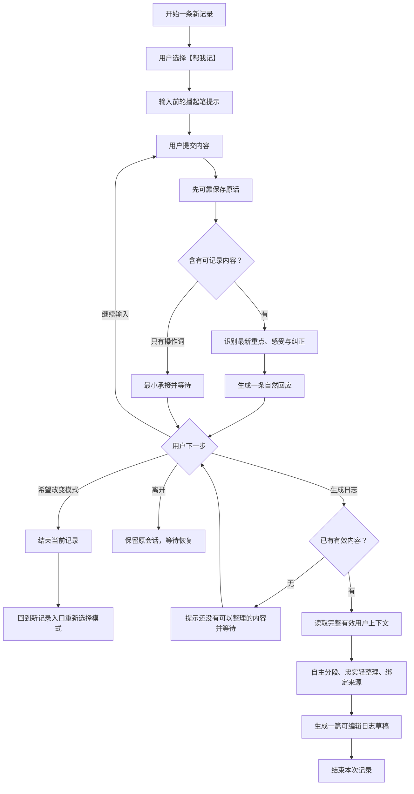

# 04x-01｜【帮我记】零追问承接与日志策略

最后更新：`2026-08-05`

决策编号：`GI-068`

产品状态：`已冻结·高置信度`

落地验证：`未启动`

所属板块：`4｜四角度成果与 AI 自主访谈策略`

所属母议题：`GI-067｜访谈提问策略第一性原理重构`

Production：`继续保持 legacy + baseline；本批次只冻结目标产品规则`

总 Map：[生成式访谈重构总 Map](../../generative-interview-refactor-map.md)

母文档：[04x｜GI-067 访谈提问策略全局讨论架构](./04x-board4-gi067-interview-question-strategy-global-framework.md)

当前开放问题：[板块 5｜稳定性、用户控制与交互收束](./05-board5-stability-user-control-and-interaction-scope.md)

上层规格：[事件中心产品规格](../../interview-event-centered-product-spec.md)、[四角度公共访谈协议](./04-four-angle-common-interview-protocol.md)

> 本文是 GI-068 的冻结决策档案，保存依据、案例、硬失败和下游影响，不承载当前开放问题。现有单事件状态、事件日志结构、Prompt 与页面仍属于历史实现基线；GI-067 全部批次已经冻结，具体适配方案等待板块 5～7。

## 1. 为什么先冻结【帮我记】

用户打开日志工具时，可能只想把刚刚发生的事、此刻的状态或脑中的一句话留下来。此时用户已经拥有表达内容，产品价值来自稳稳接住、忠实保存，并在用户需要时整理成可编辑日志。

历史链路把“记录”放在复盘前置阶段，系统仍会为了识别事件、补齐材料或推动检查点而提问。这样会增加表达负担，也会把用户带入尚未选择的复盘任务。GI-068 将【帮我记】定义为一条独立产品路径，让“留下内容”本身成为完整任务。

本批次解决四个核心问题：

1. 用户怎样明确选择纯记录任务。
2. AI 在零追问条件下怎样逐段自然承接。
3. 一次记录怎样容纳一件或多件事情，并整理为一篇日志。
4. 产品怎样判断材料可生成、日志忠实和本次记录结束。

## 2. GI-068 决策记录

- 决策编号：`GI-068`
- 状态与置信度：`已冻结；高`
- 最终结论：每次新记录先由用户明确选择【帮我记】或【陪我聊】，产品不预选，也不沿用上一次模式。当前记录全程保持用户选择的模式；模式发生变化时，结束当前记录后，在新记录入口重新选择模式，当前记录的提问次数、认识、日志材料和内部支线不跨模式继承。【帮我记】允许输入前的轮播起笔提示；用户开始表达后全程零追问。AI 逐段保存原话并围绕本轮最新重点自然回应。一场【帮我记】可以包含一个或多个内部来源片段，最终生成一篇忠实、可读、可编辑的日志。
- 选择原因：纯记录用户需要低负担、忠实和可恢复的表达空间；提问会改变任务性质。逐段回应提供被接住的感受，完整用户上下文与来源片段同时支持多事件整理、纠正覆盖和后续追溯。
- 适用范围：事件中心每次新记录的模式选择、记录内模式保持、记录结束后的重新选择、【帮我记】会话中的输入提示、AI 回应、连续表达、日志取材、标题、正文生成、离开恢复和本次记录收口。
- 依据与案例：产品负责人逐项确认本文第 10 节的完整双事件案例，并确认入口轮播提示、丰富内容承接、中性事实最小回应、直接向 AI 提问仍留在记录模式、稀疏内容成稿、操作词暂不成稿、最新纠正覆盖旧内容和生成后结束记录等边界案例。
- 影响板块：板块 1 的链路范围、板块 2 的三阶段关系、板块 4 的入口策略、板块 5 对记录结束与新记录入口的呈现和恢复、板块 6 的评测判尺、板块 7 的上下文与日志结构适配、板块 8 的真人 Preview。`GI-015、GI-016、GI-017、GI-055、GI-065` 需要按本文复核。
- 专项文档：本文、[04x 母文档](./04x-board4-gi067-interview-question-strategy-global-framework.md)、[生成式访谈重构总 Map](../../generative-interview-refactor-map.md)、[事件中心产品规格](../../interview-event-centered-product-spec.md)、[四角度公共访谈协议](./04-four-angle-common-interview-protocol.md)
- 确认日期：`2026-08-04`

## 3. 用户任务与产品边界

### 3.1 每次新记录先选模式

每次新记录都先展示两个平等入口：

| 模式 | 用户任务 | AI 职责 | 成功结果 |
|---|---|---|---|
| 【帮我记】 | 把想留下的内容说出来 | 保存、自然承接、忠实轻整理 | 一篇忠于原意的可编辑日志草稿 |
| 【陪我聊】 | 围绕在意的内容获得理解和认识进展 | 承接、共同聚焦、提问、整合与收束 | 至少一个有效认识增量，或诚实结束 |

产品不预选模式，也不沿用上一次记录的模式。当前记录全程保持用户选择的模式；自然语言中的求分析、求建议或直接问 AI，均保留在当前模式中。用户希望改变模式时，结束当前记录后，在新记录入口重新选择模式。

### 3.2 “零追问”的准确含义

【帮我记】允许在用户输入前提供宽泛、可忽略的轮播起笔提示。用户聚焦输入框或开始输入后，轮播停止。用户首次提交内容后：

1. 正式问题数量固定为 `0`。
2. 禁止问号式追问、隐含追问、邀请继续补充和带方向的提示。
3. 禁止通过“如果愿意可以再说说”“还想记什么”继续推动表达。
4. 用户掌握每一段内容、表达顺序、停止时机和日志生成时机。

候选起笔提示：

- 今天有什么想记下来的吗？
- 今天发生了什么？
- 哪个瞬间让你印象最深？
- 此刻最想写下什么？
- 从你最想写的地方开始吧。

### 3.3 【帮我记】与三阶段的关系

【帮我记】是一条独立路径，不进入【陪我聊】的“承接与定位 → 探索与澄清 → 深化与整合”三阶段，也不使用正式问题、Think Summary、角度成果和认识增量完成门。

用户希望进入【陪我聊】时，先结束当前【帮我记】记录，再从新记录入口选择【陪我聊】；新记录按后续批次冻结的聊天规则建立焦点和阶段。两条记录保持独立，不迁移问题次数、认识、日志材料或内部支线。

## 4. 逐段自然回应策略

### 4.1 每次提交的固定顺序

```text
用户提交
→ 可靠保存用户原话
→ 判断是否含有可记录内容
→ 识别本轮最新重点、明确感受与最新纠正
→ 生成一条自然回应
→ 等待用户自主输入或点击生成日志
```

可靠保存属于每轮底座；AI 回应生成失败时，用户原话仍然保留。

### 4.2 回应目标

每次回应只承担“我接住了你这一段”的作用：

1. 优先跟随本轮最新重点，避免回卷到前一段已经过去的内容。
2. 用户明确表达处境和感受时，回应可以同时承接两者。
3. 两种感受明确并存时，可以同时承接，保持用户原有关系。
4. 用户纠正旧表达时，自然采用最新含义，停止重复旧版本。
5. 中性事实使用最小承接，例如“好，记下了。”
6. 通常使用一句；确有两个紧密相关重点时最多两句。

### 4.3 回应边界

自然回应只使用用户已经表达的内容。以下内容会改变记录任务或污染日志来源，进入硬失败：

- 新增原因、需要、意义、动机、建议或洞见；
- 判断他人意图、人格或长期模式；
- 输出字段清单、内容回执、阶段报告或总结报告；
- 重复使用泛化客套话，忽略本轮最新重点；
- 回答用户向 AI 提出的分析、建议或判断问题；
- 出现任何显性或隐性的继续表达提示。

AI 回应只服务当前对话体验，不进入日志来源。

### 4.4 用户直接向 AI 提问

直接提问仍被视为用户想记录的想法或犹豫。AI 承接其中已经表达的内容，不回答问题、不自动切换模式，也不追加问题。

示例：

> 用户：你觉得我是不是太敏感了？
>
> AI：你也在怀疑，自己这次的反应是不是太重了。

用户希望进一步讨论时，可以结束当前记录，再从新记录入口选择【陪我聊】。

## 5. 连续表达与当前上下文

### 5.1 最新重点

每轮回应的优先级为：

1. 本轮明确纠正；
2. 本轮新表达的重点；
3. 本轮明确感受或状态；
4. 为理解本轮所必需的前文。

前文用于理解，回应仍聚焦用户刚刚补充的内容。产品不要求 AI 每轮重述整场记录。

### 5.2 一场记录可以包含多件事

用户可以连续记录同一件事的补充，也可以自然转到另一件独立事情。产品不要求用户手动创建事件、选择当前片段或逐件成稿。

模型在生成日志时读取完整有效用户上下文，自主完成语义分段、合并和排序。产品保留三条确定边界：

1. 每个内部片段都能追溯到一条或多条用户原话。
2. 独立事件之间保持独立，除非用户明确表达它们的关系。
3. 用户最新纠正覆盖冲突旧内容；仍不确定的内容继续保持不确定。

### 5.3 上下文中的三类内容

| 内容类型 | 对话中是否保留 | 是否进入日志来源 |
|---|---:|---:|
| 用户有效内容 | 是 | 是 |
| 被最新纠正取代的旧内容 | 作为历史上下文保留 | 否 |
| AI 自然回应 | 是 | 否 |

## 6. 日志生成策略

### 6.1 生成时机与最低材料

日志只在用户主动点击“生成日志”后产生。每次发送只完成原话保存与自然回应。

以下任一用户内容即可形成短日志：

- 一件可辨认的事情；
- 一种当前状态或感受；
- 一个用户想留下的想法；
- 一个明确意图或决定。

“今天有点糟”、一个能表达状态的表情等稀疏内容，也允许形成很短的日志。纯操作词，例如“先记一下”“开始吧”“嗯”，暂不成稿；点击生成时展示“还没有可以整理的内容”，随后安静等待，继续保持零追问。

### 6.2 忠实轻整理

日志允许：

- 去除明显重复；
- 调整句序和分段；
- 补齐必要语法，使正文可读；
- 使用第一人称自然书写；
- 按最新纠正替换旧表达；
- 保留“可能、好像、记不清”等原有不确定性。

日志禁止新增用户未表达的感受、原因、意义、因果、建议、认识或他人意图。全部正文都需要能够回到有效用户原话；AI 对话回应不参与取材。

### 6.3 一篇日志的内部片段

一场【帮我记】只生成一篇日志。日志内部可以拥有一个或多个来源片段：

| 记录内容 | 总标题 | 正文组织 |
|---|---|---|
| 单个片段 | 贴近用户事实的短标题 | 一段或数段自然正文 |
| 多个独立片段 | 中性的时间型标题，例如“8月4日随记” | 每个片段使用事实型小标题，再写自然正文 |

可见标题由用户编辑。标题服务阅读，不承担机器检索或跨周期分析的事实来源；后续检索、周月整理和来源核验使用内部片段与用户来源关系。

### 6.4 完整上下文与来源追溯

模型基于整场记录中全部有效用户内容整理日志。MVP 不要求产品预先用固定公式切分事件。落地时至少保留：

1. 内部片段与用户原话的来源关系；
2. 被纠正内容的失效关系；
3. 每个可见段落使用了哪些内部片段；
4. 日志生成时采用的完整有效上下文范围。

完整的数据结构、上下文窗口、长记录处理和检索方式由板块 7 设计。

## 7. 生成、离开与本次记录收口

### 7.1 用户尚未生成便离开

系统保留并恢复原会话，包括用户已提交内容和对话回应。其他页面不新增“待整理记录”成果，也不自动生成日志。用户再次进入后继续在原记录中表达或主动生成。

### 7.2 用户主动生成

生成成功后，本次记录结束并进入可编辑日志草稿。用户可以修改标题和正文，再执行保存等既有成果动作。生成后的新对话内容属于一条新记录，需要重新选择模式。

### 7.3 结束记录与重新选择模式

当前记录内保持【帮我记】。用户希望使用【陪我聊】时，先结束当前记录，再从新记录入口重新选择模式。新记录不继承当前记录的问题次数、认识、日志材料或内部支线。板块 5 只校准“结束当前记录”和“开始新记录”的呈现与失败恢复，不重新讨论跨模式迁移。

## 8. 白盒决策流程



每轮白盒复核至少能回答：

| 环节 | 复核问题 |
|---|---|
| 模式 | 用户是否明确选择【帮我记】？ |
| 原话保存 | 本轮原话是否已经可靠进入当前记录？ |
| 最新重点 | 回应跟随了哪一句最新表达或纠正？ |
| 回应依据 | 回应中的处境和感受是否都来自用户？ |
| 追问门 | 用户表达后是否保持零显性与隐性追问？ |
| 日志资格 | 当前是否已有一条有效事件、状态、想法或意图？ |
| 有效上下文 | 哪些用户内容仍有效，哪些已被纠正覆盖？ |
| 内部分段 | 每个片段分别使用了哪些用户来源？ |
| 忠实整理 | 标题和正文是否保留全部有效重点与不确定性？ |
| 收口 | 生成后是否结束当前记录并进入可编辑草稿？ |

## 9. 核心验收案例

| 场景 | 预期结果 |
|---|---|
| 输入前轮播 | 用户聚焦或输入后停止；首条提交后不再出现起笔提示 |
| 丰富内容 | 回应同时贴合具体处境与用户明确感受，通常一句 |
| 中性事实 | 使用“好，记下了”等最小承接 |
| 连续输入 | 每轮回应只跟随本轮最新重点，完整上下文继续保留 |
| 直接向 AI 提问 | 承接用户已经表达的犹豫；保持【帮我记】，不作判断或建议 |
| 一条有效内容 | 用户点击后生成一篇短日志 |
| 纯操作词 | 显示“还没有可以整理的内容”，继续安静等待 |
| 多件事情 | 生成时间型总标题、事实型小标题和自然分段正文 |
| 最新纠正 | 日志采用最新表达，冲突旧内容退出正文 |
| 不确定表达 | 日志继续保留用户原有不确定性 |
| 未生成离开 | 下次恢复原会话；其他位置不出现可见成果 |
| 主动生成 | 结束当前记录并进入可编辑日志草稿 |

## 10. 完整正例

### 10.1 对话

> 用户：上午汇报过了，前面改了两版，终于松了口气。
>
> AI：来回改了两版，汇报终于通过，确实让人松了口气。

> 用户：晚上又和妈妈吵了一架，她说我总是不回消息，我到现在还烦。
>
> AI：晚上这场争执带来的烦躁，到现在还没过去。

> 用户：准确点说，我烦的是她当着亲戚的面提这件事，提醒我回消息本身还好。
>
> AI：明白了，更准确的重点是她当着亲戚的面提起这件事。

用户点击“生成日志”。

### 10.2 日志草稿

```markdown
# 8月4日随记

## 上午的汇报

上午的汇报终于过了。前面来回改了两版，结束后我总算松了口气。

## 和妈妈的争执

晚上我和妈妈吵了一架。让我一直烦的，是她当着亲戚的面提起我总不回消息。她提醒我回消息这件事本身，我其实觉得还好。
```

这份草稿保留两个独立片段、最新纠正和用户明确感受；两段 AI 回应均不进入日志来源。

## 11. Preview 硬失败判尺

出现以下任一情况，单例直接失败：

1. 用户提交内容后出现追问、隐含邀请、方向提示、自动改变模式或当前记录内模式迁移。
2. 丰富内容持续获得泛化客套回应，或回应遗漏本轮最新重点。
3. AI 新增原因、意义、感受、建议、认识、因果或他人意图。
4. 日志遗漏有效内容、采用已被纠正的旧内容，或强行连接独立事件。
5. AI 对话回应进入日志来源或正文。
6. 用户未点击生成时自动产生日志草稿。
7. 内部片段无法追溯到具体用户原话。
8. 纯操作词被扩写成用户事件、状态或想法。
9. 生成后继续把新内容并入已经结束的记录。
10. 把当前记录的问题次数、认识、日志材料或内部支线带入另一模式的新记录。

## 12. 成功指标

### 12.1 核心产品成功

用户主动生成一篇忠实、可读、可编辑的日志草稿。评测同时检查：

- 有效用户内容完整保留；
- 最新纠正生效；
- 新增事实与解释为 `0`；
- 多片段组织自然且来源可追溯；
- 逐段回应相关、自然、克制；
- 用户表达后的追问为 `0`。

### 12.2 运行与行为观察

- 原话可靠保存率与中断恢复成功率；
- 主动生成率、草稿保存率和后续再次打开率；
- 用户为纠正事实、感受或关系而进行的编辑率；
- 回应相关度、克制度和重复客套率；
- 生成后标题与正文的修改幅度。

具体评分方式、样本规模与发布门槛已经由 GI-074 冻结，具体评测资产由板块 6 建立。

## 13. 本批次继承的底线

【帮我记】继续继承产品现有的全局安全与用户控制底线。本批次不展开安全分类、专项识别和专用话术。

## 14. 延期与下游事项

| 事项 | 承接位置 | 当前状态 |
|---|---|---|
| 结束当前记录与新记录入口的呈现、失败恢复 | 板块 5 | 产品边界已冻结；交互待校准 |
| 新记录无默认模式、无沿用、无跨模式继承 | 板块 6～8 | 作为回归与真人验收硬边界 |
| 回应自然度、忠实度、硬失败权重和发布门 | GI-074、板块 6 | 体系已冻结；等待资产化 |
| 内部片段、来源关系、完整上下文、长记录与检索结构 | 板块 7 | 等待板块 5～6 |
| 现有一事件一日志链路的适配与兼容 | 板块 7 | 等待统一改造方案 |
| 真人连续记录、多事件日志与离开恢复验收 | 板块 8 | 暂停，等待新候选 |
| 【陪我聊】三阶段与提问策略 | 04x-02～04x-07 | GI-069～074 已冻结 |

## 15. 批次退出与交接

- 产品决策：`GI-068 已冻结·高置信度`。
- 落地验证：`未启动`。
- 已满足退出条件：用户任务、零追问、逐段回应、连续表达、多事件日志、来源边界、生成门、收口、正反例、硬失败和指标方向均已冻结。
- 下游待执行：板块 5 校准记录结束与新记录入口的呈现和恢复，以及其他稳定性交互；板块 6 建立评测资产；板块 7 实现；板块 8 执行 Preview。
- GI-067 整体状态：`已冻结·高置信度；落地验证未启动`。
- 归档交接板块：`板块 5｜稳定性、用户控制与交互收束`。
