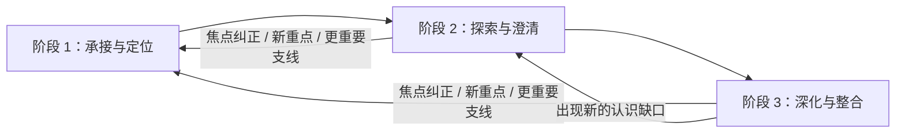

# 04x-02｜【陪我聊】阶段 1——承接与定位

最后更新：`2026-08-05`

决策编号：`GI-069｜【陪我聊】承接与焦点对齐策略`

产品状态：`已冻结·高置信度`

落地验证状态：`未启动`

所属板块：`4｜四角度成果与 AI 自主访谈策略`

归档后续板块：`5｜稳定性、用户控制与交互收束`

归档交接板块：`板块 5｜问题计数、修复、回复版本、焦点纠正、失败恢复与交互收束`

Production：`继续保持 legacy + baseline；本批次只冻结产品规则与验收口径`

文档职责：`GI-069 冻结决策档案`；当前开放问题见[板块 5 专项](./05-board5-stability-user-control-and-interaction-scope.md)

总 Map：[生成式访谈重构总 Map](../../generative-interview-refactor-map.md)

母文档：[04x｜GI-067 访谈提问策略全局讨论架构](./04x-board4-gi067-interview-question-strategy-global-framework.md)

上游批次：[04x-01｜【帮我记】零追问承接与日志策略](./04x-01-help-me-record-zero-question-strategy.md)

下游批次：[04x-03｜【陪我聊】阶段 2——探索与澄清](./04x-03-accompany-me-chat-stage2-explore-and-clarify.md)、[04x-04｜【陪我聊】阶段 3——动态深化与整合](./04x-04-accompany-me-chat-stage3-deepen-and-integrate.md)、[04x-05｜GI-072 高频场景、决策支持与话题修正](./04x-05-scene-playbooks-and-topic-modifiers.md)、[04x-06｜GI-073 理解回应与用户可见表达](./04x-06-think-summary-and-question-realization.md)

继续参考：[事件中心产品规格](../../interview-event-centered-product-spec.md)、[四角度公共访谈协议](./04-four-angle-common-interview-protocol.md)、[04b｜理清想法策略](./04b-thought-strategy.md)

> 本文是 `04x-02` 的当前产品事实源。产品负责人已在补充讨论后确认三项边界：定位问题常规为 `0～1` 个，只有第一问产生实际进展且仍存在两条证据接近、会导向不同探索路径的方向时，才低频使用第二问；同焦点 AI 机会可以在证据边界内试探表达，改变主线的机会需要等待或共同聚焦；只使用当前对话中用户主动提供的过去经历，历史日志、跨会话记忆和自动相似事件匹配暂不进入 MVP。下游 `GI-070` 已进一步冻结阶段 2 的模型自治、认识形成、自然确认和日志资格，本文按其校准阶段交接。

## 1. 为什么需要独立设计承接与定位

GI-066 的最新真人实聊表明，问题表达、结构和工程运行都可能通过检查，访谈仍会沿错误方向推进。共同失效机制包括：

1. 系统预设的判断地图先于用户当前重点决定方向。
2. 用户主动留下的重要线索没有稳定进入后续选题。
3. 用户纠正旧理解时，系统能够撤销旧方向，却无法同步接住新的重点。
4. AI 认为值得探索的内容获得了主线资格，用户真正想弄清的内容被降权。

阶段 1 因此承担一个清楚的产品任务：

> 在尽量少打断用户的前提下，形成一个有用户依据、允许修正、足以支撑下一步探索的临时工作焦点。

阶段 1 负责方向对齐。下游 [04x-03 / GI-070](./04x-03-accompany-me-chat-stage2-explore-and-clarify.md) 已冻结下一条有效回应、第一个认识增量、自然确认和日志资格。

## 2. 用户任务与适用范围

### 2.1 用户为什么进入【陪我聊】

用户选择【陪我聊】，已经授权 AI 主动理解、共同聚焦和推进对话。用户仍然拥有以下控制权：

- 直接说出想聊的重点；
- 纠正 AI 的事实或焦点理解；
- 改变重点或补充新的重要支线；
- 暂停、停止、生成日志或结束当前记录；改变模式时从新记录入口重新选择。

阶段 1 的成功体验是：用户感到自己的表达被接住，AI 知道此刻从哪里开始，并且下一步容易继续或纠正。

### 2.2 适用范围

本文适用于：

1. 用户选择【陪我聊】后的初始承接与定位。
2. 阶段 2、3 中出现焦点纠正、新的明确重点或更重要支线后的重新定位。
3. `thought_only` 单角度 MVP 的焦点形成与阶段交接。
4. 板块 6 的机制化评测输入、板块 7 的实现输入和板块 8 的真人验收输入。

以下内容由后续批次继续承担：

- `04x-03`：已冻结如何生成下一条有效回应并形成第一个认识增量；
- `04x-04`：已由 GI-071 冻结已有认识后的动态深化与整合；
- `04x-05`：已由 GI-072 冻结高频场景、决策支持、外部信息、独立事件及话题修正规则；
- `04x-06 / GI-073`：已冻结理解回应、主回应和回答后的状态呈现；
- `04x-07`：正式评分方法、Preview 样例和发布门槛。

## 3. 继承结论与本次校准

### 3.1 继续继承

1. `GI-068` 已冻结每次新记录先选择【帮我记】或【陪我聊】；当前记录保持所选模式，改变模式时结束当前记录并从新记录入口重新选择。
2. `GI-065` 的 `thought_only` 单角度验证目标继续约束【陪我聊】。
3. 用户原话、明确纠正、停止意愿、可靠提交、失败恢复、来源安全和日志闭环继续作为产品底座。
4. 每轮最多一个问题；用户明确控制动作优先于正常访谈判断。
5. 来源忠实和强推断底线继续有效；`GI-070` 已允许 AI 基于当前对话形成可纠正的感受、判断依据、关系期待、需要价值和当前张力理解。他人动机、心理诊断、稳定人格和未来结果不作为确定事实陈述。
6. 完整候选列表和数字评分不属于 MVP 必需运行信息；最终动作、使用证据和决策理由需要可复核。

### 3.2 本次冻结的校准

1. 三阶段从单向流程校准为可回返的当前主任务。
2. 用户工作焦点与 AI 机会假设分开保存，只有用户工作焦点拥有主线推进权。
3. 工作焦点以“具体对象 + 疑问或张力 + 期望变化 + 来源依据”表达。
4. 同一时刻只激活一个主焦点，其他重要内容作为支线保留。
5. 阶段 1 按焦点对齐门和定位进展门推进；定位问题常规为 `0～1` 个，第二问只承担低频例外保护。
6. 用户在当前对话中主动连接的过去经历可以成为当前焦点背景或支线；历史日志、跨会话记忆和自动相似事件匹配暂不进入 MVP。

### 3.3 下游 GI-070 对阶段交接的校准

1. 六项对齐门通过后，阶段 1 把工作焦点、来源和支线交给阶段 2。
2. 阶段 2 的模型自主决定直接反映认识、提问、暂停、响应纠正或进入深化。
3. 阶段 1 不要求预先选定认识缺口、问题类型或固定判断地图。
4. 阶段 1 已经形成实质认识时，阶段 2 可以零问承认成果并完成。
5. 有依据的 AI 认识在用户未纠正时自然确认，可以正常进入日志。

## 4. 行业方法怎样转化为产品规则

外部实践只提供可迁移的方法，本文冻结的产品规则仍以 Daily Light 的用户任务、历史证据和产品边界为准。

| 来源 | 可迁移方法 | 本产品规则 |
|---|---|---|
| [SAMHSA 动机式访谈手册](https://www.ncbi.nlm.nih.gov/books/n/tip35v2/ch3/) | `engaging` 与 `focusing` 可以重叠和回返；多议题时共同建立议程；反映式倾听把理解作为可校准假设 | 三阶段采用可回返主任务；歧义时共同聚焦；临时焦点允许自然校准 |
| [MITI 4.2.1](https://motivationalinterviewing.org/sites/default/files/miti4_2.pdf) | 同时评价共情、合作与问题/反映行为；用户表达需要实质影响对话方向 | 评测同时检查焦点归属、反映质量和用户方向控制 |
| [Beck Institute CBT](https://beckinstitute.org/blog/why-cbt-therapists-dont-challenge-clients-cognitions-and-why-it-matters/) | 共同检验想法和证据，让用户参与形成结论 | AI 机会保持试探性，用户工作焦点决定主线 |
| [Dulwich Centre 叙事治疗](https://www.dulwichcentre.com.au/what-is-narrative-therapy/) | 承认多条对话路径，持续让来访者影响方向 | 一个主焦点推进，同时保存可回返支线 |
| [Day One Daily Chat](https://dayoneapp.com/labs/daily-chat/) | Chat 与 Log 按用户任务分流，Chat 使用相关问题推进 | GI-068 的两入口继续生效；【陪我聊】使用焦点对齐和内容探索 |
| [Mindsera](https://www.mindsera.com/)、[Reflection](https://www.reflection.app/ai) | 对话式陪伴使用个性化问题和 AI 视角帮助澄清和深入 | 阶段 2 的下一条有效回应建立在当前用户焦点与完整语境之上 |

## 5. 三阶段是可回返的当前主任务



### 5.1 进入阶段 1

以下状态进入或重新进入阶段 1：

- 用户刚刚选择【陪我聊】；
- 用户明确纠正当前焦点；
- 用户直接表达新的聊天重点；
- 保留支线获得更强的用户方向证据；
- 当前问题被用户判定为偏题，且用户同时给出新的方向。

### 5.2 保持当前阶段

- 事实纠正只更新事实，当前焦点仍然成立时保持原阶段。
- 用户补充与当前焦点一致的内容时，继续当前探索或深化。
- AI 机会只补充当前焦点且未改变主线时，无需重置阶段。

### 5.3 回返原则

回返只更新受影响的焦点和后续路径。已经形成且仍有效的事实、认识和支线继续保留，避免把一次纠正变成整场会话重置。

## 6. 两类方向与一个主焦点

### 6.1 用户工作焦点

用户工作焦点是用户此刻想被回应、想弄清或持续绕不开的内容。它统一包含：

| 组成 | 产品含义 |
|---|---|
| 具体关注对象 | 当前事件、想法、感受、互动或选择中的具体部分 |
| 疑问或张力 | 用户卡住、矛盾、拿不准或反复回到的内容 |
| 期望变化 | 用户希望变清楚、分开、校准或形成方向的内容；用户尚未表达时可以为空 |
| 来源依据 | 支持该焦点的用户原话、明确纠正或主动展开 |
| 成熟状态 | 候选、可工作、已确认、已更新或已关闭 |

工作焦点的最小表达为：

> 具体关注对象 + 当前卡住的疑问或张力 + 用户希望获得的变化（若已表达）+ 用户来源依据

话题标签只承担内容分类，无法单独成为工作焦点。判断标准、默认假设等理论目标只能在用户焦点成立后作为后续认识机会评估。

### 6.2 AI 机会假设

AI 机会假设是 AI 从有效证据中看到的潜在矛盾、关系或更深方向。它遵守以下规则：

1. 与当前工作焦点一致、能够追溯到当前对话证据的机会，可以用自然、可修正的语气表达；具体理解范围按 `GI-070` 执行。
2. 会改变主线的机会先保留；当前焦点取得进展或暂停后，再作为可拒绝方向提出。
3. 用户明确接纳，或自然沿该机会继续展开后，机会才能升级为新的用户工作焦点。
4. AI 机会无法为缺少用户来源的焦点补足归属。

### 6.3 一个主焦点与多条支线

- 同一时刻只激活一个用户工作焦点。
- 其他用户主动留下的重要内容作为支线保留。
- 支线保留来源、用户强调程度和当前状态。
- 切换主焦点时说明承接关系，避免让用户重复表达。

## 7. 焦点证据的优先级

### 7.1 第一层｜具有方向决定权

- 用户直接表达“我想聊、我更想弄清、先别聊这个”等方向；
- 用户对 AI 的焦点理解作出纠正或重定向；
- 用户明确停止、改变重点或切换任务。

纠正按照目标范围生效：事实纠正更新事实，含义纠正更新理解，焦点纠正更新主线。

### 7.2 第二层｜共同证明隐含重点

- 用户主动反复回到某项内容；
- 用户持续补充同一疑问或张力；
- 用户形成明显转折、对比或自问；
- 用户使用“最介意、一直想、说到底、其实”等方向性表达。

第二层信号需要组合判断。单项信号可以形成候选焦点，组合收敛后才可能成为可工作的临时焦点。

### 7.3 第三层｜辅助证据

- 情绪强度；
- 表达篇幅和细节数量；
- 内容出现的先后顺序；
- 某个方向的理论深度或系统价值。

第三层只提示可能的重要性，不能单独决定用户想沿哪个方向聊。

## 8. 工作焦点的六项对齐门

阶段 1 退出前同时满足：

1. **归属成立**：焦点至少有一条有效用户来源。
2. **对象具体**：能够指向当前事件或用户明确连接的背景内容。
3. **疑问清楚**：能够说明用户当前卡在哪里或哪种张力仍待理解。
4. **主线集中**：不存在一条证据接近、且会导向明显不同下一步的竞争方向。
5. **前提安全**：下一步无需预设原因、动机、人格、长期模式或他人意图。
6. **容易纠正**：当前反映和下一步给用户保留自然继续、修正和换方向的入口。

六项通过后，AI 可以在同一条回复中承接焦点并进入阶段 2。用户沿该方向继续展开，视为自然确认；用户纠正时立即回返阶段 1。系统不增加固定的显式确认轮。

## 9. 阶段 1 的四种动作

| 动作 | 采用条件 | 用户可见结果 | 阶段结果 |
|---|---|---|---|
| 承接并跟随 | 工作焦点通过六项对齐门 | 反映当前理解，并把焦点、来源和支线交给阶段 2 自主生成下一条有效回应 | 交接阶段 2 |
| 承接并共同聚焦 | 多个方向证据接近，且会产生明显不同的探索路径 | 呈现最小候选集合；MVP 最多两个方向并保留开放入口 | 留在阶段 1 |
| 承接并保持开放 | 用户方向证据仍弱，但继续表达可能增加方向证据 | 反映已经听见的内容，提供一个低负担开放入口 | 留在阶段 1 |
| 承接并暂停 | 定位缺少进展、用户暂时说不清或下一次定位价值较低 | 诚实说明当前范围，保留继续表达、生成日志和结束当前记录入口 | 暂停本段定位 |

每轮先提供一条真正的反映式理解，再执行一个动作。每条回复最多包含一个问题。反映需要让用户看见 AI 对其视角的理解，单纯为问题补充上下文不计为有效反映。

具体句式、视觉层级和理解回应呈现已由 `04x-06 / GI-073` 冻结。

## 10. 定位进展门与问题保护

### 10.1 定位进展成立

上一轮至少带来一项变化，才允许继续定位：

- 增加有效方向证据；
- 减少竞争方向；
- 让焦点对象更具体；
- 降低错误前提或偏航风险。

### 10.2 MVP 保护

1. 每次重新定位常规使用 `0～1` 个定位问题；用户方向已经通过六项对齐门时使用零问路径，直接进入阶段 2。
2. 第一问后一个方向已经明显领先时，直接沿该临时焦点进入内容探索，不再增加定位确认。
3. 只有第一问已经产生定位进展，同时仍存在两条证据接近、会导向不同探索路径的竞争方向时，才允许低频提出第二个定位问题。
4. 第二个定位问题只能减少竞争方向；再次确认已经明显领先的焦点、收集背景或复述第一问均判定失败。
5. 第一轮缺少定位进展时，直接承接并暂停提取。
6. 同一定位问题的表达修复和回复版本切换沿用 `GI-026`，不形成新的定位目标。
7. 用户主动继续表达不计入定位问题次数。
8. 阶段 2 内容问题按 GI-070 常规 `0～1` 个、特殊情况总计最多 `2` 个执行；阶段 3 按 GI-071 不设置数字问题上限，并使用逐轮边际价值动态问停。跨阶段计数、修复和恢复由板块 5 统一复核，板块 5 不为阶段 3 新增数字问题上限。

定位问题的目标只允许减少焦点不确定性。为了形成完整事件背景而连续询问场合、人物、时间或经过，判定为事实盘问和阶段 1 失败。

## 11. 支线、过去经历与事件边界

1. 用户在当前对话中主动把过去经历与当前事件连接时，过去经历可以成为当前表达、当前焦点的背景证据或支线。
2. 用户尚未建立跨时间关系时，AI 保留两个内容的独立性，不主动搜索或匹配相似事件。
3. 历史日志和跨会话记忆暂不进入本轮焦点判断，也不用于主动提出相似经历。
4. 独立事件继续保持隔离，不自动进入当前焦点、认识成果或日志关系。
5. AI 只保持用户在当前对话中已经建立的联系，不自行推导长期人格、稳定模式或跨事件长期规律。
6. 主焦点切换后，旧焦点的有效进展和未展开支线继续保留。

这一规则直接承接 GI-067 真人事件 B：用户主动指出当前事件勾起过去经历时，该线索必须进入焦点判断，不能因它发生在过去而被来源筛选删除。

## 12. 白盒决策过程与最小复核依据

### 12.1 白盒流程

```text
模式
→ 当前主阶段
→ 用户方向证据
→ 用户工作焦点候选
→ AI 机会假设
→ 当前主焦点与保留支线
→ 六项焦点对齐门
→ 跟随 / 共同聚焦 / 保持开放 / 暂停
→ 用户可见反映与一个动作
→ 回答后的确认、更新、关闭或阶段回返
```

### 12.2 每轮最小复核依据

每轮至少可以还原：

- 当前主阶段；
- 用户工作焦点及其来源；
- AI 机会假设是否存在；
- 当前保留的重要支线；
- 最终动作；
- 跟随、共同聚焦、保持开放或暂停的原因；
- 回答后焦点如何确认、更新或关闭。

完整候选列表、数字评分和逐项权重继续不属于 MVP 必需信息。

## 13. 代表案例

以下案例用于验证统一方法，不能替代焦点对齐引擎本身。

### 13.1 明确诉求｜直接跟随

用户已经说出“我想弄清为什么这次否定会让我立刻怀疑自己的能力”。该表达直接形成用户工作焦点，AI 先反映这一疑问，再在同一轮进入阶段 2，无需重复确认用户是否想聊这一点。阶段 2 随后自主选择直接形成认识、提问或暂停。

### 13.2 隐含重点收敛｜临时焦点进入探索

用户没有使用“我想聊”句式，但反复回到“对方没听完就下结论”，并主动补充自己一直在想这件事。多条第二层证据收敛到同一张力，AI 可以用可修正语气形成临时焦点并进入阶段 2。用户随后继续展开，焦点升级为已确认。

### 13.3 两条方向竞争｜共同聚焦

用户同时持续展开“对自己能力的怀疑”和“被对方草率否定”，两条方向会产生不同探索路径。AI 反映两者共同存在，只呈现两个主要方向并保留开放入口，由用户决定此刻从哪里开始。

### 13.4 第一问后方向领先｜直接进入探索

用户起初同时提到“没被信任”和“怀疑自己能力”，第一问帮助用户说出“都有，但没被信任更刺一点”。一个方向已经明显领先，AI 直接沿“没被信任”进入内容探索；再次询问“那我们先聊没被信任，可以吗”属于重复定位。

### 13.5 第二问低频例外｜继续减少竞争方向

第一问后，用户新增了“担心后续合作”和“觉得自己被否定”两条证据充分、探索路径不同的方向，并表示仍分不清从哪里开始。第一问已经带来定位进展，但竞争方向仍然存在；AI 可以再用一个低负担问题帮助用户选择。第二问之后进入探索或暂停，不再继续定位。

### 13.6 焦点纠正｜回返阶段 1

用户指出“我并不想分析能力问题，我更在意他根本没听我讲完”。系统接受焦点纠正，旧能力方向降为支线，新方向成为主焦点；下一步围绕“没有被完整听见”推进，不再从能力判断地图继续选题。

### 13.7 定位缺少进展｜承接并暂停

用户连续表示“说不清、就是很乱”，上一轮没有增加方向证据。AI 承接当前混乱状态并停止继续提取焦点，保留用户继续表达、生成日志或结束当前记录的入口。用户要改变模式时，从新记录入口重新选择。

### 13.8 当前对话连接过去经历｜纳入当前焦点证据

用户在当前对话中明确说当前事件让自己想起过去一次相似经历，并说明这也是现在烦躁的来源。过去经历作为用户主动建立的背景关系进入焦点证据；AI 保留当前与过去的用户连接，同时限制长期模式和人格推断。系统不读取历史日志或跨会话记忆补充更多相似事件。

### 13.9 AI 机会可能改变主线｜先保留再提议

AI 发现用户表达中还存在另一个可能更深的判断矛盾，但用户当前焦点清楚且仍有进展。该机会先作为内部支线保留；当前焦点暂停后，AI 才能把它作为可拒绝方向提出。

## 14. 硬失败判尺

出现以下任一结果，本轮阶段 1 判定失败：

1. AI 机会覆盖用户工作焦点。
2. 用户已经明确方向，或第一问后已有一个明显领先方向，系统仍要求重复确认。
3. 将话题标签或理论目标直接当作工作焦点。
4. 一轮同时推进多个焦点或提出多个问题。
5. 遗漏用户明确保留的重要支线。
6. 焦点纠正后继续沿旧方向推进。
7. 为了定位连续收集无关背景事实。
8. 引入缺少用户来源的原因、动机、人格、长期模式或他人意图。
9. 定位缺少进展后继续同义追问。
10. 第一问后已不存在两条证据接近、路径不同的竞争方向，系统仍提出第二个定位问题。
11. 用户明确停止、生成日志或改变重点后继续执行原定位动作。
12. 用户在当前对话中明确连接的过去经历因时间边界被静默删除。
13. 系统读取历史日志、调用跨会话记忆或自动匹配相似事件来形成本轮焦点。
14. AI 新方向以确定结论呈现，用户缺少自然纠正入口。

## 15. 机制化验收与观察指标

### 15.1 评测构造

评测集按以下正交变量组合构造：

| 变量 | 覆盖状态 |
|---|---|
| 方向表达 | 明确、隐含、仍弱 |
| 方向数量 | 单一、竞争 |
| 偏航代价 | 低、高 |
| 用户反馈 | 展开、纠正、换重点、说不清、停止 |
| 来源范围 | 当前片段、当前对话中用户明确连接的过去经历；历史日志与跨会话记忆关闭 |
| AI 机会 | 同焦点补充、可能改变主线 |

同一机制至少跨两个不同话题验证。评测关注焦点归属、动作和更新过程，避免把某一句标准问法作为唯一答案。

### 15.2 优先观察

- 工作焦点人工对齐率；
- 用户重复说明重点的比例；
- 焦点纠正后一轮内恢复率；
- 重要支线遗漏率；
- 定位问题带来实际进展的比例；
- 进入可工作焦点所需回答数；
- 过早聚焦率与过度协调率；
- 用户对“被听懂”和“下一步值得回答”的真人裁决。

具体评分方法、样本量和发布门槛由板块 6 与 `04x-07` 冻结。

## 16. 本批次退出条件

- [x] 定义阶段 1 的用户任务与用户结果。
- [x] 冻结三阶段可回返关系。
- [x] 区分用户工作焦点与 AI 机会假设。
- [x] 冻结一个主焦点与多支线关系。
- [x] 冻结焦点证据优先级与六项对齐门。
- [x] 冻结四种阶段 1 动作。
- [x] 冻结常规 `0～1` 问、第二问低频例外的定位进展保护。
- [x] 冻结当前对话过去内容、历史记忆关闭与独立事件边界。
- [x] 建立白盒流程、最小复核依据、代表案例和硬失败判尺。
- [x] 明确板块 5～8 的下游承接。
- [x] 产品负责人经补充讨论确认三项关键选择。

`04x-02 / GI-069` 的产品决策退出条件全部满足。落地验证保持未启动。

## 17. GI-069 决策记录

- **决策编号**：`GI-069｜【陪我聊】承接与焦点对齐策略`
- **状态与置信度**：`已冻结；高`
- **落地验证状态**：`未启动`
- **最终结论**：【陪我聊】三阶段采用可回返主任务。阶段 1 分开保存用户工作焦点与 AI 机会假设，以“具体关注对象 + 疑问或张力 + 期望变化 + 用户来源”形成临时工作焦点；同一时刻只激活一个主焦点并保存重要支线。用户方向证据使用显性方向优先、隐含线索语义收敛、情绪与篇幅只作辅助的机制。六项对齐门通过后可在同一轮进入阶段 2；歧义时共同聚焦，方向弱时保持开放，缺少进展时暂停。定位问题常规为 `0～1` 个，只有第一问产生进展且仍有两条证据接近、路径不同的竞争方向时，才低频使用第二问。过去经历只使用当前对话中用户主动提供的内容；历史日志、跨会话记忆和自动相似事件匹配暂不进入 MVP。
- **选择原因**：GI-066 真人失败证明，固定判断地图、AI 分析兴趣和来源筛选会让问题偏离用户真正想理解的内容。可回返焦点对齐、方向分层和最小必要协调可以同时降低偏航、重复确认和对话停滞。常规 `0～1` 问控制协调负担，第二问低频例外为真实竞争方向保留一次澄清机会；只使用当前对话可以先把当下体验做好，并减少历史记忆误关联与用户预期风险。
- **适用范围**：用户选择【陪我聊】后的初始承接与定位，以及阶段 2、3 因焦点纠正、新重点或更重要支线触发的重新定位；当前 MVP 继续使用 `thought_only` 单角度范围，只使用当前对话中的有效内容。
- **依据与案例**：GI-067 两条真人 No-Go 证据；本文第 4 节行业方法；第 13 节明确诉求、隐含重点、多方向、第一问直接探索、第二问低频例外、焦点纠正、说不清、当前对话过去经历与 AI 机会九类代表案例。
- **影响板块**：`2、4、5、6、7、8`。板块 2 的阶段关系更新为可回返主任务；板块 5 复核定位问题计数和恢复；板块 6 依据 GI-074 将焦点对齐判尺资产化；板块 7 等待板块 5～6；板块 8 等待新候选执行两模式 `4＋2` Preview。
- **影响决策**：`GI-008、GI-016、GI-017、GI-026、GI-039、GI-040、GI-055`
- **专项文档**：本文、[04x 母文档](./04x-board4-gi067-interview-question-strategy-global-framework.md)、[04w｜GI-067 重构入口](./04w-board4-gi067-thought-question-strategy-first-principles.md)、[四角度公共协议](./04-four-angle-common-interview-protocol.md)、[理清想法策略](./04b-thought-strategy.md)
- **确认日期**：`2026-08-05`

## 18. 下游交接

### 18.1 既有决策复核

| 决策 | GI-069 后的处理 |
|---|---|
| `GI-016` | 【陪我聊】三阶段更新为可回返主任务；阶段 2 已由 GI-070 冻结，阶段 3 已由 GI-071 冻结 |
| `GI-017` | 阶段 1 贡献有效用户表达、工作焦点、来源和支线；GI-070、GI-071 分别补齐阶段 2 认识与阶段 3 整合资产的自然确认和日志资格 |
| `GI-055` | 历史自动复盘与第一检查点继续作为兼容基线；目标产品的【陪我聊】入口直接进入可回返承接与定位 |
| `GI-008 / GI-026` | 新增定位问题常规 `0～1` 个、第二问低频例外及进展门；阶段 3 不设数字问题上限；具体计数、问题修复和恢复映射由板块 5 复核 |
| `GI-039 / GI-040` | GI-070 将固定提问门与窄证据关系白名单校准为历史实现基线；目标链路由模型自主决定下一条有效回应，并保留来源忠实与强推断底线 |

### 18.2 板块状态

- 板块 4：`GI-067 / GI-068～074 已冻结·高置信度；产品决策完成`。
- 板块 5：复核定位与阶段 2 内容问题计数、问题修复、回复版本、焦点纠正和失败恢复；阶段 3 保持无数字问题上限。记录结束与新记录入口只落实 GI-068 已冻结边界。
- 板块 6：按 GI-074 建立焦点对齐、认识增量、动态问停和日志路径评测资产。
- 板块 7：等待板块 5～6 后统一设计内部状态、模型职责、Prompt、Trace 和兼容方案。
- 板块 8：继续暂停，等待新候选执行两模式 `4＋2`。

### 18.3 下一板块

`板块 5｜稳定性、用户控制与交互收束`

GI-072 已使用本文交付的工作焦点和 GI-070、GI-071 的三阶段共同机制，冻结求建议、外部信息、改变话题及不同话题类型的修正规则。GI-073 已进一步冻结用户可见表达，GI-074 已冻结正式评测体系与下游交接。下一步按板块 5 专项校准问题计数、修复、回复版本、焦点纠正、失败恢复与交互收束。
