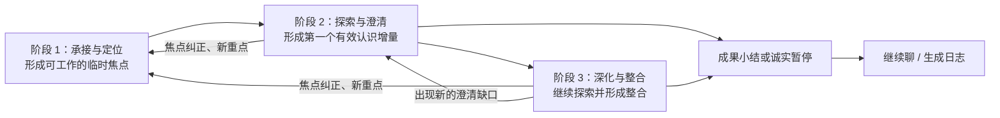

# 04x｜GI-067 访谈提问策略全局讨论架构

最后更新：`2026-08-10`

状态：`GI-067 全部七个批次已冻结；GI-068～080 保持关闭；板块 6 继续进行中`

置信度：`高`

当前板块：`6｜生成式访谈质量评测`

当前工作：`GI-088 v7 两条轨迹已封存，v7r1 No-Go，v7r2 Ark Flash 本地验证通过并等待 Preview 回读和 0/2 空白批次`

下一建议板块：`完成 v7r2 Preview 可靠性门；通过后进入 v8 统一问前决策，再回到板块 6B 扩建正式评测资产`

Production：`继续保持 legacy + baseline；本轮只更新产品讨论文档`

总 Map：[生成式访谈重构总 Map](../../generative-interview-refactor-map.md)

当前专项：[板块 6｜生成式访谈质量评测 v1](./04j-generative-quality-evaluation-v1.md)；冻结输入见[板块 5｜稳定性、用户控制与交互收束](./05-board5-stability-user-control-and-interaction-scope.md)

本轮重开入口：[04w｜GI-067 “理清想法”提问策略第一性原理重构](./04w-board4-gi067-thought-question-strategy-first-principles.md)

已冻结批次：[04x-01｜【帮我记】零追问承接与日志策略](./04x-01-help-me-record-zero-question-strategy.md)、[04x-02｜【陪我聊】阶段 1——承接与定位](./04x-02-accompany-me-chat-stage1-engage-and-focus.md)、[04x-03｜【陪我聊】阶段 2——探索与澄清](./04x-03-accompany-me-chat-stage2-explore-and-clarify.md)、[04x-04｜【陪我聊】阶段 3——动态深化与整合](./04x-04-accompany-me-chat-stage3-deepen-and-integrate.md)、[04x-05｜GI-072 高频场景、决策支持与话题修正](./04x-05-scene-playbooks-and-topic-modifiers.md)、[04x-06｜GI-073 理解回应与用户可见表达](./04x-06-think-summary-and-question-realization.md)、[04x-07｜GI-074 评测体系与下游交接](./04x-07-evaluation-preview-and-handoff.md)

继续参考：[事件中心产品规格](../../interview-event-centered-product-spec.md)、[四角度公共访谈协议](./04-four-angle-common-interview-protocol.md)、[04b｜理清想法策略](./04b-thought-strategy.md)

> 本文是 GI-067 七个专项批次的冻结架构索引，只维护当前有效产品规则摘要、决策覆盖关系和真正开放的下游问题。`GI-068～GI-074` 的依据、案例与历史保存在 04x-01～07 决策档案；板块 5 的 `GI-075～080` 已冻结，板块 6 的评测校准与开放问题在当前专项维护。目标运行时正式候选继续等待板块 6。

## 1. 为什么建立这份母文档

GI-066 已经证明，访谈链路可以在结构正确、来源可追溯、自动评测通过和工程运行稳定的情况下，继续提出用户不愿回答的问题。最新真人实聊暴露的共同问题包括：

1. 系统先选择判断标准、假设或证据张力等预设议程，再从用户原话中寻找支撑。
2. 用户主动留下的重要线索在后续选题前被降权或遗漏。
3. 用户纠正旧理解时，系统能够撤销旧目标，却无法稳定承接用户同时给出的新重点。
4. 问句可以通过结构、句式和重复检查，仍然缺少“此刻为什么值得回答”的用户价值。

这说明访谈提问属于一项系统产品设计。入口任务、阶段目标、当前焦点、场景状态、提问价值、问题表达、成果形成和停止条件需要在同一套架构中协同工作。

本文承担三个职责：

1. 保存当前有效全局架构、决策编号与覆盖关系。
2. 把真正开放的下游问题路由到当前板块专项。
3. 为板块 7 的实现交接和板块 8 的真人验收保留统一血缘。

## 2. 第一性原理：用户打开产品要完成什么

用户围绕同一个生活片段，可能拥有两种明显不同的任务：

| 入口任务 | 用户希望完成的事 | AI 的基础职责 | 当前状态 |
|---|---|---|---|
| 【帮我记】 | 把刚刚发生的事和自己的表达留下来 | 输入前提供可选起笔提示；用户表达后零追问；逐段承接；用户主动生成日志时忠实整理 | `GI-068 已冻结·高置信度` |
| 【陪我聊】 | 围绕一件在意的事，由浅入深地形成认识 | 主动理解、共同聚焦，自主选择反映、提问或收束，并在用户继续深入时动态整合认识 | `阶段 1～3、场景、表达与评测体系已由 GI-069～GI-074 冻结` |

当前选择是让入口先区分用户任务，再由对应策略运行。话题本身不能稳定代表用户需要的深度：工作冲突、亲密关系或人生选择都可能只需要记录，也可能需要深入理解。

### 2.1 【帮我记】的冻结边界（GI-068）

1. 每次新记录由用户明确选择【帮我记】或【陪我聊】，产品不预选或沿用上次模式。
2. 输入前允许轮播宽泛起笔提示；用户聚焦或开始输入后停止，首次提交后正式问题与隐含追问均为 `0`。
3. AI 先可靠保存用户原话，再围绕本轮最新重点逐段自然回应；中性事实采用最小承接，回应不进入日志来源。
4. 当前记录全程保持用户选择的模式。直接求分析、求建议或向 AI 提问时，仍承接为记录内容；模式发生变化时，结束当前记录后，在新记录入口重新选择模式。
5. 一次记录可以包含一个或多个内部来源片段，最终生成一篇日志；模型基于完整有效用户上下文自主分段，最新纠正覆盖冲突旧内容。
6. 日志只在用户主动触发后生成，执行忠实轻整理；纯操作词暂不成稿，离开时只恢复原会话。
7. 成功标准是形成一篇忠实、可读、可编辑且来源可追溯的日志草稿，不要求认识增量。

完整规则、案例和硬失败判尺见 [04x-01 专项文档](./04x-01-help-me-record-zero-question-strategy.md)。

### 2.2 【陪我聊】的当前边界

1. 用户在入口已经授权 AI 主动推进对话。
2. 三个阶段代表当前主任务，可以随焦点纠正、新重点或新认识缺口回返；阶段对用户保持隐藏。
3. 用户继续拥有停止、纠正、生成日志和改变重点的控制权。
4. AI 可以主动收束本段提问；用户仍可继续聊天或生成日志。
5. 一次成功的【陪我聊】至少需要形成一个有效认识增量。
6. 阶段 2 围绕已对齐焦点生成最可能带来第一个有效认识的下一条回应；提问、直接反映与暂停均为可选动作。
7. 有依据的 AI 认识在用户未纠正时自然确认，可以正常进入日志。
8. 阶段 3 围绕用户主动打开的未解部分动态深化；问题数量不设数字上限，每轮根据实际进展、活跃未解部分、下一问预期变化和用户负担决定继续、开放、暂停或回返。

## 3. 【陪我聊】内部三阶段

三阶段负责控制“由浅入深”的对话过程。阶段表示当前主任务，依据对话状态推进并允许回返。阶段 1 的进入、退出与重新定位规则已由 `GI-069` 冻结；阶段 2 的认识形成与自然转场已由 `GI-070` 冻结；阶段 3 的动态深化、整合、问停与回返已由 `GI-071` 冻结。

| 阶段 | 当前目标方向 | 需要避免的历史失败 | 产品状态 |
|---|---|---|---|
| 1｜承接与定位 | 听懂用户在谈什么，并形成属于用户、允许修正且足以继续探索的临时工作焦点 | 过早套入系统分析议程、反复补无关背景 | `GI-069 已冻结·高置信度` |
| 2｜探索与澄清 | 围绕当前焦点，用最低回答负担形成第一个有效认识增量 | 固定判断地图、无价值追问、系统分类问题和机械确认 | `GI-070 已冻结·高置信度` |
| 3｜深化与整合 | 围绕用户主动打开的未解部分，让已有认识变得更完整、有边界、更准确或更可用 | 固定问数截断高价值话题、无限追问、扩展到人格、长期模式或无来源解释 | `GI-071 已冻结·高置信度` |

阶段 1～3、可回返关系、高频场景修正和用户可见表达已经冻结；正式评测门槛继续保持开放。

## 4. 每轮决策与用户可见表达的分层

### 4.1 用户控制优先

停止、生成日志、纠正理解、改变重点和其他明确控制意图优先于提问策略。用户控制的识别、可靠提交、失败恢复和安全边界继续继承既有产品底座。

### 4.2 三类一级任务

| 一级任务 | 产品职责 | 用户可见结果 |
|---|---|---|
| 确定焦点 | 按 GI-069 形成、修正或切换用户工作焦点 | 反映当前理解，并执行跟随、共同聚焦、保持开放或暂停；单轮最多一个问题 |
| 生成下一条有效回应 | 按 GI-070 围绕当前焦点形成第一个有效认识 | 模型自主选择直接反映认识、提出一个问题、暂停、响应纠正或进入深化 |
| 收束本段访谈 | 当前任务完成、继续探索价值低或用户要求停止 | 形成成果或诚实边界，保留继续聊天和生成日志入口 |

“追问”属于“生成下一条有效回应”的一种方式。固定候选地图、数字评分和程序化语义选题不承担一级任务。

### 4.3 理解回应与主回应（GI-073）

GI-073 将用户可见的 Think Summary 校准为“理解回应”，并按主要动作决定双层或单段结构：

1. 正式提问、共同聚焦、纠正后继续提问和决策支持中的条件问题，使用同一 AI 回合内的“理解回应＋主回应”。
2. 直接认识、无问决策支持、保持开放、成果小结、诚实暂停、拒答承接、外部信息边界和事件切换，使用单段主回应。
3. 理解回应只表达本轮新增理解、重要关系、张力或认识缺口，不复述、不暴露流程、不形成第二问。
4. 主回应只执行一个主要动作；认识、成果与暂停不追加仪式性确认问题。
5. 回答、纠正、认识、焦点和阶段在内部更新；用户只看见会改变当前理解或下一步的变化，阶段与来源状态保持隐藏。

完整结构、表达合同、案例和硬失败见 [04x-06｜GI-073](./04x-06-think-summary-and-question-realization.md)。

## 5. 当前焦点怎样形成（GI-069）

`GI-069` 将用户方向与 AI 发现分开保存，并把“明确时跟随，歧义时共选”冻结为可验收规则：

1. `用户工作焦点` 表示用户此刻想被回应或想弄清的内容，唯一拥有主线推进权。
2. `AI 机会假设` 保存潜在矛盾、关系或更深方向。它以可拒绝提议存在，只有用户明确接纳或自然沿其展开后，才能升级为工作焦点。
3. 同一时刻只激活一个工作焦点，其他重要内容作为支线保留。工作焦点统一表达为“具体关注对象 + 当前卡住的疑问或张力 + 用户希望获得的变化（若已表达）+ 用户来源依据”。
4. 焦点证据依次采用用户明确目标与最新纠正、用户主动反复返回与持续展开、情绪强度与表达篇幅等辅助信号。系统理论、预设认识类型和 AI 探索兴趣不能补足焦点归属。
5. 用户重点已经明确时直接跟随，无需增加确认轮；多种方向证据接近且会产生不同探索路径时，最多呈现两个候选并保留开放入口。
6. 阶段 1 退出前通过六项对齐门：有用户来源、指向具体内容、张力可以说清、当前只有一个主焦点、下一步无需预设原因或意图、用户能够自然继续或纠正。
7. 用户纠正焦点、提出新的明确重点或展开更重要支线时，重新进入阶段 1；事实纠正只更新证据，焦点未变化时继续当前阶段。

定位每轮都先给出一条真正的反映式理解，然后从“承接并跟随、承接并共同聚焦、承接并保持开放、承接并暂停”中选择一个动作。每次重新定位常规使用 `0～1` 个定位问题；用户方向已经明确时零问进入探索。第一问后一个方向明显领先时直接进入内容探索。只有第一问产生实际进展，同时仍存在两条证据接近、会导向不同探索路径的竞争方向时，才低频使用第二问；第一轮缺少进展时直接暂停提取。

同焦点 AI 机会可以在证据边界内试探表达，改变主线的机会等待当前焦点取得进展或暂停后再提议。过去经历只使用当前对话中用户主动提供的内容；历史日志、跨会话记忆和自动相似事件匹配暂不进入 MVP。

完整规则、案例和硬失败判尺见 [04x-02 专项文档](./04x-02-accompany-me-chat-stage1-engage-and-focus.md)。

## 6. 【陪我聊】的最低成果

“聊得更深”无法直接承担验收标准。GI-070 已冻结：用户围绕自己在意的焦点，形成至少一个自然确认、来源可追溯、会改变理解或选择的认识增量。

### 6.1 五类开放认识标签

| 类型 | 可观察变化 | 示例方向 |
|---|---|---|
| 聚焦 | 从多个混杂话题中确认此刻最想弄清什么 | 从“今天发生很多事”到“最卡住我的是被替我做决定” |
| 区分 | 把混在一起的感受、原因、标准或选择分开 | 从“我就是烦”到“我介意的是被忽略，不是结果本身” |
| 关联 | 当前事件中的行为、理解、感受或反应形成新联系 | 对方做法 → 用户理解 → 用户反应 |
| 校准 | 新证据、反例或其他解释改变原判断的确信程度 | 从唯一解释到承认存在另一种可能 |
| 立场或方向 | 用户说清期待、边界、优先级或自己愿意尝试的方向 | “我更想先把边界说清楚” |

这五类只服务分析和评测，模型无需先选类别、按类别依次推进或为类别评分。真实认识可以跨越多个标签，覆盖和边界继续通过 `thought_only` 正反案例验证。

### 6.2 有效认识增量的四个条件

1. 回应用户当前选择的焦点。
2. 能够追溯到当前对话证据；AI 形成的认识给用户保留自然纠正空间。
3. 改变对事件的理解、描述或选择；单纯增加无关背景不计入。
4. 可以用一句具体的话说明“聊天前缺什么，聊天后多了什么”。

### 6.3 双层结束标准

| 结果 | 是否允许结束并生成日志 | 是否计为【陪我聊】成功 |
|---|---|---|
| 忠实质量门通过，并形成至少一个有效认识增量 | 是 | 是 |
| 忠实质量门通过，当前暂未形成认识增量 | 是 | 否；记录为“已承接、暂未形成新认识” |

AI 拥有主动收束权。第一个有效认识成立后，阶段 2 完成；用户继续展开同一焦点的更深张力时进入阶段 3。用户未纠正 AI 提出的有依据认识时，这项认识自然确认并具备日志资格。

## 7. 忠实质量门

【帮我记】已经通过 GI-068 冻结忠实轻整理；【陪我聊】由 GI-070 冻结以下共同底线：

1. 事件事实能够追溯到用户原话或已确认事实。
2. AI 可以依据当前对话形成可纠正的感受、判断依据、关系期待、需要价值和当前张力理解。
3. 他人动机、心理诊断、稳定人格和未来结果不作为确定事实陈述；长期模式需要用户在当前对话中主动连接多个经历。
4. 用户纠正后，后续理解和日志采用最新版本。
5. 有依据的 AI 认识在用户未纠正时自然确认，进入日志后使用正常叙述；内部可以保留 `ai_synthesized` 来源。

以上质量门的用户可见表达已经由 GI-073 冻结；自动检查、人工评分、数据演进和 Preview 门槛已经由 [04x-07｜GI-074](./04x-07-evaluation-preview-and-handoff.md) 冻结。

## 8. 下一条有效回应如何从黑盒变成可复核过程

阶段 1 的焦点决策先沿下面的链路还原：

> 模式 → 当前主阶段 → 用户方向证据 → 用户工作焦点 → AI 机会假设 → 主焦点与支线 → 对齐门 → 最终动作 → 回答后的焦点更新

工作焦点成立后，阶段 2 每一条回应沿下面的链路还原：

> 模式与阶段 → 当前焦点及来源 → 完整对话与当前认识 → 模型选择下一条有效回应 → 反映 / 提问 / 暂停 / 纠正 / 转场 → 用户可见回应 → 认识和阶段更新

进入阶段 3 后，每一条回应沿下面的链路还原：

> 当前焦点与已有认识 → 用户最新打开的未解部分 → 当前探索方向 → 最新理解变化与已有进展 → 下一步预期认识变化 → 回答负担 → 提问 / 整合 / 保持开放 / 暂停 / 回返 → 认识和阶段更新

| 环节 | 需要回答的产品问题 |
|---|---|
| 模式 | 用户当前选择【帮我记】还是【陪我聊】？ |
| 阶段 | 【陪我聊】当前处于哪个内部阶段？ |
| 当前焦点 | 用户此刻真正想弄清什么？依据是哪句表达？AI 机会是否仍只是一项假设？ |
| 已有证据 | 用户已经说清、否定、纠正和暂未说明了什么？ |
| 场景 | 当前属于重点明确、线索并列、纠正、说不清或其他什么状态？ |
| 当前认识 | 对话已经支持什么理解，哪些理解被纠正或撤回？ |
| 下一步决策 | 直接反映、提问、暂停、响应纠正或转场中，哪一种最可能带来认识？ |
| 预期认识变化 | 这条回应希望让什么内容从模糊变具体、从混合变清楚或形成方向？ |
| 用户可见回应 | 怎样自然承接，并只在有价值时提出一个容易回答的问题？ |
| 状态更新 | 认识是确认、更新、撤回，阶段是继续、暂停、回返还是进入深化？ |

白盒链路首先服务于产品设计和评测。每轮最少保留当前主阶段、用户工作焦点及来源、当前有效认识、纠正与撤回、重要支线、最终动作、预期认识变化或停止原因，以及回答后的认识和阶段更新。完整候选列表、数字评分、逐项权重和隐藏思维过程继续不属于 MVP 必需记录；具体运行结构由板块 7 在产品规则冻结后决定。

## 9. GI-072 高频场景、决策支持与话题修正策略

GI-072 已冻结每轮的白盒顺序：

> 用户控制与安全 → 纠正与事件边界 → 回答状态更新 → 服务请求 → 当前阶段决策 → 话题修正 → 用户可见回应 → 认识与日志状态更新

同一轮只形成一个主要可见动作。已回答、部分回答、否定前提、首次或再次说不清、拒答、只想表达、纠正、表达修复和只说“继续”分别更新已有证据、认识、焦点与阶段；简短回答结合上一问理解，不以字数推断用户投入程度。

### 9.1 决策支持与外部信息

1. 用户求建议时，AI 始终提供决策支持：整理用户已经提出的选项、目标、依据、限制、风险和取舍，并可以表达条件化匹配。
2. 缺少一个会实质改变取舍的用户条件时，最多提出一个问题。用户再次要求直接建议时，继续给出更具体的决策结构和用户倾向，不新增解决方案或替用户下结论。
3. 用户自己的选择、倾向和采纳方向可以进入日志；AI 自行增加的方案不进入日志。证据内形成的目标冲突、判断依据和取舍关系可以作为 `ai_synthesized` 认识。
4. 劳动、医疗、关系标签、金融等外部知识统一作为待核实的决策条件。模型说明不确定性怎样影响判断并回到复盘，模型知识不写成事实、认识或日志；MCP、实时检索和外部知识工具暂不进入 MVP。

### 9.2 焦点、独立事件与话题修正

1. 同一事件内改变重点时保留有效认识和支线并回阶段 1；过去经历只在用户用于解释当前事件时作为背景证据。
2. 顺带提到另一独立事件时只保留原话并排除当前成果；明确切换另一独立事件时，先生成日志或退出当前记录，再由用户手动开始新记录。新记录不继承旧事件的事实、认识和未解部分。
3. 工作与表现、关系与家庭、自我评价、重要选择与行动、日常轻片段、敏感或高压内容只修正语言、证据边界、推断范围和风险，不决定固定问题或阶段。
4. 目标产品不建立“话题 × 阶段 × 场景”的全量脚本矩阵。Interview Skill / Prompt 保存原则和跨话题案例，模型结合完整当前对话自主选择动作；程序继续保护用户控制、安全、来源、次数、单轮一问、事件隔离和输出可用性。

完整规则、案例和硬失败见 [04x-05 专项文档](./04x-05-scene-playbooks-and-topic-modifiers.md)。

## 10. 外部实践参考

外部材料只提供可迁移的产品机制，不直接承担本项目产品结论。

| 来源 | 可观察做法 | 对本项目的可迁移启发 |
|---|---|---|
| [Day One Daily Chat](https://dayoneapp.com/labs/daily-chat/) | Chat Mode 用相关问题展开对话；Log Mode 用于快速记录，并允许切换 | 记录与聊天可以先按用户任务分流 |
| [Mindsera](https://www.mindsera.com/) | 自由表达、Go Deeper 对话和 AI 视角分层 | 原始表达、互动探索和 AI 观点需要不同权限 |
| [Reflection](https://www.reflection.app/ai) | 深入问题、整理与澄清、双向教练作为不同能力 | 提问、整理和提供视角应当分别设计 |
| [Outset](https://www.outset.ai/) | 从研究目标建立访谈指导，并配置追问与跳过逻辑 | 每个问题需要服务当前目标，跳过与停止是一等能力 |
| [SAMHSA 动机式访谈实践手册](https://www.ncbi.nlm.nih.gov/books/n/tip35v2/ch3/) | 建立连接、共同聚焦、唤起用户表达、准备好后规划；强调反映式倾听 | 由浅入深依赖对话状态，并需要避免连续问答和过早聚焦 |
| [MITI 4.2.1](https://motivationalinterviewing.org/sites/default/files/miti4_2.pdf) | 同时评价共情、合作等整体质量，并计数问题、反映等行为 | 评测需要同时覆盖结果、整体体验和过程行为 |
| [Beck Institute CBT 共同检验案例](https://beckinstitute.org/blog/why-cbt-therapists-dont-challenge-clients-cognitions-and-why-it-matters/) | 先还原事件、想法和感受，再共同查看证据和其他解释 | “理清想法”可以通过判断依据、其他解释和确信程度变化验收 |
| [Dulwich Centre 叙事治疗介绍](https://www.dulwichcentre.com.au/what-is-narrative-therapy/) | 保持好奇，承认多条对话路径，并持续邀请用户选择方向 | 当前焦点和对话方向需要由用户实质参与决定 |

### 10.1 借鉴边界

1. 本项目借鉴咨询师的对话推进、共同聚焦、反映式理解、问题选择和质量编码方法。
2. 产品继续定位为日志与复盘工具，不承诺心理治疗、诊断或临床效果。
3. 需要长期治疗关系、专业诊断或危机干预能力的做法不直接移植。
4. 高风险表达、停止、用户控制和安全转介继续由板块 5 的既有规则约束。

## 11. 与既有结论的待复核关系

| 既有结论或板块 | 当前可能出现的关系 | 当前处理 |
|---|---|---|
| `GI-065` 自动进入 `thought_only` | 单角度验证目标继续约束【陪我聊】；自动进入规则与两入口冲突 | 已由 GI-068 覆盖：每次新记录先选模式；`thought_only` 继续作为【陪我聊】单角度验证目标 |
| 历史“轻记录 → 引导复盘 → 深度聊天” | GI-068 将【帮我记】定义为独立入口；GI-069 将【陪我聊】三阶段定义为可回返主任务；GI-070 冻结阶段 2 成果与自然转场；GI-071 冻结阶段 3 的动态深化、整合与回返；GI-072 冻结高频场景和话题修正；GI-073 冻结用户可见表达 | `GI-016、GI-017、GI-055` 已完成三阶段目标关系校准；正式评测口径由 04x-07 承接 |
| 既有问停与 `0～3` 回答机会 | GI-069 冻结定位常规 `0～1` 问、第二问低频例外；GI-070 冻结内容问题常规 `0～1` 问、特殊情况总计最多 `2` 问 | `GI-075、GI-076` 已冻结统一计数与问题修复规则 |
| 既有 `thinkingSummary` 职责 | 【帮我记】不使用理解回应；【陪我聊】按动作使用理解回应与主回应 | 已由 GI-073 冻结；历史字段兼容与同回合消息结构交给板块 7 |
| `GI-039、GI-040` 问停与 AI 综合 | 固定语义提问门和窄证据关系白名单限制了模型对完整语境的利用 | GI-070、GI-071 将其校准为历史实现基线；目标链路由模型自主选择下一条有效回应并逐轮判断边际价值，继续保留来源忠实与强推断底线 |
| 板块 5 用户控制与安全 | GI-068 已冻结记录级模式边界；问题计数、修复、回复版本、焦点纠正、失败恢复和成果／暂停后交互由 `GI-075～080` 冻结 | [板块 5 冻结专项](./05-board5-stability-user-control-and-interaction-scope.md)保存六类产品行为约定及评测交接 |
| 板块 6 评测资产 | GI-068～073 已新增零追问、焦点、认识、动态问停、场景、表达和状态判尺 | GI-074 已冻结 `24＋40`、`28＋12`、`2/1/0/N/A`、分级风险、人工复核、`4＋2` 和上线后抽样；板块 6 负责资产化与正式运行 |
| 板块 7 链路改造 | 目标产品需要保存模式、可回返阶段、工作焦点、当前探索方向、认识状态、活跃未解部分、支线和动作依据，并通过 Prompt / Interview Skill 传递策略；用户可见输出需要承载理解回应、主回应和同回合分组 | GI-074 已形成 Trace 与运行交接；GI-081 六题隔离诊断已完成，正式设计实现继续等待板块 6 评测资产 |

GI-068～GI-080 已同步总 Map、产品规格和专项文档。板块 6 的评测校准与真实输出分歧统一进入当前专项；模式选择、记录内模式保持和跨模式边界继续保持关闭。

## 12. 分批讨论目录

母文档维护批次目录，不提前创建空专项文档。批次形成并冻结结论后再建立对应事实源；`04x-01～06` 已按这一规则完成建档。

| 批次 | 计划专项文档 | 讨论范围 | 当前状态 |
|---|---|---|---|
| `04x-01` | [04x-01-help-me-record-zero-question-strategy.md](./04x-01-help-me-record-zero-question-strategy.md) | 【帮我记】零追问承接、等待、连续表达与日志生成策略 | `GI-068 已冻结·高置信度；落地验证未启动` |
| `04x-02` | [04x-02-accompany-me-chat-stage1-engage-and-focus.md](./04x-02-accompany-me-chat-stage1-engage-and-focus.md) | 【陪我聊】阶段 1：承接与定位 | `GI-069 已冻结·高置信度；落地验证未启动` |
| `04x-03` | [04x-03-accompany-me-chat-stage2-explore-and-clarify.md](./04x-03-accompany-me-chat-stage2-explore-and-clarify.md) | 【陪我聊】阶段 2：探索与澄清，以“理清想法”落地 | `GI-070 已冻结·高置信度；落地验证未启动` |
| `04x-04` | [04x-04-accompany-me-chat-stage3-deepen-and-integrate.md](./04x-04-accompany-me-chat-stage3-deepen-and-integrate.md) | 【陪我聊】阶段 3：动态深化与整合，以“理清想法”落地 | `GI-071 已冻结·高置信度；落地验证未启动` |
| `04x-05` | [04x-05-scene-playbooks-and-topic-modifiers.md](./04x-05-scene-playbooks-and-topic-modifiers.md) | 高频场景、回答状态和话题修正规则 | `GI-072 已冻结·高置信度；落地验证未启动` |
| `04x-06` | [04x-06-think-summary-and-question-realization.md](./04x-06-think-summary-and-question-realization.md) | 理解回应、主回应和回答后的状态呈现 | `GI-073 已冻结·高置信度；落地验证未启动` |
| `04x-07` | [04x-07-evaluation-preview-and-handoff.md](./04x-07-evaluation-preview-and-handoff.md) | 评测判尺、Preview 样例及板块 5～8 交接 | `GI-074 已冻结·高置信度；落地验证未启动` |

### 12.1 04x-01 回填摘要

- 决策：`GI-068｜已冻结·高置信度`。
- 核心结论：入口提示允许，用户表达后零追问；逐段回应跟随最新重点；当前记录保持所选模式；结束当前记录后，在新记录入口重新选择模式；一场记录允许多个内部来源片段，用户主动生成一篇忠实可编辑日志。
- 已关闭问题：模式选择、记录内模式保持、跨模式继承、零追问边界、轻回应职责、连续输入、多事件日志、稀疏内容生成、纠正覆盖、离开恢复和生成后收口。
- 下游事项：板块 5 只校准记录结束与新记录入口的呈现和恢复；GI-074 判尺由板块 6 资产化；内部片段、完整上下文与一篇多片段日志适配交给板块 7。
- 下游影响：`GI-015、GI-016、GI-017、GI-055、GI-065` 需按 GI-068 复核；板块 8 继续暂停。

### 12.2 04x-02 回填摘要

- 决策：`GI-069｜已冻结·高置信度`。
- 核心结论：三阶段是可回返的当前主任务；用户工作焦点拥有主线推进权，AI 机会假设保持可拒绝；焦点通过六项对齐门后直接进入探索，无需独立确认轮。定位常规 `0～1` 问，第二问属于低频例外。
- 已关闭问题：焦点证据优先级、单一主焦点与支线、阶段 1 四种动作、定位进展保护、焦点纠正回返、当前对话过去内容与历史记忆边界，以及最小复核依据。
- 开放问题：阶段 2 已由 GI-070 冻结；定位计数与问题修复映射交给板块 5；GI-074 正式门槛由板块 6 资产化；运行结构交给板块 7。
- 下游影响：`GI-016、GI-017、GI-055` 的单向阶段关系已校准；`GI-008、GI-026` 需复核定位问题计数；`GI-039、GI-040` 已由 GI-070 校准为历史实现基线。

### 12.3 04x-03 回填摘要

- 决策：`GI-070｜已冻结·高置信度`。
- 核心结论：阶段 2 以最低回答负担形成第一个有效认识；模型围绕当前焦点自主生成下一条有效回应，可以直接反映、提问、暂停、响应纠正或进入深化。AI 可基于当前对话形成可纠正的主观理解，用户未纠正时自然确认并具备日志资格。
- 已关闭问题：阶段 2 目标、模型自治范围、AI 解释边界、零问／常规一问／低频二问、说不清处理、自然确认、日志资格、阶段转场、Prompt / Interview Skill / MCP 边界、模型上下文和最小复核依据。
- 开放问题：阶段 3 已由 GI-071 冻结，具体场景已由 GI-072 冻结，表达已由 GI-073 冻结，评测体系已由 GI-074 冻结；模型调用、字段和上下文压缩交给板块 7。
- 下游影响：`GI-039、GI-040` 校准为历史实现基线；`GI-016、GI-017` 新增阶段 2 成果和日志资格；板块 5 复核问题计数与修复，板块 6 建立新判尺。

### 12.4 04x-04 回填摘要

- 决策：`GI-071｜已冻结·高置信度`。
- 核心结论：阶段 3 使用“已有认识 + 用户最新打开的一个未解部分 + 它可能怎样影响当前理解”形成动态探索方向；问题数量不设数字上限，每轮根据实际进展、活跃未解部分、下一问预期认识变化和用户负担决定继续、保持开放、暂停或回返。
- 已关闭问题：阶段 3 进入、动态探索方向、整合认识、下一问价值、逐轮问停、零问与多轮开放交流、只说“继续”、阶段回返、自然确认、日志资格、当前对话范围和最小复核依据。
- 开放问题：高频场景、求建议和话题修正已由 GI-072 冻结，用户可见表达已由 GI-073 冻结，正式判尺已由 GI-074 冻结；Prompt、Skill、字段和调用方式交给板块 7。
- 下游影响：`GI-006～008、GI-016、GI-017、GI-023、GI-024、GI-026、GI-039、GI-040、GI-059` 已按阶段 3 校准；板块 5 只处理修复与恢复，不增加阶段 3 数字问题上限；板块 6 增加动态边际价值判尺。

### 12.5 04x-05 回填摘要

- 决策：`GI-072｜已冻结·高置信度`。
- 核心结论：高频场景先更新用户控制、纠正、事件边界和回答状态，再由模型按当前阶段选择主要动作；求建议始终提供决策支持，外部信息统一作为待核实条件回到复盘，另一独立事件先结束当前记录；话题只修正语言、证据、推断与风险。
- 已关闭问题：已经回答、部分回答、否定前提、说不清、拒答、只想表达、纠正、问题修复、只说“继续”、求建议、外部信息、同一事件换重点、独立事件和六类话题修正。
- 开放问题：具体可见表达已由 GI-073 冻结，正式评分和 Preview 门槛已由 GI-074 冻结；Prompt、Interview Skill、状态结构、模型调用和 Trace 字段交给板块 7。
- 下游影响：板块 5 继续校准问题计数、修复、回复版本、焦点纠正、失败恢复与交互收束；记录级模式边界直接继承 GI-068。板块 6 将场景处理、决策支持、外部信息和事件隔离判尺资产化；板块 7 等待板块 5～6；板块 8 等待新候选。

### 12.6 04x-06 回填摘要

- 决策：`GI-073｜已冻结·高置信度`。
- 核心结论：目标产品使用“理解回应＋主回应”术语；正式提问、共同聚焦、纠正后继续提问和条件问题使用同一 AI 回合内的双层结构，直接认识、无问决策支持、开放、成果和暂停使用单段主回应。
- 已关闭问题：Think Summary 的产品语义、双层与单段启用条件、理解回应和主回应职责、自然可纠正语气、单一问题、成果后停止确认、回答后的可见状态、同一 AI 回合归属及历史字段关系。
- 开放问题：正式评分、Preview 样例与发布门槛已由 GI-074 冻结；纠正、换问法、版本和恢复交互交给板块 5；Prompt / Skill、结构化输出、消息分组、兼容映射和 Trace 字段交给板块 7。
- 下游影响：`GI-009、GI-016、GI-017、GI-024、GI-026、GI-041、GI-045、GI-059、GI-067` 完成表达口径校准；板块 6 增加被听懂感、重复率、状态一致性和跨话题自然度判尺；板块 8 继续暂停。

### 12.7 04x-07 回填摘要

- 决策：`GI-074｜已冻结·高置信度`。
- 核心结论：采用“定义好、建数据、运行、分析、改进、持续监测”的完整评测闭环；决策点、对话片段与完整记录共同验证；逐维使用 `2 / 1 / 0 / N/A`，并保留单例阻断。
- 数据与规模：冷启动保留 `24` 条硬边界和 `40` 条质量案例，运行采用 `28` 条开发集与 `12` 条独立准入集；真人 Preview 使用两模式 `4` 条计分轨迹和 `2` 条冒烟；前 10 次线上有效会话全审，30 次建立 Golden Set v2，之后每新增 50 次抽 10 次。
- 已关闭问题：评测范围、价值成功与合格暂停、风险分级、案例组合、自动与人工职责、人工工作量、问题归因、单一变量改进、Preview 门和板块 5～8 交接。
- 下游影响：板块 5 可开始交互校准；板块 6 按 GI-074 资产化判尺；板块 7 等待板块 5～6 后实现；板块 8 使用新 `4＋2` 复验。GI-067 全部批次完成。

### 12.8 每个批次的固定推进方式

1. 会话开始前完整阅读总 Map、本文、对应历史文档和已完成上游批次。
2. 首先复述继承结论、重新打开问题、依赖、退出条件和本批次最关键的 1～3 个选择。
3. 每次只讨论一个关键问题，从用户价值、场景、体验、风险和 MVP 边界出发 grill。
4. 结论尚未充分验证时保持开放，并记录假设、潜在矛盾和待补证据。
5. 产品负责人明确确认批次结论后，创建对应专项文档。
6. 在本文回填批次状态、结论摘要、置信度、开放问题、影响板块和专项文档链接。
7. 更新本文顶部的当前批次和下一建议批次。
8. 产品负责人明确确认、冻结或要求写回 Map 后，再同步总 Map 和受影响的长期文档。

### 12.9 批次专项文档的统一结构

每份批次文档至少包含：

1. 背景、用户任务和适用范围；
2. 继承结论与重新打开问题；
3. 第一性原理与关键场景；
4. 决策规则和白盒决策过程；
5. 正例、反例和边界案例；
6. 阶段或批次退出条件；
7. 评测维度与 Preview 判尺；
8. 决策状态、置信度、依据、影响板块和开放问题；
9. 与母文档、总 Map 和下游文档的链接。

## 13. 当前有效产品规则索引

以下事实已经由 GI-068～GI-073 冻结：

| 决策编号 | 已冻结事实 | 状态 |
|---|---|---|
| `GI-068` | 每次新记录先明确选择【帮我记】或【陪我聊】；当前记录保持所选模式；结束当前记录后，在新记录入口重新选择模式；跨模式不继承问题次数、认识、日志材料或内部支线 | `已冻结·高置信度` |
| `GI-068` | 【帮我记】允许输入前起笔提示；用户表达后零追问，逐段自然承接，最终由用户主动生成一篇忠实日志 | `已冻结·高置信度` |
| `GI-069` | 【陪我聊】三阶段表示可回返的当前主任务；焦点纠正、新重点或更重要支线触发重新定位 | `已冻结·高置信度` |
| `GI-069` | 用户工作焦点拥有主线推进权；AI 机会假设保持可拒绝；阶段 1 通过六项对齐门和四种动作运行，定位常规 `0～1` 问、第二问低频例外；过去内容只使用当前对话 | `已冻结·高置信度` |
| `GI-070` | 阶段 2 围绕工作焦点生成最可能带来第一个有效认识的下一条回应；模型自主选择反映、提问、暂停、纠正或转场 | `已冻结·高置信度` |
| `GI-070` | AI 可以基于当前对话形成可纠正的主观理解；用户未纠正时自然确认并具备日志资格；内容问题常规 `0～1` 个、特殊情况总计最多 `2` 个 | `已冻结·高置信度` |
| `GI-071` | 阶段 3 使用有用户来源、逐轮更新的当前探索方向；有效进展让已有认识更完整、有边界、更准确、更可用，或更准确地容纳尚未解决的矛盾 | `已冻结·高置信度` |
| `GI-071` | 阶段 3 不设数字问题上限；模型逐轮依据实际进展、活跃未解部分、下一问预期认识变化和用户负担决定继续、开放、暂停或回返 | `已冻结·高置信度` |
| `GI-072` | 高频回答状态按白盒顺序更新证据、认识、焦点和阶段；求建议始终提供决策支持，外部信息统一回到复盘 | `已冻结·高置信度` |
| `GI-072` | 同一事件换重点回阶段 1；明确切换独立事件先结束当前记录；话题只修正语言、证据、推断和风险 | `已冻结·高置信度` |
| `GI-073` | 正式提问等动作在同一 AI 回合内使用“理解回应＋主回应”；直接认识、成果、开放和暂停使用单段主回应 | `已冻结·高置信度` |
| `GI-073` | 理解回应不复述、不暴露流程、不形成第二问；阶段和状态保持隐藏，成果与暂停不追加确认问题 | `已冻结·高置信度` |
| `GI-074` | 完整评测体系采用决策点、对话片段和完整记录三类单位，逐维 `2 / 1 / 0 / N/A`、分级风险、`24＋40` 冷启动资产、`28＋12` 运行集、两模式 `4＋2` 真人 Preview 和线上持续抽样 | `已冻结·高置信度` |

原工作编号已经全部完成转化：

| 工作编号 | 当前共识 | 后续验证批次 |
|---|---|---|
| `W-05` | 阶段 3 的动态深化与问停已由 GI-071 冻结；用户可见表达已由 GI-073 冻结 | 已关闭 |
| `W-07` | 【陪我聊】正常探索成功需要至少一个有效认识；合格暂停单独通过质量门但不计价值成功；完整门槛由 GI-074 冻结 | 已关闭 |

这些工作编号只用于跨批次追踪，不属于正式决策编号，也不承担冻结状态。

## 14. 下游待执行问题

1. 板块 5 已冻结 `GI-075～080` 六类产品行为约定，作为板块 6～8 的关闭输入。
2. 板块 6 需要先完成 GI-088 v7r2 的 Preview 回读、`0/2` 空白批次与两条真人连续性轨迹，再把重复问题的校准结果落成复标后的 `24＋40`、`28＋12`、Judge 说明、人工评分卡和正式运行报告。
3. 板块 7 需要把内部来源片段、完整上下文、Prompt / Interview Skill、状态、最小 Trace、消息结构和调用方式落成候选。
4. 板块 8 需要对通过离线门的新候选执行两模式 `4＋2`，并完成 Go/No-Go。
5. 五类认识开放标签的真实覆盖率、人工分歧和用户价值需要进入板块 6、8 及上线后 Golden Set 验证。

## 15. 当前交接

- 已完成：GI-067 全局讨论母文档与七个批次专项；`GI-068～080` 全部冻结并建立事实源；GI-081 六题 A/B 完成 `18/18` 次真实生成、盲评材料与 Codex 封存初评。
- 当前产品状态：板块 6 继续进行中，GI-088 v7r2 等待受控 Preview 可靠性门。
- 当前落地状态：GI-081 只提供历史诊断证据；GI-088 v7 两条轨迹已封存，v7r1 No-Go，v7r2 本地验证通过；Production 继续 `legacy + baseline`。
- 当前板块：`板块 6｜生成式访谈质量评测`。
- 下一建议：完成 [GI-088 v7r2 Ark Flash](../../../artifacts/generative-interview-board7/2026-08-10-gi088-human-eval-v7r2-ark-flash/README.md) 的 Preview 回读、空白批次和两条真人轨迹，再根据重复出现的真实问题扩建判尺与正式评测资产。
